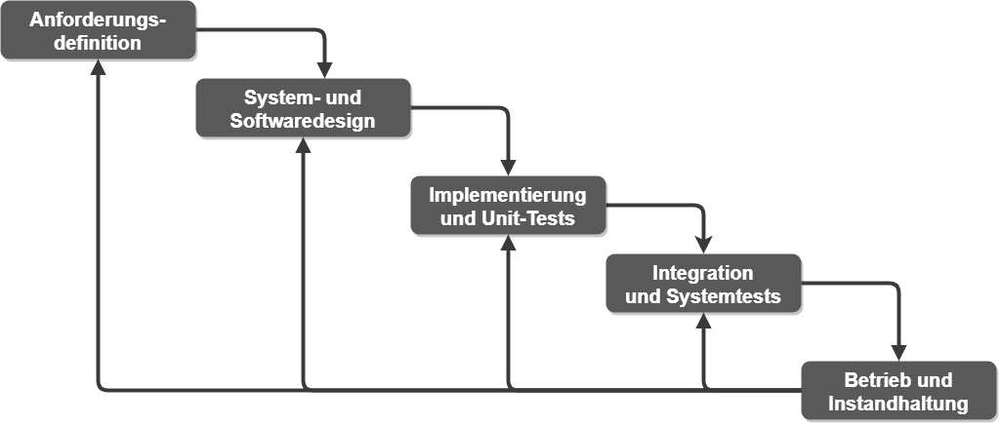
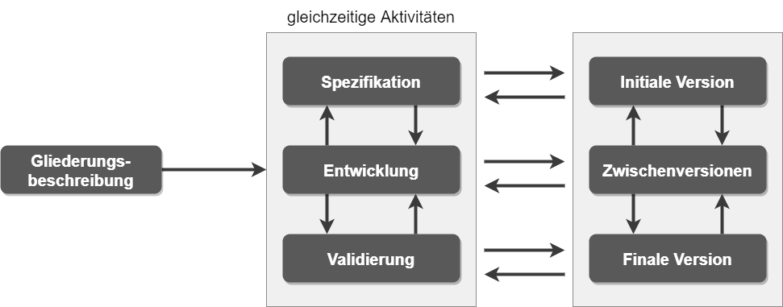
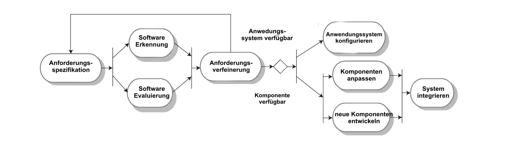
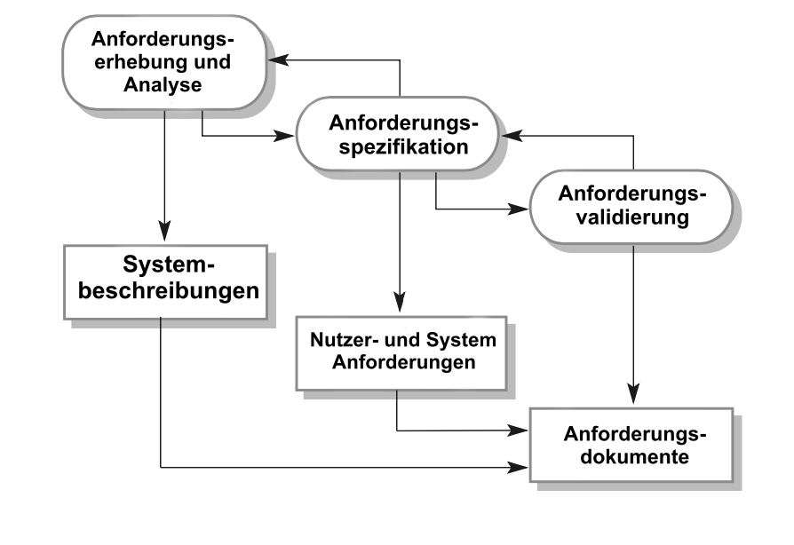

# Software processes

**Autor:** Artem Shipilov

## Ziele:
* **die Konzepte von Softwareprozessen** und Softwareprozessmodellen verstehen;
* wurden in **drei allgemeine Software-Prozessmodelle** eingeführt und wann sie verwendet werden könnten;
* **die grundlegenden Prozessaktivitäten** des Software Requirements Engineering, der Softwareentwicklung, des Testens und der Evolution kennen;
* verstehen, **warum Prozesse organisiert werden sollten**, um mit Änderungen in den Softwareanforderungen und -designs fertig zu werden;
* den Begriff der **Softwareprozessverbesserung** und die Faktoren verstehen, die die Softwareprozessqualität beeinflussen.

Ein Softwareprozess ist eine Reihe zusammenhängender Aktivitäten, die zur Produktion eines Softwaresystems führen.

Es gibt keinen allgemeingültigen Softwareprozess. Der in verschiedenen Unternehmen verwendete Prozess hängt von der Art der zu entwickelnden Software, den Anforderungen des Kunden und den Fähigkeiten der Personen ab, die die Software schreiben.

Es gibt jedoch viele verschiedene Softwareprozesse, die alle die vier grundlegenden Softwareentwicklungsaktivitäten umfassen müssen:
1. Softwarespezifikation. Die Funktionalität der Software und Einschränkungen für ihren Betrieb müssen definiert werden.
2. Softwareentwicklung. Die Software zur Erfüllung der Spezifikation muss erstellt werden.
3. Softwarevalidierung. Die Software muss validiert werden, um sicherzustellen, dass sie das tut, was der Kunde will.
4. Softwareentwicklung. Die Software muss sich weiterentwickeln, um den sich ändernden Kundenanforderungen gerecht zu werden.

Diese komplexen Aktivitäten umfassen Anforderungsprüfung, Architekturdesign und Komponententests. Die Prozesse umfassen auch das Softwarekonfigurationsmanagement und die Projektplanung, die die Produktionsaktivitäten unterstützen.

Wenn wir Prozesse beschreiben und diskutieren, sprechen wir normalerweise von Aktivitäten in diesen Prozessen. Bei der Beschreibung von Prozessen ist es aber auch wichtig zu beschreiben, wer beteiligt ist, was produziert wird und welche Bedingungen den Handlungsablauf beeinflussen:
1. Produkte oder Ergebnisse sind die Ergebnisse der Aktivitäten des Prozesses.
2. Rollen spiegeln die Verantwortlichkeiten der am Prozess beteiligten Personen wider.
3. Vor- und Nachbedingungen sind die Bedingungen, die erfüllt sein müssen, bevor und nachdem die Prozesstätigkeit durchgeführt oder das Produkt hergestellt wurde. Beispielsweise kann eine Vorbedingung vor Beginn des architektonischen Entwurfs die Zustimmung des Kunden zu allen Anforderungen sein; Nachdem diese Aktion abgeschlossen ist, kann die Nachbedingung eine Validierung der UML-Modelle sein, die die Architektur beschreiben.

Softwareprozesse sind komplex und hängen von den Menschen ab, die die Entscheidungen treffen. Da es keinen einheitlichen Prozess gibt, haben die meisten Softwareunternehmen ihre eigenen Entwicklungsprozesse entwickelt. Prozesse entwickeln sich ständig weiter. Sicherheitskritische Systeme erfordern einen sehr strukturierten Entwicklungsprozess, der detaillierte Aufzeichnungen führt. Für Geschäftssysteme mit sich schnell ändernden Anforderungen ist ein flexiblerer Prozess wahrscheinlich am besten geeignet.

Die Planung ist ein fester Bestandteil aller Prozesse. Plangesteuerte Prozesse sind Prozesse, bei denen alle Aktivitäten des Prozesses im Voraus geplant und der Fortschritt anhand dieses Plans gemessen wird. In agilen Prozessen erfolgt die Planung inkrementell und kontinuierlich mit der Entwicklung der Software. In der Regel muss bei großen Systemen eine Balance zwischen geplanten und flexiblen Prozessen gefunden werden.

Organisationen können ihre Prozesse verbessern, indem sie Praktiken wie UML-Modellierung und testgetriebene Entwicklung übernehmen.

## 2.1 Software-Prozessmodelle
Jedes Prozessmodell liefert nur teilweise Informationen über diesen Prozess. Das heißt, wir sehen die Struktur des Prozesses, aber nicht die Details seiner Aktivitäten.
Diese Modelle sind abstrakte Prozessbeschreibungen, mit denen sich die Softwareentwicklung erklären lässt.
Allgemeine Prozessmodelle:

1. Das Wasserfallmodell nimmt die Hauptaktivitäten des Spezifikations-, Entwicklungs-, Verifikations- und Evolutionsprozesses und stellt sie als separate Prozessschritte wie Anforderungsspezifikation, Softwaredesign, Implementierung und Test dar.
2. Inkrementelle Entwicklung. Dieser Ansatz wechselt zwischen Spezifikation, Entwicklung und Verifikation. Das System wird in einer Reihe von Versionen (Inkremente) entwickelt, wobei die neue Version der vorherigen Version Funktionalität hinzufügt.
3. Integration und Anpassung. Dieser Ansatz basiert auf wiederverwendbaren Komponenten oder Systemen. Der Entwicklungsprozess konzentriert sich darauf, diese Komponenten für den Einsatz in neuen Umgebungen anzupassen und in das System zu integrieren.

Der richtige Prozess hängt von den Anforderungen des Kunden und der Umgebung ab, in der die Software verwendet werden soll, sowie von der Art der zu entwickelnden Software. Beispielsweise wird sicherheitskritische Software normalerweise in einem (1.) Wasserfallprozess entwickelt, da viele Analysen und Dokumentationen erforderlich sind, bevor die Implementierung beginnen kann. Softwareprodukte werden heute immer nach dem (2.) inkrementellen Prozessmodell entwickelt. Geschäftssysteme werden oft entwickelt, indem bestehende Systeme (3.) angepasst und integriert werden, um ein neues System mit der gewünschten Funktionalität zu erstellen.

Bei großen Systemen ist es sinnvoll, einige der besten Eigenschaften aller gängigen Prozesse zu kombinieren. Subsysteme in einem größeren System können mit verschiedenen Ansätzen entwickelt werden. Teile des Systems, die gut verstanden sind, können mithilfe eines wasserfallbasierten Prozesses identifiziert und entwickelt werden. Andere Teile des Systems sollten immer in Inkrementen entwickelt werden. In beiden Fällen werden Softwarekomponenten wahrscheinlich wiederverwendet.

Es wurden verschiedene Versuche unternommen, „universelle“ Prozessmodelle zu entwickeln, die sich auf all diese allgemeinen Modelle stützen. Eines der bekanntesten dieser universellen Modelle ist der Rational Unified Process (RUP) (Krutchen 2003), der von Rational, einem US-amerikanischen Softwareentwicklungsunternehmen, entwickelt wurde. Das RUP ist ein flexibles Modell, das auf unterschiedliche Weise instanziiert werden kann, um Prozesse zu erstellen, die einem der hier besprochenen allgemeinen Prozessmodelle ähneln. Das RUP wurde von einigen großen Softwareunternehmen (insbesondere IBM) übernommen, hat jedoch keine breite Akzeptanz gefunden.

### 2.1.1 Das Wasserfallmodell

Das erste veröffentlichte Softwareentwicklungsprozessmodell wurde von technischen Prozessmodellen abgeleitet, die bei der Entwicklung großer militärischer Systeme verwendet wurden (Royce, 1970). Es stellt den Softwareentwicklungsprozess als eine Reihe von Schritten dar, wie in Abbildung 2.1 dargestellt. Aufgrund des kaskadierenden Übergangs von einer Phase zur nächsten wird dieses Modell als Wasserfallmodell bezeichnet. Das Wasserfallmodell ist ein Beispiel für einen plangesteuerten Prozess. Die Planung und Terminierung aller Prozessaktivitäten erfolgt vor der Softwareentwicklung.

**Abbildung 2.1: Das Wasserfallmodell**

Die Stufen des Wasserfallmodells spiegeln direkt die Hauptaktivitäten der Softwareentwicklung wider:
1. Anforderungsdefinition. Die Dienste, Einschränkungen und Ziele des Systems werden durch Rücksprache mit Systembenutzern festgelegt. Anschließend werden sie detailliert definiert und dienen als Systemspezifikation.
2. System- und Softwaredesign. Der Systemdesignprozess ordnet die Anforderungen entweder Hardware- oder Softwaresystemen zu. Es baut eine Gesamtsystemarchitektur auf. Softwaredesign beinhaltet die Identifizierung und Beschreibung der grundlegenden Abstraktionen von Softwaresystemen und ihrer Beziehungen.
3. Implementierung und Unit-Tests. In dieser Phase wird das Softwaredesign als Satz von Programmen oder Programm Einheiten realisiert. Beim Unit-Test wird überprüft, ob jede Unit ihre Spezifikation erfüllt.
4. Integrations- und Systemtests. Die einzelnen Programm Einheiten bzw. Programme werden als Gesamtsystem integriert und getestet, um sicherzustellen, dass die Softwarevoraussetzungen erfüllt sind. Nach dem Test wird das Softwaresystem an den Kunden geliefert.
5. Betrieb und Wartung. Normalerweise ist dies die längste Lebenszyklusphase. Das System wird installiert und in den praktischen Einsatz gebracht. Die Wartung umfasst die Korrektur von Fehlern, die in früheren Phasen des Lebenszyklus nicht entdeckt wurden, die Verbesserung der Implementierung von Systemeinheiten und die Verbesserung der Systemdienste, wenn neue Anforderungen entdeckt werden.

Das Ergebnis jeder Stufe des Wasserfallmodells sind ein oder mehrere genehmigte Dokumente. Die nächste Phase darf nicht beginnen, bevor die vorherige Phase abgeschlossen ist. Dies ist sinnvoll für die Hardwareentwicklung, bei der hohe Herstellungskosten erforderlich sind.

Der Softwareprozess in der Praxis ist nie ein einfaches lineares Modell, sondern beinhaltet Rückkopplungen von einer Phase zur anderen.

Wenn in einem Prozessschritt neue Informationen verfügbar werden, sollten die in den vorherigen Schritten erstellten Dokumente geändert werden, um die erforderlichen Systemänderungen widerzuspiegeln. Wenn beispielsweise festgestellt wird, dass die Implementierung einer Anforderung zu teuer ist, sollte das Anforderungsdokument geändert werden, um die Anforderung zu entfernen. Dies erfordert jedoch die Zustimmung des Kunden und verzögert den gesamten Entwicklungsprozess.

Infolgedessen können sowohl Kunden als auch Entwickler die Softwarespezifikation vorzeitig einfrieren, um weitere Änderungen zu verhindern. Leider bedeutet dies, dass Probleme später gelöst, ignoriert oder programmiert werden. Ein vorzeitiges Einfrieren von Anforderungen kann dazu führen, dass das System nicht das tut, was der Benutzer wünscht. Es kann auch zu schlecht strukturierten Systemen führen.

In der Endphase des Lebenszyklus werden Fehler und Auslassungen in den anfänglichen Softwareanforderungen identifiziert. Es treten Softwarefehler auf, und es besteht Bedarf an neuen Funktionen.

Daher muss sich das System weiterentwickeln, um nützlich zu bleiben. Das Vornehmen dieser Änderungen erfordert möglicherweise das Wiederholen vorheriger Schritte im Prozess.

Tatsächlich sollte Software flexibel sein und sich während ihrer Entwicklung an Änderungen anpassen. Aufgrund der Notwendigkeit, das System bei Änderungen frühzeitig zu verfeinern, ist das Wasserfallmodell nur für einige Arten von Systemen geeignet:
1. Eingebettete Systeme, bei denen Software mit Hardwaresystemen interagieren muss. Aufgrund der Inflexibilität von Hardware ist es in der Regel nicht möglich, Entscheidungen über Softwarefunktionen erst nach deren Implementierung zu treffen.
2. Kritische Systeme, bei denen eine umfassende Sicherheitsanalyse der Softwarespezifikation und des Softwaredesigns erforderlich ist. Bei diesen Systemen müssen die Spezifikations- und Entwurfsdokumentation vollständig sein, damit diese Analyse möglich ist. Sicherheitsprobleme in der Spezifikation und im Design sind normalerweise sehr teuer, um sie während der Implementierungsphase zu beheben.
3. Große Softwaresysteme, die Teil umfassenderer technischer Systeme sind, die von mehreren Partnerunternehmen entwickelt wurden. Hardware in Systemen kann nach einem ähnlichen Modell entworfen werden, und es ist für Unternehmen einfacher, ein gemeinsames Modell für Hardware und Software zu verwenden. Wenn mehrere Unternehmen beteiligt sind, können außerdem vollständige Spezifikationen erforderlich sein, um eine unabhängige Entwicklung der verschiedenen Subsysteme zu ermöglichen.

Das Wasserfallmodell ist kein geeignetes Vorgehensmodell in Situationen, in denen eine informelle Teamkommunikation möglich ist und sich die Softwareanforderungen schnell ändern. Agile Methoden sind für diese Systeme besser geeignet.

Eine wichtige Variante des Wasserfallmodells ist die formale Systementwicklung, bei der ein mathematisches Modell der Systemspezifikation erstellt wird. Dieses Modell wird dann durch mathematische Transformationen in ausführbaren Code verfeinert. Formale Entwicklungsprozesse wie Methode B (Abrial 2005, 2010) werden hauptsächlich bei der Entwicklung von Softwaresystemen verwendet, die strenge Sicherheits-, Zuverlässigkeits- oder Sicherheitsanforderungen haben. Der formale Ansatz erleichtert das Schreiben eines Sicherheitsfalls. Aufgrund der hohen Kosten für die Entwicklung einer formalen Spezifikation wird dieses Entwicklungsmodell jedoch selten verwendet.

## 2.1.2 Inkrementelle Entwicklung

Die inkrementelle Entwicklung basiert auf der Idee, eine Implementierung zu entwickeln, Feedback von Benutzern und anderen einzuholen und die Software über mehrere Versionen hinweg weiterzuentwickeln, bis das erforderliche System entwickelt ist (Abbildung 2.2).
Spezifikations-, Entwicklungs- und Validierungsaktivitäten sind verschachtelt und nicht getrennt, mit aktivitätenübergreifendem Feedback.

**Abbildung 2.2: Inkrementelle Entwicklung**

Die inkrementelle Entwicklung ist derzeit der am weitesten verbreitete Ansatz in der Softwareentwicklung. Dieser Ansatz kann geplant, flexibel oder meistens eine Kombination dieser Ansätze sein. Bei einem planmäßigen Vorgehen werden Systeminkremente im Voraus festgelegt; Wenn ein agiler Ansatz gewählt wird, werden frühe Inkremente identifiziert, aber die Entwicklung späterer Inkremente hängt von den Prioritäten des Kunden ab.

Inkrementelle Softwareentwicklung, die ein grundlegender Bestandteil agiler Entwicklungsmethoden ist, ist besser als ein Wasserfallansatz für Systeme, deren Anforderungen sich wahrscheinlich während des Entwicklungsprozesses ändern. Dies ist bei den meisten Geschäftssystemen und Softwareprodukten der Fall. Indem die Software inkrementell entwickelt wird, ist es billiger und einfacher, Änderungen an der Software vorzunehmen, während sie entwickelt wird.

Jedes Inkrement oder jede Version des Systems enthält einige der Funktionen, die vom Kunden benötigt werden. Im Allgemeinen enthalten die frühen Inkremente des Systems die wichtigsten oder am dringendsten benötigten Funktionen. Das bedeutet, dass der Kunde oder Anwender das System in einem relativ frühen Stadium der Entwicklung dahingehend bewerten kann, ob es die Anforderungen erfüllt. Wenn nicht, muss nur das aktuelle Inkrement geändert und ggf. neue Funktionalität für spätere Inkremente definiert werden. Die inkrementelle Entwicklung hat gegenüber dem Wasserfallmodell drei wesentliche Vorteile:
1. Die Kosten für die Implementierung von Anforderungsänderungen werden reduziert. Der erneute Analyse- und Dokumentationsaufwand ist deutlich geringer als beim Wasserfallmodell.
2. Es ist einfacher, Kundenfeedback über die geleistete Entwicklungsarbeit einzuholen. Kunden können Demonstrationen der Software kommentieren und sehen, wie viel implementiert wurde. Kunden finden es schwierig, den Fortschritt anhand von Softwaredesigndokumenten zu beurteilen.
3. Eine vorzeitige Lieferung und Bereitstellung nützlicher Software an den Kunden ist möglich, auch wenn nicht alle Funktionen enthalten sind. Kunden können die Software früher nutzen und daraus Nutzen ziehen, als dies mit einem Wasserfallprozess möglich ist.

Aus Managementsicht hat der inkrementelle Ansatz zwei Probleme:
1. Der Prozess ist nicht sichtbar. Wenn Systeme schnell entwickelt werden, ist es nicht kosteneffektiv, Dokumente zu erstellen, die jede Version des Systems widerspiegeln.
2. Die Systemstruktur verschlechtert sich, wenn neue Inkremente hinzugefügt werden. Regelmäßige Änderungen führen zu chaotischem Code, da neue Funktionen auf jede erdenkliche Weise hinzugefügt werden. Es wird immer schwieriger und kostspieliger, einem System neue Funktionen hinzuzufügen. Um die strukturelle Verschlechterung und allgemeine Code-Unordnung zu reduzieren, schlagen agile Methoden vor, dass Sie die Software regelmäßig umgestalten (verbessern und neu strukturieren) sollten.

Die Probleme der inkrementellen Entwicklung werden groß bei großen, komplexen Systemen mit langer Lebensdauer, bei denen verschiedene Teams verschiedene Teile des Systems entwickeln. Große Systeme benötigen ein stabiles Framework oder eine stabile Architektur, und die Verantwortlichkeiten der verschiedenen Teams, die an Teilen des Systems arbeiten, müssen in Bezug auf diese Architektur klar definiert werden. Dies muss im Voraus geplant und nicht schrittweise entwickelt werden.

Sie können ein System inkrementell entwickeln und es Kunden und anderen Stakeholdern zur Kommentierung zur Verfügung stellen, ohne es unbedingt zu liefern und in der Umgebung des Kunden einzusetzen. Es ist jedoch nicht immer möglich, Feedback zu geben, da das Experimentieren mit neuer Software normale Geschäftsprozesse stören kann.

## 2.1.3 Integration und Konfiguration

In den meisten Softwareprojekten gibt es eine gewisse Wiederverwendung von Software. Dies geschieht häufig, wenn Projektmitarbeiter Code kennen oder suchen, der dem Erforderlichen ähnlich ist. Sie suchen nach diesen, modifizieren sie nach Bedarf und integrieren sie in den neu entwickelten Code.

Diese informelle Wiederverwendung findet unabhängig vom verwendeten Entwicklungsprozess statt. Seit dem Jahr 2000 sind jedoch Softwareentwicklungsprozesse weit verbreitet, die sich auf die Wiederverwendung bestehender Software konzentrieren.

Drei Arten von Softwarekomponenten werden häufig wiederverwendet:
1. Eigenständige Anwendungssysteme, die für die Verwendung in einer bestimmten Umgebung konfiguriert sind. Diese Systeme sind Allzwecksysteme, müssen jedoch für den Einsatz in einer bestimmten Anwendung angepasst werden.
2. Sammlungen von Objekten, die als Komponente oder als Paket entwickelt werden, um in ein Komponenten-Framework integriert zu werden.
3. Webdienste, die gemäß Dienststandards entwickelt wurden und für den Fernaufruf über das Internet verfügbar sind.

------------

Die Abbildung 2.3 zeigt ein allgemeines Vorgehensmodell für die wiederverwendungsbasierte Entwicklung, wie z.B basierend auf
Integration und Konfiguration. 

**Abbildung 2.3: Wiederverwendungsorientiertes Software Engineering**

Es sind folgende Phasen dargestellt:

1.	**Anforderungsspezifikation.** Hier sind die anfänglichen Anforderungen an das System gestellt.bDiese müssen nicht im Detail ausgearbeitet werden, sollten aber kurz sein, wie Beschreibungen der wesentlichen Anforderungen und Systemmerkmale
2. **Software-Erkennung und -Evaluierung** unter Berücksichtigung einer Übersicht über die Software-Anforderungen. Gesucht werden die Komponenten und Systeme, die die geforderte Funktionalität bieten. Hierfür werden die in Frage kommenden Komponenten und Systeme bewertet und ob sie die Anforderungen erfüllen. Wichtig ist es auch , dass die auch für den Einsatz im System geeignet sind. 
3. **Verfeinerung der Anforderungen.** In dieser Phase werden die Anforderungen  anhand von gegebenen Informationen über die gefundenen Komponenten und Anwendungen verfeinert. Dafür werden Anforderungen an verfügbaren Komponenten angepasst und die Systemspezifikationen neu definiert. Wenn aber einige Modifikationen nicht möglich sind, muss man die Analyse von Komponenten hierfür erneut aufnehmen und nach alternativen Möglichkeiten suchen. 
4. **Konfiguration des Anwenungssystems.** Wenn ein Standartanwendungssystem verfügbar ist, das auch die Anforderungen natürlich  erfüllt, kann es hier eine Konfiguration des neuen Systems erstellt werden. 
5. **Komponentenanpassung und Integration.** Wenn es kein Standartsystem gibt, können einzelne Komponente modifiziert werden. Man kann die dann integrieren, um ein System zu erstellen. 

Zusammenfassend würde man sagen, dass es einen relativen Vorteil hat, um die Menge der zu entwickelnden Software zu reduzieren und somit Kosten und Risiken zu reduzieren. Somit führt dies zu einer schnelleren Auslieferung der Software. Es gibt aber oft Fälle, wo die Anforderungen im System nicht den tatsächlich Bedürfnissen der Benutzer entsprechen. Darüber hinaus geht ein Teil der Kontrolle über die Systementwicklung verloren, da neue Versionen der wiederverwendbaren Komponenten nicht unter der Kontrolle der Organisation sind, die sie verwendet. Deswegen ist die Wiederverwendung von Software sehr wichtig.

## 2.2 Aktivitäten verarbeiten 

Echte Softwareprozesse sind verschachtelte Abläufe von technischen, kollaborativen und organisatorischen Aktivitäten mit dem übergeordneten Ziel, um ein Softwaresystem zu entwerfen, durchaus zu spezifizieren und implementieren und natürlich zu testen. Heutzutage sind die Prozesse meist Tool-gestützt. Das bedeutet, dass die Softwareentwickler eine Reihe von Softwaretools verwenden können, um eine Hilfe zu leisten, wie z.B Anforderungsmanagementsysteme , Desoignmodelleditoren, Programmeditoren , automatisierte Testwerkzeuge und Debugger. Die vier grundlegende Prozessaktivitäten , wie Spezifikation, Entwicklung, Validieren und Evolution sind in verschiedenen Entwicklungsprozessen auch unterschiedlich organisiert. Zum Beispiel bei einem Wasserfallmodell  werden die Entwicklungen anhand aufeinanderfolgenden Phasen abgebildet und während der inkrementellen Entwicklung in Einzelteilen erstellt und diese Inkremente werden dann anwendungsfähig ausgeliefert.

Wie diese Aktivitäten jedoch ausgeführt werden, hängt von der Art der zu entwickelten Software ab, sowie Erfahrung und Kompetenz der Entwickler und der Art der Organisation , die die Software entwickelt. 

## 2.2.1 Spezifikation von Software

Softwarespezifikation oder Requirements Engineering ist der Prozess des Verstehens und Definierens, welche Dienste von System benötigt werden. Wichtig zu erwähnen ist,  dass es hier um das Spezifikation und Verwalten von Anforderungen an ein System bzw. Software geht sowie allgemein um die Entwicklung des Systems. Das Requirements Engineering ist eine besonders kritische Phase des Softwareprozesses , da Fehler, die in dieser Phase gemacht werden, zum späteren Problemen bei der Systemgestaltung und Implementierung führen können.

Vor dem beginn des Requirements-Engineering-Prozesses kann ein Betrieb eine Machbarkeitsstudie durchführen, die mögliche Lösungsansätze überprüft und analysiert. Es kann schon am Anfang die Frage beantwortet werden, ob eine detaillierte Analyse durchgeführt werden soll oder nicht. Ziel ist hier, eine Anforderungsdokumentation zu erstellen sowie auch mit der Prüfung und Abstimmung von Anforderungen mit den Stakeholdern. Die Anforderungen werden in der Regel auf zwei Detailebenen dargestellt. Endbenutzer bzw. Kunden benötigen eine allgemeine Erklärung der Anforderungen; die Systementwickler eine detaillierte Systemspezifikation. Um Missverständnisse zu vermeiden, sollte immer darauf geachtet werden, zwischen den Kommunikationspartnern Klarheit zu schaffen und Rücksprache zu halten. 

**Abbildung 2.4: Der Requirements-Engineering-Prozess**

Es gibt 3 Hauptaktivitäten im Requirements-Engineering-Prozess:

1. **Anforderungserhebung- und Analyse.** Dieses ist der Prozess der Ableitung der Systemanforderungen,durch das Beobachten bestehender Systeme, Diskussionen mit potenziellen Benutzern. Dies kann die Entwicklung eines oder mehreren Prototypen und Systemmodellen beinhalten. Auch Detaillierenden und Verfeinerung gehören dazu. 
2. **Anforderungsspezifikation.** In diesem Prozess werden die gesammelten Informationen in ein Dokument überführt. Dieses Dokument kann zwei Arten von Anforderungen enthalten. Hier handelt sich hier von Formulierung von Anforderungen auf End-User Level (high level) und Systemlevel (genauere Beschreibung der bereitzustellenden Funktionalität) 
3. **Anforderungsvalidierung.** Diese Aktivität überprüft die aufgenommenen Anforderungen hinsichtlich Umsetzbarkeit und  Vollständigkeit. Aktivität soll Qualität sicherstellen bzw. Fehler werden hierdurch gefunden. 

Die Aktivitäten sind verschachtelt und laufen während der Analyse weiter, so dass Anforderungen mit der Zeit weiter verfeinert werden können oder fehlende Anforderungen nachgepflegt werden können. 

## 2.2.2 Software Design und Implementierung 

Die Implementierungsphase der Softwareentwicklung ist eine Aktivität welche das Ziel hat eine ausführbare Software zu liefern. Abhängig von Prozess Modell können die Aktivitäten Design und Implementierung getrennt vorhanden sein. Zum Beispiel bei agilem Vorgehen i.d.R. vermischt/verknüpft. Dadurch werden keine getrennten offiziellen Designdokumente erstellt.  Das Design wird informell auf Notebooks festgehalten. 
Ein Softwareentwurf ist eine Beschreibung der Struktur der zu implementierenden Software, der vom System verwendeten Datenmodelle - und Strukturen, der Schnittstellen zwischen Systemkomponenten und der Algorithmen, ist aber eher selten. 

In der Abbildung 2.5 ist ein abstraktes Modell des Designprozesses dargestellt, das die Eingaben für den Prozess, Aktivitäten und die Ergebnisse zeigt. die Designprozessaktivitäten sind sowohl hier verschachtelt als auch voneinander abhängig. Nacharbeiten sind hier nicht auszuschließen, da es ständig neue Informationen über das Design generiert werden. 

Die Softwareplattform, in der die Software ausgeführt wird, besteht aus einem Betriebssystem, die Datenbank ,die Middleware und andere Anwendungssysteme. Informationen über diese Plattform sind ein wichtiger Teil für den Designprozess, da es auch Entscheidungen getroffen werden müssen, wie man die Prozesse integrieren soll. Für die Verarbeitung im System der vorhandenen Daten, kann die Beschreibung dieser Daten in die Plattformspezifikation aufgenommen werden. Sonst muss die Datenbeschreibung eine Eingabe in den Entwurfsprozess gemacht werden, damit die Systemdatenorganisation überhaupt definiert werden kann. 
Die Aktivitäten im Designprozess unterscheiden sich je nach Art des zu entwickelnden Systems. 
Ein Beispiel hierfür wäre , wenn ein Echtzeitsystem eine zusätzliche Phase des Timing-Designs erfordert, aber hier möglicherweise keine Datenbank enthält, sodass kein Datenbankdesign erforderlich ist. 

## Referenzen

[1]: Ian Sommerville. 2015. Software Engineering (10th. ed.), 43-71.

