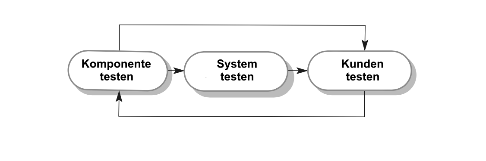
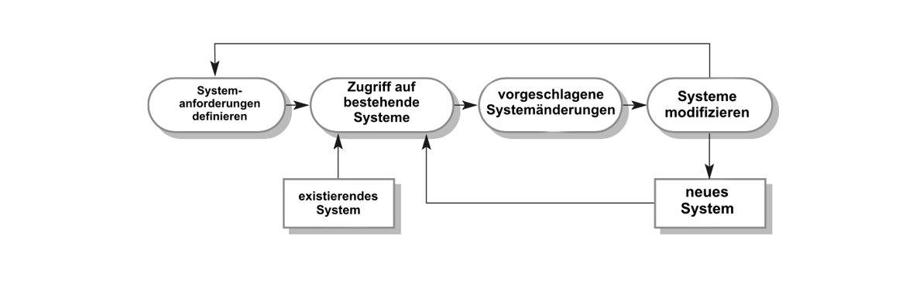
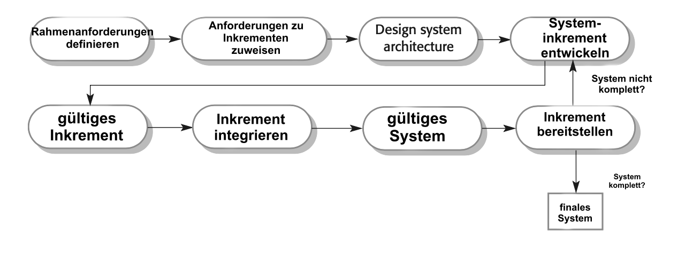
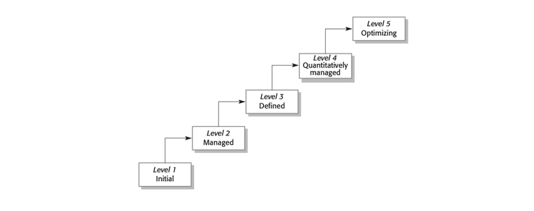

# Software processes

**Autor:** Artem Shipilov

## Ziele:
* **die Konzepte von Softwareprozessen** und Softwareprozessmodellen verstehen; 
* **die Einführung der drei allgemeinen Software-Prozessmodelle** und wann sie verwendet werden können;
* **die grundlegenden Prozessaktivitäten** des Software Requirements Engineering, der Softwareentwicklung, des Testens und der Evolution kennen;
* verstehen, **warum Prozesse organisiert werden sollten**, um mit Änderungen in den Softwareanforderungen und -designs fertig zu werden;
* den Begriff der **Softwareprozessverbesserung** und die Faktoren verstehen, die die Softwareprozessqualität beeinflussen.

**Ein Softwareprozess** ist eine Menge von Aktivitäten und damit zusammenhängenden Ergebnissen, die zur Herstellung eines Softwareprodukts führen. Dazu kann die Entwicklung von Software von Grund auf zählen, obwohl immer häufiger der Fall eintritt, dass neue Software entwickelt wird, indem bestehende Systeme erweitert und verändert werden. 

Es gibt keinen idealen Softwareprozess, da in verschiedenen Unternehmen verwendete Prozesse von der Art der zu entwickelnden Software, den Anforderungen des Kunden und den Fähigkeiten der Personen ab, die die Software entwickeln abhängen.

Obwohl es viele verschiedene Softwareprozesse gibt, gibt es einige grundlegende Abläufe, die alle Softwareprozesse gemeinsam haben:
1. **Softwarespezifikation.** Die Funktionen der Software und die Beschränkungen ihrer Benutzung müssen definiert werden.
2. **Softwareentwicklung.** Die Software, die diese Anforderungen erfüllen soll, muss erstellt werden.
3. **Softwarevalidierung.** Die Software muss validiert werden, um sicherzustellen, dass sie das tut, was der Kunde will.
4. **Weiterentwicklung von Software.** Die Software muss sich weiterentwickeln, um mit den sich veränderten Bedürfnissen des Kunden (Kundenanforderungen) gerecht zu werden.

Die komplexen Aktivitäten umfassen Anforderungsprüfung, Architekturdesign und Komponententests. Die Prozesse umfassen auch das Softwarekonfigurationsmanagement und die Projektplanung, die die Produktionsaktivitäten unterstützen.

Wenn wir Prozesse beschreiben, sprechen wir normalerweise von Aktivitäten in diesen Prozessen. Bei der Beschreibung von Prozessen ist es aber auch wichtig zu beschreiben, wer beteiligt ist, was produziert wird und welche Bedingungen den Handlungsablauf beeinflussen:
1. **Produkte oder Leistungen** sind **die Ergebnisse der Aktivitäten** des Prozesses.
2. **Rollen spiegeln die Verantwortlichkeiten** der am Prozess beteiligten Personen wider.
3. **Vor- und Nachbedingungen** sind die Bedingungen, die erfüllt sein müssen, bevor und nachdem die Prozesstätigkeit durchgeführt oder das Produkt hergestellt wurde. Beispielsweise kann eine Vorbedingung vor Beginn des architektonischen Entwurfs die Zustimmung des Kunden zu allen Anforderungen sein; Nachdem diese Aktion abgeschlossen ist, kann die Nachbedingung eine Validierung der UML-Modelle sein, die die Architektur beschreiben.

**Softwareprozesse** sind komplex und **hängen von den Menschen ab**, die die Entscheidungen treffen. Da es keinen einheitlichen Prozess gibt, haben die meisten Softwareunternehmen ihre eigenen Entwicklungsprozesse entwickelt. Prozesse entwickeln sich ständig weiter. Sicherheitskritische Systeme erfordern einen sehr strukturierten Entwicklungsprozess, der detaillierte Aufzeichnungen führt. Für Geschäftssysteme mit sich schnell ändernden Anforderungen ist ein flexiblerer Prozess wahrscheinlich am besten geeignet.

Die Planung ist ein fester Bestandteil aller Prozesse. Plangesteuerte Prozesse sind Prozesse, bei denen alle Aktivitäten des Prozesses im Voraus geplant und der Fortschritt anhand dieses Plans gemessen wird. In agilen Prozessen erfolgt die Planung inkrementell und kontinuierlich mit der Entwicklung der Software. In der Regel muss bei großen Systemen eine Balance zwischen geplanten und flexiblen Prozessen gefunden werden.

Organisationen können ihre Prozesse verbessern, indem sie Praktiken wie UML-Modellierung und testgetriebene Entwicklung übernehmen.

## 2.1 Software-Prozessmodelle
In diesem Abschnitt werde ich eine Anzahl sehr allgemeiner Prozessmodelle einführen und sie vom Standpunkt der Architektur vorstellen. Das heißt, wir sehen den Rahmen des Prozesses, aber keine Details über die speziellen Abläufe. Diese allgemeinen Modelle sind keine endgültigen Beschreibungen der Softwareprozesse, sondern vielmehr nützliche Abstraktionen, die benutzt werden können, um verschiedene Ansätze der Softwareentwicklung zu erläutern.

Allgemeine Prozessmodelle sind: 
1.	**Das Wasserfallmodell.** Dieses Modell stellt die grundlegenden Prozessabläufe wie Spezifikation, Entwicklung, Validierung und Weiterentwicklung als eigenständige Phasen des Prozesses dar, wie zum Beispiel als Spezifikation der Anforderungen, als Softwareentwurf, Implementierung, Tests usw.
2. **Inkrementelle Entwicklung.** Dieser Ansatz wechselt zwischen Spezifikation, Entwicklung und Verifikation. Das System wird in einer Reihe von Versionen (Inkremente) entwickelt, wobei die neue Version der vorherigen Version Funktionalität hinzufügt.
3. **Integration und Anpassung.** Dieser Ansatz basiert auf wiederverwendbaren Komponenten oder Systemen. Der Entwicklungsprozess konzentriert sich darauf, diese Komponenten für den Einsatz in neuen Umgebungen anzupassen und in das System zu integrieren.

**Der richtige Prozess hängt von den Anforderungen** des Kunden und der Umgebung ab, in der die Software verwendet werden soll, sowie von der Art der zu entwickelnden Software. 

Beispielsweise wird **sicherheitskritische Software** normalerweise in einem (1.) **Wasserfallprozess entwickelt**, da viele Analysen und Dokumentationen erforderlich sind, bevor die Implementierung beginnen kann. **Softwareprodukte** werden heute immer nach dem (2.) **inkrementellen Prozessmodell** entwickelt. **Geschäftssysteme** werden oft entwickelt, indem bestehende Systeme (3.) **angepasst und integriert** werden, um ein neues System mit der gewünschten Funktionalität zu erstellen.

Bei **großen Systemen** ist es sinnvoll, einige der besten Eigenschaften aller gängigen **Prozesse zu kombinieren.** Subsysteme in einem größeren System können mit verschiedenen Ansätzen entwickelt werden. Teile des Systems, die gut verstanden sind, können mithilfe eines wasserfallbasierten Prozesses identifiziert und entwickelt werden. Andere Teile des Systems sollten immer in Inkrementen entwickelt werden. In beiden Fällen werden Softwarekomponenten wahrscheinlich wiederverwendet.

### 2.1.1 Das Wasserfallmodell

Das erste veröffentlichte Modell für die Softwareentwicklung wurde aus einem Entwiclungsprozessen für große militärische Projekte abgeleitet (Royce, 1970). Es wird in Abbildung 2.1 dargestellt. Wegen der Kaskade von einer Phase zur Nächsten wird dieses Modell das „Wasserfall-Modell“ oder der Softwarelebenszyklus genannt. Das Wasserfallmodell ist ein Beispiel für einen plangesteuerten Prozess. Das bedeutet, dass alle Aktivitäten werden hier im vorhinein geplant. Die Planung und Terminierung aller Prozessaktivitäten erfolgt von der Softwareentwicklung.

**Abbildung 2.1: Das Wasserfallmodell**

Die wichtigen Phasen dieses Modells lassen sich auf grundlegende Entwicklungsaktivitäten abbilden:
1.	Anforderungsdefinition: Die Dienstleistungen, Einschränkungen und Ziele des Systems werden in Zusammenarbeit mit den Systembenutzern aufgestellt. Dann werden sie detaillierter definiert und dienen so als Systemspezifikationen. 
2.	System- und Softwaredesign: Der Systemdesignprozess (Systementwurfsprozess) teilt die Anforderungen in Hard-und Softwaresysteme auf und legt eine allgemeine Systemarchitektur fest. Beim Softwareentwurf geht es um das Erkennen und Beschreiben der grundlegenden abstrakten Softwaresysteme und ihrer Beziehungen zueinander. 
3.	Implementierung und Unit-Tests: In dieser Phase wird der Softwareentwurf in eine Reihe von Programmen oder Programmeinheiten umgesetzt. Das Testen der Einheiten stellt sicher, dass jede Einheit ihre Spezifikationen erfüllt. 
4.	Integration und Systemtest: Die einzelnen Programme oder Programmeinheiten werden zusammengeführt bzw. integriert und als Ganzes getestet, um sicherzustellen, dass die Softwareanforderungen erfüllt werden. Nach den Tests wird das Softwaresystem an den Kunden ausgeliefert.
5.	Betrieb und Instandhaltung: Normalerweise (aber nicht unbedingt) ist dies die längste Phase innerhalb des Lebenszyklus. Das System wird installiert und zum Gebrauch freigegeben. Zur Wartung gehörten das Korrigieren von Fehlern, die in den früheren Phasen nicht entdeckt wurden, die Verbesserung der Implementierung von Systemeinheiten und die Verbesserung des Systems, falls neue Anforderungen entdeckt werden.

Das Ergebnis jeder Stufe des Wasserfallsmodells sind ein oder mehrere genehmigte Dokumente.
Die nächste Phase sollte nicht beginnen, bevor nicht die vorherige abgeschlossen wurde. Dies ist sinnvoll für die Hardwareentwicklung, bei der hohe Herstellungskosten erforderlich sind. Während des Entwurfs werden Probleme mit den Anforderungen entdeckt, während des Programmierens fallen Fehler im Entwurf auf usw. Der Softwareprozess ist nicht einfach ein linearer Prozess, sondern besteht aus einer Reihe sich wiederholender Entwicklungsaktivitäten. 

Wegen der hohen Kosten bei der Herstellung und Abnahme von Dokumenten sind die Iterationen von Entwicklungsaktivitäten teuer und verlangen erhebliche Überarbeitungen.

Infolgedessen können sowohl Kunden als auch Entwickler die Softwarespezifikation vorzeitig einfrieren, um weitere Änderungen zu verhindern. Leider bedeutet dies, dass Probleme später gelöst, ignoriert oder programmiert werden. Ein vorzeitiges Einfrieren von Anforderungen kann dazu führen, dass das System nicht das tut, was der Benutzer wünscht. Es kann auch zu schlecht strukturierten Systemen führen.

In der letzten Phase des Lebenszyklus (Betrieb und Wartung) wird die Software in Betrieb genommen. Dabei werden Fehler und Lücken in den ursprünglichen Anforderungen identifiziert.

Das System muss sich also weiterentwickeln, um nützlich zu bleiben. Das Durchführen dieser Veränderungen (die Softwarewartung) kann zur Folge haben, dass einige oder alle der vorherigen Prozessphasen wiederholt werden müssen. 
Das Problem beim Wasserfall-Modell ist seine starre Aufteilung des Projektes in die verschiedenen Phasen. Zu einem frühen Zeitpunkt müssen Verpflichtungen eingegangen werden und das bedeutet, dass es schwer ist, sich auf neue Anforderungen des Kunden einzustellen. Daher sollte das Wasserfall-Modell nur Verwendung finden, wenn die Anforderungen gut durchdacht sind.

Tatsächlich sollte Software flexibel sein und sich während ihrer Entwicklung an Änderungen anpassen. Aufgrund der Notwendigkeit, das System bei Änderungen frühzeitig zu verfeinern, ist **das Wasserfallmodell nur für einige Arten von Systemen geeignet:**
1.	**Eingebettete Systeme,** bei denen Software mit Hardwaresystemen interagieren muss. Aufgrund der Inflexibilität von Hardware ist es in der Regel nicht möglich, Entscheidungen über Softwarefunktionen erst nach deren Implementierung zu treffen.
2. **Kritische Systeme,** bei denen eine umfassende Sicherheitsanalyse der Softwarespezifikation und des Softwaredesigns erforderlich ist. Bei diesen Systemen müssen die Spezifikations- und Entwurfsdokumentation vollständig sein, damit diese Analyse möglich ist. Sicherheitsprobleme in der Spezifikation und im Design sind normalerweise sehr teuer, um sie während der Implementierungsphase zu beheben.
3. **Große Softwaresysteme, die Teil umfassenderer technischer Systeme sind,** die von mehreren Partnerunternehmen entwickelt wurden. Hardware in Systemen kann nach einem ähnlichen Modell entworfen werden, und es ist für Unternehmen einfacher, ein gemeinsames Modell für Hardware und Software zu verwenden. Wenn mehrere Unternehmen beteiligt sind, können außerdem vollständige Spezifikationen erforderlich sein, um eine unabhängige Entwicklung der verschiedenen Subsysteme zu ermöglichen.

**Das Wasserfallmodell ist kein geeignetes Vorgehensmodell in Situationen**, in denen eine informelle Teamkommunikation möglich ist und sich **die Softwareanforderungen schnell ändern.** Agile Methoden sind für diese Systeme besser geeignet.

Eine wichtige Variante des Wasserfallmodells ist die formale Systementwicklung, bei der ein mathematisches Modell der Systemspezifikation erstellt wird. Dieses Modell wird dann durch mathematische Transformationen in ausführbaren Code verfeinert. Formale Entwicklungsprozesse wie Methode B (Abrial 2005, 2010) werden hauptsächlich bei der Entwicklung von Softwaresystemen verwendet, die strenge Sicherheits-, Zuverlässigkeits- oder Sicherheitsanforderungen haben. Der formale Ansatz erleichtert das Schreiben eines Sicherheitsfalls. Aufgrund der **hohen Kosten für die Entwicklung** einer formalen Spezifikation wird dieses Entwicklungsmodell jedoch **selten verwendet.**

## 2.1.2 Inkrementelle Entwicklung

Die inkrementelle Entwicklung basiert auf der Idee, eine Implementierung zu entwickeln, Feedback von Benutzern und anderen einzuholen und die Software über mehrere Versionen hinweg weiterzuentwickeln, bis das erforderliche System entwickelt ist (Abbildung 2.2).

Die inkrementelle Entwicklung ist derzeit der am weitesten verbreitete Ansatz in der Softwareentwicklung. Dieser Ansatz kann geplant, flexibel oder meistens eine Kombination dieser Ansätze sein. Bei einem planmäßigen Vorgehen werden Systeminkremente im Voraus festgelegt; Wenn ein agiler Ansatz gewählt wird, werden frühe Inkremente identifiziert, aber die Entwicklung späterer Inkremente hängt von den Prioritäten des Kunden ab.

**Abbildung 2.2: Die inkrementelle Softwareentwicklung**

Inkrementelle Softwareentwicklung, die ein grundlegender Bestandteil von agilen 
Entwicklungsmethoden ist. Es ist besser als ein Wasserfallansatz für Systeme, deren Anforderungen sich wahrscheinlich während des Entwicklungsprozesses ändern. Dies ist bei den meisten Geschäftssystemen und Softwareprodukten der Fall. Inkrementelle Entwicklung zeigt uns wie wir Probleme lösen können. Wir erarbeiten selten eine vollständige Problemlösung im Voraus, sondern bewegen uns in einer Reihe von Schritten auf eine Lösung zu und verfolgen sie zurück, wenn wir feststellen, dass wir einen Fehler gemacht haben. Durch die Entwicklung der Software inkrementell, ist es billiger und einfacher, Änderungen an der Software vorzunehmen, während sie entwickelt wird. Die frühen Inkremente des Systems beinhalten die wichtigsten Funktionen. Das heißt, dass der Kunde bzw. Anwender das System relativ früh evaluieren kann, um zu sehen, ob sie das liefert, was erforderlich ist. Wenn nicht, dann muss nur das aktuelle Inkrement geändert und ggf. neue Funktionalität definiert werden.

Es gibt drei wesentliche Vorteile gegenüber dem Wasserfallmodell:
1.	Die Kosten für die Implementierung von Anforderungsänderungen werden reduziert. Der erneute Analyse- und Dokumentationsaufwand ist deutlich geringer als beim Wasserfallmodell.
2.	Es ist einfacher, Kundenfeedback über die geleistete Entwicklungsarbeit einzuholen. Sowie die Kunden können sich die Dokumente des Prozesses ansehen.
3.	Eine vorzeitige Lieferung und Bereitstellung nützlicher Software an den Kunden ist möglich, auch wenn nicht alle Funktionen enthalten sind.

Aus Managementsicht hat der inkrementelle Ansatz zwei Probleme:
1.	Der Prozess ist nicht sichtbar: Manager brauchen in regelmäßigen Abständen Zwischenversionen, an denen sie den Fortschritt messen können. Wenn Systeme schnell entwickelt werden, ist es nicht kosteneffektiv, jede Version zu dokumentieren.
2.	Die Systeme sind oft schlecht strukturiert: Stetige Veränderungen neigen dazu, die Struktur der Software zu beeinträchtigen. Die Integration von Softwareänderungen wird zunehmend schwerer und teurer.
3.	Es könnten spezielle Werkzeuge und Techniken erforderlich werden: Diese können zwar eine schnelle Entwicklung unterstützen, sind aber vielleicht inkompatibel mit anderen Werkzeugen oder Techniken, und womöglich wissen nur relativ wenige Leute, wie man mit ihnen umgeht.

Die Probleme der inkrementellen Entwicklung werden groß bei großen, komplexen Systemen mit langer Lebensdauer, bei denen verschiedene Teams verschiedene Teile des Systems entwickeln. Große Systeme benötigen ein stabiles Framework oder eine stabile Architektur, und die Verantwortlichkeiten der verschiedenen Teams, die an Teilen des Systems arbeiten, müssen in Bezug auf diese Architektur klar definiert werden. Dies muss im Voraus geplant und nicht schrittweise entwickelt werden.

Sie können ein System inkrementell entwickeln und es Kunden und anderen Stakeholdern zur Kommentierung zur Verfügung stellen, ohne es unbedingt zu liefern und in der Umgebung des Kunden einzusetzen. Es ist jedoch nicht immer möglich, Feedback zu geben, da das Experimentieren mit neuer Software normale Geschäftsprozesse stören kann.

## 2.1.3 Integration und Konfiguration

In den meisten Softwareprojekten gibt es eine gewisse Wiederverwendung von Software. Dies geschieht häufig, wenn Projektmitarbeiter Code kennen oder suchen, der dem Erforderlichen ähnlich ist. Sie suchen nach diesen, modifizieren sie nach Bedarf und integrieren sie in den neu entwickelten Code.

Diese informelle Wiederverwendung findet unabhängig vom verwendeten Entwicklungsprozess statt. Seit dem Jahr 2000 sind jedoch Softwareentwicklungsprozesse weit verbreitet, die sich auf die Wiederverwendung bestehender Software konzentrieren.

Drei Arten von Softwarekomponenten werden häufig wiederverwendet:
1. Eigenständige Anwendungssysteme, die für die Verwendung in einer bestimmten Umgebung konfiguriert sind. Diese Systeme sind Allzwecksysteme, müssen jedoch für den Einsatz in einer bestimmten Anwendung angepasst werden.
2. Sammlungen von Objekten, die als Komponente oder als Paket entwickelt werden, um in ein Komponenten-Framework integriert zu werden.
3. Webdienste, die gemäß Dienststandards entwickelt wurden und für den Fernaufruf über das Internet verfügbar sind.

------------

Die Abbildung 2.3 zeigt ein allgemeines Vorgehensmodell für die wiederverwendungsbasierte Entwicklung, wie z.B basierend auf
Integration und Konfiguration. 

**Abbildung 2.3: Wiederverwendungsorientiertes Software Engineering**

Es sind folgende Phasen dargestellt:

1.	**Anforderungsspezifikation.** Hier sind die anfänglichen Anforderungen an das System gestellt.bDiese müssen nicht im Detail ausgearbeitet werden, sollten aber kurz sein, wie Beschreibungen der wesentlichen Anforderungen und Systemmerkmale
2. **Software-Erkennung und -Evaluierung** unter Berücksichtigung einer Übersicht über die Software-Anforderungen. Gesucht werden die Komponenten und Systeme, die die geforderte Funktionalität bieten. Hierfür werden die in Frage kommenden Komponenten und Systeme bewertet und ob sie die Anforderungen erfüllen. Wichtig ist es auch , dass die auch für den Einsatz im System geeignet sind. 
3. **Verfeinerung der Anforderungen.** In dieser Phase werden die Anforderungen  anhand von gegebenen Informationen über die gefundenen Komponenten und Anwendungen verfeinert. Dafür werden Anforderungen an verfügbaren Komponenten angepasst und die Systemspezifikationen neu definiert. Wenn aber einige Modifikationen nicht möglich sind, muss man die Analyse von Komponenten hierfür erneut aufnehmen und nach alternativen Möglichkeiten suchen. 
4. **Konfiguration des Anwenungssystems.** Wenn ein Standartanwendungssystem verfügbar ist, das auch die Anforderungen natürlich  erfüllt, kann es hier eine Konfiguration des neuen Systems erstellt werden. 
5. **Komponentenanpassung und Integration.** Wenn es kein Standartsystem gibt, können einzelne Komponente modifiziert werden. Man kann die dann integrieren, um ein System zu erstellen. 

Zusammenfassend würde man sagen, dass es einen relativen Vorteil hat, um die Menge der zu entwickelnden Software zu reduzieren und somit Kosten und Risiken zu reduzieren. Somit führt dies zu einer schnelleren Auslieferung der Software. Es gibt aber oft Fälle, wo die Anforderungen im System nicht den tatsächlich Bedürfnissen der Benutzer entsprechen. Darüber hinaus geht ein Teil der Kontrolle über die Systementwicklung verloren, da neue Versionen der wiederverwendbaren Komponenten nicht unter der Kontrolle der Organisation sind, die sie verwendet. Deswegen ist die Wiederverwendung von Software sehr wichtig.

## 2.2 Aktivitäten verarbeiten 

Echte Softwareprozesse sind verschachtelte Abläufe von technischen, kollaborativen und organisatorischen Aktivitäten mit dem übergeordneten Ziel, um ein Softwaresystem zu entwerfen, durchaus zu spezifizieren und implementieren und natürlich zu testen. Heutzutage sind die Prozesse meist Tool-gestützt. Das bedeutet, dass die Softwareentwickler eine Reihe von Softwaretools verwenden können, um eine Hilfe zu leisten, wie z.B Anforderungsmanagementsysteme , Desoignmodelleditoren, Programmeditoren , automatisierte Testwerkzeuge und Debugger. Die vier grundlegende Prozessaktivitäten , wie Spezifikation, Entwicklung, Validieren und Evolution sind in verschiedenen Entwicklungsprozessen auch unterschiedlich organisiert. Zum Beispiel bei einem Wasserfallmodell  werden die Entwicklungen anhand aufeinanderfolgenden Phasen abgebildet und während der inkrementellen Entwicklung in Einzelteilen erstellt und diese Inkremente werden dann anwendungsfähig ausgeliefert.

Wie diese Aktivitäten jedoch ausgeführt werden, hängt von der Art der zu entwickelten Software ab, sowie Erfahrung und Kompetenz der Entwickler und der Art der Organisation , die die Software entwickelt. 

## 2.2.1 Spezifikation von Software

Softwarespezifikation oder Requirements Engineering ist der Prozess des Verstehens und Definierens, welche Dienste von System benötigt werden. Wichtig zu erwähnen ist,  dass es hier um das Spezifikation und Verwalten von Anforderungen an ein System bzw. Software geht sowie allgemein um die Entwicklung des Systems. Das Requirements Engineering ist eine besonders kritische Phase des Softwareprozesses , da Fehler, die in dieser Phase gemacht werden, zum späteren Problemen bei der Systemgestaltung und Implementierung führen können.

Vor dem beginn des Requirements-Engineering-Prozesses kann ein Betrieb eine Machbarkeitsstudie durchführen, die mögliche Lösungsansätze überprüft und analysiert. Es kann schon am Anfang die Frage beantwortet werden, ob eine detaillierte Analyse durchgeführt werden soll oder nicht. Ziel ist hier, eine Anforderungsdokumentation zu erstellen sowie auch mit der Prüfung und Abstimmung von Anforderungen mit den Stakeholdern. Die Anforderungen werden in der Regel auf zwei Detailebenen dargestellt. Endbenutzer bzw. Kunden benötigen eine allgemeine Erklärung der Anforderungen; die Systementwickler eine detaillierte Systemspezifikation. Um Missverständnisse zu vermeiden, sollte immer darauf geachtet werden, zwischen den Kommunikationspartnern Klarheit zu schaffen und Rücksprache zu halten. 

**Abbildung 2.4: Der Requirements-Engineering-Prozess**

Es gibt 3 Hauptaktivitäten im Requirements-Engineering-Prozess:

1. **Anforderungserhebung- und Analyse.** Dieses ist der Prozess der Ableitung der Systemanforderungen,durch das Beobachten bestehender Systeme, Diskussionen mit potenziellen Benutzern. Dies kann die Entwicklung eines oder mehreren Prototypen und Systemmodellen beinhalten. Auch Detaillierenden und Verfeinerung gehören dazu. 
2. **Anforderungsspezifikation.** In diesem Prozess werden die gesammelten Informationen in ein Dokument überführt. Dieses Dokument kann zwei Arten von Anforderungen enthalten. Hier handelt sich hier von Formulierung von Anforderungen auf End-User Level (high level) und Systemlevel (genauere Beschreibung der bereitzustellenden Funktionalität) 
3. **Anforderungsvalidierung.** Diese Aktivität überprüft die aufgenommenen Anforderungen hinsichtlich Umsetzbarkeit und  Vollständigkeit. Aktivität soll Qualität sicherstellen bzw. Fehler werden hierdurch gefunden. 

Die Aktivitäten sind verschachtelt und laufen während der Analyse weiter, so dass Anforderungen mit der Zeit weiter verfeinert werden können oder fehlende Anforderungen nachgepflegt werden können. 

## 2.2.2 Software Design und Implementierung 

Die Implementierungsphase der Softwareentwicklung ist eine Aktivität welche das Ziel hat eine ausführbare Software zu liefern. Abhängig von Prozess Modell können die Aktivitäten Design und Implementierung getrennt vorhanden sein. Zum Beispiel bei agilem Vorgehen i.d.R. vermischt/verknüpft. Dadurch werden keine getrennten offiziellen Designdokumente erstellt.  Das Design wird informell auf Notebooks festgehalten.

Ein Softwareentwurf ist eine Beschreibung der Struktur der zu implementierenden Software, der vom System verwendeten Datenmodelle - und Strukturen, der Schnittstellen zwischen Systemkomponenten und der Algorithmen, ist aber eher selten. 

In der Abbildung 2.5 ist ein abstraktes Modell des Designprozesses dargestellt, das die Eingaben für den Prozess, Aktivitäten und die Ergebnisse zeigt. die Designprozessaktivitäten sind sowohl hier verschachtelt als auch voneinander abhängig. Nacharbeiten sind hier nicht auszuschließen, da es ständig neue Informationen über das Design generiert werden.

**Abbildung 2.5: Ein allgemeines Modell des Designprozesses**

Die Softwareplattform, in der die Software ausgeführt wird, besteht aus einem Betriebssystem, die Datenbank, die Middleware und andere Anwendungssysteme. Informationen über diese Plattform sind ein wichtiger Teil für den Designprozess, da es auch Entscheidungen getroffen werden müssen, wie man die Prozesse integrieren soll. Für die Verarbeitung im System der vorhandenen Daten, kann die Beschreibung dieser Daten in die Plattformspezifikation aufgenommen werden. Sonst muss die Datenbeschreibung eine Eingabe in den Entwurfsprozess gemacht werden, damit die Systemdatenorganisation überhaupt definiert werden kann.

Die Aktivitäten im Designprozess unterscheiden sich je nach Art des zu entwickelnden Systems.

Ein Beispiel hierfür wäre, wenn ein Echtzeitsystem eine zusätzliche Phase des Timing-Designs erfordert, aber hier möglicherweise keine Datenbank enthält, sodass kein Datenbankdesign erforderlich ist. 

Die Abbildung 2.5 zeigt vier Aktivitäten, die Teil des Entwurfsprozesses für Informationssysteme sein können:
1. Architekturenentwurf, bei dem die Gesamtstruktur des Systems ,die Komponenten und auch ihre Zusammenhänge und Verteilung zu identifiziert wird. 
2. Datenbankdesign, wo man die Systemdatenstrukturen entworfen werden und wie diese auch darsgetellt werden. Hier hängt es davon ab, ob es die vorhandene Datenbank wiederverwendet wird oder eine neue Datenbank erstellt werden soll. 
3. Schnittstellendesign, hier werden nun die Schnittstellen zwischen Systemkomponenten definiert. Als erstes wird eine Schnittstellenspezifikation vereinbart ( mit einer Schnittstelle kann eine Komponente von anderen Komponenten angewendet werden) , danach kann man die Komponenten separat entwerfen und entwickeln. 
4. Komponentenauswahl und Design, bei der Aktivität, werden die wiederverwendbaren Komponenten gesucht. Wenn es keine geeigneten Komponenten gibt, kann man neue Softwarekomponente entwerfen. Es kann entweder eine einfache Komponentenbeschreibung sein oder detaillierte Implementierungsdetails (in Form einer Liste mit Änderungen/ o.a detailliertes Designmodell mit UML Druck) übernommen werden. 

Diesen Aktivitäten führen zu den Entwurfsergebnissen. 

Bei sicherheitskritischen Systemen sind die Ergebnisse des Designprozesses detailliert ihn Designdokumenten mit präzisen und genauen Beschreibungen des Systems aufgeführt.

Wenn ein modellgetriebener Ansatz verwendet wird, sind die Entwurfsergebnisse in Entwurfsdiagrammen aufgeführt. Wenn agile Entwicklungsmethoden verwendet werden, dürfen die Ergebnisse des Designprozesses keine separaten Spezifikationsdokumente haben. Die Darstellung erfolgt hierfür aber im Code des Programms. 

Die Entwicklung eines Programms zur Implementierung eines Systems folgt aus dem Systemdesign. Obwohl einige Klassen von Programmen wie .z.B bei sicherheitskritischen Systemen Normalerweisen vor Beginn der Implementierung im Detail entworfen w erden. Deswegen ist es sinnvoll ,dass Design und Programmentwicklung verschachtelt werden.

Hierbei können auch softwareentwicklungswerkzeuge verwendet werden, um ein Skeletonprogramm (automatisch generierte Struktur) aus einem Entwurf zu erstellen. Hierzu wird ein IDL-Compiler Programmcode generiert und Schnittstellen implementiert. In den meisten Fällen wird hier nur Details der Operation jeder Programmkomponente hinzugefügt. 

Dies schließt Code zum Definieren und Implementieren von Schnittstellen ein, und in vielen Fällen muss der Entwickler nur Details der Operation jeder Programmkomponente hinzufügen.

Programmieren ist eine individuelle Aktivität, es gibt hierfür keine allgemeinen Prozesse, die befolgt werden bzw. auch fortgeschrieben werden.  

Einige Programmierer beginnen mit Komponenten, die sie verstehen, entwickeln diese und gehen dann zu weniger verstandenen Komponenten über. Andere machen es andersrum belassen vertraute Komponenten bis zum Schluss, weil sie wissen, wie man sie entwickelt. Einige Entwickler definieren Daten gerne  schon am Anfang im Prozess und verwenden diese dann, um die Programmentwicklung voranzutreiben; andere lassen Daten so lange wie möglich unspezifiziert. Dies führt jedoch zu vielen Fehlern. 

Normalerweise führen Programmierer einige Tests des von ihnen entwickelten Codes durch. Dabei werden häufig diese Programmfehler (Bugs) aufgedeckt, die aus dem Programm entfernt werden müssen. Das Auffinden und Beheben von Programmfehlern heißt Debuggen. 

Fehlerprüfung und Fehlerbeseitigung sind unterschiedliche Prozesse. Die Prüfung stellt das Vorhandensein von Mängeln fest. Beim Debuggen geht es darum, diese Fehler zu finden und zu beheben.

Beim Debuggen müssen Sie Hypothesen über das beobachtbare Verhalten des Programms aufstellen und diese Hypothesen dann testen, in der Hoffnung, den Fehler zu finden. Das Testen der Hypothesen kann man entweder manuell durch das Verfolgen des Programmscodes erfolgen  oder wenn es neue Testfälle erforderlich sind, um das Problem mehr zu spezifizieren, hierbei werden zur Unterstützung die Debugging-Prozesse angewendet ,in der Regel werden interaktive Debugging-Tools eingesetzt, die die Zwischenwerte von Programmvariablen und eine Ablaufverfolgung der ausgeführten Anweisungen anzeigen.

## 2.2.3 Softwarevalidierung

Die Vailidierung soll uns zeigen, dass ein System sowohl der Spezifikation entspricht als auch die Erwartungen des Systemkunden erfüllt. 
Die hauptsächliche Validierungstechnik ist wenn man Programmtests durchführt, bei denen das System unter Verwendung simulierter Testdaten ausgeführt werden. Es kann auch Überprüfungsprozesse wie Inspektionen und Überprüfungen in jeder Phase des Softwareprozesses sein.  Am meisten verbraucht man die Zeit bzw. Arbeit für das Test von Programmen.

Die Abbildung 2.6 zeigt uns einen dreistufigen Testprozess , bei dem die Systemkomponenten auch einzeln getestet werden. Dabei wird auch das integrierte System getestet. Man kann sowohl z.B die kundenspezifische Software testet, dabei wird ein Test mit echten Kundendaten durchgeführt. Bei Produkten, die als Aufwendungen verkauft werden, werden die Test als „Beta-Tests“ bezeichnet . Dabei probieren die ausgewählte Benutzer die Software und hinterlassen Kommentare.

**Abbildung 2.6: Testphasen**

Die Phasen des Testprozesses sind: 

1. **Komponententests.** Hierbei wird jede Komponente ,aus denen das System besteht unabhängig von anderen Komponenten getestet. Bespiel für ein Komponenten wäre hier eine einfache Entität wie Funktionen oder Objektklassen oder kohärente Gruppierungen dieser Entitäten sein. 
Häufig werden Testautomatisierungstools wie Juni für JAVA verwendet, die Tests erneut ausführen können, wenn eine neue Version der Komponente erstellt werden. 

2. **Systemtest.** Die Systemkomponenten werden zu einem Gesamtsystem integriert. 
Hier ist es wichtig, zu prüfen, ob das System seine funktionalen und nicht funktionalen Anforderungen erfüllt sowie allgemein das Auffinden von Fehlern, die auch unvorhergesehenen Wechselwirkungen zwischen Komponenten und Schnittstellenproblemen resultieren.
Außerdem werden hier die emergent Systemeigenschaften getestet.  
Bei großen Systemen läuft hierbei ein mehrstufiger Prozess mit einzelner Testung von subsystemintegrierten Komponenten. 

3. **Kundentests.** Das ist die letzte Phase des Testprozesses, bevor das System überhaupt für den Betrieb angenommen wird. Hierbei wird es von Systemkunden gestehst und mit realen Daten. Dabei kann man frühzeitig Fehler und Auslassungen in der Definition der Systemanforderungen aufdecken. Wenn das System nicht wirklich den Bedürfnissen der Benutzer entspricht oder die Systemleistung nicht akzeptabel ist, kann man hier auch die Systemanforderungen aufdecken. 

In dem Fall muss das Programm von Fehlern befreit werden und dies kann erfordern ,dass andere Stufen im Testprozess wiederholt werden müssen. Beim Systemtest können beispielsweise Fehler in Programmkomponenten erkannt werden. Das nennt man daher ein integrativer Prozess, bei dem Informationen aus späteren Phasen an frühere Teile des Prozesses zurückgeführt werden. Eine Durchführung von Test ist ein wichtiger Bestandteil bei dem Entwicklungsprozess.

Bei dem inkrementellen Entwicklungsansatz , sollte auch jedes Inkrement während der Entwicklung getestet werden, dabei wird es auf die Anforderungen für ein Inkrement geachtet.

Bei einer testgetriebener Entwicklung werden die Tests mit den Anforderungen entwickelt, bevor überhaupt eine Entwicklung beginnt. 
Wenn ein plangesteuertes Softwareprozess verwendet wird (z.B für die Entwicklung von kritischen Systeme) wird das Testen von Testplänen gesteuert. Die Testpläne werden aus der Systemspezifikation und dem Design entwickelt.

Die Abbildung 2.7 zeigt uns, die Testpläne eine Verbindung zwischen Test und Entwicklungsaktivitäten zieht ( V-Modell). Das V-Modell zeigt uns die Software-Validierungsaktivitäten , die jeder Stufe des WasserfallsProzessmodells entsprechen ( siehe 2.2). Wenn ein System als Softwareprodukt vermarktet werden soll, wird hierbei häufig ein Testverfahren namens Beta-Testing verwendet. Dabei umfassen die Tests eine Bereitstellung eines Systems an die Kunden, die bereit sind dieses System auch zu benutzen. Bei der realen Nutzung des System werden auch Fehler erkannt, die von Entwicklern möglicherweise vorher nicht erkannt wurden. Nach dem Feedback von dem Kunden kann das Softwareprodukt modifiziert werden und es können hierbei auch weitere test durchgeführt werden sowie an einen allgemeinen Verkauf freigegeben werden. 

**Abbildung 2.7: Testphasen in einem plangesteuerten Softwareprozess**

## 2.2.4 Software evolution 

Es ist viel sinnvoller eine Änderungen an der Software vorzunehmen als an der Systemhardware ( am Hardwaredesign). Man kann auch umfangreiche Änderungen während und nach der Entwicklung vornehmen und es fällt den Programmierern viel leichter, dies ist auch eine günstigere Variante.

Es gibt aber nicht nur die Softwareentwicklung sondern auch der Prozess namens Softwareevolution ( Softwarewartung). Hier wird oft die Softwarepflege als weniger interessant empfunden und meist wenig unterschieden. Bei den  meisten neuen Systemen wird Entwicklung sowie die Wartung als ein zusammenhängendes Prozess angesehen. Man sollte es aber lieber als ein getrenntes Prozess vorstellen, wie in der Abbildung 2.8 dargestellt ist. Hier wird die Software im Laufe ihrer Lebensdauer als Reaktion auf sich ändern Anforderung und Kundenbedürfnisse kontinuierlich geändert.

**Abbildung 2.8: Weiterentwicklung von Softwaresystemen**

## 2.3 Umgang mit Veränderungen 

Veränderungen gibt es in allen großen Softwareprojekte. Es kann sein, dass sich die Systemanforderungen ändern, wenn ein Unternehmen auf externen Druck, Wettbewerb und geänderte Managementprioritäten anspringen. Wenn zum Beispiel neue Technologien verfügbar sind , werden neue Ansätze für Design und Implementierung möglich. Es ist auch unabhängig welches Softwareprozessmodell verwendet wird. Die Änderungen tragen auch hohe Kosten mit sich, da wenn z,B  die Verbindung zwischen den Anforderungen in einem System analysiere wurden und anschließen neue Anforderungen identifiziert werden, muss die Anforderungsanalyse ganz oder teilweise wiederholt werden. Manchmal muss man sogar ein System neu entwerfendem die Anforderungen zu erfüllen , alle entwickelten Programme zu ändern und das System dann erneut zu testen. 

Es gibt zwei Ansätze , um die Kosten der Nacharbeit zu reduzieren: 
1.	**Erwartung ändern.** Der Softwareprozess umfasst jegliche Aktivitäten, wo man mögliche Änderungen anzipieren bzw. vorher erkennen kann, bevor überhaupt eine Nacharbeit erforderlich ist. Beispielsweisen kann ein Prototypsystem entwickelt werden, um Kunden einige Merkmale des Systems zu zeigen. Man kann mit dem Prototypen experementieren und die Anforderungen verfeinern.
2. **Änderungstoleranz.** Hier wird der Prozess und die Software so konzipiert, dass Änderungen am System problemlos vorgenommen werden können. Es ist eine inkrementelle Form von Entwicklung und hier können die vorgeschlagenen Änderungen in noch nicht entwickelten Schritten implementiert werden. Wenn es aber nicht möglich ist, muss nur ein einziges Konkrement geändert werden , um dann die Änderungen aufzunehmen.

Es gibt zwei Möglichkeiten, mit Veränderungen und allgemein mit Systemänderungen umzugehen. Dabei werde ich die zwei Arten definieren: 
1. **System-Prototyping.** Es ist eine schnelle Entwicklung einer Version eines Systems oder einen Teil von System.Hier gelingt es die Anforderungen des Kunden und die Machbarkeit von Designentscheidungen zu überprüfen. Dies ist eine Methode zur Vorwegnahme von Änderungen und einer Reduzierung von Änderungsvorschlägen für Anforderungen. 
2. **Inkrementelle Lieferung.** Hierbei werden dem Kunden die Systeminkremente zur Kommentierung und zum Experimentieren geliefert. Dies unterstützt sowohl die Änderungsvermeidung, die vorzeitige Festlegung von Anforderungen für das gesamte System und auch die Änderungstoleranz. Ein wichtiger Mechanismus ist auch namens Refactoring. Dabei wird die Struktur und Organisation von Programmen unterstützt sowie die Toleranz gegenüber Änderungen. 

## 2.3.1 Prototyping 

Ein Prototyp ist eine frühe Version eines Softwaresystems, das wird oft bei Konzeption demonstriert. Dabei werden Designoptionen ausprobiert und mögliche Lösungen zu finden.

Ein Softwareprototyp kann in einem Softwareentwicklungsprozess verwendet werden, um erforderliche Änderungen vorherzusehen: 
1.	Im Requirements-Engineering-Prozess kann ein Prototyp bei der Erhebung und Validieren von Systemanforderungen unterstützen. 
2.	Im Systemdesignprozess kann ein Prototyp auch angewendet werden, um Softwarelösungen zu finden und eine Schnittstelle für das System zu entwickeln. 

Prototyping ist im Software Engineering eine Vorgehensweise bei der Softwareentwicklung, bei der nicht sofort ein endgültiges Softwaresystem, sondern zunächst ein oder mehrere Prototypen erstellt werden. 
Außerdem kann es verwendet werden dem Designexperimente durchzuführen, um die Machbarkeit eines vorgeschlagenen Designs zu überprüfen.

Zum Beispiel ein Datenbankdesign kann als Prototyp erstellt und getestet werden. Wir können dabei überprüfen, ob es einen effizienten Datenzugriff für die häufigsten Benutzerabfragen unterstützt. Um die Benutzerschnittstellen richtig zu entwickeln, wäre eine Rapid Prototyping mit Einbeziehung der Endanwender am sinnvollsten. Ein Vorgehensmodell für die Prototypenentwicklung ist in Abbildung 2.9 dargestellt. Die Ziele des Prototyping wie Entwicklung der Benutzerschnittstelle, die Entwicklung eines Systems zur Validieren funktionaler Systemanforderungen oder die Entwicklung eines Systems zur Demonstration der Anwendung für Manager sollten schon von Beginn des Prozesses genau eingeplant werden. 

**Abbildung 2.9: Prototyp Entwicklung**

Ohne diese Ziele wird es schwer fallen die Funktionen richtig zu verstehen. Man hat eher davon die Nachteile. Die nächste Phase des Prozesses besteht darin, zu entscheiden, was in das Prototypsystem eingefügt werden soll und was weggelassen werden soll. Man kann somit auch die Kosten senken. Es wird entschieden, ob die nicht funktionale Anforderungen wie Antwortzeiten und Speicherauslastung nicht einfach gelockert werden soll oder nicht. Sowie die Fehlerbehandlung und- Verwaltung können auch ignoriert werden, es sei denn, das Ziel ist es eine Benutzerschnittstelle einzurichten. 

Die letzte Phase des Prozesses ist die Evaluierung des Prototyps. In der Phase ist es wichtig Entscheidungen für Benutzerschulungen getroffen werden. Wichtig noch ist, dass die Ziele des Prototyps angewendet werden, um ein Evaluierungsplan abzuleiten. Ein allgemeines Problem beim Prototyping besteht darin, dass Benutzer den Prototyp nicht auf gleiche Weise verwenden wie sie das endgültige System verwenden. Wenn der Prototyp langsam ist, können die Evaluatoren ihre Arbeitsweise anpassen und die Systemfunktionen mit langsamen Reaktionszeiten vermeiden. Wenn sie im endgültigen System eine bessere Reaktion erhalten, können sie es auf andere Weise verwenden.

## 2.3.2 Inkrementelle Lieferung

Eine Inkrementelle Lieferung wie es in der Abbildung 2.10 auch zu sehen ist, ist ein Ansatz zur Softwareentwicklung, bei dem einige der entwickelten Inkremente an den Kunden geliefert und dort eingesetzt werden. Bei dem Prozess legen die Kunden fest, welche der Services für sie am wichtigsten und welche am wenigsten wichtig sind. Anschließend werden die Lieferinkremente definiert, wobei man drauf achten soll, dass jedes Inkrement eine Teilmenge der Systemfunktionalität bereitstellt. Die Zuordnung von Diensten zu Inkrementen hängt von der Dienstpriorität ab. Wichtig dabei ist, dass die Dienste mit der höchsten Priorität zuerst implementiert und geliefert werden. Nach der Identifizierung der Systeminkremente, werden die Anforderungen an die im ersten Inkrement zu erbringenden Services detailliert definiert und dieses Inkrement entwickelt. Bei der Entwicklung kann aber Während der Entwicklung kann eine weitere Anforderungsanalyse für spätere Inkremente stattfinden, aber Anforderungsänderungen für das aktuelle Inkrement werden nicht akzeptiert. 

**Abbildung 2.10: Inkrementelle Lieferung**

Sobald ein Inkrement fertiggestellt und geliefert wurde, wird es bei dem Kunden installiert. Sie können mit dem System experimentieren, was ihnen hilft, ihre Anforderungen für spätere Systemerweiterungen zu klären. Wenn neue Inkremente fertiggestellt werden, werden sie mit bestehenden Inkrementen integriert, damit die Systemfunktionalität erhalten bleibt.

Die inkrementelle Lieferung hat eine Reihe von Vorteilen:
1. Kunden können die frühen Inkremente als Prototypen verwenden und Erfahrungen sammeln, die ihre Anforderungen für spätere Systeminkremente beeinflussen. Im Gegensatz zu Prototypen sind diese Teil des realen Systems, sodass kein Umlernen erforderlich ist, wenn das vollständige System verfügbar ist.
2. Kunden müssen nicht warten, bis das gesamte System geliefert wird, bevor sie daraus Nutzen ziehen können. Das erste Inkrement erfüllt ihre wichtigsten Anforderungen, sodass sie die Software sofort verwenden können.
3. Der Prozess behält die Vorteile der inkrementellen Entwicklung bei, da es relativ einfach sein sollte, Änderungen in das System zu integrieren
4. Da die Dienste mit der höchsten Priorität zuerst bereitgestellt und später inkrementiert und dann integriert werden, werden die wichtigsten Systemdienste am meisten getestet. Das heißt, dass Kunden in den wichtigsten Teilen des Systems weniger wahrscheinlich auf Softwarefehler stoßen

Es gibt jedoch auch Probleme mit der inkrementellen Lieferung. Das passiert aber oft, wenn ein neues System eingeführt wird und die Systementwickler Zeit haben, das System zu testen.
Hauptprobleme bei dem Ansatz sind: 
1.	Iterative Lieferung ist problematisch, wenn das bestehende System durch ein neues ersetzt werden soll. Die Benutzer brauchen dafür alle Funktionen des alten Systems und sie sind nicht bereit das neue unvollständige System zu testen und daran zu experimentieren.  Man sollte auch nicht das alte und das neue System nebeneinander verwenden, weil es unterschiedliche Datenbanken und Benutzeroberflächen gibt.
2.	Die meisten Systeme erfordern eine Reihe von grundlegender Einrichtungen, die von verschiedenen Teilen des Systems verwendet werden. Da Anforderungen nicht im Detail definiert werden, bis ein Inkrement implementiert werden soll. Dabei kann es schwierig sein, gemeinsame Einrichtungen zu identifizieren, die von allen Inkrementen benötigt werden.
3.	Bei den Prozessen ist es noch wichtig zu erwähnen ist, dass die Spezifikation zusammen mit der Software entwickelt wird. Es gibt jedoch bei dem Ansatz eine Problematik. Beim inkrementellen
Ansatz gibt es keine vollständige Systemspezifikation, bis das endgültige Inkrement spezifiziert ist. Dies erfordert eine neue Vertragsform, die für Großkunden wie Regierungsbehörden möglicherweise schwierig zu handhaben ist.

Für einige Arten von Systemen (am meisten bei großen Systemen) ist die inkrementelle Entwicklung und Bereitstellung kein bester Ansatz. Das sind meist große Systeme, bei denen die Software von der Hardwareentwicklung abhängt, und einige kritische Systeme, für die alle Anforderungen analysiert werden müssen. Diese großen Systeme leiden natürlich unter den gleichen Problemen unsicherer und sich ändernder Anforderungen. Um diese Probleme anzugehen und einige der Vorteile der inkrementellen Entwicklung zu nutzen, kann daher ein Systemprototyp entwickelt und als Plattform für Experimente mit den Systemanforderungen und dem Design verwendet werden.
Somit kann man mit den Erfahrungen aus dem Prototypen dann endgültige Anforderungen vereinbart werden.

## 2.4 Prozessverbesserung

Heutzutage gibt es eine ständige Nachfrage der Industrie nach billigerer, besserer Software, die in immer kürzeren Fristen geliefert werden muss. Infolgedessen haben sich viele Softwareunternehmen der Verbesserung von Softwareprozessen zugewandt, um Qualität ihrer Software zu verbessern, auch Kosten zu senken oder ihre Entwicklungsprozesse zu beschleunigen. Prozessverbesserung bedeutet, bestehende Prozesse zu verstehen und die zu ändern. Insofern wird hier auch die Produktqualität erhöht und die Kosten und die Entwicklungszeit reduziert. 

Dabei definiere ich zwei ganz unterschiedliche Ansätze zur Prozessverbesserung und-Veränderung:
1.Der Prozessreifeansatz: Hier geht die Konzentration auf die Verbesserung von Prozess- und Projektmanagement sowie Einführung guter Software –Engineering Praktiken in eine Organisation. Die primären Ziele dieses Ansatzes sind eine verbesserte Produktqualität und Prozessvorhersagbarkeit.
2. Der agile Ansatz, der sich auf die iterative Entwicklung und die Reduzierung von Gemeinkosten konzentriert. Die Hauptmerkmale bei dem Ansatz sind schnelle Bereitstellung von Funktionen und die Reaktionsfähigkeit auf sich ändernde Kundenanforderungen. Nur die besten Prozesse sind, die geringe Overhead und agile Ansätze haben. 

Agile Ansätze konzentrieren sich auf den zu entwickelnden Code und reduzieren bewusst Formalität und Dokumentation.
Der allgemeine Prozessverbesserungsprozess, der der Prozessreife zugrunde liegt
Ansatz ist ein zyklischer Prozess, wie in Abbildung 2.11 dargestellt. 

**Abbildung 2.11: Der Prozessverbesserungszyklus**

Die Phasen in diesem Prozess sind:
1.	Prozessmessung: In der Phase misst man ein oder mehrere Attribute des Softwareprozesses oder- Produkts. Diese Messungen bilden eine Grundlage, anhand derer Sie entscheiden können, ob Prozessverbesserungen wirksam waren. Wenn Sie Verbesserungen einführen, messen Sie dieselben Attribute erneut.
2.	Prozessanalyse: Der aktuelle Prozess wird bewertet, dabei werden Prozessschwächen und Engpässe identifiziert. In dieser Phase können Prozessmodelle entwickelt werden, die den Prozess beschreiben. Die Analyse kann durch Berücksichtigung von Prozesseigenschaften wie Schnelligkeit und Robustheit fokussiert werden
3.	Prozessänderung: Prozessänderungen werden vorgeschlagen, um einige der identifizierten Prozessschwächen zu beheben. Diese werden eingeführt, und der Zyklus wird fortgesetzt, um Daten über die Wirksamkeit der Änderungen zu sammeln.

Ohne konkrete Daten zu einem Prozess oder der damit entwickelten Software ist es ist unmöglich, den Wert der Prozessverbesserung einzuschätzen.

Es ist jedoch unwahrscheinlich, dass Unternehmen, die mit dem Prozessverbesserungsprozess beginnen, Prozessdaten als Grundlage für die Verbesserung zur Verfügung haben. Daher müssen Sie als Teil des ersten Änderungszyklus möglicherweise Daten über den Softwareprozess sammeln und die Merkmale des Softwareprodukts messen. Die Prozessverbesserungen ist auch eine kontinuierliche Aktivität, da sich das Geschäftsumfeld unabhängig von der Einführung neuer Prozesse ändern wird und die neuen Prozesse selbst weiterentwickelt werden müssen, um diese Änderungen zu berücksichtigen. Der Reifegrad der Prozesse eines Softwareunternehmens spiegelt das Prozessmanagement, die Messung und den Einsatz guter Software-Engineering-Praktiken im Unternehmen wider. Es wurden fünf Stufen der Prozessreife vorgeschlagen (Abbildung 2.12.) Diese haben sich in den letzten 25 Jahren weiterentwickelt, aber die grundlegenden Ideen in Humphreys Modell sind immer noch die Grundlage für die Reifegradbewertung von Softwareprozessen

**Abbildung 2.12: Reifegrade der Fähigkeiten**

Die Ebenen im Prozessreifemodell sind:
1.	**Initialisierung.** Hierbei werden die mit dem Prozessbereich verbundenen Ziele erreicht, der Umgang der durchzuführenden Arbeit für alle Prozesse festgelegt und das den Teammitgliedern mitgeteilt. 
2.	**Verwaltung.** Auf dieser Ebene werden ebenso die Ziele erreicht, die Organisationsrichtlinien definiert (wann jeder Prozess verwendet werden soll). Die Projektziele werden in sogenannten Projektplan definiert. Außerdem muss das Verfahren für das Ressourcenmanagement und die Prozessüberwachung in der gesamten Institution vorhanden sein.
3.	**Definierung.** Diese Ebene konzentriert sich auf die organisatorische Standardisierung und den Einsatz von Abläufen. Jedes Projekt verfügt über einen verwalteten Prozess, der aus einem definierten Satz organisatorischer Prozesse an die Projektanforderungen angepasst ist. Prozess-Assets und -Prozess Messungen müssen gesammelt und für zukünftige Prozessverbesserungen verwendet werden.
4.	**Quantitative Verwaltung.** Auf dieser Ebene besteht eine organisatorische Verantwortung, es werden hier statistische und andere quantitative Methodenangewendet, um Teilprozesse zu steuern. Das heißt, gesammelte Prozess- und Produktmessungen müssen im Prozessmanagement eingesetzt werden.
5.	**Optimierung.** Auf dieser höchsten Ebene muss das Unternehmen die Prozess- und Produktmessungen nutzen, um die Prozessverbesserung voranzutreiben. Trends müssen analysiert und die Prozesse an sich ändernde Geschäftsanforderungen angepasst werden.

Die Arbeit an Prozessreifegraden führt zu Verbesserungen der Software-Engineering-Fähigkeiten. Allerdings ist die formelle Prozessverbesserung für kleine Unternehmen mit zu viel Overhead verbunden, und die Reifegradabschätzung mit agilen Prozessen ist schwierig. Es ist eher für große geeignet.

## Referenzen

[1]: Ian Sommerville. 2015. Software Engineering (10th. ed.), 43-71.

