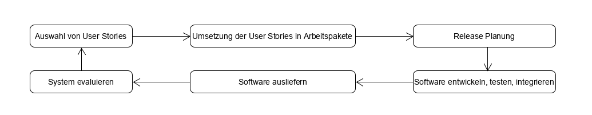
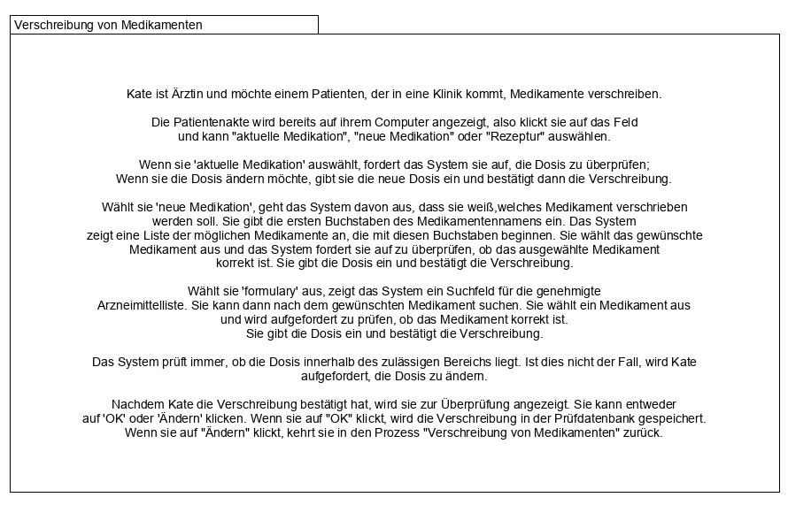
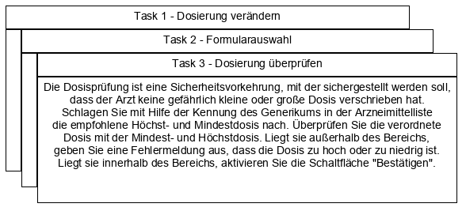
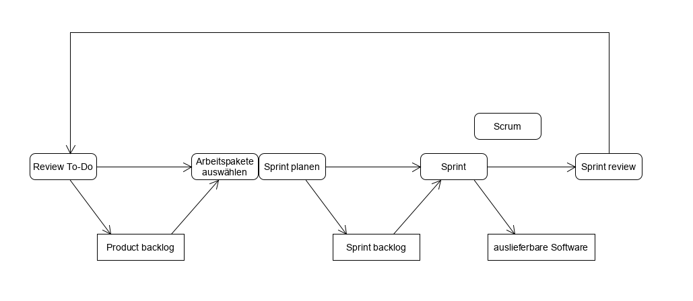
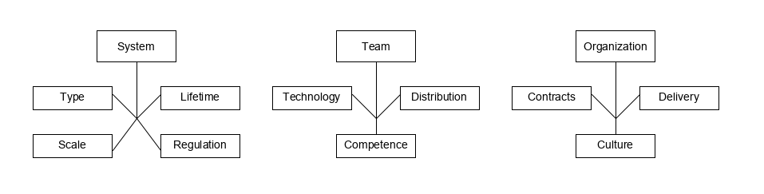

# Agile Software Development

**Autor:** Benedikt Wiest

Die folgende Ausarbeitung basiert auf dem Buch **Software Engineering von Ian Sommerville**  [1]. Sämtliche inhaltlichen Überschneidungen sind gewollt. Dargestellte Grafiken sind inhaltlich aus dem Buch übernommen.

## Agile Methodik

Unternehmen und ihre Art zu arbeiten haben sich in den vergangenen  Jahren verändert, insbesondere wegen der neu aufgekommenen digitalen Märkte und den damit einhergehenden Chancen, verändern sich die Anforderungen an den Entwicklungsprozess. Klassische, plangesteuerte Entwicklung mit seinem langsameren Prozess kann diese Anforderungen nicht umsetzen. Die rasche Entwicklung und Bereitstellung von Software ist ein Erfolgsfaktor für Unternehmen welche in digitalen Märkten operieren. Anforderungen an Software ändern sich heute schneller und kommen erst während der Entwicklung auf. So verändern sich Schnittstellen in einer hohen Frequenz und neue Potentiale werden erst während der Entwicklung entdeckt. 
Mit der Notwendigkeit für schnellere Softwareentwickler kam in den späten 1990er Jahren die agile Methodik auf, welche bis heute das weitverbreitete Synonym für schnelle Entwicklung ist. 

Alle, im folgenden vorgestellten, agilen Methodiken haben 3 Gemeinsamkeiten:

 - Die Prozesse Spezifikation, Entwurf und Implementierung sind ineinander verschachtelt. Detaillierte Spezifikationen werden nicht (oder nur minimal/ oder generiert) angefertigt. Die aufgenommenen Anforderungen werden eher als Beschreibung der wichtigen Eigenschaften der Software verstanden.
 - Inkrementelle Entwicklung unter Zuhilfenahme des Feedbacks der Nutzer und/oder der Stakeholder. Software wird von Version zu Version verbessert
 -  Der Entwicklungsprozess wird durch umfangreiches Tooling unterstützt (bspw. automatisierte Tests oder Tools für Konfigurationsmanagement...)
 
 Wird agile Methodik zur Entwicklung von Software eingesetzt, erfolgt die Entwicklung inkrementell durchgeführt. Die Einbeziehung des Kunden und/oder der Stakeholder erfolgt zur Aufnahme und Priorisierung von Anforderungen. Zur Reduzierung von Kommunikationsoverhead, erfolgt die Kommunikation eher informell und mit weniger formellen Besprechungen. Im  Vergleich zu konservativen Entwicklungsprozessen, bei denen alle Aktivitäten sequenziell ablaufen, sieht die agile Methodik ein iteratives Vorgehen vor, bei dem alle Aktivitäten parallel ablaufen.
Eine Vermischung agiler Methodik und plangesteuerter Entwicklung ist heute gängige Praxis. So können zum Beispiel starr geplante Aktivitäten trotz agiler Methodik durchgeführt werden oder Iterationen innerhalb des agilen Entwicklungsprozess auch die Dokumentation von Software beinhalten. Die hohe Flexibilität ergibt sich vor allem daraus, dass agile Methodik nicht auf die Erstellung von Code fokussiert ist, sondern rein das Vorgehen während der Entwicklung vorgibt.

Die zugrundliegende Philosophie der agilen Methodik wurde im agilen Manifest niedergeschrieben. 
Ein Auszug aus den Prinzipien des agilen Manifests:
	
| Grundsatz | Beschreibung |
|--|--|
| Einbindung des Kunden | Enge Einbindung des Kunden, Definition  und Priorisierung neuer Anforderungen, Feedback zu Iterationen  |
| Veränderung aufgeschlossen gegenüberstehen| Damit rechnen das sich Anforderungen ändern und Software entsprechend entwickeln |
| Inkrementelle Auslieferung | Software wird iterativ entwickelt, Versionen verbessern jeweils die vorherige |
| Einfachheit | Komplexität an jeder möglichen Stelle reduzieren um Einfachheit herzustellen |
| Menschen > Prozesse | Kompetenz der Entwickler nutzen und die etablierung eigener Arbeitsweisen zulassen, statt stur an Prozessen festzuhalten |

Mit gewonnener Erfahrung im Umgang mit agiler Methodik, hat sich diese insbesondere für 2 Typen von Projekten bewährt:
 
 - Bei der Produktentwicklung kleiner und mittelgroßer Produkte, welche für den Verkauf bestimmt ist
-  Bei der kundenspezifischen Systementwicklung unter verpflichtender Einbeziehung des Kunden, mit wenig zugrundeliegenden Vorschriften und einer kleinen Interessentengruppe/ wenig Stakeholdern
 
## Agile development techniques

**XP-Prozess**

Nach der Entwicklung der Idee von agiler Methodik in den 90er Jahren, folgten rasch Ansätze zur Umsetzung dieser. Einer der bedeutendsten Ansätze war das sogenannte "Extreme Programming" (folgend abgekürzt durch XP) welches durch Kent Beck geprägt wurde.  Die Benennung erfolgte so, da agile Methodik und iterative Entwicklung auf ein "extremes" Niveau getrieben wurde. 

Der XP-Prozess sieht im High-Level folgende Schritte vor:

 1. Aufnahme von Anforderungen in Form von User Stories
 2. Umsetzung der User Stories in Arbeitspakete
 3. Umsetzung der Arbeitspakete durch Entwickler in 2er Teams
 4. Test-first (Entwicklung von Software nach dem Test-first Ansatz)
 5. Alle Tests müssen erfolgreich durchlaufen werden, wenn neuer oder veränderter Code integriert wird
 6. Release von neuen Softwareversionen in geringen Abständen (mehrere Versionen pro Tag möglich)

XP stützt sich auf agile Methodik und wurde damals sehr kontrovers diskutiert. Eine Beschreibung der umgesetzten Grundsätze, ist in der unten stehenden Tabelle zu finden.

|Grundsatz| Beschreibung |
|--|--|
| Kollektives Eigentum | Entwicklerpaare arbeiten an jeder Stelle, keine Bildung von Kompetenzinseln. Jeder kann alles ändern. |
| Continuous integration | Zeitnahe Integration der entwickelten Software, alle Tests müssen erfolgreich durchlaufen werden wenn neue Software integriert wird  |
| Inkrementelle Planung | Anforderungen werden auf Story Cards festgehalten und je nach verfügbarer Zeit und Priorität umgesetzt |
| On-site Customer | Kunde ist Bestandteil der Entwicklung, ein repräsentativer End-Nutzer muss dem Entwicklerteam permanent zur Verfügung stehen |
| Pair programming | Entwickler arbeiten in 2er Teams um sich gegenseitig zu unterstützen und zu überprüfen |
| Refactoring | Kontinuierliche Überarbeitung von bestehendem Code um den Code einfach und wartbar zu halten |
| Simple design | Umsetzung nicht über das Ziel hinaus, es wird nur das umgesetzt was angefordert ist |
| Small releases | Auslieferung minimaler Umsetzungen der geforderten Funktionen, weiterentwicklung dieser Funktionalitäten wird auf Basis dieser ersten Version ausgeliefert |
| Konstante Geschwindigkeit | Überarbeitung führt zu schlechterem Code und mittelfristig zur geringerer Produktivität |
| Test-first | Automatisierte Unit-Tests unterstützen dabei Tests zu schreiben, bevor die Funktionalität selbst entwickelt wird |

Die praktische Umsetzung von XP hat sich als schwierig herausgestellt da es nicht zu Management und Unternehmenskultur der meisten großen Unternehmen passt. Häufig werden daher einzelne Bestandteile von XP in Kombination mit anderen agilen Methodiken (wie z.B. Scrum) umgesetzt. 
XP hat mit seinen Bestandteilen einen wichtigen Beitrag zur Umsetzung agiler Methodik in Unternehmen geleistet, die wichtigsten Bestandteile werden daher in den folgenden Kapiteln genauer erklärt und beschrieben.

 ### User Stories
 

**Story Card**

**Task**

Agile Methodik sieht keine separate Phase der Anforderungserhebung vor. In XP werden die Anforderungen daher als Nutzungsszenarien (User Stories) aufgenommen. Entwickler und Kunde entwickeln aus diesen Nutzungsszenarien anschließend Story Cards, welche die Kundenbedürfnisse konkret beschreiben. Aus den Story Cards werden konkrete Tasks ausgearbeitet, für welche die Entwickler den Aufwand abschätzen und der Kunde die Priorität vorgibt. Die Umsetzung dieser Iteration erfolgt anschließend in einer der folgenden Prozess Iterationen. 
Die oben illustrierte Story Card, beschreibt ein Szenario für die Verschreibung von Medikamenten in einem medizinischen Softwaresystem.

Die Arbeit mit User Stories birgt viele Vorteile, so können sich Menschen grundsätzlich besser mit Geschichten identifizieren als mit Stichpunkten in Anforderungsdokumenten. Nachteilig wirkt sich jedoch aus, dass User Stories nicht immer vollständig sind, da besonders erfahrene Nutzer häufig Details weglassen da sie mit ihrer Arbeit in einem hohen Maß vertraut sind.

	
### Refactoring

Ein Grundprinzip der traditionellen Software Engineering sieht vor, dass Code so entwickelt wird, dass mögliche zukünftige Änderung leicht umsetzbar sind ("design for change").

In XP wird dieser Grundsatz nicht gelebt, da der Aufwand für Entwicklung nach diesem Grundsatz sehr groß ist. Man sollte keine Zeit darauf verwenden ein System allgemeiner zu gestalten als nötig, da erwartete Anforderungen häufig nicht gestellt werden, oder ganz anders umgesetzt werden sollen. 
Stattdessen sieht XP vor, den Code permanent zu refaktorisieren. Dies sorgt dafür das ständig und immer wieder nach Verbesserungsmöglichkeiten gesucht wird und diese umgesetzt werden. Außerdem wird verhindert das die Gesamtstruktur des Systems sich nicht durch viele lokale Veränderungen verschlechtert. Die Verbesserung der Lesbarkeit von Code und Struktur des Systems, ist ein weiterer positiver Effekt. 
 
 Refactoring Maßnahmen können zum Beispiel die Reorganisation von Klassenstrukturen sein, oder auch das Aufräumen von Attributen und Methoden. Auch die Ausgliederung und Restrukturierung von Code in Bibliotheken kann eine Maßnahme des Refactoring sein.

Ein Pain point bei Refactoring kann der hohe Druck durch neue Anforderungen sein. Als Entwickler muss man sich immer wieder aktiv die Zeit nehmen Refactoring durchzuführen, unabhängig von Projektdruck.
 

### Test-first development
Im  Vergleich zu einem plangesteuerten Modell, existieren bei inkrementeller/agiler Entwicklung keine Systemspezifikation mit Hilfe derer Tests erarbeitet werden können. Getestet wird eher informell.

Mit der Nutzung von XP sollte ein umfangreiches Testkonzept umgesetzt werden, welches sich wie folgt zusammensetzt:

 - Entwicklung nach dem Prinzip "test-first"
 - Entwicklung von Test inkrementell
 - Entwicklung von Test auf Basis der Story Cards
 - Einbindung von repräsentativen Nutzern in die Entwicklung der Tests
 - Nutzung von automatisierten Test Frameworks

Die Umsetzung von Entwicklung nach dem Prinzip "test-first" bringt einige Vorteile. So wird durch die Implementierung von Tests das Verhalten der zu entwickelnden Software spezifiziert und die Schnittstellen implizit definiert. Die resultierende hohe Anzahl an Tests sorgt außerdem für eine Test coverage. Insgesamt für eine Test-first Strategie dazu, dass es weniger Fehler und Missverständnisse gibt und die Qualität des Codes und des Produkts erhöht wird.
Eine Bedingung für die Umsetzung von Test-first ist das die Anforderungen vor Entwicklung definiert sind. In XP kann diese Bedingung durch die Nutzung von Szenarien in Form von Story Cards erfüllt werden.

Die Automatisierung der Tests ist Bestandteil des Testkonzepts von XP. Zur Entwicklung von Tests sollte ein Framework eingesetzt werden, in welchem die Tests als ausführbare Komponenten implementiert werden können (zum Beispiel JUnit). 

Zur strukturierten Entwicklung von Software, wird mit Metriken gearbeitet, welche die Entwicklung messbar machen. Eine wichtige Metrik zur Beurteilung der Vollständigkeit von Tests ist die sogenannte Code coverage. Code coverage gibt das Verhältnis von implementierten Test zur Anzahl der maximal möglichen Tests an. Eine vollständige Code coverage garantiert keine funktionale Richtigkeit des Produkts. Die Herstellung von vollständiger Code coverage kann schwierig sein, da Programmierer lieber programmieren anstatt zu testen. Außerdem gibt es Bereiche in denen es schwierig ist inkrementelle Tests zu entwickeln (zum Beispiel Anzeigelogik komlexer UIs).
 

### Pair programming

Ein weiterer Teil des Konzepts von XP sieht das arbeiten von Entwicklern in 2er-Teams vor - das sogenannte Pair programming. Die beiden Entwickler arbeiten am selben Code und Computer. Die Bildung der Entwickler-Paare erfolgt dynamisch, es wird also regelmäßig gemischt. 
Pair programming bietet im wesentlichen folgende Vorteile:

-	Realisierung eines Systems als kollektives Eigentum mit gemeinsamer Verantwortlichkeit - keine Bildung von Kompetenzinseln. Das Entwickler Team als ganzes trägt die Verantwortung für den Code und das Produkt.
-	Wenig formelles Überprüfungsverfahren für den Code- nach dem 4-Augen Prinzip arbeiten sorgt für weniger Fehler, da Fehler schneller identifiziert werden können. Pair programming bietet eine günstige und einfache Variante (da implizit) von Code review.
-	Ermutigung zu umfangreichen Refactoring durch gemeinsame Arbeit 

Der gängigen Meinung nach, sorgt Pair programming für einen Verlust von Produktivität, da man annehmen kann, dass ein Entwicklerpaar nur 50% so viel Code erstellt, wie zwei alleinarbeitende Entwickler. Mit der Frage ob diese gängige Meinung der Realität entspricht, wurden 2 Studien unter freiwilligen Teilnehmer durchgeführt. Bei einer Gruppe von Studenten konnte ein Verlust von Produktivität nicht beobachtet werden, vermutlich ist dies darauf zurückzuführen, dass Entwickler sich mehr besprechen und dadurch Fehler und Irrwege vermieden werden. Eine analog durchgeführte Studie unter erfahrenen Programmierern konnte die Ergebnisse nicht reproduzieren. In der Gruppe der erfahrenen Programmierer wurde ein erheblicher Produktivitätsverlust festgestellt. Pair programming kann allerdings auch Sinn machen, da durch den Wissensaustausch unter den Entwicklern, die Projektrisiken sinken.

## Agile project management
Planorientierte Ansätze zur Softwareentwicklung, wie beispielsweise das Wasserfallmodell, ermöglichen externen Beobachtern einen umfangreichen Einblick in das Projekt Geschehen und erlauben eine Beurteilung des Projektfortschritts. Die klare Abgrenzung von Phasen ermöglicht starkes Projektcontrolling.
Frühe Ansätze der agilen Methodik kollidieren mit dem grundsätzlichen Bedürfnis nach Transparenz zur Planung in großen Unternehmen außerdem kann eine optimale Nutzung der Entwicklungsressourcen (z.B. Zeit) nicht sichergestellt werden, da Entwickler sich selbstständig organisieren, keine Dokumentation erstellt wird und die Entwickler nur kurzfristig, zyklisch, verplant werden. 
Um die Probleme agiler Methodik in großen Unternehmen zu lösen, wurde Scrum entwickelt. Scrum versteht sich als Framework für Organisationen, welche mit agiler Methodik arbeiten. Es ermöglicht externen Einblick ins Projekt und dadurch ein Projektcontrolling im klassischen Sinne.
Zur Abgrenzung von bekannten Projektmanagement Methoden implementiert Scrum eine neue Terminologie :

|Scrum Begriff| Erklärung |
|--|--|
| Entwicklerteam | Gruppe aus bis zu 7 Entwicklern, welche sich selbst organisiert und für Entwicklung verantwortlich ist |
| Potentiell auslieferbares Produktinkrement | Software Inkrement das in einem Sprint erstellt wird. Potentiell auslieferbar soll bedeuten, dass dieses Inkrement ohne Bearbeitung weiterer Arbeiten ausgeliefert werden. |
| Product backlog | To-Do Liste für das Entwicklerteam. Kann zu entwickelnde Features, Anforderungen, User Stories oder Dokumentationen/ Architekturdefinitionen oder weiteres enthalten. |
| Product owner | Person welche neue Anforderungen ermittelt, priorisiert und das Product backlog permanent pflegt. Kann auch eine kleine Gruppe an Personen sein. Kann ein Kunde, Produktmanager oder ein anderer Stakeholder sein. |
| Scrum | Tägliches Meeting, in welchem der Fortschritt besprochen wird und zu erledigende Arbeit verteilt wird. Findet idealerweise mit allen Mitgliedern und in Präsenz statt.  |
| Scrum Master | Verantwortlich für die Einhaltung des Scrum-Prozess. Coacht die Mitglieder. Stellt Schnittstelle zum Rest des Unternehmens her und schirmt das Projektteam ab vor externen Einflüssen. |
| Sprint | Iteration der Entwicklung, welche 2-4 Wochen dauert. |
| Velocity | Schätzung wieviel in einem Sprint erledigt werden kann. |

Scrum folgt den Prinzipien des agilen Manifests, gibt jedoch keine expliziten Vorschriften welche agilen Methoden eingesetzt werden sollen. Durch diese geringen formellen Hürden ist Scrum leichter integrierbar in bereits bestehende Unternehmensstrukturen. 

**Scrum Prozess**

Als Input für den Scrum Prozess dienen die im Product backlog definierten Anforderungen/ Aktivitäten. Anforderungen können beispielsweise in Form von User Stories hinterlegt werden, definierte Aktivitäten können sich vielfältig darstellen - beispielsweise die Definition eines Datenmodells oder die Entwicklung eines Prototyps. Für die Pflege des Product backlog ist der Product Owner verantwortlich.
Jeder Iteration, mit einer Dauer von 2 bis 4 Wochen, erzeugt ein Softwareinkrement, welches potentiell ausgeliefert werden kann. Zu Beginn eines Sprints werden die Aktivitäten ausgewählt, welche umgesetzt werden sollen. Die Auswahl erfolgt gemeinsam durch den Product Owner und das Entwicklerteam. Nicht umgesetzte Aktivitäten wandern zurück ins Product backlog. Eine Verlängerung von Sprints (auf Grund von unfertigen Aktivitäten) ist nicht vorgesehen. Bei der Planung ausgewählte Items wandern in das Sprint backlog, aus welchem sich die Entwickler im Laufe des Sprints Items auswählen und umsetzen. 
Im täglichen Scrum Meeting werden die Entwicklungsfortschritte besprochen, Probleme bei der Entwicklung aufgezeigt und es wird ein Forecast für die Abarbeitung des folgenden Arbeitspakets abgegeben. Das Scrum wird durch den Scrum Master moderiert, er gibt jedoch keine Anweisungen zur konkreten Umsetzung von Items. Das Meeting dient der kurzfristigen Planung der Entwicklung. Zur Koordinierung des Prozess kann ein Scrum Board genutzt werden. Hierbei handelt es sich um ein Whiteboard, auf dem aktuelle und abgearbeitete Arbeitspakete kleben. Entwickler erhalten dadurch einen einfachen und schnellen Überblick über die aktuelle Auslastung und Situation. 
Am Ende eines Sprints wird ein Review Meeting durchgeführt, an dem alle Mitglieder teilnehmen. Das Ziel dieser Besprechung ist die Verbesserung des Prozess, hierfür wird im Meeting diskutiert wie der Sprint zukünftig besser laufen kann. Im Review Meeting wird außerdem das Product backlog überprüft. 
Trotz eigener Terminologie und der klaren Abgrenzungen zur Rolle des herkömmlichen Projektmanagers, ersetzt der Scrum Master in vielen Unternehmen den Projektmanager. Aufgabe kann daher auch sein, Berichte an Management und Geschäftsführung des Unternehmens zu geben. Möglich ist auch Personal- und Ressourcen Verantwortung.  

Wesentliche Vorteile bei Einsatz des Scrum Frameworks sind:
-	Zerlegung des Produkts in kleinere Teile, daraus resultiert ein besseres Verständnis für das Produkt
-	Unklare, oder fehlerhafte, Anforderungen halten den Prozess nicht auf
-	Höhere Arbeitsmoral entsteht durch mehr Kommunikation und starke Transparenz des Prozess
-	Zufriedenere Kunden durch regelmäßige Auslieferung von Inkrementen und Einbindung in den Entwicklungsprozess
-	Aufbau von Vertrauen zwischen Entwickler und Kunde

## Scaling agile methods
Die Entwicklung agiler Methoden fand ursprünglich für kleine Teams statt, welche eng (räumlich) zusammenarbeiten und bei denen eine niederschwellige Kommunikation möglich ist. Die Vorteile agiler Methodik, wie z.B. schnelle Produktbereitstellung, sind auch für große Unternehmen und große Softwareprojekte relevant, dass Interesse an der Skalierung von agiler Methodik stieg daher schnell an.
Ziele bei der Skalierung agiler Methodik sind:
-	agile Methodik für große Softwaresysteme, an denen mehr als ein (kleines) Team arbeitet
-	Nutzung agiler Methodik, auch über die reine Software Entwicklung hinaus

Es kann davon ausgegangen werden, dass in großen Unternehmen eine Produktivitätssteigerung von 15% in einem Zeitraum von 3 Jahren erreicht werden kann durch die Skalierung agiler Methodik.

### Practical problems with agile methods
Für den Einsatz bei der Entwicklung von Softwareprodukten und Apps ist die agile Methodik der wohl beste Einsatz. Für die Entwicklung von eingebetteten Systemen oder großen, hochkomplexen Softwaresystemen sind agile Methoden möglicherweise nicht geeignet. Dies liegt daran, dass die informelle Arbeitsweise der agilen Methodik nur schwer mit den juristischen Rahmenbedingungen zu vereinbaren ist (bspw. Vertragsverhandlungen). Auch die Tatsache das der Großteil von Kosten in der Softwareentwicklung auf Wartung entfällt und agile Methodik dafür keinen konkreten Ansatz liefert ist problematisch. 
Insbesondere die informelle Arbeitsweise ist problematisch. Bei der Beauftragung von externen Unternehmen zur Softwareentwicklung, wie es bei großen Projekten in entsprechenden Unternehmen üblich ist, gehört die Dokumentation der Anforderungen zu den gängigen Vertragsunterlagen. Wie bekannt existiert bei dem Vorgehen nach Scrum aber nicht im vorhinein ein vollständiges Anforderungsdokument, da dies erst mit der inkrementell aufgebaut wird.  Bei agiler Methodik wird daher in der Regel die geleistete Arbeit bezahlt und kein fester Preis für die Umsetzung einer festen Liste  mit Anforderung. Problematisch wird dies nur, wenn es zu Problemen kommt und die Schuldfrage für entstehende Mehraufwände geklärt werden muss 
Es gibt keinen Konsens in wie fern agile Methodik für die Wartung von bestehenden individuellen Softwaresystemen geeignet ist, mögliche Probleme hierbei sind:
- Per Definition - fehlende Dokumentation
- Die Einbindung des Kunden sicherstellen
- keine konstante Auslastung des Entwicklerteams

Bei Systemen welcher mit agiler Methodik implementiert wurden, sollte der Code in hoher Qualität und guter Lesbarkeit vorliegen - ein ausführliche Dokumentation sollte also nicht nötig sein, damit sich Entwickler zur Wartung der Systeme einarbeiten können. Problematisch kann allerdings auch sein- wie können die Auswirkungen einer Änderung beurteilen, wenn nicht vollständig klar ist, was das System tun soll?
Die konstante Auslastung der Entwickler innerhalb des Projekts sorgt dafür, dass informell gesammeltes Wissen nicht abwandert in andere Projekte. Löst sich das Projektteam auf, geht das gesammelte Wissen nahezu vollständig verloren, dies erschwert die Wartung. Auch Entwickler für die Wartung zu begeistern, kann schwierig sein da diese lieber Neuentwicklungen programmieren statt Altsoftware zu warten.
Prinzip der permanenten Einbindung eines repräsentativen Vertreter des Kunden kann bei der Wartung von Software nicht immer aufrechterhalten werden, da die Kosten für die permanente Bereitstellung für den Kunden sehr hoch sind.

### Agile and plan-driven methods

**Einflussfaktoren für die Wahl agiler Methodik**

Aufgrund elementarer Unterschiede in der Arbeitsweise von kleinen Unternehmen (Bspw. Startups) zu großen Unternehmen (bspw. Konzerne), ist zur Skalierung von agiler Methodik eine Einbindung plangesteuerter Aktivitäten unerlässlich. Software Entwicklung muss in großen Unternehmen geplant werden, außerdem ist ein Controlling der Projekte unerlässlich. 
Unternehmen haben in ihren Entwicklungsprozessen agile Aktivitäten und plangesteuerte Aktivitäten eingebaut. Die Findung des richtigen Gleichgewichts zwischen Agilität und plangesteuerter Entwicklung müssen Unternehmen abhängig der Rahmenbedingungen finden, hierzu können 5 Fragen herangezogen werden:
-	Wie groß ist das zu entwickelnde System?
	-	agile Methodik eignet sich eher für kleine, eng zusammenarbeitende Teams
-	Welche Art von System wird entwickelt?
	-	Komplexe Systeme (bspw. Steuerungen mit der Anforderung Echtzeit) benötigen einen detailierten Entwurf vor der Entwicklung. Für die Umsetzung eignet sich daher eher ein plangesteuerter Ansatz.
-	Wie hoch ist die Lifetime des Systems?
	-	Systeme, welche besonders lange genutzt werden, benötigen häufig eine umfangreichere Design Phase um die Erweiterbarkeit und Wartbarkeit der Software sicherzustellen. Wählt man einen agilen Ansatz, sollte sichergestellt werden, dass die Entwickler der Software auch in der Wartungsphase dabei sind. 
-	Welche Regulierungen gelten für das Produkt?
	-	Systeme welche einer externen Regulierung unterliegen (z.b. Software im Bereich der Luftfahrt) müssen zur Einhaltung von Sicherheitsbestimmungen sehr gut dokumentiert werden. Es bietet sich daher an, einen plangesteuerten Ansatz zu wählen.
	
Neben den Fragen zum System, müssen sich Unternehmen auch Fragen zum entwickelnden Team stellen um das richtige Maß zwischen agiler Methodik und plangesteuerten Aktivitäten zu finden. Auch die Frage zur Technologie des zu entwickelnden Systems ist erheblich für die Wahl des Vorgehens:
-	Wie  kompetent sind die Entwickler und Entwicklerinnen im Entwicklungsteam?
	-	 Die Umsetzung eines detaillierten Entwurf benötigt nicht so viel Kompetenz, wie die aktive Beteiligung bei allen Entwicklungsaktivitäten (also z.B. auch die Arbeit an den Architekturentwürfen des Systems). Für agile Methodik ist das nötige Kompetenzniveau grundsätzlich höher, bei planbasiertem Vorgehen können die besten Entwickler sich um Entwurf und Design der Software kümmern.
-	Arbeitet das Entwicklerteam zentral? 
	-	Agile Methodik eignet sich besonders für kleine, zentral arbeitende Teams
-	 Welche Technologien stehen zur Unterstützung des Prozess zur Verfügung?
	-	agile Methodik ist eher auf Tools angewiesen um einen besseren Überblick über das in Entwicklung befindliche System zu erhalten
		
Auch Fragen betreffend der Organisation (Unternehmen) können Einfluss auf den Anteil an plangesteuerten Aktivitäten haben. Das allgemein vermittelte Bild, der unbürokratischen und legeren, jungen Softwareunternehmen entspricht nicht, oder nur in teilen, der Wahrheit. Folgende Fragestellungen betreffend der Organisation müssen sich Organisationen stellen:
-	Gibt es rechtliche Rahmenbedingungen, welche einen detaillierten Softwareentwurf und/oder eine vollumfängliche Dokumentation nötig machen? Sollte dies der Fall sein, ist ein planorientiertes Vorgehen besser geeignet, als ein agiles.
-	Kann die inkrementelle Strategie und die damit verbundene kontinuierliche Auslieferung des Produkts umgesetzt werden? Stehen repräsentative End-User bei der Entwicklung zur Verfügung?
-	Welche kulturellen Aspekte prägen die Organisation? Unternehmen mit starren Strukturen tuen sich mit der Umsetzung agiler Methodiken deutlich schwerer.

Ziel der Softwareentwicklung ist, unabhängig vom Vorgehen, eine lauffähige Software. In jedem Fall sollte daher pragmatisch, mit der effektivsten zur Verfügung stehenden Methode, gearbeitet werden.

### Agile methods for large systems
Agile Methodik muss weiterentwicklet werden für den Einsatz bei großen  Systemen. Die liegt im wesentlichen an der Komplexität dieser. Bei großen Systemen handelt es sich häufig um viele verschachtelte Systeme, nur selten haben Entwickler einen Gesamtüberblick über alle Systeme. Abhängigkeiten zu Bestandssystemen (in der Regel handelt es sich bei großen Systemen um Brownfields), erschweren eine flexible und inkrementelle Entwicklung. Die Umsetzung von Anforderungen, welche zum Beispiel die Kommunikation zu benannten Bestandssystemen betreffen, sind daher nur schwierig mit agiler Methodik umzusetzen. Die Integration mehrerer Systeme zu einem Gesamtsystem erfordert häufig sehr viel Konfigurationsarbeit, auch für diese Art der Arbeit eignet sich inkrementelles Vorgehen eher weniger. Einen weiteren Pain point stellen rechtliche oder regulatorische Rahmenbedingungen da. Die informelle Arbeitsweise agiler Methodik ist mit den Anforderungen dieser Rahmenbedingungen nur selten vereinbar. Die langen Beschaffungs- und Entwicklungszeiten großer Softwaresysteme machen es außerdem schwer, dass Entwicklerteam zusammenzuhalten. Eine Beteiligung aller Stakeholder bei Entwicklung ist bei großen Systemen nur schwierig umzusetzen.

Um die oben beschriebenen Probleme bei der Skalierung agiler Methodik zu adressieren, wurden  weitere Frameworks entwickelt. IBM entwickelte das Agile Scaling Model (ASM), welches die Skalierung von agilem Vorgehen in einem Stufenmodell vorsieht. In einem ersten Übergang wird eine disziplinierte Entwicklung etabliert, bei der alle Phasen der Softwareentwicklung berücksichtigt werden. Diese Phase wird Disciplined Agile Delivery genannt. In der nächsten und letzten Stufe erfolgt die Umsetzung agiler Methodik auch bei der Entwicklung großer Systeme. Hierfür müssen die benannten Komplexitätsfaktoren anerkannt und berücksichtigt werden.

Es gibt kein allgemeingültiges Modell zur Nutzung von agiler Methodik bei der Entwicklung großer Systeme. Gemeinsamkeiten der vorhandenen Modelle können jedoch gefunden werden:
-	Die Anforderungsanalyse folgt keinem streng inkrementellen Ansatz. In der Regel können die groben Anforderungen vorab formuliert werden und anschließend mit inkrementellem Vorgehen verfeinert werden.
-	Für verschiedene Produktbereiche werden jeweils Product Owner definiert, welche permanent im Austausch stehen.
-	Ein kompletter Verzicht auf Dokumentation, Entwürfen und Beschreibungen ist nicht möglich.
-	Entwicklung von Kommunikationsmechanismen, wie zum Beispiel Telefon/Videokonferenzen. Schaffung von asynchronen Kommunikationswegen wie E-Mail oder Instant Messaging.
-	Continuous integration über das gesamte Projekt ist meistens nicht möglich, trotzdem sollten regelmäßige Builds des Gesamtsystem erfolgen. Der Einsatz von Tools für das Konfigurationsmanagement ist unerlässlich.

Scrum wurde für den Einsatz bei der Entwicklung großer Softwaresysteme erweitert, hierfür wird das bekannte Scrum Model erweitert. Jedes Team hat einen eigenen Scrum Master und Product Owner. Außerdem hat jedes Team einen einen Produktarchitekten, welcher sich mit den Architekten der anderen Teams austauscht. Releases werden unter den Teams abgestimmt. Neben dem täglichen Scrum wird ein "Scrum of Scrum" etabliert, in welchem sich Vertreter aller Teams treffen und Fortschritte besprechen um Probleme frühzeitig zu identifizieren.

	
### Agile methods across organizations
Agile Methodik kann von kleinen Unternehmen und Organisationen deutlich leichter umgesetzt werden als von großen Organisationen, weil es weniger formelle Hürden und gewachsene Unternehmen Strukturen gibt. 

Bei großen Unternehmen kann die Einführung agiler Methodik an folgenden Stellen Probleme bereiten:
-	Projektleitung ohne Erfahrung mit agiler Methodik.
-	Qualitätsverfahren und Standards, welche für alle (Software-)Produkte gelten und sich nur schwer mit agilen Methoden vereinbaren lassen
-	Ein eher breites Spektrum an Fähigkeiten, agiles Vorgehen benötigen eher ein hohes Qualifikationsniveau. 
-	Widerstand aufgrund von gewachsenen Strukturen und konservativer Unternehmenskultur.
-	Änderungsmanagement kann problematisch sein, da ein formelles Genehmigungsverfahren für Änderungen konträr zu permanentem Refactoring steht.
-	Prozesse, bei denen sich die Software externen Tests stellen muss, sind nicht mit dem Ansatz Test-first vereinbar.

Die Einführung agiler Methoden in großen Unternehmen/Organisationen erfordert häufig einen Kulturwandel, von starren Prozessen zu flexiblem Vorgehen.

# Literatur
[1]: Sommerville Ian (2015). Software Engineering (10th. ed.), Agile software development (72-101).

