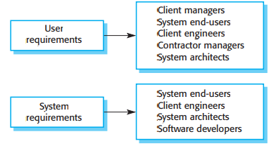
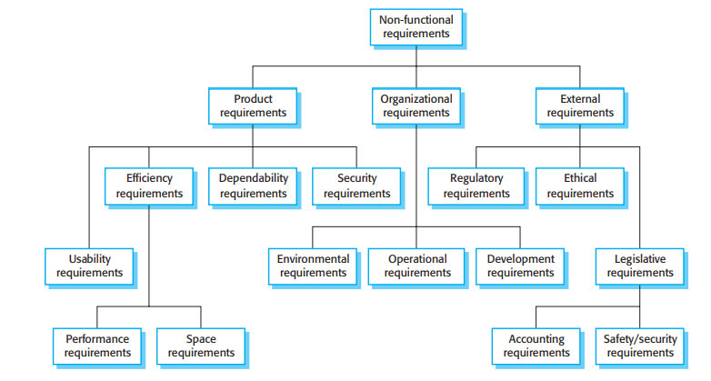
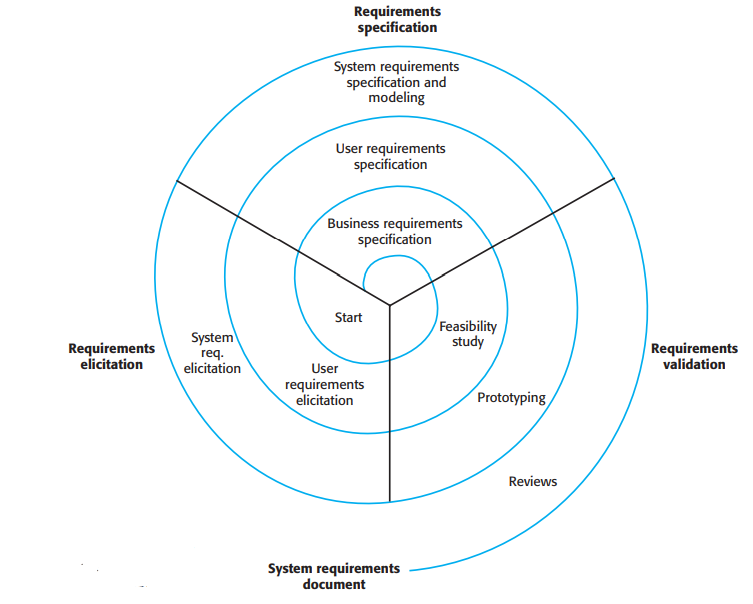
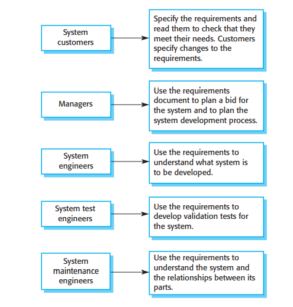

# Reqirements engineering

**Autor:** Marco Reineke

In diesem Kapitel wird beschrieben was genau funktionelle und nicht-funtkionelle Anforderungen sind und weshalb man zwischen Nutzer-und Systemanfordeungen unterscheidet. Es werden die Fragen beantwortet warum Requirements engineering so wichtig ist und inwiefern requirements engineering andere Aktivitäten der Softwareentwicklung untersützt. Außerdem werden die Prozesse des Requirements engineering beschrieben und wie diese zsammenhängen. Die drei wesentlichen Prozesse im requiremnts engineering sind die Anforderungserhebung, die Anforderungsspezifikation und Anforderungsvalidierung. Mit hilfe dieser drei Prozesse wird ein sogenanntes system requirements document erstellt in welchem die herausgearbeiteten Anforderungen festgehalten werden. Da es durchaus vorkommt, dass neue Anforderungen hinzukommen oder sich Anforderungen im laufe des Entwicklungsprozesses ändern gibt es noch den Prozess der Anforderungsänderung, welcher ebenfalls in diesem Kapitel beschrieben wird.

## Einleitung
Bei der Erstellung von Anforderungen für ein Softwareprojekt gibt es zwei verschiedene Level der Abstraktion. Diese Abstraktionslevel werden Nutzer- und Systemanforderungen genannt. Der wesentliche unterschied zwischen Nutzer- und Systemanforderungen ist, dass Nutzeranforderungen eine abstrakte high-level beschreibung der Anforderungen sind und Systemanforderungen eine detaillierete beschreibung der Anforderungs sind. In den Nutzeranforderungen wird mit Hilfe von natürlicher sprache und Diagrammen beschrieben, welche Services das System dem Nutzer bereitstellen soll und unter welchen Einschräkungen das System später operieren wird. Dabei gibt es in den Nutzeranforderung meisten eine hohe Varianz zwischen groben Aussagen über eine Anforderung und einer detaillierten beschreibung der Systemfunktionalität. In den Systemanforderungen wir detailliert beschrieben, welche Funkionen, Services und Beschränkungen es gibt. In den Systemanforderungen werden auch funtkionelle Spezifikationen aufgenommen, welche genau beschreiben, was implementiert werden soll. Die Systemanforderungen werden manchmal in Verträgen aufgenommen um die Anforderungen zu definieren.


#### Abbildung 4.1 [1]

In Abbildung 4.1 kann man erkennen warum es Sinn macht verschiedene grade der detaillierung für die Spezifikationen der Anfroderungen zu wählen. Der Grund ist, dass viele verschiedene Leute die Anforderungen des Softwareprojektes kennen müssen und jeder von ihnen eine andere Perspektive hat oder anderes Fachwissen. Für Softwareentwickler sind die Systemanforderungen zum Beispiel sehr wichtig. Für Manager hingegen sind diese eher irrelevant.

### Machbarkeitsstudie
Zu beginn der Anforderungsanalyse sollte eine Machbarkeitsstudie durchgeführt werden. Dabei sollten die drei folgenden Fragen beantwortet werden
 * 1. Trägt das System zu den allgemeinen Zielen der Organisation bei ?
 * 2. Kann das System mit vorhandenem Budget und im geplanten Zeitraum implementiert werden ?
 * 3. Ist das System mit anderen Systemen die verwendet werden integrierbar ?
 
 Falls eine der drei Fragen mit nein beantwortet wird, sollte das Projekt nicht durchgeführt werden.

## Funktionelle und nicht - funktionelle Anforderungen

| Funktionelle Anforderungen | Nicht-funktionelle Anforderungen|
|:----------:|:-----------:|
| Was soll das System tun/nicht tun ? | Spezifierung der Beschränkungen für das System als Ganzes|
| Detaillierte beschreibung der Systemfunktion(Inputs/Outputs) | Effekte auf Gesamtarchtekur und nicht auf einzelne Komponente|
|Anforderungen abhängig von zu entwickelnder Software| Die implementierung der Anforderung zieht sich durch das ganze System|
|Anforderungen abhängig von zu erwartenden Nutzern|Messgrößen: Schnelligkeit, Benutzerfreundlichkeit, Verlässlichkeit,Robustheit,Portabilität|
|Sind eine Erweiterung der Nutzeranforderungen||
|Geschrieben für Softwareentwickler||


#### Abbildung 4.3 [1]

In Abilldung 4.3 kann man sehen, welche Faktoren alles bei den nicht-funktionellen Anforderungen hereinspielen. Die nicht-funktionellen Anforderungen lass sich in drei Hauptkategorien unterteilen. Diese sind Produktanforderungen, organisatorische Anforderungen und externe Anforderungen. Bei den Produktanforderungen geht es um Fakoren, welche das zu entwickelnde Produkt betreffen wie zum Beispiel die Sicherheit des entwickeltem System oder die Laufzeit. Bei den Organisatorischen Anforderungen werden Anforderung die das Unternehmen betreffen betrachtet und bei den externen Anforderungen werden äußere Einflüsse unter betracht gezogen wie die Rechtslage oder Faktoren aus dem Rechnungswesen.

## Prozesse des requirements engineering


#### Abbildung 4.6 [1]
In der Abbilunge 4.6 ist der Prozessablauf von der Anforderungserhebung bis zu der erstellung des software requirements document dargestellt. Dabei gibt es drei Kernaktivitäten. Diese sind Anforderungserhebung, Anorderungsspezifikation und Anforderungsvalidierung und werden wie in der Abbildung dargestellt mehrmals nacheinander durchlaufen. Wird starten immer bei der Anforderungserhebung, welche eine high-level Aktivität ist und enden bei einer low-level Aktivität, der Anforderungsvalidierung.

### Anforderungserhebung
Im ersten Prozess des reuirements engineering arbeiten Softwareentwickler mit den Ergebnissbetroffenen zusammen um folgende Dinge über das zu entwickelnde System und die Anwender herauszufinden:
* Anwendungsbereich des Systems
* Arbeitsaktivitäten der Ergebnissbetroffenen
* services und Systemeigenschaften welche die Ergebnissbetroffenen wollen
* benötigte Performance des Systems
* Hardware Beschränkungen

Die Erhebung und das Verständnis der Anforderungen der Ergebnisbetroffenen ist schwierig wegen, da die Ergebnissbetroffenen nicht immer wissen, was genau sie vom System wollen. Die Ergebnissbetroffenen erläutern ihre Anforerungen mit impliziten Kenntnissen und Fachsprache, welche nicht so leicht zu verstehen ist. Anforderungsingenieur müssen potentielle Quellen, Gemeinsamkeiten und Konflikte der Anforderungen erkennen. Politische Einflüsse müssen erkannt werden, da Manager Anforderungen anfragen könnten, die ihren Einfluss auf die Organisation erhöhen. Außerdem können während des Analyseprozesses Änderungen durch ökonomische oder ökologische Faktoren auftreten auf die eingegangen werden sollte.

Die Anforderungserhebung besteht aus vier Phasen:

* **Anforderungen entdecken und verstehen**:
  Anforederungen aus interaktion mit Ergebnisbetroffenen oder Dokumentatonen sammeln.
* **Klassifierung der Anforderungen**: 
  Klassifizierung der unstrukturierten Anforderungen und Gruppierung oder erstellung von Clustern. 
* **Anforderungen priorisieren und verhandeln**:
  Manche Anforderungen stehen im Konflikt zueinander, weshalb die Anforderungen priorisiert werden und Kompromisse gefunden werden müssen.
* **Anforderungen dokumenieren**: 
  Die Anforderungen müssen dokumentiert werden bevor sie erneut die Spirale durchlaufen.


Um die Anforderungen zu erheben gibt es verschieden Techniken. Dei diesen Techniken werden die Ergebnissbetroffenen getroffen um zu verstehen wie diese arbeiten, was genau sie produzieren, wie das System genutzt wird und welche änderungen am System benötigt werden. Die drei Techniken die im Kapitel vorgestellt werden sind interviewen, Ethnographie, Stories und Szenarios.

#### Interviewen
Die Anforderungsingenieure interviewen die Ergebnissbetroffenen um aus deren Antworten Anforderungen abzuleiten. Dabei gibt es zwei Arten von Interviews. Die erste Art ist ein geschlossenes Interview, bei welchem vordefinierte Fragen beantwortet werden und ein offenes Interview, bei dem eine Menge von Themen abgehandelt wird um die Interssen der Ergebnisbetroffenen zu verstehen. In der Praxis wird meisten ein Mix aus den beiden Arten verwendet.

Schwierigkeiten bei der Technik sind, dass die Ergebnisbetroffenen Fachsprache verwenden, oder dass manch Wissen für sie so fundamental ist, dass es nicht erwähnt wird. Außerdem eignen sich Intwerviews nicht um Organisationelle Anforderungen und Beschränkungen zu erheben, da Machtverhältniss innerhalb der Organisation diese beeinflussen können. Ein weiterer Schwachpunkt ist, dass die Interviewten die theoretischen anstatt die realen Strukturen im Unternehmen erläuten, da sie mit einem Fremden reden.

Als Interviewer sollte man folgende Dinge im Hinterkopf behalten:
* Man sollte unvoreingenommen in das Interview gehen und falls der Interviewte mit überraschenden Anforderungen kommmt, bereit sein die Vorstellung über das System zu ändern.
* Man sollte Sprungbrettfragen benutzen oder einen Vorschlag für eine Anforderung machen anstatt direkt zu fragen "Was möchtest du für Anforderungen haben" ?

Interviews sollten nicht alleine als Anforderungserhebungstechnik verwendet werden, sondern im Veerbund mit anderen Techniken.

#### Ethnographie

#### Stories und Szenarios


### Anforderungsspezifikation
Bei der Anf


#### Abbildung 4.16 [1]

### Anforderungsvalidierung
Bei der Anforderungsvalidierung wird geprüft, ob das die Anforderungen wirklich das System definieren, welches der Kunde haben möchte. Hier gibt es eine Überlappung mit der Anforderungserhebung. Die Anforderungsvalidierung ist wichtig, da ein Fehler in diesem Prozess später sehr hohe Kosten veursachen kann.

Prüfungen im Valierungsprozess:
* **Gültigkeitspüfung**:
  Prüfen ob die Anforderungen die tatsächlichen Bedürfnisse der Benutzer erfüllt.
* **Konsistenzprüfung**: 
  Die Anforderungen im Dokument sollten nicht im Konflikt stehen. 
* **Komplettheitsprüfung**: 
  Das Dokument solle alle Funktionen und Beschränkungen beinhalten. 
* **Realismusprüfung**:
  Prüfen ob Anforderungen mit dem Budget und in der geplanten Zeit implementiert werden kann.
* **Überprüfbarkeitsprüfung**: 
  Eine Menge von Tests schreiben, welche demonstriert, dass alle spezifizierten Anforderungen erfüllt werden.

Für die Validierung der Anforderungen empfehlen sich folgende Techniken:
* **Anforderungsrezensionen**:
 Systematische Analyse von Rezensionisten die nach Fehlern suchen.
* **Prototyp erstellen**: 
  Einen Prototyp erstellen mit dem die Ergebnisbetroffenen eperimentieren können und eine Rückmeldung geben können. 
* **Testfallgenerierung**: 
  Tests schreiben bevor man mit der implementierung des Systems beginnt.
  
Da es sehr schwer ist alle Anforderungen eines Systems zu finden, werden später Anforderungsänderungen benötigt.


## Anforderungsänderungen
Anforderungen ändern sich sehr häufig, vor allem bei großen Softwaresystemen. Große Softwareprojekte haben häufig "schwache Probleme", dass heißt die Probleme können nicht vollständig definiert werden und die Anforderungen sind unvollständig. Ein weiterer Grund für Anforderungsänderungen ist, dass das Verständnis des Problems der Ergebnissbetroffenen sich verändert. Außerdem treten sobald das System installiert ist neue Probleme auf, welche korrigiert werden müssen. Die meisten Anforderungsänderung sind allerdings notwendig, da sich etwas im Geschäftsumfeld ändert. Um Probleme zu bewältigen, die während des Entwicklungsprozesses entstehen, können agile Entwicklungsprozesse verwendet werden. In agilen Enticklungsprozessen können benutzer Änderungen vorschlagen, die dann ohne formales Änderungsmanagement durchgeführt werden. Dabei entscheidet der Nutzer, welche Priorität die zu entwickelnden Eigenschaften der nächsten Iteration haben. das Problem dabei ist, dass die meisten User nicht darauf achten, ob Änderungen Kosteneffizient sind.

### Anforderungsmanagemant Planung
Während der Plaungsphase müssen folgende Themen berücksichtig werden:
* 1 Anforderungsidentifikation
   * Identifizierung jeder Anforderung und Referenz zu anderen Anforderung
* 2 Änderungsmanagemant Prozess
   * Problem Analyse und Änderungsspezifikation
   * Änderungsanalyse und Kostenanalyse
   * Änderungsimplementierung
* 3 Rückverfolgbarkeitsprozess
  * Definieren von Bezieungen zwischen dem Systemdesign und der Anforderung
* 4 Tool unterstützung(Für große Projekte sehr wichtig)
  * um Anforderungen zuverlässig/sicher zu Speichern
  * um die vorgeschlagenen Änderungen im Auge zu behalten
  * um auf die vorgeschlagenen Änderungen reagieren zu können
  * um verwandte Anforderungen zu entdecken
  * manche Tools verwenden NLP Techniken um beziehungen zwischen Anforderungen zu entdecken


### Anforderungen Änderungsmanagement


#### Abbildung 4.19 [1]
In Abbildung 4.19 wird der Prozessablauf im Anforderungen Änderungsmanagemant gezeigt.

Anforderungen Änderungsmanagemant sollte für alle Änderungen, die nach der veröffentlichung des requirements document vorgeschlagenen werden durchgeführt werden.
Änderungsmangement ist wichtig, damit entschieden werden kann ob die Vorteile der implementation von neuen Anforderungen, bei den aufkommenden Kosten gerechtfertigt werden kann. Nachdem Änderungen gemacht wurden, sollten diese in das requirement document aufgenommen werden, da es leicht is Änderungen zu vergessen. 

### Tabelle

| A          |     B       |           C               | 
|:----------:|:-----------:|:-------------------------:|
| Eins | Zwei | Drei |
| Vier | Fünf | Sechs |

## Links

[Markdown] ist eine Sprache, die nach HTML konvertiert werden kann. 

[Markdown]: http://daringfireball.net/projects/markdown/

## Aufzählung

Es unterteilt sich in:

* A
  * A1
* B
  * B1
  * B2
* C


# Überschrift

"...the **go to** statement should be abolished..." [1].

Dieser Link führt intern zu einem anderen [Thema](qualitaet/README)

Dieser Link führt extern nach [Youtube](https://www.youtube.com/)

> Dieser Text ist völlig sinnlos, aber steht trotzdem hier. Dieser Text geht über mehrere Zeilen.

## Unterüberschrift

* Eins
  * eins.eins
  * eins.zwei
* Zwei
  * Zwei.zwei
* Drei

### Code

```javascript
public class A {
  Integer a;
  public A() {
    this.a = 1
  }
}
```

Syntax Highlighting für Javascript. Weitere Sprachen müssen konfiguriert werden.

### Bilder


### Audio

[](media/sample.mp3 ':include')

### Video

[](media/sample.mp4 ':include')

## Referenzen

[1]: Ian Sommerville. 2015. Software Engineering (10th. ed.),101 - 137.
