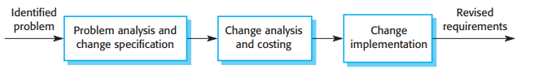

# Reqirements Engineering

**Autor:** Marco Reineke

In diesem Kapitel wird beschrieben, was genau funktionelle und nicht-funktionelle Anforderungen sind und weshalb man zwischen Nutzer- und Systemanforderungen unterscheidet. Es werden die Fragen beantwortet, warum Requirements Engineering so wichtig ist und inwiefern Requirements Engineering andere Aktivitäten der Softwareentwicklung unterstützt. Außerdem werden die Prozesse des Requirements Engineering beschrieben und wie diese zusammenhängen. Die drei wesentlichen Prozesse im Requirements Engineering sind die Anforderungserhebung, die Anforderungsspezifikation und Anforderungsvalidierung. Mithilfe dieser drei Prozesse wird ein sogenanntes system requirements document erstellt, in welchem die herausgearbeiteten Anforderungen festgehalten werden. Da es durchaus vorkommt, dass neue Anforderungen hinzukommen oder sich Anforderungen im Laufe des Entwicklungsprozesses ändern, gibt es noch den Prozess der Anforderungsänderung, welcher ebenfalls in diesem Kapitel beschrieben wird.

## Einleitung
Bei der Erstellung von Anforderungen für ein Softwareprojekt gibt es zwei verschiedene Level der Abstraktion. Diese Abstraktionslevel werden Nutzer- und Systemanforderungen genannt. Der wesentliche Unterschied zwischen Nutzer- und Systemanforderungen ist, dass Nutzeranforderungen eine abstrakte High-Level-Beschreibung der Anforderungen sind und Systemanforderungen eine detaillierte Beschreibung der Anforderung sind. In den Nutzeranforderungen wird mithilfe von natürlicher Sprache und Diagrammen beschrieben, welche Services das System dem Nutzer bereitstellen soll und unter welchen Einschränkungen das System später operieren wird. Dabei gibt es in den Nutzeranforderungen meist eine hohe Varianz zwischen groben Aussagen über eine Anforderung und einer detaillierten Beschreibung der Systemfunktionalität. In den Systemanforderungen wird detailliert beschrieben, welche Funktionen, Services und Beschränkungen es gibt. In den Systemanforderungen werden auch funktionelle Spezifikationen aufgenommen, welche genau beschreiben, was implementiert werden soll. Die Systemanforderungen werden manchmal in Verträgen aufgenommen, um die Anforderungen zu definieren.

#### Abbildung 4.1 [1]

In Abbildung 4.1 kann man erkennen, warum es Sinn ergibt verschiedene Grade der Detaillierung für die Spezifikationen der Anforderungen zu wählen. Der Grund ist, dass viele verschiedene Leute die Anforderungen des Softwareprojektes kennen müssen und jeder von ihnen eine andere Perspektive hat oder anderes Fachwissen. Für Softwareentwickler sind die Systemanforderungen zum Beispiel sehr wichtig. Für Manager hingegen sind diese eher irrelevant.

### Machbarkeitsstudie
Zu Beginn der Anforderungsanalyse sollte eine Machbarkeitsstudie durchgeführt werden. Dabei sollten die drei folgenden Fragen beantwortet werden
* 1. Trägt das System zu den allgemeinen Zielen der Organisation bei?
* 2. Kann das System mit vorhandenem Budget und im geplanten Zeitraum implementiert werden?
* 3. Ist das System mit anderen Systemen, die verwendet werden, integrierbar?

Falls eine der drei Fragen mit Nein beantwortet wird, sollte das Projekt nicht durchgeführt werden.

## Funktionelle und nicht - funktionelle Anforderungen

| Funktionelle Anforderungen | Nicht-funktionelle Anforderungen|
|:----------:|:-----------:|
| Was soll das System tun/nicht tun? | Spezifizierung der Beschränkungen für das System als Ganzes|
| Detaillierte Beschreibung der Systemfunktion(Inputs/Outputs) | Effekte auf Gesamtarchitektur und nicht auf einzelne Komponente|
|Anforderungen abhängig von zu entwickelnder Software|Die Implementierung der Anforderung zieht sich durch das ganze System|
|Anforderungen abhängig von zu erwartenden Nutzern|Messgrößen: Schnelligkeit, Benutzerfreundlichkeit, Verlässlichkeit, Robustheit, Portabilität|
|Sind eine Erweiterung der Nutzeranforderungen||
|Geschrieben für Softwareentwickler||

#### Abbildung 4.3 [1]

In Abbildung 4.3 kann man sehen, welche Faktoren alles bei den nicht-funktionellen Anforderungen herein spielen. Die nicht-funktionellen Anforderungen lass sich in drei Hauptkategorien unterteilen. Diese sind Produktanforderungen, organisationelle Anforderungen und externe Anforderungen. Bei den Produktanforderungen geht es um Faktoren, welche das zu entwickelnde Produkt betreffen, wie zum Beispiel die Sicherheit des entwickelten Systems oder die Laufzeit. Bei den organisationellen Anforderungen werden Anforderung, die das Unternehmen betreffen betrachtet und bei den externen Anforderungen werden äußere Einflüsse unter Betracht gezogen wie die Rechtslage oder Faktoren aus dem Rechnungswesen.

## Prozesse des requirements engineering

#### Abbildung 4.6 [1]
In der Abbildung 4.6 ist der Prozessablauf von der Anforderungserhebung bis zu der Erstellung des software requirements document dargestellt. Dabei gibt es drei Kernaktivitäten. Diese sind Anforderungserhebung, Anforderungsspezifikation und Anforderungsvalidierung und werden wie in der Abbildung dargestellt mehrmals nacheinander durchlaufen. Wird starten immer bei der Anforderungserhebung, welche eine high-level Aktivität ist und enden bei einer low-level Aktivität, der Anforderungsvalidierung.

### Anforderungserhebung
Im ersten Prozess des reuirements engineering arbeiten Softwareentwickler mit den Ergebnissbetroffenen zusammen, um folgende Dinge über das zu entwickelnde System und die Anwender herauszufinden:
* Anwendungsbereich des Systems
* Arbeitsaktivitäten der Ergebnissbetroffenen
* Services und Systemeigenschaften, welche die Ergebnissbetroffenen wollen
* benötigte Performance des Systems
* Hardware Beschränkungen

Die Erhebung und das Verständnis der Anforderungen der Ergebnissbetroffenen ist schwierig wegen, da die Ergebnissbetroffenen nicht immer wissen, was genau sie vom System wollen. Die Ergebnissbetroffenen erläutern ihre Anforderungen mit impliziten Kenntnissen und Fachsprache, welche nicht so leicht zu verstehen ist. Anforderungsingenieur müssen potenzielle Quellen, Gemeinsamkeiten und Konflikte der Anforderungen erkennen. Politische Einflüsse müssen erkannt werden, da Manager Anforderungen anfragen könnten, die ihren Einfluss auf die Organisation erhöhen. Außerdem können während des Analyseprozesses Änderungen durch ökonomische oder ökologische Faktoren auftreten, auf die eingegangen werden sollte.

Die Anforderungserhebung besteht aus vier Phasen:

* **Anforderungen entdecken und verstehen**:
Anforderungen aus Interaktion mit Ergebnisbetroffenen oder Dokumentationen sammeln.
* **Klassifizierung der Anforderungen**:
Klassifizierung der unstrukturierten Anforderungen und Gruppierung oder Erstellung von Clustern.
* **Anforderungen priorisieren und verhandeln**:
Manche Anforderungen stehen im Konflikt zueinander, weshalb die Anforderungen priorisiert werden und Kompromisse gefunden werden müssen.
* **Anforderungen dokumentieren**:
Die Anforderungen müssen dokumentiert werden, bevor sie erneut die Spirale durchlaufen.

Um die Anforderungen zu erheben, gibt es verschieden Techniken. Bei diesen Techniken werden die Ergebnissbetroffenen getroffen, um zu verstehen, wie diese arbeiten, was genau sie produzieren, wie das System genutzt wird und welche Änderungen am System benötigt werden. Die drei Techniken, die im Kapitel vorgestellt werden sind interviewen, Ethnografie, Stories und Szenarios.

#### Interviewen
Die Anforderungsingenieure interviewen die Ergebnissbetroffenen, um aus deren Antworten Anforderungen abzuleiten. Dabei gibt es zwei Arten von Interviews. Die erste Art ist ein geschlossenes Interview, bei welchem vordefinierte Fragen beantwortet werden und ein offenes Interview, bei dem eine Menge von Themen abgehandelt wird, um die Interessen der Ergebnisbetroffenen zu verstehen. In der Praxis wird meisten ein Mix aus den beiden Arten verwendet.

Schwierigkeiten bei der Technik sind, dass die Ergebnisbetroffenen Fachsprache verwenden, oder dass manch Wissen für sie so fundamental ist, dass es nicht erwähnt wird. Außerdem eignen sich Interviews nicht, um organisationelle Anforderungen und Beschränkungen zu erheben, da Machtverhältnisse innerhalb der Organisation diese beeinflussen können. Ein weiterer Schwachpunkt ist, dass die Interviewten die theoretischen anstatt die realen Strukturen im Unternehmen erläutern, da sie mit einem Fremden reden.

Als Interviewer sollte man folgende Dinge im Hinterkopf behalten:
* Man sollte unvoreingenommen in das Interview gehen und falls der Interviewte mit überraschenden Anforderungen kommt, bereit sein, die Vorstellung über das System zu ändern.
* Man sollte Sprungbrettfragen benutzen oder einen Vorschlag für eine Anforderung machen, anstatt direkt zu fragen „Was möchtest du für Anforderungen haben" ?

Interviews sollten nicht alleine als Anforderungserhebungstechnik verwendet werden, sondern im Verbund mit anderen Techniken.

#### Ethnografie
Softwaresysteme existieren nicht Isolation, sie werden in organisationellen und sozialen Umgebungen verwendet und die Softwaresysteme könnten von dieser Umgebung beschränkt werden. Ein Grund dafür, dass so viele Softwaresysteme entwickelt und nie benutzt worden ist, dass die Faktoren in der Anforderungsanalyse nicht berücksichtigt werden. Deswegen ist es wichtig, organisationale und soziale Themen zu verstehen, die das Softwaresystem beeinflussen könnten. Ethnografie ist eine Beobachtungstechnik, welche dabei hilft, betriebliche Prozesse zu verstehen und anhand dieser Prozesse Anforderungen abzuleiten. Der Analyst „taucht“ hierbei in die Arbeitsumgebung, in der das System später genutzt wird, ein und macht sich Notizen. Mit dieser Technik können implizite Systemanforderung gefunden werden, anstatt formal definierter Prozesse. Viele Menschen finden es schwierig Details zu erwähnen bei Dingen, die jeden Tag erledigen und sie verstehen nicht immer die Beziehung ihrer Arbeit zu anderen Prozessen, weshalb Ethnografie zur Anforderungserhebung sehr hilfreich sein kann. Der Fokus bei der Ethnografie ist auf dem Endnutzer, weswegen sich die Methode nicht eignet breitere organisationselle Anforderungen zu entdecken. Außerdem hilft Ethnografie nur, um bestehende Systeme zu verstehen, aber nicht, um neue Innovationen einzubringen. Daher sollte die Methode ebenfalls im Verbund mit anderen Anforderungserhebungstechniken verwendet werden.

#### Stories und Szenarios
Für die meisten Menschen ist es einfacher, sich auf echte Beispiele zu beziehen, als auf abstrakte Beschreibungen. Stories und Szenarios werden genutzt, um Informationen daraus zu erlangen, wie jemand mit einer Situation umgeht und wie er entstehende Probleme in dieser Situation bewältigen würde, oder ob die Person eine neue Herangehensweise an das Problem nutzen würde. Sie sind nicht gut darin neue Anforderungen zu finden, können allerdings gut in Interviews verwendet werden, um das System mit anderen Ergebnisbetroffenen zu diskutieren und mehr spezifische Systemanforderungen zu finden. Stories sind unstrukturierte, high-Level Beschreibungen der Anforderungen. Sie sind sinnvoll, um das Gesamtbild mit einer Erzählung darzustellen. Teile dieser Stories können dann in detaillierteren Szenarios ausgearbeitet werden. Szenarios sind Beschreibungen von Beispielen einer Benutzerinteraktionssitzung und werden in einer strukturierten, beschreibenden Art präsentiert.

Ein Szenario sollte folgende Punkte beinhalten:
* 1 Eine Beschreibung von dem, was den Nutzer erwartet, wenn das Szenario startet.
* 2 Eine Beschreibung über den Ablauf der Ereignisse in dem Szenario.
* 3 Was kann in dem Szenario schiefgehen und wie kann das resultierende Problem gelöst werden?
* 4 Informationen über andere Aktivitäten, die zur selben Zeit stattfinden.
* 5 Eine Beschreibung des Systemstatus, wenn das Szenario endet.

### Anforderungsspezifikation
Bei der Anforderungsspezifikation werden die Systemaanforderungen und die Nutzeranforderungen in dem requirements document aufgeschrieben. Es sollte darauf geachtet werden, dass die Anforderungen klar, eindeutig, einfach zu verstehen, komplett und konsistent sind. Das ist in der Praxis leider so gut wie nie zu erreichen, da die Anforderung meist in inhärenten Konflikten zueinander stehen. Die Nutzeranforderungen enthalten Systemanforderungen und Nutzeranforderungen. Die Nutzeranforderungen werden in natürlicher Sprache, mit ergänzenden Grafiken und Tabellen beschrieben. Sie für sollten die Systemnutzer einfach zu verstehen sein. Die Systemanforderungen sind ebenfalls in natürlicher Sprache und grafischen Notationen geschrieben. Allerdings werden bei den Systemanforderungen auch mathematische Notationen genutzt. Mathematische Notationen können dabei zum Beispiel formale Spezifikationen wie endliche Zustandsmaschinen sein. Diese können dabei helfen, die Eindeutigkeit einer Spezifikation zu verbessern, sind allerdings für die meisten Kunden nicht gut zu verstehen. Alles in allem sind Systemanforderungen eine Erweiterung der Nutzeranforderungen, da sie mehr Detail hinzufügen und beschreiben, wie die Systemanforderungen die Nutzeranforderungen bereitstellen. Außerdem werden die Systemanforderungen wie oben bereits erwähnt in Verträge aufgenommen.

#### Anwendungsfälle
Um die Interaktion zwischen Nutzer und System zu beschreiben, eignen sich Anwendungsfälle. Dazu werden grafische Modelle
genutzt. Ein fundamentales Feature ist das UML-Diagramm. Anwendungsfälle sind oft zu fein granuliert, um Anforderungen zu diskutieren. Daher sind sie nützlicher für das Systemdesign, als für die Anforderungsanalyse.

#### Das software requirements document
Das software requirements document ist eine offizielle Aussage zu dem, was implementiert werden soll. Es beinhaltet die Nutzer- und Systemanforderungen und ist sehr nützlich, falls Systeme ausgelagert werden, unterschiedliche Entwicklerteams verschiedene Teile des Systems entwickeln, oder wenn eine detaillierte Analyse des Systems benötigt wird. Agile Methoden der Softwareentwicklung argumentieren, dass das software requirements document veraltet ist, sobald es geschrieben wurde, da die Anforderungen sich so schnell wieder ändern. Der Lösungsansatz agiler Methoden ist daher, die Nutzeranforderungen inkrementell zu sammeln und auf Karten oder Tafeln als Userstories aufzuschreiben. Das software requirements document hat diverse Nutzer wie zum Beispiel Manager, Systemingenieure, Systemtestingenieur oder Systemwartungstechniker. Daher sollte im Dokument darauf geachtet werden, dass alle Nutzer mit dem Dokument zufrieden gestellt werden können. Wie detailliert das Dokument sein sollte, hängt vom System ab. Kritische oder komplexe Systeme sollten im system requirements document detaillierter beschrieben werden als andere.

#### Abbildung 4.16 [1]
In Abbildung 4.16 wird gezeigt, welche Personen, mit was für einer Funktion im Projekt alles auf das software requirements document zugreifen und was sie dem Dokument entnehmen wollen.
### Anforderungsvalidierung
Bei der Anforderungsvalidierung wird geprüft, ob das die Anforderungen wirklich das System definieren, welches der Kunde haben möchte. Hier gibt es eine Überlappung mit der Anforderungserhebung. Die Anforderungsvalidierung ist wichtig, da ein Fehler in diesem Prozess später sehr hohe Kosten verursachen kann.

Prüfungen im Validierungsprozess:
* **Gültigkeitsprüfung**:
Prüfen, ob die Anforderungen die tatsächlichen Bedürfnisse der Benutzer erfüllt.
* **Konsistenzprüfung**:
Die Anforderungen im Dokument sollten nicht im Konflikt stehen.
* **Vollständigkeitsprüfung**:
Das Dokument solle alle Funktionen und Beschränkungen beinhalten.
* **Realitätsprüfung**:
Prüfen, ob Anforderungen mit dem Budget und in der geplanten Zeit implementiert werden kann.
* **Überprüfbarkeit**:
Eine Menge von Tests schreiben, welche demonstriert, dass alle spezifizierten Anforderungen erfüllt werden.

Für die Validierung der Anforderungen empfehlen sich folgende Techniken:
* **Anforderungsrezensionen**:
Systematische Analyse von Rezensionisten, die nach Fehlern suchen.
* **Prototyp erstellen**:
Einen Prototyp erstellen, mit dem die Ergebnisbetroffenen experimentieren können und eine Rückmeldung geben können.
* **Testfallgenerierung**:
Tests schreiben, bevor man mit der Implementierung des Systems beginnt.

Da es sehr schwer ist alle Anforderungen eines Systems zu finden, werden später Anforderungsänderungen benötigt.

## Anforderungsänderungen
Anforderungen ändern sich sehr häufig, vor allem bei großen Softwaresystemen. Große Softwareprojekte haben häufig „schwache Probleme“, das heißt die Probleme können nicht vollständig definiert werden und die Anforderungen sind unvollständig. Ein weiterer Grund für Anforderungsänderungen ist, dass das Verständnis des Problems der Ergebnissbetroffenen sich verändert. Außerdem treten, sobald das System installiert ist, neue Probleme auf, welche korrigiert werden müssen. Die meisten Anforderungsänderungen sind allerdings notwendig, da sich etwas im Geschäftsumfeld ändert. Um Probleme zu bewältigen, die während des Entwicklungsprozesses entstehen, können agile Entwicklungsprozesse verwendet werden. In agilen Entwicklungsprozessen können Benutzer Änderungen vorschlagen, die dann ohne formales Änderungsmanagement durchgeführt werden. Dabei entscheidet der Nutzer, welche Priorität die zu entwickelnden Eigenschaften der nächsten Iteration haben. Das Problem dabei ist, dass die meisten User nicht darauf achten, ob Änderungen kosteneffizient sind.

### Anforderungsmanagement Planung
Während der Planungsphase müssen folgende Themen berücksichtigt werden:
* 1 Anforderungsidentifikation
  * Identifizierung jeder Anforderung und Referenz zu anderen Anforderung
* 2 Änderungsmanagement Prozess
  * Problemanalyse und Änderungsspezifikation
  * Änderungsanalyse und Kostenanalyse
  * Änderungsimplementierung
* 3 Rückverfolgbarkeitsprozess
  * Definieren von Beziehungen zwischen dem Systemdesign und der Anforderung
* 4 Tool Unterstützung(Für große Projekte sehr wichtig)
  * um Anforderungen zuverlässig/sicher zu Speichern
  * um die vorgeschlagenen Änderungen im Auge zu behalten
  * um auf die vorgeschlagenen Änderungen reagieren zu können
  * um verwandte Anforderungen zu entdecken
  * manche Tools verwenden NLP Techniken, um Beziehungen zwischen Anforderungen zu entdecken

### Anforderungen Änderungsmanagement

#### Abbildung 4.19 [1]
In Abbildung 4.19 wird der Prozessablauf im Anforderungen Änderungsmanagement gezeigt.

Anforderungen Änderungsmanagement sollte für alle Änderungen, die nach der Veröffentlichung des requirements document vorgeschlagenen werden durchgeführt werden.
Änderungsmanagement ist wichtig, damit entschieden werden kann, ob die Vorteile der Implementation von neuen Anforderungen, bei den aufkommenden Kosten gerechtfertigt werden kann. Nachdem Änderungen gemacht wurden, sollten diese in das requirement document aufgenommen werden, da es leicht ist Änderungen zu vergessen.

## Referenzen

[1]: Ian Sommerville. 2015. Software Engineering (10th. ed.),101 - 137.
