# Architectural Design

**Autor:** Leon Brandt

# Einleitung

// Definition

Architectural Design befasst sich mit dem Entwurf der Struktur und Organisation von Softwaresystemen. Hierbei werden die strukturellen Hauptkomponenten eines Systems sowie die Beziehungen dieser identifiziert. Ergebnis dieser Tätigkeit ist ein Architectural Model. Dieses Artefakt beschreibt die Organisation eines Systems als Menge von kommunizierenden Komponenten.

// Motivation

In agilen Prozessen ist es üblich, dass früh im Entwicklungsprozess ein Fokus auf das Design des Gesamtsystems gelegt wird. Ein inkrementelles Entwickeln von Architekturen ist üblicherweise nicht erfolgreich. Grund hierfür ist, dass ein Refactoring einzelner Komponenten üblicherweise relativ einfach ist. Ein Refactoring einer Systemarchitektur ist aufwändig, weil möglicherweise ein Ändern mehrerer Komponenten erforderlich ist.

// Abgrenzung zu Requirements engineering

In der Praxis besteht eine große Schnittmenge zwischen Requirements Engineering und Architectural Design. Im Idealfall enthält eine Systemspezifikation keine Designinformationen. Dies ist jedoch unrealistisch, da High-Level-Features eines Systems durch seine Hauptkomponenten repräsentiert werden. Bereits im Requirements Engineering kann eine abstrakte Systemarchitektur erzeugt werden. Hierbei werden Systemfeatures zu abstrakten Komponenten oder Subsystemen gruppiert.

// Abstraktionsebenen

Softwarearchitekturen können auf zwei Abstraktionsebenen betrachtet werden. *Architecture in the small* betrachtet die Architektur individueller Programme. *Architecture in the large* betrachtet die Architektur komplexer Systeme. Also möglicherweise verteilte Systeme aus anderen Systemen, Programmen und Programmkomponenten. Dieses Kapitel befasst sich hauptsächlich mit Architecture in the small.

// Relevanz

Wohingegen individuelle Komponenten funktionale Anforderungen eines Systems implementieren, ist der dominante Einflussfaktor auf nicht-funktionale Anforderungen eines Systems seine Systemarchitektur. Die Architektur eines Systems bestimmt also seine Performance (Laufzeitperformanz), Robustness (Robustheit), Distributability (Verteilbarkeit) sowie Maintainability (Wartbarkeit).

Ein explizites Designen und Dokumentieren von Softwarearchitekturen hat diverse Vorteile. So kann eine High-Level-Repräsentation eines Systems zur Kommunikation mit Stakeholdern genutzt werden. Weiterhin erfordert das Benennen einer Systemarchitektur ein hohes Maß an Analyse. Diese beeinflusst die bereits erwähnten nicht-funktionalen Charakteristiken. Systemarchitekturen sind für Systeme mit ähnlichen Anforderungen häufig gleich. Die Architectural Models dieser Systeme können wiederverwendet werden.

# Architectural Model

// Blockdiagramme

Das Ergebnis von Architectural Design ist ein Architectural Model. Hierbei werden zur Modellierung von Systemarchitekturen häufig einfache Blockdiagramme auf eine informelle Art genutzt. Hierbei repräsentieren Kästen einzelne Komponenten, Kästen in Kästen Komponenten, die in Subkomponenten zerlegt werden und Pfeile repräsentieren den Fluss von Daten oder Kontrollsignalen. Abbildung 1 zeigt an einem Beispiel ein solches informelles Blockdiagramm.

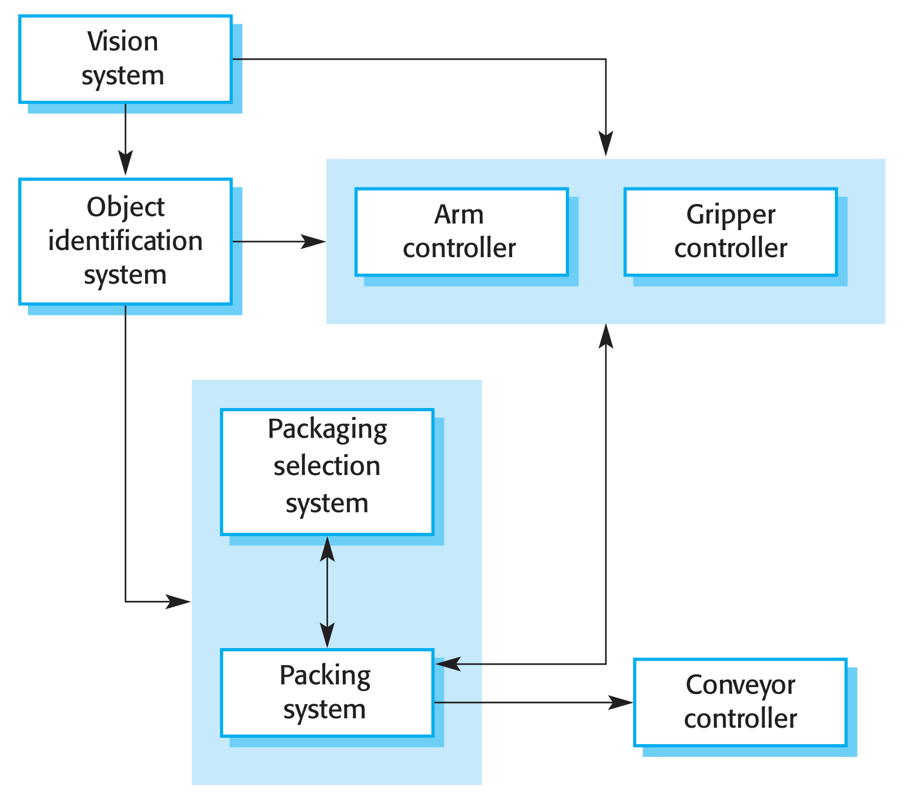
Abbildung 1: Beispiel für ein Architectural Model als Blockdiagramm [Fig. 6.1]

// Formalität

Blockdiagramme stellen eine High-Level-Betrachtung einer Systemstruktur dar. Menschen verschiedener Disziplinen, die im Softwareentwicklungsprozess involviert sind, können diese verstehen. Nachteil von Informellen Darstellungen ist, dass diese undetaillierte Repräsentationen von Softwarearchitekturen sind. Sie stellen weder die Typen von Beziehungen zwischen Komponenten, noch die von außen sichtbaren Eigenschaften von Komponenten dar.

Architectural Models werden in der Praxis auf zwei Arten verwendet. Zum Einen als Kommunikationshilfe im Designprozess. Hierbei sind High-Level-Repräsentationen von Systemen nützlich. Wie bereits erwähnt können diese von allen Stakeholdern verstanden werden, da sie ein hohes Maß an Intuitivität aufweisen. So können Domainexperten und Softwareingenieure über ein System in Gänze kommunizieren, ohne, dass Verwirrung durch Details erzeugt wird. Weiterhin können solche Darstellungen von Managern zur Projektplanung genutzt werden, weil Hauptkomponenten einfach zu identifizieren sind, sodass die Entwicklung auf Basis dieser geplant werden kann.

Die zweite Art der Verwendung von Architectural Models ist zur Dokumentation. Ziel hierbei ist das Erzeugen eines vollständigen Systemmodells. Dieses zeigt alle Komponenten sowie deren Interfaces und Verbindungen. Hierzu eignen sich strengere Notationen besser, da ein höherer Detail- und Vollständigkeitsgrad weniger Raum für Missverständnisse bietet. Das Erzeugen dieser solcher detaillierten Architekturdokumentationen ist zeitaufwendig und damit teuer. Die Kosteneffektivität lässt sich praktisch nicht messen, deshalb ist dieser Ansatz nicht weit verbreitet.

Eine Umfrage zeigt, dass UML, wenn es zur Beschreibung von Architekturen genutzt wird, meist informell genutzt wird. UML wurde entwickelt, um objektorientierte Systeme zu beschreiben. Sommerville argumentiert, dass in der Phase des Architekturdesigns Systeme in einem höheren Level von Abstraktion beschrieben werden sollten. UML ist im Designprozess deshalb nicht nützlich und es sollten besser informelle Notationen zum Einsatz kommen, die schneller zu schreiben sind. UML hat seinen größten Wert zur Dokumentation von Architekturen im Detail. Andere Modellierungssprachen wie spezialisierte Architectural Description Languages (ADLs) sind von Domänenexperten möglicherweise zu schwer nutzbar, weshalb Sommerville für diese keine Durchsetzung in der Praxis sieht.

## Architectural Views

Bei der Verwendung von Architectural Models zur Dokumentation, also als Basis für Design in höherem Detailgrad beziehungsweise zur Implementierung stellt sich die Frage welche Perspektiven auf eine Systemarchitektur nützlich sind. Es ist nicht möglich, alle relevanten Informationen über die Architektur eines Systems in einem einzelnen Diagramm darzustellen. Ein grafisches Modell kann nur eine Sichtweise beziehungsweise Perspektive zeigen. Es zeigt möglicherweise wie ein System in Module zerlegt ist, wie Prozesse zur Laufzeit interagieren oder wie Komponenten über ein Netzwerk verteilt sind. Diese Perspektiven sind alle zu unterschiedlichen Zeitpunkten für Design und Dokumentation nützlich. Krutchen schlägt vier fundamentale Architektur-Sichten vor.

Die Logical View (logische Sicht) zeigt die wesentlichen Abstraktionen innerhalb des Systems als Objekte oder Objektklassen. Eine Zuordnung von Systemanforderungen zu Entities sollte hierbei möglich sein.

Die Process View (Prozesssicht) zeigt wie das System zur Laufzeit aus interagierenden Prozessen zusammengesetzt ist. Diese Perspektive ist nützlich um nicht-funktionale Charakteristiken wie Performance oder Availability zu beurteilen.

Die Development View (Entwicklungssicht) zeigt wie die Software zur Entwicklung zerlegt ist. Hierbei sind Komponenten, die von einzelnen Entwicklern beziehungsweise Teams entwickelt werden können sichtbar. Diese Perspektive ist nützlich für sowohl Manager als auch Programmierer.

Die Physical View (physische Sicht) zeigt die Hardware sowie die Verteilung von Komponenten über die Prozessoren im System. Diese Perspektive ist nützlich für Systemingenieure zur Planung des Deployments.

Hofmeister et. al. ergänzen das Modell von Krutchen durch eine Conceptual View (konzeptionelle Sicht). Diese ist eine abstrakte Ansicht des Systems, welche genutzt werden kann um High-Level-Anforderung in detaillierte Spezifikationen zu zerlegen. Diese Perspektive kann Entwicklern auch dabei helfen zu entscheiden, welche Komponenten wiederverwendet werden können.

// Praxis

In der Praxis wird eine Conceptual View meistens innerhalb des Designprozesses erzeugt. Andere Perspektiven beziehungsweise Sichten werden bei Bedarf erzeugt. Es ist selten notwwendig, eine vollständige Beschreibung aller Sichten zu erzeugen. In agilen Methoden wird häufig die Behauptung formuliert, dass detaillierte Dokumentationen meistens ungenutzt bleiben. Somit ist die Entwicklung von Artefakten zur Dokumentation von Architekturen eine Verschwendung von Ressourcen. Aus diesem Grund sollten laut Sommerville nur die Perspektiven genutzt werden, die zur Kommunikation nützlich sind. Er schlägt vor, sich nicht um die Vollständigkeit der Dokumentation von Architekturen zu sorgen.

# Architectural Design Decisions

// Prozess ("Es gibt keinen Prozess")

Architectural Design ist ein kreativer Prozess. Hier wird die Organisation eines Systems entworfen, sodass sowohl funktionale als auch nicht-funktionale Anforderungen an das System erfüllt werden. Es existiert kein stereotyper Prozess, denn dieser hängt vom Typ des zu entwickelnden Systems, vom Hintergrund und der Erfahrung des Systemarchitekts sowie von spezifischen Anforderungen an das System ab. Deshalb ist Architectural Design nicht als Sequenz von Aktivitäten zu verstehen. Ein besseres Konzept ist eine Serie an Entscheidungen, die zu treffen sind. Diese Entscheidungen haben tiefgreifende Auswirkungen auf das System und den Entwicklungsprozess.

// Fragestellungen

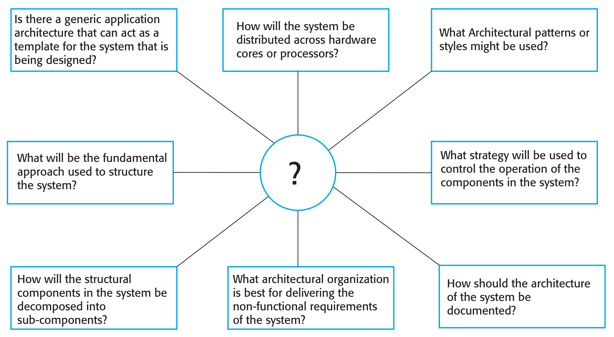
Abbildung 2: Acht Fragestellungen für Systemarchitekten zur Hinleitung an Architectural Design Decisions [Fig. 6.2]

Systemarchitekten haben sich die acht in Abbildung 2 dargestellten Fragestellungen zu stellen. Fragen eins und drei befassen sich mit Templates beziehungsweise Pattern und Styles. Hierbei geht es um die Wiederverwendung von erprobten Architekturen. Systeme der selben Anwendungsdomäne besitzen häufig eine ähnliche Architektur. Diese reflektiert die fundamentalen Konzepte der Anwendungsdomäne. Beim Design von Systemarchitekturen ist zu entscheiden, was das zu entwickelnde System mit breiteren Klasse an Anwendungen gemeinsam hat, also wie viel Wissen aus diesen Anwendungen wiederverwendet werden kann. Ein Architectural Pattern ist die Beschreibung der wesentlichen Eigenschaften einer Architektur, welche in verschiedenen Softwaresystemen wiederverwendet wird.

Die Software der meisten großen Systeme ist über viele verschiedene Computer verteilt. Die Auswahl der Verteilungsarchitektur hat wesentliche Auswirkungen auf Performance und Reliability des Systems. Frage drei befasst sich mit der Frage nach der Verteilung von Systemen.

Die Fragen vier bis sechs befassen sich mit den strukturellen Eigenschaften eines Systems. So müssen strukturelle Komponenten identifiziert, zerlegt und die Steuerung dieser definiert werden.

Die Frage acht befasst sich mit der bereits im Detail diskutierten Frage nach der Dokumentation von Systemen. Frage sieben befasst sich mit dem Erfüllen von nicht-funktionalen Anforderungen. Hierzu folgend mehr. Abbildung 3 zeigt zur Zusammenfassung eine vereinfachte und verkürzte Version der Abbildung 2.

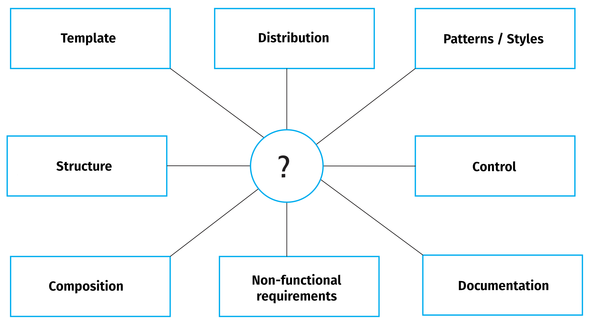
Abbildung 3: Verkürzung der acht Fragestellungen für Systemarchitekten auf deren Hauptbegriffe [Eigene Darstellung; nach Fig. 6.2]

## Nicht-funktionale Anforderungen an Systeme

Aufgrund der engen Beziehung zwischen nicht-funktionalen Anforderungen an ein System und Softwarearchitektur sollte die Wahl des Stils und der Struktur einer Architektur von nicht-funktionalen Anforderungen abhängen.

Wenn Performance (Laufzeitperformanz) eine kritische Anforderung ist, sollte die Architektur performanzkritische Operationen auf eine geringe Anzahl an Komponenten lokalisieren. Dies bedeutet die Existenz weniger und größerer anstatt vieler und feingranularer Komponenten, da dies die Kommunikation zwischen Komponenten reduziert. Weiterhin sollte eine Parallelisierung auf mehrere Prozessoren in Erwägung gezogen werden.

Wenn Security (Sicherheit hinsichtlich gezielter Störversuche) eine kritische Anforderung ist, bietet sich die Verwendung einer geschichteten Struktur an. Kritische Assets befinden sich hierbei weiter Innen. Es ist ein hoher Grad an Security-Validierung innerhalb der Schichten zu implenentieren.

Wenn Safety (Sicherheit hinsichtlich der Umgebung) eine kritische Anforderung ist, sollten safety-relevante Vorgänge in einer gemeinsamen Komponente oder einer geringen Anzahl an Komponenten stattfinden. Dies reduziert Kosten hinsichtlich Validierung und ermöglicht, dass verbundene Schutzsysteme im Fehlerfall sicher abgeschaltet werden können.

// mehr Validierung erhöht Security; weniger Validierung erhöht Safety

Wenn Availability (Verfügbarkeit) eine kritische Anforderung ist, sollten redundante Komponenten zum Einsatz kommen. Dies ermöglicht ein Ersetzen und Aktualisieren dieser ohne Ausfallzeiten.

Wenn Maintainability (Wartbarkeit) eine kritische Anforderung ist, sollten Komponenten fein-granular beziehungsweise *self-contained*, also unabhängig sein. Erzeuger von Daten sollten weiterhin von Konsumenten dieser getrennt sein. Auch sind verteilte Datenstrukturen zu vermeiden.

Grundsätzlich besteht ein Konfliktpotential zwischen diesen Ansätzen zum Entwurf von Systemarchitekturen. So verbessern zum Beispiel große Komponenten die Laufzeitperformanz, wohingegen kleine Komponenten die Wartbarkeit verbessern. Wenn beide Charakteristiken von Relevanz sein sollten, ist ein Kompromiss zu finden. Hierzu können zum Beispiel für verschiedene Teile eines Systems unterschiedliche Ansätze verfolgt werden.

Die Bewertung von Architekturdesigns ist schwierig. Der Test einer Architektur ist die Genügung des Systems hinsichtlich funktionaler und nicht-funktionaler Anforderung im Betrieb. Eine Evaluation kann jedoch durch Vergleich mit Referenzarchitekturen oder Pattern geschehen.

# Architectural Patterns

In diversen Bereichen des Software Engineerings sind Pattern als Art des Präsentierens, Teilens und Wiederverwendens von Wissen über Softwaresysteme üblich. Architectural Pattern sind eine abstrakte Beschreibung von bewährten Praktiken, die sich in verschiedenen Systemen und Umgebungen bewährt haben. Sie beschreiben die Organisation entsprechender Systeme sowie Stärken und Schwächen dieser. Es folgen ausgewählte Beispiele für weit verbreitete Pattern, die gute Prinzipen des Architectural Designs zeigen.

## Model-View-Controller (MVC)

### Beschreibung

Das Pattern Model-View-Controller (MVC) seperiert Präsentation und Interkation von Daten. Hierzu werden Systeme in die drei logischen Komponenten Model, View und Controller strukturiert. Das Model verwaltet Daten und implementiert Operationen auf diesen. Die View definiert und verwaltet die Präsentation der Daten. Der Controller verwaltet Benutzerinteraktion und leitet diese an View und Model.

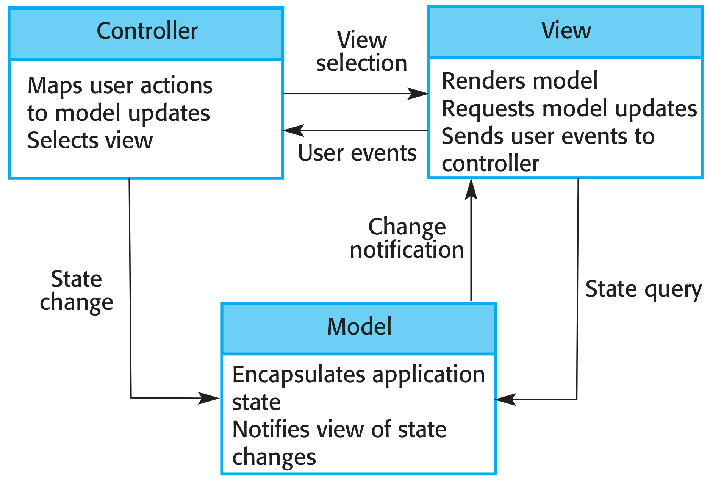
Abbildung 4: Pattern Model-View-Controller (MVC) als Blockdiagramm [Fig. 6.5]

Abbildung 4 zeigt das MVC-Pattern als Blockdiagramm. Dargestellt werden die logischen Komponenten Model, View und Controller sowie der Interkationsfluss zwischen diesen.

### Verwendung

Das MVC-Pattern bietet sich an, wenn es mehrere Wege gibt, Daten zu betrachten und mit diesen zu interagieren. Auch ist es nützlich, wenn kunkünftige Anforderung für Interkation und Datenpräsentation unbekannt sind.

### Vorteile

Das MVC-Pattern erlaubt Änderungen am Datenmodell unabhängig von der Präsentation sowie umgekehrt. Außerdem erlaubt es verschiedene Präsentationen der selben Daten auf unterschiedliche Weise. Änderungen von Daten in einer Präsentation sind dann unmittelbar in allen sichtbar.

### Nachteile

Das MVC-Pattern erzeugt zusätzlichen Code und damit Komplexität. Dies ist auch dann der Fall, wenn Datenmodell und Interaktion simpel sind.

## Layered Architecture

### Beschreibung

Architekturen, die dem Pattern Layered Architecture folgen, sind in Schichten organisiert. Diese implenentieren zusammengehörige Funktionalitäten. Eine Schicht stellt der Schicht über ihr Services zur Verfügung. Jede Schicht erfordert somit nur die Schicht direkt unterhalb. Die unterste Schicht repräsentiert Core-Funktionalitäten.

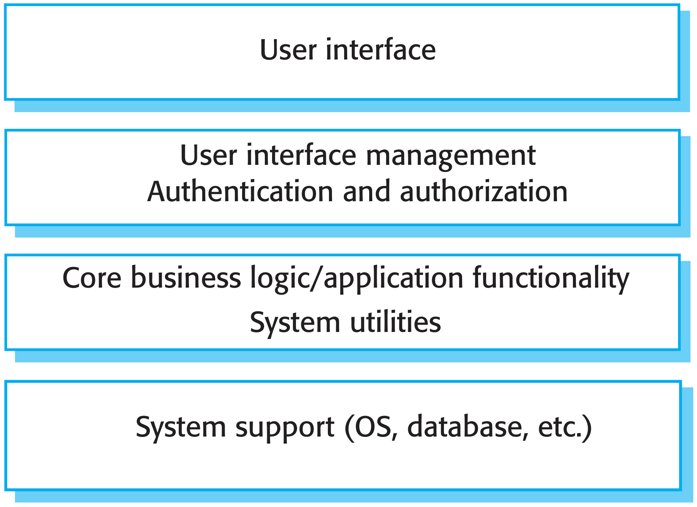
Abbildung 5: Pattern Layered Architecture als Blockdiagramm [Fig. 6.8]

Abbildung 5 zeigt das Pattern Layered Architecture als Blockdiagramm and einem Beispiel. Dargestellt werden vier Schichten von UI bis Systemkomponenten wie das Betriebssystem.

### Verwendung

Das Pattern Layered Architecture bietet sich an, wenn Funktionalitäten auf Basis existierender Systeme hinzugefügt werden sollen. Auch kann es nützlich sein, wenn die Entwicklung eines Systems über mehrere Teams verteilt ist. Hierbei kann jedes Team die Verantwortung für eine Schicht erhalten. Wie in einem vorherigen Abschnitt bereits erwähnt findet eine geschichtete Architektur auch bei Anforderungen an Security Anwendung.

### Vorteile

In Systemen, die nach dem Pattern der Layered Architecture organisiert sind, sind einzelne Schichten austauschbar und portabel. Dies ist so lange der Fall, wie sich Interfaces zur abhängigen, also der höherliegenden Schicht nicht verändern. Sollten doch Änderungen im Interface auftreten, ist nur eine Schicht, also eine Komponente davon betroffen. Redundante Funktionalitäten wie zum Beispiel Authentifizierung in mehreren Schichten können die Dependability eines Systems verbessern. Weiterhin unterstützt eine Schichtung ein inkrementelles Entwickeln von Systemen. So können bereits während der Entwicklung des Systems einzelne innenliegende Services dem Benutzer bereits bereitgestellt werden. Zuletzt erleichtert eine Layered Architecture Multi-Plattform-Implementierungen. Da Maschinenabhängigkeiten lokal gehalten werden, müssen hier nur maschinenabhängige Layer neu implementiert werden.

### Nachteile

In der Praxis ist eine saubere Seperation von Schichten häufig schwierig. Außerdem müssen Schichten gegebenenfalls über mehrere Ebenen direkt interagieren und nicht über einen Stapel an Schichten dazwischen. Mehrere Level der Verarbeitung von Anfragen kann dann Performance negativ beeinträchtigen.

## Repository Architecture

### Beschreibung

Bei Systemen, die nach dem Pattern Repository Architecture organisiert sind, werden alle Daten innerhalb des Systems in einem zentralen Repository verwaltet. Komponenten interagieren nur durch das Repository mit diesen und niemals direkt.

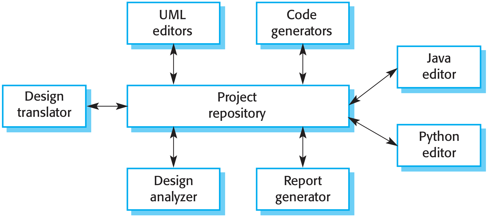
Abbildung 6: Pattern Repository Architecture als Blockdiagramm [Fig. 6.11]

Abbildung 6 zeigt das Pattern Repository Architecture als Blockdiagramm. Dargestellt werden verschiedene Komponenten, die mit einem zentralen Repository interagieren.

Innerhalb dieses Patterns kann man zwei Varianten der Steuerung unterscheiden. Das Repository kann passiv sein und die Steuerung von Zugriffen ist die Aufgabe der Komponenten, die dieses nutzen. Alternativ kann das Repository in Komponenten einen Trigger auslösen, wenn Daten verfügbar wwewrden.

### Verwendung

Das Pattern Repository Architecture bietet sich an bei Systemen, die große Mengen von Informationen erzeugen, die über einen "langen" Zeitraum persistiert werden müssen. Auch ist es bei Data-Driven-Systems nützlich, wenn das Hinzufügen von Daten in ein Repository Aktionen auslösen soll.

Die Mehrheit der Systeme, die große Mengen von Daten verarbeiten sind um geteilte Datenbanken oder Repositories organisiert. Dieses Modell ist geeignet für Anwendungen, bei deinen eine Komponente Daten generiert, die von einer anderen Komponente genutzt werden sollen.

### Vorteile

In diesem Pattern sind Komponenten unabhängig und müssen nichts von der Existenz anderer Komponenten wissen, weil keine explizite Kommunikation zwischen einzelnen Komponenten stattfindet. Weiterhin wirken sich Datenänderungen innerhalb einer Komponente global auf alle Komponenten aus. Durch diese Form der Zentralisierung sind alle Daten also durchgehend konsistent. Diese Tatsache vereinfacht auch zum Beispiel das Erstellen von Backups.

### Nachteile

Repositories sind zentrale Schwachpunkte für Fehler (single point of failure). Probleme im Repository haben also Auswirkungen auf das gesamte System. Weiterhin kann die Organisation großer Teile der Kommunikation durch ein Repository uneffizient sein. Auch birgt die Verteilung des Repositories Herausforderungen, weil mehrere Kopien der Daten verwaltet werden müssen und das Herstellen von Konsistenz über diese einen Overhead zum System hinzufügt.

Zuletzt müssen Komponenten auf Basis eines zentralen Repository-Datenmodells arbeiten. Dieses stellt meist einen Kompromiss zwischen spezifischen Anforderungen von Komponenten dar. Eine Integration neuer Komponenten kann somit schwierig oder gar unmöglich sein, wenn das interne Datenmodell inkompatibel zu dem des Repositories ist.

## Client-Server-Architecture

### Beschreibung

In einer Client-Server-Architecture werden Repräsentiert durch eine Menge an Services, die von Servern zur Verfügung gestellt werden sowie Clients, also Nutzer dieser Services. Diese greifen über ein Netzwerk auf Server zu um Services zu nutzen.

Server sind hierbei Softwarekomponenten, die Services anbieten, wobei mehrere Server auf dem selben Recher ausgeführt werden können. Üblicherweise laufen viele Instanzen von Client-Programmen parallel auf vielen Computern. Client-Server-Systeme sind klassischerweise als verteilte Systeme implementiert. Das logische Modell von unabhängigen Services, die durch verschiedene Server angeboten werden, kann jedoch auf einem einzigen Rechner implementiert werden. Die wesentlichen Eigenschaften dieser Architektur gehen dabei nicht verloren.

Clients müssen innerhalb von Client-Server-Architekturen verfügbare Server sowie deren Services kennen. Server hingegen müssen weder die Identitäten noch die Anzahl der Clients kennen.

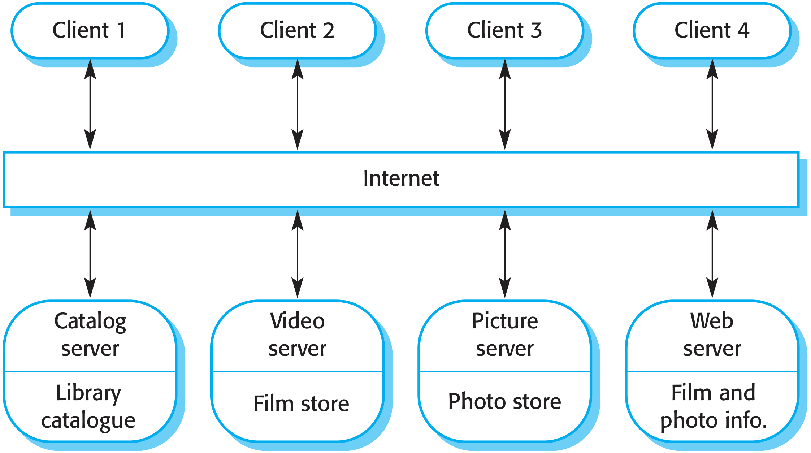
Abbildung 7: Client-Server-Architektur als Blockdiagramm [Fig. 6.13]

Abbildung 7 zeigt eine Client-Server-Architektur als Blockdiagramm. Im oberen Bereich sind mehrere Clients, darunter das genutzte Netzwerk (hier das Internet) dargestellt. Beispielhaft werden im unteren Bereich verschiedene Server sowie deren Services als Komponenten abgebildet.

### Verwendung

Client-Server-Architekturen bieten sich immer dann an, wenn Daten in einer geteilten Datenbank von verschiedenen Orten abgerufen werden müssen. Außerdem ist dieses Pattern nützlich, wenn die Last auf ein System variabel ist, da Server repliziert werden können.

### Vorteile

Wichtigster Vorteil des Client-Server-Modells ist die Verteilung eines Systems beziehungsweise von Servern über ein Netzwerk. Generelle Funktionalitäten können Clients zur Verfügung gestellt werden, ohne, dass alle Clients alle Services selbst implementieren müssen. Weiterhin ist es einfach neue Server hinzuzufügen und diese mit dem restlichen System zu integrieren sowie Server zu updaten und upgraden, ohne andere Teile eines Systems zu beeinflussen.

### Nachteile

Innerhalb von Client-Server-Architekturen ist jeder Service eine Fehlerquelle (single point of failure), da diese anfällig gegenüber DoS-Attacken oder Server-Fehlern sind. Auch können die Performanzeigenschaften solcher Systeme unvorhersehbar sein, da diese von System und Netzwerk abhängen.

## Pipe-and-Filter-Architecture

### Beschreibung

In Pipe-and-Filter-Architekturen ist die Verarbeitung von Daten so organisiert, dass Verarbeitungseinheiten (Filter) einen Typ von Datentransformationen durchführen. Jeder Bearbeitungsschritt wird als Transformation auf Daten implementiert. Daten fließen in "Pipes" zur Verarbeitung von einer Komponente zur Nächsten und werden nach und nach transformiert. Transformationen können sequentiell oder parallel ausgeführt sowie Elementweise oder in Batches ausgeführt werden.

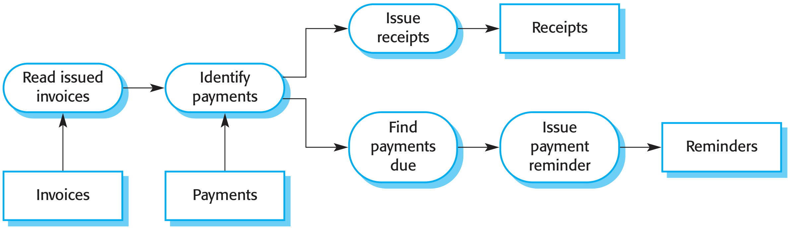
Abbildung 8: Client-and-Filter-Architecture als Blockdiagramm [Fig. 6.15]

Abbildung 8 zeigt eine Client-and-Filter-Architecture als Blockdiagramm. Abgerundete Blöcke repräsentieren Transformationen. Diese hängen mit durch Pfeile gekennzeichnete Pipes zusammen. Transformationen werden hier sowohl sequentiell als auch parallel ausgeführt.

### Verwendung

Pipe-and-Filter-Architekturen bieten sich immer dann an, wenn Inputs in seperaten Schritten zu Outputs verarbeitet werden. Varianten dieses Pattern werden seit Beginn der Benutzung von Computern für automatisierte Datenverarbeitung eingesetzt.

Dieses Pattern ist am Besten für Batch-Processing und eingebettete Systeme geeignet, da dort Benutzerinteraktion begrenzt ist. Interaktive Systeme, sowie grafische Benutzeroberflächen sind schwer als Pipe-and-Filter-System umzusetzen. Diese besitzen Steuerungsstrategien, die auf Events basieren und sind nur schwer als sequentiellen Datenstream zu implementieren.

### Vorteile

Pipe-and-Filter-Architekturen sind meist einfach zu verstehen. Weiterhin ist das Wiederverwenden einzelner Transformations-Komponenten möglich. Die Art der Verarbeitung entspricht bereits die Art der Struktur vieler Businessprozesse. Die Weiterentwicklung von Systemen kann durch einfaches Hinzufügen von Transformationen simpel sein. Zuletzt ist eine Implementierung sowohl als sequentielles als auch paralleles System möglich.

### Nachteile

Innerhalb dieses Patterns müssen Datenformate zwischen kommunizierenden Transformations-Komponenten abgestimmt werden. Weiterhin muss jede Transformation seinen Input parsen und interpretieren und aus diesem einen definierten Output erzeugen beziehungsweise unparsen. Dies kann einen System-Overhead erzeugen. Zur Wiederverwendung von Komponenten muss Kompabilität von Datenformaten hergestellt werden.

## Einordnung

Seperation und Unabhängigkeit (Independence) von Komponenten sind fundamentale Prinzipien von Architectural Design. Diese erlauben Lokalität von Änderungen. Das Pattern Model-View-Controller seperiert Elemente von Systemen und erlaubt unabhängige Änderungen dieser. So kann ein Hinzufügen oder Ändern von Views ohne Änderungen im Model geschehen. Layered Architectures sind ein alternativer Weg um diese Prinzipien zu erreichen. Diese beiden Pattern betrachten die konzeptionelle Organisation von Systemen.

Das Pattern Repository Architecture beschreibt, wie eine Menge von interagierenden Komponenten Daten austauschen können. Es befasst sich mit der statischen Struktur von Systemen und zeigt nicht die Organisation zur Laufzeit.

Die Pattern Client-Server-Architecture und Pipe-and-Filter-Architecture sind Modelle zur Organisation von Systemen zur Laufzeit.

# Application Architectures

Application Systems sollen Anforderungen von Unternehmen hinsichtlich ihrer Geschäftsprozesse erfüllen. Alle Unternehmen haben in dieser Hinsicht viel gemeinsam. So werden generelle Geschäftsfunktionen wie zum Beispiel das Einstellen von Menschen, das Ausstellen von Rechnungen sowie Buchhaltung von fast allen Unternehmen durchgeführt. Weiterhin besitzen Unternehmen in gleichen Branchen ähnliche Geschäftsfunktionen und -prozesse und somit ähnliche Anforderungen an branchenspezifische Software. Folglich besitzen die Application Systems dieser Unternehmen Gemeinsamkeiten.

Diese Gemeinsamkeiten führten zur Entwicklung von Softwarearchitekturen, die die Struktur und Organisation spezifischer Typen von Softwaresystemen beschreiben. Diese Application Architectures kapseln die Hauptcharakteristiken einer Klasse von Systemen. In einer solchen Klasse können generische Architekturmodelle vorhanden sein. Instanzen dieser Systeme unterscheiden sich im Detail. Die gemeinsame Struktur der Architektur kann jedoch wiederverwendet werden, wenn neue Systeme des selben Typs entwickelt werden.

Für viele Business-Systeme (häufig ERP-Systeme) ist die Wiederverwendung einer Application Architecture implizit. Diese Systeme besitzen eine Standard-Architektur und -Komponenten. Diese Komponenten werden so konfiguriert und adaptiert, dass spezifische Businessanwendungen erzeugt werden. So werden zum Beispiel Systeme für Supply-Chain-Management für verschiedene Typen von Zulieferern und Waren adaptiert.

Es existieren viele Typen von Application Systems. Diese erscheinen auf den ersten Blick möglicherweise sehr unterschiedlich. Oberflächlich unterschiedlich erscheinende Applikationen haben jedoch möglicherweise viel gemeinsam. Diese teilen sich eventuell eine abstrakte Application Architecture.

// Arten der Nutzung

Modelle von Application Architectures können auf unterschiedliche Arten genutzt werden. So können diese als Startpunkt für den Designprozess von Architectural Design dienen. Bei unbekannten Applikationstypen können so initiale Architekturdesigns auf generischen Application Architectures basiert werden. Diese können dann für spezifische Systeme spezialisiert werden.

Auch können Application Architectures als Checkliste dienen. Hier können entwickelte Architekturdesigns mit generischen Application Architectures verglichen und auf Konsistenz mit diesen geprüft werden.

Weiterhin kann die Organisation der Arbeit in einem Team durch Application Architectures unterstützt werden. Diese identifizieren strukturelle Features von Systemarchitekturen. Häufig können diese parallel entwickelt werden. So kann Arbeit so verteilt werden, dass Komponenten von einzelnen Personen beziehungsweise Teams entwickelt werden.

Durch Application Architectures kann auch eine Bewertung von Komponenten hinsichtlich ihrer Wiederverwendung erfolgen. So können einzelne Komponenten mit denen in generischen Strukturen verglichen werden. Sollten Komponenten auch in diesen vorhanden sein, hilft dies diese als wiederverwendbar zu identifizieren.

Zuletzt können Application Architectures als Vokabular zur Kommunikation über Anwendungen genutzt werden. So können Konzepte und Begriffe aus generischen Architekturen übernommen werden.

## Transaction-Processing-Systems

Transaction-Processing-Systems verarbeiten Anfragen von Benutzern zum Abruf beziehungsweise der Aktualisierung von Daten in einer Datenbank. Diese Anfragen sind Transaktionen. Aus Perspekive von Benutzern ist eine Transaktion eine kohärente Sequenz von Operationen, die ein Ziel erfüllt. Aus der technischen Perspekive sind Transaktionen innerhalb einer Datenbank atomare Sequenzen von Operationen. Alle Operationen einer Transaktion müssen erfolgreich abgeschlossen sein, bevor Änderungen persistiert werden. So bleibt bei Fehlern in Operationen die Konsistenz erhalten. Operationssequenzen, die aus Benutzerperspektive eine Transaktion sind, müssen auf technischer Ebene keine Transaktion darstellen, wenn diese keine Änderungen in der Datenbank erfordern.

Abbildung 9: Abstrakte Struktur von Transaction-Processing-Systems als Blockdiagramm [Fig. 6.16]

Abbildung 9 zeigt die abstrakte Struktur von Transaktion-Processing-Systems als Blockdiagramm. Eine I/O-Processing-Komponente stellt die Schnittstelle zum Benutzer dar. Sie verarbeitet Anfragen und stellt Antworten auf diese dar. Eine weitere Komponente implementiert spezifische Applikationslogik, die Anfragen interpretiert. Transaktionen werden von einer weiteren Komponente verwaltet. Eine Datenbank hält die persistenten Daten, die Subjekt der Verabeitung innerhalb solcher Systeme sind. Wie bereits deutlich wird, sind Transaction-Processing-Systems üblicherweise interaktiv.

Transaction-Processing-Systems können als Pipe-and-Filter-Architektur organisiert sein. Hierbei existieren Komponenten für Input, Verarbeitung und Output.

## Information Systems

Alle Anwendungen, die Interaktion mit einer geteilten Datenbank beinhalten, können als (transaktionsbasierte) Information Systems betrachtet werden. Diese erlauben kontrollierten Zugriff auf eine große Informationsbasis. Information Systems sind nahezu immer webbasierte Systemen, wobei Benutzeroberflächen in Webbrowsern implementiert werden.

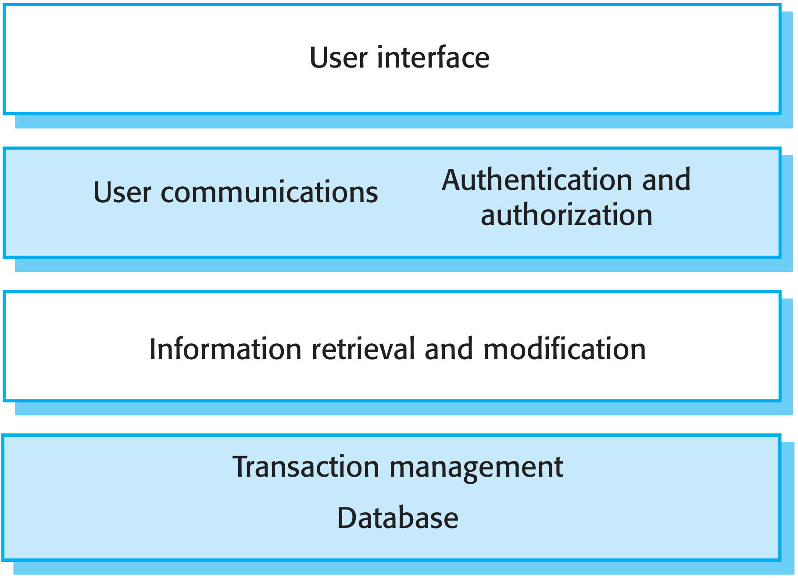
Abbildung 10: Abstrakte Struktur von Information Systems als Blockdiagramm [Fig. 6.18]

Abbildung 10 zeigt die abstrakte Struktur von Information Systems als Blockdiagramm. In diesem Fall ist dieses als Layered Architecture organisiert. Eine äußere Schicht stellt eine meist grafische Benutzeroberflächen zur Interaktion mit Benutzern zur Verfügung. Eine weitere Schicht verarbeitet Anfragen von Benutzern und implementiert Mechanismen zur Authentifizierung sowie zur Autorisierung. Die dritte Schicht implementiert anwendungsspezifische Logik zum Zugriff auf die Datenbank. Diese stellt inklusive Transaktionsmanagement die vierte und innere Schicht.

Information Systems sind häufig auch Transaction-Processing-Systems. So sind zum Beispiel E-Commerce-Systeme internetbasierte Information Systems. Diese akzeptieren Bestellungen von Waren und veranlassen eine Lieferung. Es wird Kunden ein Produktkatalog zur Verfügung gestellt und Bezahlungen erfolgen innerhalb von Transaktionen.

// Verteilung

Häufig sind Information Systems als verteiltes System mit einer mehrstufigen Client-Server-Architektur implementiert. So kann in der beschriebenen abstrakten Struktur jede Schicht durch einen eigenen Server implementiert werden.

## Language-Processing-Systems

Language-Processing-Systems übersetzen eine Sprache in einer alternative Repräsentation dieser. Bei Programmiersprachen werden resultierende Programme gegebenenfalls auch ausgeführt. Beispielsweise übersetzen Compiler Programmiersprachen in Maschinencode. NLP-Systeme übersetzen natürliche Sprache in eine Andere. Weitere Systeme können XML in Befehle zu Anfragen einer Datenbank oder in andere XML-Repräsentationen übersetzen.

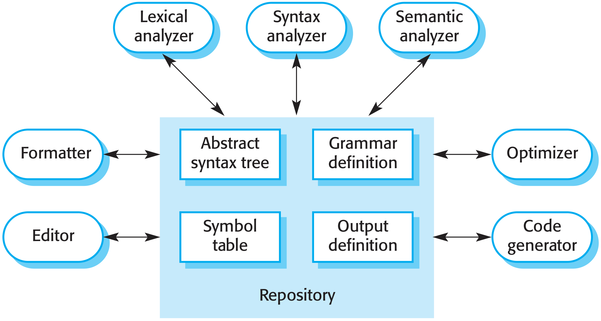
Abbildung 11: Beispiel eines Language-Processing-Systems als Repository Architecture [Fig. 6.21]

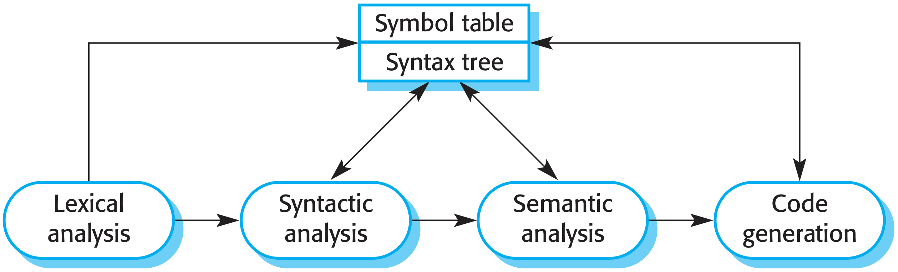
Abbildung 12: Beispiel eines Language-Processing-Systems als Pipe-and-Filter-Architecture [Fig. 6.22]

Abbildung 11 zeigt ein als Repository Architecture organisiertes Language-Processing-System als Blockdiagramm. Konkret wird hier eine Entwicklungsumgebung zum Umgang mit Programmiersprachen dargestellt. Ein Teil desselben Systems wird in Abbildung 12 als Pipe-and-Filter-Architecture dargstellt. Die Variante der Repository Architecture zentralisiert interne Repräsentationen der Sprache sowie weitere Definitionen in einem Repository. Diese Form der Organisation ermöglicht ein einfaches Ergänzen von Modulen zur Formatierung von Optimierung durch Anbindung an das Repository. Die Variante der Pipe-and-Filter-Architecture besitzt bei Batch-Verarbeitung positive Performanzeigenschaften, wenn Programme ohne Benutzerinteraktion kompiliert werden sollen. Eine Integration von weiteren Komponenten wie in der ersten Variante ist hier mit einem höheren Aufwand verbunden.
