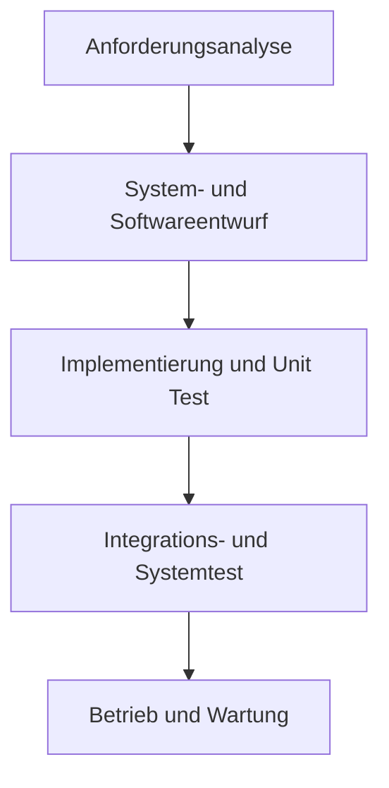


# Software Process

 - Software Process = Reihe von Aktivitäten zur Softwareproduktion
 - Eine allgemeingültige Software Engineering Methode gibt es nicht, da die verschiedenen Software Systeme zu unterschiedlich sind - dementsprechend gibt es auch keinen allgemeingültigen Software Prozess
 - Verwendungskriterien für Software Prozess
	 - Art der zu entwickelnden Software
	 - Anforderungen des Kunden
	 - Kompetenz der Entwickler
 - Software Prozess setzt sich fast immer zusammen aus:
	 - Softwarespezifikation - Anforderungen aufnehmen
	 - Softwareentwicklung - Anforderungen umsetzen
	 - Softwarevalidierung - Software überprüfen
	 - Softwareentwicklung (Weiterentwicklung) - Software warten
 - Aufgeführte Bestandteile enthalten zahlreiche und diverse Aktivitäten
 - Aktivität setzt sich zusammen aus
	 - Artefakte welche entstehen 
	 - Rollen welche die Verantwortlickeit festlegen
	 - Pre und Postconditions
		 - Bedingungen welche entweder vor dem Start erfüllt sein müssen (bspw. "alle Anforderungen genehmigt" als Precondition oder "UML Diagramme reviewt" als Postcondition)
 
 - Abhängig von der zu entwickelnden Software können unterschiedliche Prozesse geeignet sein
	 - Sicherheitskritische Systeme
		 - Stark Strukturierter Prozess nötig
	 - Geschäftsanwendungen mit hoher Frequenz bei neuen/veränderten Anforderungen
		 - flexibler, agiler Prozess
 - Grundsätzlicher Unterschied  Plan-driven Prozess <->  agiler Prozess
	 - Plan-driven Prozess -> (exakter) Plan für alle Abschnitte des Software Prozess
	 - Agiler Prozess -> schrittweise und kontinuierliche Planung
 - Bei großen Systemen muss ein Gleichgewicht zwischen geplanter und agiler Entwicklung gefunden werden
 - In zahlreichen Unternehmen kann der Software Prozess durch die Nutzung moderner Software Engineering Methodik optimiert werden
 
# Modelle
 - Im folgenden werden einige sehr allgemeine Prozessmodelle vorgestellt
 - Es handelt sich um abstrakte Beschreibungen, ohne Details über einzelne Aktivitäten im Prozess
 - Alle vorgestellten Prozessmodelle sollten als Framework betrachtet werden, welches abhängig von den zugrundeliegenden Anforderungen erweitert und/oder angepasst werden muss
	 - Insbesondere in großen Projekten können unterschiedliche Modelle für verschiedene Teile der Software genutzt werden und so die Vorteile kombiniert werden
		 - Beispielsweise Frontend Entwicklung in inkrementeller Arbeitsweise + Backend in Wasserfall Modell
 - Vorgestellt werden folgende Prozessmodelle:
	 - Wasserfallmodell
		 - Darstellung aller Prozessaktivitäten als seperate Phasen 
	 - Inkrementelles Modell
		 - Verknüpfung aller Aktivitäten und inkrementelle Entwicklung der Software (Reihe von Software Versionen, welche aufeinander aufbauen)
	 - Integration & Configuration
		 - Entwicklung von wiederverwendbaren, konfigurierbaren Softwaremodulen
		 - Fokus auf Konfigurierung der Module in der  neuen Umgebung 

## Wasserfallmodell

Abtraktes Modell

 - Erstes Modell des Softwareentwicklungsprozess
 - Abgeleitet aus einem Entwiclungsprozessen für große militärische Projekte
 - Prozess als stufenweise abfolge von Aktivitäten
 - Plan Modell - alle Aktivitäten werden (theoretisch) im vorhinein geplant
 - Jede Stufe repräsentiert eine Aktivität im Entwicklungsprozess
	 - Anforderungsanalyse:
		 - Ermittelung und Analyse der zugrundliegenden Anforderungen
		 - Ergebnis --> Systemspezifikation
	 - System- und Softwareentwurf
		 - Umsetzen der Softwarespezifikation zu einem Softwareentwurf, welcher die grundlegenden Bestandteile der Software und ihre Beziehungen untereinander darstellt.
		 - Ergebnis  --> Softwareentwurf
	 - Implementierung und Unit testing
		 - Umsetzung des Softwareentwurfs in eine Menge an Programmen
		 - Test der Software auf Unit Ebene
		 - Ergebnis --> Lieferung von Funktionstüchtigen Softwaremodulen
	 - Integration- und Systemtest
		 - Test des Gesamtsystems (bestehend aus den Softwaremodulen)
		 - Ergebnis --> Betriebsbereite Software
	 - Betrieb und Wartung
		 - produktiver Betrieb
		 - Behebung von Fehlern
		 - Weiterentwicklung auf Basis neuer Anforderungen
 - Die Ergebnisse der vorhergehenden Phase sind die Bedingung damit die folgende Phase starten kann
 - Im Vergleich zu Hardwareentwicklung, wo Phasen klar abgegrenzt werden können, überschneiden sich bei Softwareentwicklung die Phasen. 
	 - Bspw. werden bei der Implementierung möglicherweise Fehler im Softwareentwurf gefunden
 - Im Softwareprozess sind daher Rückkopplungen zwischen den Phasen vorgesehen
 - Im Bedarfsfall werden vorgelagerte Artefakte rückwirkend geändert
 - Veränderungen an den Anforderungen führen zu einer erheblichen Verlangsamung des Prozess, da nachfolgende Stufen dann erneut durchlaufen werden müssen und die Zustimmung des Kunden nötig ist
	 - Die Softwarespezifikation sollte daher zu einem bestimmten Zeitpunkt eingefroren werden
		 - Nachteil --> alle folgenden Anforderungen und Veränderung können erst zu einem deutlich späteren Zeitpunkt umgesetzt werden. Fehler müssen ggf. ignoriert oder es muss drum herum programmiert werden. Außerdem kann ein zu frühes einfrieren dazu führen, dass das System den gewünschten Funktionsumfang nicht vollständig erfüllt
 - Aufgrund der Tatsache, dass Software flexibel sein muss, besonders im Umgang mit neuen und veränderten Anforderungen, eignet sich das Wasserfallmodell nur für die folgenden Systemtypen:
	 - Embedded Systems mit Schnittstellen zur Hardware 
	 - Kritische Systeme, bei denen eine umfängliche Sicherheitsanalyse der Softwarespezifikation und des Softwareentwurfs nötig ist. Erst danach kann entwickelt werden.
	 - Große Softwaresysteme, welche Teil eines umfassenderen System sind und von mehreren Unternehmen entwickelt werden. Modell dient dann auch dazu, eine vollständige Softwarespezifikation zu erstellen, damit Subsysteme unabhängig entwickelt werden können.

## Inkrementelle Entwicklung

//UML Diagramm als PNG in der Cloud erstellt - noch einfügen.  

-	Idee --> Software über mehrere Versionen (weiter-)entwickeln
-	Erste Implementierung und dann Feedback des Kunden einholen und dann weiterentwickeln
-	Sämtliche Aktivitäten des Prozess, sind eng verknüpft
	-	schneller Austausch zwischen den Aktivitäten ist daher möglich
-	heutzutage Häufigster Ansatz
-	Umsetzung entweder Plan-driven oder agil
	-	Plan-driven --> Festlegung aller zu lieferenden Inkremente
	-	Agil --> erste(s) Inkremente festlegen und dann dynamisch auf Anforderungen und Prioritäten des Kunden reagieren 
-	"Natürlicher" Weg des Problem lösen
	-	Im Alltag erarbeiten wir uns die Lösung eines Problems auch nicht im vorhinein
	-	Annäherung an Lösung in Schritten
-	Eignet sich für Geschäftsanwendungen besser als Wasserfallmodell
	-	Geringere Kosten und Zeit für neue oder veränderte Anforderungen
-	Wesentliche Vorteile (im vergleich zu Wasserfall)
	-	Geringere Kosten für Änderung an Anforderungen, da weniger Aufwand für Analyse und Dokumentation entsteht 
	-	Feedback ist leichter einzuholen, da der Kunde regelmäßig Inkremente sieht
	-	Frühzeitige Lieferung und Betrieb ermöglicht Arbeit des Kunden mit der Software zu einem führen Zeitpunkt
-	Wesentliche Nachteile aus Sicht des Management
	-	Prozess ist nicht greifbar, Vorgesetzte benötigen zur Überprüfung des Projektfortschritts regelmäßige Inkremente. Kosteneffizienz ist bei Erstellung von den selben Dokumenten für verschiedene Versionen nicht gut.
	-	 Die Struktur des Gesamtsystems wird mit Projektforschritt schlechter, da Code wächst und Funktionalitäten auf verschiedenen Wegen umgesetzt werden. Code wird schlechter. Klassisches "historisch" gewachsen. 
			-	Für große Projekte ist diese Gefahr besonders groß, hier sollte eine einheitliche Architektur und ein stabiler Entwicklungsrahmen definiert werden
-	Nicht jedes Inkrement muss dem Kunden zur Verfügung gestellt werden

## Integration und Konfiguration

// Als UML Datei in der Cloud ... noch einfügen

 - Wiederverwendung ist gang und gebe bei der Entwicklung von Software (informelle Wiederverwendung)
 - Informelle Wiederverwendung findet unabhängig vom verwendeten Prozess statt, es gibt jedoch Softwareentwicklungsprozesse welche sich auf die Integration und Konfiguration konzentrieren
 - Folgende Typen von Softwarekomponenten werden häufig wiederverwendet:
	 - Standalone Systeme, welche als Allzwecksysteme dienen und viele Funktionen haben. Müssen i.d.r. für ihre Umgebung konfiguriert werden
	 - Komponenten und Komponenten-Frameworks wie bspw. Java Spring
	 - Web services welche über das Internet zugreifbar sind
 - Ein abstraktes Modell besteht im wesentlichen aus den folgenden Bestandteilen
	 - Anforderungsspezifikation
		 - Aufnahme grober Anforderungen, ohne Details
		 - Grundlegende Anforderungen und Eigenschaften
	 - Software discovery und Software evaluieren
		 - Suche nach Komponenten und Systemen, welche den beschriebenen Anforderungen genügen
		 - In Frage kommende Systeme bewerten und beurteilen ob sie geeignet sind um die Anforderungen umzusetzen
	 - Anpassung der Anforderungsspezifikation
		 - Verfeinerung der groben Anforderungen unter berücksichtigung der gefundenen Komponente/ Systeme
		 - Wenn nichts gefunden wurde, ist ein Rücksprung zur Anforderungsspezifikation nötig um mögliche andere Lösungen zu suchen
	 - System konfigurieren
		 - Konfiguration des Applikationssystems, sofern die Anforderungen sich mit dem Standardsystem umsetzen lässt
	 - Komponente anpassen, Komponente neuentwickeln, Komponente integrieren
		 - Wenn es kein Standardsystem gibt, welches die Anforderung umsetzen kann, müssen bestehende Komponenten entweder angepasst oder neuentwickelt werden. Das Ergebnis muss anschließend integriert werden.

-	Erheblicher Vorteil --> Umfang der zu entwickelnden Software wird stark reduziert
	-	geringere Kosten und Zeit
-	Nachteil
	-	Kompromisse bei der Anforderungsanalyse nötig, Ergebnis möglicherweise nicht das was der Kunde möchte
	-	Kontrolle über Gesamtsystem schwierig (Harmonie verschiedener Komponenten Versionen untereinander)

# Aktivitäten
-	Prozess ist eine verschachtelte Abfolge von technischen, kollaborativen und Managementaktivitäten
-	Gesamtziel -> Spezifikation, Entwurf, Implementierung, Test
-	Grundlegende Prozessaktivitäten -> Spezifikation, Entwicklung, Validierung und Evolution
-	Anordnung wie oben zu sehen abhängig von Modell
-	Wie die Aktivitäten durchgeführt werden, hängt ab von:
	-	Art der zu entwickelnden Software
	-	Erfahrung/Kompetenz der Entwickler
	-	Art der Organisation

## Anforderungsanalyse/ Softwarespezifikation
 - Herausfinden welche Funktionen benötigt werden
 - Kritische Phase --> Fehler welche bei dieser Aktivität gemacht werden, sind besonders teuer und können sich in den folgenden Phase vergrößern
 - Vor Anforderungsanalyse --> Machbarkeitstudie/ Durchführbarkeitsstudie
	-	kurze Studien ob es einen Bedarf/Markt gibt für das Produkt und finanziell/zeitlich realistisch
 - Ziel der Anforderungsanalyse --> Vereinbarung eines Anforderungsdokument, welches das System spezifiziert und die Anforderungen der Stakeholder enthält. 
 - Anforderungen auf 2 Leveln
	-	End-User / Kunde
		-	high level Anforderungen
	-	Entwickler
		-	System spezifische Anforderungen

 - Prozess enthält 3 Aktivitäten
	 - Anforderungserhebung und Analyse
		 - Aufnahme von Anforderungen
		 - Beobachten von bestehenden Systemen
		 - Gespräche mit Nutzern
		 - Aufgabenanalyse
		 - Kann die Entwicklung von Prototypen oder Systemmodellen beinhalten
	 - Anforderungsspezifikation
		 - Gesammelte Information in ein Dokument überführen
		 - Formulierung von Anforderungen auf End-User Level (high level) und Systemlevel (detaillierte Beschreibung der zu liefernden Funktionalität) 
	 - Anforderungsvalidierung
		 - Überprüfung der aufgenommenen Anforderungen hinsichtlich Umsetzbarkeit und vollständigkeit geprüft
		 - Aktivität soll Qualität sicherstellen --> Fehler finden
 - Aktivitäten sind verschachtelt und laufen während der Analyse weiter, so dass Anforderungen mit der Zeit weiter verfeinert werden können oder fehlende Anforderungen nachgepflegt werden können.

## Softwaredesign und Implementierung

 - Aktivität welche das Ziel hat eine ausführbare Software zu liefern
 - Abhängig von Prozess Modell können die Aktivitäten Design und Implementierung getrennt vorhanden sein
	 - Bei agilem Vorgehen i.d.R. vermischt/verknüpft
		 - Dadurch keine getrennten offiziellen Designdokumente
 - Ein Softwareentwurf ist eine Beschreibung der Struktur der zu implementierenden Software, der vom System verwendeten Datenmodelle und -strukturen, der Schnittstellen zwischen Systemkomponenten und der Algorithmen (selten).

	

> Written with [StackEdit](https://stackedit.io/).
