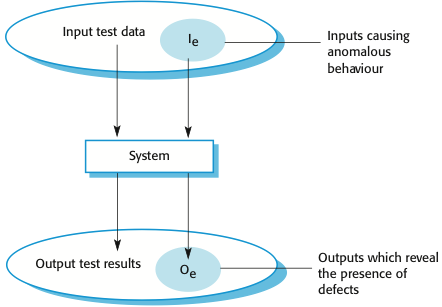
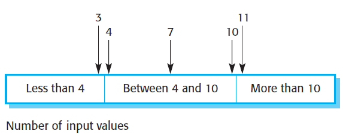
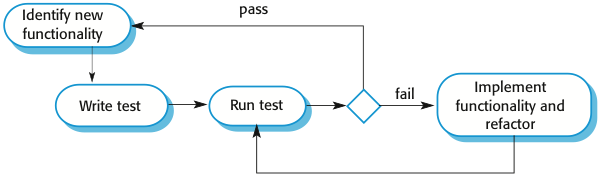

# Software Testing

**Autor:** Marco Schwier

Sofern nicht weiter angegeben, entspringen alle Informationen und Abbildungen der Quelle [1] Software Engineering von Ian Sommerville.

## Einleitung

Software testen hat das Ziel, zu zeigen, dass die Software für ihren angedachten Einsatzzweck geeignet ist. Dabei werden mittels des Testens Fehler innerhalb der Software aufgedeckt. Dafür werden Testdaten verwendet, die vorher für diesen Zweck erarbeitet worden sind. Nach der Ausführung der Software mit diesen Testdaten wird das Ergebnis nach Fehlern oder Anomalien überprüft. Dadurch können Fehler aufgedeckt werden. Softwaretests sind jedoch nicht in der Lage das Fehlen von Fehlern aufzudecken.[2] Es gibt zwei Ansätze beim Softwaretesten:

1. Validierungstest
2. Fehlerprüfung

Beim **Validierungstest** werden Testfälle erstellt, die möglichst ein reales Verwenden der Software widerspiegeln sollen. Dabei wird überprüft, ob die Software den vorher aufgestellten Anforderungen genügt. Ein Erfolg innerhalb dieser Testmethodik ist dadurch definiert, dass die Software wie erwartet funktioniert.

Bei der **Fehlerprüfung** sollen Fehler innerhalb der Software aufgedeckt werden. Dafür werden Testfälle erstellt, die nicht dem normalen Nutzerverhalten widerspiegeln müssen. Ein Erfolg ist dadurch definiert, dass die Software nicht wie erwartet funktioniert.

**Abbildung 1: Ein- Ausgabe Model**

### Verifikation und Validation

Testen ist ein Teil des Verifikation- und Validationsprozesses. Dabei wird durch die Verifikation ermittelt, ob die Software den Spezifikationen entspricht und innerhalb der Validation, ob die Software das umsetzt was sie soll. Dabei wird eine Aussage darüber erhalten, ob die Software für den Gebrauch, für den sie bestimmt ist, auch geeignet ist.

### Inspektion und Testen

Die Inspektion von Softwarecode ist eine Testmöglichkeit bei dem ein Inspektor den Programmcode der Software analysiert. Dabei hat diese Art des Testens das Ziel Fehler und Anomalien zu finden. Um dieses Ziel zu erreichen, ist keine Ausführung des Programmes notwendig und kann schon vor der vollständigen Implementierung durchgeführt werden. Dabei werden alle Komponenten des Softwaresystems überprüft.

Der Vorteil dieser Vorgehensweise ist die, dass keine Fehlermaskierung stattfinden kann. Des Weiteren können unvollständige Abschnitte der Software ohne Mehrkosten überprüft werden, da keine Mock-Objekte erstellt werden müssen, um diesen Teil des Systems zu simulieren. Ebenfalls wird die Programmierweise dabei überprüft.

Wichtig ist, das Testen und Inspektionen sich nicht ausschließen. Beide sollten beim Testen von Software verwendet werden. Denn durch Inspektionen können die nicht funktionalen Anforderungen eines Softwaresystems nicht getestet werden. Software sollte somit innerhalb des Testens die folgenden Schritte durchlaufen:

1. Entwicklungstest
2. Veröffentlichungstest
3. Nutzertest

## Entwicklungstest

Das Entwicklungstesten wird vom Entwicklerteam durchgeführt. Dabei unterteilt es sich in drei Abschnitte:

1. Modultest
2. Komponententest
3. Systemtest

### Modultest

Beim Modultest werden einzelne Funktionen oder Klassen getestet. Bei dem Testen von Klassen sollten alle Operationen durchgeführt werden, sowie jedes Attribute innerhalb der Klasse gesetzt werden. Dabei sollte darauf geachtet werden, dass die Klasse innerhalb der Tests jeden möglichen Zustand annimmt den diese haben kann.

Die Tests können mittels verschiedener Frameworks wie JUnit erstellt werden. Dabei stellt JUnit generische Klassen zur Verfügung mit den sich Testfälle modellieren lassen. Die Tests werden dabei automatisiert durchgeführt und das Ergebnis meist mittels einer GUI dem Tester präsentiert. Dabei findet der Ablauf einer solchen Testklasse in drei Schritten ab:

1. Setup mit den Vorbedingungen für den Testfall herstellen.
2. Den Testfall durchführen.
3. Das Vergleichen der Testergebnisse mit einem vorher definierte Erwartungswert.

Das Ziel dieses Testens ist, dass aufgezeigt wird, dass die Klasse den Erwartungen entspricht und die Funktion wie gedacht ausgeführt wird. Dabei sollen Fehler aufgedeckt werden. Für das Erstellen von Testdaten gibt es zwei Möglichkeiten:

1. **Normale Eingaben** die auch innerhalb der Nutzung dieser Klasse oder Funktion auftreten können.
2. **Abnormale Daten** die nicht dem normalen Nutzerverhalten entsprechen.

Dabei soll überprüft werden, ob die Klasse oder Funktion sich im Fehlerfall richtig verhält. Des Weiteren werden Äquivalenzklassen gebildet.

**Abbildung 2: Äquivalenzklasse**

Eine Äquivalenzklasse ist eine Menge von Eingaben. Dabei kann jedes Element dieser Klasse repräsentativ für alle Elemente in einem Test verwendet werden. Neben den Äquivalenzklassen werden auch Grenzwertanalysen durchgeführt. Dafür wird das Element am äußersten Rand der Äquivalenzklasse ebenfalls in den Testdaten verwendet.

### Komponententest

Bei dem Komponententest werden einzelne Komponenten, die sich aus Klassen zusammensetzen, getestet. Dabei besitzen diese ein gemeinsames Interface mit dem die Komponente gesteuert wird. Daher ist das Ziel dieses Testabschnittes sicherzustellen, dass das Interface korrekt funktioniert und das Finden von Fehlern innerhalb dessen. Dabei gibt es verschiedene Arten von Interfaces die unterschiedliche Fehler erzeugen können:

1. Das Interface kann falsch verwendet werden.
2. Die gesendete erwartete Anfrage kann nicht verstanden werden.
3. Zeitliche Fehler können entstehen.

Bei diesen Test sollten Parameter gewählt werden die am Rande der Äquivalenzklassen liegen. Des Weiteren sollte bei Pointern immer der NULL-Pointer getestet werden. Ebenfalls sollten Designtests und Stresstests durchgeführt werden, sowie Tests gegenüber den geteilten Speicher, wodurch die Tests in anderer Reihenfolge durchgeführt werden.

### Systemtest

Bei dem Systemtest wird das vollständige System getestet. Hierfür sind Use-Cases als Basis zu verwenden und für jeden Use-Case mindestens einen Testfall zu erstellen. Der Systemtest überprüft die Zusammenarbeit aller Komponenten innerhalb des Systems und ob diese kompatibel sind.

## Test-Driven Development

Test-Driven Development ist eine Agile-Entwicklungsart. Dabei wird der Fokus auf die Anforderungen der Software gesetzt.

Das Ziel dieser Entwicklungsmethode ist es, funktionierende Software einfach zu entwickeln und Duplikate innerhalb der Software zu vermeiden. So wird die Entwicklung erst weitergeführt wenn alle Test erfolgreich sind.

Der Ablauf beginnt mit dem Identifizieren von neuen benötigten Funktionalitäten. Darauf folgend werden Tests geschrieben und diese durchgeführt. Sollte der Test fehlschlagen, was beim ersten Durchführen immer der Fall ist, wird die Funktionalität weiter implementiert und refactored. Daraufhin werden die Tests erneut ausgeführt. Sollten die Test keinen Fehler aufzeigen, wird der Prozess von neuem begonnen.

**Abbildung 2: Test-Driven Development**

Der Vorteil dieses Vorgehen ist, dass eine große Testabdeckung erhalten wird, da für jede neue Funktionalität zunächst Tests entwickelt werden. Außerdem lassen sich Codeabschnitt besser Debuggen. Des Weiteren wird bei jedem neuen Testdurchlauf alle anderen Test mit durchgeführt. So können Fehler in anderen Programmabschnitten durch neu implementierte Funktionalitäten schnell gefunden werden.

## Veröffentlichungstesten

Bei dem Veröffentlichungstest werden geplante Veröffentlichungen der Software getestet. Dabei wird ein separates Team verwendet, dass nicht mit der Entwicklung der Software vertraut ist.

Bei diesem Test handelt es sich um einen Black-Box-Test. Dies bedeutet, dass das Testteam keine Informationen über die Vorgänge innerhalb der Software hat und nur die Wirkung nach außen testen kann.

Dabei sollen durch diese Tests der Kunde davon überzeugt werden, dass die Software für seine Anforderung verwendbar ist, sowie das die Software im normalen Gebrauch verlässlich ist. Dafür werden Anforderungen an das System ermittelt und mögliche Benutzer erstellt, die ein möglichst reales Verhalten mit der Software simulieren sollen. Dafür gibt es zwei Ansätze:

1. Das anforderungsbasierte Testen
2. Das Szenariobasierte Testen

Bei den **anforderungsbasierten Ansatz** werden für jede vorher definierten Anforderung mindestens ein Testfall erstellt.

Bei dem **Szenariobasierten Ansatz** wird für jedes Szenario ein eigener Testfall entwickelt. Dabei soll der Endnutzer verstehen, was innerhalb des Testfalls getestet wird. Das Szenario wird dabei detailliert formuliert. Durch dieses Vorgehen benötigen Veröffentlichungstests viel Planung.

Des Weiteren werden sowohl Stresstests in diesem Abschnitt durchgeführt als auch Performancetests. Bei einem Stresstest wird die Software einer immer größeren Last, zum Beispiel Anfragen, ausgesetzt bis diese nicht mehr reagiert. Dabei wird die maximale Kapazität der Software ermittelt.

## Nutzertest

Beim Nutzertest wird der Benutzer der Software aktiv in den Testprozess miteinbezogen. So sind die Testfälle zuvor von dem Nutzer erstellt worden. Diese Tests bieten eine wichtige Grundlage um einzuschätzen, ob die Software bei Veröffentlichung von den Kunden angenommen wird. Innerhalb des Nutzertests gibt es drei Phasen:

1. Alpha
2. Beta
3. Akzeptanz

In der **Alpha-Phase** arbeiten die Entwickler eng mit den Nutzer zusammen, um die Software den Erwartungen der Nutzer anzupassen.

In der **Beta-Phase** wird eine vorab Version dem Nutzer zur Verfügung gestellt. Diese können dann selbst die Software für sich, auf ihren eigenen Geräten, testen. So können Fehler, die im realen Einsatzgebiet auftreten und nicht durch das Testen in den vorherigen Schritten gefunden wurden, ermittelt werden.

In der **Akzeptanz-Phase** wird ermittelt, ob das Produkt für den Markt geeignet ist. Dabei können dieses Tests auch von Firmen übernommen werden die das Produkt vertreiben.

Diese Testart ist wichtig um einen Einblick zu erhalten, ob das Produkt bei Veröffentlichung von den Nutzern angenommen wird. Jedoch ist es unsicher ob die Nutzer, die in den Testprozess involviert sind, eine repräsentative Nutzerschaft abdecken.

## Referenzen

[1]: Ian Sommerville, Software Engineering, 10. Aufl., Kapitel 08 226-254.
[2]: Dijkstra, E. W. 1972. “The Humble Programmer.” Comm. ACM 15 (10): 859–66. doi:10.1145/355604.361591
