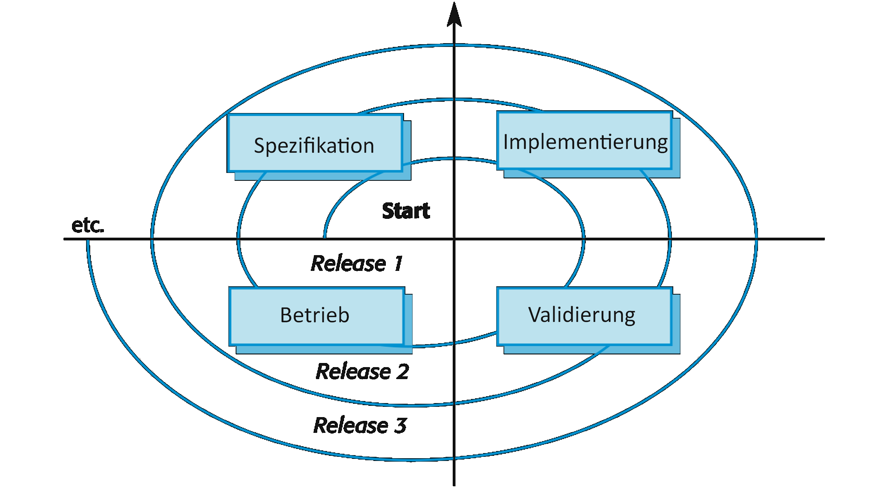

# Software evolution

**Autor:** Finn Kuhn

Das Kapitel befasst sich mit der Software Evolution in der Softwareentwicklung. Die beschriebenen Inhalte stammen aus
dem Buch Software Engineering von Ian Sommerville[1] (S. 255-282).

## Einführung

Softwaresysteme können eine sehr lange Lebenszeit haben. In dieser Zeit kommt es zu Änderungen an den Systemen. Dies
kann unterschiedliche Gründe haben, wie Fehlerbehebung, neue Hardware, Performanceoptimierung oder Druck durch
Konkurrenz. Dieser Prozess des stetigen Änderns und Weiterentwickelns ist die Software Evolution. Firmen investieren
viel in diese Evolution, 60%-90% der Produktkosten werden hier verwendet. Deshalb kann eine Optimierung der Evolution
Kosten einsparen und zum Erfolg eines Systems beitragen.

Je nach Systemen ist die Evolution aufwändiger und teurer. Besonders aufwändig können Änderungen an einem "System of
Systems" sein. Also Software die aus mehreren Teilen besteht, die sich gegenseitig beeinflussen. Hohe Kosten können dann
Änderungen verursachen, die Anpassungen in anderen Teilen benötigen.

[Abbildung 1]
*Veröffentlichungszyklus*

[Abbildung 1]: assets/Bild1.png "Abbildung 1"

Da stetig neue Anforderung für ein Softwaresystem aufkommen, müssen immer wieder neue Versionen veröffentlicht werden.
Dieser sich immer wiederholende Ablauf ist in [Abbildung 1] dargestellt. Jeder Zyklus ist ein Ablauf aus Anforderungen,
Design, Implementierung und Testen. Die Veröffentlichungen passieren häufig in einen regelmäßigen Rhythmus, so dass
beispielsweise alle zwei Wochen eine neue Version veröffentlicht werden kann. Durch die verschiedenen Phasen und einem
engen Rhythmus kann es passieren, dass eine weitere Version bereits entwickelt wird, bevor die Vorige veröffentlicht
wurde. Der Abstand zwischen Veröffentlichungen wird, vor allem in den letzten zehn Jahren, immer kleiner. Das hat den
Vorteil, dass schneller auf externe Faktoren wie Konkurrenten oder Nutzerrückmeldungen eingegangen werden kann.

Dieser Ansatz der Evolution kann nur funktionieren, wenn die initiale Entwicklung und die Evolution vom gleichen Team
durchgeführt wird. Es passiert allerdings häufig, dass die Wartung durch ein anderes Team umgesetzt wird, beispielsweise
wenn externe Firmen zur Entwicklung eingeschaltet werden. Durch diese Trennung können Probleme im Evolutionsprozess
aufkommen. Es passieren, dass Anforderungs- oder Designdokument nicht weitergegeben werden. Wenn Firmen fusionieren
läuft man in die Gefahr einer unterbrechung der Evolution, da die externe Software integriert und angepasst werden muss.
Bei so einer Trennung von Entwicklung und Evolution, wird der Prozess der Anpassungen Softwarewartung genannt.

[Abbildung 2]
*Evolution und Service*

[Abbildung 2]: assets/Bild2.png

Eine Alternative zum Modell der Zyklen ist in [Abbildung 2] zu erkennen. Hier wird der Prozess in mehrere Phasen
eingeteilt. Der größte Unterschied liegt in der Unterscheidung von einer Evolutions- und Servicephase. Der Ablauf
beginnt mit der initialen Entwicklung des Systems. In der Evolution werden noch große Anpassungen umgesetzt, die
wichtige Anforderungen implementieren. Die Servicephase wird für kleine Änderungen genutzt. In der letzten Phase werden
nur noch unabdingbare Änderungen umgesetzt, das Unternehmen sucht außerdem nach einer Möglichkeit das System zu
abzuschalten und zu ersetzen.


## Evolutionsprozesse

## Altsysteme

## Softwarewartung

Nach dem Lesen des Kapitels sollten Sie einiges wissen und dann noch viel mehr und sehr viel mehr und weniger.

## Unterkapitel

* **Softwaresystem**:
  Die *innere* Sicht des Informatikers nimmt Software als Softwaresystem wahr.
* **Softwareprodukt**: Die *äußere* Sicht eines Auftraggeber nimmt ein Softwaresystem als Softwareprodukt wahr.

### Tabelle

| A          |     B       |           C               | 
|:----------:|:-----------:|:-------------------------:|
| Eins | Zwei | Drei |
| Vier | Fünf | Sechs |

## Links

[Markdown] ist eine Sprache, die nach HTML konvertiert werden kann.

[Markdown]: http://daringfireball.net/projects/markdown/

## Aufzählung

Es unterteilt sich in:

* A
    * A1
* B
    * B1
    * B2
* C

# Überschrift

"...the **go to** statement should be abolished..." [1].

Dieser Link führt intern zu einem anderen [Thema](qualitaet/README)

Dieser Link führt extern nach [Youtube](https://www.youtube.com/)

> Dieser Text ist völlig sinnlos, aber steht trotzdem hier. Dieser Text geht über mehrere Zeilen.

## Unterüberschrift

* Eins
    * eins.eins
    * eins.zwei
* Zwei
    * Zwei.zwei
* Drei

### Code

```javascript
public

class A {
    Integer
    a;

    public A() {
        this.a = 1
    }
}
```

Syntax Highlighting für Javascript. Weitere Sprachen müssen konfiguriert werden.

### Bilder


### Audio

[](media/sample.mp3 ':include')

### Video

[](media/sample.mp4 ':include')

## Referenzen

[1]: Dijkstra, E. W. (1968). Go to statement considered harmful. Communications of the ACM, 11(3), 147-148.