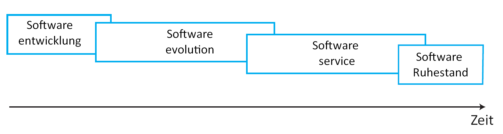
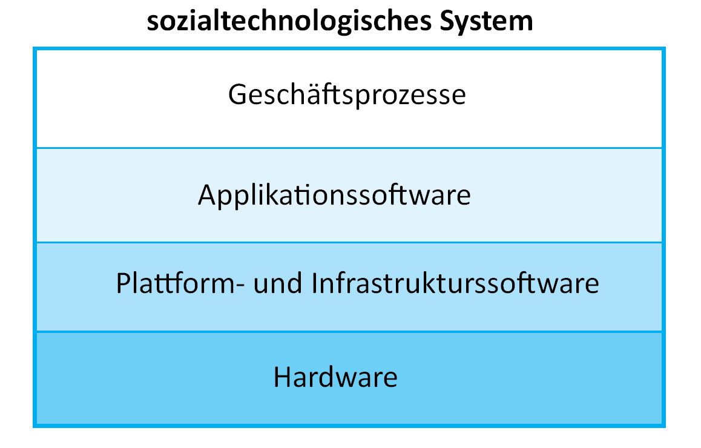
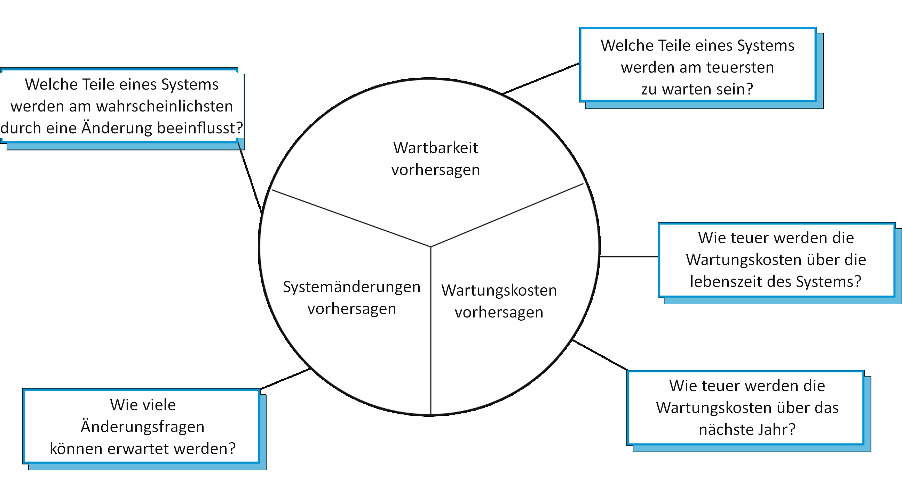

# Software Evolution

**Autor:** Finn Kuhn

Das Kapitel befasst sich mit der Software Evolution in der Softwareentwicklung. Die beschriebenen Inhalte stammen aus
dem Buch Software Engineering von Ian Sommerville[1] (S. 255-282). Alle Abbildungen basieren auf dem Buch Software
Engineering von Ian Sommerville[1] (S. 255-282) und wurden nur ins Deutsche übersetzt, möglichst ohne den Inhalt zu
verändern.

## Einführung

Softwaresysteme können eine sehr lange Lebenszeit haben. In dieser Zeit kommt es zu Änderungen an den Systemen. Dies
kann unterschiedliche Gründe haben, wie Fehlerbehebung, neue Hardware, Performanceoptimierung oder Druck durch
Konkurrenz. Dieser Prozess des stetigen Änderns und Weiterentwickelns ist die Software Evolution. Firmen investieren
viel in diese Evolution, 60%-90% der Produktkosten werden hier verwendet. Deshalb kann eine Optimierung der Evolution
Kosten einsparen und zum Erfolg eines Systems beitragen.

Je nach Systemen ist die Evolution aufwändiger und teurer. Besonders aufwändig können Änderungen an einem "System of
Systems" sein. Also Software die aus mehreren Teilen besteht, die sich gegenseitig beeinflussen. Hohe Kosten können dann
Änderungen verursachen, die Anpassungen in anderen Teilen benötigen.

[Abbildung 1]
*Veröffentlichungszyklus*

Da stetig neue Anforderung für ein Softwaresystem aufkommen, müssen immer wieder neue Versionen veröffentlicht werden.
Dieser sich immer wiederholende Ablauf ist in [Abbildung 1] dargestellt. Jeder Zyklus ist ein Ablauf aus Anforderungen,
Design, Implementierung und Testen. Die Veröffentlichungen passieren häufig in einen regelmäßigen Rhythmus, so dass
beispielsweise alle zwei Wochen eine neue Version veröffentlicht werden kann. Durch die verschiedenen Phasen und einem
engen Rhythmus kann es passieren, dass eine weitere Version bereits entwickelt wird, bevor die Vorige veröffentlicht
wurde. Der Abstand zwischen Veröffentlichungen wird, vor allem in den letzten zehn Jahren, immer kleiner. Das hat den
Vorteil, dass schneller auf externe Faktoren wie Konkurrenten oder Nutzerrückmeldungen eingegangen werden kann.

Dieser Ansatz der Evolution kann nur funktionieren, wenn die initiale Entwicklung und die Evolution vom gleichen Team
durchgeführt wird. Es passiert allerdings häufig, dass die Wartung durch ein anderes Team umgesetzt wird, beispielsweise
wenn externe Firmen zur Entwicklung eingeschaltet werden. Durch diese Trennung können Probleme im Evolutionsprozess
aufkommen. Es passieren, dass Anforderungs- oder Designdokument nicht weitergegeben werden. Wenn Firmen fusionieren
läuft man in die Gefahr einer unterbrechung der Evolution, da die externe Software integriert und angepasst werden muss.
Bei so einer Trennung von Entwicklung und Evolution, wird der Prozess der Anpassungen Softwarewartung genannt.

[Abbildung 2]
*Evolution und Service*

Eine Alternative zum Modell der Zyklen ist in [Abbildung 2] zu erkennen. Hier wird der Prozess in mehrere Phasen
eingeteilt. Der größte Unterschied liegt in der Unterscheidung von einer Evolutions- und Servicephase. Der Ablauf
beginnt mit der initialen Entwicklung des Systems. In der Evolution werden noch große Anpassungen umgesetzt, die
wichtige Anforderungen implementieren. Die Servicephase wird für kleine Änderungen genutzt. In der letzten Phase werden
nur noch unabdingbare Änderungen umgesetzt, das Unternehmen sucht außerdem nach einer Möglichkeit das System zu
abzuschalten und zu ersetzen.

## Evolutionsprozesse

Jedes Softwaresystem ist anders aufgebaut, dementsprechend gibt es keine komplett standardisierten Änderungsprozess, der
auf jedes System angewendet werden kann. Dieser Prozess ist unter anderem davon abhängig um was für eine Art von
Software es sich handelt, welcher Entwicklungsprozess genutzt wird und dem Können der einzelne Entwickler.

### Ablauf

Die Basis für jede Evolution sind Änderungsvorschläge. Diese können ganz unterschiedliche Beweggründe haben. So können
bereits vorhandene Anforderungen umgesetzt werden, die es nicht in die vorherige Veröffentlichung geschafft haben.
Genauso kommen häufig neue Anforderungen hinzu, die die Funktionalität der Software erweitern sollen. Außerdem können
Änderungen das Ziel haben das System zu optimieren. Eine Optimierung kann entweder durch das Beheben eines Fehlers
passieren oder indem die Software intern verbessert wird.

[Abbildung 3]
*Zyklischer Prozess aus Vorschlägen und Evolution*

In [Abbildung 3] ist der zyklische Prozess von einem Vorschlag zur Evolution zu sehen. Bevor ein Änderungsvorschlag
aufkommt, muss die Änderung erst identifiziert und definiert werden. Wenn der Vorschlag akzeptiert wird, folgt dann die
eigentliche Evolution, die in einem neuen System, beziehungswiese einer neuen Version mündet. Danach beginnt der Prozess
von vorne. In diesem Zyklus ist es wichtig, dass Änderungsvorschläge vor der Umsetzung immer analysiert werden. Das
heißt es wird überprüft wie komplex die Änderung ist und welchen Einfluss sie auf das System hat, um Kosten und Aufwand
abzuschätzen.

In [Abbildung 4] wird der Evolutionsprozess in seine Einzelteile zerlegt. Nach der Änderungsanfrage wird erst der
Einfluss analysiert. Wenn die Änderung dann akzeptiert wird, wird eine neue Version geplant, die alle umzusetzenden
Anforderungen enthält. Nach der Implementierung wird die neue Version veröffentlicht.

[Abbildung 4]
*Aktivitäten in der Softwareevolution*

### Evolutionsteam

Wenn initiale Entwicklung und Evolution durch ein einzelnes Team umgesetzt wird, können Änderungen direkt in den
Entwicklungsprozess eingebunden werden. Dies bietet die Möglichkeit Nutzerrückmeldungen direkt zu verarbeiten. Falls
sich ein anderes Team um die Evolution kümmert, muss zuerst eine Phase des Verstehens umgesetzt werden, damit der
Einfluss einer Änderung abgeschätzt werden kann.

Wenn die verschiedenen Teams verschiedene Entwicklungsansätze nutzen, können Probleme entstehen. Bei der Übergabe eines
agilen Entwicklungsteams zu einem planbasierten, ist die Dokumentation häufig nicht ausreichend außerdem sind die
Anforderungen nicht vollständig definiert für den kompletten Projektzeitraum. Wenn ein planbasiertes an ein agiles Team
übergibt, müssen zuerst automatische Tests komplett neu entwickelt werden, außerdem ist die Codestruktur häufig nicht so
vereinfacht, wie es die agile Entwicklung verlangt.

Grundsätzlich ist es in agilen Projekten relativ einfach den Evolutionsprozess an die Entwicklung anzuschließen.
Automatische Tests helfen spätere Änderungen durchzuführen und durch das Backlog lassen sich neue Anforderungen einfach
priorisieren. Allerdings muss der Prozess eventuell so angepasst werden, dass der Veröffentlichungszyklus verlängert
wird, um den Produktiveinsatz nicht zu sehr zu stören.

### Dringende Änderungen

Es kann immer vorkommen, dass eine Software umgehend geändert werden muss. Das kann aufgrund eines kritischen
Systemfehlers sein, der das Arbeiten blockiert oder eine Sicherheitslücke aufmacht. Es kann passieren, dass eine
vorherige Änderung unerwartet Effekte hat, die behoben werden müssen oder dass sich das Geschäftsfeld unerwartet änder
durch zum Beispiel eine rechtliche Änderung oder eine Neuentwicklung eines Konkurrenten. Diese Änderungen müssen sofort
umsetzt werden, was zu einem verändertem Prozess führt, der in [Abbildung 5] zu sehen ist.

[Abbildung 5]
*Prozess für dringende Änderungen*

Hier wird auf eine Änderung der Dokumentation und Anforderung verzichtet. Außerdem wird häufig die schnellste Lösung
gewählt, anstatt die technisch beste. Im Optimalfall können im späteren Verlauf des Projekts diese Änderungen nachgeholt
werden, um die Qualität der Software hochgehalten werden kann. Häufig klappt das aber nicht, was spätere Änderungen
immer schwieriger macht.

## Altsysteme

Softwaresystem gibt es inzwischen seit ca. 60 Jahren. Über diese Zeit wurden manche Softwaresysteme ersetzt, andere
werden über eine lange Zeit genutzt. Alte Softwaresysteme, die auf Technologien oder Sprachen basieren, die nicht mehr
benutzt werden, heißen Altsysteme. Diese werden entsprechend bereits seit einer langen Seit gewartet, was dazu führen
kann, dass die Struktur der Software durch Änderungen schlechter geworden ist. Außerdem ist es möglich, dass das System
auf veralteter Hardware basiert. Dadurch ist es teilweise nicht mehr möglich die Software anzupassen und zu optimieren.

### Altsysteme als sozialtechnologische Systeme

Altsysteme bestehen nicht nur aus der eigentlich Software, sondern umfassen ebenfalls die Hardware, Bibliotheken,
anderes Softwareabhängigkeiten und Geschäftsprozesse. Deshalb spricht man von sozialtechnologische Systemen. Diese
Elemente und ihre Abhängigkeiten sind in [Abbildung 6] visualisiert.

[Abbildung 6]
*Elemente eines Altsystems*

* Systemhardware: Altsysteme wurden für alte hardware entwickelt, die nicht mehr verfügbar und kompatibel ist teuer zu
  warten.
* Softwareabhängigkeiten: Abhängig von Software, zum Beispiel dem betriebssystem, die nicht mehr weiterentwickelt wird.
* Anwendungssoftware: Ein System kann aus mehreren Teilen bestehen, die zu unterschiedlichen Zeiten entwickelt wurden.
  Dadurch entsteht ein System mit verschiedenen Programmieransätzen oder Programmiersprachen.
* Anwendungsdaten: Altsystem sammeln häufig viele Daten an, die inkonsistent, redundant oder über viele Datenbanken
  verteilt sind.
* Geschäftsabläufe: Abläufe können um ein Altsystem konstruiert und an die Funktionalitäten gebunden sein.
* Firmenpolitik- und regeln: Ein System kann in die Firmenregeln eingebettet sein, die nicht gebrochen werden dürfen

[Abbildung 7] *Altsystem als Schichtmodell*

Eine alternative perspektive auf ein Altsystem bietet das Schichtmodell, wie es in [Abbildung 7] zu sehen is. Jede
Schicht ist abhängig von der darunter liegenden und ist über eine Schnittstelle mit ihr verbunden. Wenn eine Schicht
geändert wird, muss nur die Schnittstelle angepasst werden, damit keine weiteren Schnittstellen beeinflusst werden. Dies
ist allerdings eine Vereinfachung, da neue Möglichkeiten in unteren Schichten häufig Änderungen in den anderen Schichten
bedingen, um sie zu nutzen. Bei Änderungen in den oberen Schichten kann es sein, dass die performance nicht mehr reicht
und neue hardware benötigt wird.

### Probleme und Gründe für Weiterbetreiben

Es ist davon auszugehen, dass noch viele Altsysteme in Betrieb sind. Auch wenn es keinen genauen Zahlen gibt, kann als
Beispiel die Verwendung von COBOL herangezogen werden. Es sind weiterhin ca. 200 Milliarden Zeilen COBOl in
Produktivsystemen verbaut, obwohl die Sprache bereits seit 1990 nicht mehr in benutzung ist. Daraus resultiert das große
Problem, dass es schwierig ist Fachpersonal für diese Systeme zu finden, da COBOL nicht mehr gelehrt wird. Ein weiteres
Problem bei Altsystemen ist die Sicherheit. Viele Systeme wurden vor der Verbreitung des Internets entwickelt und sind
dementsprechend nicht gegen die entsprechenden Gefahren abgesichert.

Das Ersetzen der Software ist, trotz der Probleme, häufig zu teuer und zu risikoreich. Dies liegt unter anderem daran,
dass Spezifikationen veraltet und unvollständig sind und die Planung eines neuen Systems nicht darauf basieren kann. Des
Weiteren können Geschäftsprozesse um das Altsystem gebaut sein, für ein neues System müssten also die Prozesse angepasst
werden. Geschäftsregeln können in das Altsystem eingebunden sein, ohne dass es dokumentiert ist. Das kann schwere Folgen
bei der Verletzung der regeln im neuen System haben. Zusätzlich hält eine neue Software immer das Risiko unerwartete
Probleme aufzuwerfen.

Allerdings werden die Kosten, um ein Altsystem am Laufen zu halten oder zu ändern immer teurer, so dass ein Ersatz mit
einem neuen System unumgänglich wird. Dazu tragen die vorangegangen Änderungen bei, die weitere Änderungen schwieriger
machen. Die Dokumentation des Systems kann veraltet oder gar nicht vorhanden sein. Außerdem sorgen
Performanceoptimierungen für alte Software häufig zu schwieriger verständlichen Code, der Änderungen wieder schwieriger
macht.

### Altsystemverwaltung

Da Projekte an ein limitiertes Budget gebunden sind, muss entschieden werden welche Evolution von Altsystemen Sinn
ergibt und welche verzichtbar sind. Dabei gibt es verschiedene Strategien wie mit einem Altsystem umgegangen wird. Die
erste Möglichkeit ist es das System komplett zu entfernen, weil es nicht mehr zum geschäft beiträgt. Im Gegensatz dazu
kann ein System unberührt bleiben, wenn es stabil läuft und einen großen Mehrwert für die Firma hat. Als dritte
Strategie kann das System überarbeitet werden, um die Wartbarkeit zu verbessern. Das ergibt vor allem dann Sinn, wenn in
der Zukunft noch Änderungen vonnöten sind, die dadurch einfacher umzusetzen sind. Als letzte Möglichkeit kann man das
komplette System ersetzen. Das wird nötig, wenn das System aufgrund von bestimmten Faktoren nicht mehr lauffähig ist,
zum Beispiel wenn neue Hardware mit dem alten System nicht mehr kompatibel ist.

[Abbildung 8] *Zehn Altsysteme bewertet*

Für die Bewertung, welche Strategie gefahren werden soll, muss sowohl die technische als auch die wirtschaftliche Seite
eines Projekts bewertet werden. In [Abbildung 8] werden beispielhaft zehn Altsystem nach diesen beiden Aspekten
bewertet. Dabei ergeben sich vier Kategorien.

1. Schlechte Qualität und kleiner Marktwert: System ist teuer und ohne großen mehrwert, es kann also entfernt werden.
2. Schlechte Qualität und großer Marktwert: Da das System noch wichtig für das Unternehmen ist, sollte hier eine
   Überarbeitung in Betracht gezogen werden.
3. Gute Qualität und kleiner Marktwert: Diese Systeme sollten unverändert bestehen bleiben bis eine teure Änderung
   aufkommt. Wenn das passiert, ist Abschalten die richtige Wahl.
4. Gute Qualität und großer Marktwert: System ist wichtig für das Geschäft, deshalb sollte es weiter gewartet werden.

Der Marktwert der Systeme wird dadurch bestimmt, dass die Zeit und Aufwand, den das System benötigt, mit den
Alternativen abgewägt wird. Diese Abwägung kann anhand diverser Merkmale passieren, wie der Nutzung des Systems. Her
können wenige und Gelegenheitsnutzer auf einen geringen Marktwert hinweisen. Einen weiteren Hinweis bringt ein Blick auf
die unterstützen Geschäftsprozesse. Wenn das System nur veraltete Prozesse unterstützt, sorgt das für einen geringeren
Marktwert. Wichtig ist außerdem, dass ein System zuverlässig ist, viele Ausfälle sorgen für einen kleinen Wert.
Abschließend spielt die Systemausgabe eine große Rolle, wenn ein Geschäft auf die Ausgabe des Systems angewiesen ist,
steigert das natürlich den Marktwert.

Neben der Bewertung des wirtschaftlichen Marktwerts, ist es wichtig die technische Perspektive zu betrachten. Diese
beinhaltet neben der eigentlichen Anwendung auch das Umfeld der Software. Das Umfeld beinhaltet beispielsweise die
Hardware und verbundene Unterstützungssoftware. Um diese technische Perspektive einzunehmen, helfen die Fragen aus
*Tabelle 1*.

|        Faktor        |                                                                 Fragen                                                                  | 
|:--------------------:|:---------------------------------------------------------------------------------------------------------------------------------------:|
|   Lieferstabilität   | Existiert der Lieferant noch? Ist er finanziell stabil und wird weiter existieren? Wenn er nicht mehr existiert, wer wartet das System? | 
|     Ausfallrate      |                  Fällt die Hardware häufig aus? Muss häufig neugestartet werden, weil Unterstützungssoftware abstürzt?                  | 
|        Alter         |                                                   Wie alt sind Software und Hardware?                                                   | 
|     Performance      |                  Ist die Performance des Systems angemessen? Haben Performanzprobleme große Auswirkung auf die Nutzer?                  | 
| Supportanforderungen |                                      Welcher lokaler Support ist für die hard- und software nötig?                                      | 
|    Wartungskosten    |                                      Was sind die Kosten von Hardwarepflege und Softwarelizenzen?                                       |
|  Interoperabilität   |                                        Gibt es Probleme bei Schnittstellen zu anderen Systemen?                                         |

*Tabelle 1: Faktoren zur Analyse des Umfelds*

Um diese Fragen korrekt beantworten zu können, müssen Daten über die Kosten der Wartung oder Systemausfälle gesammelt
werden. Neben der Umgebung ist natürlich die technische Qualität der Anwendung elementar. Um diese sinnvoll bewerten zu
können, sollten Daten über die Anzahl der Systemänderungsanfragen, Anzahl der Nutzerschnittstellen und die Größe der
Daten gesammelt werden. Mit diesen Daten lassen sich dann die Fragen aus *Tabelle 2* beantworten.

|          Faktor          |                                                   Fragen                                                   | 
|:------------------------:|:----------------------------------------------------------------------------------------------------------:|
|     Verständlichkeit     |                   Wie verständlich ist der aktuelle Code? Wie komplex ist die Struktur?                    | 
|      Dokumentation       |       Was für eine Systemdokumentation ist vorhanden? ist diese vollständig, konsistent und aktuell?       | 
|          Daten           |           Gibt es ein explizites Datenmodell für das System? Sind Daten aktuell und konsistent?            | 
|       Performance        |          Ist die performance angemessen? Haben Performanzprobleme einen Einfluss auf den nutzer?           | 
|    Programmiersprache    |          Wird die Programmiersprache noch genutzt? Wenn nicht gibt es trotzdem aktuelle Compiler?          |
| Konfigurationsmanagement | Sind die Versionen aller Teile durch ein Tool kontrolliert? Gibt es eine Beschreibung über alle Versionen? |
|        Testdaten         |     Existieren Testdaten für das System? Gibt es protokolle über Regressionstest bei neuen Funktionen?     | 
|   Personalfähigkeiten    |              Ist Personal verfügbar mit Wissen über das System und Fähigkeiten es zu warten?               |

*Tabelle 2: Faktoren zur Analyse der Anwendung*

Bei dieser Vorgehensweise handelt es sich um ein idealisiertes Vorgehen. Häufig beeinflussen weitere Faktoren eine große
Rolle bei der Entscheidung. Dabei kann es sich um Firmenübernahmen, das Budget oder Entscheidungen der Geschäftsführung
handeln.

## Softwarewartung

Als Softwarewartung wird der Prozess des Veränderns einer Software nach der Auslieferung bezeichnet. Das umfasst alle
Änderungen, so wie Hinzufügen oder Entfernen von Komponenten.

### Typen der Wartung

Es gibt drei Arten der Wartung: Fehlerkorrektur, Anpassungen an neue Plattformen und Umgebungen und Hinzufügen neuer
Funktionen. Die Fehlerkorrektur reicht von günstig zu behebende Programmierfehlern, über Designfehler zu
Anforderungsfehlern, die am teuersten zu korrigieren sind. Das Hinzufügen neuer Funktionen ist häufig aufwendiger als
die anderen beiden Typen. In der Realität kann häufig keine klare Trennung zwischen den verschiedenen Arten der Wartung
gemacht werden. Dazu lassen sich die Anteile der verschiedenen Typen der Wartung in [Abbildung 9] sehen.

[Abbildung 9] *Typen der Wartung*

Neue Features hinzuzufügen ist während der Wartungsphase deutlich teurer als in der Entwicklungsphase, das hat
verschiedene Gründe. Um ein neues Feature zu implementieren, muss der Code gut verstanden werden, damit die Auswirkungen
abgeschätzt werden können. Dies ist vor allem nach der Übergabe vom Entwickler- zu einem Wartungsteam ein großer
Kostenfaktor. Während der Entwicklung sind die Anreize nicht groß wartbare Software zu schreiben, vor allem bei einer
Trennung von Entwicklung und Wartung. Dadurch sind spätere Änderungen deutlich schwieriger zu implementieren. Ein
weiterer Grund ist, dass bei Programmieren Neuentwicklungen beliebter sind. Deshalb entfällt die Wartung meist auf die
unerfahrensten Entwickler. Mit dem Alter verschlechtert sich die Struktur einer Software immer weiter, so dass
Änderungen immer schwieriger werden.

Die ersten drei Probleme resultieren vor allem durch die Trennung von Entwicklung und Wartung. Sie könnten also mit
einem gleichen Team, sowie der gleichen Wertschätzung für Entwicklung und Wartung gelöst werden. Die Verschlechterung
der Struktur kann durch Umgestaltung der Software bekämpft werden. Des Weiteren hilft eine von Beginn an gutes Design
und eine gute Struktur die Kosten der Wartung zu senken. Weitere Techniken, wie genaue Spezifikationen, Test-First
Entwicklungen, objektorientierte Programmierung und Konfigurationsmanagement senken ebenfalls die laufenden Kosten.

In der Praxis wird allerdings praktisch immer mehr in Neuentwicklungen investiert. Das liegt vor allem daran, dass
Firmen in Quartals- und Jahreszahlen denken. Hier sind die Langzeitersparnisse von einer einfacheren Wartung schwer
abzubilden.

### Wartungsvorhersage

Um die Kosten von Wartung abzuschätzen und sie möglichst früh einzupreisen nutzt mann die Wartungsanalyse. Diese
versucht zu bewerten welche Teile eines Systems besonders teuer zu ändern sind. Wenn Komponenten als besonders teuer zu
Warten eingeschätzt werden, können diese anpassungsfähiger gestaltet werden. [Abbildung 10] zeigt verschiedene
Vorhersagen und Fragen, um Wartbarkeit abzuschätzen.

[Abbildung 10] *Wartungsvorhersage*

Um die Anzahl von zukünftigen Änderungsanfragen abzuschätzen, muss die beziehung zwischen der Anwendung und der externen
Umgebung betrachtet werden. Ein Indiz ist die Anzahl und Komplexität von Schnittstellen. Bei vielen Schnittstellen kommt
es häufiger zu Änderungen. Des Weiteren sollte die Zahl der typischerweise sprunghaften Änderungen beachtet werden.
Diese werden häufig durch Anforderung, die aus einer Änderung der Firmenpolitik oder der Geschäftsabläufe resultieren.
Wenn die Abläufe rund um das System komplex sind, ist das ein weiteres Anzeichen für viele Änderungswünsche.

Um nach der Veröffentlichung abzuschätzen, wie viel Wartung aktuell benötigt wird und wie gut die Software noch wartbar
ist, lassen sich einige metriken auswerten. Zuerst ist hier die Anzahl der korrektiven Wartungen zu nennen. Ein Anstieg
von Fehlern kann immer ein Anzeichen für schlechte Wartbarkeit sein. Als weiteres Anzeichen für ein schlechtere
Wartbarkeit gilt ie Zeit, die für die Auswirkungsanalyse gebraucht wird. Dauert diese lange kann das daran liegen, dass
viele Komponenten beeinflusst werden und die Software schwieriger zu verstehen ist. Neben der Analysedauer gibt die
Bearbeitungsdauer von Änderungsanfragen ebenfalls Aufschluss über die Wartbarkeit.

### Softwareumgestaltung

Die Wartung eines Systems inkludiert das Verstehen der Software, um Änderungen umsetzen zu können. Um Altsystem
einfacher warten zu können, kann die Software umgestaltet werden. Das kann zum Beispiel in Form einer Neudokumentierung
oder Refactoring passieren. Auch das Übersetzen in eine moderne Programmiersprache oder das Anpassen der Strukturen sind
Formen der Umgestaltung. Eine Umwandlung hat zwei große Vorteile gegenüber dem kompletten Ersetzen des Systems. Zum
einen ist das Risiko geringer in unerwartete Fehler zu laufen. Zum anderen können die Kosten deutlich geringer als bei
einer vollständigen Neuentwicklung sein.

[Abbildung 11] *Ablauf einer Umgestaltung*

In [Abbildung 11] wird der Ablauf einer Softwareumgestaltung in einem Flussdiagramm visualisiert. Zuerst wird das
Programm mithilfe von automatisierten Tools in eine moderne Programmiersprache übersetzt. Danach wird einerseits
Reverse-Engineering angewandt, um mehr Informationen über das Programm zu erhalten. Anderseits kann die Programmstruktur
verbessert werden, indem die ursprüngliche Kontrollstruktur angepasst wird. Als weiterer Schritt kann das Programm
modularisiert werden, indem verwandte Programmteile gruppiert und Redundanzen entfernt werden. Zuletzt müssen die Daten
angepasst werden, um die Änderungen im Programm in den Daten widerzuspiegeln. In diesem Schritt bietest es sich an die
Daten zusätzlich zu bereinigen. Das kann allerdings sehr aufwendig sein. Bei einer Umgestaltung müssen nicht alle
Schritte nötig sein, je nach Projekt sind manche obsolet.

Um eine kommunikation zwischen umgewandelter und neuer Software zu ermöglichen, können Adapterdienste entwickelt werden.
Je komplizierter und vor allem manueller eine Umwandlung ist, desto höher sind die resulierenden Kosten, wie
in [Abbildung 12] aufgezeigt.

[Abbildung 12] *Kosten der verschiedenen Schritte*

Eine Softwareumwandlung hat allerdings seine Grenzen, manche Änderungen lassen sich nicht durch eine Umwandlung
umsetzen. So ist es beispielsweise nicht möglich ein funktionales Programm zu einem objektorientiertem umzuwandeln. Bei
der Entschiedung, ob eine Umwandlung oder Neuentwicklung die richtige Lösung ist, sollte immer bedacht werden, dass eine
Umwandlung die Wartbarkeit zwar verbessert, eine Neuentwicklung allerdings meistens noch wartbarer ist.

### Refactoring

Refactoring beschreibt den Prozess Änderungen zu machen, um die Degradierung der Software zu verlangsamen. Diese
Änderungen inkludieren das Verbessern der Struktur, Reduzierung der Komplexität oder Verbessern der Verständlichkeit.
Dabei soll die aktuelle Funktionalität konserviert werden. Das Ziel ist eine Reduzierung von zukünftigen Problemen.

Das Refactoring ist vor allem in der agilen Entwicklung ein zentraler Bestandteil des Prozess. Sowohl Refactoring als
auch die Softwareumwandlung haben zum ziel die Verständlichkeit zu verbessern. Der Unterschied liegt darin, das in der
Umwandlung mithilfe von Tools eine neue Anwendung gebaut wird, während Refactoring ein kontinuierlicher Prozess mit der
aktuellen Software ist.

Als typische Indikatoren, die auf Verbesserungspotential durch Refactoring hinweisen, gelten zum Beispiel Codeduplikate
oder lange Methoden. Diese sollten in viele kleine Methoden getrennt werden. Einen weiteren Hinweis geben Datenklumpen,
also Felder oder Parameter die in gleicher Weise an verschiedenen Stellen eingebunden sind. Sie sollten in Objekten
organisiert werden. Ein weiteres Problem ist die spekulative Generalität von Entwicklern, um auf mögliche Änderungen
vorbereitet zu sein. Wenn diese Änderungen nicht kommen, können solche Generalisierungen enfernt werden, um die
Komplexität zu reduzieren.

Es gibt einige einfache Refactoring Transformationen, die häufig genutzt werden können. Dazu zählt die Extrahier
Methode, die Funktionen aus Duplikaten extrahiert und in einer neuen Methode bündelt. Eine weitere Transformation ist
das Konsolidieren bedingter Ausdrücke, bei der eine Serie von Tests durch einen einzelnen ersetzt wird. Außerdem gibt es
noch die Hochzieh Methode bei der Funktionen aus Unterklassen zu einer einzelnen Methode in der Oberklasse zusammen
gezogen werden.

Beim Refactoring können IDEs mit diversen Tools eine große Unterstützung sein. Es kann allerdings passieren, dass die
Struktur eines Programms so schlecht ist, das Coderefactoring nicht mehr möglich ist. In dem Fall kann Design
Refactoring in Betracht gezogen werden, um den Code mithilfe von Design Patterns anzupassen.

[Abbildung 1]: https://mwithoeft.github.io/SGSE22/chapter09/assets/Bild1.png

[Abbildung 2]: https://mwithoeft.github.io/SGSE22/chapter09/assets/Bild2.png

[Abbildung 3]: https://mwithoeft.github.io/SGSE22/chapter09/assets/Bild3.png

[Abbildung 4]: https://mwithoeft.github.io/SGSE22/chapter09/assets/Bild4.png

[Abbildung 5]: https://mwithoeft.github.io/SGSE22/chapter09/assets/Bild6.png

[Abbildung 6]: https://mwithoeft.github.io/SGSE22/chapter09/assets/Bild7.png

[Abbildung 7]: https://mwithoeft.github.io/SGSE22/chapter09/assets/Bild8.png

[Abbildung 8]: https://mwithoeft.github.io/SGSE22/chapter09/assets/Bild9.png

[Abbildung 9]: https://mwithoeft.github.io/SGSE22/chapter09/assets/Bild10.png

[Abbildung 10]: https://mwithoeft.github.io/SGSE22/chapter09/assets/Bild11.png

[Abbildung 11]: https://mwithoeft.github.io/SGSE22/chapter09/assets/Bild12.png

[Abbildung 12]: https://mwithoeft.github.io/SGSE22/chapter09/assets/Bild13.png