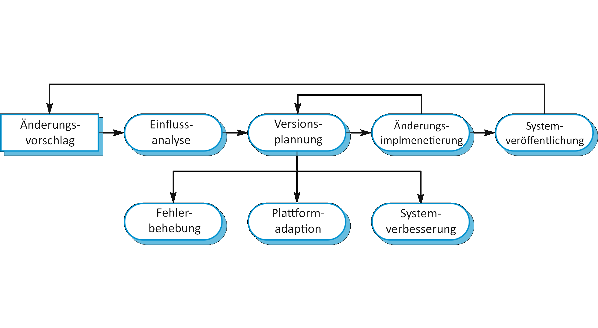
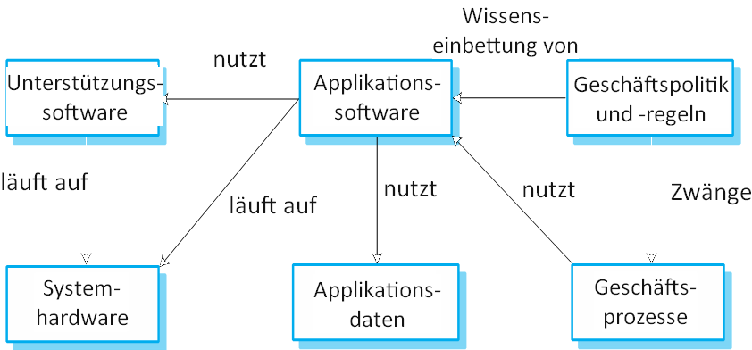

# Software evolution

**Autor:** Finn Kuhn

Das Kapitel befasst sich mit der Software Evolution in der Softwareentwicklung. Die beschriebenen Inhalte stammen aus
dem Buch Software Engineering von Ian Sommerville[1] (S. 255-282).

## Einführung

Softwaresysteme können eine sehr lange Lebenszeit haben. In dieser Zeit kommt es zu Änderungen an den Systemen. Dies
kann unterschiedliche Gründe haben, wie Fehlerbehebung, neue Hardware, Performanceoptimierung oder Druck durch
Konkurrenz. Dieser Prozess des stetigen Änderns und Weiterentwickelns ist die Software Evolution. Firmen investieren
viel in diese Evolution, 60%-90% der Produktkosten werden hier verwendet. Deshalb kann eine Optimierung der Evolution
Kosten einsparen und zum Erfolg eines Systems beitragen.

Je nach Systemen ist die Evolution aufwändiger und teurer. Besonders aufwändig können Änderungen an einem "System of
Systems" sein. Also Software die aus mehreren Teilen besteht, die sich gegenseitig beeinflussen. Hohe Kosten können dann
Änderungen verursachen, die Anpassungen in anderen Teilen benötigen.

[Abbildung 1]
*Veröffentlichungszyklus*

Da stetig neue Anforderung für ein Softwaresystem aufkommen, müssen immer wieder neue Versionen veröffentlicht werden.
Dieser sich immer wiederholende Ablauf ist in [Abbildung 1] dargestellt. Jeder Zyklus ist ein Ablauf aus Anforderungen,
Design, Implementierung und Testen. Die Veröffentlichungen passieren häufig in einen regelmäßigen Rhythmus, so dass
beispielsweise alle zwei Wochen eine neue Version veröffentlicht werden kann. Durch die verschiedenen Phasen und einem
engen Rhythmus kann es passieren, dass eine weitere Version bereits entwickelt wird, bevor die Vorige veröffentlicht
wurde. Der Abstand zwischen Veröffentlichungen wird, vor allem in den letzten zehn Jahren, immer kleiner. Das hat den
Vorteil, dass schneller auf externe Faktoren wie Konkurrenten oder Nutzerrückmeldungen eingegangen werden kann.

Dieser Ansatz der Evolution kann nur funktionieren, wenn die initiale Entwicklung und die Evolution vom gleichen Team
durchgeführt wird. Es passiert allerdings häufig, dass die Wartung durch ein anderes Team umgesetzt wird, beispielsweise
wenn externe Firmen zur Entwicklung eingeschaltet werden. Durch diese Trennung können Probleme im Evolutionsprozess
aufkommen. Es passieren, dass Anforderungs- oder Designdokument nicht weitergegeben werden. Wenn Firmen fusionieren
läuft man in die Gefahr einer unterbrechung der Evolution, da die externe Software integriert und angepasst werden muss.
Bei so einer Trennung von Entwicklung und Evolution, wird der Prozess der Anpassungen Softwarewartung genannt.

[Abbildung 2]
*Evolution und Service*

Eine Alternative zum Modell der Zyklen ist in [Abbildung 2] zu erkennen. Hier wird der Prozess in mehrere Phasen
eingeteilt. Der größte Unterschied liegt in der Unterscheidung von einer Evolutions- und Servicephase. Der Ablauf
beginnt mit der initialen Entwicklung des Systems. In der Evolution werden noch große Anpassungen umgesetzt, die
wichtige Anforderungen implementieren. Die Servicephase wird für kleine Änderungen genutzt. In der letzten Phase werden
nur noch unabdingbare Änderungen umgesetzt, das Unternehmen sucht außerdem nach einer Möglichkeit das System zu
abzuschalten und zu ersetzen.

## Evolutionsprozesse

Jedes Softwaresystem ist anders aufgebaut, dementsprechend gibt es auch keine komplett standardisierten
Änderungsprozess, der auf jedes System angewendet werden kann. Dieser Prozess ist unter anderem davon abhängig um was
für eine Art von Software es sich handelt, welcher Entwicklungsprozess genutzt wird und dem Können der einzelne
Entwickler.

### Ablauf

Die Basis für jede Evolution sind Änderungsvorschläge. Diese können ganz unterschiedliche Beweggründe haben. So können
bereits vorhandene Anforderungen umgesetzt werden, die es nicht in die vorherige Veröffentlichung geschafft haben.
Genauso kommen häufig neue Anforderungen hinzu, die die Funktionalität der Software erweitern sollen. Außerdem können
Änderungen das Ziel haben das System zu optimieren. Eine Optimierung kann entweder durch das Beheben eines Fehlers
passieren oder indem die Software intern verbessert wird.

[Abbildung 3]
*Zyklischer Prozess aus Vorschlägen und Evolution*

In [Abbildung 3] ist der zyklische Prozess von einem Vorschlag zur Evolution zu sehen. Bevor ein Änderungsvorschlag
aufkommt, muss die Änderung erst identifiziert und definiert werden. Wenn der Vorschlag akzeptiert wird, folgt dann die
eigentliche Evolution, die in einem neuen System, beziehungswiese einer neuen Version mündet. Danach beginnt der Prozess
von vorne. In diesem Zyklus ist es wichtig, dass Änderungsvorschläge vor der Umsetzung immer analysiert werden. Das
heißt es wird überprüft wie komplex die Änderung ist und welchen Einfluss sie auf das System hat, um Kosten und Aufwand
abzuschätzen.

In [Abbildung 4] wird der Evolutionsprozess in seine Einzelteile zerlegt. Nach der Änderungsanfrage wird erst der
Einfluss analysiert. Wenn die Änderung dann akzeptiert wird, wird eine neue Version geplant, die alle umzusetzenden
Anforderungen enthält. Nach der Implementierung wird die neue Version veröffentlicht.

[Abbildung 4]
*Aktivitäten in der Softwareevolution*

### Evolutionsteam

Wenn initiale Entwicklung und Evolution durch ein einzelnes Team umgesetzt wird, können Änderungen direkt in den
Entwicklungsprozess eingebunden werden. Dies bietet die Möglichkeit Nutzerrückmeldungen direkt zu verarbeiten. Falls
sich ein anderes Team um die Evolution kümmert, muss zuerst eine Phase des Verstehens umgesetzt werden, damit der
Einfluss einer Änderung abgeschätzt werden kann.

Wenn die verschiedenen Teams verschiedene Entwicklungsansätze nutzen, können Probleme entstehen. Bei der Übergabe eines
agilen Entwicklungsteams zu einem planbasierten, ist die Dokumentation häufig nicht ausreichend außerdem sind die
Anforderungen nicht vollständig definiert für den kompletten Projektzeitraum. Wenn ein planbasiertes an ein agiles Team
übergibt, müssen zuerst automatische Tests komplett neu entwickelt werden, außerdem ist die Codestruktur häufig nicht so
vereinfacht, wie es die agile Entwicklung verlangt.

Grundsätzlich ist es in agilen Projekten relativ einfach den Evolutionsprozess an die Entwicklung anzuschließen.
Automatische Tests helfen spätere Änderungen durchzuführen und durch das Backlog lassen sich neue Anforderungen einfach
priorisieren. Allerdings muss der Prozess eventuell so angepasst werden, dass der Veröffentlichungszyklus verlängert
wird, um den Produktiveinsatz nicht zu sehr zu stören.

### Dringende Änderungen

Es kann immer vorkommen, dass eine Software umgehend geändert werden muss. Das kann aufgrund eines kritischen
Systemfehlers sein, der das Arbeiten blockiert oder eine Sicherheitslücke aufmacht. Es kann passieren, dass eine
vorherige Änderung unerwartet Effekte hat, die behoben werden müssen oder dass sich das Geschäftsfeld unerwartet änder
durch zum Beispiel eine rechtliche Änderung oder eine Neuentwicklung eines Konkurrenten. Diese Änderungen müssen sofort
umsetzt werden, was zu einem verändertem Prozess führt, der in [Abbildung 5] zu sehen ist.

[Abbildung 5]
*Prozess für dringende Änderungen*

Hier wird auf eine Änderung der Dokumentation und Anforderung verzichtet. Außerdem wird häufig die schnellste Lösung
gewählt, anstatt die technisch beste. Im Optimalfall können im späteren Verlauf des Projekts diese Änderungen nachgeholt
werden, um die Qualität der Software hochgehalten werden kann. Häufig klappt das aber nicht, was spätere Änderungen
immer schwieriger macht.

## Altsysteme

Softwaresystem gibt es inzwischen seit ca. 60 Jahren. Über diese Zeit wurden manche Softwaresysteme ersetzt, andere
werden über eine lange Zeit genutzt. Alte Softwaresysteme, die auf Technologien oder Sprachen basieren, die nicht mehr
benutzt werden, heißen Altsysteme. Diese werden entsprechend bereits seit einer langen Seit gewartet, was dazu führen
kann, dass die Struktur der Software durch Änderungen schlechter geworden ist. Außerdem ist es möglich, dass das System
auf veralteter Hardware basiert. Dadurch ist es teilweise nicht mehr möglich die Software anzupassen und zu optimieren.

### Altsysteme als sozialtechnologische Systeme

Altsysteme bestehen nicht nur aus der eigentlich Software, sondern umfassen ebenfalls die Hardware, Bibliotheken,
anderes Softwareabhängigkeiten und Geschäftsprozesse. Deshalb spricht man auch von sozialtechnologische Systemen. Diese
Elemente und ihre Abhängigkeiten sind in [Abbildung 6] visualisiert.

[Abbildung 6]
*Elemente eines Altsystems*

* Systemhardware: Altsysteme wurden für alte hardware entwickelt, die nicht mehr verfügbar und kompatibel ist teuer zu
  warten.
* Softwareabhängigkeiten: Abhängig von Software, zum Beispiel dem betriebssystem, die nicht mehr weiterentwickelt wird.
* Anwendungssoftware: Ein System kann aus mehreren Teilen bestehen, die zu unterschiedlichen Zeiten entwickelt wurden.
  Dadurch entsteht ein System mit verschiedenen Programmieransätzen oder Programmiersprachen.
* Anwendungsdaten: Altsystem sammeln häufig viele Daten an, die inkonsistent, redundant oder über viele Datenbanken
  verteilt sind.
* Geschäftsabläufe: Abläufe können um ein Altsystem konstruiert und an die Funktionalitäten gebunden sein.
* Firmenpolitik- und regeln: Ein System kann in die Firmenregeln eingebettet sein, die nicht gebrochen werden dürfen 

## Softwarewartung

[Abbildung 1]: chapter09/assets/Bild1.png

[Abbildung 2]: chapter09/assets/Bild2.png

[Abbildung 3]: chapter09/assets/Bild3.png

[Abbildung 4]: chapter09/assets/Bild4.png

[Abbildung 5]: chapter09/assets/Bild6.png

[Abbildung 6]: chapter09/assets/Bild7.png


Nach dem Lesen des Kapitels sollten Sie einiges wissen und dann noch viel mehr und sehr viel mehr und weniger.

## Unterkapitel

* **Softwaresystem**:
  Die *innere* Sicht des Informatikers nimmt Software als Softwaresystem wahr.
* **Softwareprodukt**: Die *äußere* Sicht eines Auftraggeber nimmt ein Softwaresystem als Softwareprodukt wahr.

### Tabelle

| A          |     B       |           C               | 
|:----------:|:-----------:|:-------------------------:|
| Eins | Zwei | Drei |
| Vier | Fünf | Sechs |

## Links

[Markdown] ist eine Sprache, die nach HTML konvertiert werden kann.

[Markdown]: http://daringfireball.net/projects/markdown/

## Aufzählung

Es unterteilt sich in:

* A
    * A1
* B
    * B1
    * B2
* C

# Überschrift

"...the **go to** statement should be abolished..." [1].

Dieser Link führt intern zu einem anderen [Thema](qualitaet/README)

Dieser Link führt extern nach [Youtube](https://www.youtube.com/)

> Dieser Text ist völlig sinnlos, aber steht trotzdem hier. Dieser Text geht über mehrere Zeilen.

## Unterüberschrift

* Eins
    * eins.eins
    * eins.zwei
* Zwei
    * Zwei.zwei
* Drei

### Code

```javascript
public

class A {
    Integer
    a;

    public A() {
        this.a = 1
    }
}
```

Syntax Highlighting für Javascript. Weitere Sprachen müssen konfiguriert werden.

### Bilder


### Audio

[](media/sample.mp3 ':include')

### Video

[](media/sample.mp4 ':include')

## Referenzen

[1]: Dijkstra, E. W. (1968). Go to statement considered harmful. Communications of the ACM, 11(3), 147-148.