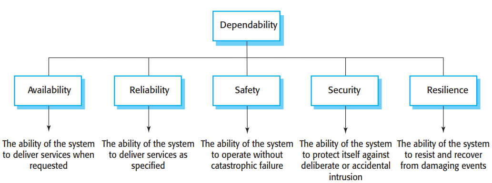
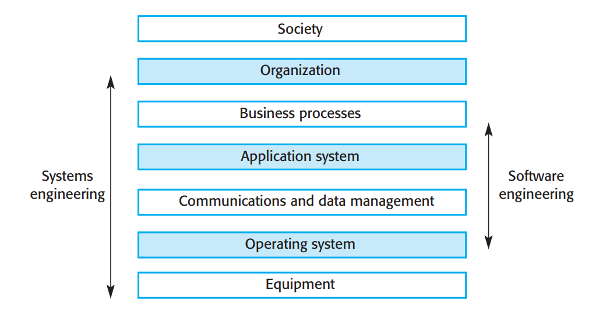

# Dependable systems

**Autor:** Maxim Fründt

Durch die hohe Bedeutung, die Software in unserem alltäglichem Leben hat, ist es von großer Wichtigkeit, dass man sich auf diese verlassen kann. Man spricht auch von der Dependability (Zuverlässigkeit) von Software(-Systemen). Die Software sollte nicht nur immer zur Verfügung stehen, wenn sie benötigt wird, sondern korrekt und ohne Seiteneffekte funktionieren. Um die Doppeldeutigkeit der Begriffe zu umgehen, wird im Folgenden der englische Begriff verwendet, bei Erstnennung wird eine Übersetzung dazu geschrieben.

## Dependability und Systeme

Zunächst soll wiedergegeben werden, was ein System dependable (zuverlässig) macht und wie Systeme aufgebaut werden. Darüberhinaus werden die Systemeigenschaften genannt, welche die Dependability des Systems beeinflussen.

### Einführung

Die Dependability von Systemen ist in der Regel wichtiger als die Gesamtheit an Funktion dessen, hauptsächlich aus folgenden Gründen:
- Oft ist es verkraftbar wenn eine Funktion des Systems ausfällt, solange das System weiter verfügbar ist
- Unzuverlässliche oder unsichere Systeme werden von Benutzern abgelehnt, diese Ablehnung kann sich auch auf andere Produkte des Unternehmens auswirken
- Die Kosten eines Ausfalls können je nach Anwendung immens hoch sein
- Unzuverlässige Systeme können zu Datenleaks oder Datenverlust führen

Systeme können auch ohne hohe Dependability nützlich sein, jedoch wird in diesem Fall von außen versucht dies zu kompensieren. Beispielsweise wird ein Privatnutzer seine Daten regelmäßig Backupen, um diese nicht durch einen Softwarefehler auf dem Gerät zu verlieren.

Um ein zuverlässiges System Designen zu können, muss mehr als nur die Software betrachtet werden. Die ausführende Hardware und der bedienede Nutzer spielen auch einen Faktor in der Dependability des Systems, folglich unterscheidet man zwischen

- Hardware-Fehler, welche durch einen Designfehler, einem Herstellungsfehler, einem Fehler durch die Umgebung oder durch erreichen des Endes der Lebenszeit auftreten können
- Software-Fehler, welche durch Fehler in der Spezifikation, dem Design oder der Implementierung der Software auftreten können
- Menschliche-Fehler, welche durch nicht vorhergesehene Bedienung der Software entstehen können

### Eigenschaften der Dependability

Die Dependability eines Systems beschreibt wie viel Vertrauen man in das System hat, dass es unter normalen Bedingungen seine Aufgabe erfüllt, ohne in einen Fehlerzustand überzugehen. Quantifiziert wird die Dependability nicht in zahlen sondern in Beschreibungen wie beispielsweise "nicht zuverlässig", "sehr zuverlässig", "extrem zuverlässig".
Die Dependability eines Systems wird hauptsächlich durch fünf Eigenschaften beeinflusst. Diese sind im folgenden aufgelistet und in Abbildung 11 visualisiert.

- **Availability (Verfügbarkeit)**, welche die Wahrscheinlichkeit darstellt, dass das System erreichbar ist und dem Benutzer seine Dienste zur verfügung stellen kann
- **Reliability (Verlässlichkeit)**, ist die Wahrscheinlichkeit über eine festgelegte Zeit, dass das System seine Dienste korrekt zur Verfügung stellen kann
- **Safety (Sicherheit in Hinsicht auf Schaden auf die Umgebung)**, ist die Wahrscheinlichkeit, dass das System Schaden am Mensch oder der Umwelt anrichtet
- **Security (Sicherheit in Hinsicht auf Verteidigung gegen Eindringen)**, ist eine Beurteilung, wie wahrscheinlich es ist, dass das System absichtlichen oder unabsichtlichen Sicherheitsverstößen widerstehen kann
- **Resilience (Widerstandfähigkeit)**, ist eine Beurteilung, wie gut das System seine kritischen Komponenten aufrechterhalten kann, während Störungen vorliegen wie der Ausfall von Komponenten oder Cyberangriffe

Nicht jede Eigenschaft ist zwingend für jedes System kritisch. Beispielsweise ist für eine Insulinpumpe die Security weniger wichtig, als die Reliability. Die Pumpe muss jederzeit ordnugnsgemäß funktionieren, speichert jedoch keine vertraulichen Daten.

||
|:--:| 
| *Abbildung 1: Haupteigenschaften der Dependability eines Systems* |

Zusätzlich gibt es weitere Systemeigenschaften, welche dessen Dependability beeinflussen.

- **Repairability (Reparierbarkeit)**, welche beschreibt wie einfach das System reparierbar ist. Probleme im System müssen diagnostiziert werden können und die fehlerhafte Komponente muss erreichbar und anpassbar sein
- **Maintainability (Wartbarkeit)**, welche beurteilt, wie gut das System an neue Gegebenheiten angepasst werden kann ohne neue Fehler im System einzufügen
- **Error tolerance (Fehlertoleranz)**, beschreibt wie umfangreich das System gegen Fehleingaben geschützt ist

Um zuverlässige Software designen zu können, muss folgendes berücksichtigt werden:
- Das Einbringen von versehentlichen Fehlern in der Software-Spezifikation und -entwicklung ist zu vermeiden
- Verzifizierungs- und Validierungsprozesse, welche effektiv Restfehler aufspühren, die die Dependability der Software beeinflussen, müssen definiert werden
- Das System muss tolerant gegenüber Fehlern sein, sodass es auch im Fehlerfall weiter arbeiten kann
- Schutzmechanismen gegen externe Angriffe, welche die Availability oder Security beeinträchtigen, müssen designt werden.
- Das eingesetzte System und zusätzliche benötigte Software muss korrekt konfiguriert werden
- Fähigkeiten um externe Angriffe zu erkennen und ihnen zu widerstehen müssen im System vorgesehen werden
- Das System muss so designt werden, dass es sich schnell von Systemausfällen und Angriffen erholen kann, ohne kritische Daten zu verlieren

**Einfluss auf die Performance**

Um Fehlertoleranz gewährleisten zu können, muss redundanter Code implementiert werden, wodurch die Performance des Systems beeinträchtigt wird. Im Design des Systems muss also eine Balance aus Performance und Sicherheit, welche für das System adäquat ist, gefunden werden.

**Einfluss auf die Kosten**

Der Designprozess eines zuverlässigen Systems ist teurer. Neben der tatsächlichen Entwicklung müssen mehr Ressourcen für das Aufspühren von Fehlern und der Implementierung von Redundanz aufgebracht werden. Die Kosten steigen je nach Dependability-Level exponentiell an.

### Soziotechnische Systeme

Um ein dependable System entwickeln zu können, muss klar sein was ein System ist, wie es abgegrenzt wird und wie es sich zusammensetzt. Software und Hardware sind in Computersystemen voneinander abhängig. Zusammen formen sie ein System, welches komplexe Berechnungen ausführen und weitergeben kann. Dadurch folgt auch, dass Software Engineering keine für sich alleinstehende Aktivität ist, sondern ein Teil von Systems Engineering. 
Systeme sind in der Regel dazu ausgelegt der Gesellschaft einen Mehrwert zu bringen. Beispielsweise werden Wetterstationen von Organisationen ausgewertet, um eine vorhersage über das Wetter treffen zu können, wovon die Allgemeinheit profitiert. Systeme welche über die technischen Elemente hinausgehen, wie die im Beispiel genannte Organisation, welche die Daten der Wetterstationen auswertet, werden als soziotechnische Systeme bezeichnet. Ein soziotechnisches System wird in mehrere Ebenen eingeteilt, jedoch ist es auch wichtig das System als ganzes zu betrachten. Ein Fehler in der Software kann eventuell schnell behoben werden, der Einfluss auf die anderen Ebenen kann jedoch bleibende Schäden nach sich ziehen. In Abbildung 2 ist der Schichtenaufbau eines soziotechnischen Systems dargestellt und das Systems und Software Engineering den betroffenen Schichten zugewiesen. Da Software eine wichtige Rolle in jeder Ebene des Systems darstellt, gibt es keine ausdrückliche Softwareebene.

||
|:--:| 
| *Abbildung 2: Schichtenaufbau eines soziotechnischen Systems* |

- Hardwareebene: Stellt die Hardware des Systems dar
- Betriebssystemebene: Stellt eine Schnittstelle zwischen der höheren Softwarebene und der Hardware dar
- Kommunikations und Datenebene: Oft auch Middleware genannt, erweitert diese Ebene die Betriebssystemebene um Funktionalitäten wie zugriff auf Datenbanken und Remotesysteme
- Applikationsebene: Stellt die applikationsspezifischen Funktionen des Systems dar
- Geschäftsprozessebene: Beinhaltet die geschäftsspezifischen Funktionalitäten des Systems
- Organisationsschicht: Beinhaltet Strategien, Regeln, Vorschriften und Normen der Organisation, welche befolgt werden müssen
- Sozialebene: Stellt die Gesetze und Vorschriften der Gesellschaft dar, welche befolgt werden müssen

Die Ebenen sollen so aufgebaut werden, dass eine Ebene nur mit ihren direkten Nachbarn interargieren kann. Alle weiteren Ebenen sollen durch die Nachbarn abstrahiert werden. Das ist jedoch nicht immer möglich. Wenn beispielsweise neue Gesetze erlassen werden (Sozialebene) müssen eventuell Änderungen in den untersten Schichten vorgenommen werden.

Beim Design der Software muss stets das gesamte System im Blick behalten werden. Um andere Komponenten des Systems vor Fehlern in der Software zu schützen. Ein Softwarefehler darf nie zum Systemausfall führen sondern muss innerhalb seiner Ebene isoliert werden.

Eine detailiertere Vorstellung der soziotechnischen Systemen erfolgt in Kapitel 19 - Systems Engineering.

## Maßnahmen zur Verbesserung der Dependability

Im Folgenden wird näher auf Methoden eingegangen, welche die Dependability eines Systems verbessern. Dabei geht es nicht nur um Schutzmechanismen, die ein laufendes System schützen, sondern auch um Methoden, um Fehler in der Systemplanung bereits zu beseitigen.

### Redundanz und Diversität

Obwohl viele Maßnahme getroffen werden, um Fehler im System zu vermeiden, können sie nie ausgeschlossen werden. Aus diesem Grund ist es wichtig, dass ein Fehler nicht zu einem Totalausfall des Systems führt. Methoden gegen einen Totalausfall im Fehlerfall beinhalten Redundanz (d. h. Komponenten werden in mehrfacher Ausführung eingesetzt) und Diversität (d. h. die redundanten Komponenten sind nicht dieselben). Wenn im System durch einen Fehler eine Komponente ausfallen sollte, kann diese durch die Redundanz dieser einfach ersetzt werden. Diversität ist wichtig, da bei der Verwendung der gleichen Komponente diese durch den derzeitigen Fehler mit ausfallen könnte. Bei der Verbindung von Redundanz und Diversität spricht man auch von diversitärer Redundanz. Als beispiel sollten persönliche Daten gesichert werden. Durch die Kopie der Daten erhält man eine Redundanz. Die Kopie sollte jedoch auf einem anderen Medium gesichert werden, wodurch man eine Diversität erreicht. Im gleichen Sinne sind Systeme, welche eine hohe Availability erreichen wollen oft mit mehreren Servern ausgestattet, welche unterschiedliche Hardware aufweisen.
Redundanz und Diversität werden auch im Prozess der Softwareentwicklung eingesetzt. So werden Probleme beispielsweise auf verschiedene Arten gelöst und das Ergebnis verglichen oder dieselbe Aufgabe von verschiedenen Entwicklern gelöst und verglichen. Solche Methoden führen jedoch zu höheren Entwicklungskosten. 
Neben höheren Kosten führen Redundanz und Diversität zudem zu komplexeren Systemen, wodurch die Möglichkeit, dass Fehler auftreten wieder steigt. Aus diesen Gründen kann es je nach Projekt empfehlenswerter sein, dass Software Redundanz und Diversität vermieden wird um die Software einfacher zu halten und dafür mehr Ressourcen in die Verifikation und Validierung fließen sollen.

### Zuverlässige (Software-)Prozesse

Zuverlässige Prozesse sind Prozesse, welche verwendet werden um zuverlässige Systeme zu erstellen. Diese können auch feingranular erstellt werden, um beispielsweise nur die Software oder nur die Hardware abzudecken. Wenn ein solcher Prozess eingesetzt wird, kann man sich sicher sein, dass dieser vernünftig ausgeführt und dokumentiert worden ist. Zu der Dokumentation gehört ein Prozessmodell, welches definiert werden muss. Neben guter Dokumentation muss der Prozess zudem wiederholbar sein. Der Ausgang des Prozesses darf also nicht von Umwelteinflüssen, wie dem ausführenden Entwickler, abhängig sein.
Durch die Verwendung solcher Prozesse ist es einfacher zu beweisen, dass die Software bestimmte Normen erfüllt. Der Entwickler kann in diesem Falle dem Prüfer das Modell des verwendeten Prozesses vorstellen und beweise in Form von Daten, die während der Ausführung des Prozesses gesammelt werden, liefern, die bestätigen, dass der Prozess ordnungsgemäßg befolgt wurde. Neben der Prozessdokumentation ist für die Zertifizierung ebenfalls eine Dokumentation des Produkts nötig.
Die Attribute von zuverlässigen Prozessen sehen wie folgt aus:
- **Prüffähigkeit** Auch Außenstehende sollten den Prozessen verstehen können, damit diese den Prozess prüfen können
- **Diversität** Der Prozess sollte redundante und diversitäre Aktivitäten zur Verifikation und Validierung beinhalten
- **Dokumentierbarkeit** Der Prozess sollte ein definiertes Prozessmodell aufweisen, welches die Dokumentation vorgibt
- **Robustheit** Der Prozess sollte sich von Fehlern in Aktivitäten erholen können
- **Standartisierung** Standards der Softwareentwicklung sollten eingehalten werden und ausreichend Dokumentation verfügbar sein
Grundsätzlich ist das Ziel aller Aktivitäten des Prozesses zu vermeiden, dass neue Fehler in das System eingeführt werden, bestehende Fehler aufspühren und beseitigen und Informationen über den Prozess selbst pflegen. Im Detail hängen die Aktivitäten des Prozesses davon ab, welche Software entwickelt wird. Im Folgenden sind allgemeingültige Aktivitäten aufgeführt, die in einem zuverlässigen Prozess stattfinden:
- **Anforderungsprüfung** Die Anforderungen müssen auf Komplettierung und Konsistenz geprüft werden, dies sollte sehr früh in der Entwicklung passieren
- **Anforderungsmanagement** Wenn die Anforderungen geändert werden sollen, müssen diese geprüft werden und sichergestellt werden, dass der Einfluss auf das ganze System verstanden wird
- **Formale Spezifikation** Ein mathematisches Modell der Software muss erstellt und analysiert werden. Dadurch können Probleme in den Anforderungen gefunden werden
- **Systemmodellierung** Das Software-Design muss als grafisches Modell dargestellt werden. Im Modell-Driven-Engineering kann aus diesen Modellen der Code gewonnen werden
- **Kontrolle des Designs und Programms** Das Design und die Programmierung müssen von verschiedenen Prüfern kontrolliert werden. Dabei kann eine Liste von häufigen Design- und Programmierfehlern hinzugezogen werden
- **Statische Analyse** Automatische Prüfungen müssen am Sourcecode vorgenommen werden, um Programmierfehler zu finden
- **Planung und Ausführung der Tests** Systemtests müssen entwickelt und ausgeführt werden. Die Tests müssen dabei alle Anforderungen abdecken
Neben Prozessen, welche sich auf das Entwickeln und Testen konzentrieren, werden auch Prozesse für das Qualitäts- und Änderungsmanagement benötigt.
Durch die Notwendigkeit der frühen Anforderungsprüfung und dem Streben nach einer umfangreichen Dokuemtation stehen zuverlässige Prozesse im Konflikt mit der agilen Entwicklungsmethodik, bei der die Anforderungen parallel zum System entwickelt werden und Dokumentation minimal gehalten werden soll. Dadurch ist rein agile Entwicklung unpraktisch für die Entwicklung von zuverlässigen Systemen, jedoch können agile Prozesse definiert werden, welche den Kriterien der zuverlässigen Prozessen gerecht werden.

### Formale Methoden und Dependability

Formale Methoden sind mathematische Ansätze um Software zu Entwickeln. Dabei wird für die Software ein formales Modell definiert. Das definierte Modell kann anschließend auf Fehler und Inkonsistenzen analyisiert werden. Dabei kann bereits die Erstellung des Modells, ohne anschließenden Beweis helfen, um Fehler aufzudecken.
In der Anfangszeit der Informatik wurden Modellen zu Beginn der Entwicklungszeit erstellt und mathematisch bewiesen. Da die Beweise mit einem hohen Aufwand verbunden sind, werden diese überwiegend automatisch durchgeführt.
Alternativ zu der Erstellung der Beweise als eigenständige Aktivitäten neben der Entwicklung, gibt es den Ansatz des Refinement-Based Development. Dabei wird aus dem Modell durch Transformation die Software erstellt.
Zudem gibt es die Methodik Model-Checking auf das Systemmodell anzuwenden. Dabei wird das Modell daraufhin analysiert, ob es die vorgegebenen Anforderungen erfüllt.

## Referenzen

[1]: Ian Sommerville. 2015. Software Engineering (10th. ed.), 285-307.