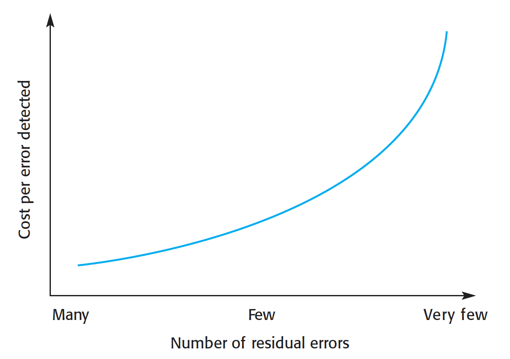
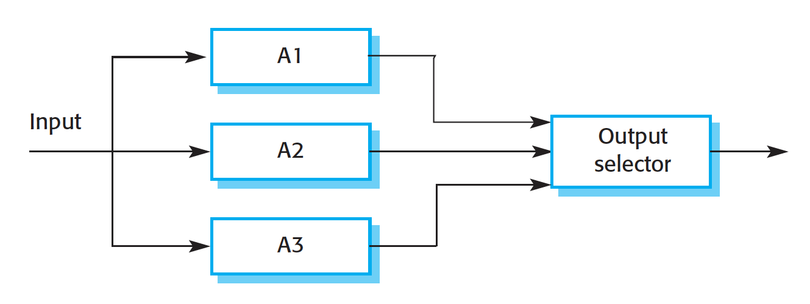

# Reliability Engineering

**Autor:** Frederic Birwe

## 1 Einleitung

Jedes Softwaresystem, dass in eine komplexe Umgebung eingebunden ist, wird zu einem Prozentsatz fehlerhafte Ausgaben verursachen. Das Reliability Engineering versucht eine Software und das System, in dem sie eingebettet ist, so zu gestalten, dass die Software möglichst verlässlich arbeitet. Die Begriffe Verfügbarkeit und Verlässlichkeit werden nachfolgend definiert.
Nachfolgend werden für definierte Begriffe die englischen Begriffe verwendet.

## 2 Definition fault, error und failure

Zunächst ist es wichtig, zu definieren, was ein Fehler im Kontext des reliability engineering überhaupt ist. Brian Randell definiert hierfür ein vierstufiges fault-error-failure Modell. Jede Stufe folgt chronologisch auf die vorhergehende Stufe und stellt quasi eine weitere Eskalation dar.
Das Modell ist wie folgt aufgebaut:

1. _menschlicher Fehler_ Durch menschliche Fehler, zum Beispiel Unachtsamkeiten bei der Programmierung, werden Fehlermöglichen im System eröffnet. Nehmen wir als Beispiel ein System an, dass eine bestimmte Messung zu jeder vollen Stunde vornehmen soll. Am Ende der Routine einer Messung wird der nächste Messzeitpunkt errechnet. Der Programmierer entscheidet sich hier dazu, dafür die einfach die aktuelle Stunde +1 zu rechnen. Dieses Verfahren funktioniert für alle Stunden außer für 23.00, denn hier muss als nächster Messzeitpunkt 0.00 und nicht 24.00 errechnet werden.
2. _system fault_ Eine solche Fehlerstelle nennt man dann fault. In diesem Fall ist der Fault der Umstand, dass eine Stelle im Code existiert, die +1 Stunde auf die aktuelle Uhrzeit rechnet, ohne zu prüfen, ob der aktuelle Zeitpunkt >= 23.00 ist.
3. _system error_ Sobald dieser fehlerhafte Code ausgeführt und zu einem fehlerhaften Zustand des Systems führt, spricht man von einem error.
4. _system failure_ Im schlimmsten Fall führt ein solcher error zu einem failure. Failure bedeutet, dass der Service kein oder ein fehlerhaftes Ergebnis zurückliefert. Dieser Zustand soll vermieden werden!

Faults führen nicht zwangsläufig zu einem Failure. Beispielsweise kann der fehlerhafte Code nicht erreicht werden, eine neue Transaktion verhindert den Error-State oder aber das System beinhaltet Mechnismen, mit denen faults erkannt oder behandelt werden.

## 3 Definition availability (Verfügbarkeit) und reliability (Verlässlichkeit)

Um die Resiliz eines Softwaresystemes gegen fehlerhaftes Verhalten zu bewerten sind vor allem zwei Eigenschaften von Bedeutung:

- availability (Verfügbarkeit)
- reliability (Verlässlichkeit)

Verfügbarkeit bezeichnet den Zeitraum, in dem ein Service beziehungsweise System für Anfragen zur Verfügung steht, im Verhältnis zum Gesamtzeitraum. Zuverlässigkeit hingegen bezeichnet den Anteil korrekter Ausgaben an allen Ausgaben.
Je nach System und Einsatzgebiet stehen diese Werte in verschiedenem Maße im Fokus bei der Entwicklung eines einsatzfähigen Systems.

### 3.1 availability

Die Verfügbarkeit bemisst sich an der Dauer, in der ein System nicht zur Verfügung steht und wie sehr die User des Systems von diesem Ausfall betroffen sind. Das bedeutet zum Beispiel: Ein Ausfall eines nationalen Webshops zwischen 3.00 und 4.00 morgens kann weniger schlimm sein als der Ausfall des gleichen Systems zwischen 19.00 und 19.30, obwohl die Ausfallzeit geringer ist.

### 3.2 reliability

Die reliability definiert sich, wie oben definiert, aus dem Anteil der Eingaben, die einen failure verursachen an allen Eingaben. Das Problem hierbei ist, dass dies kaum zu messen ist. Der Wert hängt beispielsweise sehr stark Systemumgebung und vom Nutzungsverhalten ab. Es ist sehr wahrscheinlich, dass die Messung der reliability in einer kontrollierten Laborumgebung stark abweichen wird von einer Messung in einem realen Umfeld.
Die reliability eines Systems setzt sich zusammen aus:

- hardware reliability
- software reliability
- operator reliability

**<ergänzen>**

## Methoden zur Verbesserung der Reliability

Zur Verbesserung der Reliability eines Systems kommen vor allem drei Ansätze zur Anwendung:

1. _Fault avoidance_ In Design, Entwicklung und Implementierung der Software kommen Techniken zum Einsatz, die dabei helfen, die Anzahl der faults im System zu minimieren. Beispiele dafür sind eine stark typisierte Programmiersprache und die Vermeidung von fehleranfälligen Programmierkonzepten.
2. _Fault detection and correction_ Vor dem Liveeinsatz eines Systems wird dieses intensiv getestet und gefundene Fehler entfernt. Dieser Ansatz ist vor allem in sicherheitskritischen Bereichen, wie der Steuerung von Flugzeugen, verbreitet.
3. _Fault tolerance_ Das System wird so designt, dass es im Falle eines Errors trotzdem keinen Failure verursacht. Grundlegende Techniken sind in den meisten Systemen bereits verbaut.

Die Erreichung einer hohen reliability durch die genannten Techniken ist häufig teuer. Dadurch, dass man offensichtliche oder häufige Fehler meist schnell entdeckt, erhöhen sich die Kosten pro erkannten und behobenen Fehler in der Regel je mehr Fehler bereits erkannt unbehoben worden sind (siehe Abb.11.1)

## Reliability Metriken

Zur Messung der Reliability stehen die folgenden Metriken zur Verfügung

1. _Probability of failure on demand (POFOD)_ POFOD bezeichnet die Wahrscheinlichkeit dafür, dass eine Anfrage zu einem Failure führt. Mit einem POFOD von 0.01 besteht also eine Wahrscheinlichkeit von 1/100, dass eine Eingabe zu einem Failure führt. Oder anders formuliert, im Durchschnitt wird jede 100. Eingabe zu einem Failure führen.
2. _Rate of occurence of failures (ROCOF)_ Diese Metrik bezeichnet die durchschnittlich erwarteten Fehler in einer bestimmten Zeiteinheit (zum Beispiel einer Stunde oder einer Woche) oder über eine bestimmte Anzahl an Transaktionen (zum Beispiel pro 1000 Transaktionen)
3. _Mean time to failure (MTTF)_ Die Metrik MTTF ist so etwas wie das Gegenstück zu ROCOF. Hier wird als Metrik die durschnittliche Zeit beziehungsweise die durchschnittliche Anzahl an Transaktionen zwischen zwei Failures gemessen.
4. _Availability (AVAIL)_ Die Wahrscheinlichkeit dafür, dass ein System zur Verfügung steht, wenn der Service angefragt wird.

Die verschiedenen Metriken haben unterschiedliche Einsatzzwecke.
POFOD eignet sich für Systeme, bei denen es zwar wenig Anfragen gibt, bei dem aber ein Failure gravierende Folgen hätte. Typische Beispiele hierfür sind Notfallsysteme, die eingreifen sollen, wenn alle anderen Systeme nicht greifen.
ROCOF hingegen eignet sich für Systeme, die eine regelmäßige Anzahl an Zugriffen haben.
MTTF eignet sich für Systeme, bei denen eine Transaktion sehr lange in Bearbeitung ist. Typische Beispiele hierfür sind Programme, in denen an geöffneten und geladenen Dateien gearbeitet wird. Das können zum Beispiel CAD-Programme, Bildbearbeitungsprogramme oder Officeprograme sein. Da hier im schlimmsten Fall die Arbeit von mehreren Stunden durch einen einzelnen Programmabsturz verloren ist, ist die entscheidende Metrik für diese Gruppe von Programme die durchschnittliche Zeit zwischen zwei Failures.

## Fault-tolerante Architekturen

Fault-tolerante Architekturen sind so gestaltet, dass sie auch dann noch funktionieren und keinen Failure produzieren, auch wenn sie durch einen error in einen error state gelangen.
Derartige Mechanismen sind vor allem in sicherheitskritischen Architekturen notwendig, beispielsweise in Notfallsystemen von Fabriken, Kraftwerken oder auch Flugzeugen.
Fault-Toleranz kann durch verschiedene Maßnahmen erreicht werden. Diese Maßnahmen sollen dabei sowohl redundant als auch divers sein. Redundant bedeutet, dass zur Lösung bestimmter Aufgaben immer mehrere Systeme bereitstehen. Diversität bedeutet in diesem Kontext, dass die verwendete Hard- und Software möglichst heterogen ist. Dies kann durch unterschiedliche Hardware, Software, verwendete Programmiersprachen und so weiter erreicht werden.

### Replicated servers

Die einfachste Methode für Ausfallsicherheit zu sorgen, ist die Verwendung von redundanten Servern. Dafür werden mehrere gleich konfigurierte Server vorgehalten. Ein vorgeschaltetes Managementsystem verteilt die eingehenden Transaktionen gleichmäßig auf die zur Verfügung stehenden Systeme. Geht eines der Systeme in einen Error-Zustand, wird dieses System aus dem Verbund gelöst und der Zustand behoben. Die anderen Systeme übernehmen die Aufgaben des ausgefallenen Systems.
Bei einer Variante dieser Herangehensweise existiert ein Primärserver, der die Hauptlast trägt. Dazu gibt es einen sekundären Server, der Aufgaben von niedriger Priorität übernimmt und nur dann einspringt, wenn das Primärsystem ausfällt.
Dieser Ansatz ist zwar recht simpel, aber kann die reliability nur in begrenztem Rahmen erhöhen, da dieser Aufbau nur bei Faults greift, die auf ein lokales System beschränkt sind, da dieser Aufbau zwar redundant aber nicht divers ist.

### Protection Systems

Ein Protection System ist ein separates System, dass die Aufgabe hat, die korrekte Funktion eines anderen, primären Systems zu überwachen und im Notfall einzugreifen.
Ein Protection System sollte dabei mindestens gleiche Sensoren wie das Primärsystem haben, idealerweise auch gleiche Aktoren. Während des laufenden Betriebs überwacht das Protection System die Tätigkeit des Primärsystems. Bemerkt es dabei, dass eine Tätigkeit durch den Primärserver ausgeführt werden sollte, dies aber nicht geschieht, greift das Protection System ein und führt Notfallmaßnahmen durch. Beispielsweise kann das die Abschaltung einer Industrieanlage oder die Notfalllandung eines Flugzeugs sein.
Das Protection System enthält nur Fähigkeiten zur Überwachung des Primärsystems sowie zur Ergreifung von Notfallmaßnahmen. Durch diese beschränkten Möglichkeiten ist das System sehr viel kompater und damit einmal deutlich kostengünstiger zu entwickeln als das Primärsystem, aber auch sehr viel einfacher und kostengünstiger zu testen und somit kann effizienter eine hohe reliability erreicht werden. Diese hohe reliability erhöht auch signifikant die reliability des Gesamsystems, da das Protection System ja als Notfallersatz für das Primärsystem dient.

[abb 11.6]

### Self-monitoring architectures

In Self-monitoring architectures wird eine eingehende Anfrage aufgeteilt und über mindestens zwei separate Channels weitergeleitet. Jeder dieser Channels führt die selbe Operation durch. Nach Berechnung der Ergebnisse werden diese zusammengeführt. Haben alle System das selbe Ergebnis berechnet, gilt dieses als validiert.
Bei den parallelen Systemen müssen dabei sowohl Hard- als auch Software divers sein. Das bedeutet, dass Hardwareseitig vor allem unterschiedliche Prozessoren als auch generell diverse Hardware benutzt werden muss. Wie Diversität bei Software hergestellt werden kann, wird im Abschnitt _software diversity_ beschrieben.
In reiner Form kann ein self-monitoring system eingesetzt werden, wenn eine hohe reliability aber keine hohe availability notwendig ist. So ist es zum Beispiel in der Regel besser, dass sich ein System, dass Dosierungen von Medizin für Patienten in einem Krankenhaus steuert, einen Fehler meldet, anstatt den Patienten falsche Dosierungen zu verabreichen.
Sollen sowohl eine hohe availability als auch eine hohe reliability erreicht werden, muss eine self-monitoring architecture mit anderen Methoden kombiniert werden. So können beispielsweise mehrere Self-monitoring Systeme parallel betrieben werden, die sich gegenseitig vertreten können.

### N-Version programming

Beim n-Version programming werden mehrere Systeme mit dem gleichen Funktionsspektrum parallel betrieben. Diese Systeme sind divers. Das betrifft sowohl die Hardware als auch die Software. Die Ergebnisse dieser Systeme werden aufgefangen und validiert. Üblicherweise geht man zum Beispiel davon aus, wenn zwei oder mehr der Teilergebnisse identisch sind, dass damit das korrekte Ergebnis errechnet wurde.
Eine häufige Form der Implementierung ist die der Triple modular redundancy (TMR). Dabei wird das Programm in drei Versionen implementiert. Drei ist dabei das sinnvolle Minimum der redundanten Systeme, damit auch beim Ausfall eines der Systeme mindestens zwei unabhängig gleich errechnete Ergebnise übrig bleiben.

Die Implementierung einer fault-tolerant architecture nach diesem Modell ist, wenn eine hohe availability vorausgesetzt wird, günstiger umzusetzen als ein vergleichbares System nach dem Modell der self-monitoring architecture.
Nichtsdestotrotz bleibt die Implementierung teuer und aufwendig, da Software mit gleicher Spezifikation n-mal entwickelt werden muss

## Software Diversität

Die beschriebenen Lösungen für fault-tolerante Architekturen basieren alle auf Diversität in der Software. Dieser Ansatz folgt der Annahme, dass diverse Implementierungen der selben Spezifikationen zu unterschiedlichen Fehlern führen und daher gegenseitig ihre Schwächen ausgleichen können.
Um sicherzustellen, dass die erstellte Software divers ist, sollten die verschiedenen Teams unabhängig voneinander und ohne Kommunikation miteinander die Software entwickeln. Zudem sollten die folgenden Vorgaben beachtet werden:

1. Die Software sollte auf unterschiedlichen Designmethoden fußen (zum Beispiel Team A entwickelt objektorientiert, Team B entwickelt functional)
2. Die Teams nutzen unterschiedliche Programmierstpachen
3. Die Teams nutzen verschiedene Werkzeuge und Entwicklungsumgebungen
4. In den verschiedenen Implementierungen werden verschiedene Algorithmen verwendet

In einem perfekt diversen System gibt keine Gleichheiten zwischen den Systemen. In diesem Fall ist die kombinierte Fehlerwahrscheinlichkeit das Produkt der einzelnen Fehlerwahrscheinlichkeiten der einzelnen Implementierungen.
Eine komplette Unabhängigkeit ist allerdings in der Praxis nicht erreichtbar. Untersuchungen haben ergeben, dass auch unabhängige Entwicklerteams meist die gleichen Fehler machen oder die gleichen Teile einer Spezifikation falsch verstehen und umsetzen.
Für Missverständnisse gibt es verschiedene Gründe, so zum Beispiel:

1. Die Teammitglieder stammen meistens aus dem selben kulturellen Hintergrund und haben sehr ähnliche Ausbildungen durchlaufen
2. Die Spezifikation ist missverständlich formuliert, was sich natürlich in allen Implementierungen niederschlägt.
3. Wenn die Spezifikation nicht eindeutig ist, kann sie von allen Teams in gleicher Weise falsch verstanden werden.

Die Lösung für dieses Problem ist, dass auch die Implementierung redundant und divers erstellt wird.

## Programmiertechniken zur Erhöhung der reliability

Um beim Programmieren bereits eine möglichst hohe reliability zu erreichen gibt es eine Anzahl an best practices:

1. Kontrolle über die Sichtbarkeit von Informationen im Programm
2. Alle Eingaben auf Validität prüfen
3. Exceptionhandler für alle Exceptions vorhalten
4. Minimaler Einsatz von fehleranfälligen Komponenten
5. Checkpoints für eventuell Neustarts ablegen
6. Array-Dimensionen prüfen
7. Timeouts definieren, wenn externe Komponenten genutzt werden
8. Alle Konstanten, die reale Werte darstellen, werden benannt

Diese Best-Practices werden nachfolgend vorgestellt:

### 1. Kontrolle über die Sichtbarkeit von Informationen im Programm

Jeder Teil eines Programmes sollte nur die Informationen bekommen, die in diesem Teil auch benötigt werden. Informationen, die versteckt sind, können nicht durch unerwünschte Effekte korrumpiert werden. Um dies zu erreichen sollte im Programm mit abstrakten Datentypen gearbeitet werden. Das bedeutet, dass die interne Struktur des Datentyps versteckt ist. Zugriff von außen gibt es nur durch Interfaces auf definierten Wegen.

### 2. Alle Eingaben auf Validität prüfen

Alle Eingaben sollten möglichst direkt nach ihrer Eingabe auf Validität geprüft werden.
Möglich sind zum Beispiel die folgenden Prüfungen:

1. Range Checks: Befindet sich die Eingabe im sinnvollen/möglichen Wertebereich?
2. Size Checks: Hat die Eingabe die erwartete Länge? (zum Beispiel bei Telefonnummer, IBAN, etc.)
3. Representation Checks: Entsprechen die Eingaben einem erwarteten Muster? (Namen enthalten keine Zahlen, E-Mail Adressen bestehen aus zwei Teilen, die mit einem @ geteilt sind, usw.)
4. reasonableness checks: Liegt der eingegebene Wert in einem erwarteten Wertebereich?
   Sinnvolle Strategien zum Umgang mit nicht validen Eingaben richten sich nach dem Szenario. Bei Usereingaben kann man den User zur erneuten Eingabe auffordern. Bei Sensoren kann man die Werte interpolieren oder die Fehler an eine zentrale Stelle melden.

### 3: Exceptionhandler für alle Exceptions vorhalten

Alle sinnvollen Stellen sollten mit Exception Handlern ausgestattet sein, um so den Abbruch des Prozesses zu verhindern.
Ein Exception Handler tut in der Regel eines dieser drei Dinge:

1. Exception an eine übergeordnete Komponente weiterleiten
2. Löst das Problem in einer Weise, dass die Verarbeitung forgesetzt werden kann.
3. Den Fehler durch das Management der Programmiersprache lösen lassen

### 4: Minimaler Einsatz von fehleranfälligen Komponenten

Einige Konzepte in der Softwareentwicklung sind inherent fehleranfällig. Beispielsweise ist der Vergleich von zwei Kommazahlen nicht immer zu 100% verlässlich oder das manuelle Verwalten von Arbeitsspeicher kann zu Fehlern führen. Diese Konzepte sollten so weit wie möglich vermieden werden. Wenn sie verwendet werden, sollten sie in abstrakte Datentypen eingebettet werden, um so den potenziellen Schaden zu begrenzen.

### 5: Checkpoints für eventuell Neustarts ablegen

Bei längeren Transaktionen sollten an bestimmten Checkpoints Backups des Systemzustand abgelegt werden. Das bedeutet, dass offene Dateien in CAD-Programmen alle paar Minuten automatisch abgespeichert werden oder die Eingaben in ein Formular abgelegt werden. Wenn ein Fehler vorkommt, kann von diesem Zustand wieder gestartet werden.

### 6: Array-Dimensionen prüfen

Die meisten Sprachen, wie Python oder Java, bringen eingebaute Mechanismen mit, die prüfen, ob ein Array-Index angefragt wird, der nicht vorhanden ist. In anderen Sprachen, wie C und C++, sind solche Mechanismen nicht integriert um so für eine schnellere Ausführung zu sorgen. In diesen Programmiersprachen wird einfach eine Position im Arbeitsspeicher ausgelesen oder überschrieben, die den entsprechenden Abstand vom Beginn des Arrays hat. Dies kann natürlich eine Position sein, die einen völlig anderen Wert enthält. Um dieses Verhalten zu verhindern sollten bei Zugriffen auf einen Array immer die Array-Dimensionen geprüft werden.

### 7: Timeouts definieren, wenn externe Komponenten genutzt werden

Wenn man eine externe Komponente über das Netzwerk anfragt, sollte man immer einen Timeoutzeitraum festlegen. Falls die externe Komponente während der Berechnung in einen Error-Status wechselt, wird diese eventuell keine Antwort mehr an die anfragende Komponente schicken. Ist für diese kein Timeoutzeitraum definiert, wartet der Prozess unendlich auf eine Antwort, die nie kommen wird und man hat keine andere Wahl, als den Prozess zu killen und neuzustarten.

### 8: Alle Konstanten, die reale Werte darstellen, werden benannt

Konstante Werte aus der realen Welt (Umrechnung Inch zu cm, Geschwindigkeit von Licht, etc.) sollten an zentraler Stelle als Variablen angelegt werden. Im Programm sollten diese Werte nur in Form dieser Variablen verwendet werden, nicht als Zahl.
Dadurch wird verhindert, dass man an verschiedenen Stellen im Programm mit verschiedenen Werten für ein und die selbe Konstante arbeitet. Dies kann zum Beispiel passieren, weil man für die Umrechnung von Inch zu cm verschieden viele Nachkommastellen nutzt. Zudem kann so ein solcher Wert einfach für das gesamte Programm geupdatet werden.

## Reliability messen

Um Die Verlässlichkeit des Systems zu messen, können die in Abschnitt **XX** beschriebenen Metriken genutzt werden.
Je nach Art des Systems kann es sinnvoller sein, Fehler/Zeitraum (zum Beispiel Fehler/Tag oder Fehler/Monat) zu messen oder Fehler/N-Ausführungen.
Bei Systemen, die fortlaufend in Betrieb sind (Monitoringsysteme, Prozesskontrolle, etc.) ist die Messung nach Zeiteinheiten sinnvoll. Ist die Last eines Systems variabel (Webshop, Bankverwaltungssysteme, etc.) ist eine Messung nach Ausführungen sinnvoller.
Die Tests werden als statistische Tests durchgeführt.
Statistische Tests haben vier Stufen:

1. Ein operational profile wird erstellt auf Basis des Studiums vergleichbarer Systeme. Ein operational profile ist ein Nutzungprofil, welche Nutzungsform des Systems beziehungsweise welche Eingaben ins System zu erwarten sind.
2. Es wird ein Testdatenset erstellt. Dieses sollte die gleiche Wahrscheinlichkeitsverteilung zeigen, wie das erarbeitete Nutzungsprofil. Normalerweise wird ein solches Datenset durch einen Datengenerator erstellt.
3. Das System wird anhand des Testdatensets getestet. Die entstehenden Fehler werden gemessen.
4. Nachdem eine signifikante Anzahl an Fehlschlägen gemessen wurde, kann die Verlässlichkeit gemessen werden.

Dieses Konzept ist in der Praxis nicht immer leicht umzusetzen.
Typische Probleme sind:

1. _Unsicherheit beim operational profile_ - Das erarbeitete Nutzungsprofil entspricht nicht dem wirkliche Nutzungprofil des Systems.
2. _hohe Kosten bei der Erstellung von Testdatensets_ - Es kann sehr teuer und aufwendig sein, eine große Datenmenge zu erstellen, außer, dieser Prozess lässt sich vollautomatisieren.
3. _statistische Unsicherheit, wenn eine hohe reliability benötigt wird_ - Wenn das System bereits sehr verlässlich ist, kann es schwer sein, eine statistisch signifikante Anzahl an Fehlern zu erzeugen.
4. _failures erkennen_ - Es ist nicht immer einfach, einen entstandenen failure im System auch festzustellen.

Der beste Weg, ein solches Datenset zu erstellen, ist einen Datengenerator zu nutzen.
Dies ist eine Software, die automatisiert entsprechende Ausgaben erstellt. Allerdings ist ein solches Programm zu erstellen nicht immer ganz einfach.
Mit der Nutzung von Fault Injection wird werden bewusst fehlerhafte Eingaben in das System erzeugt. Wenn X% der eingegebenen Faults zu Fehlern im System führen, so wird davon ausgegangen, dass auch X% der Realweltdaten zu Fehlern führen (oder weniger)
Fault Injection kann gut Programmierfehler aufdecken, aber nur schlecht die volle Banbreite “realer” Fehlermöglichkeiten abbilden.

## operational profiles/Nutzungsprofile

Ein Nutzungsprofil beschreibt die Arten von Inputs, die ein System bekommt.
Üblicherweise fällt die große Mehrheit der Inputs in wenige Klassen, die Verteilung ähnelt der Paretoverteilung.
Ein solches Nutzungsprofil zu erstellen ist häufig anspruchsvoll und teuer.
Für manche Bereiche mit überschaubarerer Komplexität in der Nutzung der Systeme ist eine Erstellung gut möglich. Ein Beispiel hierfür ist Telekommunikation, da hier die möglichen Nutzungswege sehr limitiert sind.
In vielen anderen Fällen ist eine Erstellung eines solchen Profiles so gut wie nicht möglich. Gründe dafür sind zum Beispiel, dass dazu häufig die Diversität in der Benutzerschaft zu groß ist. Dies gilt in Hinblick auf Wissensstand, kultureller Hintergrund, usw.
Zudem ändert sich Nutzungsprofil eines Systems sich mit der Zeit. Wenn die Nutzer vertrauter mit dem System werden, ändert sich auch das Nutzungsprofil.
Nehmen dazu beispielsweise an, dass ein Unternehmen für die interne Kommunikation nicht mehr auf E-Mail sondern auf Chatprogramme setzen will. Es ist plausibel anzunehmen, dass die Nutzer zu Beginn ein ähnliches Nutzungsverhalten wie in der E-Mail Kommunikation zeige beispielsweise weniger und längere Nachrichten schreiben, aber mit der Zeit nach und nach ihr Verhalten anpassen und mehr und dafür kürzere Nachrichten schreiben.
