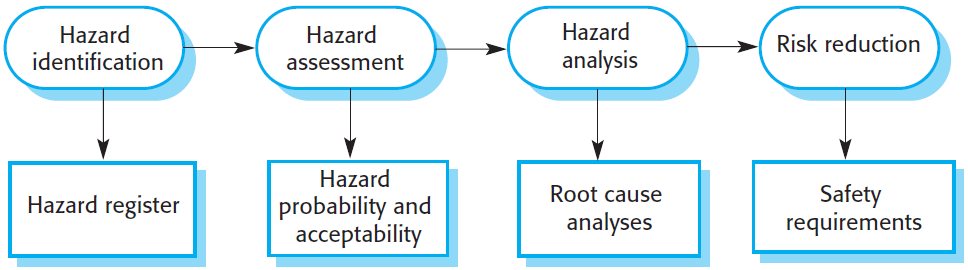
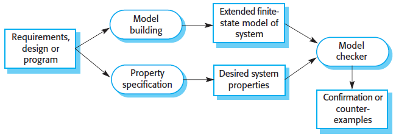

# Safety engineering

**Autor:** Rafael Berger

Zu der Eigenschaft Zuverlässigkeit gehört Sicherheit mit zu den wichtigsten. Damit ein System als sicher eingestuft werden kann, darf es während der Benutzung zu keinen schwerwiegenden Ausfällen kommen. Durch diese Ausfälle dürfen somit keine Menschenleben riskiert werden. Aber auch schlimme Verletzungen von Personen müssen dabei ausgeschlossen werden. Zusätzlich müssen Umweltschäden vermieden werden, da diese ebenfalls schlimme Folgen für die Menschen haben können.  
Es gibt zwei verschiedene Möglichkeiten wie Software in einem sicherheitskritischen System zu betrachten ist:

1. **Softwaregesteuertes System**
   * Die Software hat einen direkten Einfluss auf die Gesamtsicherheit des Systems.
2. **Software zum Überprüfen und Überwachen eines Systems**
   * Die Software wird eingesetzt, um kritische Komponenten eines System zu Überwachen, da der Ausfall dieser Komponenten zu einem erhöhten Risiko führt.

Wenn ein System als zuverlässig eingestuft werden kann, heißt dies nicht automatisch das dies ebenfalls sicher ist. Es gibt vier verschiedene Gründe warum eine zuverlässiges Softwaresystem nicht sicher sein kann:

1. Es gibt keine Garantie, dass ein Softwaresystem fehlerfrei funktioniert.
2. Die Spezifikation ist fehlerhaft und/oder unvollständig, wodurch wichtige kritische Szenarien nicht berücksichtigt wurden.
3. Es können Fehler bei der Hardware entstehen, wodurch diese nicht mehr funktionieren.
4. Bei der Verwendung eines System werden falsche Eingaben getätigt, die zu einen Fehler führen.

Aufgrund dieser genannten Punkte muss ein System nicht nur zuverlässig sein, sondern auch die Sicherheit muss berücksichtigt werden.

## Sicherheitskritische Systeme

Unter einem Sicherheitskritischen System ist zu verstehen, dass das System unter keinen Umständen einem Menschen oder der Umwelt schädigen darf und das unabhängig davon, ob sie sich wie in der Spezifikation definiert verhält oder dies nicht tut. Es gibt zwei unterschiedliche Typen von sicherheitskritische Software:

1. **Primär sicherheitskritische Software**:
   * Hierbei handelt es sich um eine Software, wo ein Fehler dazu führen kann, das die Hardware nicht mehr ordnungsgemäß funktioniert und somit ein Mensch oder die Umwelt verletzt werden kann
2. **Sekundär sicherheitskritische Software**:
   * Bei dieser Art von Software führt ein Fehlverhalten nicht direkt zu einem Problem, sondern es besteht die Möglichkeit das nachfolgende Operationen aufgrunddessen zu einem Fehler führen.

Wichtig hierbei ist die Unterscheidung zwischen einer Gefahr und einen Unfall wichtig. Eine Gefahr ist ein Zustand eines System, wodurch ein Unfall entstehen kann. Somit sind diese beiden Begriffe nicht gleichzusetzen. Das heißt jedoch, dass die Reduzierung einer Gefahr ebenfalls dazu führt, dass die Anzahl an Unfälle reduziert werden. In der folgenden Tabelle sind die verschiedenen Definitionen der einzelnen Begriffe nach Sommerville [1] aufgeführt.

Begriff                    | Definition
---------------------------|-----------
Unfall(Missgeschick)       | Ein ungeplantes Ereignis oder eine Abfolge von Ereignissen, die zu Tod oder Verletzung von Menschen, Sach- oder Umweltschäden führen.
Schaden                    | Ein Maß für den Verlust, der aus einem Missgeschick resultiert. Die Schäden können von vielen Toten durch einen Unfall bis hin zu leichten Verletzungen oder Sachschäden reichen.
Gefahr                     | Ein Zustand, der einen Unfall verursachen oder dazu beitragen kann.
Gefahrenwahrscheinlichkeit | Die Wahrscheinlichkeit des Eintretens von Ereignissen, die eine Gefährdung erzeugen. Wahrscheinlichkeitswerte sind in der Regel willkürlich, reichen aber von „wahrscheinlich“ (z. B. 1/100 Wahrscheinlichkeit, dass eine Gefahr eintritt) bis „unglaubwürdig“ (es sind keine denkbaren Situationen wahrscheinlich, in denen die Gefahr auftreten könnte).
Schweregrad der Gefahr     | Eine Einschätzung des größtmöglichen Schadens, der durch eine bestimmte Gefährdung entstehen könnte. Die Schwere der Gefährdung kann von katastrophal, bei der viele Menschen getötet werden, bis zu gering, bei der nur geringfügige Schäden entstehen, reichen.
Risiko                     | Ein Maß für die Wahrscheinlichkeit, dass das System einen Unfall verursacht. Das Risiko wird bewertet, indem die Gefährdungswahrscheinlichkeit, die Gefährdungsschwere und die Wahrscheinlichkeit, dass die Gefährdung zu einem Unfall führt, berücksichtigt werden.

Bei der Entwicklung von sicherheitskritischen Systemen gibt es eine gefahrengesteuerte Technik, wodurch mögliche Unfälle berücksichtigt werden. Für diese Technik gibt es drei Ansätze:

1. **Vermeidung von Gefahren**:
   * Das System ist so angepasst, dass eine mögliche Gefahr nicht auftreten kann.
2. **Erkennung und Beseitigung von Gefahren**:
   * Das System kann Gefahren frühzeitig erkennen und Maßnahmen einleiten, bevor ein Unfall entsteht.
3. **Schadenbegrenzung**:
   * Das System versucht den Schaden, der ein Fehler verursacht, zu minimieren.

Laut Perrow [2] lassen sich fast alle Unfälle auf die Kombination von Fehlern aus unterschiedlichen Subsystemen zurückführen. Er erklärte, dass es in komplexen Systemen es unmöglich ist alle Kombinationen von Fehler vorherzusehen. Vorallem werden die Systeme immer komplexer, wodurch die Übersicht über die möglichen Fehler immer schwieriger wird. Perrow war der Meinung, dass es "normale Unfälle" gibt, da nicht alle Unfälle zu vermeiden sind und somit diese bei dem Konstruieren von komplexen sicherheitskritischen Systemen als unvermeidlich betrachtet werden müssen.

## Sicherheitsanforderungen

Bei Sicherheitsanforderungen handelt es sich zum einen um funktionale Anforderungen, die zusätzlich im System implementiert werden müssen. Zusätzlich kann es sich um Funktionen handeln, die einen Schutz vor Systemausfällen und Angriffen von außen bieten. Im Gegensatz zu den standardmäßigen funktionalien Anforderungen, die definieren wie das System sich verhalten soll, werden bei den Sicherheitsanforderungen sogenannte "soll nicht" Anforderungen definiert. Dabei handelt es sich um Anforderungen die nicht eintreten dürfen und auch nicht direkt in das System implementiert werden können. Bei dem Prozess der Sicherheitsspezifikation werden vier Schritte durchgeführt.

### Gefährdungsermittlung

In diesem Schritt werden mögliche Gefahren für das System identifiziert und die Ergebnisse in einem Gefahrenkataster dokumentiert. Das Gefahrenkataster ist ein wichtiges Rechtsdokument, welches die sicherheitsrelevanten Entscheidung beinhaltet und im Falle einer auftretenden Gefahr hinbeigezogen werden kann.

### Gefährdungsbeurteilung

Im nächsten Schritt werden die erfassten Gefahren bewertet. Jede Gefahr kann zu eine von drei Risikokategorien zugeordnet werden. Diese Kategorien lauten:

1. **nicht tolerierbar**
   * Darf unter keinen Umständen zu einem Unfall führen.
2. **so gering wie vernünftigerweise praktikabel – ALARP**
   * Dabei handelt es sich um zwei möglichen Risiken:
     1. Risiken mit weniger schwerwiegende Folgen.
     2. Risiken mit schwerwiegende Folgen, die jedoch eine geringere Eintrittswahrscheinlichkeit haben.
  * Insgesamt sollen die Risiken im Hinblick auf Kosten- und Zeitplanbeschräkungen minimiert werden.
3. **akzeptabel**
   * Das auftreten dieser Gefahr führt zu geringen Folgen.
   * Bei dem entwickeln des System soll darauf geachtet werden diese Risiken zu reduzieren, jedoch nicht auf Kosten von Lieferzeit oder anderen wwichtigen funktionalen Anforderungen

Jede mögliche Gefahr wird somit auf die Eintrittswahrscheinlichkeit und der Schweregrad des Risikos eingeschätzt. Das Problem hierbei ist, dass es nicht immer klar definiert werden kann, welches Risiko geringe Folgen hat. Aus diesem Grund muss bei jeder Bewertung einer Gefahr die Eintrittswahrscheinlichkeit, der Schweregrad der Folgen, das geschätzte Risiko und die Annehmbarkeit der Gesellschaft hinzugezogen werden.

### Gefahrenanalyse

Bei der Gefahrenanalyse werden die vielen verschiedenen möglichen Gründe für eine Gefahr untersucht. Das Ziel ist es, herauszufinden unter welchen Umständen eine Gefahr entsteht. Dafür gibt es zwei verschiedene Ansätze:

1. Deduktive Top-down-Technik
   * Es wird eine Gefahr definiert und von dieser aus die möglichen Ursachen gesucht.
2. Induktive Bottom-up-Technik
   * Zuerst wird sich ein möglicher Systemausfall überlegt und die darausfolgende Gefahr bewertet.

Eine am häufigsten verwendete Technik für die Gefahrenanalyse ist die Fehlerbaumanalyse. Dabei handelt es sich um eine Top-down-Technik, die den Vorteil hat, dass keine besonderen Fachkenntnisse für das Verstehen notwendig sind. Zu Beginn wird eine identifizierte Gefahr als Wurzel des Baums genommen. Im Anschluss werden die Systemzustände definiert, die zu dieser Gefahr führen können. Jeder Systemzustand muss nun in weitere Systemzustände unterteilt werden. Zusätzlich müssen diese mit "und"- oder "oder"-Bedingung verknüpft werden, da ein Systemzustand aus der Kombination aus mehreren Systemzustände entstehen kann oder aus einzelnen. Dieser Prozess wiederholt sich solange bis die Grundursache(n) des Risikos erreicht wurde. Das Ziel von dieser Technik ist es, dass die Anzahl der Einzelursachen für Systemfälle minimiert werden. Denn in der Regel sind Unfälle unwahrscheinlicher, falls eine Gefahr nur eine einzige Grundursache hat.

### Risikominderung

Bei der Risikominderung gibt es drei verschiedene Strategien:

1. Vermeidung von Gefahren
   * Das System ist so aufgebaut, dass die Gefahr nicht eintreten kann.
2. Gefahrenerkennung und -beseitigung
   * Das System soll eine Gefahr frühzeitig erkennen und Maßnahmen durchführen, damit diese keine Folgen hat.
3. Schadensbegrenzung
   * Das System kann die Gefahr nicht vermeiden und soll stattdessen die Folgen eines Unfalls reduzieren.

## Sicherheitstechnische Prozesse

Es gibt verschiedene Arten von sicherheitskritischen Systemen. Einige davon müssen reguliert werden. Dafür gibt es sowohl nationale als auch internationale Regulierungsbehörden, die einen umfangreichen Nachweis verlangen, dass das System sicher ist. Dieser Nachweis kann folgendes enthalten:

1. Die Spezifikation des entwickelten Systems und Aufzeichnungen über die Prüfungen dieser Spezifikation.
2. Nachweise über die durchgeführten Verifizierungs- und Validierungsprozesse und die Ergebnisse der Systemverifizierung und -validierung.
3. Nachweis, dass die Organisationen, die das System entwickeln, über definierte und zuverlässige Softwareprozesse verfügen, die Sicherheitsprüfungen beinhalten. Es müssen auch Aufzeichnungen vorliegen, dass diese Prozesse korrekt durchgeführt wurden.

Für die sicherheitskritische Systementwicklung sind agile Prozesse nicht zum empfehlen. Das hat den Grund, dass eine umfangreiche Prozess- und Produktdokumentation notwendig ist. Dadurch kann der Fokus bei agilen Methoden nicht auf die Software liegen.

### Sicherheitsgewährleistungsprozesse

In jeder Phase beim entwickeln einer Software muss gewährleistet werden, dass das System sicher ist. Dafür gibt es eine Reihe von Aktivitäten die das überprüfen. Zusätzlich zu den Tätigkeiten muss die dafür verantwortliche Person dokumentiert werden. Die Dokumentation der zuständigen Person ist wichtig, da zum einen diese verantwortungsvoller mit der Aufgabe umgeht und im Falle von einer rechtlichen Auseinandersetzung, bei einem Unfall, sich verteidigen kann. Bei dem entwickeln von sicherheitskritischen Systemen ist zu beachten, dass häufiger externe Komponenten verwendet werden und diese unter Umständen mit anderen Standards umgesetzt wurden. Daher müssen diese ebenfalls kontrolliert und zertifiziert werden. Somit ist die Prozesssicherung ein wichtiger Bestandteil bei der Entwicklung dieser Systeme. Mit Testen können unter Umstände nicht alle Probleme gefunden werden, die in seltenen Fällen zu einen Unfall führen. Das liegt an den "soll nicht"-Anforderungen, da diese nur schwer mit einem Test zu überprüfen sind. Aus diesem Grund werden Aktivitäten zum gewährleisten der Sicherheit durchgeführt. Darunter zählen:

1. Entwicklung von Gefahrenerfassung- und Überwachungssysteme.
2. Es werden Personen ernannt, die für die Gewährleistung der Sicherheit verantwortlich sind.
3. Häufige Überprüfung der Sicherheit.
4. Detailliertes Konfigurationsmanagement.

### Formale Verifizierung

Formale Methoden dienen hauptsächlich für die mathematische Analyse der Spezifikation. Diese wurden vorallem entwickelt aufgrund des hohen Bedarfes an Zusicherung in sicherheitskritischen Systemen. Denn umfangreiche Systemtests sind sehr kostspielig und decken trotzdem nicht alle Fehler auf. Es gibt mehrere Phasen des V&V-Prozesses, wo formale Methoden eingesetzt werden können. Zum Beispiel wenn eine mathematische Spezifikation des Systems erstellt wird. Dabei kann diese mathematisch auf Konsistenz analysiert werden. Dadurch können Unterschiede zwischen der Spezifikation und der Umsetzung erkannt werden. Formale Methoden haben sowohl Vorteile als auch Nachteile

* Vorteile
  * Aufgrund der Erstellung einer mathematischen Spezifikation muss sich intensiv mit den Anforderungen beschäftigt werden, wodurch die ersten Fehler erkannt werden können.
  * Findet heraus wenn mehrere Systeme auf die gleichen geschützten Ressourcen zugreifen, wodurch ein Deadlock entstehen kann.
* Nachteile
  * Bei der Formulierung müssen spezielle Notationen eingehalten werden, die nicht jeder verstehen kann.
  * Es kann sehr teuer werden, da sowohl die Entwicklung einer Spezifikation als auch der Nachweise für die Spezifikation sehr kostspielig ist.

### Modellprüfung

Die Modellprüfung ist eine Alternative zur formalen Analyse. In der nachfolgenden Abbildung ist der Ablauf dargestellt.

Zu Beginn wird ein Endlicher Automat für das System entwickelt und das Model auf Fehler bei der Verwendung eines weiteren Systems überprüft. Dieses zusätzliche System wird Modellprüfer genannt. Dieser untersucht alle möglichen Pfade durch das Modell und kontrolliert dabei, ob die Eigenschaft für jeden Pfad gilt. Wenn die Eigenschaft korrekt ist, wird dieses durch den Modellprüfer bestätigt. Ansonsten wird die überprüfte und fehlgeschlagene Eigenschaft ausgegeben. Die Modellprüfung kann gut bei kleinen und mittel großen Systemen eingesetzt werden. Denn bei großen Systeme gibt es viele verschiedene Zustände, wodurch die Rechenzeit deutlich erhöht wird.

### Statische Programmanalyse

Bei der statischen Programmanalyse wird der Quelltext überprüft, um mögliche Fehler oder Anomalien zu erkennen. Dabei wird der Code geparst, wodurch verschiedene Arten von Anweisungen und Rückschlüsse auf den Kontrollfluss im Programm möglich ist. Dadurch kann erkannnt werden, ob eine Variable ohne Initialisierung verwendet wird oder der Wert von Daten außerhalb des Gültigkeitbereiches liegt. Wichtig hierbei ist, dass dies lediglich als Ergänzung zu einer Inspektion eingesetzt werden kann und diese nicht vollständig ablöst. Es existieren insgesamt drei Ebenen der statischen Programmanalyse:

1. Charakteristische Fehlerprüfung
   * Dabei werden häufige Fehler aufgedeckt, die von den Programmierern gemacht wurden.
   * Es werden Muster erkannt, die für das Problem üblich sind.
   * Gefundene Fehler werden hervorgehoben.
2. Benutzerdefinierte Fehlerprüfung
   * Dabei werden Fehlermuster einer Programmiersprache definiert, wodurch die erkennbaren Fehlerarten erweitert werden.
   * Der Benutzer legt dabei bestimmte Regeln fest, die im Programm eingehalten werden.
3. Behauptungsprüfung
   * Dabei nehmen die Entwickler formelle Zusicherungen auf, die Beziehungen angeben, die im Programm gelten.

Die statische Programmanalyse hat den Vorteil, dass viele Fehler entdecken werden. Der Nachteil ist jedoch, dass eine hohe Anzahl an falsch positiven Ergebnisse ebenfalls vorliegen. Die Anzahl kann aber durch zusätzliche Behauptungen im Programm reduziert werden. Trotzdem wird häufig diese Methode, vorallem bei der Überprüfung von Pufferüberläufe, eingesetzt. Außerdem ist sie relativ kostengünstig, um Schwachstellen im System zu finden.

## Sicherheitsfälle

### Strukturierte Argumente

### Software-Sicherheitsargumente

## Referenzen

[1]: Ian Sommerville, Software Engineering, 10. Aufl., Kapitel 12 339-372.  
[2]: Perrow, C. 1984. Normal Accidents: Living with High-Risk Technology. New York: Basic Books.
