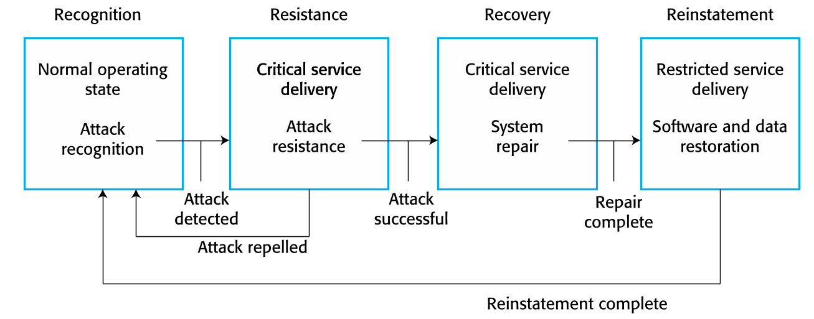
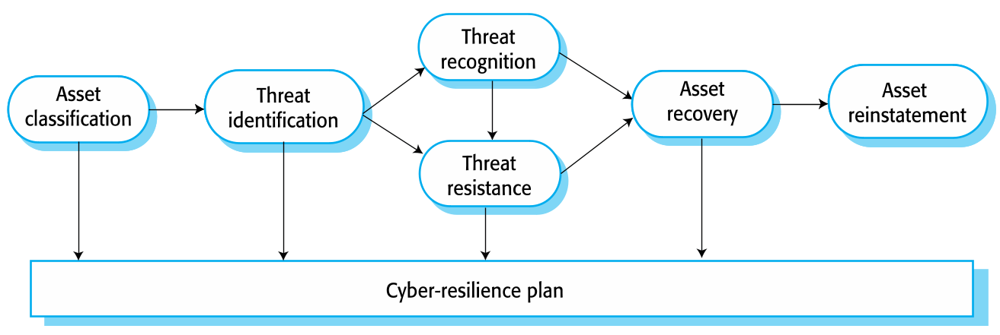
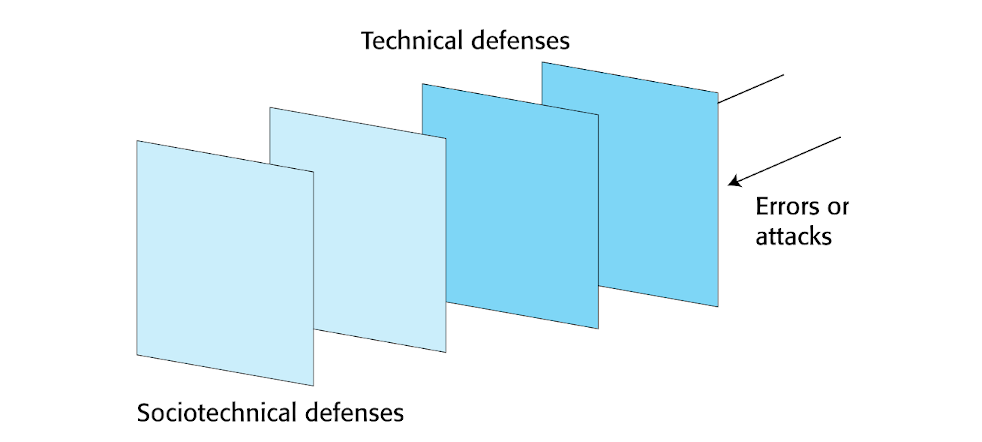
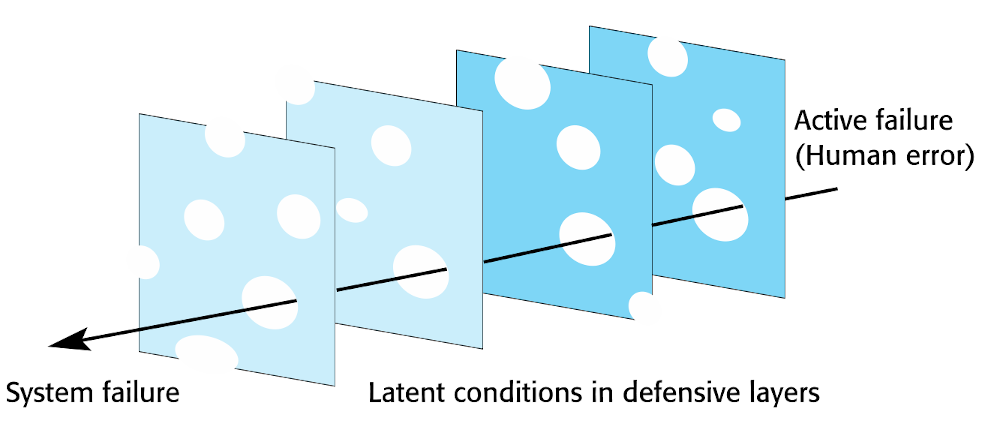
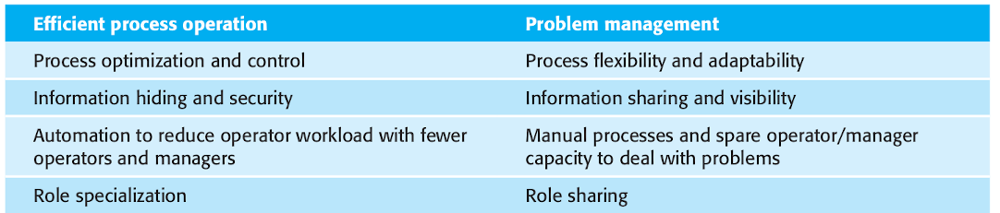
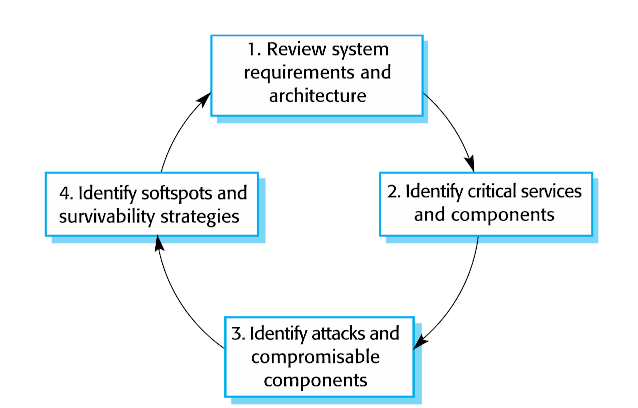
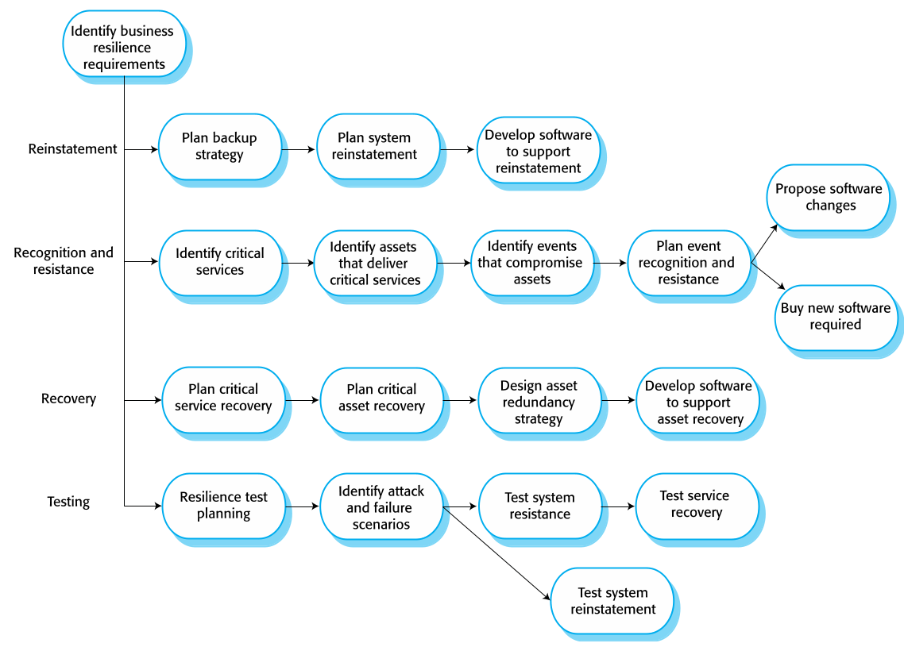

# Resilience Engineering

**Autor:** Paul Schlarmann

Solange nicht anderweitig angegeben, stammen die Informationen und Abbildungen aus dem Buch Software Engineering von Ian Sommerville [1].

## Einführung
In diesem Kapitel wird das Resilience Engineering vorgestellt. Dies wird von Sommerville wie folgt definiert:

> Die "Resilienz" eines Systems ist ein Urteil darüber, wie gut dieses System weiterhin seine kritischen Dienste nach Störfällen wie z.B. Hardwareausfällen oder
Cyberangriffen anbieten kann

Dies ist nicht die übliche Definition, Laprie[2] oder Hollnagel[3] haben eine generellere Definition von Resilienz:

> Ein System ist resilient, wenn es weiter funktioniert, obwohl eine fundamentale Annahme, die während der Auslegung getroffen worden ist, nicht mehr gültig ist

Sommervilles Definition kommt dem tatsächlichen Gebrauch des Wortes Resilienz aber näher und basiert auf folgenden Grundideen:
1. Systeme haben kritische Dienste, deren Ausfall zu schweren menschlichen, gesellschaftlichen oder ökonomischen Schäden führen kann.
2. Es gibt Störfälle, die ein System in seinen Möglichkeiten, kritische Dienste anzubieten, einschränkt.
3. Resilienz ist nicht messbar und es gibt auch keine Metriken dafür. Sie kann nur von Experten bestimmt werden, die ein System und seine zugehörigen Prozesse
untersuchen.

Ursprünglich kommt das Resilience Engineering aus dem Safety-Bereich, wo man sich die Frage gestellt hat, welche Faktoren dafür sorgen, dass Störfälle vermieden
oder überstanden werden. Aufgrund von Cyberangriffen ist das Resilience Engineering aber auch in den Fokus des Security-Bereichs gelangt, wo sich damit 
beschäftigt wird, was getan werden kann, damit ein System nicht ausfällt.

Die Aufgabe von Resilience Engineering ist aber nicht die Fehlervermeidung, sondern die Fehlerbehandlung. Dafür werden folgende Annahmen getroffen:
 - Es ist nicht möglich, alle Ausfälle zu vermeiden. Daher müssen die Kosten dieser Ausfälle minimiert und das betroffene System wieder instand gesetzt werden
 - Es ist bereits im vorhinein das Reliance Engineering angewandt worden, was potentielle technische Fehler des Systems minimiert. Daher liegt der Fokus des
Resilience Engineerings eher auf dem Vermeiden von Systemausfällen durch externen Faktoren wie z.B. Bedienfehler oder Cyberangriffe.

Da es in den letzten Jahren zu vielen Cyberangriffen gekommen ist, sind diese als externe Fehlerquellen deutlich wichtiger als Bedienfehler.

Wenn Resilience Engineering angewendet wird, sollten die kritischen Dienste eines Systems schnell wieder verfügbar sein. Die übrigen Dienste sollen aber auch 
wiederhergestellt werden. Dafür kann folgender Mechanismus verwendet werden:

*Abbildung 1: Wiederherstellungsmechanismus*

1. **Erkennen**: Symptome von Problemen können erkannt werden. Dies geschieht idealerweise, bevor es zu einem Ausfall kommt.
2. **Widerstand leisten**: Wenn Probleme früh erkannt wurden, können Widerstands-Strategien angewendet werden, mit denen die Ausfallwahrscheinlichkeit eines 
Systems verringert werden kann. Eine solche Strategie könnte z.B. das Isolieren der kritischen Teile von dem übrigen System sein. Diese Widerstands-Strategien 
können proaktiv (also bereits im System eingebaut) oder retroaktiv (also erst nach Auftreten eines Problems angewandt) sein.
3. **Wiederherstellen**: Wenn es zu einem Ausfall kommt, müssen die kritischen Dienste des Systems schnell wieder verfügbar sein.
4. **Wiederinstansetzung**: Nachdem die kritischen Dienste wieder verfügbar sind, müssen auch alle anderen Dienste des Systems wiederhergestellt werden.

Die Resilienz ist nicht in ein System einprogrammierbar, ein resilientes System muss flexibel und anpassungsfähig sein: Bediener / Manager müssen Aktionen 
ausführen können, die abnormal sind, um das System zu reparieren.

Eine Kosten-Nutzen-Analyse für das Resilience Engineering ist schwierig, da ein Nutzen erst nach einem eingetretenen Störfall erkennbar ist und die eingesparten
Kosten bei Störfällen wie z.B. Cyberangriffen oft schlecht einzuschätzen sind.

## Cybersecurity
Cybersecurity ist ein breit gefächerter Begriff, der alle Aspekte des Schutzes von Personen, Unternehmen und kritischer Infrastruktur vor Bedrohungen, die durch
den Einsatz von Computern und dem Internet entstehen, einschließt. Die Cybersecurity ist daher ein soziotechnisches Anliegen, da sie nicht nur eine technische, 
sondern auch eine gesellschaftliche Komponente besitzt.

Ausfälle, die durch mangelnde Cybersecurity zustandekommen, werden durch folgende Faktoren begünstigt:
 - Unkenntnis über die Schwere des Problems
 - Schlechtes Design und lasche Umsetzung von Security-Verfahren
 - Sorglosigkeit und Unvorsichtigkeit im Umgang
 - Schlecht getroffene Abwägungen zwischen Nutzbarkeit und Security

Für die Cybersecurity sind daher alle IT-Ressourcen einer Organisation relevant. Diese Ressourcen beinhalten ganze Netzwerke bis zu einzelnen Applikationen. 
Diese sind allerdings meist von externen Quellen organisiert und deren Funktionsweise sowie Komplexität oft schlecht verstanden. Daher kann man nie davon 
ausgehen, dass ein System frei von Security Vulnerabilities und Schwachstellen ist. Cyberangriffe sollten daher eher als eine Frage des wann und nicht wie eine 
Frage des ob behandelt werden. Effektives Resilience Engineering kann dadurch entstehende Verluste aber minimieren.

Für das Planen des Resilience Engineerings sollten folgende Konzepte betrachtet werden:
 - **Ressourcen**: Systeme und Daten, die geschützt werden müssen. Diese können mehr oder weniger wichtig und dementsprechend mehr oder weniger schutzbedürftig
sein.
 - **Bedrohungen**: Umstände, die durch Beschädigen oder Stehlen von Infrastruktur oder Ressourcen Schaden zufügen können.
 - **Angriffe**: Umsetzen einer Bedrohung durch einen Angreifer.

Genauer sind folgende 3 Bedrohungstypen für des Resilience Engineerings relevant:
 - **Vertraulichkeit**: Daten für Person einsehbar, die keinen Zugriff darauf haben sollte
 - **Integrität**: Daten von Person änderbar, die keinen Zugriff darauf haben sollte
 - **Verfügbarkeit**: Ressourcen von Personen, die Zugriff darauf haben sollten, nicht mehr erreichbar

Um Cyberangriffen entgegenzuwirken, können verschiedene Mechanismen wie z.B. Authentifizierung, Verschlüsselung und Firewalls installiert werden. Dabei muss 
allerdings abgewägt werden, wie viel tatsächlich umgesetzt wird: Jeder Mechanismus, der umgesetzt wird, ist zwar eine zusätzliche Schutzschicht, beansprucht aber 
auch mehr Systemressourcen (z.B. Speicher, CPU-Zeit oder Nerven der Nutzer)

Die Grundlage für die Cybersecurity sind, wie für viele Aspekte des Reliance Engineerings, redundante und diversifizierte Ressourcen, wie z.B. Off-Site-Backups,
Mehrfaktor-Authentifizierung und überdimensionieren von kritischen Systemen.

Strategien gegen Cyberangriffe können nach folgenden Modell geplant werden. Das Modell basiert auf dem bereits vorgestellten Mechanismus für die 
Wiederherstellung eines Systems nach einem Ausfall:

*Abbildung 2: Planungsmodell für Strategien gegen Cyberangriffe*

1. **Klassifizieren der Ressourcen**: Welche Ressourcen gibt es und wie kritisch sind diese für den Normalbetrieb?
2. **Identifizieren und Klassifizieren von Bedrohungen**: Welche Bedrohungen gibt es für die einzelnen Ressourcen und welchen Schanden können diese anrichten?
3. **Erkennen von Bedrohungen**: Wie können die gefundenen Bedrohungen erkannt werden?
4. **Widerstand gegen Bedrohungen**: Wie kann gegen die gefundenen Bedrohungen vorgegangen werden?
5. **Wiederherstellen von Ressourcen**: Wie können die kritischen Ressourcen nach einem Angriff wiederhergestellt werden?
6. **Wiederinstandsetzen von Ressourcen**: Wie können die übrigen Ressourcen nach einem Angriff wiederhergestellt werden?

Die Antworten auf diese Fragen können in einem Cyber-Resilience-Plan zusammengestellt werden, der idealerweise ständig aktualisiert wird.

Ein weiterer Punkt für die Cybersecurity ist, wie flexible Reaktionen auf einen Cyberangriff unterstützt werden können. Das wären z.B. das spontane Einschränken 
der Nutzerrechte durch einen Manager, wenn dieser feststellt, dass ein Nutzer zu einer ungewöhnlichen Zeit große Datenmengen kopiert. Das Vorgehen in solchen 
Fällen muss ebenfalls geplant werden. Da solche flexiblen Reaktionen oft gegen die Security gehen, müssen diese entsprechend überwacht und gemanagt werden.

## Sociotechnical resilience
Resilience Engineering ist eher eine soziotechnische statt eine rein technische Aktivität. Resiliente Systeme müssen flexibel und anpassungsfähig sein, was nur 
schwer durch Software abgebildet werden kann - Vor allem, wenn gewisse Zustände oder Aktionen bei der Entwicklung nicht betrachtet worden sind. Menschen kommen 
allerdings gut mit unerwarteten Problemen klar. Für das Design von resilienten Systemen kann nicht alles rein in Software abgedeckt werden, die Menschen müssen ebenfalls mit einbezogen werden.

Laut Hollnagel[4] ist es für Organisationen wichtig, aus Erfolgen und Fehlschlägen beim Resilience Engineering zu lernen. Mit den dabei gewonnen Informationen können die eingesetzten Mechanismen und Verfahren überarbeitet werden, um die Resilienz zu verbessern - Eine Fehlervermeidung im Vorhinein ist immer besser als die Fehlerbehandlung im Nachgang.

Die Resilienz einer Organisation kann anhand von folgenden Charakteristiken bestimmt werden:
1. Fähigkeit zu **Reagieren**: Ändern bzw. Überarbeiten ihrer Mechanismen und Verfahren bei auftretenden Risiken.
2. Fähigkeit zu **Überwachen**: Überwachen ihrer internen Vorgänge und ihrer Umwelt auf Bedrohungen.
3. Fähigkeit zur **Voraussicht**: Voraussehen möglicher zukünftiger Ereignisse und Veränderungen, die ihre Resilienz beeinflussen könnten und darauf reagieren.
4. Fähigkeit zu **Lernen**: Lernen aus gemachten Erfahrungen. 

Resiliente Organisationen müssen alle dieser Charakteristiken besitzen, der Fokus kann dabei allerdings von Organisation zu Organisation unterschiedlich gewählt sein. So liegt der Fokus bei einem Data Center vielleicht eher auf dem Überwachen und Reagieren, während für ein Archiv vielleicht eher die Voraussicht relevant ist.

### Menschliche Fehler
Das Resilience Engineering kommt ursprünglich aus dem Safety-Bereich, daher wurde sich auch damit beschäftigt, wie Systeme auf absichtliches oder versehentliches 
menschliches Fehlverhalten reagieren. Da jeder Mensch Fehler macht muss, solange ein System nicht zu 100 % autonom funktioniert, davon ausgegangen werden, dass 
es zu menschlichen Fehlern kommt. Daher müssen resiliente Systeme so ausgelegt sein, dass sie mit menschlichen Fehler umgehen können (z.B. durch 
Eingabe-Validierung).

Das Schema hierbei ist wieder die Redundanz und die Diversifizierung: Viele Schutzschichten einplanen, die unterschiedliche Schutzmechanismen, sowohl technische
als auch soziotechnische, verwenden:

*Abbildung 3: Schutzschild-Modell*

Das dargestellte Schutzschild-Modell wurde von Reason[5] weiter zu dem sog. Schweizer-Käse-Modell entwickelt. Die Idee dahinter ist, dass die einzelnen 
Schutzschichten nicht alle Fälle abdecken können -> "Die Schutzschichten haben Löcher wie ein Schweizer Käse". Welche Fälle von den einzelnen Schutzschichten 
abgedeckt werden, ist außerdem nicht statisch, sondern verändert sich mit dem Zustand und der Belastung des Systems sowie derer, die in den Schutzschichten 
involviert sind. Im schlimmsten Fall führt dies dazu, dass die Löcher von allen Schichten übereinander liegen und so ein Ausfall des Systems verursacht werden 
kann:

*Abbildung 4: Schweizer-Käse-Modell, in dem Löcher aus allen Schichten übereinander liegen*

Die Wahrscheinlichkeit, dass ein solcher Fall eintritt, kann reduziert bzw. die resilienz des Systems erhöht werden, indem:
 - Die Wahrscheinlichkeit von externen Ereignissen, die einen Ausfall verursachen könnten, reduziert werden,
 - Die Anzahl an Schutzschichten erhöht wird - Wobei hier beachtet werden muss, dass die Schichten möglichst unabhängig voneinander sind, da sie sonst Löcher an
gleichen Stellen hätten,
 - Unterschiedliche Schutzmechanismen eingesetzt werden, und indem
 - Die Anzahl der von den Schutzschichten nicht abgedeckten Fälle reduziert wird.

Bei der Entwicklung eines solchen Systems sollte auf diese Faktoren geachtet werden, aber nicht ohne auch eine Kosten-Nutzen-Analyse der einzelnen Faktoren 
durchzuführen.

### Operational & management processes
Jedes Software-System hat zugehörige operative Prozesse, die durch Annahmen über die Bedienung während der Entwicklung zustande gekommen sind. Operative Prozesse 
sind die Prozesse, die durchgeführt werden müssen, um ein System für seinen Zweck einzusetzen, während Management-Prozesse für den Erhalt und bei auftretenden 
Problemen für die Reparatur des Systems durchgeführt werden. Operative und Management-Prozesse sind dabei auch Schutzmechanismen, die bereits während der 
Entwicklung berücksichtigt werden sollten. Dabei muss eine Abwägung zwischen (Bedien-)effizienz und dem Problemmanagement stattfinden.

Einige Software-Systeme müssen von geschultem Personal bedient werden. Dieses Personal ist ebenfalls Teil der operativen Prozesse. Dabei wird bereits während der 
Entwicklung entschieden, welche Funktionen von der Software selber durchgeführt wird und welche in der Verantwortung des Personals liegt. Die meisten 
Software-Systeme werden allerdings nicht von geschultem Personal, sondern von Nutzern bedient. Das Verhalten der Nutzer ist nicht steuerbar, man kann aber 
erwarten, dass diese den operativen Prozess befolgen.

Bei den Operativen und Management-Prozessen stehen Effizienz und Resilienz oft im Konflikt:

*Tabelle 1: Konflikt von Effizienz und Resilienz*

Um die Resilienz zu erhöhen sollte folgendes befolgt werden:
1. Die Prozessoptimierung sollte nicht zu weit getrieben werden, da dabei oft Möglichkeiten des Problem-Managements verloren gehen. Für dieses ist es nämlich 
meist nötig, außerhalb des definierten Prozesses zu arbeiten, was durch Optimierungen eingeschränkt wird.
2. Informationen sollten für möglichst viele Personen bereitgestellt werden. Wenn Informationen nur eingeschränkt oder gar nicht verfügbar sind, kann es 
passieren, dass Probleme unerkannt bleiben oder für die Problemlösung ein Bild des ganzen fehlt.
3. Das Management nicht zu sehr automatisieren. Automatisierte Management-Systeme können, wenn sie ordentlich funktionieren, das Management erleichtern und auch
die Resilienz erhöhen. Wenn es aber zu Problemen kommt, mit denen das automatisierte System nicht klarkommt, kann es sein, dass weniger Manager zur Lösung des 
Problems bereitstehen.
4. Manager sollten sich nicht zu sehr spezialisieren. Spezialisierung bedeutet zwar, dass der Management-Prozess an sich effizienter wird, da sich die Manager mit
"ihrem" Teil des Systems gut auskennen. Da aber nicht immer jeder verfügbar ist, kann es passieren, dass der zuständige Manager bei einem Problem nicht 
erreichbar ist. Daher sollte eine solche Spezialisierung immer redundant erfolgen, sodass es nicht zu einer solchen Situation kommen kann.

## Resilient systems design

Das Designen von Resilienten Systemen umfasst im Prinzip zwei Aufgaben, zum Einen das Identifizieren kritischer Dienste und Ressourcen und zum Anderen das
Auslegen der Systemkomponenten, sodass mit ihnen der Wiederherstellungsprozess (Erkennen, Widerstand leisten, Wiederherstellen und Wiederinstandsetzen, s.o.) 
durchgeführt werden kann.

Von Ellison et al.[6,7] wurde eine Analyse-Methode dafür designt: Die sog. "Surviveable-Systems"-Analyse:

*Abbildung 5: Modell der "Surviveable-Systems"-Analyse*

In den 4 Stufen der Analyse wird folgendes gemacht:
1. **Systemverständnis**: Ziele, Anforderungen und Architektur des Systems untersuchen.
2. **Identifizieren kritischer Dienste**: Identifizieren von Komponenten und Diensten, die für die Funktion des Systems wichtig sind.
3. **Angriffs-Simulation**: Mögliche Angriffsszenarien und davon betroffene Komponenten und Dienste identifizieren.
4. **"Survivability"-Analyse**: Herausfinden, welche Komponenten und Dienste sowohl kritisch als auch von Angriffen betroffen sind. Entwickeln von Strategien, 
wie diese weniger betroffen sein könnten.

Diese Analyse hat allerdings ein fundamentales Problem: Sie geht davon aus, dass die Anforderungen und Architektur des Systems dokumentiert und verfügbar sind.
Grade im geschäftlichen Umfeld ist dies meist nicht der Fall, oft sollen bestehende Systeme nachträglich resilient gemacht werden für die keine Dokumentation 
mehr vorhanden ist oder ein System wird in einem Agilen Umfeld entwickelt, in dem es vielleicht gar keine festen Anforderungen gibt.

Daher kann für Firmen eine generellere Methode des Resilient systems designs verwendet werden:

*Abbildung 6: Generelles Modell des Resilient systems designs*

Diese umfasst 5 zusammenhängende Arbeitsbereiche:
1. Identifizieren der für die Firma relevanten Anforderungen. Dies basiert auf den Systemen und Diensten, die benötigt werden, um weiterhin operativ zu sein.
2. Die Wiederinstandsetzung für alle Systeme planen. Dabei können bestehende Strategien (wie z.B. Off-Site-Backups) mit eingebunden werden.
3. Identifizieren von möglichen Systemausfällen oder Cyberangriffen. Mit den gewonnenen Erkenntnissen Strategien zur Erkennung und zum Widerstand entwickeln.
4. Planen der schnellen Wiederherstellung von kritischen Systemen und Diensten
5. Testen und Überprüfen des erstellten Resilienz-Plans

Für das Gewährleisten der Verfügbarkeit kritischer Dienste muss folgendes herausgefunden werden:
 - Welche Dienste am wichtigsten für die operativen Prozesse der Firma sind,
 - Was die minimalen Anforderungen an die Verfügbarkeit und Qualität dieser Dienste sind,
 - Durch was die Verfügbarkeit dieser Dienste eingeschränkt werden kann,
 - Wie die Dienste davor geschützt werden können und
 - Wie die Dienste nach einem Ausfall schnell wiederhergestellt werden können.

Dabei müssen auch die (IT-)Ressourcen betrachtet werden, die diese Dienste zur Verfügung stellen.

Die Reaktion auf Ausfälle und Wiederherstellung der Dienste kann dabei durch Verwendung von Software, die diesen Prozess teilweise automatisieren kann,
unterstützt und beschleunigt werden.

Ein System kann beispielsweise durch simulierte Ausfälle oder Cyberangriffe auf resilienz getestet werden. Dabei werden möglicherweise falsche Annahmen in der 
Planung des Systems aufgedeckt und Probleme in der Durchführung der Maßnahmen identifiziert werden. Mit den Ergebnissen der Tests kann die Resilienz-Planung dann 
überarbeitet werden.

## Referenzen

[1]: Ian Sommerville, Software Engineering, 10. Aufl., Kapitel 14 409-434.

[2]: J-C. Laprie, From Dependability to Resilience., 2008

[3]: E. Hollnagel, Resilience—the Challenge of the Unstable., 2006

[4]: E. Hollnagel, RAG—The Resilience Analysis Grid., 2010

[5]: J. Reason, Human Error: Models and Management., 2000

[6]: R. J. Ellison et al., Survivable Network System Analysis: A Case Study., 1999

[7]: R. J. Ellison et al., Foundations of Survivable Systems Engineering, 2002