# Software Reuse 

**Autor:** Tim Lücking

## Einleitung

"Reuse-based" Software Entwicklung ist eine Strategie, innerhalb des 
Entwicklungsprozesses bereits vorhandene Software wieder zu verwenden.
Das Wiederverwenden von Software soll die Produktions- und Wartungskosten
verringern, eine schnellere Lieferung von Systemen und die Erhöhung der 
Qualität ermöglichen.
Open-Source liefert beispielsweise viel wiederverwendbaren Code in Form
von Softwarebibliotheken oder ganzen Applikationen. ERP Systeme können,
für Kunden angepasst werden. Auch die Einführung von Standards, wie 
zum Beispiel Webservice-Standards, ermöglichen ein einfacheres Entwickeln
und Wiederverwenden von Software.

"Reuse-based" Software Entwicklung ist ein Ansatz, das Wiederverwenden von 
existierender Software zu maximieren. Die Softwareeinheiten können
dabei von unterschiedlicher Grösse sein:

1. **System-Wiederverwendung** Komplette Systeme, welche aus einer Anzahl an Applikationsprogrammen bestehen, können als Teil eines Systems bestehend aus Systemen wiederverwendet werden (Kapitel 20)
2. **Applikations-Wiederverwendung** Eine Applikation kann unverändert oder nach Anpassung an Wünschen vom Kunden in einem System wiederverwendet werden. Applikations-Familien oder Applikationen mit gleicher Architektur, welche an individuelle Kunden angepasst sind, können ebenfalls auch zur Entwicklung neurer Systeme verwendet werden. 
3. **Komponenten-Wiederverwendung** Komponenten (von Subsystemen bis hin zu einzelnen Objekten)eines Systems können wiederverwendet werden. Komponenten können dabei in der Cloud oder auf einem privaten Server gehostet werden und eventuell mit Hilfe eines "Application programming interfaces" (API) als Service erreichbar sein.
4. **Objekt- und Funktions-Wiederverwendung** Softwarekomponenten, welche eine einzelne Funktion (zum Beispiel eine mathematische Funktion) oder eine Objektklasse implementieren, können  wiederverwendet werden. Standard Bibliotheken verwenden diese Art der Wiederverwendung. In Bereichen von mathematischen Algorithmen und Grafiken, wird teure Expertise für die Entwicklung effizienter Objekte und Funktionen benötigt. Die Wiederverwendung von Standardbibliotheken ist deshalb besonders kosteneffizient.

Grundsätzlich sind alle Softwaresysteme mit generischer Funktionalität 
wiederverwendbar. Dennoch können diese Systeme oder Komponenten so
spezifisch implementiert sein, sodass ein Verändern für die Wiederverwendung
sehr teuer sein kann. Statt den Programmcode wieder zu verwenden, können
ebenfalls die Ideen, welche der Software zu Grunde liegen, wiederverwendet werden.
Das Konzept wird "Konzept-Wiederverwendung" genannt. Es werden also 
eine Idee, eine Art zu arbeiten oder Algorithmen wiederverwendet. Dieses 
Konzept ist dabei abstrakt ohne Implementierungsdetails aufgeschrieben
und kann so für jedes neues Problem angepasst werden. Die Konzept-Wiederverwendung wird in Design Pattern (Kapitel 7), konfigurierbaren 
Systemen und Programmgeneratoren verkörpert.

Im Folgenden werden die Vorteile der Software-Wiederverwendung dargestellt.

| Vorteil          |     Erklärung       |
|:----------:|:----------------:|
| Schnellere Entwicklung | Ein System so schnell wie moeglich auf den Markt zu bringen ist teils wichtiger als die Entwicklungskosten. Wiederverwerndung von Software kann die Entwicklungszeit beschleunigen. |
| Effektiver Einsatz von Spezialisten  | Statt die gleiche Arbeit immer wieder zu machen, koennen Spezialisten wiederverwendbare Software entwickeln, welche ihr Wissen einfaengt. | 
| Erhöhte Zuverlässigkeit | Wiederverwendete Software, welche bereits in funktionierenden Systemen getestet wurde, sollte zuferlaessiger als neue Systeme sein. Die Design- und Implementierungsfehler sollten bereits gefunden sein. |
| Niedrigere Entwicklungskosten | Entwicklungskosten sind proportional zu der groesse des Softwaresystems. Software wiederzuverwenden bedeutet, dass weniger Programmcode geschrieben werden muss. |
| Reduziertes Prozessrisiko | Die Kosten von existierender Software sind bereits bekannt, waehrend die Kosten der Entwicklung immer geschaetzt sind. Das Wiederverwenden kann so den Fehler in der Projektkosten-Schaetzung verringern. Dies ist gerade dann wahr, wenn grosse Softwarekomponenten wie Subsystem wiederverwendet werden koennen. |
| Einhaltung von Standards | Manche Standards koennen als Sammlung von wiederverwendbare Software implementiert werden. Die Verwendung von Standardbenutzeroberflaechen zum Beispiel verbessert die Zuverlaesslichkeit, weil Benutzer weniger Fehler machen, wenn sie mit vertrauten Oberflaechen konfrontiert werden. |

Folgend werden Nachteile tabellarisch dargestellt.

| Nachteil          |     Erklärung       |
|:----------:|:----------------:|
| Erstellen, Pflegen und Verwenden von Komponentenbibliotheken | Das Befüllen einer wiederverwendbaren Komponentenbibliothek und das Sicherstellen, dass die Software vom Entwickler verwendet werden kann, ist teuer. Entwicklung Prozesse müssen angepasst werden, um sicherzustellen, dass die Bibliothek verwendet wird.  |
| Finden, Verstehen und Anpassung wiederverwendbarer Komponenten  | Softwarekomponenten muessen in Bibliotheken gefunden, verstanden und manchmal an die neue Umgebung angepasst werden. Ingenieure muessen halbwegs zuversichtlich sein, Komponenten in einer Bibliothek zu finden, bevor sie eine Komponentensuche als Teil ihrer Normalität in den Entwicklungsprozess einschließen. | 
| Erhöhte Wartungskosten | Wenn der Quellcode eines wiederverwendbaren Systems oder einer Komponente nicht verfuegbar ist, dann koennen Wartungsarbeiten wegen der Wiederverwendung hoeher sein, weil die wiederverwendbaren Teile des Systems eventuell nach Veraenderung des Systems inkompatibel werden. |
| Fehlende Werkzeugunterstützung | Manche Softwaretools unterstuetzen keine Entwicklung mit Wiederverwendung. Es kann so unmoeglich sein, diese Tools mit einem Bibliothekssystem zu integrieren. Dies ist bei Tools, welche Embedded-System-Entwicklung unterstuetzen, eher der Fall als bei objektorientierten Entwicklungstools. |
| "Nicht-hier-erfunden" | Syndrom Manche Entwickler bevorzugen es Komponenten selber zu entwickeln, da sie der Meinung sind, diese verbessern zu koennen. Dies liegt unter anderem an Vertrauen und teils daran, dass es als herausfordernder angesehen wird, als die Software von anderen Personen wiederzuverwenden. |

## Die Wiederverwendungslandschaft

In den letzten 20 Jahren wurden einige Techniken entwickelt, um die Wiederverwendung
von Software zu ermöglichen. Diese Techniken basieren darauf, dass Software 
in gleichen Anwendungsbereichen ähnlich ist und somit wiederverwendet werden
kann. Es können dabei simple Funktionen oder ganze Applikationen wiederverwendet werden. 
Zusätzlich helfen Standards bei der Wiederverwendung. Im Folgenden 
wird die Wiederverwendungslandschaft dargestellt (verschiedene Arten
der Wiederverwendung) und anschliessend kurz erläutert.

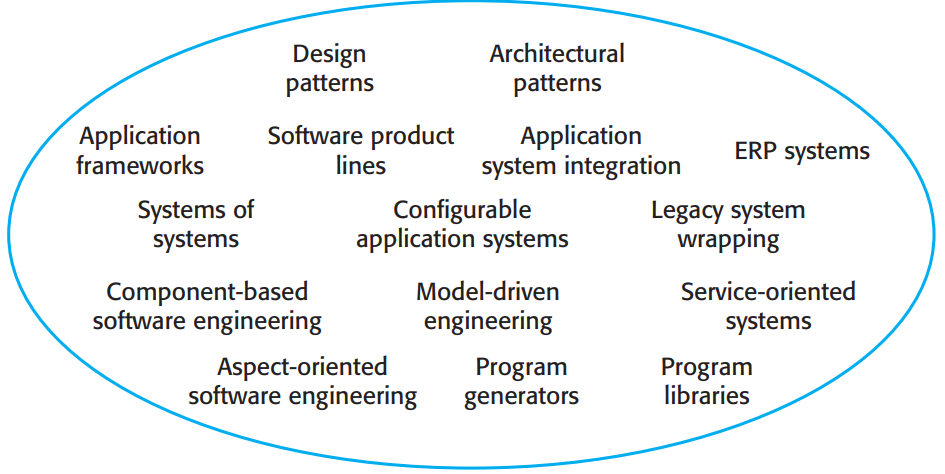

| Ansatz          |    Erklärung       |
|:----------:|:----------------:|
|Anwendungsframeworks | Sammlungen von abstrakten und konkreten Klassen werden angepasst und erweitert um Anwendungssysteme zu erstellen. |
|Integration von Anwendungssystemen | Zwei oder mehr Anwendungssysteme werden integriert, um eine erweiterte Funktionalität bereitzustellen. |
|Architekturmuster | Standardsoftwarearchitekturen, die gängige Arten von Anwendungssystem unterstützen, dienen als Basis von Anwendungen. Siehe Kapitel 6, 11 und 17. |
|Aspektorientierte Software-Entwicklung | Gemeinsame Komponenten werden an verschiedenen Stellen in eine Anwendung eingewobenwenn das Programm kompiliert wird. |
|Komponentenbasierte Softwareentwicklung | Systeme werden entwickelt, indem Komponenten integriert werden (Sammlungen von Objekten), die den Komponentenmodellstandards entsprechen. Siehe Kapitel 16. |
|Konfigurierbare Anwendungssysteme | Domänenspezifische Systeme sind so konzipiert, dass sie auf die Bedürfnisse bestimmter Systemkunden konfiguriert werden können. |
|Design Patterns | Generische Abstraktionen, die anwendungsübergreifend auftreten, werden als Entwurfsmuster dargestellt, welche abstrakte und konkrete Objekte und Interaktionen zeigen. Siehe Kapitel 7. |
|ERP-Systeme | Große Systeme, die generische Geschäftsfunktionen und Regeln kapseln, werden für eine Organisation konfiguriert. |
|Legacy-Systemumhüllung | Legacy-Systeme (Kapitel 9) werden „umhüllt“, indem eine Menge von Interfaces definiert werden. So wird der Zugriff auf diese Legacy-Systeme über beschriebene Interfaces bereitgestellt. |
|Modellgetrieben Entwicklung | Software wird als Domänenmodelle und als implementierungsunabhängige Modelle dargestellt. Aus diesen Modellen wird Code generiert. Siehe Kapitel 5. |
|Programmgeneratoren | Ein Generatorsystem bettet Wissen über eine Art von Anwendung ein und wird verwendet, um Systeme aus diesem Gebiet aus einem vom Benutzer bereitgestelltem Systemmodell zu generieren. |
|Programmbibliotheken | Klassen- und Funktionsbibliotheken, die häufig verwendete Abstraktionen implementieren, stehen zur Wiederverwendung zur Verfügung. |
|Serviceorientierte Systeme | Systeme werden durch die Verknüpfung gemeinsam genutzter Dienste entwickelt, die ggf. extern bereitgestellt werden. Siehe Kapitel 18. |
|Software-Produktlinien | Ein Anwendungstyp wird in einer gemeinsamen Architektur verallgemeinert, sodass dieser für verschiedene Kunden angepasst werden kann. |
|Systeme von Systemen | Zwei oder mehr verteilte Systeme werden integriert, um ein neues System zu erstellen. Siehe Kapitel 20. |

Im Folgenden werden die Hauptfaktoren beschrieben, welche beachtet werden sollten,
wenn die Wiederverwendbarkeit von Softeware geplant ist.

1. **Entwicklungszeitplan der Software** Wenn die Software schnell entwickelt werden soll, bietet es sich an, ganze Systeme statt einzelner Komponenten wieder zu verwenden. Es wird zwar nicht perfekt auf die Anforderungen passen, dennoch wird die Entwicklungszeit stark reduziert.
2. **Erwartete Lebensdauer der Software** Bei einer langen Lebensdauer sollte das Augenmerk auf die Wartbarkeit der Software gelegt werden. Bei solcher Software sollte auf gekaufte Komponenten externer Unternehmen verzichtet werden. Diese können beispielsweise den Support einstellen. Das Verwenden von Open-Source Systemen und Komponenten kann ermöglichen, auf den Quellcode zugreifen zu können und eine Kopie von diesem zu speichern.
3. **Hintergrund, Fähigkeiten und Erfahrung des Entwicklungsteams**  Wiederverwendbare Technologien sind komplex und benötigen Erfahrung in dem jeweiligen Bereich. Wiederverwendbare Technologien sollten dort eingesetzt werden, wo das Entwicklungsteam über Expertise verfügt.
4. **Kritikalität der Software und ihre nicht funktionalen Anforderungen** Für ein kritisches System, welches durch einen externen Regulator zertifiziert werden muss, müssen eventuell Sicherheitsfälle für das System aufgestellt werden (Siehe Kapitel 12). Dies ist schwer, falls der Quellcode nicht komplett einsehbar ist.
5. **Applikationsgebiet** In vielen Applikationsgebieten, wie z.B. in der Herstellung und in medizinischen Informationssystemen, existieren generische Produkte, welche nach Anpassung an lokale Situationen wiederverwendet werden können. Dies ist eine der effektivsten Ansätze der Wiederverwendung von Software. Grundsätzlich ist es meist günstiger Systeme zu kaufen, statt sie selbst neu zu entwickeln.
6. **Platform, auf welcher das System ausgeführt wird** Viele generische Applikationen sind platformabhängig (z.B. .NET). Somit können sie nur auf gleichen Platformen wiederverwendet werden.

Gundsätzlich ist die Wiederverwendung von Software kein technisches Problem, sondern ein Problem des Managements. 
Manager möchten eventuell die Anforderungen nicht so anpassen, dass eine Wiederverwendung möglich ist. Auch wenn die Risiken
einer neu implementierten Software höher sind, bevorzugen manche Manager eher die bekannte Risiken als die Risiken der
Wiederverwendung. Es könnte helfen, ein Wiederverwendungsprogramm aufzubauen, welches sich auf die Erstellung von
wiederverwendbaren Teilen und Prozessen fürs Erleichtern der Wiederverwendung konzentriert (Jacobsen, Griss, and Jonsson 1997).

## Applikations Frameworks

Viele Entwickler sagen, dass der grösste Vorteil von objektkorientierten Programmiersprachen die Wiederverwendung von Objekten in
anderen Systemen sei. Dennoch hat sich herausgestellt, dass die meisten Objekte zu feingranular sind und nur auf eine bestimmte 
Applikation angepasst sind. Meist dauert es länger, vorhanfene Objekte zu verstehen und anzupassen, als diese neu zu implementieren.
Mittlerweile ist klar, dass die objektorientierte Wiederverwendung in einem objektorientierten Entwicklungsprozess am besten durch
grobkörnige Abstraktionen, die Frameworks genannt werden, unterstützt wird.

Ein Framework ist eine generische Struktur welche für ein spezifisches Subsystem oder eine Applikation erweitert werden kann. 
Schmidt et al. (Schmidt et al. 2004) definiert ein Framework als 

"einn integrierten Satz von Softwareartefakten (wie Klassen, Objekte und Komponenten), die
zusammenarbeiten, um eine wiederverwendbare Architektur für eine Familie verwandter Anwendungen bereitzustellen."

Frameworks bieten Support für Features, die sehr wahrscheinlich in Applikationen ähnlicher Art verwendet werden.
Ein User-Interface Framework beispielsweise unterstützt das Event-Handling und beinhaltet einzelne Widgets für das Erstellen
von Anzeigen. Der Entwickler spezialisiert diese Widgets, indem spezifische Funktionalität hinzugefügt wird. So kann 
ein Entwickler ein Layout für ein Display zusammenbauen, welches den Anforderungen der Applikation entspricht.

Frameworks liefern eine skelettartige Architektur und ermöglichen die Wiederverwendung spezifischer Klassen im System. 
Die Architektur wird durch Objektklassen und deren Interaktionen implementiert. Dabei können die Klassen wiederverwendet
oder erweitert werden. Frameworks bedienen sich dabei an Konzepten wie Vererbung und Polymorphie.

Frameworks sind als Ansammlung von konkreten und abstrakten Objektklassen in einer objektorientierten Sprache implementiert.
Aus diesem Grund sind Frameworks spachabhängig. Frameworks sind in OOP-Sprachen wie Java, C++ und dynamischen Sprachen wie 
Ruby und Python verfügbar. Frameworks keonnen selber Frameworks beinhalten. Sie können für komplette Applikationen oder Teile
einer Applikation (z. B. GUI) verwendet werden.

Die meisten Applikationsframeworks sind "Web Application Frameworks" (WAFs). Sie werden zur Erstellung von dynamischen Webseiten
verwendet und basieren dabei meist auf dem "Model-View-Controller (MVC) Pattern" (BILD 15.5). Das Pattern wurde 1980 als Ansatz
von GUI Design dargestellt, welches mehrere Präsentationen von Objekten und verschiedenen Stilen der Interaktion mit diesen
Präsentationen ermöglicht. Grundsätzlich wird der Zustand einer Präsentation seperiert, sodass dieser Zustand von jeder
Präsentation aktualisiert werden kann. Beim Verändern von Daten durch eine Präsentation wird das System Modell verändert und
die Controller für die jeweiligen Anzeigen aktualisiert die Präsentation.

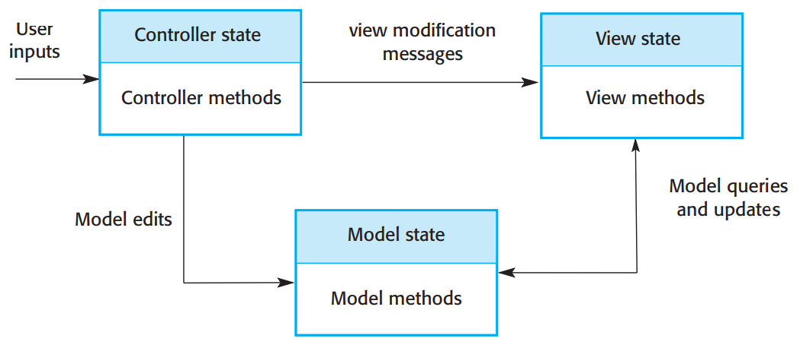

Frameworks verwenden sehr oft Design Pattern (siehe Kapitel 7). MVC-Frameworks verwenden beispielsweise das Observer-Pattern, das 
Strategy-Composite-Pattern und weitere. Pattern werden verwendet um die notwendige Erweitbarkeit von Frameworks zu gewährleisten.
Ohne Programmierpattern wären Frameworks impraktikabel.

Frameworks bieten grundsätzlich verschiedene Funktionalitäten. Web-Applikations Frameworks liefern Komponenten und Klassen, welche
folgendes unterstützen:

1. **Sicherheit** WAFs helfen bei der Authentifizierung von Benutzern und bei der Zugriffskontrolle.
2. **Dynamische Webseiten** Klassen helfen dabei Webseitenvorlagen zu definieren und diese dynamisch mit Daten aus der Datanbanlnk zu füllen.
3. **Datenbankintegration** Frameworks stellen eventuell Klassen zur Verfügung, welche eine abstrakte Schnittstelle zu verschiedenen Datenbanken bereitsellen.
4. **Sitzungsverwaltung** Klassen, welche Sitzungen erstellen und verwalten, sind oft Teil einer WAF.
5. **Benutzerinteraktionen** Web Frameworks liefern Supprt für AJAX (Holdener 2008) und/oder HTML5 (Sarris 2013) zur Erstellung interaktiver Webseiten. Darunter können sich Klassen zur Erstellung geräteunabhängiger Interfaces befinden, welche sich automatisch an Mobiltelefone und Tablets anpassen.

Bei der Systemimplementierung mit Frameworks, müssen konkrete Klassen erstellt werden, welche Operationen von abstrakten Klassen
des Frameworks erben. Zusätzlich müssen so genannte Callback-Funktionen definiert werden, welche aufgerufen werden, wenn ein
Event vom Framework erkannt wird. Die Frameworksobjekte sind dabei für die Kontrolle zuständig, nicht die applikationsspezifischen
Objekte. Dies wird "Inversion of Control" (Schmidt, Gokhale, and Natarajan 2004) genannt.

Als Reaktion auf Events von der Benutzeroberfläche oder von Datenbankframework-Objekten werden so genannte "Hook-Methoden"
aufgerufen. Diese werden mit vom Benutzer bereitgestellter Funktionalität verknüpft. Diese Funktionalität entscheidet,
wie die Applikation bei einem Event reagieren soll. 

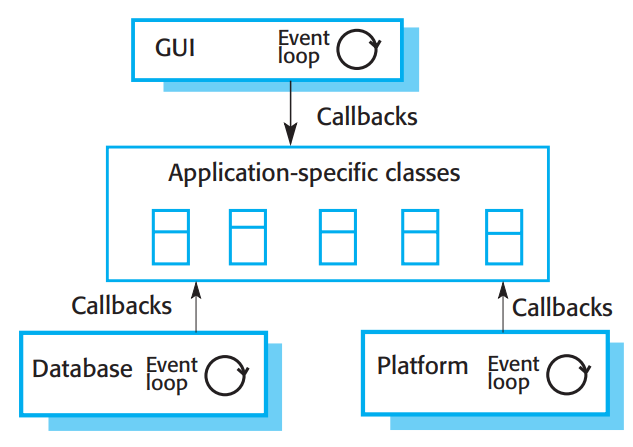

Beispielsweise stellt ein Framework eine Methode zum Handhaben von Mausklicken bereit. Diese Methode ist die "Hook-Methode".
Sie muss konfiguriert werden, um die richtigen Applikationsmethoden aufzurufen, welche das Klicken handhaben.

Fayad und Schmidt (Fayad und Schmidt 1997) diskutieren drei weitere Klassen von Frameworks:

1. **Systeminfrastruktur-Frameworks** unterstützen die Entwicklung von Systeminfrastrukturen wie beispielsweise Kommunikationen, Benutzerschnittstellen und Compiler.

2. **Frameworks für die Middleware-Integration** bestehen aus einer Menge an Standards und damit verbundenen Objektklassen, welche den Kommunikation und den Datenaustausch der Komponenten unterstützt. Beispiele sind Microsoft's .NET und Enterprise Java Beans (EJB)
3. **Frameworks für Unternehmensanwendungen** behandeln konkrete Anwendungensgebiete wie Telekommunikations- und Finanzsysteme (Baumer et al. 1997). Diese beinhalten Wissen über Andwendungsbereiche und unterstützen die Entwicklung von Endbenutzeranwendungen. Heute sind sie nicht verbreitet und wurden weitgehend durch Software-Produktlinien ersetzt.

Applikationen, welche mit Frameworks implementiert sind, können die Basis für weitere Wiederverwendung darstellen. Konzepte wie 
Software-Produktlinien und Applikationsfamilien verwenden unter anderem Frameworks. Sie erleichtern beispielsweise das Verändern
von "Familienmitgliedern" um eine neue Instanz eines Systems zu erstellen.

Frameworks sind sehr effektiv im Bezug auf Wiederverwendung, dennoch gibt es auch einige Nachteile. Der Einbau von Frameworks ist
aufgrund der Komplexität dieser teuer. Oft kann es Monate dauern, die Funktionalität zu erlernen. Es ist ebenfalls schwierig
und teuer, verschiedene Frameworks gegeneinander abzuwiegen, um das Framework zu finden, welches für den Anwendungsfall am
geeignetsten ist. Zusätzlich kann das Debuggen mit Framework schwierig sein, da man nicht zwingend weiss, wie die Frameworkmethoden
untereinander interagieren. Bestimmte Debugging-Tools können dabei jedoch Abhilfe schaffen.

## Software-Produktlinien

Bei ähnlichen, aber nicht gleichen Systemen eines Unternehmens, bietet sich die Wiederverwendung durch Software-Produktlinien an.
Sie werden oft bei Hardware-Kontrollsystemen oder in gebietspezifischen Applikationen in der Logistik oder im medizinischen Feld 
verwendet. Ein Druckerhersteller zum Beispiel kann eine Software-Produktlinie aufbauen. Die Software ist oft sehr ähnlich, aber nie
ganz gleich. Es wird ein Kernprodukt (Produktlinie) erstellt und anschliessend an jeden Druckertypen angepasst.

Software-Produktlinien sind eine Ansammlung von Applikationen mit ähnlicher Architektur und gemeinsamen Komponenten. Jede
Applikation ist dabei für die kundesspezifischen Anforderungen angepasst. Das Kernprodukt (engl.: core product) kann
konfiguriert und so an Kundenwünsche oder bestimmtes Equipment angepasst werden. Dazu können Komponenten konfiguriert, zusätliche
Komponenten entwickelt und einige Komponenten verändert werden.

Durch die Verwendung von Produktlinien kann eine grosse Menge an Applikationscode wiederverwendet werden. Das Testen kann ebenfalls
vereinfacht werden. Test für grosse Teile der Applikation können eventuell wiederverwendet werden. So wird die Entwicklungszeit
reduziert. Zusätzlich erlernen Entwickler das Applikationsgebiet mit der Produktlinie, können sich so spezialisieren und
effizienter neue Applikationen entwickeln.

Meist entstehen Produklinien aus vorhandener Software. Ein Produkt wurde entwickelt und ein ähnliches neues Produkt soll für
einen Kunden erstellt werden. Es können also Teile des ersten Produkts wiederverwendet werden. Bei folgenden ähnlichen Produkten
wird der gleiche Prozess verwendet und ein vorhandenes Produkt teilweise wiederverwendet. Im Laufe der Zeit wird es immer 
schwieriger neue Versionen zu erstellen und es muss entschieden werden, eine Produktlinie aufzubauen. Dazu gehört das 
Feststellen von gemeinsamer Funktionalität und die Entwicklung einer Basisapplikation.

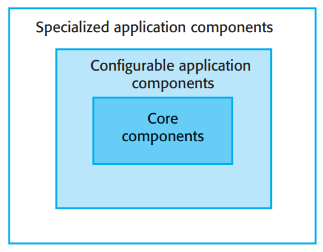

Basisapplikationen sind so entworfen, dass Wiederverwendung und die Neukonfiguration erleichtert werden.
Eine Basisapplikation besteht aus folgenden Teilen:

1. Kernkomponenten, die Infrastrukturunterstützung bieten. Diese werden nicht bei der Erstellung einer neuen Instanz der Produktlinie verändert.
2. Konfigurierbare Komponenten, welche für bestimmte Anforderungen angepasst werden können. Diese Komponenten können teils auch ohne das Verändern von Code mit Hilfe einer Konfigurationssprache angepasst werden.
3. Spezialisierte, gebietspezifische Komponenten werden entweder teils oder komplett bei der Erstellung einer neuen Instanz der Produktlinie ausgetauscht.

Applikations Frameworks und Software Produktlinien haben einiges gemeinsam. Beide unterstützen eine gemeinsame Architektur und Komponenten. Zusätzlich wird neue Entwicklungsaufwand benötigt,
um eine neue Version eines Systems zu erstellen. Die Unterschiede werden im Folgenden dargestellt:

1. Applikations Frameworks bauen auf objektorientierte Features wie Vererbung und Polimorphismus auf, um die Frameworks zu erweitern. Dabei wird der Code des Frameworks nicht verändert und die möglichen Modifizierungen sind limitiert. Software Produktlinien hingegen müssen nicht mit einem objektorientierten Ansatz inplementiert werden. Komponenten können verändert, gelöscht und neu geschrieben werden. 
2. Die meisten Frameworks bieten eine generelle Unterstützung und nicht eine gebietspezifische Unterstützung (z.B. Framework für webbasierte Anwendungen). Eine Software Produktlinie ist in der Regel in einem bestimmten Anwendungsgebiet angesiedelt (z.B. webbasierte Anwendung für das Verwalten von Krankenakten). 
3. Software Produktlinien sind meist Steueranwendungen für bestimmtes Equipment (z.B. Drucker). Das bedeutet, dass Produktlinien Hardwareschnittstellen unterstützen muss. Applikations Frameworks hingegen sind softwareorientiert und besitzen grundsätzlich keine Komponenten zur Kommunikation mit Hardware.
4. Software Produktlinien bestehen aus einer Familie verwandter Anwendungen, die Eigentum von derselben Organisation sind. Wenn eine neue Anwendung erstellt wird, ist der Ausgangspunkt oft das engste Mitglied der Anwendungsfamilie und nicht die generische Kernanwendung.

Bei der Erstellung einer Produktlinie in einer objektorientierten Sprache, kann ein Framework als Basis verwendet werden.
Die Kernanwendung besteht dann aus der Erweiterung des Frameworks mit den gebietspezifischen Komponenten. In der zweiten Phase 
wird anschliessend das System für die verschiedenen Kunden verfeinert. Ein webbasiertes Framework kann beispielsweise als Kern
für eine webbasierte Beratungsstelle verwendet werden. Diese Produktlinie kann dann auf verschiedene Arten von Beratungsstellen
spezialisiert werden.

Die Architektur einer Produktlinie spiegelt oft einen allgemeinen, anwendungsspezifischen Architekturstil oder ein Muster wieder.
Eine Produktlinie könnte zum Beispiel die Fahrzeugaufteilung für Rettungsdienste abwickeln. Die Benutzter des Systems 
müssen Telefonate annehmen, passende Fahrzeuge finden und das passende Fahrzeug zum Vorfall losschicken können. Ein Hersteller
könnte dieses System also an Polizei, Feürwehr und Krankenhäuser verkaufen. Die Fahrzeugaufteilung ist dabei ein gutes Beispiel
für eine allgemeine Ressourcenzuweisungs- und Management-Architektur. 

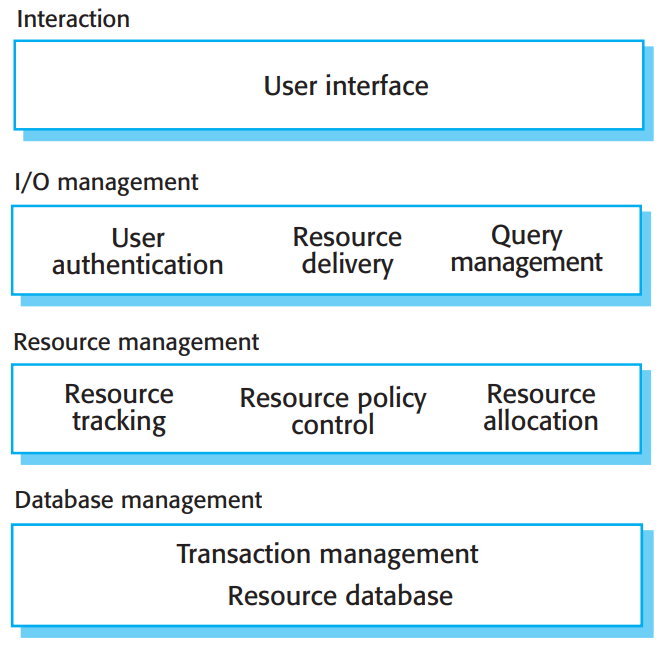

Solche Ressourcenmanagementsysteme verwenden eine Datenbank mit verfügbaren Ressourcen und Komponenten, die die Zuteilungspolitik
der Ressourcen beinhaltet. Diese Zuteilungspolitik wird vom Unternehmen festgelegt. Benutzer interagieren mit dem System, fragen
Ressourcen an, geben Ressourcen frei und können Fragen stellen bezüglich Ressourcen und deren Verfügbarkeit.

Für ein Fahrzeugaufteilungssystem können folgende Komponenten implementiert sein.

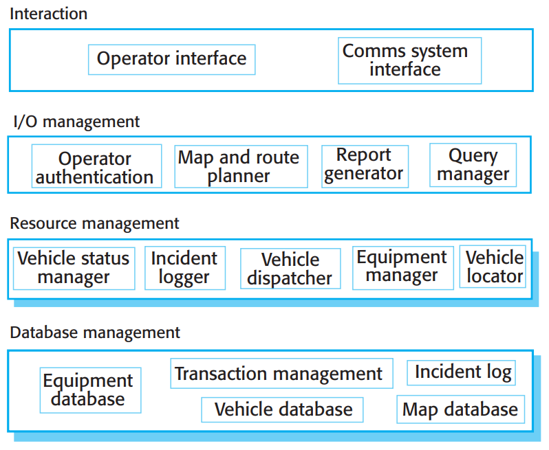

Die Komponenten auf jeder Ebene sind im Folgenden weiter erläutert:

1. Auf der Interaktionsebene stellen Komponenten eine Bedieneranzeigeschnittstelle bereit und eine Schnittstelle zu den verwendeten Kommunikationssystemen.
2. Auf der E/A Ebene (Ebene 2) übernehmen Komponenten die Benutzerautentifizierung, das Generieren von Berichten über Vorfälle und abgefertigte Fahrzeuge. Des Weiteren werden Kartenausgabe und Routenplanung unterstützt, sowie Mechanismes für Operatoren zur Abfrage der Systemdatenbank bereitgestellt.
3. Auf der Ressourcen-Management-Ebene (Ebene 3) ermöglichen Komponenten, Fahrzeuge zu lokalisieren, den Status von Fahrzeugen und Ausrüstung zu aktualisieren und Imformationen zu Vorfällen zu protokollieren.
4. Auf der Datenbankebene gibt es seperate Datenbanken für Fahrzeuge, Ausrüstung und Karten.

Um eine neue Instanz dieses Systems zu erstellen, müssen eventuell Komponenten verändert werden. Die Polizei beispielsweise 
besitzt viele, jedoch wenig verschiedene Autos. Die Feürwehr hingegen besitzt wenige, dafür aber sehr verschiedene und
spezialisierte Fahrzeuge. Eine Anpassung der Datenbankstruktur ist notwendig.

Es können verschiedene Arten der Spezialisierung einer Softwareproduktlinie entwickelt werden:

1. **Platform-Spezialisierung** Versionen der Anwendung können für verschiedene Platformen (z.B. Windows, Mac OS, Linux) existieren. Die Funktionalität bleibt gleich und nur Teile, die eine Schnittstelle mit Hardware oder Betriebssystem darstellen, werden modifiziert.
2. **Umgebungs-Spezialisierung** Versionen der Anwendung können in verschiedenen Betriebsumgebungen mit verschiedenen Peripheriegeräten benötigt werden. Beispielsweise kann ein System für Rettungsdienste in verschiedenen Versionen, abhängig von benutzter Hardware, exisitieren. Polizeistationen kommunizieren eventuell mit eingebaueter Verschlüsslung. Die Produktlinien-Komponenten werden der Funktionalität der verwendeten Ausrüstung angepasst.
3. **Funktionelle Spezialisierung** Versionen der Anwendung sind für verschiedene Kunden mit verschiedenen Anforderungen. Beispielsweise muss ein Bibliothek-Automatisierungs-System angepasst werden, wenn es sich um eine öffentliche Bibliothek oder eine Universiätsbibliothek handelt. Komponenten mit Funktionalität müssen eventuell überarbeitet oder neu geschrieben werden.
4. **Prozess-Spezialisierung** Systeme müssen eventuell mit verschiedenen Business Prozessen funktionieren. Ein Bestellsystem muss zum Beispiel einen zentralen Bestellprozess in einem Unternehmen und einen verteilten Bestellprozess in einem anderen bewältigen.

Das folgende Bild zeigt den Prozess der Erweiterung einer Software Produktlinie zum Erstellen einer neuen Anwendung.

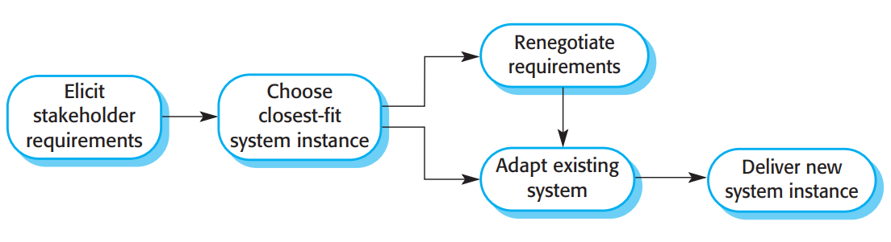

Die Aktivitäten in diesem Prozess sind:

1. **Stakeholder-Anforderungen herausfinden** Es wird mit einer normalen Anforderungsanalyse begonnen. Da ähnliche Systeme bereits vorhanden sind, können diese vorgeführt werden. Der Kunde kann so seine änderungsvorschläge darstellen.
2. **Auswählen eines vorhandenen Systems, das den Anforderungen am besten entspricht** Die Anforderungen werden analysiert und ein Produktlinien-Mitglied, welches am nähsten an die neuen Anforderungen herankommt, zur Modifikation ausgewählt.
3. **Anforderungen neu verhandeln** Während der Projektplanung werden die zu modifizierten Stellen der Software erarbeitet. Um die nötigen Veränderungen der Basisanwendung zu minimieren, müssen manche Anforderungen mit dem Kunden erneut verhandelt werden.
4. **Bestehendes System anpassen** Neue Module für das existierende System werden entwickelt und vorhandene Module werden den Anforderungen entsprechen angepasst.
5. **Ausliefern des neuen Produktlinien-Mitglied** Die neue Instanz wird dem Kunden ausgeliefert. Hier sollten die wichtigsten Funktionen dokumentiert werden, damit das neue System als Basis für weitere Entwicklungen dienen kann.

Bei der Erstellung neuer Mitglieder einer Produklinie, muss eventuell ein Kompromiss zwischen Wiederverwenden und den Anforderungen
des Kunden gefunden werden. Je detaillierter die Anforderungen, desto geringer ist die Wahrscheinlichkeit, dass ähnliche Systeme
bereits existieren. Wenn ein Kunde jedoch flexibel sein kann und die Systemmodifizierungen die benötigt sind limitiert, können
Systeme schneller und günstiger ausgeliefert werden.

Software-Produktlinien sind zum Rekonfigurieren entwickelt. Komponenten können hinzugefügt oder gelöscht, Parameter angepasst,
Einschränkungen definiert und Wissen über Geschäftsprozesse eingebaut werden. Die Konfiguration kann in verschiedenen 
Stufen des Entwicklungsprozesses stattfinden:

1. **Konfiguration zur Entwurfszeit** Die Organisation, die die Software entwickelt, modifiziert einen gemeinsamen Produktlinienkern durch Entwicklung, Auswahl oder Anpassung von Komponenten, um ein neues System für einen Kunden zu erstellen.
2. **Konfiguration zur Auslieferungszeit** Ein generisches System wird für die Konfiguration durch den Kunden entworfen. Kenntnisse der kundenspezifischen Anforderungen und der Betriebsumgebung des Systems sind in die vom generischen System verwendeten Konfigurationsdaten eingebettet.

Wenn ein System zur Entwurfszeit konfiguriert wird, startet der Hersteller mit einem generischen oder einem vorhandenem System.
Das System wird so modifiziert und angepasst, dass die Kundenwünsche erfüllt werden. Meist bedeutet dies, dass der Programmcode 
verändert und erweitert werden muss. Dies bietet eine höhere Flexibilität als bei der Konfiguration zur Auslieferungszeit.
Die Konfiguration zur Entwurfszeit wird verwendet, wenn es nicht möglich ist, die bestehenden Konfigurationseinrichtungen zu
verwenden. über längere Zeit werden Produktlinienmitglieder mit gleicher Funktionalität erstellt. Man kann entscheiden,
ob die Kernanwendung diese Funktionalität eingebaut bekommen soll. Anschliessend kann man die Funktionalität zur 
Auslieferungszeit konfigurierbar machen.
Bei der Konfiguration eines Systems zur Auslieferungszeit werden Konfigurationstools verwendet, um eine spezifische 
Systemkonfiguration zu erhalten. Diese Konfiguration wird in einer Datenbank oder als Ansammlung von Konfigurationsdateien 
gespeichert. Das System holt sich die Informationen aus der Datenbank.

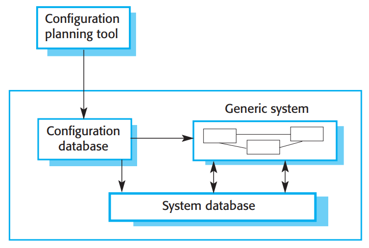

Mehrere Ebenen der Konfiguration zur Auslieferungszeit werden in einem System bereitgestellt:

1. **Komponentenauswahl**, in welcher passende Module für das System ausgesucht werden. Beispielsweise kann in einem System für die Speicherung von Patientendaten eine Komponente für das Verwalten von Bildern hinzugefügt werden. So können medizinische Bilder mit der Patientenakte verknüpft werden.
2. **Workflow- und Regeldefinition**, in welcher Workflows (wie Informationen verarbeitet werden) und Validierungsregeln (für Benutzereingaben und vom System generierte Daten) definiert werden.
3. **Parameterdefinition**, in welcher bestimmte Werte für systemspezifische Parameter spezifiziert werden. Zum Beispiel kann die maximale Länge von Eingabefeldern oder die Characteristiken bestimmter Hardware definiert werden.

Die Konfiguration zur Auslieferungszeit kann sehr komplex sein. Bei grossen Systemen kann es mehrere Monate dauern, das System
zu konfigurieren und zu testen. Grosse konfigurierbare Systeme können den Konfigurationsprozess mit Software-Tools, wie zum
Beispiel Planungstools, unterstützen.

## Applikationssysteme

Applikationssysteme sind Softewaresysteme, welche an die Anforderungen des Kunden angepasst werden können, ohne den Programmcode
ändern zu müssen. Sie werden für einen generellen Markt und nicht speziell für einzelne Kunden entwickelt. Sie werden auch
"Commercial Off-the Shelf Systeme" (COTS). Da der Begriff meist in Militärsystemen verwendet wird, werden sie im Folgenden
weiterhing Applikationsysteme genannt.

Jede Desktop-Software für Unternehmen und viele serverbasierte Systeme sind Applikationssysteme. Sie können in verschiedenen
Umgebungen und als Teil verschiedener Systeme wiederverwendet werden. Torchiano and Morisio (Torchiano and Morisio 2004) fanden
heraus, dass viele Open-Source Produkte ohne Veränderung verwendet werden und oft der Programmcode nicht mal angesehen wird.

Applikationssysteme besitzen eingebaute Konfigurationsmechanismen, um die Funktionalität des Systems den Kundenwünschen 
entsprechend anzupassen. Ein Krankenaktensystem benötigt zum Beispiel verschiedene Eingabe- und Ausgabeformen abhängig vom
Patienten. Andere Konfigurationsfeatures erlauben eventuell Plugins zum Erweitern der Funktionalität.

Dieser Ansatz zur Wiederverwendung von Software wird seit Ende der 1990er Jahre von großen Unternehmen sehr häufig übernommen, da er erhebliche Vorteile gegenüber der kundenspezifischen Softwareentwicklung bietet:

1. Schnellere Herausbringen von zuverlässigen Systemen ist möglich.
2. Es ist möglich zu sehen, welche Funktionalität von der Applikation gegeben ist. Das Einschätzen ob die Software passt wird vereinfacht. Andere Unternehmen verwenden eventuell besagte Software und Erfahrungen mit dem System liegen vor.
3. Manche Entwicklungsrisiken beim Verwenden vorhandener Software minimiert.
4. Unternehmen können sich auf Kernaktivitäten konzentrieren, ohne viele Ressourcen für die Entwicklung von IT Systemen zu benötigen.
5. Wenn sich Opeationsplatformen verändern ist das updaten vereinfacht, da die Verantwortung dafür bei dem Applikationssystem-Anbieter liegt.

Dennoch bringt dieser Ansatz der Wiederverwendung Probleme:

1. Anforderungen müssen angepasst werden, um die Funktionalität und die Arbeitsweise der Off-the-shelf Applikationssystem zu reflektieren. Das kann zu störenden änderungen in vorhandenen Unternehmensprozessen führen.
2. Das Applikationssystem kann auf Annahmen basieren, welche nicht geändert werden können. Der Kunde muss also sein Geschäft so ändern, um diese Annahmen zu reflektieren.
3. Das passende Applikationssytem auszusuchen kann ein schwieriger Prozess sein, da diese oft nicht gut dokumentiert sind. Bei falschen Entscheidungen kann es unmöglich sein, das neue System nach den Anforderungen umzusetzen.
4. Es kann einen Mangel an lokaler Expertise zur Systementwicklung geben. Der Kunde muss sich also auf den Hersteller des Applikationssystems oder auf externe Berater verlassen. Die Beratung kann dabei zum Verkaufen von weiteren Produkten oder Dienstleistungen verwendet werden, ohne passend auf die Kundenbedürfnisse einzugehen.
5. Der Systemanbieter steuert die Systemunterstützung und -entwicklung. Dieser kann sein Geschäft aufgeben, übernommen werden, oder änderungen vornehmen, die dem Kunden Schwierigkeiten bereiten.

Applikationssysteme können als individuelle Systeme oder als Kombination, in welcher zwei oder mehr Systeme integriert werden, 
verwendet werden. Individuelle Systeme bestehen aus einer generischen Applikation eines Herstellers und werden für die 
Anforderungen eines Kunden konfiguriert. Integrierte Systeme werden aus der Funktionalität mehrerer individuellen Systeme 
zusammengesetzt. Diese Systeme sind oft von verschiedenen Herstellern. In folgender Tabelle werden die beiden dargestellt.

| Konfigurierbare Applikationssysteme          | Integrierte Applikationssysteme       |
|:----------:|:----------:|
|Einzelnes Produkt, welches die gewünschte Funktionalität liefert | Mehrere verschiedene Applikationssysteme welche integriert werden, um eine angepasst Funktionalität zu liefern|
|Basierend auf einer generischen Lösung und standardisierten Prozessen | Flexible Lösungen können für Kundenprozesse entwickelt werden|
|Der Entwicklungsfokus liegt auf der Systemkonfiguration | Der Entwicklungsfokus liegt auf der Systemintegration|
|Der Systemanbieter ist für die Wartung verantwortlich | Der Systembesitzer ist für die Wartung verantwortlich|
|Der Systemanbieter stellt die Plattform für das System bereit | Der Systembesitzer stellt die Plattform für das System bereit|

### Konfigurierbare Applikationssysteme

Konfigurierbare Applikationssysteme sind genereische Applikationssysteme, welche für bestimmte Unternehmenstypen,
Unternehmensaktivitäten oder manchmal für einen ganzen Wirtschaftsbetrieb konstruiert werden. Ein System für Zahnärzte kann 
zum Beispiel Termine, Erinnerungen, Patientenakten, Patientenrückrufe und Rechnungen handhaben. In grösserem Umfang kann
ein Enterprise Resource Planning (ERP) System die Herstellung, den Einlauf und das Kundenbeziehungsmanagement in grossen 
Unternehmen unterstützen.

Gebietspezifische Applikationssysteme liefern Funktionalität, die von einer Vielzahl an Kunden benötigt wird. Dennoch werden
ebenfalls Annahmen getroffen, welche in bestimmten Situationen Probleme bereiten können. Ein System zum Einschreiben von 
Studenten an einer Universität beispielsweise bedient sich der Annahme, dass Studenten sich für einen Abschluss an einer 
Universität einschreiben können. Bei einer Kollaberatiion zweier Universitäten werden gemeinsame Abschlüsse angeboten, und
können so im System nicht dargestellt werden.

ERP-Systeme (beispielsweise produziert von SAP oder Oracle) sind grosse intergrierte Systeme zum unterstützen von Bestellungen, 
Rechnungsstellung, Bestandsverwaltung und Fertigungsplanung (Monk and Wagner 2013). Im Konfigurationsprozess dieser Systeme müssen
detailierte Informationen über das Unternehmen des Kunden und deren Unternehmensprozesse gesammelt und anschliessend in einer 
Kofigurationsdatenbank gespeichert werden. Dabei ist eine Expertise über die Konfigurationsnotation und -tools notwendig. Meist
wird der Prozess der Konfigurierung von Beratern, die mit dem Systemkunden zusammenarbeiten ausgefürht.

Generische ERP-Systeme bestehen aus mehreren Modulen. Im Konfigurationsprozess müssen die Module ausgewählt und konfiguriert,
Unternehmensprozesse und -regeln definiert und die Struktur und Organisierung der Systemdatenbank beschlossen werden. Das folgende
Bild zeigt die Architektur eines ERP-Systems.

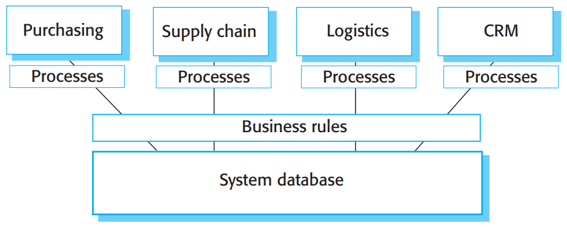
  
Die Hauptmerkmale dieser Architektur sind wie folgt:

1. Eine Menge von Modulen, um verschieden Unternehmensfunktionen zu unterstützen. Diese sind grosse Module, die ganze Abteilungen oder Unternehmenbereiche unterstützen können. Dargestellt ist ein Modul zum Unterstützen des Einkaufs; ein Modul für das Lieferketten Management; ein Logistikmodul für die Lieferung von Waren; und ein Kundenbeziehungsmanagement (engl.: customer relationship management (CRM)).
2. Eine definierte Menge an Unternehmensprozess-Modellen, jedem Modul zugeordnet, welche sich auf die Aktivitäten in diesem Modul beziehen. Zum Beispiel wird im Bestellungsprozess-Modell festegelegt, wie Bestellungen erstellt und angenommen werden. Dies spezifiziert die Rollen und Aktivitäten im Zusammenhang mit der Auftragserstellung.
3. Eine gemeinsame Datenbank, welche Informationen über die Unternehmensfunktionen pflegt. So ist es nicht notwendig Informationen, wie zum Beispiel Kundendaten, an verschiedenen Orten des Unternehmens zu speichern.
4. Eine Menge an Unternehmensregeln, die für alle Daten in der Datenbank gelten. Bei der Eingabe von Daten, müssen die Regeln eine Konsistenz innerhalb der Datenbank erhalten. Beispielsweise kann eine Geschäftsregel verlangen, dass alle Spesenabrechnungen von einer ranglich höheren Person genehmigt werden müssen als die Person, die den Anspruch geltend macht.

ERP-Systeme werden in allen grossen Unternehmen für einige oder alle ihrer Funktionen verwendet. Sie stellen so eine viel
benutzte Form der Wiederverwendung dar. Eine Limitierung ist es, dass die Funktionalität des Systems des Kunden an die
Funktionalität des ERP-Systems gebunden ist. Falls eine weitere Funktionalität benötigt wird, muss ein seperates 
Addon implementiert und eingebaut werden.

Unternehmensprozesse und -operationen müssen in der ERP-System eigenen Konfigurationssprache definiert werden. Bei der
Erstellung können Nichtübereinstimmungen zwischen den Annahmen des Systemanbieters und dem Kunden entstehen bezüglich
der Konzepte und Prozesse im Unternehmen entstehen. Eine grosse Abweichung fürt dazu, dass das ERP-System nicht den
Anforderunged des Kunden entspricht.

ERP Systeme benötigen grundsätzlich eine umfangreiche Konfiguration, um an die Anforderungen des Kunden angepasst zu werden. Diese Konfiguration enthealt:

1. Auswahl der benötigten Funktionaliät aus dem System, z. B. durch das Entscheiden, welche Module enthalten sein sollen.
2. Erstellen eines Datenmodells, das definiert, wie die Daten der Organisation in der Systemdatenbank strukturiert werden.
3. Definieren von Geschäftsregeln, die für diese Daten gelten.
4. Definition der erwarteten Interaktionen mit externen Systemen.
5. Gestaltung der Eingabeformulare und der vom System generierten Ausgabeberichte.
6. Entwerfen neuer Geschäftsprozesse, die dem zugrunde liegenden Prozessmodell, welches vom System unterstützt wird, entsprechen.
7. Festlegen von Parametern, die definieren, wie das System auf seiner Plattform bereitgestellt wird.

Nach der Konfiguration, kann das System getestet werden. Das Testen eines Systems, welches konfiguriert und nicht in einer konventionellen Programmiersprache entwickelt wird, stellt ein Problem dar. Es gibt zwei Gründe hierfür:

1. Testautomatisierung ist schwierig oder sogar unmöglich. Möglicherweise gibt es keinen einfachen Zugang zu einer API, die zum Testen von Frameworks wie JUnit verwendet werden kann. Die Systeme müssen per Hand getestet werden, indem manuell Testdaten eingefügt werden. Desweiteren sind die Systeme informell spezifiziert. Testfälle ohne die Hilfe vom Endbenutzer zu definieren, erweist sich als schwierig.
2. Systemfehler sind oft subtil und spezifisch für Geschäftsprozesse. Die meisten Fehler passieren, weil es Missverständnisse zwischen denen, die das System konfigurieren, und den Benutzerinteressenten gibt. Systemtester, ohne detailierte Kenntnisse der Endbenutzerprozesse können solche Fehler nicht erkennen.

### Integrierte Applikationssysteme

Integrierte Applikationssysteme beinhalten zwei oder mehr Applikationssysteme oder manchmal auch Legacy-Systeme.
Der Ansatz wird verwendet, wenn kein einzelnes Applikationssystem allen Anforderungen entspricht oder wenn ein neues
Applikationssystem mit eine System, welche bereits verwendet wird, integriert werden soll. Die Interaktion zwischen den Systemen
ist durch APIs oder durch Serviceschnittstellen möglich. Alternativ kann die Ausgabe des einen Systems mit der Eingabe des
anderen Systems verknüpft oder die Datenbank, welche von den Applikatiionen verwendet wird, angepasst werden.

Um ein integriertes Applikationssystem zu entwickeln, müssen eine Menge an Designentscheidungen getroffen werden:

1. **Welche individuelle Applikation liefert die am besten geeignete Funktion?** Grundsätzlich gibt es mehrere verfügbare Produkte, welche in verschiedenen Wegen verknüpft werden können. Liegt nicht viel Erfahrung mit einem Applikationssystem vor, so kann es schwierig sein, sich für ein Produkt zu entscheiden.
2. **wie werden Daten ausgetauscht?** Verschiedene Systeme benutzen eigene Strukturen und Datenttypen. Eventuell müssen Adapter implementiert werden, um zwischen den Repräsentationen konvertieren zu können. 
3. **Welche Features werden vom Produkt letzendlich verwendet?** Applikationssysteme liefern eventuell mehr Funktionalität als benötigt wird. Es muss entschieden werden, welches Feature aus welchem Produkt sich am besten für die Anforderungen anbietet. Falls möglich, sollten nicht benötigte Features ebenfalls deaktiviert werden, um den Normalsystembetrieb nicht zu stören.

Das folgende Beispiel zeigt die integrierung von Systemen. Ein grosses Unternehmen möchte ein Beschaffungssystem einbauen,
welches den Angestellten das Bestellen von ihrem Schreibtisch aus ermöglicht. Es wird sich dabei eine jährliche Einsparung von
5 Millionen Dollar erhofft. Durch das Zentralisieren des Einkaufs kann garantiert werden, dass immer bei Lieferanten bestellt wird,
die die besten Preise anbieten. Zusätzlich sollte die notwendige Administration bei dem Bestellungsvorgang reduziert werden.

Das aktuelle manuelle System besteht daraus, die verfügbare Ware auszuwählen, die Bestellung zu erstellen, diese genehmigen zu
lassen, die Bestellung dem Händler zu schicken, die Ware zu erhalten und anschliessend die Bestätigung, dass eine Zahlung 
erfolgen soll, zu geben.

Das Unternehmen hat ein altes Bestellsystem, welches von einer zentralen Beschaffung verwendet wird. Diese
Auftragsabwicklungssoftware ist in die existierenden Rechnungsstellen- und Liefersysteme eingebaut. Für das neue System, wird
das alte System in eine webbasierte E-Commerce-Platform und ein E-Mail-System, welches die Kommunikation mit den Benutzern
abwickelt, eingebaut. Die Struktur wird in folgender Abbildung dargestellt. 

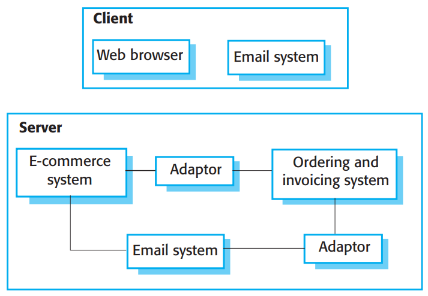

Durch das Integrieren von existierenden Applikationssystemen können Monate oder sogar Jahre Entwicklungszeit eingespart werden.
Das System aus dem Beispiel wurde in neun Monaten eingeführt, wobei vorher geschätzt wurde, dass es drei Jahre dauer könnte,
ein eigenes System zu entwickeln, welches mit dem alten System verknüpft werden kann.

Die Applikationssytem-Integration kann mit einem serviceorientierten Ansatz vereinfacht werden. Dies bedeutet, dass der 
Zugriff auf Funktionalität des Applikationssystems durch Anbieten von Standard-Serviceschnittstellen ermöglicht wird. Für 
jede diskrete Einheit der Funktionalität wird ein Service erstellt. Dazu kann ein Wrapper implementiert werden, die die
Applikation versteckt, aber extern sichtbare Services anbietet. Dies kann sehr gut bei alte Systemen gemacht werden, welche in
ein neues System integriert werden soll.

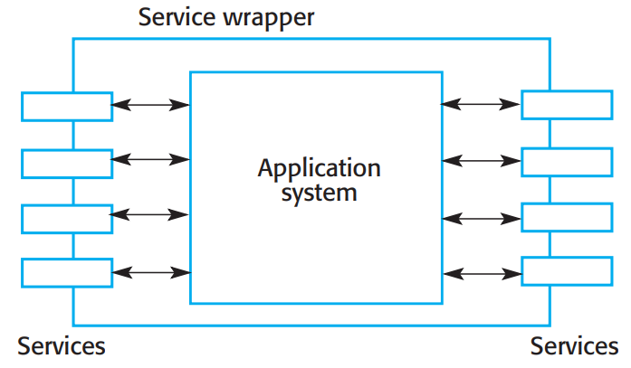

Das Integieren von Applikationssytemen ist das gleiche wie das Integrieren jeder anderer Komponente auch. Es muss die 
Systemschnittstelle, über die kommuniziert wird, verstanden werden. Es müssen Anforderungen gegen eine schnelle Entwicklung
und Wiederverwendung abgewogen werden. Und es muss eine Systemarchitektur entworfen werden, welche es ermöglicht, dass die 
Applikationssysteme miteinander arbeiten können.

Die Tatsache, dass diese Produkte in der Regel eigenständige große Systeme sind und
oft als separate eigenständige Systeme verkauft werden, bringt zusätzliche Probleme mit sich. Böhm
und Abts (Böhm und Abts 1999) heben vier wichtige Systemintegrationsprobleme hervor:

1. **Mangelnde Kontrolle über Funktionalität und Leistung** Auch wenn eine Schnittstelle eines Produkts vielversprechend aussieht, weiss man nicht, ob das System nicht vielleicht schlecht implementiert ist, oder schlecht abschneidet. Das Produkt hat eventuell versteckte Operationen, welche bei der Benutzung in bestimmten Situationen stören können. Diese Probleme zu beheben kann sehr wichtig für den Systemintegrator sein, jedoch von weniger Bedeutung für den Systemanbieter selbst. Benutzer müssen so eventuell Problemungehungen finden, wenn das System wiederverwendet werden soll.
2. **Probleme mit der Systeminteroperabilität** Es ist schwierig individuelle Systeme miteinander arbeiten zu lassen, da in beiden Systemen Annahmen getroffen wurden, wie diese verwendet werden. Garlan et al. (Garlan, Allen, and Ockerbloom 1995), berichtet von einer Integration von vier Systemen. Drei Systeme waren eventbasiert, benutzten jedoch verschiedene Modelle von Events. Die Integration dauerte zwei Jahre statt die geschätzten sechs Monate. Torchiano and Morisio (Torchiano and Morisio 2004) fanden heraus, dass das Nichteinhalten von Standards die Integrierung erschwert.
3. **No control over system evolution** Systemanbieter können alleine über änderungen des Systems entscheiden. Bei PC Produkten heisst dies, dass oft neue Versionen veröffentlicht werden, welche eventuell nicht mit alten Versionen kompatibel sind. Neue Versionen haben eventuell neue ungewollte Funktionalitäten und alte Versionen können nicht mehr verfügbar und unterstützt werden.
4. **Unterstützung durch Systemanbieter** Anbieter bieten ganz unterschiedlich viel Support für ihre Produkte. Wenn Probleme auftreten ist die Unterstützung durch den Systemanbieter notwendig, da Kunden keinen Zugriff auf Programmcode oder detaillierte Dokumentation haben. Der sich verändernde Markt und ekonomische Umstände können dazu führen, dass der Systemanbieter nicht die Unterstützung liefern kann, die der Kunde benötigt. Ein Produkt kann zum Beispiel aus dem Sortiment genommen werden, weil es nur eine begrenzte Nachfrage generiert.

Böhm and Abts vermuten, dass die Kosten für die Systemwartung und -weiterentwicklung bei integrierten Applikationssystemen grösser sind. Je weiter die Leute, welche für die Systemwartung zuständig sind, von den eigentlichen Entwicklern des Systems getrennt sind, desto mehr Probleme mit dem integrierten System können auftreten.

## Referenzen

[1]: Dijkstra, E. W. (1968). Go to statement considered harmful. 
Communications of the ACM, 11(3), 147-148.