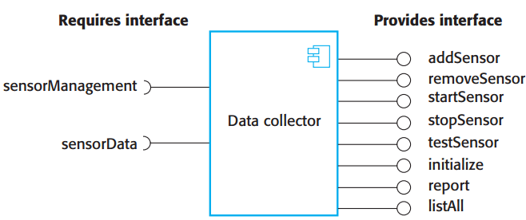
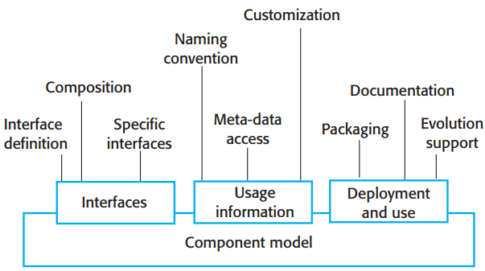
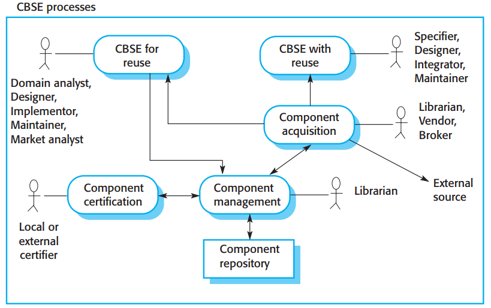
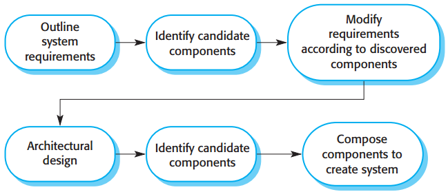
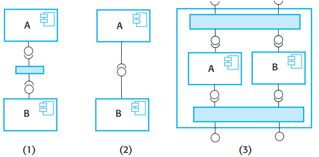

# Component-based software engineering

**Autor:** Benjamin Krüger

Sofern nicht anders gekennzeichnet, stammen die hier dargelegten Informationen aus *Software Engineering* von Ian Sommerville [1].

## Motivation

Beim Entwurf bzw. Design von Softwaresystemen gewinnen Qualitätsaspekte wie die Testbarkeit, Erweiterbarkeit und Wiederverwendbarkeit von Systembestandteilen besonders durch die im Zuge der Digitalisierung ansteigenden und sich dynamisch verhaltenden Anforderungen, sowie dadurch immer zunehmenderen Komplexität, eine immer wichtigere Bedeutung.  
  
Die, sich bei der prozeduralen Softwareentwicklung ergebenden, Einschränkungen und Probleme hinsichtlich dieser Aspekte, sollten schon früh in der Geschichte der Softwareentwicklung durch die objektorientierte Softwareentwicklung gelöst werden. Durch die Abstraktion der Realität in Form von Objekten sowie durch Paradigmen wie der Vererbung, kann wiederverwendbarer Code umgesetzt werden. Bei geeignetem Entwurf kann hierbei zugleich eine verbesserte Testbarkeit sowie Erweiterbarkeit erzielt werden.  
Aber auch objektorientiert-strukturierte Software kann in der Praxis oftmals nur mit großem Aufwand erweitert und Code wiederverwendet werden, da Objekte oft sehr nah an die Problemstruktur gebunden und somit sehr detailiert und spezifisch designed sind. Darüber hinaus müssen diese oft zur Kompilierzeit aufgrund diverser Abhängigkeiten an die Applikation gebunden werden. Aufgrund spezifischer Funktionalitäten ist darüber hinaus eine genaue Kenntnis über die Funktionsweise bzw. den Code von Objekten die Voraussetzung, um diese verwenden zu können. Somit weist sowohl die prozedurale, als auch die objektorientierte Entwicklung, Nachteile in Bezug auf die Eingangs genannten Aspekte auf.  
  
Demnach bedarf es einer weiteren Methodik der Softwareentwicklung, welche den Schwierigkeiten der objektorientierten Softwareentwicklung entgegenwirkt. Da das entscheidende Problem bei Objekten, das oftmals problemnahe Design darstellt, wird ein Ansatz benötigt, welcher einen abstrakteren Entwurf der wiederzuverwendenden Einheiten darstellt. Hierzu lohnt sich zunächst ein Ausblick in Disziplinen wie bspw. der Konzeptionierung bzw. dem Aufbau der Hardware von Computersystemen. Computersysteme bestehen aus einzelnen Subsystemen bzw. Hardwarekomponenten, welche eine in sich geschlossene Aufgabe erfüllen und über definierte Schnittstellen an andere Hardwarekomponenten angebunden aber auch ausgetauscht werden können. Die **Komponente** Grafikkarte beispielsweise, welche die **Aufgabe** hat, für die Darstellung benötigte Berechnungen durchzuführen und dies als Signal an ein Output wie z.B. HDMI auszugeben, kann über eine **definierte Schnittstelle** wie PCI-Express oder ähnliches an das Mainboard angebunden werden. Da die Grafikkarte nicht für ein bestimmtes System, sondern nur für eine Art von System konzeptioniert ist, ist irrelevant wie die Grafikkarte ihre Aufgabe erfüllt - lediglich die Spezifikation (insbesondere die der Schnittstelle) ist entscheidend. Somit kann diese auch durch eine alternative Grafikkarte mit der gleichen Schnittstelle ersetzt werden. Die sich hierbei ergebenden Vorteile und Charakteristika der Hardwarekomponenten lassen sich auf die Softwareentwicklung übertragen. So enstand ende der 90er Jahre ein auf der Wiederverwendung basierender Ansatz zur Definition, Implementierung und Komposition von lose gekoppelten unabhängigen Komponenten zu Systemen - die **komponentenbasierte Softwareentwicklung** (KBSE).

## Komponenten in der Entwicklung

Im Bereich von Software wird der Begriff Komponente häufig mit anderen Begrifflichkeiten gleichgestellt. So werden beispielsweise Module und Systeme als Komponenten bezeichnet und andersherum. Dem liegt zugrunde, dass sowohl Komponenten, als auch Module und Systeme gleichermaßen die folgenden Eigenschaften aufweisen:

* Es wird eine **Eingabe** erwartet
* Es erfolgt die interne **Verarbeitung** bzw. Berechnung
* Es erfolgt eine **Ausgabe** des, aus der Verarbeitung hervorgegangenen, Resultats
* Es werden **Schnittstellen** benötigt und angeboten

Betrachtet man den Prozess der Softwareentwicklung, stellen Komponenten jedoch eine spezielle Implementierung eines Systems im Bereich der Softwarearchitektur dar. Sie dienen dem Softwarearchitekten als wesentliches Modellierelement, um technologie- und applikationsunabhängige und somit wiederverwendbare und erweiterbare Einheiten zu erstellen. Das zuvor betrachtete Beispiel einer Grafikkarte als Hardwarekomponente eines Computersystems, kann auch auf Softwarekomponenten übertragen werden, wodurch folgende Eigenschaften gelten: 

* **Bereitstellung/Verwendung**:
  * Eine Komponente stellt eine eigenständige, in sich geschlossene Einheit dar. Sie kann sowohl auf einer Komponentenplattform als ausführbare Routine bereitgestellt und von Dritten eingebettet als auch in Form eines externen Dienstes zur Verfügung gestellt werden.
  * Zur Verwendung einer Komponente wird lediglich Wissen über die Schnittstellen vorausgesetzt; detailiertes Wissen über die Funktionweise bzw. des Codes ist nicht notwendig.
  * Auch wenn Komponenten häufig in Form von objektorientierten Programmiersprachen implementiert sind, sind sie Sprachen-unabhängig, da sie in sich geschlossene Einheiten bilden.
* **Dokumentation**: Komponenten müssen vollständig dokumentiert sein, sodass potentielle Nutzer abschätzen können, ob sich die angebotenen Services für die Anwendung eignen. Besonders maßgeblich ist hierbei die Spezifikation über die Semantik und Syntax der Schnittstellen.
* **Unabhängigkeit**:
  * Vom Grundgedanken her sollte eine Komponente verwendet werden können, ohne dass für die Verwendung dieser weitere Komponenten benötigt werden.
  * In der Praxis weisen Komponenten jedoch stets Abhängigkeiten zu weiteren Komponenten auf, welche jedoch in Form von *benötigten Schnittstellen* realisiert sind. Hierbei wird lediglich spezifiziert, welche Abhängigkeiten bestehen, aber nicht wie diese bereitgestellt werden müssen, weshalb Komponenten dennoch als unabhängig einsetzbar bezeichnet werden. Dadurch, dass die Implementierung der Abhängigkeiten nicht vorgegeben ist, können diese leicht ausgetauscht bzw. angepasst werden.
  * Sind Komponenten in Form eines externen Services umgesetzt, spricht man von einer vollständigen Unabhängigkeit. Zwar weisen auch hier die Komponenten benötigte Schnittstellen auf, jedoch sind diese interner Natur und somit irrelevant für Systeme, welche diesen Service in Anspruch nehmen. Eine UI beispielsweise, welche etwaige Betriebsinformationen anzeigt und sich die benötigten Informationen von einem externen Server beschafft, benötigt nur die Schnittstelleninformation der API. Die Abhängigkeiten der einzelnen API-Komponenten sind für die UI hierbei irrelevant, da diese API-seitig intern implementiert sind.
* **Schnittstellen**: Wie im Zuge vorheriger Charakteristika bereits beschrieben, weisen Komponenten stets Schnittstellen auf, die sie selbst benötigen und jene, welche sie anbieten. Services stehen anderen Komponenten und Benutzern über die angebotenen Schnittstellen zur Verfügung.
* **Standardisierung**: Eine Komponente muss einem standardisierten Komponentenmodell entsprechen. Je nach Modell, können unterschiedliche Vorgaben bezüglich der Dokumentation, Schnittstellen, Metadaten, Komposition und Verwendung vorhanden sein.

Anhand von Abbildung 1 sind die wesentlichen Merkmale von Komponenten exemplarisch abgebildet. Mithilfe der Komponente *Data collector* sollen Daten unterschiedlichster Sensoren gesammelt und zusammengefasst sowie Sensoren von außen verwaltet werden können (wie dies logisch implementiert ist, ist für die Verwendung irrelevant). Hierzu können andere Komponenten über die angebotenen Schnittstellen ("Provides interfaces") Sensoren hinzufügen, starten, stoppen und testen sowie ermittelte Sensordaten bzw. Daten über registrierte Sensoren abfragen. Zugleich **benötigt** der *Data collector* eine Möglichkeit für den Zugriff auf die Daten der jeweiligen Sensoren und benötigt hierfür eine sensorseitig angebotene Schnittstelle (*sensorData*). Zur spezifischen Verwaltung (bspw. Testen) dieser Sensoren wird ebenfalls eine Schnittstelle benötigt (*sensorManagement*). Über diese kann der *Data collector* beispielsweise in Form eines Strings (Argument der Schnittstelle) sensortyp-unspezifische Befehle an die sich hinter der Schnittstelle befindlichen Komponente "senden", welche wiederum die konkrete Logik für die spezifischen Sensortypen adaptiert. 

||
|:--:| 
| *Abbildung 1: Beispiel einer Komponente* |

## Komponentenmodelle

Wie bereits in den Charakteristika festgehalten, müssen Komponenten einem Komponentenmodell entsprechen. Komponentenmodelle sind Standards für eine ordnungsgemäße Dokumentation, Implementierung sowie die Bereitstellung von Komponenten. Sie untersützen Entwickler bei dem Design von interaktionsfähigen Komponenten sowie Anbieter von Infrastrukturen, welche [Middleware](https://www.redhat.com/de/topics/middleware/what-is-middleware) für den Betrieb von Komponenten bereitstellen. Weit verbreitete Modelle sind im Allgemeinen das Web-Services-Modell für Komponenten in Form von externen Services sowie das Enterprise Java Beans (EJB)-Modell und das .NET-Modell von Microsoft für eingebettete Komponenten. Abbildung 2 stellt grundlegende Vorgaben dar, welche durch Komponentenmodelle bereitgestellt werden.

||
|:--:| 
| *Abbildung 2: Grundlegende Elemente eines Komponentenmodells* |

* **Schnittstellen**: Festlegung über die Art und Weise, wie Schnittstellen definiert und welche Elemente, Operationsnamen, Parameter und Exceptions in der Spezifikation enthalten sein sollen. Darüber hinaus geben Modelle die Programmiersprache an, welche zur Definition der Komponentenschnittstelle verwendet wird, bspw. Java bei Enterprise Java Beans. Manche Komponentenmodelle geben darüber hinaus spezielle Schnittstellen vor, welche in den zu erstellenden Komponenten definiert werden müssen, da diese standardisierte Sicherheits- und Transaktionservices bereitstellen, die durch die Middleware des Modells zur Verfügung stehen.
* **Nutzungsinformationen**: Komponenten, auf welche mittels [Remote Procedure Call](https://www.ionos.de/digitalguide/server/knowhow/was-ist-ein-remote-procedure-call/) zugegriffen wird, müssen bspw. über die Verwendung hierarchischer Namensgebung (basierend auf den Zugriffspunkt der Domäne) global eindeutig identifizierbar sein, um von extern erreichbar zu sein. Ein Beispiel hierfür sind URI (Uniform Resource Identifier).  
Komponentenmodelle liefern dem Entwickler Möglichkeiten, Referenzen auf Metadaten der Komponente zu realisieren (bspw. Reflection-Schnittstelle in Java). Metadaten sind insofern wichtig, dass sie dem Benutzer der Komponente eine Einsicht über die Schnittstellen und Attribute verschafft, ohne Details der Komponente Preis zugeben. So kann der Benutzer die angebotenen Services und Abhängigkeiten einsehen.  
Da Komponenten anwendungsunabhängige Einheiten darstellen, bedarf es einer Möglichkeit, diese bei der Bereitstellung entsprechend zu konfigurieren, sodass diese für eine bestimmte Anwendung verwendet werden kann. Hierzu legt das Komponentenmodell fest, wie diese Konfiguration vorgenommen werden kann.
* **Bereitstellung und Verwendung**: Das Komponentenmodell definiert, wie Komponenten für die Bereitstellung paketiert werden sollten, sodass diese unabhängige und ausführbare Routinen darstellen. Gemäß der Eigenschaft *Unabhgängikeit* müssen diese stets mitsamt aller benötigten Abhängigkeiten bereitgestellt werden. Bereitstellungsinformationen sollten darüber hinaus Informationen über den Inhalt eines Pakets und seine binäre Organisation enthalten.  
Weiter legt das Komponentenmodell fest, wie und wann Komponenten im Falle von sich ändernden Anforderungen geändert bzw. ausgetauscht werden können/dürfen. Darüber hinaus geben Modelle zu erstellende Komponentendokumentationen vor.

## Prozesse der komponentenbasierten Softwareentwicklung

Abbildung 3 stellt die im Rahmen einer komponentenbasierten Softwareentwicklung zustandekommenden Prozesse dar, welche Möglichkeiten der Wiederverwendung von Komponenten berücksichtigen.  

||
|:--:| 
| *Abbildung 3: Prozesse der komponentenbasierten Softwareentwicklung* |

Auf höchster Ebene existieren zwei Arten von Hauptprozessen, die *KBSE für Wiederverwendung* und die *KBSE mit Wiederverwendung*.
Die *Komponentenverwaltung*, *Komponentenzertifizierung* und die *Komponentenbeschaffung* stellen dabei unterstützende Prozesse dar.

**KBSE für Wiederverwendung**  
  
Dieser Prozess beschreibt die Entwicklung von wiederverwendbaren Komponenten mit dem Ziel, diese mithilfe eines Managementsystems für andere Anwendungen bereitzustellen. Für die Umsetzung wiederverwendbarer Komponenten sind folgende Schritte notwendig...

* Applikations-spezifische Methoden entfernen
* Namensgebung anpassen sodass diese unspezifischer sind
* Methoden hinzufügen, um möglichst viele Anforderungen erfüllen zu können
* Konsistente Ausnahmebehandlung für alle Methoden implementieren
* Konfiguration der Komponente durch Implementierung einer Konfigurationssschnittstelle ermöglichen
* Benötigte Schnittstellen integrieren, um die Komponente möglichst unabhängig zu machen

Der Aspekt der konsistenten Ausnahmebehandlung weist einige Einschränkungen auf. Grundsätzlich sollten Komponenten keine Exceptions intern behandeln, sondern diese lediglich erkennen und als Teil ihrer Schnittstelle veröffentlichen, da je nach Anwendung unterschiedlich mit Ausnahmen umgegangen wird. Dies führt jedoch dazu, dass die Komponentenschnittstelle "aufbläht", für den Benutzer uneinsichtig wird und den Benutzer somit abschreckt. Darüber hinaus kann dies zu schwerwiegenden Auswirkungen innerhalb der Komponente führen, da die Funktion dieser von lokalen Ausnahmebehandlungen abhängen kann. Daher sollten jene Exceptions, welche für die Funktionalität der Komponente relevant sind, lokal behandelt und dokumentiert werden. Alle weiteren Ausnahmen sollten entsprechend zur Behandlung an die aufrufende Komponente weitergeben werden.  
  
Der Prozess KBSE für Wiederverwendung findet primär in Unternehmen anwendung - mit dem Ziel, selbstständig und intern Komponenten für die eigens angedachte Wiederverwendung zu entwickeln. Erfahrungsgemäß zeigen sich hierbei jedoch oft anwendungsspezifische Merkmale und Schnittstellen. Dies lässt sich nicht darauf zurückführen, dass die Umsetzung wiederverwendbarer Komponenten technisch etwa nicht immer möglich ist, sondern viel mehr durch die nur schwer zu treffende Abschätzung darüber, ob es sich finanziell lohnt, anwendungsspezifische Merkmale und Schnittstellen weitergehend bzw. vollständig aus einer Komponente zu extrahieren.  
Hierzu muss abgeschätzt werden, in welchem Umfang die jeweilige Komponente zukünftig wiederverwendet werden könnte, um die hohen Entwicklungskosten zu rechtfertigen. Ob eine Komponente potentiell oft wiederverwendet werden kann, lässt sich zunächst gut anhand der Domäne abgeschätzen. Handelt es sich um eine allgemeine Domäne, ist es wahrscheinlicher, dass die Komponente wiederverwendet wird. Zugleich bedeutet dies jedoch auch, dass die Entwicklungskosten steigen, da die Komponente mehr Operationen anbieten muss, was wiederum zu einer erhöhten Komplexität führt. Der Entwickler muss demnach einen Kompromiss aus Investitions-/Entwicklungskosten, Wiederverwendbarkeit und durch die Komplexität bedingte Attraktivität der Komponente treffen. In manchen Fällen ist kostengünstiger, eine neue einfachere / weniger komplexe Komponente zu erstellen als die Wiederverwendbarkeit einer bestehenden Komponente durch zusätzliche Operationen zu erhöhen.
  
Ist eine Komponente entwickelt und getestet, muss diese für die zukünftige Wiederverwendung verwaltet werden. Hierzu umfasst die *Komponentenverwaltung* die Klassifizierung, sodass die Komponente besser gefunden werden kann, das Hinzufügen zu einem Repository, bei Bedarf die Bereitstellung als Dienst, die Pflege der Dokumentation sowie die Verfolgung der Komponentenversionen. Abhängig davon, ob die Komponente Open-Source ist oder für die Verwendung im Unternehmen gedacht ist, handelt es sich beim Repository um ein öffentliches Repository wie bspw. Github oder um ein internes Repository. Als zusätzliche Qualitätskontrolle erfolgt in manchen Fälle eine Zertifizierung der Komponente durch eine andere Person, als der Entwickler selbst.  

**KBSE mit Wiederverwendung**  
  
Dieser Prozess beschreibt die Wiederverwendung von Komponenten und die Integration dieser in die zu entwicklende Software. Abbildung 4 zeigt die hierfür notwendigen Aktivitäten.

||
|:--:| 
| *Abbildung 4: Aktivitäten zur Wiederverwendung von Komponenten* |

* Zunächst erfolgt die Definition der Systemanforderungen. Diese werden zu Beginn zunächst bewusst grob gehalten und so flexibel wie möglich definiert. Dies hat den Hintergrund, dass eine zu spezifische Anforderungsliste die Anzahl an, in Frage kommenden, Komponenten stark einschränken würde. Gleichzeitig ist man bemüht, bereits zu Beginn eine möglichst vollständige Anforderungsliste zu generieren, um auch hier die Anzahl an potentiellen Komponenten zu erhöhen.
* Auf Basis der definierten Anforderungen werden in Frage kommende Komponenten ermittelt. Dieser Teilprozess besteht aus der Suche nach Komponenten, der Auswahl geeigneter Komponenten sowie der Validierung der Komponenten. Da es nur wenige Komponentenanbieter gibt, wird häufig nach bereits vorhandenen Komponenten im Unternehmen gesucht.
* Bereits in einem frühen Stadium des Prozesses werden die zu Beginn grob definierten Anforderungen auf Basis der zur Verfügung stehenden Komponenten verfeinert. Zeigt sich, dass die Anforderungen mit den in Frage kommenden Komponenten nicht umsetzbar sind, werden Anforderungen diskutiert, sodass die angepassten Anforderungen durch die bereits ausgewählten Komponenten erfüllt werden. Ist dies nicht der Fall, müssen alternative Komponenten ermittelt werden und der Prozess der Komponentenidentifierung erneut durchlaufen werden.
* Nachdem die Systemarchitektur entworfen ist, erfolgt eine erneute Suche nach Komponenten, wodurch eine Verfeinerung des Designs erzielt werden soll. Denn ursprünglich in Frage kommende Komponenten können sich als ungeeignet erweisen oder schlicht nicht integriert werden, da diese nicht mit anderen ausgewählten Komponenten interagieren können. Ist dies der Fall, müssen eventuell erneut bestehende Anforderungen diskutiert werden. 
* Der Entwicklungsprozess stellt einen Kompositionsprozess dar, bei welchem ausgewählte Komponenten in das System integriert werden. Dies beinhaltet die Verwendung einer Komponentenmodell-Infrastruktur und oft auch die Entwicklung von Adapterkomponenten, welche Inkompatibilitäten zwischen Komponenten lösen. Oftmals erübrigt sich die Auswahl eines Komponentenmodells dadurch, dass Unternehmen über eine Standardentwicklungsplattform verfügen und diese somit vorgegeben ist. Darüber hinaus können auch zusätzliche Funktionalitäten benötigt werden, die von keinen der integrierten Komponenten gelöst werden kann.

## Komponentenkomposition

Bei der Komponentenkomposition handelt es sich um den Prozess der Integration von Komponenten miteinander zur Umsetzung eines Systems, was den letzten Teilprozess der *KBSE mit Wiederverwendung* entspricht. Abbildung 5 zeigt die Möglichkeiten, die sich bei der Komposition ergebenden.

||
|:--:| 
| *Abbildung 5: Arten der Komponentenkomposition* |

* **(1) Sequentielle Komposition**: Zwei Komponenten werden nacheinander nacheinander aufgerufen -> Die von Komponente A angebotenen Dienste werden aufgerufen und das Ergebnis dann für den Aufruf der angebotenen Dienste von B verwendet. Die Komponenten rufen sich nicht gegenseitig auf sondern werden von der externen Anwendung aufgerufen. Unter Umständen wird zusätzlicher Glue-Code benötigt, um die Komponenten in der richtigen Reihenfolge aufzurufen und um sicherzustellen, dass die von A berechneten Ergebnisse mit der von B erwarteten Eingabe kompatibel ist. Sequentielle Komposition findet häufig Anwendung für eingebettete oder Dienstkomponenten.
* **(2) Hierarchische Komposition**: Komponente A nutzt die angebotenen Schnittstellen von B direkt und selbst. Hierfür stellt die aufgerufene Komponente (B) Dienste zur Verfügung, welche von der aufrufenden Komponente (A) benötigt werden. Falls zwischen den Schnittstellen beider Komponenten eine Diskrepanz besteht, wird eine zusätzliche Logik benötigt, welche die Kompatibilität herstellt.
* **(3) Additive Komposition**: Zwei Komponenten werden zu einer neuen Komponente zusammengefügt, wodurch die Funktionalität beider kombiniert wird. Die Schnittstellen der daraus resultierenden Komponente stellen eine Kombination aus den Schnittstellen von A und B dar. Die Komponenten scheinen nach außen hin wie eine einzige Komponente, wodurch Komponente A und B separat - in beliebiger Reihenfolge - aufgerufen werden können. Sowohl eingebettete als auch Dienstkomponenten eignen sich für diese Art der Komposition.  
  
Bei der Komposition von unabhängig voneinander zur Wiederverwendung entwickelten Komponenten, kommt es häufig zu Schnittstelleninkompatibilitäten. Hierbei unterscheidet man zwischen drei Arten.

* **Parameterinkompatibilität**: Die Operationsnamen beider Schnittstellen sind zwar identisch, die Parametertypen oder die Anzahl von Parametern stimmen jedoch nicht überein.
* **Operationsinkompatiblität**: Die Operationsnamen der angebotenen und benötigten Schnittstellen stimmen nicht überein.
* **Operationsunvollständigkeit**: Die angebotenen Operationen einer Komponente sind die Teilmenge der benötigten Operationen einer anderen Komponente oder umgekehrt. 

Zur Behebung aller drei Inkompatibilitäten wird eine *Adapterkomponente* benötigt, welche die Konvertierung einer Schnittstelle in die andere durchführt, sodass diese miteinander interagieren können. Die Form des Adapters hängt von der Kompositionsart ab. Eine Möglichkeit ist hierbei, dass der Adapter das Ergebnis einer Komponente nimmt und dies in eine andere Form umwandelt, sodass es als Eingabe für eine andere Komponente verwendet werden kann. Diesen Fall haben wir bereits bei der sequentiellen Komposition betrachtet. Falls die Details der benötigten Schnittstelle von Komponente A nicht mit den Details der angebotenen Schnittstelle von Komponente B übereinstimmen, Komponente A jedoch auf diese Schnittstelle zugreifen möchte, kann ein Adapter als Stellvertreter von komponente B dienen. Hierbei konvertiert der Adapter die Schnittstelle von A so, dass diese der Schnittstelle von B entsprechen.

## Referenzen

[1]: Sommerville, I. (2015). Software engineering 10th Edition. ISBN-10, 137035152, 18. S. 520-547