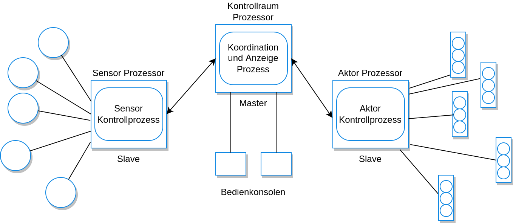

# Distributed Software Engineering #

**Autor:** Malte Reinsch

Die meisten heute verwendeten Rechnersysteme sind verteilte Systeme. Ein verteiltes
System ein ein Rechnersystem, an dem mehr als ein Rechner beteiligt ist.
Tannenbaum und Van Steen definieren ein verteiltes System als: "Eine Sammlung
aus unabhängigen Rechnern, die aus Sicht des Nutzers als einzelnes zusammenhängendes
System wahrgenommen wird."

Aus der Verwendung von verteilten Systemen gehen einige Vorteile
ggü. klassischen Rechnersystemen hervor:
1. Geteilte Ressourcen: In einem verteilen System können
Ressourcen (Hardware, Software) eines Rechners mit anderen
Rechnern geteilt werden.
2. Offenheit: Verteilte Systeme werden oftmals als offen
betrachtet, da sie Standardprotokolle verwenden, sodass Hardware
und Software verschiedenster Hersteller verwendet werden können.
3. Nebenläufigkeit: Verschieden Aufgaben können nebenläufig (also parallel / gleichzeitig)
auf verschiedenen Rechnern des Systems ausgeführt werden.
4. Skalierbarkeit: Prinzipiell sind verteilte Systeme dahingehend
skalierbar, dass erhöhte Anforderungen an das System durch das
Hinzufügen neuer Hardware abgefangen werden können.
5. Fehlertoleranz: Durch die Verteilung von Informationen über
mehrere Rechner des Systems kann das System gegenüber Hardware-
ausfällen abgehärtet werden.

Verteilte System sind gegenüber klassischen (zentralisierten
Systemen) deutlich komplexer. Durch die Verteilung entstehen
neue Herausforderung für die Implementierung des Systems, welche
in zentralisierten Systemen keine oder nur eine kleine Rolle
spielen.
Da die Antwortzeit des Systems von der Belastung des gesamten Systems und des Netzwerks
abhängt, kann die Antwortzeit auf für aufeinander folgende Anfragen stark variieren.

Im Folgenden werden unterschiedliche Aspekte betrachtet, die für die Entwicklung
verteilter Systeme zu beachten sind. Des Weiteren diskutiert dieses Kapitle einige
architektonische Ansätze zur Konzeptionierung und Implementierung verteilter Systeme.

## Distributed Systems ##

<!-- TODO: kürzen -->

Diese Komplexität verteilter Systeme entsteht insbesondere
dadurch, dass keine Komponente des Systems die komplette Kontrolle
über das gesamte System (also alle Rechner und das Netzwerk) hat.
Das Netzwerk, durch das die Rechnerknoten verbunden werden ist in
der Regel ein eigenes System, welches von externen Parteien kontrolliert wird.
Durch diese verteilte Kontrolle wohnt dem Verhalten eines
verteilten Systems eine natürliche Unberechnebarkeit inne.

Aus dieser Komplexität ergeben sich folgende Aspekte, die
insbesondere bei der Entwicklung eines verteilten Systems
beachtet werden müssen:

### Transparenz ###

Inwiefern soll dem Nutzer des Systems bekannt
sein, dass das System verteilt ist?

Ein ideal transparentes verteiltes System ist nicht als solches von außen zu erkennen.
Praktisch ist dies allerdings aus mehreren Gründen nicht realisierbar.
Aufgrund fehlender zentraler Kontrolle verhalten sich Systemkomponenten von Interaktion zu
Interaktion unterschiedlich
und übermittelte Nachrichten benötigen eine gewissen Zeit, um das Netzwerk zu durchqueren.
Diese Verzögerung ist von der (geografischen) Verteilung der Systemressourcen abhängig.

Um mit diesen Problemen umzugehen, werden die Systemressourcen abstrahiert, beispielsweise
durch Middleware, welche physikalische Ressourcen auf logische Ressourcen abbildet,
welche einfacher genutzt werden können.
Trotz dieser Maßnahmen ist es nicht möglich, ein verteiltes System vollständig transparent
zu gestalten. Die Kommunikation dessen, dass es sich um ein verteiltes System handelt, kann
dem Nutzenden dabei helfen, die Auswirkungen der beschriebenen Probleme besser einzuordnen
und mit ihnen umzugehen.

### Offenheit ###

Soll das System nur Standardprotokolle verwenden, oder sollen höher spezialisierte
Protokolle verwendet werden?

Offene Systeme sind in der Hinsicht offen, dass sie Standardprotokolle verwenden,
sodass standardisierte Komponenten jedes Herstellers einfach in das System integriert
werden können. Auf der Netzwerkebene gilt diese Form der Offenheit mittlerweile als
selbstverständlich, sodass die gängigen Internetprotokolle unterstützt werden.

Der 1990 entwickelte CORBA Standard verfolgt das Ziel, die auch auf der Komponentenebene
zu erreichen, wurde bisher allerdings noch nicht flächendecken angenommen. Viele
Softwarehersteller vertrauen stattdessen auf proprietäre Standards, welche bessere
Implementierungen und Support von großen Firmen wie Oracle oder Microsoft erhalten.

### Skalierbarkeit ###

Wie kann die Skalierbarkeit des Systems
gewährleistet werden, sodass das System mit steigenden Nutzerzahlen
umgehen kann?
Skalierbarkeit kann in drei Dimensionen aufgeteilt werden:
1. Größe: Es sollte möglich sein, mehr Ressourcen zum System hinzuzufügen, um mit
steigenden Nutzerzahlen umzugehen. Die Systemgröße sollte also automatisch
mit den Nutzerzahlen wachsen.
2. Verteilung: Es sollte möglich sein, die Komponenten des Systems geografisch zu
verteilen, ohne die Systemleistung zu verringern.
3. Verwaltbarkeit: Das System sollte verwaltbar bleiben, auch wenn die Systemgröße
wächst und Teile des Systems von unabhängigen Organisationen bereitgestellt werden.
Dies ist in der Praxis häufig der Faktor, der die Skalierbarkeit eines Systems am
stärksten limitiert

Es wird zwischen zwei Skalierungsarten unterschieden:
1. **Scaling Up**: Austauschen vorhandener Systemressourcen mit leistungsstärkeren
Ressourcen (Austausch eines Prozessors gegen einen schnelleren).
2. **Scaling Out**: Hinzufügen zusätzlicher Systemressourcen zu den bestehenden Ressourcen (Hinzufügen
eines weiteren Rechners). *Scaling Out* ist meistens kostengünstiger als *Scaling Up*, setzt
allerdings voraus, dass die Anwendung die parallele Berechnungen auf unterschiedlichen
Rechnern zulässt.

#### Anmerkung ####

Im Deutschen lassen sich beide Begriffe zu den Worten "Ausweiten/Ausbreiten" übersetzen,
deren Bedeutung nicht so klar voneinander getrennt ist, wie die Konzepte, die hier
durch die englischen Begriffe beschrieben werden.
Daher werden im weiteren Verlauf des Kapitels weiterhin die englischen Begriffe
verwendet, um Missverständnissen vorzubeugen.

### Sicherheit ###

Ein Angreifer kann jede individuelle Systemkomponente angreifen und diese
im Erfolgsfall als Hintertür in andere Systemteile verwenden. Ein verteiltes System
muss gegen die folgenden Angriffstypen abgesichert werden:
1. Abfangen von Informationen: Durch das Abfangen der Kommunikation zwischen zwei
Systemkomponenten geht die Vertraulichkeit der Informationen verloren.
2. Unterbrechung: Systemkomponenten werden derart angegriffen, dass sie ihre
Dienste nicht bereitstellen können. Ein Beispiel hierfür sind "denial of service"-Attacken,
bei denen ein Netzwerkknoten mit sehr vielen ungültigen Anfragen überlastet wird, sodass
dieser nicht mehr auf die gültigen Anfragen reagieren kann.
3. Änderung: Ein Angreifer ist in der Lage Systemdienste oder Daten zu ändern.
4. Erzeugung von Informationen: Ein Angreifer erzeugt Informationen, welche nicht
existieren sollten und nutzt diese Informationen, um sich Zugang zum System zu
verschaffen (z.B. Erzeugung eines falschen Passworts).

Eine große Hürde bei der Absicherung eines verteilten Systems ist die Festlegung
und Umsetzung durchgängiger Sicherheitsstrategien. Verschiedene Systemteile können
von unterschiedlichen Organisation verwaltet werden, wodurch sich diese Schritte
erschweren. Im Falle von inkompatiblen Sicherheitsstrategien zweier kooperierender
Organisationen kann es nötig sein, die Strategien einzuschränken und Systeme so potentiell
angreifbar zu machen.

### Dienstqualität ###

Die Dienstqualität (engl. Quality of Service) beschreibt, wie zuverlässig ein
verteiltes System die versprochenen Dienste bereitstellen kann, sodass die Antwortzeit
und der Durchsatz in akzeptablen Schranken liegt. Idealerweise ist die Dienstqualität
vor der Systemimplementierung spezifiziert, sodass das System genau auf diese Dienstqualität
abgestimmt realisiert wird. Das kann allerdings aus folgenden Gründen unpraktikabel sein:
1. Es kann unwirtschaftlich sein, ein System zu implementieren, welches eine hohe
Dienstqualität unter maximaler Last garantieren kann, da hierfür bspw. mehr Server
benötigt werden als im normativen Belastungsfall. Durch die möglichkeiten des Cloud-Computings
wird dieser Effekt jedoch abgeschwächt.
2. Die Parameter für die Dienstqualität können sich gegenseitig ausschließen.
Bspw. kann gesteigerte Zuverlässigkeit einen verringerten Durchsatz erzwingen.

Die Dienstqualität ist insbesondere relevant für Systeme, die zeitkritische Daten
verarbeiten (bspw. Audio- oder Videodateien). Bei unzureichender Dienstqualität
kann z.B. eine Audiodatei nicht mehr richtig abgespielt werden. Daher sollten solche
System dynamisch die erforderliche Dienstqualität berechnen und entsprechende Ressourcen
anfordern.

### Fehlermanagement ###

In verteilten Systemen werden Fehler auftreten, daher muss das System resilient gegenüber
Fehlern umgesetzt sein. Hierzu zählen Mechanismen, die Fehler detektieren, die Fehlerausmaße
bestimmen und weiterhin so viele Dienste wie möglich bereitstellen. Durch Cloud-Computing
können die Kosten für diese Mechanismen mitunter massiv gesenkt werden, da das Vorhalten
redundanter Systemkomponenten deutlich einfacher realisierbar ist.

### Interaktionsmodelle ###

Die Interaktionen der Rechner in einem verteilten System kann in zwei Arten aufgeteilt
werden: Prozedurale Interaktion und Nachrichten-basierte Kommunikation.
Prozedurale Interaktion besteht in dem synchronen Aufruf eines bekannten Dienstes
eines anderen Rechners. Nachrichten-basierte Kommunikation ist asynchron und übermittelt
in der Regel mehr Informationen als prozedurale Interaktion.

In der folgenden Abbildung ist die prozedurale Kommunikation zwischen einer bestellenden
Person und einer bedienenden Person in einem Restaurant dargestellt.


Die bedienende Person stellt der bestellenden Person eine Frage und wartet auf die Antwort.
Die bestellende Person bestätigt die Anfrage und gibt eine Antwort.
Die Antworten werden von der bedienenden Person notiert und anschließend gesammelt
an die Küche weitergeleitet. Das nachfolgende Listing zeigt den möglichen Inhalt
dieser Nachricht an die Küche.

```
<starter>
	<dish name = “soup” type = “tomato” />
	<dish name = “soup” type = “fish” />
	<dish name = “pigeon salad” />
</starter>
<main course>
	<dish name = “steak” type = “sirloin” cooking = “medium” />
	<dish name = “steak” type = “fillet” cooking = “rare” />
	<dish name = “sea bass”>
</main>
<accompaniment>
	<dish name = “french fries” portions = “2” />
	<dish name = “salad” portions = “1” />
</accompaniment>
```

Die Kommunikaton mit der Küche erfolgt allerdings asynchron: die bedienende Person
"sendet" eine Nachricht an die Küche und kann anschließend weitere Bestellungen aufnehmen.
Sobald die Anfrage an die Küche erfolgreich abgeschlossen wurde, kann die bedienende
Person die bestellten Gerichte aus der Küche abholen.

Prozedurale Kommunikation wird in der Regel über "Remote Procedure Calls" (RPC)
realisiert. Über einen eindeutigen Namen können Dienste einer Komponente wie lokale
Funktionen aufgerufen werden. Dies erfordert, dass der aufrufenden Komponente der
Funktionsstumpf (vergleichbar mit einer Funktionssignatur) bekannt ist, welcher die
Schnittstelle zur aufzurufenden Funktion beschreibt. Middleware übernimmt viele
Zwischenschritte (Konvertierung von Datentypen, etc.), um diese Form der Kommunikation zu ermöglichen.

Bei der Nachrichten-basierten Kommunikation wird eine Nachricht mit Dienstanforderungen
und dafür nötigen Daten von einer Komponente über Middleware an eine andere Komponente
gesendet. Diese führt erforderliche Berechnungen durch und sendet anschließend eine
Antwort an den Sender. Die Middleware stellt dabei die erfolgreiche Zustellung der
Nachrichten sicher.

Prozedurale Kommunikation erfordert die Erreichbarkeit der aufrufenden und aufgerufenen
Komponente. Bei Nachrichten-basierter Kommunikation ist dies nicht der Fall, was ein
großer Vorteil gegenüber prozeduraler Kommunikation ist.

### Middleware ###

Die Komponenten eines verteilten Systems können in unterschiedlichen Programmiersprachen
implementiert sein, auf verschiedenen Prozessoren laufen, verschiedene Protokolle verwenden
und andere Formen der Informationsdarstellung verwenden. Um die Komponenten trotzdem
in einem zusammenhängenden System verwenden zu kommen, ist Software nötig, die diese
Unterschiede abfängt. Die Art von Software wird unter dem Namen *Middleware* zusammengefasst,
der darauf hindeutet, dass es sich um die Software *zwischen* den Systemkomponenten und
dem Betriebssystem handelt.

Middleware besteht in der Regel aus einer Sammlung von Bibliotheken, die auf
den Rechnern des Systems installiert sind und nicht spezifisch für die Implementierung
des Systems entwickelt wurden.

Middleware bietet zwei Arten von Unterstütztung bei der Realisierung eines verteilten Systems:
1. Interaktionshilfe: Die Middleware koordiniert die Kommunikation zwischen Systemkomponenten.
Hierzu zählen bspw. die Parameterkonvertierung zwischen verschiedenen Programmiersprachen.
2. Bereitstellung gemeinsamer Dienste: Die Middleware stellt Wiederverwendbare
Funktionalität bereit, die von mehreren Komponenten des Systems verwendet werden.

## client-server computing ##

Programme, die über das Internet angesprochen werden, sind als Client-Server Systeme
angelegt. Dabei interagiert ein Client-Progamm (auf einem lokalen Rechner) mit einem
Server-Programm (in der Regel auf einem anderen Rechner, ggfs. geografisch entfernt).
Dieses Client-Server Modell ist ein Konzept auf der Applikationsebene, daher ist seine
Anwendung nicht nur auf verteilte Systeme beschränkt.

Im Client-Server Modell wird die Applikation als eine Menge aus Diensten, welche von
Servern bereitgestellt werden, modelliert. Jeder Server kann unterschiedliche Dienste
anbieten. Ein Client-Programm kann diese Dienste nutzen
und muss dafür nur die Server kennen, jedoch keine anderen Client-Rechner.

Wie in der untenstehenden Abbildung zu erkennen, handelt es sich bei Servern und Clients
um unterschiedliche Prozesse.


Oftmals laufen mehrere Client-Prozesse auf dem gleichen Prozessor (z.B. Mail-Client, Web-Browser,
Drucker-Treiber). Dies ist theoretisch auf für Server-Prozesse möglich, praktisch
werden Server-Systeme allerdings häufig als Mehrkern-Systeme ausgelegt, auf dessen Kernen
Instanzen des gleichen Server-Programms laufen. Load-Balancing Software verteilt die
Client-Anfragen gleichmäßig an die Server, um die Überlastung einzelner Server-Instanzen
zu vermeiden.

Client-Server Systeme sind von der klaren Trennung der Informationsdarstellung und
den Berechnungen, die diese Informationen erzeugen, abhängig.
Dies setzt die Organisation
einer Applikation in vier logische Schichten voraus, die durch klar definierte Schnittstellen voneinander
getrennt sind:
1. Präsentationsschicht: Darstellung von Informationen für die Nutzende Person
2. Datenverarbeitungsschicht: Verarbeitet die Daten, die von und zu dem Client
geschickt werden.
3. Applikationsschicht: Implementierung der Applikationslogik
4. Datenbankschicht: Speicherung und Bereitstellung von Daten

Im folgenden sind diese Schichten grafisch dargestellt:


## architectural patterns for distributed system ##

Entwickler von verteilten Systemen müssen beim Systemdesign eine Balance zwischen
Performance, Verlässlichkeit, Sicherheit und Verwaltbarkeit des Systems finden.
Im Laufe der Zeit haben sich verschiedene architektonische Muster entwickelt.

<!-- Alternativ: Im Folgenden werden fünf dieser Muster behandlet, Zack los gehts -->

Die folgenden Fünf Architekturen werden im Folgenden behandelt:
1. Master-Slave Architektur: In Echtzeit-Systemen verwendet, welche eine Antwort in einer bestimmten Zeit
garantieren
2. Zweistufige Client-Server Architektur: Für einfache Client-Server Systeme verwendet und
in Situationen, in denen Zentralisierung aus Sicherheitsgründen nötig ist
3. Mehrstufige Client-Server Architektur: Genutzt, wenn der Server viele Anfragen bearbeiten muss
4. Verteilte Komponenten Architektur: Verwendet, wenn Ressourcen verschiedener Systeme und
Datenbanken verbunden werden müssen (oder als Implementierungsmodell der Multi-Stufen Client-Server Architektur)
5. Peer-to-peer Architektur: Verwendet, wenn Clients lokal gespeicherte Informationen austauschen
und die Rolle des Servers darin besteht, die Clients miteinander zu verbinden

### Master-Slave Architektur ###

Die Master-Slave Architektur wird häufig in Echtzeitsystemen verwendet, welche
eine Antwort in einer festgelegten Zeit garantieren müssen. In solchen Systemen können
unterschiedliche Prozessoren für Datenakquise, Datenverarbeitung und Aktorverwaltung
beteiligt sein.

Normalerweise ist der "Master"-Prozess für Berechnungen, Datenverarbeitung und Kommunikationsverwaltung
zuständig und kontrolliert die "Slave"-Prozesse. Jeder "Slave"-Prozess ist einer
bestimmten Aktion zugeordnet, wie beispielsweise das Erfassen einer Sensorgröße oder
die Stellung eines Aktors.



In der obigen Abbildung ist eine mit dem Master-Slave Modell realisierte Ampelsteuerung
dargestellt. Am System sind zwei "Slave"- und ein "Master"-Prozess beteiligt.
Der linke "Slave"-Prozess ist für die Akquise der Umweltdaten über Sensoren zuständig,
fragt regelmäßig die Zustände aller Sensoren ab und sammelt die Daten für die Verarbeitung
durch den "Master"-Prozess. Dieser wiederum erfragt regelmäßig die Daten des Sensor-Prozesses
ab und nimmt entsprechend Berechnungen vor. Unter den passenden Bedingungen werden
Befehle an die Lampensteuerung gesendet.

Das Master-Slave Modell wird insbesondere dann verwendet, wenn bereits im Vorfeld klar
ist, welche Berechnungen in welcher Frequenz durchgeführt werden und bestimmte Berechnungen
auf "Slaves" ausgelagert werden können.

### Zweistufige Client-Server Architektur ###

Die zweistufige Client-Server Architektur stellt die einfachste Form der zuvor
beschriebenen Client-Server Strukur dar.
Es wird unterschieden zwischen:
- *Thin-Client Modell* (flache Clients): Die Präsentationsschicht ist auf dem Client implementiert, alle
weiteren Schichten sind auf dem Server implementiert. Die Client Darstellungssoftware ist
meist in Webbrowser oder Apps.
- *Fat-Client Model* (dicke Clients): Ein Teil oder die gesamte Applikationslogik ist auf dem Client
angelagert, das Datenmanagement und die Datenbank sind auf dem Server implementiert.
In diesem Fall ist die Client-Software eng mit der Server-Applikation integriert

Beide Ansätze haben Vor- und Nachteile, so sind flache Clients einfacher zu verwalten,
was insbesondere dann relevant ist, falls viele Clients im Einsatz sind und spezifische
Client-Software installiert werden muss. Ein Nachteil der flachen Clients ist
jedoch, dass eine hohe Rechenbelastung an die Server und das Netzwerk abgegeben wird, sodass
evtl. stärkere Investitionen in Server- und Netzwerkinfrastruktur nötig sind.
Insbesondere durch den verstärkten Einsatz von mobilen Endgeräten und die damit
einhergehende Netzwerkbelastung ist dieser Aspekt relevant.

Dicke Clients haben den Vorteil, dass sie das Rechenpotential der Client-Rechner
besser ausnutzen. Dies erfordert jedoch die Installation und Wartung von spezifischer
Client-Software, was weitere Komplexitäts- und Kostenfaktoren darstellt. Durch die Verteilung
der Applikationsfunktion über meherere Rechnersysteme wird die Verwaltung des Gesamtsystems
deutlich komplexer. Eine Änderung in der Applikationssoftware erfordert beispielsweise
die komplette Neuinstalltion der geänderten Software auf allen Client-Systemen.


Die obige Abbildung zeigt ein Geldautomaten-System, die einzelnen Geldautomaten
sind als dicke Clients umgesetzt. Der Server ist die Datenbank in Form von Mainframes,
welche die Kundendaten verwalten. In dem abgebildeten Beispiel haben die Clients keine
direkte Verbindung zur Datenbank, sondern zu einer "Teleprocessing monitor" Middleware,
welche die Kommunikation mit den Client-Systemen verwaltet.

Zusammenfassend kann das Thin-/Fat-Client Modell als
Orientierung für den Systementwurf hilfreich sein, es
wird in dieser strikten Trennung allerdings nur selten eingesetzt.
Besonders durch die weite Verbreitung von leistungsstarken mobilen Endgeräten wird
die zufor beschriebene klare Trennung aufgeweicht, da gewisse Teile der Applikationslogik
auf den Client-Systemen vorgenommen werden können.

### Mehrstufige Client-Server Architektur ###

Ein fundamentales Problem der zweistufigen Client-Server Architektur stellt die
Zuordnung der logischen Schichten des Systems auf zwei Rechnersysteme dar. Diese
strenge Aufteilung kann zu Problemen bei der Skalierbarkeit oder der Systemperformance
führen (im Falle von flachen Clients) und zu Problemen mit der Systemverwaltung (im Falle von
dicken Clients). Als Lösung ermöglicht die mehrstufige Client-Server Architektur die Verteilung
jeder logischen Schicht auf einen einzelnen Prozessor.

In einem beispielhaften Internetbanking-System könnten die Schichten wie folgt aufgeteilt sein:
- Die Kundendatenbank wird auf einem Mainframe gehostet (Datenbankdienste)
- Applikationsdienste, wie z.B. Überweisungen anzuweisen, sind im Webserver als Skripte
hinterlegt, die auf dem Client ausgeführt werden können
- Der Webbrowser auf dem Rechner der nutzenden Person stellt den Client dar

Dieses System ist in der nachfolgenden Abbildung dargestellt:


Diese Lösung ist einfach zu skalieren, da relativ einfach neue Webserver mit steigenden
Nutzendenzahlen hinzugefügt werden können. Dieses dreistufige Client-Server Modell
kann auch auf ein mehrstufiges Modell ausgeweitet werden, indem einzelne Applikationsdienste
auf einzelne Server ausgelagert werden. Falls mehrere Datenbanken verwendet werden sollen,
könnte zusätzlich ein Integrationsserver eingesetzt werden, der die verteilten Daten
sammelt und der übrigen Systemarchitektur über eine gemeinsame Schnittstelle zur
Verfügung stellt.

Zusammenfassend lässt sich festhalten, dass mehrstufige Modelle, die Applikationslogik
auf mehrere Rechner verteilen, besser als zweistufige Client-Server Modelle
skalierbar sind. Durch die Aufspaltung monolithischer Strukturen verbessert sich
außerdem die Verwaltbarkeit, da jede Schicht einzeln verwaltet und skaliert werden kann.
Indem die Applikationslogik und die Datenbereitstellung auf unterschiedliche Rechner
aufgeteilt wird, kann zusätzlich eine schnellere Systemantwort erreicht werden.

Die Auswahl einer konkreten Systemarchitektur ist von der konkreten Anwendung abhängig.
In der nachfolgenden Tabelle sind einige Szenarien gegenübergestellt.

| Architektur | Anwendungen |
|---        |-----------------|
|Zweischichtige Client-Server Architektur mit flachem Client | Altsystemanwendungen, die genutzt werden, falls die Trennung zwischen Applikationslogik und Datenverarbeitung unpraktikabel ist; Rechenintensive Anwendungen (z.B. Compiler) mit geringem Bedarf nach Datenverarbeitung; Daten-intensive Anwendung (Webbrowsing) mit wenig Applikationslogik |
|Zweischichtige Client-Server Architektur mit dickem Client | Anwendungen, bei denen die Applikationslogik durch Standardsoftware (z.B. Microsoft Excel) auf dem Client erfolgt; Anwendungen, bei denen rechenintensive Datenverarbeitung nötig ist (z.B. Datenvisualisierung); Mobile Anwendungen, bei denen eine Internetverbindung nicht garantiert werden kann|
|Mehrschichtige Client-Server Architektur| Große Anwendungen mit hunderten oder tausenden Clients; Anwendungen, bei denen sowohl die Daten als auch die Applikation unberechenbar sind|


### Verteilte Komponentensysteme ###

Das mehrstufige Client-Server Modell funktioniert gut für viele Anwendungsfälle,
es kann allerdings die Flexibilität einschränken, da es die Systementwickler zwingt,
Dienste einer logischen Schicht zuzuordnen. Die klare Trennung von Dienstarten ist
praktisch oft schwierig.

Daher wird im verteilten Komponentenmodell die Applikation als Menge von Diensten
definiert, ohne eine Zuordnung dieser Dienste zu logischen Schichten des Systems vorzunehmen, sodass
die Dienste nur bedarfsweise miteinander in Verbindung treten.
Jeder Dienst bzw. jede zusammenhängende Gruppe von Diensten kann als Komponente im
System umgesetzt werden, die eine Schnittstelle für die implementierten Dienste bietet.
Andere Komponenten nutzen diese Schnittstellen über Middleware mithilfe von Remote Procedure Calls.
Eine verteilte Komponentenarchitektur ist in dem folgenden Bild dargestellt:


Die Verwendung des verteilten Komponentenmodells bietet einige Vorteile:
1. Der Systementwickler muss Entscheidungen, wo und wie Dienste bereitgestellt werden, nicht
sofort treffen, da keine klare Zuordnung zu einer Schicht nötig ist.
2. Die Architektur ist sehr offen gegegnüber nachträglichem Hinzufügen von neuen Ressourcen und Diensten.
3. Die Architektur ist gut skalierbar. Falls die Systembelastung steigt, können
neue oder replizierte Objekte hinzugefügt werden, ohne andere Teile des Systems zu stören.
4. Das System kann dynamisch rekonfiguriert werden, indem Komponenten über das Netzwerk
migrieren. Hierdurch kann bspw. eine Komponente, welche einen Dienst anbietet, auf den
gleichen Rechner migriert werden, wie eine Komponente, welche den Dienst benötigt, um
die Leistung des Systems zu verbessern.

Verteilte Komponenten Systeme haben zwei große Nachteile:
1. Der Systementwurf ist komplexer als von Client-Server Systemen. Die Kommunikation in
Client-Server Systemen ist konzeptionell ähnlicher zu der menschlichen Transaktion
zwischen Kunden und Dienstleistenden. Die höhere Komplexität von verteilten Komponentensystemn
erhöht die Implementierungskosten.
2. Es gibt keine universell etablierten Standards oder Middleware für verteilte Komponentenmodelle.
Die Middleware verschiedener Anbieter ist häufig inkompatibel, komplex und die Abhängigkeit von ihr
erhöht die Systemkomplexität.

Aufgrund dieser Nachteile werden verteilte Komponentensystem durch dienstorientierte
Architekturen ersetzt (siehe Kapitel 18). Allerdings haben verteilte Komponentensysteme
aufgrund der Verwendung von Remote Procedure Calls gewisse Leistungsvorteile, sodass
sie immer noch in Anwendungen eingesetzt werden, die einen hohen Transaktionsdurchsatz
erfordern.

### Peer-to-peer Architektur ###

<!-- TExt -->
Client-Server Modelle unterscheiden klar zwischen den Anbietern von Diensten (Servern)
und Nutzenden von Diensten (Clients). Dies fürht häufig zu einer ungleich verteilten
Systemauslastung, in der Server deutlich mehr Rechenaufwand betreiben müssen, als
Clients. Hierdurch sind hohe finanzielle Ausgaben für Serverinfrastruktur nötig,
obwohl viel Rechenpotential ungenutzt auf den Client-Rechnern zur Verfügung steht.

Peer-to-peer (P2P) Systeme sind dezentral Systeme, die keine klare Trennung
zwischen Client und Server vornehmen, dementsprechend können Berechnungen
auf jedem Knoten des Systems ausgeführt werden. Dafür ist es nötig, die verwendeten
Kommunikationsstandards und -protokolle in die Applikation einzubetten und auf jedem
Systemknoten eine Kopie der Applikation zu installieren.

Praktisch werden P2P Systeme vorwiegend im privaten Umfeld eingesetzt, da sie durch
den dezentralen Ansatz schwer zu überwachen sind und eine hohe Privatsphäre der
Kommunikation versprechen.
Beispiele für Anwendungen mit hohen Ansprüchen an die Privatsphäre sind:
- BitTorrent (Filesharing)
- ICQ / Jabber (Nachrichtendienste)
- Bitcoin (Währung)
- Freenet (dezentral Datenbank)

Weiter Beispiel ohne so starke Privatsphäreanforderungen sind:
- Voice over IP Systeme (Telefonie)
- SETI@home (Datenverarbeitung von Teleskopen auf dem PC)

P2P Systeme werden vereinzelt auch in Geschäftsanwendungen eingesetzt. Beispielsweise
haben Intel und Boing Systeme entwickelt, die ungenutzte Ressourcen lokaler Rechner
nutzen, um komplexe Berechnungen durchzuführen, ohne teure Spezialhardware anschaffen
zu müssen.

Theoretisch wäre es möglich, dass jeder Teilnehmer mit jedem
anderen Teilnehmer in Verbindung tritt, praktisch wird die Anzahl direkter Verbindungen
aber durch die zugrundeliegende Netzwerktechnologie begrenzt.
Daher werden Netzwerkknoten in Lokalitäten organisiert, wobei einige Knoten als
Brücken in andere Lokalitäten fungieren. In der nachfolgenden Abbildung ist
eine P2P-Netzwerkstruktur zu sehen, in denen beispielsweise die Knoten `n1` bis `n5` eine Lokalität bilden.


In dezentralen Architekturen müssen Netzwerkknoten sowohl Applikationslogik, als auch
Kommunikationsfunktionen implementieren, um den Datentransfer durch das Netzwerk
zu realisieren. Ein Beispiel hierfür ist eine dezentrale Dokumenten-Verwaltung,
in der jeder Teilnehmende einen eigenen Dokumentspeicher verwaltet. Falls ein Knoten
ein bestimmtes Dokument sucht, wird ein Suchbefehl an die eigene Lokalität des Knotens
geschickt und anschließend über Brücken in andere Lokalitäten, bis das Dokument gefunden wurde.
Sobald das Dokument gefunden wurde, sendet der Knoten, auf dem das Dokument vorhanden ist,
eine direkte Nachricht an den ursprünglich suchenden Knoten.

Ein Vorteil solch einer dezentralen Architektur ist die hohe Informations- und
Ressourcen-Redundanz, sodass dezentrale Systeme in der Regel über eine hohe Toleranz
gegenüber Fehlern und getrennten Teilnehmern verfügt. Dies ist allerdings auch
gleichzeitig eine Schwachstelle dezentraler Systeme, da Berechnungen evtl.
aufgrund fehlender Synchronisation der Knoten ebenfalls redundant ausgeführt werden.

Das P2P Modell kann auch in abgewandelter Form als semizentralisiertes System
verwendet, indem einige Knoten im Netzwerk als Server agieren und Verbindungen
zwischen Teilnehmern herstellen. Hierdurch kann der Netzwerkverkehr verringert werden.
Sobald eine Verbindung durch einen Server zwischen zwei Knoten hergestellt wurde,
gehen diese Knoten eine direkte P2P-Verbindung ein und die Kommunikation kann anschließend
unabhängig vom Server stattfinden. In rechenintensiven Anwendungen ist die Aufgabe
der Server auch, die insgesamt nötigen Berechnungen unter den Knoten aufzuteilen und
die Teilergebnisse zu einem Gesamtergebnis zusammenzustellen.

P2P Systeme sind vorallem in zwei Fällen sinnvoll einsetzbar:
1. Das System muss komplexe Berechnungen durchführen, die sinnvoll eine
kleiner Teile aufgespalten und auf Systemknoten verteilt werden können.
2. Die Anwendung des Systems besteht primär in der Kommunikation zwischen einzelnen
Teilnehmenden. Außerdem besteht kein Bedarf, Informationen zentral zu speichern.

Es kann zusammengefasst werden, dass P2P die effektive Ausnutzung der
Systemressourcen ermöglichen. Der Hauptaspekt für die geringe Verbreitung ist die
fehlende Sicherheit, da keine zentrale Kontrollinstanz vorgesehen ist. Hierdurch
ist es Angreifenden möglich, bösartige Knoten in das Netzwerk zu integrieren. Da
P2P Kommunikation teilweise großzügigen Zugriff auf Rechnerressourcen erlaubt, könnten sich
Angreifende so Zugriff auf den Großteil dieser Ressourcen verschaffen.

## Sofware as a Service ##

Die bisher vorgestellten Client-Server Modelle setzen die Installation eines
applikationsspezifischen Programms auf dem Client-System voraus, um das System
nutzen zu können. Dieses spezifische Programm kann Berechnungen direkt auf
dem Client-System ausführen, sodass die Serverbelastung reduziert wird. Durch Technologien
wie AJAX und HTML5 kann diese Belastung noch weiter reduziert werden, indem diese
Technologien die Präsentation von Webseiten und die Berechnung durch das Ausführen von
Skripten im Webbrowser sehr effizient gestalten. Indem Anwendungslogik in solchen Skritpen
implmentiert wird, kann der Browser effektiv als Client-Anweundg konfiguriert werden.
Die Anwendungssoftware ist in diesem Fall ein Dienst, auf den von jedem Gerät
aus zugegriffen werden kann, sofern das Gerät einen Standardbrowser ausführen kann.
Hier wird auch von Software als Dienst (engl. "Software as a Service" / "SaaS") gesprochen.

Es können einige Kernmerkmale von SaaS definiert werden:
- Die Software wird auf einem Server (oder in der Cloud) bereitgestellt und ist über
einen Webbrowser abrufbar
- Der Anbieter der Software besitzt und verwaltet die Software, nicht der Nutzer der Software
- Nutzer zahlen je nach Nutzung oder in einem Abo-Modell; teilweise kann die Software
auch frei nutzbar sein und finanziert sich durch Werbung

Die Etablierung von Cloud Computing hat die Verbreitung des SaaS Modells beschleunigt,
da in der Cloud bereitgestellte Dienste einfach skalierbar sind und somit viele Kosten
für die Anbieter solcher Dienste entfallen.

Für Software-Nutzende hat das SaaS-Modell den Vorteil, dass die Verwaltungskosten der
Software durch den Anbietenden getragen werden. Hierzu zählen Bugfixing, die Installation
von Upgrades, Umgang mit Veränderungen im Betriebssystem, und die bedarfsgerechte Dimensionierung
der Rechnersysteme. Darüber hinaus entfallen Verwaltungskosten für Softwarelizenzen, da nicht für jeden
Rechner eine neue Lizenz erworben und verwaltet werden muss.

Das Hauptproblem von SaaS ist der Datentransfer mit dem Dienst, da die Datentransferrate
an die Netzwerkgeschwindigkeit gekoppelt ist. Insbesonder die Übermittlungvon großen
Bild- und Videodaten benötigt viel Zeit. Ein weiteres Problem aus Nutzendensicht ist
die fehlende Kontrolle über Weiterentwicklung der Software, da der Anbietende jederzeit
Änderungen vornehmen kann.

Die Nutzung eines SaaS-Dienstes kann zu rechtlichen
Problemen führen, da die Dienste personenbezogene Daten auf Servern außerhalb des Landes des Nutzenden
speichern. Falls die nationale Rechtslage einen bestimmten Umgang mit personenbezogenen Daten
vorsieht, könnten diese Gesetze durch solch eine Speicherung gebrochen werden.

### Vergleich mit Dienstorientierter Architektur ###

SaaS und Dienstorientierte Architektur (SOA) sind verwandte Konzepte, die sich in folgenden Punkten
unterscheiden:
- SaaS ist eine Methode, Dienste von einem Server durch einen Webbrowser verfügbar zu machen.
	Der Server hält die Daten des Nutzers für die Zeit der Interaktion vor.
	Interaktionen sind eher lang, bspw. das Editieren eines Dokuments.
	SOA sieht es vor, ein Softwaresystem als Menge entkoppelter, Zustandsloser Dienste zu konzeptionieren.
	Diese Dienste können von unterschiedlichen Anbietern bereitgestellt werden und
	die Transaktionen sind vergleichsweise kurz.
- SaaS ist ein Modell, um dem Nutzer Anwendungsfunktionen zur Verfügung zu stellen,
	SOA ist eine Implmentierungstechnologie für Anwendungssysteme, welche nicht von Nutzern
	als Webdienste genutzt werden müssen

SaaS kann allerdings durch SOA implementiert werden, wodurch sich die Möglichkeit
ergibt, die APIs der Dienste zu nutzen und in komplexeren Systemen einzubetten. Systeme,
die hiervon Gebrauch machen, werden auch Mashups genannt und bilden einen weiteren Ansatz zur
Wiederverwendung und schnellen Entwicklung von Software

### Entwicklung und Konfiguration von SaaS-Systemen ###

Aus Software-Engineering Sicht ist die Entwicklung von Diensten vergleichbar mit der Entwicklung
anderer Software, allerdings ist die Dienstentwicklung nicht durch Nutzerbedürfnissen getrieben, sondern
durch Abschätzungen der Entwickelnden, welche Funktionen die Nutzenden vermutlich brauchen werden.
Daher muss die Software in der Lage sein, schnell weiterentwickelt und abgeändert zu werden, um
Feedback zur Funktionalität einzubinden. Hierzu bieten sich Methoden der Agilen
Softwareentwicklung und die inkrementelle Bereitstellung der Software an.

SaaS Anwendungen bieten jedem Nutzer eine generische Nutzererfahrung, Geschäftskunden
wünschen jedoch oft eine speziell angepasste Version mit individuell verfügbaren
zusätzlichen Funktionen.
Hierzu sind drei Faktoren zu beachten:
	- Konfigurierbarkeit: Wie wird die Software für spezifische Bedürfnisse angepasst?
	- Mehrmandantenfähigkeit: Wie wird sichergestellt, dass jeder Nutzer
	der Software das Gefühl hat, eine individuell angepasste Version zu nutzen und
	die verfügbaren Ressourcen effizient genutzt werden?
	- Skalierbarkeit: Wie wird die Skalierbarkeit des Systems sichergestellt?

Eine Möglichkeit, diese Form von Konfigurierbarkeit zu realisieren, sind
Produkt-Linien Architekturen (siehe Kapitel 16). Hier wird ein generisches System
schrittweise an spezifische Bedürfnisse des Nutzenden angepasst. Dieses Vorgehen
ist nicht nutzbar für SaaS, da dies bedeuten würde, eine unterschiedliche Kopie
für jede Spezialisierung des Systems auf einem Server bereitzustellen.
Daher muss die Konfigurierbarkeit direkt innerhalb des Systems als Konfigurationsschnittstelle
realisiert werden, über die sich die Nutzenden das System selbstständig konfigurieren
können.

Diese Konfigurationen können folgende Dinge umfassen:
1. Branding: Nutzer einer Organisation bekommen eine Nutzerschnittstelle präsentiert, die
zu der Organisation passt
2. Geschäftsregeln und Arbeitsabläufe: Jede Organisation bestimmt die Arbeitsabläufe und Regeln,
die die Nutzung des Dienstes und dessen Daten beeinflusst
3. Datenbank-Erweiterungen: Jede Organisation gibt an, wie das generische Datenmodell
des Dienstes angepasst wird, um den spezifischen Anforderungen zu entsprechen
4. Zugriffskontrolle: Anlegen von Mitarbeiterkonten und Definition der Nutzungsrechte für
Ressourcen und Funktionen

In der folgenden Abbildung ist dargestellt, wie 5 Nutzer auf einen Applikationsdienst
über Nutzerprofile (in denen Konfigurationen hinterlegt sind) zugreifen.


Mehrmandantenfähigkeit beschreibt eine Situation, in der mehrere Nutzende das gleiche System
ansprechen können. Allerdings müssen dabei alle Nutzenden in der Annahme sein,
dass sie die einzigen Nutzenden des Systems sind. Dies setzt die absolute Trennung
von Systemfunktionalität und Daten voraus.
Daher muss jede Operation zustandslos sein, sodass sie zwischen Nutzenden geteilt werden kann.
Daten müssen entweder vom Client geliefert werden oder in einer Datenbank liegen, die
von allen Instanzen des Systems erreichbar ist.

Die anbieterseitige Datenverwaltung stellt ein großes Problem in Mehrmandanten-Systemen dar.
In der einfachsten Lösung hat jeder Kunde seine eigene Datenbank und ist selbst
verantwortlich für die Konfiguration. Dies erfordert allerdings die Verwaltung
vieler Datenbank-Instanzen auf Seiten des Dienstanbieters. In einer alternativen Lösung
verwaltet der Dienstanbieter eine einzelne Datenbank, in der die Nutzer virtuell
voneinander isoliert sind.


Skalierbarkeit spielt auch für SaaS-Systeme eine große Rolle, allerdings wird
häufig "scaling out" bevorzugt, also das Hinzufügen von neuen Servern.
Folgende Richtlinien helfen dabei, skalierbare Software zu entwickeln:
	1. Entwicklung einzelner Komponenten als zustandslose Dienste, die auf einem Server
	ausgeführt werden könnten. Das Ermöglicht die Mehrfache Interaktion des Nutzers
	mit einem Dienst, der auf unterschiedlichen Servern bereitgestellt wird, während einer Transaktion.
	2. Entwicklung des Systems, indem asynchrone Interaktion bevorzugt wird.
	Dies führt dazu, dass die Anwendung nicht auf die Antwort einer Anfrage warten muss,
	sondern währenddessen weitere Berechnungen durchführen kann
	3. Ressourcen (z.B. Netzwerk- und Datenbank-Verbindungen) in einem Pool
	verwalten, sodass keinem einzelnen Server die verfügbaren Ressourcen schnell ausgehen
	4. Entwicklung der Datenbank, sodass fein granulares Locking möglich ist (nicht
	einen gesamten Eintrag sperren, wenn nur ein Teil in Benutztung ist)
	5. Nutzung einer cloud PaaS (Platform as a Service) Platform zur Systemimplementierung.
	Diese Platformen enthalten Mechanismen um "scaling out" zu automatisieren

SaaS ist ein Paradigmenwechsel für verteilte Rechensysteme.
Viele Softwareanbieter haben bereits weite Teile ihres Portfolios auf diese Form der
Softwarebereitstellung umgestellt (bspw. Photoshop).
Firmen stellen auch ihre eigenen Systeme (wie bspw. CRMs und Lagerverwaltung) auf
SaaS-Dienste externer Anbieter um.

SaaS stellt aber auch eine neue Denkweise für Unternehmenssysteme dar. Im Falle von SaaS
liegen die Abstraktionen des Systems näher am Nutzer, sodass die Systeme leichter
zu verstehen, zu warten und weiter zu entwicklen sind.

## Kernaspekte ##

- Die Vorteile von verteilten Systemen bestehen darin, dass sie gut skaliert werden können,
um mit steigenden Nutzeranzahlen umzugehen und, dass durch ihre Architektur die Möglichkeit
besteht, Systemressourcen zu teilen und effizienter auszunutzen
- Bereiche, denen bei der Entwicklung verteilter Systeme besondere Aufmerksamkeit
zugewandt werden sollten sind Transparenz, Offenheit, Skalierbarkeit, Sicherheit,
Dienstqualität und Fehlermanagement
- Client-Server Systeme sind verteilte Systeme, in denen das System in Schichten
aufgeteilt ist
	- Die Präsentationsschicht wird auf dem Client implementiert
	- Server stellen Datenverwaltung, Anwendungslogik und die Datenbankdienste zur Verfügung
- Client-Server systeme können mehrschichtig aufgebaut sein, wobei verschiedene
Schichten auf verschiedene Rechner verteilt sind
- Architekturmuster für verteilte Systeme umfassen:
	- Master-Slave Architekturen
	- Zweischicht- und Mehrschicht-Architekturen
	- Verteilte Komponenten Systeme
	- Peer-to-peer (P2P) Architekturen
- Verteilte Komponentensysteme benötigen Middleware zur Realisierung der Kommunikaton
der Komponenten
- P2P Architekturen sind dezentrale Architekturen, in denen nicht zwischen Clients und
Servern unterschieden wird
- "Software as a Service" ist eine Methode, eine Applikation als Thin-Client System
zu realisieren, bei denen die Client-Anwendung ein Web Browser ist


