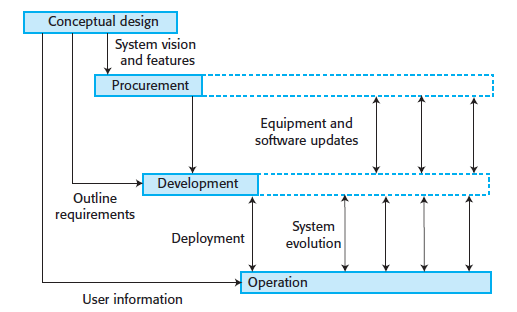
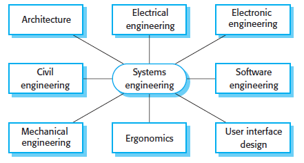

# Systems Engineering

**Autor:** Moritz Withöft

## Einführung

In diesem Kapitel wird sich innerhalb des Systems Engineering mit soziotechnischen Systemen, dem konzeptionellem Design, der Systembeschaffung, der Systementwicklung und dem Systembetrieb bzw. der Weiterentwicklung der Systeme befasst. Sofern nicht anders gekennzeichnet, liegen dargelegte Information und Bilder dem Buch *Software Engineering* von *Ian Sommerville* [[1]](#ref1) zugrunde.

Ein nützlicher Computer besteht sowohl aus Hardware als auch aus Software. Ohne Software besteht das Hardware-System aus einer Reihe von Komponenten, die so keinen wirklichen Zweck erfüllen kann. Ohne Hardware ist ein Software-System wiederum lediglich eine Abstraktion und kann kein laufendes System darstellen. Wenn diese beiden Systeme zusammenarbeiten, erhält man einen grundlegenden Aspekt eines *wirklichen* **Systems**: die einzelnen Komponenten werden verknüpft und arbeiten zusammen. Weiterhin werden Systeme entwickelt, um menschliche Aufgaben und Vorgänge zu unterstützen. Aus diesem Grund muss bei der Entwicklung jedes professionellen Software-Systems nicht nur die Hardware berücksichtigt werden, sondern auch menschliche, soziale und organisatorische Faktoren. Man kann Software-Systeme in zwei Kategorien unterteilen:

- **Technische computerbasierte Systeme** sind Systeme, die Hardware- und Softwarekomponenten beinhalten, jedoch keine Methoden und Prozesse. Als Beispiel werden hierfür Fernseher mit Embedded Software genannt, aber auch Computer und Spiele hierfür. Technische Systeme werden für einen bestimmten Zweck verwendet, aber Kenntnis über diesen Zweck ist - im Gegensatz zu soziotechnischen Systemen -  nicht erforderlich und Bestandteil dessen.
- **Soziotechnische Systeme** umfassen ein oder mehrere technische Systeme, aber auch Personen, die den Zweck des Systems im System verstehen. Soziotechnische Systeme beinhalten definierte Prozesse und Anwender. Schreibt man und veröffentlicht also ein Buch wurde dafür ein soziotechnisches Veröffentlichungssystem mit verschiedenen Prozessen (Erstellung, Bearbeitung, Design) verwendet. Dahinter liegen dann technische Systeme, wie Photoshop oder MS Word.

**Systems Engineering** bezeichnet das Konzipieren und Entwickeln ganzer Systeme, wobei sowohl die Eigenschaften Hardware und Software als auch die menschlichen Elemente innerhalb dieser berücksichtigt werden [[2]](#ref2). Dabei umfasst Systems Engineering alles was unter Systembeschaffung, Systementwicklung, Systembetrieb, Systeminstandhaltung und Spezifizierung des Systems anfällt. Es werden technische und soziotechnische Systeme berücksichtigt.

Innerhalb dieses Kapitels wird sich vorrangig mit **Enterprise-Systemen** beschäftigt. Solche großen und komplexen Systeme sollen, die Ziele und Aufgaben von großen Unternehmen und Organisationen unterstützen. Es handelt sich hierbei um soziotechnische Systeme, die von Unternehmensstruktur aber auch von nationalen und internationalen Gesetzen und Richtlinien beeinflusst werden. Auf Grund ihrer langen Lebensdauer und ihrer wichtigen Rolle für das Unternehmen sollten Softwareentwickler aktive Teilnehmer im Entwicklungsprozess sein.

- Die meisten Entscheidungen werden von Senior-Partnern in den Unternehmen getroffen. Diese haben oft ein limitiertes Verständnis für die unterliegende Software.
- Softwareentwickler bekommen durch die Teilnahme am Entwicklungsprozess ein breiteres Verständnis für die Funktionsweise und Kommunikation mit anderen Systemen, sodass Regularien und Grenzen der Software besser eingehalten werden können.

<figure style="text-align: center;">
    
    <figcaption>Abbildung 1: Phasen von Systems Engineering.</figcaption>
</figure>

*Abbildung 1* stellt die vier - sich überschneidenen - Phasen in der Lebensdauer eines Enterprise-Systems dar. Weiterhin wird der Zusammenhang und die Interaktion dieser Phasen aufgezeigt, sodass dieses Modell als eine Basis für die Systembeschaffung und -entwicklung dient.

1. Das **Konzeptionelle Design** ist die Anfangsphase. Hier wird in möglichst nicht-technischer Sprache der Zweck des Systems festgehalten und die High-Level-Features (Epic-Features), die Nutzer vom System erwarten können formuliert. Dabei werden Grenzen (für die Systementwickler) gesetzt, wie die Notwendigkeit der Zusammenarbeit mit anderen Systemen.
2. Die **Systembeschaffung** soll zur Entscheidung über Verträge für die Systementwicklung dienen. Dafür muss das konzeptionelle Design hinreichend erarbeitet worden sein, sodass auf Grundlage dessen solche Entscheidungen getroffen werden können. Es muss die Verteilung der Funktionalitäten und Prozesse der Software auf die Hardware beschlossen werden. Dafür muss definiert werden, welche Hardware und Software angeschafft werden muss und Bedingungen der Verträge festgehalten werden. Wird ein System nicht intern entwickelt, müssen ebenfalls mögliche Zulieferer benannt werden.
3. Die **Systementwicklung** beschreibt den genau den benannten Vorgang. Dabei werden Anforderungen definiert und präzisiert. Es findet Hardware- und Softwareengineering statt, sodass Systemintegration und Testphasen durchgeführt werden können.
4. **Systembetrieb und -weiterentwicklung** stellt die letzte Phase des Modells dar. Das bedeutet jedoch keinesfalls, dass die anderen Phasen abgeschlossen sind, sondern ebenfalls fortlaufen. In dieser Phase wird das System als Produktivumgebung eingesetzt und Nutzer geschult. Durch die echte Arbeitsumgebung müssen meist Änderungen durchgeführt werden, um das System an das *echte* Arbeiten anzupassen. Diese werden zuvor als Anforderungen aufgenommen.

Während der gesamten Laufzeit des Systems muss dieses von Fachleuten begleitet werden. Dazu gehören die Endnutzer, die Entwickler für Software, Hardware und des Designs, aber auch Manager, die mit den bereits genannten rechtlichen Belangen auseinandersetzen. Bei besonders umfangreichen und komplexen System ist meist eine noch größere Spannweite an Fachleuten aus verschiedenen Bereichen erforderlich. *Abbildung 2* ... [TODO: hier weiter machen]

<figure style="text-align: center;">
    
    <figcaption>Abbildung 2: Erforderliche Disziplinen bei der Erschaffung von Air Traffic Control-Systemen.</figcaption>
</figure>

## Soziotechnische Systeme

## Konzeptionelles Design

## Systembeschaffung

## Systementwicklung

## Systembetrieb und -weiterentwicklung

## Referenzen

[1]: *Ian Sommerville. 2015.* *Software Engineering* *(10th. ed.). Pearson.*

[2]: *White, S., et al.* *Systems Engineering of Computer Based Systems.* *IEEE Computer, November, 1993.*