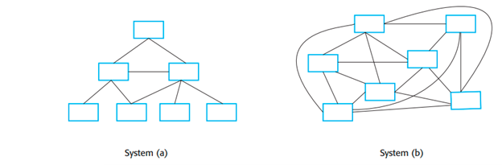
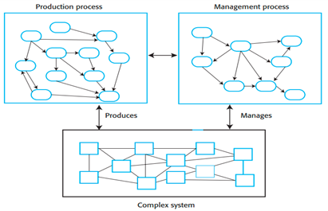
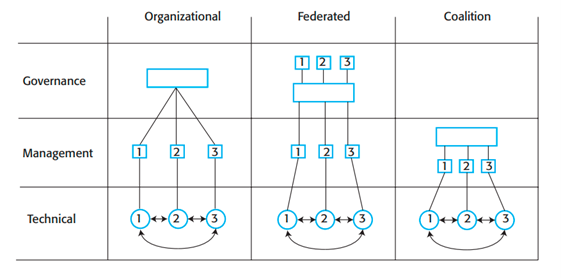
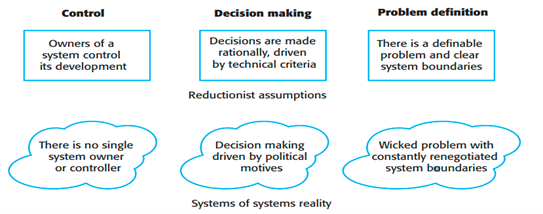
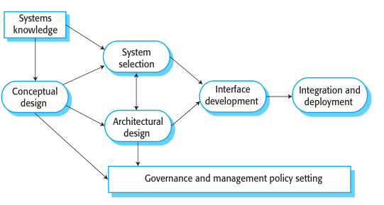
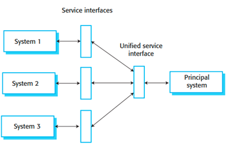
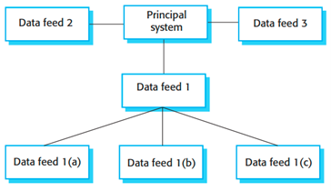
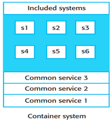
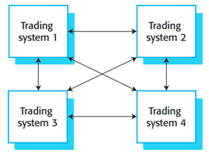

# Systems of systems / Systemverbünde

**Autor:** Steffen Dorsch

Diese Ausarbeitung basiert auf dem Kapitel 20 "Systems of systems" aus der 10. Auflage des Buches "Software Engineering" von Ian Sommerville [1]. Falls keine abweichenden Quellen angegeben wurden, wurde dieses Kapitel als Quelle genutzt. 

## Einleitung

Um große und komplizierte Softwaresysteme zu entwickeln, brauchen wir Software-Engineering. Es wurde in den 1960er Jahren als Folge des Scheiterns der ersten Bemühungen zur Entwicklung großer Softwaresysteme in den 1950er und 1960er Jahren gegründet. Die Herstellung von Software erwies sich als viel kostspieliger und zeitaufwändiger als erwartet, und das Programm selbst erwies sich oft als unzuverlässig. Um diese Probleme zu lösen, wurde eine Vielzahl von Software-Engineering-Methoden und -Technologien entwickelt, die sich als sehr effektiv erwiesen haben. Heute sind Systemarchitekturen möglich, die wesentlich größer, ausgefeilter, zuverlässiger und effektiver sind als die in den 1970er Jahren entwickelten Softwaresysteme.

Vom Standpunkt allgemeiner Systeme aus betrachtet, gibt es keine Unterscheidung zwischen Systemen und einem Systemverbund (engl.System of systems / SoS). Beide haben emergente Qualitäten und können aus Subsystemen aufgebaut sein, was sie ähnlich macht. Vom Standpunkt des Software-Engineering aus betrachtet, existiert ein sinnvoller Gegensatz zwischen diesen beiden Begriffen. Es handelt sich dabei mehr um eine soziotechnische als um eine technische Unterscheidung:

    A system of systems is a system that contains two or more independently managed elements.

Ein SoS ist abgegrentzt durch die Existenz von zwei oder mehr unabhängig voneinander verwalteten Bestandteilen. Es gibt keinen einzigen Verwalter für alle Teile eines Systems, daher unterliegt jede Komponente einem anderen Satz von Regeln und Gesetzen für die Verwaltung und Kontrolle. Die verteilte Verwaltung und Kontrolle hat einen erheblichen Einfluss auf die Gesamtkomplexität des Systems. Man kann SoS auch folgendermaßen definieren: "Ein System ist eine Sammlung von Einheiten und deren Beziehungen untereinander, die zusammen ein Ganzes bilden, das größer ist als die Summe seiner Teile". Nach dieser Auffassung spielt der Umfang von Systemverbünden keine Rolle. In der Informatik bezieht sich ein SoS auf eine kleine Sammlung miteinander verbundener Systeme. Obwohl einige der Herausforderungen des SoS-Engineerings auch auf kleine Systeme zutreffen können, treten die wirklichen Herausforderungen auf, wenn die Komponentensysteme groß angelegte Systeme sind.

Maier [2] und Sommerville [1] haben sieben wesentliche Merkmale der SoS identifiziert:

1. *Operative Unabhängigkeit der Bestandteile:* Teile des Systems sind nicht einfach Komponenten, sondern können als eigenständige Systeme funktionieren. Die Systeme innerhalb des SoS entwickeln sich unabhängig voneinander.
2. *Managementunabhängigkeit der Bestandteile:* Teile des Systems werden von verschiedenen von verschiedenen Organisationen oder von verschiedenen Teilen einer größeren Organisation verwaltet. Daher gelten für die Verwaltung und Entwicklung dieser Systeme unterschiedliche Regeln und Strategien. Dies ist laut Sommerville der Schlüsselfaktor, der ein System von einem SoS unterscheidet.
3. *Evolutionäre Entwicklung:* Systemverbünde werden nicht in einem einzigen Projekt entwickelt, sondern entwickeln sich im Laufe der Zeit aus den einzelnen Systemen, aus denen sie bestehen.
4. *Emergenz:* Systemverbünde haben emergente Eigenschaften, die erst nach Enstehung auftauchen.
5. *Geografische Verteilung der Bestandteile:* Die Bestandteile eines SoS sind häufig geografisch auf verschiedene Organisationen verteilt. Dies ist technisch wichtig, da es bedeutet, dass ein extern verwaltetes Netz ein integraler Bestandteil des SoS ist.
6. *Datenintensität:* Ein Software-SoS stützt sich in der Regel auf eine sehr große Datenmenge und verwaltet diese.
7. *Heterogenität:* Es ist unwahrscheinlich, dass die verschiedenen Systeme in einem Software-SoS mit denselben Programmiersprachen und Entwurfsmethoden entwickelt worden sind. Dies ist eine Folge der sehr schnellen Entwicklung von Softwaretechnologien. Die Unternehmen aktualisieren ihre Entwicklungsmethoden und -werkzeuge häufig, wenn neue, verbesserte Versionen verfügbar werden. Während der 20-jährigen Lebensdauer eines großen SoS können sich genutzte Technologien mehrfach ändern.

## Komplexität der Systeme

In der Einleitung wird festgestellt, dass die inhärente Komplexität von Softwaresystemen die Ursache für die entstehenden technischen Herausforderungen ist. In diesem Abschnitt werden die Systemkomplexität und die vielen Formen der Komplexität, die in Softwaresystemen auftreten können, erläutert. Alle Systeme setzen sich aus Komponenten (Elementen) zusammen, die miteinander interagieren.

|  | 
|:--:| 
| *Abbildung 1: Einfache und komplexe Systeme [1]* |

Ein objektorientierter Programmieransatz verwendet Konstanten, Variablen und Methoden als Bausteine für die Konstruktion eines Programms. Einige Beispiele sind "Aufrufe" (Methode A ruft Methode B auf), geerbt von (Objekt X erbt die Eigenschaften und Merkmale von Objekt Y) und "Teil von" (Methode A ist Teil von Objekt X). Die Komplexität eines Systems wird durch die Anzahl und die Art der Verbindungen bestimmt, die zwischen seinen Bestandteilen bestehen. Abbildung 1 zeigt, dass es zwei Arten von Systemen gibt. Eines der einfachsten Systeme ist (a), das nur wenige Wechselwirkungen zwischen seinen Bestandteilen aufweist. In System (b), das die gleiche Anzahl von Elementen hat, gibt es jedoch viel mehr Verbindungen zwischen den Elementen als in System (a).

Die Komplexität eines Systems wird auch durch die Art der Interaktion mit anderen Systemen beeinflusst. Beziehungen, die anhand statischer Darstellungen des Systems analysiert werden können, werden als "statische" Verbindungen bezeichnet. Das bedeutet, dass die Verbindung zwischen "Anwendungen" und "System" in einem Softwaresystem statisch ist. Die Abhängigkeiten einer Softwarekomponente von anderen Komponenten lassen sich aus dem Quellcode oder einem UML-Modell des Systems ableiten. Die Verbindungen in einem Betriebssystem sind dynamischer Natur. In jedem System, das if-Abfragen enthält, ist es unmöglich vorherzusagen, ob eine Methode eine andere aufruft, daher ändert sich die Verbindungen ständig. Sie ist eine Funktion der Eingaben des Systems zur Laufzeit. Es ist schwieriger, dynamische Verbindungen zu bewerten, da man dazu das System inklusive Daten, sowie die Systemsoftware des Systems kennen muss.

Auch die Schwierigkeiten bei den Methoden zur Erstellung und Wartung des Systems nach seiner Inbetriebnahme müssen berücksichtigt werden. Abbildung 2 veranschaulicht die Wechselbeziehung zwischen diesen Prozessen und dem entstehenden System.

|  | 
|:--:| 
| *Abbildung 2: Produktions- und Verwaltungsprozesse [1]* |

Die Komplexität von Planungs- und Fertigungsprozessen nimmt mit der Größe der Systeme zu. Komplexe Systeme sind nichts nur die Summe ihrer Teile. Durch ihre Komplexität können ungewöhnliche Eigenschaften entstehen. Sie benötigen mehr Zeit, mehr Dokumentation und mehr Koordination zwischen den an der Systemgestaltung beteiligten Personen und Organisationen. Eine der Hauptursachen dafür, dass Projekte aus dem Ruder laufen und Software zu spät und über dem Budget geliefert wird, ist die Komplexität des Herstellungsprozesses. Infolgedessen besteht bei großen Systemen ständig die Gefahr von Kosten- und Zeitüberschreitungen. Da die Komplexität die größte Auswirkung auf die Fähigkeit eines Systems hat, verstanden und geändert zu werden, ist sie ein wesentlicher Faktor bei der Softwareentwicklung.

Die systemische Komplexität erhöht die Schwierigkeit, ein System zu verstehen und zu analysieren. Große Systeme sind zwangsläufig komplizierter als kleine, da die Komplexität von der Anzahl der Verbindungen zwischen ihren Komponenten abhängt. Je komplexer ein System ist, desto wahrscheinlicher ist es, dass eine Änderung in einer Komponente des Systems unbeabsichtigte Folgen an anderer Stelle haben kann. Soziotechnische Systeme sind in vielerlei Hinsicht kompliziert:

- Die *technische Komplexität* des Systems ergibt sich aus den Beziehungen zwischen den verschiedenen Systemkomponenten.
- Die *Verwaltungskomplexität:* des Systems ergibt sich durch die Beziehungen zwischen dem System und der Verwaltung und den Beziehungen zu Verwaltungen anderer Teilsysteme.
- Die *Governance-Komplexität:* Wie kompliziert die Governance-Struktur eines Systems ist, hängt davon ab, wie sehr die vielen Beteiligten miteinander verbunden sind. Da die verschiedenen Systeme innerhalb dieses SoS in verschiedenen Organisationen und Ländern angesiedelt sein können, können unterschiedliche Regeln, Richtlinien und Grundsätze gelten.

Die Eigenschaften eines SoS können zu erhöhter Komplexität führen. Abbildung 3 erläutert die Auswirkung der Eigenschaften auf die Komplexitätsarten.

| SoS Eigenschaft | Technische  Komplexität | Verwaltungs- komplexität | Governance- komplexität | Beschreibung |
|---|:---:|:---:|:---:|---|
| Operative Unabhängigkeit |  | x | x | Unterschiedliche Strategien, Regeln und Möglichkeiten zur Verwaltung |
| Verwaltungsunabhängigkeit | x | x |  | Unterschiedliche Verwaltung |
| Evolutionäre Entwicklung | x |  |  | Unterschiedliche Technologien |
| Emergenz | x |  |  | Unerwünschte emergente Eigenschaften |
| Geografische Verteilung | x | x | x | Unterschiedliche Länder |
| Datenintensiv | x |  | x | Unterschiedliche Datenbeziehungen |
| Heterogenität | x |  | x | Unterschiedliche Kompatibilität |

|| 
|:--:| 
| *Abbildung 3: SoS Eigenschaften und Systemkomplexität [1]* |

1. *Operative Unabhängigkeit:*  Die einzelnen Systeme des SoS unterliegen unterschiedlichen Strategien und Regeln (Governance-Komplexität) und Möglichkeiten zur Verwaltung des Systems (Management-Komplexität).
2. *Verwaltungsunabhängigkeit:* Die einzelnen Systeme des SoS werden von verschiedenen Personen auf unterschiedliche Weise verwaltet. Sie müssen sich abstimmen, um sicherzustellen, dass die Änderungen in der Verwaltung konsistent sind (Komplexität der Verwaltung). Zur Unterstützung einer konsistenten Verwaltung und Entwicklung kann eine spezielle Software erforderlich sein (technische Komplexität).
3. *Evolutionäre Entwicklung:* Die evolutionäre Entwicklung trägt zur technischen Komplexität eines SoS bei, weil verschiedene Teile des Systems wahrscheinlich mit unterschiedlichen Technologien gebaut werden.
4. *Emergenz*: Emergenz ist eine Folge von Komplexität. Je komplexer ein System ist, desto wahrscheinlicher ist es, dass es unerwünschte emergente Eigenschaften aufweist. Diese Eigenschaften erhöhen die technische Komplexität des Systems, da die Software entwickelt oder geändert werden muss, um sie zu kompensieren. entwickelt oder geändert werden muss, um sie zu kompensieren.
5. *Geografische Verteilung:* Die geografische Verteilung erhöht die technische, verwaltungstechnische und Governance-Komplexität in einem SoS. Die technische Komplexität nimmt zu, weil Software für die Koordinierung und Synchronisierung entfernter Systeme erforderlich ist; die Komplexität der Verwaltung nimmt zu, weil es für Manager in verschiedenen Ländern schwieriger ist, ihre Maßnahmen zu koordinieren; die Komplexität der Verwaltung nimmt zu, weil sich verschiedene Teile der Systeme in verschiedenen Ländern befinden können und somit unterschiedlichen Gesetzen und Vorschriften unterliegen.
6. *Datenintensiv:* Datenintensive Systeme sind aufgrund der Beziehungen zwischen den Datenelementen technisch komplex. Die technische Komplexität wird wahrscheinlich auch erhöht, um mit Datenfehlern und Unvollständigkeit fertig zu werden. Die Komplexität der Verwaltung kann durch unterschiedliche Gesetze, die die Verwendung von Daten regeln, erhöht werden.
7. *Heterogenität:* Die Heterogenität eines Systems trägt zu seiner technischen Komplexität bei, da es schwierig ist, die Kompatibilität der in den verschiedenen Teilen des Systems verwendeten Technologien sicherzustellen. des Systems kompatibel sind.

## Klassifikation von SoS

Nach einer zuvor erläuterten Theorie zeichnen sich Systemverbünde dadurch aus, dass zwei oder mehr ihrer Komponenten unabhängig voneinander verwaltet werden. Die täglichen operativen Entscheidungen über Änderungen am System werden von einer Vielzahl von Personen getroffen, die jeweils unterschiedliche Prioritäten haben. Es kann viel Zeit und Mühe kosten, Probleme zu lösen, da die Arbeit nicht immer aufeinander abgestimmt ist. Infolgedessen gibt es in Systemen immer ein gewisses Maß an Managementkomplexität. Die Freiheit, die eigenen Ziele zu verwirklichen, ist der eigentliche Grund für die Existenz eines Systems. Natürlich ist eine solche Unabhängigkeit mit eigenen Regeln verbunden. Es gibt zwar Grenzen, aber sie dürfen die Fähigkeit des Systems, das zu tun, wofür es geschaffen wurde, nicht einschränken. Wäre dies der Fall, würde die Struktur der Notwendigkeit verworfen und eine neue entwickelt werden, um sie zu ersetzen. Effektivität und Effizienz sind hier eher weniger die Schuldigen. Für eine Komponente, die für ein System wesentlich ist, kann Ähnliches gelten [3]. Diese weit gefasste Definition von SoS umfasst hingegen eine Vielzahl von Systemkonfigurationen. Sie umfasst Systeme, die sich im Besitz einer einzigen Organisation befinden, aber von vielen Abteilungen innerhalb dieses Unternehmens als kollektives Ganzes betrieben werden. Einige Systeme enthalten Komponenten, die vielen Unternehmen gehören und von ihnen betrieben werden, von denen einige von Zeit zu Zeit miteinander konkurrieren können. Maier [2] schlug eine Kategorisierungsstruktur für SOS vor, die sich an der Komplexität der Governance und der Verwaltung orientiert:

1. *Gesteuerte Systeme:* Gesteuerte SoS entstehen durch die Kombination von Systemen, die derselben Einrichtung gehören, die sie geschaffen hat. Die Komponenten des Systems können von verschiedenen Teilen der Organisation verwaltet werden. Die Prioritäten der Systemverwaltung können vom obersten Führungsgremium der Organisation festgelegt werden. Es ist nützlich, um Streitigkeiten zwischen den vielen Verwaltungen des Systems zu schlichten. Ein gerichtetes System hat eine gewisse Verwaltungskomplexität, aber keine Governance-Komplexität. Ein direktes SoS ist ein Beispiel für ein luftgestütztes kombiniertes bodengestütztes Befehlsstrukturnetz.
2. *Kollaborative Systeme:* Im Gegensatz zum traditionellen SoS gibt es beim kollaborativen SoS keine zentrale Stelle, die die Prioritäten der Verwaltung festlegt oder Konflikte regelt. In der Regel sind mehrere Stellen für verschiedene Aspekte des Eigentums und der Verwaltung des Systems zuständig. Andererseits erkennen alle beteiligten Gruppen die gegenseitigen Vorteile einer Zusammenarbeit bei der Verwaltung des Systems. Infolgedessen richten sie häufig eine freiwillige Governance-Struktur ein, die Entscheidungen über das System trifft. Die Komplexität des Managements und der Steuerung ist auch in kollaborativen Systemen vorhanden, jedoch in geringerem Maße. Ein kollaborativer Systemverbund, wie z. B. ein vernetztes Informationssystem für den öffentlichen Verkehr, ist ein Beispiel für Zusammenarbeit. Bus-, Bahn- und Luftverkehrsunternehmen haben sich darauf geeinigt, ihre Systeme zu integrieren, um den Kunden möglichst aktuelle Informationen über ihre Routen zu geben.
3. *Virtuelle Systeme:* In virtuellen Systemen gibt es keine zentrale Verwaltungsstruktur, und die Mitglieder sind sich möglicherweise nicht über das Hauptziel des Systems einig, was ein Risiko darstellt. Die teilnehmenden Systeme haben die Möglichkeit, dem SoS beizutreten und es zu verlassen. Die Interoperabilität ist nicht garantiert und hängt von öffentlich verfügbaren Schnittstellen ab, die sich jederzeit ändern können. Diese Technologien weisen ein hohes Maß an Komplikationen bei der Verwaltung und Steuerung auf, was ihre Verwaltung und Regulierung erschwert. Ein automatisiertes algorithmisches Hochgeschwindigkeitshandelssystem ist zum Beispiel ein Abbild eines virtuellen SoS. Die Kauf- und Verkaufsaufträge des Systems werden zwischen verschiedenen Unternehmen übermittelt, und die Transaktionen werden innerhalb von Mikrosekunden ausgeführt.

Auch wenn es in einem "virtuellen" SoS keine formalen Methoden für die Zusammenarbeit gibt, bietet das System trotz des Fehlens formaler Prozesse einen gewissen Wert für alle Mitglieder. Infolgedessen werden sie wahrscheinlich informell zusammenarbeiten, um zu gewährleisten, dass das System weiterhin funktionieren kann. 

|  | 
|:--:| 
| *Abbildung 4: SoS-Kollaboration [1]* |

Abbildung 4 zeigt, wie diese verschiedenen Systeme zusammenarbeiten. Als Alternative zu Maiers Definition hat Sommerville weitere, beschreibendere Definitionen gewählt:

1. *Organisations-SoS:* Diese SoS werden von einer einzigen Organisation oder einem einzigen Unternehmen verwaltet und geleitet und sind nicht Teil eines größeren Systemverbünden. Die Organisation überwacht die Koordinierung der Bemühungen ihrer Mitglieder. Ist das SoS geografisch verstreut, können für verschiedene Bereiche des Systems unterschiedliche nationale Vorschriften und Regelungen gelten. Alle drei in Abbildung 4 dargestellten Systeme werden einzeln kontrolliert, unterliegen jedoch alle einer zentralen Steuerung.
2. *Föderative SoS:* Alle Eigentümer des Systems können in einem freiwilligen partizipatorischen Gremium vertreten sein, welches das SoS in einer föderativen Weise verwaltet. Die Eigentümer der Systeme 1, 2 und 3 nehmen an einem einzigen Leitungsgremium teil, wie in Abbildung 4 dargestellt. Die Eigentümer des Systems haben vereinbart, zusammenzuarbeiten, und vertrauen auf die Entscheidungsbefugnis des Leitungsgremiums. Aufgrund von nationalen Gesetzen, Regeln und kulturellen Normen wenden sie diese Entscheidungen in ihrer eigenen Managementpolitik an.
3. *Systemkoalitionen:* Es gibt keine expliziten Verwaltungsverfahren in diesen Zusammenschlüssen, aber die beteiligten Organisationen koordinieren und verwalten ihre eigenen Systeme informell, um das System als Ganzes am Laufen zu halten. Das Datenformat darf nicht ohne Vorwarnung geändert werden, wenn ein System Daten in ein anderes einspeist. In Abbildung 4 besteht die informelle Zusammenarbeit auf der Managementebene fort, obwohl es auf der Organisationsebene keine Governance gibt.

Dieser Kategorisierungsansatz kann für das SOS-Management und um den Governance-Bedarf zu ermitteln, angewandt werden. Anhand dieses Modells kann festgestellt werden, ob die richtigen Governance-Strukturen vorhanden sind und ob es sich um die benötigten Strukturen handelt. Die Einrichtung dieser Strukturen in Unternehmen ist ein langwieriger Prozess, der zudem noch politisch ist. Wenn das Governance-Problem verstanden wurde und frühzeitig Maßnahmen ergriffen werden, kann sichergestellt werden, dass eine angemessene Governance vorhanden ist. Um ein System in der Hierarchie nach oben zu bringen, muss das Governance-Modell möglicherweise geändert werden. Wenn das Governance-Modell in Abbildung 4 nach links verschoben wird, werden die Dinge tendenziell einfacher.

## Reduktionismus und komplexe Systeme

Bestehende Software-Engineering-Ansätze und -Technologien sind möglicherweise nicht in der Lage, die Komplexität heutiger SoS zu bewältigen. Der technische Fortschritt wurde schon immer durch anspruchsvolle und schwierige Probleme vorangetrieben. Aufgrund von Misserfolgen und Herausforderungen mit aktuellen Methoden und Werkzeugen wurden neue Ansätze entwickelt.

Das Thema Software-Engineering hat sich in den letzten Jahrzehnten enorm weiterentwickelt, um die ständig wachsende Komplexität und den Umfang von Softwaresystemen zu bewältigen. Dies war ein enormer Erfolg. Die Komplexität und Größe von Systemen nahm zwischen den 1960er und 1970er Jahren dramatisch zu.

Der Reduktionismus ist, wie auch in anderen technischen Bereichen, die Grundlage des Komplexitätsmanagements in der Softwareentwicklung. Philosophisch gesehen basiert der Reduktionismus auf der Prämisse, dass alle Systeme aus Komponenten oder Subsystemen zusammengesetzt sind. Annahme: Das Verhalten und die Eigenschaften des Systems lassen sich erklären und vorhersagen, wenn man zunächst die einzelnen Teile und ihre Wechselwirkungen kennt. Auf diese Weise wird ein System entworfen: Die einzelnen Komponenten werden herausgelöst, einzeln aufgebaut und dann zum endgültigen System zusammengefügt. Eltern- und Kindknoten in einem hierarchischen System sind entscheidend für das Verständnis, wie ein System zusammengesetzt ist. [4]

Alle Formen der Technologie stützen sich seit ihren Anfängen auf den Reduktionismus, und diese Tradition ist ungebrochen. Bei der Verwendung der gleichen Art von Systemen können gemeinsame Abstraktionen gesucht werden, die unabhängig voneinander entworfen und gebaut werden können. Sie können dann zu einer vollständigen Lösung zusammengefügt werden. Zu den Abstraktionen eines Fahrzeugs gehören beispielsweise eine Karosserie, ein Antriebsstrang, ein Motor usw. Es ist möglich, jede Komponente des Systems unabhängig voneinander zu entwerfen und zu implementieren, da die Verbindungen zwischen diesen Darstellungen gering sind.

In den 1970er Jahren wurde erkannt, dass es Unterschiede zwischen Software- und Hardwarekomponenten gibt. Die Notwendigkeit, die Wechselwirkungen zwischen den Komponenten eines Systems einzuschränken und zu verwalten, wurde durch Entwurfsmethodiken unterstrichen. Nach diesen Grundsätzen sollten die Komponenten eng integriert werden, aber ihre Verbindungen sollten locker sein. Eine tiefe Integration hatte zur Folge, dass die meisten Verbindungen innerhalb des Elements lagen, und eine lose Kopplung hatte zur Folge, dass es nur wenige Beziehungen zwischen den Komponenten gab. Die objektorientierte Softwaretechnik entstand aus der Notwendigkeit einer engen Integration (sowohl in Bezug auf Daten als auch auf Prozesse) und einer losen Kopplung.

Folglich ist es sehr schwierig, die Anzahl und die Art der Beziehungen in großen Systemen, und insbesondere in Systemverbünden, wirksam zu regeln. Der reduktionistische Ansatz funktioniert nicht, wenn es in einem System zahlreiche miteinander verknüpfte Glieder gibt und wenn diese Verknüpfungen schwer zu verstehen und zu bewerten sind. Infolgedessen würde jede Form von Systementwicklung in großem Maßstab mit Sicherheit auf Herausforderungen stoßen.

|  | 
|:--:| 
| *Abbildung 5: Reduktionistische Annahmen und die Realität komplexer Systeme [1]* |

Da die Grundannahmen des Reduktionismus jedoch sowohl für große als auch für komplexe Systeme völlig irrelevant sind, kann der reduktionistische Ansatz zu Problemen führen. Diese Grundannahmen sind in Abbildung 5 dargestellt und gelten für drei verschiedene Regionen:

1. *Eigentum und Kontrolle des Systems:* Die Reduktionisten gehen davon aus, dass es eine zentrale Autorität für ein System gibt, die in der Lage ist, Meinungsverschiedenheiten zu lösen und systemweite, hochrangige technische Entscheidungen zu treffen. Wie wir gezeigt haben, ist dies bei Systemverbünden nicht der Fall, da sie von mehreren Stellen verwaltet werden.
2. *Rationale Entscheidungsfindung:* Die rationale Entscheidungsfindung mittels mathematischer Modellierung setzt voraus, dass die Wechselwirkungen zwischen verschiedenen Komponenten objektiv bewertet werden können. Die Entscheidungsfindung wird durch diese Beurteilungen bestimmt. Anders ausgedrückt: Man geht davon aus, dass ein reduktionistischer Ansatz bei der Fahrzeugkonstruktion zu einer optimalen Kraftstoffeffizienz ohne Leistungseinbußen führt.
3. *Definierte Systemgrenzen:* Im Rahmen des Reduktionismus wird davon ausgegangen, dass die Grenzen eines Systems vereinbart und festgelegt sind. So definiert beispielsweise die physische Hülle eines Autos das System, die Überquerung einer Brücke über ein bestimmtes Gewässer tut dasselbe usw. Dies ist jedoch nicht immer der Fall: Schwerwiegende Herausforderungen erfordern in der Regel die Entwicklung komplexer Systeme. Entscheidungen darüber, was Teil eines Systems ist und was nicht, können subjektiv sein, und oft gibt es Streitigkeiten zwischen den Beteiligten.

Wenn es jedoch um komplexe Systeme geht, versagen diese reduktionistischen Konzepte, und die Probleme werden noch verschärft, wenn es sich um softwareintensive Systeme handelt:

1. Die Verbindungen in Softwareanwendungen werden nicht wie in komplexen Prozessen durch physikalische Regeln geregelt. Wir werden nicht in der Lage sein, mathematische Modelle von Softwaresystemen zu erstellen, die ihr Verhalten und ihre Eigenschaften genau vorhersagen können. Infolgedessen fehlt uns eine wissenschaftliche Grundlage, auf der wir Entscheidungen treffen können. Wenn es um große und komplizierte Softwaresysteme geht, sind politische Fragen oft die treibende Kraft bei der Entscheidungsfindung.
2. Da Software keinen physischen Zwängen unterliegt, gibt es keine Einschränkungen, wo die Grenzen eines Systems festgelegt werden müssen. Verschiedene Interessengruppen würden argumentieren, dass die Grenzen so festgelegt werden sollten, wie es für sie individuell am vorteilhaftesten ist. Außerdem ist es viel einfacher, die Softwareanforderungen anzupassen als die Hardwarekompatibilität zu ändern. Während des Systementwurfs können sich die Grenzen und die Struktur des Projekts ändern.
3. Der Prozess der Verknüpfung von Softwaresystemen mehrerer Eigentümer ist recht einfach; daher wird man eher versuchen, ein SoS zu schaffen, bei dem es keine einzige Kontrollinstanz gibt. Es ist unmöglich, eine umfassende Kontrolle über die Verwaltung und Entwicklung der vielen betroffenen Systeme auszuüben.

Als Ergebnis dieser Faktoren resultieren massive Herausforderungen für Software- und Systemengineering. Das Scheitern großer staatlicher Programme wie der Automatisierung des Gesundheitswesens im Vereinigten Königreich und in den Vereinigten Staaten ist nicht auf technologische oder Projektmanagementmängel zurückzuführen, sondern vielmehr auf Komplexität.

Auch wenn die Entwicklung dieser Ansätze nicht zu einer Steigerung der Fähigkeit führen wird, große SoS zu entwerfen, wird dies aufgrund der Grundannahmen, die dem Reduktionismus zugrunde liegen, auch nicht geschehen. Stattdessen werden neue Abstraktionen, Methoden und Werkzeuge benötigt, die der Komplexität des SoS-Engineerings in Bezug auf technologische, menschliche, soziale und politische Aspekte Rechnung tragen. Diese neuen Methoden werden probabilistisch und statistisch sein, und die Werkzeuge werden auf Systemsimulationen basieren. Im 21. Jahrhundert steht die Software- und Systemengineering bei der Einführung dieser neuen Techniken vor einer großen Herausforderung.

## SoS-Engineering

Neue Funktionen und Fähigkeiten können mit Hilfe des Systemengineering durch Zusammenlegung bestehender Systeme geschaffen werden. Systemverbünde werden nicht von Grund auf neu aufgebaut. Stattdessen entsteht ein SoS aus der Erkenntnis einer Organisation, dass bestehende Systeme durch deren Integration in ein SoS verbessert werden können. Eine lokale Verwaltung möchte zum Beispiel die Luftverschmutzung in bestimmten Stadtteilen minimieren. Um dieses Ziel zu erreichen, könnte ein landesweites System zur Überwachung der Luftverschmutzung in Echtzeit in das Verkehrsmanagementsystem integriert werden. Infolgedessen kann das Verkehrsleitsystem sein Konzept zur Verringerung der Luftverschmutzung anpassen, indem es z. B. die Abfolge der Verkehrssignale und die Geschwindigkeitsbeschränkungen ändert [5]. Probleme im Zusammenhang mit den Herausforderungen bei der Zusammenschaltung breiter Anwendungsnetze sind denen des SoS-Engineering recht ähnlich. Zu diesen gehören:

1. Es fehlt die Kontrolle darüber, wie das System funktioniert und arbeitet.
2. Vorhersagen, die von den Entwicklern der einzelnen Systeme gemacht wurdenm können divers und unvereinbar sein
3. Für diverse Systeme gibt es unterschiedliche Methoden und Zeitrahmen für die Entwicklung, die berücksichtigt werden sollten.
4. Wenn Probleme auftauchen, gibt es niemanden, an den man sich wenden kann, außer den Eigentümern des Systems, um Hilfe zu erhalten.

Die Lösung dieser Herausforderungen macht einen erheblichen Teil der Arbeit aus, die mit der Entwicklung von Systemen aus Softwaresystemen verbunden ist. Die Systemarchitektur muss festgelegt werden, Software-Schnittstellen müssen entwickelt werden, um Diskrepanzen zwischen den beteiligten Systemen auszugleichen, und das System muss für unvorhergesehene Änderungen, die auftreten können, robust gemacht werden.

### SoS Engineering-Prozess

|  | 
|:--:| 
| *Abbildung 6: SoS Engineering-Prozess [1]* |

SoS sind große und komplexe Gebilde. Die für verwendeten Entwicklungsprozesse variieren stark, je nach Art der beteiligten Systeme, dem Anwendungsbereich und den Bedürfnissen der an der Entwicklung des SoS beteiligten Organisationen. Es gibt jedoch fünf allgemeine Aktivitäten, die in SoS-Entwicklungsprozesse eingebunden sind, siehe Abbildung 6:

1. *Konzeptioneller Entwurf:* Erstellung einer abstrakten Vision, Defintion grundlegender Anforderungen und Ermittlung von Rahmenbedingungen für das Gesamtsystem.
2. *Systemauswahl:* Auswahl durch Beurteilung und Bewertung existierender Systeme.
3. *Architektonisches Design:* Eine Gesamtarchitektur für das SoS muss entwickelt werden.
4. *Entwicklung von Schnittstellen:* Die verschiedenen an einem SoS beteiligten Systeme haben in der Regel inkompatible Schnittstellen. Daher besteht ein großer Teil des Software-Engineering-Aufwands bei der Entwicklung eines SoS darin, Schnittstellen zu entwickeln, damit die einzelnen Systeme zusammenarbeiten können. Dies kann auch die Entwicklung einer einheitlichen Benutzerschnittstelle beinhalten, so dass die Benutzer des SoS nicht mit mehreren Benutzerschnittstellen zurechtkommen müssen, wenn sie die verschiedenen Systeme des SoS nutzen.
5. *Integration und Bereitstellung:* Die verschiedenen am SoS beteiligten Systeme müssen über die entwickelten Schnittstellen zusammenarbeiten und interoperieren. Die Systemeinführung bedeutet, dass das System in den betreffenden Organisationen integriert und in Betrieb genommen wird.

### Entwicklung von Schnittstellen

In den meisten Fällen wird jedes der Systeme in einem SoS für eine bestimmte Funktion geschaffen. Aus diesem Grund ist die Gestaltung ihrer Benutzeroberfläche zweckgebunden. Es kann sein, dass es für diese Systeme APIs gibt, die es anderen Systemen ermöglichen, direkt mit ihnen zu kommunizieren, oder auch nicht. Wenn diese Systeme zu einem SoS zusammengeführt werden, müssen daher Softwareschnittstellen entwickelt werden, damit die Komponentensysteme zusammenarbeiten können.

Es ist wahrscheinlich, dass die Komponenten eines SoS jeweils ihre eigene spezialisierte API haben oder den Zugriff auf ihre Fähigkeiten nur über die von ihnen bereitgestellten Schnittstellen ermöglichen. Folglich muss Software entwickelt werden, um die Lücken zwischen diesen unterschiedlichen Schnittstellen zu schließen. Wenn möglich, sollten diese Schnittstellen als dienstbasierte Schnittstellen implementiert werden, wie in Abbildung 7 dargestellt.

|  | 
|:--:| 
| *Abbildung 7: Systeme mit Serviceschnittstellen [1]* |

### Integration und Bereitstellung

Der Prozess der Integration und der Bereitstellung eines Systems wird oft getrennt durchgeführt. Wenn ein System einsatzbereit ist, setzt ein Integrations- und Testteam die Teile zusammen, prüft die Funktionalität und stellt es dann zur Nutzung bereit. Um sicherzustellen, dass Änderungen geregelt sind und die erforderliche Version in das System aufgenommen wird, werden die Komponenten überwacht. Bei SoS ist dies jedoch möglicherweise nicht möglich. Das Integrationsteam hat keinen Einfluss auf die Bereitstellung oder Nutzung bestimmter Komponentensysteme.

Die Integration und die Bereitstellung sind zwei verschiedene Schritte bei der Implementierung einer Software-as-a-Service (SaaS). Im folgenden Abschnitt werden einige Designkriterien diskutiert, um einen unvollständigen Systenverbund nutzbar zu machen. Neue Systeme müssen in das SoS eingeführt werden, wobei mit den bereits vorhandenen Systemen begonnen werden muss, um ein kohärentes Engagement für den Betrieb des Gesamtsystems zu gewährleisten.

Integrationstests für SoS sind teuer und zweitaufwendig:

1. Keine detaillierten Anforderungsspezifikationen
2. Die Systeme können sich verändern, sodass Tests nicht wiederholbar sind
3. Bei Problemen: Behebung durch Änderung der Systeme evtl. nicht möglich => Zwischensoftware zur Problembehebung notwendig

## SoS Architektur

Die vielleicht kritischste Aktivität im gesamten Systementwicklungszyklus ist die Phase des Architekturentwurfs. Die Auswahl der einzubeziehenden Systeme, die Bewertung der Interaktionen und die Entwurfsmethoden für die Interoperabilität sind allesamt Bestandteile des Architekturentwurfs bei der Entwicklung des SoS. Entscheidungen über Datenmanagement, Redundanz und Kommunikation müssen getroffen werden, um die Integrität der Daten zu gewährleisten. Die Aufgabe des SoS-Architekten besteht darin, dafür zu sorgen, dass das in der Entwurfsphase des Systems festgelegte Ziel erreicht wird. Bei Unternehmenssystemen und föderierten Systemen im Allgemeinen sind die in dieser Phase getroffenen Entscheidungen von entscheidender Bedeutung für deren Leistung, Haltbarkeit und Wartbarkeit.

Zu den von Maier [2] vorgestellten Ansätzen für komplizierte Systemarchitekturen gehören die folgenden:

1.	Auch wenn ein System fehlerhaft ist, sollte es dennoch funktionieren. Systeme sind nützlich, wenn alle ihre Teilsysteme gut funktionieren. Ein partielles System braucht mehr "stabile Zwischenformen", um zu funktionieren und nützlich zu sein.
2.	Erkenne deine Macht, Dinge zu verändern. Wenn eine Person oder Gruppe für das System und seine Komponenten verantwortlich ist, funktioniert das SoS am besten. Ohne Kontrolle ist es schwierig, die Vorteile des SoS zu vermitteln. Versuche, das SoS zu steuern, werden wahrscheinlich auf Widerstand der Systemeigentümer stoßen und zu Schwierigkeiten bei der Einführung und Entwicklung des Systems selbst führen.
3.	Das System kommuniziert mit anderen Systemen. Interoperable Schnittstellen sind wichtig für die Verwirklichung eines SoS. Damit sich die Systemkomponenten entwickeln und weiterentwickeln können, sollten diese Verbindungen nicht zu restriktiv sein.
4.	Andere davon überzeugen, zusammenzuarbeiten. Anreize für jeden Eigentümer, die Beteiligung aufrechtzuerhalten, sind von entscheidender Bedeutung, wenn Teile des Systems unabhängig voneinander besessen und verwaltet werden. Finanzielle Anreize (Bezahlung pro Nutzung oder reduzierte laufende Ausgaben), Zugangsanreize (Sie teilen Ihre Daten, ich teile meine) oder soziale Anreize können angewandt werden.

SoS-Architekten müssen einen weiten Blickwinkel haben. Sie müssen bei ihren Entscheidungen sowohl die technischen als auch die soziotechnischen Aspekte des Systems als Ganzes berücksichtigen. In manchen Fällen besteht der ideale Ansatz darin, die Regeln und Vorschriften, die die Funktionsweise des Systems steuern, zu ändern, anstatt eine neue Software zu implementieren.

### Architekturmuster für SoS

Der Begriff Architekturmuster kann verwendet werden, um einen Architekturstil zu beschreiben, der in einer Vielzahl von Systemen zu finden ist. Eine gute Technik, um Menschen dazu zu bringen, über den bestmöglichen Entwurf für ein System nachzudenken, ist die Verwendung von Architekturmustern. In diesem Abschnitt werden viele "typische" Muster in Computersoftwaresystemen diskutiert. Reale Systeme sind, wie alle Architekturmuster, aus einer Kombination vieler dieser Muster aufgebaut [5].

#### Systeme als Datenfeeds

Das Basissystem in dieser Architektur (Abbildung 8) erfordert die Verwendung von Daten in verschiedenen Formen. Diese Informationen sind von anderen Systemen zugänglich, und das Hauptsystem kommuniziert mit diesen Systemen, um die benötigten Informationen zu erhalten. In den meisten Fällen kommunizieren die Systeme, die die Daten liefern, nicht miteinander. Diese Tendenz ist häufig bei organisatorischen oder föderalen Organisationen zu beobachten, die über eine Art Führungsstruktur verfügen, wie z. B. die Vereinten Nationen.

|  | 
|:--:| 
| *Abbildung 8: Systeme als Datenfeeds mit einer vereinheitlichenden Schnittstelle [1]* |

Eine Alternative zur "System as a feed"-Architektur entsteht, wenn eine Reihe vergleichbarer, aber nicht identischer Systeme Daten anbieten. In Abbildung 8 ist eine Zwischenschicht dargestellt, die für den Entwurf erforderlich ist [2].

#### Containersysteme

Es gibt Systeme, die in einem Container zusammenarbeiten. Ein System fungiert als virtueller Container und stellt eine Reihe gemeinsamer Dienste zur Verfügung, z. B. einen Authentifizierungsdienst und einen Speicherdienst. Anschließend werden weitere Systeme konzeptionell in diesen Container hineingestellt, um ihre Fähigkeiten den Systembenutzern zur Verfügung zu stellen. In Abbildung 9 ist ein Containersystem mit den folgenden drei Operationen und sechs integrierten Systemen schematisch dargestellt.

|  | 
|:--:| 
| *Abbildung 9: Containersysteme [1]* |

#### Handelssysteme

Bei Handelssystemen handelt es sich um SoS, bei denen die Aktivitäten in jedem der Komponentensysteme stattfinden können und es kein einziges zentrales System gibt. Die betreffenden Systeme tauschen untereinander Informationen aus. Die Interaktionen zwischen diesen Systemen können eins-zu-eins oder eins-zu-viele sein. Jedes System stellt seine eigenen Schnittstellen zur Verfügung, wobei es möglicherweise keine allgemein akzeptierten Schnittstellenstandards gibt. Abbildung 10 veranschaulicht diesen Aufbau. Bei den Handelssystemen kann es sich um dezentralisierte Systeme oder um Koalitionen von Handelssystemen handeln.

|  | 
|:--:| 
| *Abbildung 10: Ein Handels-SoS [1]* |

In dieser Art von System gibt es keine wirkliche Governance-Struktur, so dass sich jedes der beteiligten Systeme jederzeit ändern kann. Die Händler werden aufgrund dieser Entwicklungen nicht in der Lage sein, Geschäfte zu tätigen. Es ist nicht ungewöhnlich, dass die Systemeigentümer in einer Koalition informelle Vereinbarungen treffen, um sicherzustellen, dass Änderungen an einem System den Handel mit anderen Systemen nicht erschweren. Beispielsweise kann eine Fluggesellschaft ihr System absichtlich so aktualisieren, dass es nicht mehr zugänglich ist, um Kunden zu zwingen, direkt bei ihr zu buchen, anstatt über einen Reiseaggregator.

## Quellenverzeichnis

[1] Sommerville, Ian. Software Engineering: 10th edition. ISBN 978-0-13-394303-0. Pearson Education Limited, 2016.

[2] Maier, M. W. 1998. “Architecting Principles for Systems-of-Systems.” Systems Engineering 1 (4):
267–284. doi:10.1002/(SICI)1520-6858(1998)1:4<267::AID-SYS3>3.0.CO;2-D.

[3] Y. Bar-Yam, "The Characteristics and Emerging Behaviors of System of Systems," in NECSI: Complex Physical, Biological and Social Systems Project, 2004, pp. 1-16.

[4] C. Keating, R. Rogers, R. Unal, D. Dryer, A. Sousa-Poza, R. Safford, W. Peterson, and G. Rabadi, "System of systems engineering," EMJ - Engineering Management Journal, vol. 15, pp. 36, 2003.

[5] SoSECE, "What is System of Systems (SoS)," System of Systems Engineering Center of Excellence, November 9, 2005.
