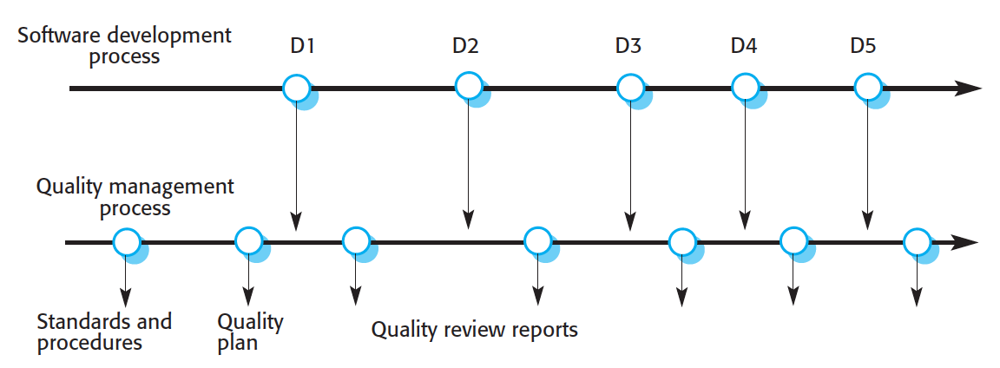

# Qualitätsmanagement

**Autor:** Kevin Ratschinski

## Inhalt

- **24 Einführung**
- **24.1 Softwarequalität**
- **24.2 Software - Standards**
- **24.3 Reviews und Inspektionen**
- **24.4 Qualitätsmanagement und agile Entwicklung**
- **24.5 Softwaremessung**
- **24.6 Zusammenfassung**
- **24.7 Quellen**

## 24 Einführung

Kapitel 24 befasst sich mit dem Qualitätsmanagement während des Softwareentwicklungsprozesses.

Softwaresysteme sollen "fit for purpose" sein. Das heißt den Bedürfnissen ihrer Benutzer entsprechen.
Darunter zählen z.B.:

- Effizienz
- Zuverlässigkeit
- Fertigstellung innerhalb eines Zeit- und Kostenrahmens

Softwarequalitätsmanagement hat sicherzustellen, dass diese Ziele erfüllt werden. Qualitätsmanagement hat einen hohen Stellenwert in der Softwareentwicklung und sorgt dafür das festgelegte
Ziele während des Entwicklungsprozesses eingehalten werden und die Qualität des Produktes sich nicht verschlechtert.

Die Techniken des Softwarequalitätsmanagement kommen ursprünglich aus der Fertigungsindustrie, wo die Begriffe wie "Quality Assurance" und "Quality Control" weit verbreitet sind.

**Quality Assurance** ist die Definition von Prozessen und Standards, die zu qualitativ hochwertigen Produkten führen, und die Einführung dieser Qualitätsprozesse in den Fertigungsprozess.

**Quality Control** ist die Anwendung dieser Qualitätsprozesse, um Produkte auszusieben, die dem geforderten Qualitätsniveau nicht entsprechen.

Um diese Prozesse umzusetzen werden in der Softwareentwicklung oft QM-Teams eingesetzt. Die Teams sorgen für eine unabhängige Produktprüfung.
Damit wird sichergestellt, dass die zuvor festgelegten Standards und Ziele des Unternehmens mit dem Produkt übereinstimmen.

Abbildung 24.1: Qualitätsmanagement und Softwareentwicklung

Abbildung 24.1 Zeigt den Ablauf eines Softwareentwicklungsprozess. Bevor die Entwicklung beginnt werden die Standards festgelegt und ein Qualitätsplan vom QM-Team erstellt. Das QM-team sollte stets unabhängig von der Entwicklergruppe sein, damit es die Qualität der Software objektiv beurteilen kann.
Die gewünschten Softwareeigenschaften welche das Produkt später haben muss, sollten vor Projektbeginn in einem Qualitätsplan festgehalten werden.

Nach Humphrey (1989) [2] könnte ein Qualitätsplan wie folgt aufgebaut werden:

- _Produktvorstellung_: Eine Beschreibung des Produkts, des geplanten Absatzmarktes und der Qualitätserwartung an das Produkt.
- _Produktpläne_: Die wichtigsten Freigabetermine und Zuständigkeiten für das Produkt, sowie die Pläne für den Vertrieb und die Dienstleistungen.
- _Prozessbeschreibungen_: Die Entwicklungs- und Dienstleistungsprozesse und Standards, die für die Produktentwicklung und das Produktmanagement verwendet werden sollen.
- _Qualitätsziele_: Die Qualitätsziele und -pläne für das Produkt einschließlich einer begründeten Festlegung wesentlicher Produktattribute.
- _Risiken und Risikomanagement_: Die größten Risiken, welche die Produktqualität beeinträchtigen können, und Maßnahmen zu deren Beseitigung.

Traditionelles Qualitätsmanagement ist ein formaler Prozess, der sich auf eine ausführliche Dokumentation der Tests und Systemvalidierung sowie auf die Einhaltung dieser Prozesse stützt.

## 24.1 Softwarequalität

## 24.2 Softwarestandards

### 24.2.1 ISO 9001

## 24.3 Reviews und Inspektionen

### 24.3.1 Review-Prozess

### 24.3.2 Programminspektionen

## 24.4 Qualitätsmanagement und agile Entwicklung

## 24.5 Softwaremessung

### 24.5.1 Produktmetriken

### 24.5.2 Softwarekomponentenanalyse

### 24.5.3 Mehrdeutigkeit von Messungen

### 24.5.4 Softwareanalytik

## 24.6 Quellen

[1]: Sommerville Ian (2018). Software Engineering. Quality management, 700-729.  
[2]: Managing the Software Process. Humphrey, W. 1989.
