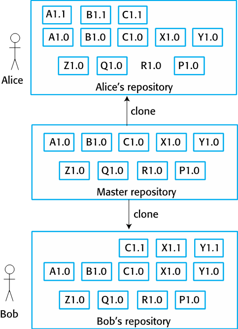
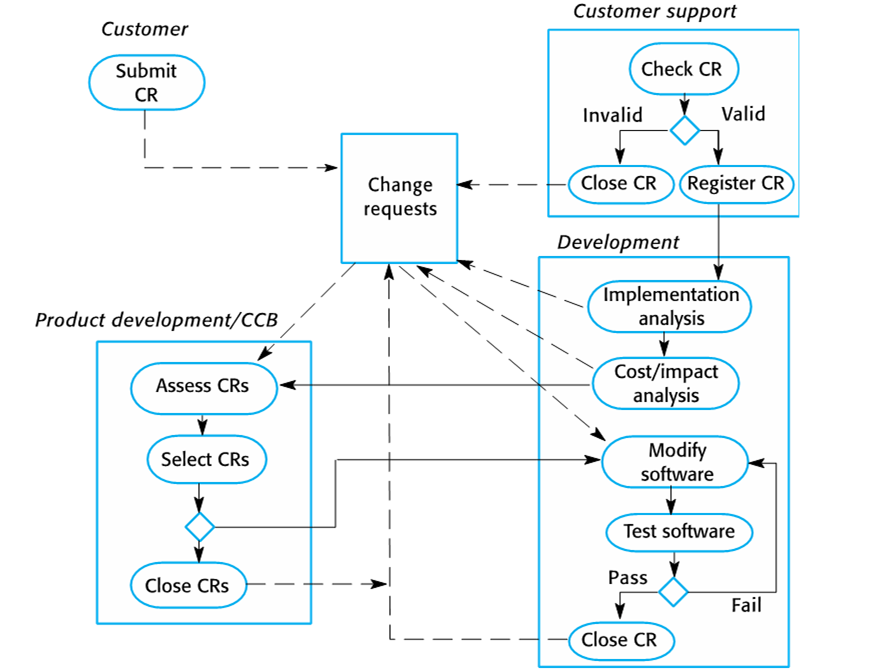

# Configuration Management

**Autor:** Timo Wortmann

Sofern nicht anders gekennzeichnet stammen alle folgenden Informationen und Abbildungen aus dem Buch "Software Engineering (10th ed.)" von Ian Sommerville [[1]](#ref1).

## Einleitung zum Konfigurationsmanagement

Ein Software System verändetr sich mit jedem Bugfixes und neuem Hard- oder Softwareversionsstand. Durch die Änderungen an dem System entsteht eine Reihe an Versionen, welche verwaltet werden müssen. 
Das Konfigurationsmanagement übernimmt das Management von Richlinien, Prozessen und Werkzeugen für das Verändern von Software Systemen. 

Ohne Konfigurationsmanagement kann es zur Modifizierung der falschen Version, dem Ausrollen falscher Software oder zum Vergessen vom Speicherort bestimmter Komponenten.
Vor allem in Teams wird Konfigurationsmanagement aufgrund der steigenden Verteilung von Mitglieder an verschiedenen Standorten benötigt. Es kann aber auch bei Einzelpersonen eingesetzt werden, um die Änderungen nicht zu vergessen.

Konfigurationsmanagent setzt sich aus folgenden vier Aktivitäten zusammen:

1. [Version management](#version-management)
2. [System building](#system-building)
3. [Change management](#change-management)
4. [Release management](#release-management)

Die obere Abbildung 25.1 zeigt die Aktivitäten und deren Abhängigkeiten untereinander. Die einzelnen Bestandteile umfassen den gesamten Änderungsprozess eines Software Systems und werden in den kommenden Abschnitten genauer erklärt. 

### Nutzung von Konfigurationsmanagement-Tools in der Softwareentwicklung

In der agilen Softwareentwicklung gibt es bei der Verwendung von Konfigurationsmanagement verschiedene Tools, welche von einem simplen Bugtracker bis hin zu einem vollständigen Managementsystem für unterschiedliche Softwareumgebungen alle Aufgaben übernehmen können.

Bei Nutzung solcher Tools gibt es oftmals eine zentralisierte Stelle, an der die aktuellen Versionsstände des Systems dokumentiert sind. Bei Änderunge an den Versionen werden die zentralisierten Dateien durch den jeweiligen Entwickler kopiert, lokal geändert und danach wieder an den zentralen Ablageort gesendet. So haben auch andere Entwickler Zugriff auf die Änderungen und deren Historie.

Der Prozess der Softwareentwicklung besteht aus den Phasen **Development**, **System Testing** und **Release**. 
In der Entwicklungsphase werden neue Funktionen der Software programmiert.
Ind er Testphase werden die zuvor programmierten Funktionen getestet.
In der Release-Phase ist das Softwareprodukt dann für den Endkunden verfügbar.

Da die Phasen in der agilen Entwicklung oftmals parallel laufen, gibt es auch unterschiedliche Versionen des Softwareprodukts. Die Aufgabe eines Konfigurationsmanagement-Tools ist es dabei, den Überblick über alle verschiedenen Versionsstände des Softwareprodukts und deren Bestandteile zu behalten.

### Terminologie und Begriffsdefinitionen

Ursprünglich stammt das Konfigurationsmanagement aus dem Militär und bezog sich nur auf Hardware und wurde später in der Softwareentwicklung verwendet. 
Je nach Anwendungsbereich gibt es unterschiedliche Definitionen für einzelne Bestandteile des Konfigurationsmanagements.
Es gibt standardisierte Definitionen durch IEEE (z.B. IEEE 828-2012), aber diese werden in agilen Entwicklung augrund des hohen Dokumentationsaufwands nicht angewandt.

Die Terminologie nach Sommerville folgt nach der hier aufgeführten Tabelle (alphabetisch sortiert). Eine Reihe Der Begriffe ist ähnlich zu den Begriffen bei der Nutzung von Versionskontrollsystemen wie Git, werden aber unabhängig davon betrachtet.

| Begriff                                                | Beschreibung                                                                                                                                                                                                                                |
| ------------------------------------------------------ | ------------------------------------------------------------------------------------------------------------------------------------------------------------------------------------------------------------------------------------------- |
| Baseline                                               | Eine Sammlung von Komponenten, welche zusammen ein System ergeben. Die Versionen der Komponenten einer Baseline können nicht verändert werden und es ist immer möglich, eine Baseline aus den versionierten Komponenten wiederherzustellen. |
| Branching                                              | Das Erstellen einer neuen Codeline basierend auf einer bestehenden Codeline                                                                                                                                                                 |
| Codeline                                               | Das Zusammenfassen einer Version einer Softwarekomponente und deren Abhängigkeiten (z.B. die Branches bei Git)                                                                                                                              |
| Configuration (version) control                        | Der Prozess zur Dokumentation von Änderungen am System und Komponenten über die Lebensspanne des Systems.                                                                                                                                   |
| Configuration item / software configuration item (SCI) | Jeder Bestandteil eines Softwareprojekts, welcher unter Versionskontrolle steht (z.B. Code, Dokumentation).                                                                                                                                 |
| Mainline                                               | Eine Reihe von Baselines, die unterschiedliche Versionen des gleichen Systems darstellen.                                                                                                                                                   |
| Merging                                                | Das Erstellen einer neuen Version durch Zusammenbringen unterschiedlicher Codelines.                                                                                                                                                        |
| Release                                                | Eine Version der Software, welche für Endnutzer veröffentlicht wurde.                                                                                                                                                                       |
| Repository                                             | Eine geteilte Datenbank mit Versionen und Metainformationen von Software.                                                                                                                                                                   |
| System building                                        | Die Erstellung eines ausführbaren Systems durch Kompilierung und Verlinkung der Bestandteile in den richtigen Versionen.                                                                                                                    |
| Version                                                | Eine Instanz eines Configuration Items, die sich in irgendeiner Form von der letzten Form unterscheidet. Versionen sollten durch ein einzigartiges Kennzeichen markiert werden.                                                             |
| Workspace                                              | Eine private Arbeitsumgebung, worin die Software ohne die Beeinträchtigung anderer Entwickler verändert werden kann.                                                                                                                        |

## Version Management

Versionsmanagement bechreibt den Prozess der Versionierung von Software Komponenten und deren Nutzung in Systemen. Ein weiterer Bestandteil ist di Sicherstellung, dass sich Änderungen unterschiedlicher Entwickler nicht gegeneinander stören. In dem Prozess werden Baselines und Codelines verwaltet.

Die Abbildung 25.4 zeigt den Unterschied zwischen Code-, Base- und Mainlines. **Codelines** sind Sequenzen des Quellcodes in unterschiedlichen Versionen. Eine **Baseline** ist eien Zusammenstellung unterschiedlicher Versionen aus mehreren Codelines. Die Sequenz der unterschiedlichen Baselines nennt sich **Mainline**.

### Versionskontrollsysteme

Für die Nutzung von Versionsmanagement gitb es zwei Arten von Versionskontrollsystemen (engl. version control system; VC), in denen die Versionen der Code- und Baselines gespeichert werden.

In zentralisierten Systemen, z.B. Subversion, gibt es ein einziges Repository, welches alle Versionen der Software anthält. In verteilten Systemen, wie z.B. Git, gibt es verschiedene Versionen des Repositories gleichzeitig (Bei GitHub = Forking). 
Die beiden Arten an Systemen unterscheiden sich in einigen Punkten, bieten aber insgesamt folgende Funktionalität:

- Identifizierung von Versionen und Releases anhand von einzigartigen Kennzeichen (z.B. v1.1.0)
- Aufzeichnen der Änderungshistorie
- Unabhängige Entwicklung mehrerer Personen
- Unterstützung für widerverwendbare Komponenten und Projekte (z.B. Aufteilung in mehrere Repositories)
- Effiziente Speicherung und Komprimierung von Dateien

Damit mehrere Entwickler gleichzeitig unabhägig voneinander arbeiten können, gibt es das Konzept eines Projektrepositories und privatern Repositories. Das Projektrepository ist eine zentrale Version des Entwicklungsstandes, welches von den Entwicklern mit einem check-out heruntergeladen werden kann. Der Entwickler erhält dabei eine lokale Kopies des Repositories, das sogenannte private Repository. Daran können Änderungen vorgenommmen werden und per check-in wirder an das Projektrepository gesendet werden. Bei verteilten Versionskontrollsystemen wird statt einem check-in und check-out jeweils das gesamte Repository dupliziert (cloning).

Der allgemeine Ablauf der Arbeit mit Versionskontrollsystemen ist wie auf den folgenden Abbildungen beschrieben:

Repository check-in und check-out bei zentralisierten Versionskontrollsystemen

Repository cloning bei verteilten Versionskontrollsystemen

Die Nutzung von Versionskontrollsystemen bietet folgende Vorteile:

- Backup der Dateien/Repositories und Wiederherstellung aus lokalen Kopien
- Arbeit ohne Internetzugriff
- Entwicklung und Tests auf der lokalen Umgebung des Entwicklers

### Entwicklung von Open Source Projekten

Bei der Entwicklung von Open Source Projekten ist die Verwendung von verteilten Versionskontrollsystemen notwendig. Durch die Existenz eines zentralen Projektrepositories können die Entwickler das Repository clonen, Änderungen daran vornehmen und danach eine Anfrage an das Projektrepository stellen, die Änderungen zu übernehmen. Die Änderungen können dann durch eine befugte Person des Open Source Projekts freigegeben werden.

### Branching un Merging

Die Entwicklung des Software Systems erfolgt nicht nur in einer Codeline, sondern es können verschiedene Codelines durch **Branching** aufgespalten werden und unabhängig voneinander entwickelt werden. Bei einer Zusammenführung zweier unterschiedlicher Codelines werden diese durch **Merging** zusammengeführt.

### Speicherung von Dateien

Wie bereits erwähnt, ist ein Vorteil der Nutzung von Versionskontrollsystemen die Komprimierung und Speicherung von unterschiedlichen Versionen der gleichen Datei/Komponente. Anstatt dass jede neue Version separat gespeichert wird, werden in einem Versionskontrollsystem nur die Änderungen zwischen zwei Versionsständen gespeichert (z.B. die bearbeiteten Zeilen bei Textdateien oder veränderten Bytes bei Binärdateien). Bei einem Checkout wird aus der Änderungshistorie der aktuelle Stand der Datei zusammengebaut.
Dazu kommen noch mögliche Erweiterungen, um die Schnelligkeit zu verbessern. Dazu gehören beispielsweise die vollständige Speicherung der aktuellesten Version einer Datei und die Zusammenfassung mehrerer kleiner Dateien zu einer Änderungshistorie.

## System Building

System Building ist der Prozess der Erstellung eines ausführbaren Systems durch das Verbinden von Systemkomponenten, Bibliotheken, Konfigurationsdateien und Metadaten.

Im Prozess des Systembaus sind die drei Systeme Entwicklungssystem, Build Server und Zielumgebung involviert.
Das Entwicklungssystem enthält Entwicklungswerkzeuge wie Compiler und Textbearbeitungsprogramme/IDEs. Hier befindet sich auch das private Repository der Entwickler, in dem Änderungen an dem Quellcode vorgenommen werden.
Der Build Server erstellt die ausführbaren Versionen des Systems. Er wird durch das Versionskontrollsystem nach dem Hochladen von neuem Code ausgelöst.
Die Zielumgebung ist die Plattform, auf der die erstellen Systeme ausgeführt werden (z.B. Webserver, Mikrocontroller, Handy, ...).

Wie beim Version Management gitb es auch für System Building spezielle Tools, um die Entwickler bei der Arbeit zu unterstützen. Diese beinhalten folgende Funktionen:

- Generierung von Build Skripten durch Analyse der Systemkomponenten und deren Abhängigkeiten
- Integration zu Versionskontrollsystemen
- Minimale Neukompilierung durch Wiederverwendung bereits kompilierter Komponenten
- Erstellung von ausführbaren Systemen/Dateien (z.B. .exe-Datei)
- Automatisierte Tests(z.B. JUnit)
- Benachrichtigungen zu Fehlern und Ereignissen
- Generierung von Dokumentation

### Continuous Integration

In der agilen Softwareentwicklung werden häufig Änderungen am gebauten System vorgenommen. Bei den häufigen Änderungen werden durch Continuous Integration selbst bei kleinen Änderungen automatische Checks ausgeführt und das System neu gebaut.

Der Prozess der Continuous Integration wird wie folgt beschrieben:

1. Kopieren des Projektepositories in das private Repository der Entwickler
2. Testen und Bauen des Systems. Bei Fehlern die Persone benachrichtigen, welche als Letztes Änderungen vorgenommen hat
3. Änderungen vornehmen
4. Testen und Bauen des Systems
5. System an den Build Server übergeben
6. Testen und Bauen des Systems auf dem Build Server
7. Wenn die Tests erfolgreich waren, eine neue Baseline erstellen und in die Mainline aufnehmen

Die Vorteile der Continuous Integration sind die schnelle Findung von Fehlern bedingt durch Interaktion von verschiedenen Entwicklern und die Existenz einer endgültigen Version des Systems (aktuellste Version). Der Ansatz ist allerdings nicht immer umsetzbar, beispielsweise wenn die Test- und Kompilierzeit zu lange dauern, oder es manchmal nicht möglich ist, die Zielumgebung einheitlich zu simulieren, bzw. Tests in einer ähnlichen Umgebung durchzuführen.
In solchen Fällen bietet sich an, neue Builds in regelmäßigen Abständen, z.B. täglich durchzuführen, und nicht bei jeder Änderung.

### Minimierung der Kompilierung

Ziel des Systembaus ist es, so wenig wie möglich zu Kompilieren. Bereits kompilierte Komponenten werden daher mit Zeitstempeln oder Checksummen versehen, um nur neue Änderungen zu kompilieren.

## Change Management

Change Management (dt. Änderungsmanagement) dient dazu, Änderungen an einem System zu kontrolliert aufgrund von Kosten und Dringlichkeit zu priorisieren und umzusetzen.

Die obere Abbildung zeigt eine mögliche Variante eines Change Management Prozesses. Je nach Unternehmens-/Teamgröße und Kunde gibt es Änderungen zu dem Modell. Dabei ist auch zu beachten, dass der Prozess in den meisten Fällen erst nach dem Release eines Systems in Kraft tritt. Während der Entwicklung gibt es oftmals keine gewünschten Änderungen an einem laufenden System.

Ind dem Prozess werden Change Requests (CR, eine Anfrage nach einer bestimmten Änderung) durch den Kunden gestellt. Die Anfragen werden in einen Katalog aufgenommen und durch den Kundensupport bewertet. Gültige Anfragen werden an das Entwicklerteam für eine Einschätzung der Kosten und des Implementationsaufwands weitergegeben.
Daraufhin werden die bewerteten und geschätzten Anfragen durch die Produktentwicklung oder ein separates Change Control Board (CBB, wird bei Regierung und Militär so genannt) aufgrund verschiedener Faktoren priorisiert. Mögliche Faktoren sind die Kosten, die Dringlichkeit, die Anzahl der betroffenen Nutzer oder die Gliederung in den Release-Zyklus des Systems.
Priorisierte Anfragen landen danach wieder beim Entwicklungsteam, welches diese umsetzt, testet und zuletzt schließt.

Bei weit verbreiteter Software kommen die Change Requests meist nicht direkt von Kunden, sondern es gibt Online-Foren, auf denen gewünschte Funktionen oder Bugs gepostet und von der Community bewertet werden können (z.B. durch Likes auf GitHub Issues). In der agilen Entwicklugn wird die Priorisierung der Changes manchmal auch durch die Entwickler selbst durchgeführt, um eine schnellere Umsetzung zu erreichen. Des Weiteren können manche Kunden auch direkt mit den Entwicklern die Änderungen besprechen, ohne den Kundensupport zu benachrichtigen.

Eine gute Möglichkeit, um Änderungen an Quellcode festzuhalten, ist es, eine Kofzeile mit der Änderungshistorie in der Datei zu pflegen. Alternativ kann auch die Änderungshistorie des Versionskontrollsystems dazu verwendet werden.

## Release Management

Das Release Management beschäftigt sich mit der Veröffentlichung von Software für Endnutzer. Ein Release ist eine für Endnutzer bereitgestellte Version eines Systems. Es gibt Major und Minor Releases. Major Releases beinhalten große Funktionsänderungen (z.B. Windows 8 auf 10). Minor Releases enthalten Bugfixes und kleine Funktionsänderungen. Für Major Releases muss der Nutzer oftmals neu bezahlen, für Minor Releases nicht.

Zu einem Release eines Systems gehört nicht nur eine ausführbare Datei, sondern auch:

- Konfigurationsdateien
- Dateien mit zusätzlichen Daten, z.B. Übersetzungen in andere Sprachen
- Installationsprogramme
- Dokumentation (elektronisch und auf Papier)
- Verpackung und Werbung des Produkts

Bei der Veröffentlichung spezieller Software für einzelne Kunden werden im Zusammenhang mit dem Konsigurationsmanagement Informationen über die jeweiligen Versionen der Kunden dokumentiert. So kann es auch vorkommen, dass ältere Versionen des Systems noch neue Releases erhalten, wenn sie noch von bestimmten Kunden verwendet werden. Dazu sollten auch Daten wie das verwendete Betriebssystem, Bibliotheken, Compiler und Buil Tools in der jeweiligen Version dokumentiert werden.

### Zeitpunkt der Veröffentlichung

Der Zeitpunkt der Veröffentlichung muss bedacht werden, da sont Kunden auf andere Produkte wechseln oder das Produkt Marktanteile verlieren kann. Folgende Faktoren haben einen Einfluss auf den Zeitpunkt der Veröffentlichung:

- **Konkurrenz:** Bei Massensoftware ist es manchmal nötigt eine neue Version zu veröffentlichen, um mit den konkurrierenden Produkten mitzuhalten
- **Marketing:** Marketing eines Produkts enthält oftmals versprochene Funktionen und ein Veröffentlichungsdatum, wann die Funktionen nutzbar sein sollen
- **Änderungen an der Plattform:** Es kann notwendigg sein, dass eine neue Version veröffentlicht werden muss, wenn beispielsweise ein neues Betriebssystem veröffentlich wurde
- **Technische Qualität:** Bei großflächigen Fehlern am System, welche viele Benutzer betreffen, ist es notwedig, schnell eine neue Version zu veröffentlichen, in der die Fehler behoben werden

### Updaten von Releases

Bei der Veröffentlichung neuer Versionen können Nutzer ein Update machen, wodurch sie von einer alten Version auf das neue Release wechseln. Dabei werden bei laufenden Systemen manchmal Änderungen vorgenommen, die auf älteren Versionen aufbauen, z.B. das Hinzufügen einer neuen Tabelle in Version 1.1 und die Ergänzung der Tabelle in Version 1.2. Dabei ist nicht garantiert, dass jeder Kunde von der letzen aktuellen Version upgradet. Beispielsweise könnte Version 1.1 vom Kunden übersprungen werden. Dabei muss durch die Entwickler sichergestellt werden, dass ein System trotz aufeinander aufbauender Änderungen nach einem beliebigen Versionsupdate noch funktioniert.

Eine Möglichkeit, Update-Konflikte zu umgehen ist die Bereitstellung der Software als Software as a Service (SaaS), bei der die Installation und Updates durch den Hersteller durchgeführt werden. Der Kunde verwendet nur das Endprodukt.

## Referenzen

[1]: Sommerville, Ian (2015). Software Engineering (10th. ed.), 730-756.