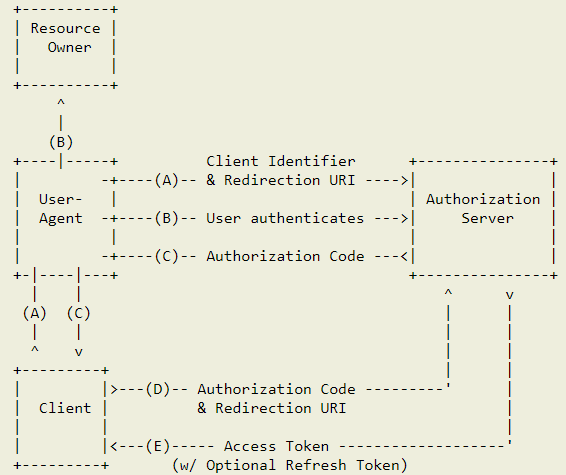
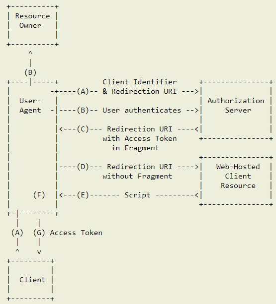
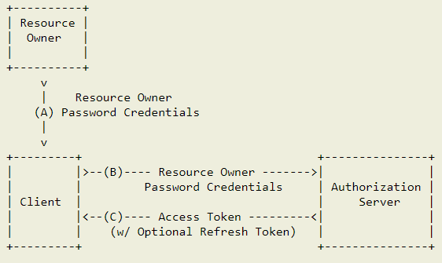
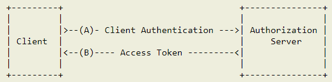
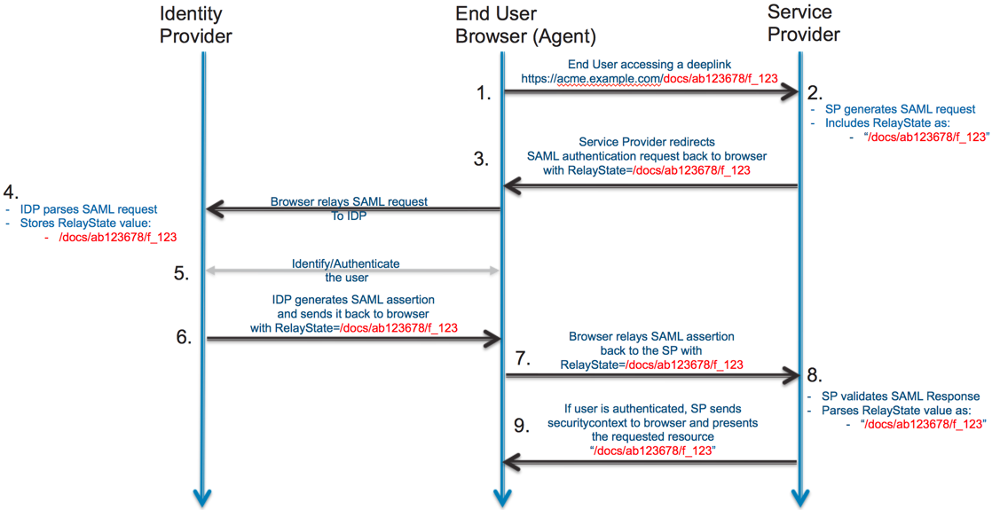

# Rafael Berger

* Security: Authentifizierung mit OpenIDConnect (Vergleich mit Ansätzen)
  * Wie sieht das Konzept von OpenID Connect aus und wie kann es eingesetzt werden?

## Vergleich OpenID Connect und SAML

* Funktionsweise
* Anwendungsbereiche
* Mögliche Sicherheitsrisiken
* zu messende Metriken
  * Anmeldezeit
  * Erweiterungsmöglichkeiten (2 Faktor usw.)
  * Session parameter (limit, dauer)
  * Developer experience (Konfigurationsaufwand)
  * Verschlüsselungsalgorithmus/Signieralgorithmus
  * Unterstützte Programmiersprachen
  * Anzahl möglicher Identitätsanbieter (Google, Facebook, etc.)

## Fragen

* Worin unterscheidet sich OpenID Connect und SAML im Hinblick auf den Authentifizierungsablauf?
* Werden unterschiedliche Identitätsanbieter unterstützt?
* Welche möglichen Sicherheitsrisiken gibt es und wie können diese umgangen werden?
* Gibt es bestimmte Anwendungsbereiche, wo OpenID Connect oder SAML zu bevorzugen ist?

## Beschreibung der Tätigkeit in Prosa

Zu Beginn der Arbeit liegt der Fokus auf den Unterschied zwischen einer Autorisierung und einer Authentifizierung. Dabei werden die wichtigsten Faktoren herausgearbeitet. Für die Autorisierung und Authentifizierung werden OAuth2.0, OpenID Connect und SAML genutzt und miteinander verglichen. Neben den unterschiedlichen Authentifizierungsabläufe werden die möglichen Anwendungsfälle ausgearbeitet. Da das Thema Sicherheit bei einer Authentifizierung von hoher Bedeutung ist, wird eine Recherche über mögliche Sicherheitsrisiken der einzelnen Möglichkeiten durchgeführt. Diese Sicherheitsrisken werden dabei genannt und Hinweise gegeben wie diese zu vermeiden sind. Für eine genauere Evalierung ist es notwendig, neben der theoretischen Einarbeitung, diese Verfahren zu implementieren und auszuführen. Dafür wird ein bestimmter Authentifizierungsablauf ausgewählt, der sowohl mit OIDC als auch mit SAML möglich ist. Dementsprechend werden kleine Prototypen von Services implementiert, die diese Authentifizierung durchführen. Während der Entwicklung werden bereits die ersten zu messenden Metriken aufgestellt. Diese konzentrieren sich auf die Implementierung von OIDC und SAML. Nach der Implementierung ist eine wichtige Metrik die benötigte Anmeldezeit. Am Ende der Evalierung werden die ermittelten Metriken miteinander verglichen, um ein gesamtes Fazit zu schließen.

## Zeitplan

Tätigkeit                                        | Zeitpunkt
-------------------------------------------------|----------
Zeitplan und Beschreibung der Tätigkeit in Prosa | KW 17
Unterschied Autorisierung und Authentifizierung  | KW 18
Einarbeitung OAuth 2.0/OIDC                      | KW 19
Einarbeitung SAML                                | KW 20
Einblick in Alternativen                         | KW 21
Implementierung der Services                     | KW 22
Implementierung OIDC                             | KW 23
Implementierung SAML                             | KW 24
Fertigstellung der zu messenden Metriken         | KW 25
Abgabe                                           | KW 26

## Checkliste

[X] Unterschied Autorisierung und Authentifizierung

[X] Allgemein OAuth 2.0

[X] Autorisierungsabläufe OAuth 2.0

[] Sicherheitsrisiken OAuth 2.0

[X] Allgemein OIDC

[X] Einarbeitung JWT

[X] Autorisierungsabläufe OIDC

[] Sicherheitsrisiken OIDC

[X] Allgemein SAML

[] Autorisierungsabläufe SAML

[] Sicherheitsrisiken SAML

[] Einarbeitung Keycloak

[] Implementierung Services

[] Implementierung OIDC

[] Metriken OIDC

[] Implementierung SAML

[] Metriken SAML

[] Vergleich OIDC und SAML

Alle folgenden Informationen dienen lediglich als Notizen. Die fertige Ausarbeitung wird in einem WORD-Dokument angefertig.

## Unterschied Autorisierung und Authentifizierung

* Autorisierung
  * Schutz vor Ressource
  * Erlaubnis wird benötigt, um auf eine bestimmte Ressource zuzugreifen
  * Beispiel
    * Parkhilfe
* Authentifizierung
  * Stellt sicher, dass die angegebene Person oder der Service auch korrekt ist
  * Handelt es sich wirklich um die Person oder der Service für den er sich ausgibt
  * Beispiel
    * Hotelkarte an der Rezeption

## OAuth 2.0

* Standard der 2012 entwickelt wurde
* Dient zur Autorisierung mittels eines Access-Tokens

### Tokens

* Access-Token
  * Notwendig für die Autorisierung
* Refresh-Token
  * Aktualisiert den Access-Token, damit dieser nicht abläuft
* Code-Token
  * Wird in speziellen Autorisierungsabläufe gebraucht, um initial ein Access-Token und Refresh-Token zu erhalten

### Rollen

* Ressourcen-Besitzer
* Client
* Autorisierungsserver
* Ressourcen-Server

### Autorisierungsabläufe

#### Authorization Code Grant

#### Implicit Grant

#### Resource Owner Password Credentials Grant

#### Client Credentials Grant

## OpenID Connect

### JWT

* Offener Standard (RFC 7519)
* Dient zur sicheren Übermittlung von Daten als JSON-Objekt
* Durch eine digitale Signierung können die Daten als vertrauenswürdig angesehen werden
  * Informationen sind nicht manipuliert worden
* Werden häufig bei der Autorisierung und Informationsaustausch genutzt
* Single Sign On ist eine beispielhafte Funktion für die JWT verwendet werden
* Ein JWT besteht aus drei Komponente die jeweils mit einem Punkt getrennt werden
  * xxx.yyy.zzz

#### Header

* Besteht aus zwei Teilen
  * Typ des Tokens
  * Signaturalgorithmus

#### Payload

* Enthält alle Informationen die gesendet werden
  * Können Daten über den Benutzer enthalten 
* Die enthaltenen Behauptungen werden Claims genannt
* Es gibt drei verschiedene Typen von Claims
  * Registrierte
    * Vordefinierte Behauptungen die nicht erforderlich sind aber empfohlen werden
      * iss (Aussteller)
      * exp (Ablaufzeit)
      * sub (Betreff)
      * aud (Zielgruppe)
  * Öffentliche
    * Können beliebig definiert werden
    * Sollte aber in der IANA JSON Web Token Registry enthalten sein und sich daran orientieren, um Kollisionen zu vermeiden
  * Private
    * Können frei definiert werden
    * Sollten aber nur in der eigenen Umgebung eingesetzt werden

#### Signatur

* Header und Payload werden verwendet mit zusätzlich einem Geheimnis, um die Signatur zu erstellen

### ID-Token

* Besonderheit im Gegensatz zu OAuth2.0
* JWT, dass als Sicherheitstoken für die Authentifizierung funktioniert
* Es sind einige Claims definiert, die dieses ID-Token enthalten muss
  * iss
  * sub
  * aud
  * exp
  * iat
* Andere sind optional
  * acr
  * amr
  * azp
* Zwei weitere können erforderlich oder optional sein. Kommt dabei auf die Implementie-rung an
  * auth_time
  * nonce

## SAML

* Für die Authentifizierung wird eine „Assertion“ verwendet
* Die Assertion ist ein XML-Dokument, welches verschiedene Informationen enthält
  * Wer hat sich authentifiziert
  * Informationen über die Person
  * Wer die Assertion erstellt hat
  * Weitere Daten für die Authentifizierung
* Sendet die Assertion meistens direkt über den Browser
  * Verwenden die POST-Bindung für das Senden der Antwort
  * Der Browser sendet dabei ein HTML-Formular, welches vom Identitätsanbieter erstellt wird, mit der XML für die Antwort als Formularparameter
    * Für das Versenden der Daten an den Dienstanbieter, enthält das Formular JavaScript
    * Dadurch besteht keine direkte Kommunikation zwischen dem Dienstan-bieter und dem Identitätsanbieter, da die Informationen immer über den Browser weitergeleitet werden

### Begriffe

* Service Provider (SP)
  * Häufig die Anwendung
* Identity Provider (IdP)
  * Entität die für die Authentifizierung zuständig ist
* SAML Request
  * Wird vom Service Provider generiert, damit die Authentifizierung angefordert wird
* SAML Response
  * Die Antwort vom Identity Provider
  * Enthält die Assertion vom Benutzer
  * Kann zusätzliche Informationen enthalten
    * Benutzerprofil
    * Gruppen-/Rolleninformationen
* Service Provider Initiated (SP-initiated)
  * Beschreibt den Ablauf der SAML-Anmeldung
  * Wird ausgelöst, falls versucht wird direkt auf eine geschützte Ressource zuzugrei-fen
  * Wird ausgelöst vom Service Provider (Dienstleister)
* Identity Provider Initiated (IdP-initiated)
  * Beschreibt den Anmeldeablauf, der vom Identity Provider ausgelöst wird

### Authentifizierungsablauf

## Unterschied OIDC und SAML

Test                               | OIDC   | SAML
-----------------------------------|--------|-----------------
Tokenart                           | JWT    | XML
Kommunikation Anwendung und IDP/OP | Direkt | Über den Browser
Mobile Anwendung                   | Ja     | Nein
Anwendung unterstützt bereits SAML | Nein   | Ja
Neue Anwendung                     | Ja     | Nein
