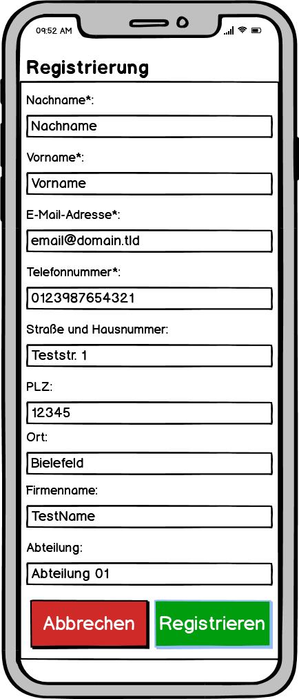
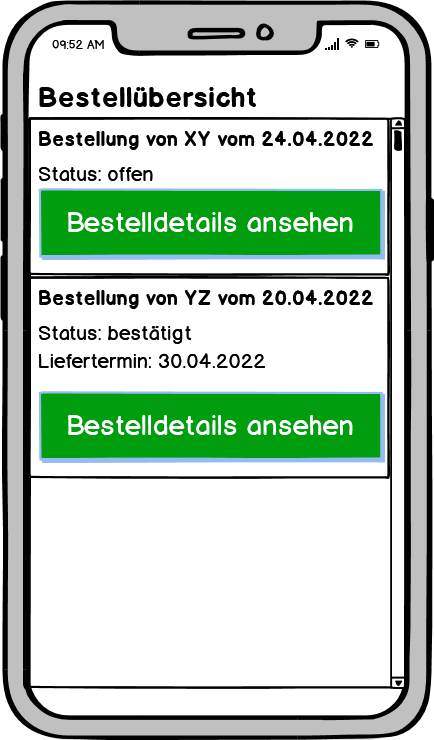
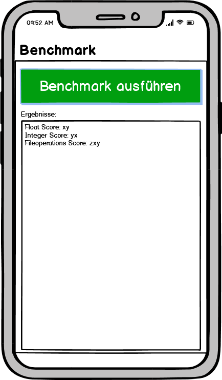
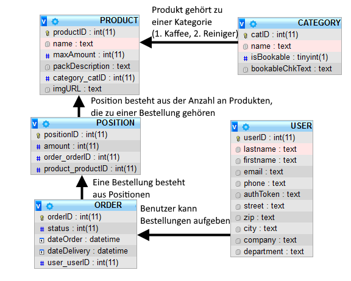

Steffen Dorsch
* Thema: Evaluation der mobilen Anwendungsentwicklung mit React Native (JS) vs. Xamarin (C#)
    * Entwicklung einer App mit gleicher Funktionalität je Framework
      * Idee: Bestellapp für firmeninterne Verbrauchsgüter
         * Frontend: React Native, Xamarin
         * Backend: MySQL Datenbank, REST-API für Datenbank
         * Mockups:

            
            
            
            
            
         * ER-Diagramm:
            
    * Evalutation Performanz - Wie Leistungsfähig sind die Frameworks im Vergleich?
      * App-Startup, CPU-intensive Tasks, Installationsdauer, App-Größe
    * Wie hoch ist der Einarbeitungs- und Implementierungsaufwand?
    * Welche Funktionalitäten bieten die Entwicklungsumgebungen?
      * Xamarin: Visual Studio, Jetbrains Rider
      * React Native: Visual Studio Code, Jetbrains WebStorm
    * Unter welchen Lizenzen stehen die Frameworks?
      * Xamarin: enthalten in Visual Studio Lizenz:
        * Community Edition für nichtkommerzielle Nutzung
        * Professional / Enterprise Editionen für gewerbliche Nutzung
        * .NET MAUI: MIT-Lizenz
      * React Native: MIT-Lizenz
     * Welche Unterschiede gibt es bei der Kompilierung und Ausführung?
     * Wie groß und aktiv sind die Open-Soruce-Communities?
     * Gibt es aktive und zukünftige Entwicklungen? Nutzungsstatistiken
  
* Zeitplan: 
   * 21.04.2022
     * Ausarbeitung Thema, Zeitplan
   * 28.04.2022
     * Planung Frontend (Mockups)
     * Planung Datenbank (ER-Diagramm)
     * Einrichtung und Einarbeitung IDEs, Ausformulierung der Evaluation
     * Präsentation des aktuellen Standes
   * 05.05.2022
     * Einarbeitung Xamarin
     * Einarbeitung React Native
     * Implementierung und Bereitstellung Datenbank
     * Ausarbeitung Grundlagen und bisherige Erkenntnisse
     * Hausarbeit
   * 12.05.2022
     * Abgabe Ausarbeitung zu Kapitel Systems of systems
     * Ausarbeitung Lizenzen, IDEs
     * Hausarbeit
   * 19.05.2022
     * Implementierung Backend Rest-API
     * Ausarbeitung Einarbeitungsaufwand
     * Hausarbeit
   * 26.05.2022
     * Implementierung Frontend Register/Login
     * Implementierung Frontend API-Wrapper
     * Hausarbeit
   * 02.06.2022
     * Implementierung Frontend Bestellübersicht/Admin 
     * Ausarbeitung Kompilierung und Ausführung
     * Hausarbeit
   * 09.06.2022
     * Implementierung Frontend neue Bestellung/offene Bestellungen
     * Ausarbeitung Communities der Frameworks
     * Hausarbeit
   * 16.06.2022
     * Implementierung Frontend Benckmarks
     * Ausarbeitung Nutzungsstatistiken und aktuelle und zukünftige Entwicklungen der Frameworks
     * Hausarbeit
   * 23.06.2022
     * Fertigstellung der Apps
     * Korrekturlesen, letzte Anpasssungen Hausarbeit
     * Ausarbeitung Implementierungsaufwand, Evaluation Preformanz und Benckmarkergebnisse
   * 30.06.2022
     * (?) Vortrag zu Kapitel Systems of systems
     * Abgabe Ausarbeitung und Ergebnisse Praktikum
     * Abgabe Hausarbeit
