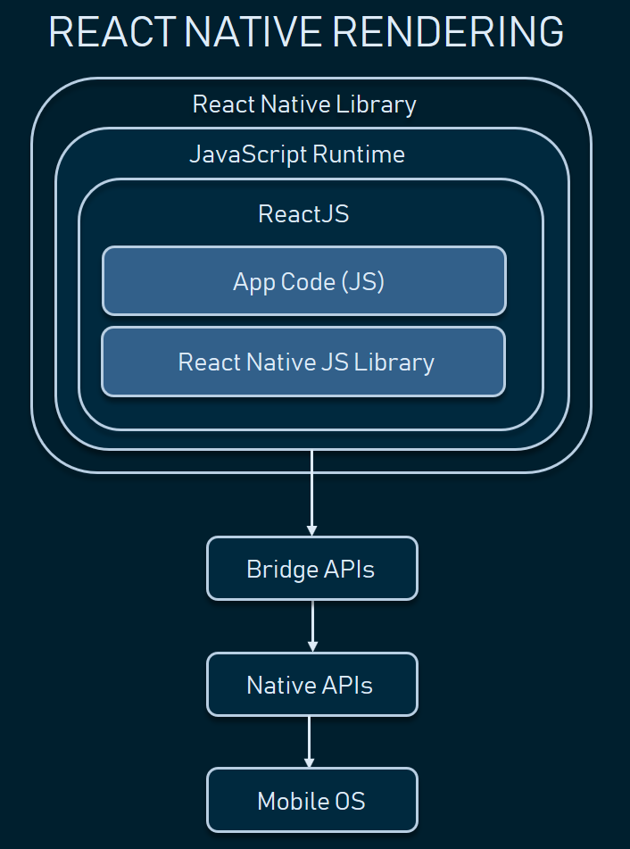
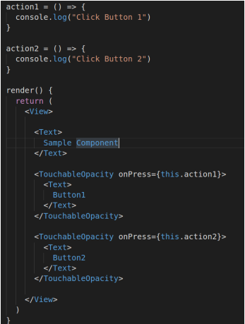
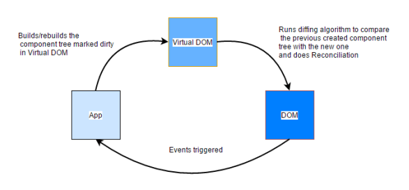
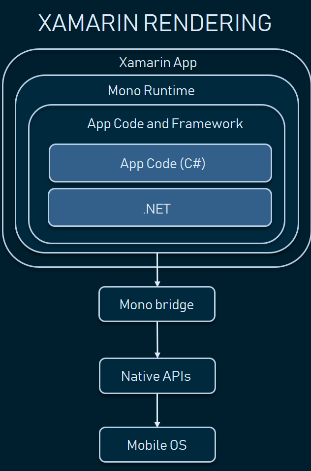
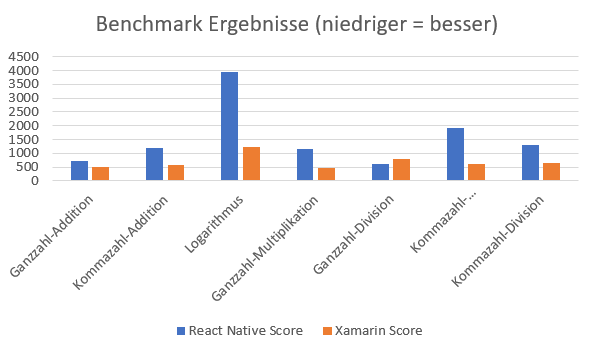

# Evaluation der mobilen Anwendungsentwicklung mit React Native (JS) vs. Xamarin (C#)

**Autor:** Steffen Dorsch

## 1 Hintergrund

<p align="justify">
Die Entscheidung zwischen Xamarin und React Native kann eine Herausforderung darstellen, da sie von der Funktionalität abhängt, die die App bieten soll. Die Umgehung der auftretendenen Hindernisse oder gar der Wechsel der Entwicklungswerkzeuge ist mit einem großen Aufwand verbunden. Die Funktionen, die für die weitere Analyse ausgewählt wurden, gehören zu den allgemeinen Fähigkeiten, die in den meisten Anwendungen enthalten sind, wie z. B. die Nutzung von Gerätefunktionen oder die Nutzung des Dateisystems.</p>

## 2 Einleitung
<p align="justify">
Im Zeitalter der modernen Informations- und Kommunikationssysteme haben sich die Menschen an die Nutzung von Computern und die vielen für sie verfügbaren Anwendungen gewöhnt. Die Nutzung und Entwicklung mobiler Anwendungen ist jedoch eine relativ junge und schnell wachsende Branche. Die Nutzung mobiler Anwendungen hat einen positiven Effekt, der überall auf der Welt zu spüren ist. Die Industrieländer werden dank mobiler Anwendungen bequemer, während die Menschen und die Gesellschaft der Schwellenländer sich modernisieren und eine neue Art von informationstechnischer Infrastruktur schaffen. Mobile Anwendungen sind Programme, die auf winzigen mobilen Handheld-Geräten laufen. Diese Geräte sind tragbar, einfach zu bedienen und können von jedem Ort und zu jeder Zeit genutzt werden. Mobile Anwendungen werden heute von vielen Menschen für eine Vielzahl von Zwecken genutzt, z. B. zur Kommunikation mit Freunden und Familie, zum Surfen im Internet, zur Verwaltung von Dateiinhalten, zur Erstellung und Verwaltung von Dokumenten, zur Unterhaltung und für andere Aktivitäten. Der Nutzer kann von überall aus auf die Funktionen der mobilen Anwendung zugreifen. Die Erledigung vieler Aktivitäten im Alltags- und Berufsleben funktioniert mittereile mit mobilen Anwendungen, oder wird durch diese unterstützt. Mobile Anwendungen haben nicht nur Auswirkungen auf ihre Nutzer, sondern spielen auch eine wichtige Rolle für das Funktionieren von Unternehmen. Zahlreiche kommerzielle Organisationen erwirtschaften mit der Nutzung mobiler Anwendungen Einnahmen. [1]</p>
<p align="justify">
Über 6,5 Milliarden mobile Geräte[25], sowie mehr als 4,5 Millionen mobile Apps alleine im Google Play Store[26] und Apple App Store [27], sind heute weltweit im Einsatz. Softwareentwicklern stehen mehrere Optionen zur Verfügung, wenn es darum geht, native, hybride oder mobile Webanwendungen zu entwickeln. Die Benutzerfreundlichkeit einer mobilen Anwendung hängt von einer Vielzahl von Faktoren ab, wie z. B. den Fähigkeiten und der Auflösung des Geräts, den Kosten für die Datennutzung, der Netzwerkkonnektivität und dem Umfang, in dem die Benutzer mit der Anwendung interagieren können. Die Hersteller von Mobilgeräten haben in den letzten Jahren hart daran gearbeitet, Geräte mit höherer Bildschirmauflösung, größerer Speicherkapazität und besserer Netzanbindung anzubieten, was die Betriebsumgebung für aktuelle mobile Anwendungen verbessert. In diesem Artikel werden die Entwicklungsmethoden für jede dieser Möglichkeiten verglichen und eine Reihe von Kriterien für Plattformen und Geräte entwickelt, die für wichtige Entscheidungen bei der Entwicklung herangezogen werden können. Die wichtigsten Probleme bei jeder Methode der Anwendungsentwicklung werden erläutert, sowie dann die Vor- und Nachteile der einzelnen Methoden gegenübergestellt.</p>
<p align="justify">
Das Motto "einmal schreiben, überall einsetzen" war die treibende Kraft hinter der Entstehung der plattformübergreifenden Entwicklung. Die Nachteile der individuellen Entwicklung für verschiedene Plattformen können durch die Verwendung einer einzigen Codebasis vermieden werden, die auf zahlreichen Systemen ausgeführt werden kann. Außerdem ist es möglich, die vielen Versionen der Programme, die für verschiedene Plattformen entwickelt werden, einheitlich zu gestalten, und so beim Entwicklungszyklus ein hohes Einsparpotential für Geld und Zeit zu schaffen. Ein ähnliches Muster war in der mobilen Entwicklung zu beobachten, als die Branche der mobilen Anwendungen zu florieren begann, als der Apple App Store im Juli 2008 zum ersten Mal der Öffentlichkeit zugänglich gemacht wurde. [7] Seitdem ist ein klares Muster steigender Beliebtheit zu beobachten, wie die insgesamt 143,6 Milliarden App-Downloads über alle Plattformen hinweg im Jahr 2021 zeigen. [28] Aufgrund dieser Popularität kann sich jedes Unternehmen einen Wettbewerbsvorteil verschaffen, indem es eine mobile Anwendung entwickelt, die mit den beiden beliebtesten Betriebssystemen, iOS und Android, kompatibel ist, die zusammen 97 Prozent des Marktanteils ausmachen. [7] Im Jahr 2022 gab es 6,5 Milliarden Geräte, die aktiv genutzt wurden. [25] Es reicht aus, wenn Entwickler dies wissen, um sich für das Konzept der plattformübergreifenden mobilen Entwicklung zu begeistern. Im Folgenden werden Xamarin und React Native, zwei beliebte Frameworks für die Entwicklung mobiler Anwendungen, verglichen und der Gesamtansatz für die plattformübergreifende mobile Entwicklung beschrieben.</p>

### 2.1 Was ist eine mobile Applikation? Ein Überblick
<p align="justify">
Bei mobilen Anwendungen handelt es sich um Software oder Programmgruppen, die auf einem mobilen Gerät installiert werden können, um auf diesem Gerät arbeiten und bestimmte Funktionen im Namen des Benutzers auszuführen. Die Nutzung mobiler Anwendungen ist ein relativ neuer Teilbereich der Informations- und Kommunikationstechnologie, der sich rasch ausbreitet. Mobile Anwendungen sind einfach, benutzerfreundlich, erschwinglich, herunterladbar und funktionieren auf den meisten Mobiltelefonen, auch auf Einsteiger- und preiswerten Mobiltelefonen. Aufgrund ihres großen Funktionsumfangs kann die mobile Anwendung für eine Vielzahl von Zwecken genutzt werden, z. B. zum Telefonieren, Schreiben von SMS, Surfen, Chatten, Kommunizieren über soziale Netzwerke, Abspielen von Audio-, Video- Nachrichten oder Spielen. Bei den mobilen Anwendungen sind einige bereits auf dem Gerät vorinstalliert, während andere vom Benutzer aus dem Internet heruntergeladen und dann auf dem mobilen Gerät installiert werden müssen. Aus rein technologischer Sicht können die vielen mobilen Anwendungen auf einer Vielzahl von kontrollierten Plattformen betrieben werden, darunter iPhone, BlackBerry, Android, Symbian und Windows, zusätzlich zu einigen virtuellen Maschinen. [2]
</p>
<p align="justify">
Es gibt viele Anwendungen für die eine Internetverbindung zwingend erforderlich ist. Infolgedessen ist die mobile Internetnutzung sprunghaft angestiegen. Apps für mobile Geräte werden entwickelt, um Menschen im Alltag zu unterstützen und mit dem Internet zu verbinden, so dass sie mit der Welt kommunizieren, Informationen aus der Ferne erhalten und ihre Position bestimmen können. Zum Beispiel kann die Klimaanlage über eine App gestartet werden, sobald der Benutzer auf dem Weg nach Hause ist. Bestenfalls würde dies auch noch automatisch "smart" passieren, ohne dass der Nutzer dies manuell anstoßen muss. So kann zum Beispiel auch eine Fahrzeug- oder Hausalarmanlage kann mit dem Telefon verbunden sein um eine Verwaltung und Überwachung aus der Ferne zu ermöglichen.
</p>
<p align="justify">
Mobile Anwendungen ermöglichen es den Nutzern auch, Geschäfte zu tätigen. Über mobile Handelsapps können Produkte angesehen, ausgewählen und bestellt werden. Die mobilen Zahlungs-Apps können in Restaurants oder auf Märkten verwendet werden, um Zahlungen abzuwickeln. Ein weiterer Aspekt von mobilen Anwendungen ist das mobile Banking und E-Ticketing. YouTube-Videos und -Filme können auf mobilen Geräten direkt über die YouTube-App angesehen werden um Video und Ton abzuspielen. Für Kinder gibt es mobile Spiele, eine weitere Art von mobiler Anwendung.
</p>

## 3 Probleme im Zusammenhang mit der Entwicklung mobiler Anwendungen
<p align="justify">
Bei der Entwicklung einer mobilen Anwendung sollte das Augenmerk weniger darauf gerichtet sein, "was zu tun ist", sondern eher darauf, "was nicht zu tun ist". Bei der Arbeit an einer brandneuen Anwendung müssen die Entwickler eine Reihe von Hindernissen überwinden. Hier werden nur einige wenige von ihnen aufgezeigt. [3]</p>

### 3.1 Wahrnehmbarkeit der Anwendung
<p align="justify">
Der Wettbewerb in der Branche für mobile Anwendungen hat sich durch die steigende Zahl der Anwendungen, die entwickelt werden, in vergleichbarem Maße verschärft, und es besteht ein ständiger Bedarf an Apps, die sich abheben und anerkannt werden. [2] Letztendlich wollen Anbieter, dass Kunden ihre Produkte herunterladen. Die Software-Store-Optimierung, ist ein wichtiger Schritt, um eine vielversprechende App für die Öffentlichkeit zugänglich zu machen. Ähnlich wie bei der Suchmaschinenoptimierung (SEO) geht es bei der Affiliate-Marketing-Optimierung (ASO) um die Verwendung bestimmter Schlüsselwörter und Phrasen, um den Besucherverkehr auf ein bestimmtes Produkt zu lenken. Bei der Nutzung von Suchmaschinen wie Google geht es in erster Linie darum, dass das Produkt in den Ergebnissen einer Suche nach einem bestimmten Begriff, möglichst weit oben, auftaucht.</p>
<p align="justify">
Ein erster Schritt kann dabei sein, sich die konkurrierenden Anwendungen in dem untersuchten Bereich anzusehen, und dann die Ergebnisse der Suche in der Reihenfolge ihrer Bewertung zu prüfen. Ein weiterer wichtiger Faktor, der berücksichtigt sein sollte, ist die Verwendung von Farben und Symbolen. Das verwendete Symbol ist das allererste Element, das die Aufmerksamkeit des Nutzers erregt. Es sollte daran gearbeitet werden, das Gesamtdesign zu verbessern und es ansprechender zu gestalten, damit die Nutzer eher bereit sind, auf die Anwendung zu klicken und sie zu kennen zu lernen. [2]</p>

### 3.2 Nutzung des Bildschirms
<p align="justify">
Die Nutzer haben eine Vielzahl von Geräten, deren Bildschirme sich in ihrer Größe erheblich unterscheiden. Es ist keine gute Idee, das Design auf die eine bestimmte Plattform zu beschränken. Daher ist es wichtig, eine Anwendung zu entwickeln, die mit einer möglichst großen Anzahl verschiedener Geräte kompatibel ist. [3] Darüber hinaus müssen die Betriebssysteme evaluiert werden, nämlich Windows, Android und iOS. Jedes von ihnen verwendet seine eigenen Designmuster und Benutzeroberflächen. Ein Blackberry-Telefon kann zum Beispiel einen kleineren Bildschirm und eine physische QWERTZ-Tastatur haben, wie beim Blackberry Curve, oder aber einen größeren Touchscreen und eine virtuelle Tastatur, wie beim Blackberry Storm. </p>
<p align="justify">
Beide Optionen müssen mit der App nutzbar sein. Das Blackberry Storm erfordert die Verwendung großer Schaltflächen für die Interaktion mit dem Touchscreen, während das Blackberry Curve die Verwendung kleinerer Komponenten für Navigationszwecke erfordert, damit sie auf einem kompakteren Bildschirm angezeigt werden können. Ein responsives Design ist von größter Bedeutung. Es bietet ein höheres Maß an Flexibilität und kann an eine Vielzahl von Anzeigeformaten und Bildschirmgrößen angepasst werden. Eine gründliche Testphase ist hilfreich, wenn es um technische Schwierigkeiten mit dem Betriebssystem geht. Die Veröffentlichung einer Beta-Version der App kann hierbei helfen, die App auf einer breiten Masse von Geräten zu testen.</p>

### 3.3 Kompromiss zwischen Leistung und Batterielebensdauer
<p align="justify">
Nach dem Design und der Benutzeroberfläche ist ein weiterer wichtiger Faktor, wie gut eine Anwendung funktionieren wird und wie viel Strom sie benötigt. Die Hauptschwierigkeit besteht darin, eine Anwendung zu entwickeln, die frei von Fehlern ist und so wenig Strom wie möglich verbraucht, aber dennoch einwandfrei funktioniert. Dies ist sehr wichtig, da mobile Geräte nur begrenzte Verarbeitungskapazitäten haben und zudem nur wenig Strom verbrauchen sollen, da sie ihre Energie aus Batterien beziehen. Wenn die Software zu viel Strom verbraucht, ist die Wahrscheinlichkeit groß, dass die Benutzer sie nicht mehr benutzen und sich nach Alternativen umsehen, die weniger Strom verbrauchen, sodass die Batterien der Benutzer länger halten. In der letzten Phase des Entwurfsprozesses werden Leistungsaspekte berücksichtigt. Menschen haben unterschiedliche Ansichten über die Leistung von Apps. Die Bewertung der Leistung wird durch die Tatsache erschwert, dass es Tausende von unterschiedlichen Geräten gibt, von denen jedes seine eigene Verarbeitungsleistung hat. [4]</p>
<p align="justify">
Es ist an und für sich schon eine große Leistung, eine Anwendung auf dem Gerät, für das sie gedacht ist, richtig funktionieren zu lassen. Es ist ein schwieriger Prozess, einen Benutzer für eine Anwendung zu gewinnen, und jede Verzögerung oder Langsamkeit in der Anwendung ist eine der größten Katastrophen für das Interesse der Benutzer. Schätzungsweise 52 Prozent der Nutzer entfernen Anwendungen aufgrund von Leistungsproblemen. Damit ist dies der zweithäufigste Grund nach der Gestaltung der Benutzeroberfläche, die 58 Prozent der Deinstallationen ausmacht. [4]</p>

## 3.4 Softwareevolution und Digitalisierung
<p align="justify">
Die Wartungsfreundlichkeit (Maintainability) ist eine äußerst wichtige Maßnahme, da sie den Programmierer vor die Frage stellt, ob die mobile Anwendung auch nach umfangreichen Änderungen am Design leicht gewartet werden kann oder nicht. Es besteht die Möglichkeit, dass die Welt um uns herum technologische Veränderungen erfährt, die die mobile Anwendung unbrauchbar machen könnten. Die Skalierbarkeit ist eine weitere Maßnahme, die beim Vergleich und der Gegenüberstellung der beiden Frameworks in Betracht gezogen wird. Damit soll sichergestellt werden, dass das Framework den Anspruch unterstützt, die mobile Anwendung von einer sehr einfachen Anwendung zu einer umfangreichen und anspruchsvollen Anwendung zu erweitern. Ist es möglich, zusätzliche Funktionen hinzuzufügen und eine Skalierung zu ermöglichen? Eine weitere Maßnahme und Hürde besteht darin, festzustellen, ob das Entwicklungsteam über das nötige Fachwissen verfügt, um die mobile Anwendung sowohl in Bezug auf die Benutzerfreundlichkeit als auch auf die Funktionalität auf die nächste Stufe zu heben. Die Gegenüberstellung von Xamarin und React Native könnte für die Entscheidungsfindung hilfreich sein, wenn über die Entwicklung einer mobilen Anwendung nachgedacht wird.</p>
<p align="justify">
Diese Ausarbeitung kann auch als Grundlage für den Übergang der mobilen Entwicklung von ihrer derzeitigen Struktur zu React Native oder Xamarin dienen. Die Notwendigkeit der Entscheidung, sich der mobilen Entwicklung anzuschließen oder die derzeitige Struktur zu ändern, besteht darin, sich mit einigen der Herausforderungen zu identifizieren, die in dieser Arbeit behandelt werden. Das Hauptaugenmerk liegt auf dem angestrebten Ergebnis. Die Erweiterung eines Portfolios um eine mobile Anwendung ist nichts, was zu jeder Zeit durchgeführt werden sollte. Es kann sehr viel Zeit in Anspruch nehmen und ist mit einer großen Verantwortung verbunden. Wenn ein Unternehmen bereits eine erfolgreiche Einrichtung für die mobile Entwicklung hat, sollte diese nicht verändert werden, es sei denn, es besteht die Notwendigkeit einer Aktualisierung oder Erweiterung. [4]</p>

## 4 Plattformübergreifende Entwicklung
<p align="justify">
Die Entwicklung mobiler Anwendungen für mehrere Betriebssysteme unter Verwendung eines einzigen technologischen Stacks wird als plattformübergreifende Entwicklung mobiler Anwendungen bezeichnet. Die bedeutendsten Betriebssysteme sind iOS und Android mit 97 Prozent Marktanteil. [5, 7]</p>
<p align="justify">
Anstatt zahlreiche Versionen einer Software zu erstellen, von denen jede in der für die jeweilige Plattform vorgesehenen Muttersprache erstellt wird, muss der Code nur einmal geschrieben und kann dann gleichzeitig auf verschiedenen Plattformen veröffentlicht werden. Die Vorteile, die sich daraus ergeben können, sind die folgenden:</p>

* Inhalte einmal erstellen und überall verbreiten: Die Möglichkeit, Code aus einer einzigen Codebasis für verschiedene Betriebssysteme zu exportieren, ist der größte Vorteil der gleichzeitigen Entwicklung für mehrere Plattformen.
* Konsistenz über alle Anwendungen hinweg: Mit einer einzigen, zentralisierten Codebasis kann das Erscheinungsbild, das Verhalten und die Benutzerfreundlichkeit der Anwendungen auf allen unterstützten Plattformen einheitlich gestaltet werden. Jedes einzelne Update und jede einzelne Reparatur wird sofort überall verfügbar.
* Es kann Zeit und Geld gespart werden, indem ein einziges Team mit der Entwicklung mehrerer nativer Versionen der Anwendung beauftragt wird, die eine gemeinsame Codebasis verwenden, anstatt mehrere Teams mit jeweils eigenen Fähigkeiten unabhängig voneinander an jeder Version arbeiten zu lassen. Dies ermöglicht zudem kürzere Entwicklungszyklen.
* Mit der Veröffentlichung einer App auf verschiedenen Plattformen können mehr Menschen im Zielmarkt erreicht werden, ohne dass damit mehr Arbeit verbunden ist. Infolgedessen wird die Zahl der Menschen, die die App herunterladen und nutzen, steigen.

<p align="justify">
Sowohl die Entwicklung für mehrere Plattformen auf einmal als auch die Entwicklung ausschließlich für eine Plattform haben ihre Vor- und Nachteile. In diesem Teil werden die Vor- und Nachteile der Verwendung von plattformübergreifenden mobilen Entwicklungsframeworks wie Xamarin und React Native für die Erstellung mobiler Anwendungen diskutiert. Entwickler können schnelle, plattformübergreifende nicht-native Anwendungen mit Xamarin oder React Native erstellen. React Native hat in den folgenden Vergleichsbereichen einen kleinen Vorteil gegenüber Xamarin: [5]</p>

* Leistungsfähigkeit
* Beliebtheit
* Das Ökosystem der Community und der Entwickler
* Verfügbarkeit
* Kompilierung
* Kosten

<p align="justify">
Es ist wichtig, die Unterschiede zwischen Xamarin und React Native zu verstehen, um sie vergleichen und gegenüberstellen zu können.</p>

## 5 React Native
<p align="justify">
Die Ursprünge von React Native und die drei wichtigsten Eigenschaften werden diskutiert. Außerdem werden die grundlegenden Funktionen und die Struktur einer React Native-Anwendung erläutert. Nach den enormen Erfolgen von React in der Online-Entwicklungsbranche hat Facebook die Entscheidung getroffen, seinen Einflussbereich auf die Mobilbranche auszuweiten. Am Anfang war React Native ein Projekt, das innerhalb von Facebook im Rahmen eines internen Hackathons entwickelt wurde. Sein primäres Ziel war es, den Prozess der Anwendungsentwicklung sowohl für iOS als auch für Android zu rationalisieren. Da sich das Framework jedoch immer weiter ausbreitet, kann die React Native-Anwendung einfach auf anderen Plattformen wie Windows, dem Web und Tizen eingesetzt werden.</p>
<p align="justify">
Facebook führte im Jahr 2015 das Open-Source-Framework für die plattformübergreifende Entwicklung mobiler Apps ein, das als React Native (oft als RN abgekürzt) bekannt ist. Die Plattform bietet Entwicklern die Möglichkeit, mobile Anwendungen mit JavaScript und React zu erstellen, zusätzlich zu den Funktionen der nativen Plattform. Darüber hinaus kombiniert sie die nützlichsten Aspekte der nativen Programmierung mit dem React-JavaScript-Toolkit, das als das beste seiner Art für die Erstellung beeindruckender Benutzeroberflächen (UIs) gilt. Expo, Callstack, Infinite Red, Software Mansion und Microsoft haben alle zur React Native-Community beigetragen, die dank der Spenden von Menschen und Unternehmen aus der ganzen Welt immer weiter wächst. [11]</p>

### 5.1 Was bietet React Native?
<p align="justify">
Das Entwicklen von mobilen Anwendungen, die sowohl die Leistung als auch das Aussehen und das Gefühl einer nativen Anwendung haben, ist das, wofür React Native verwendet wird. Da das RN-Team mit hochentwickelten Entwickler-Tools ausgestattet ist, ist die Verwendung robuster Tools während des gesamten Entwicklungsprozesses ein natürlicher und notwendiger Bestandteil der Erfahrung. RN ist die richtige Plattform für alle, die versuchen, den Produktentwicklungszyklus positiv zu beeinflussen.</p>
<p align="justify">
Die Community, die an React Native arbeitet, hat große Fortschritte gemacht und hat den Vorteil, dass sie auf der Programmiersprache JavaScript basiert, die weit verbreitet ist. Darüber hinaus bietet es Entwicklern, die an iOS oder Android arbeiten, die Möglichkeit, die Komponenten auszuwählen, die sie für ihre Projekte verwenden möchten, und gibt ihnen mehr kreative Kontrolle.</p>
<p align="justify">
Darüber hinaus wird das RN-Framework von zahlreichen Start-ups und Unternehmen aus einer Vielzahl von Branchen rund um den Globus geschätzt. Dazu gehören Unternehmen wie Walmart und Salesforce. [13]</p>

<center>

|  | 
|:--:| 
| *Abbildung 1: React Native Rendering [29]* |
</center>

<p align="justify">
React Native ist eine der aktivsten und unterstützendsten Gruppen in der Open-Source-Welt. Tatsächlich ist React Native im März 2018 das drittmeistgenannte Projekt auf GitHub. Nicht nur einzelne Entwickler und Facebook leisten Beiträge dazu, sondern auch eine Reihe großer Technologieunternehmen wie Microsoft und Samsung spielen eine wichtige Rolle bei der Entwicklung von React Native. Einer der spannendsten Aspekte von React Native ist, dass es zeitgemäße Web-Methoden auf mobile Endgeräte bringen kann, ohne große Abstriche bei der Funktionalität oder Geschwindigkeit zu machen. Auch wenn React Native-Anwendungen größtenteils in JavaScript integriert sind und im Kern auf JavaScript basieren, bedeutet dies nicht, dass es sich bei React Native-Anwendungen um Hybrid- oder HTML5-Anwendungen handelt. React Native-Anwendungen können dank der Verwendung der zugrunde liegenden nativen Schnittstelle Ansichten anzeigen und auf native Hardware wie die Kamera und den Speicher zugreifen.
</p>

### 5.2 JSX
<p align="justify">
Die Verwendung von JSX ist einer der Bereiche des Programmcode für die React Native-Anwendung, zur Beschreibung von UI-Elementen. JSX ist eine spezifische syntaktische Erweiterung, die zu JavaScript hinzugefügt werden kann. Ihr Hauptzweck ist es, das Erscheinungsbild der Benutzeroberfläche (UI) festzulegen. Bei der Erstellung des Programms wird JSX in ein in JavaScript geschriebenes Standardobjekt umgewandelt. Der in Abbildung 2 gezeigte Beispielcode ist repräsentativ für ein typisches JSX-Fragment.
</p>

<center>

|  | 
|:--:| 
| *Abbildung 2: JSX Skript [8]* |
</center>

<p align="justify">
Da JSX zur Definition der Benutzeroberfläche verwendet wird, könnte man argumentieren, dass JSX nur eine weitere Vorlagensprache ist, ähnlich wie HTML oder XAML. Dies ist jedoch nicht der Fall. Da JSX und herkömmliche JavaScript-Objekte beide mehrfach konvertierbar sind, können wir normale JavaScript-Ausdrücke in JSX schreiben. Dies ermöglicht es uns, komplexeren Code zu erstellen. Es ist wichtig, darauf hinzuweisen, dass die Vermeidung von Injektionsangriffen einer der Vorteile von JSX ist. Bevor die Ausgabe angezeigt wird, wandelt das React DOM jeden eingegebenen Wert in eine Standardzeichenkette um. Aus diesem Grund kann der Benutzer keine Skripte oder Anweisungen über die Schnittstelle in das Programm einspeisen. [8]</p>

### 5.3 Virtual DOM
<p align="justify">
Die Verwendung von Virtual DOM ist einer der Hauptgründe, warum React Native-Anwendungen auf einer Vielzahl verschiedener Plattformen funktionieren können. React ist in der Lage, eine Geschwindigkeitssteigerung zu erzielen, indem es eine leichtgewichtige Version des DOM-Baums manipuliert, die auf den eigentlichen DOM-Baum abgebildet wird. Dies wird durch Virtual DOM ermöglicht. Die folgende Abbildung 3 beschreibt den Prozess, der von Virtual DOM verwendet wird.</p>

<center>

|  | 
|:--:| 
| *Abbildung 3: Arbeitsablauf Virtual DOM [9]* |
</center>

<p align="justify">
Die Beziehungen zwischen den Anwendungen, dem DOM und dem virtuellen DOM sind in Abbildung 3 dargestellt. Jede Benutzereingabe in das DOM, wie z.B. das Anklicken einer Schaltfläche, erzeugt letztendlich Ereignisse innerhalb des Programms. Diese Ereignisse wiederum definieren die Struktur des virtuellen DOM. Darüber hinaus führt das Programm regelmäßig Vergleiche durch, um das reale DOM mit Delta-Updates zu aktualisieren. [9]</p>

<p align="justify">
In React wird jedes Mal, wenn ein JSX-Element angezeigt werden muss, auch das virtuelle DOM-Objekt, das diesem Element entspricht, gleichzeitig aktualisiert. Ein Snapshot des derzeit aktiven virtuellen DOM-Baums wird von React gemacht, bevor irgendwelche Aktualisierungen vorgenommen werden. Daher kann React nach einer Aktualisierung einen Vergleich zwischen dem aktualisierten DOM-Baum und dem vorherigen Snapshot durchführen, um genau die Komponenten zu bestimmen, die im aktuellen DOM-Baum neu gerendert werden müssen. Im Bereich von React wird dieser Prozess als "diffing" bezeichnet und erfordert eine Reihe von Algorithmen, um ihn abzuschließen.</p>

<p align="justify">
React arbeitet intensiv an der Stapelverarbeitung von DOM-Lese- und Schreibvorgängen. Dies geschieht zusätzlich zu der leistungsstarken "Diffing"-Technik. Nachdem die geringste Anzahl von Schritten bestimmt wurde, die notwendig sind, um das virtuelle DOM zu aktualisieren, führt React alle diese Schritte in einer Ereignisschleife aus und interagiert zu keinem Zeitpunkt mit dem realen DOM. React wird das reale DOM erst dann neu zeichnen, wenn die Ereignisschleife beendet ist. Infolgedessen sollte es nur einen einzigen Zeitpunkt geben, in dem das reale DOM gezeichnet werden muss. [10]</p>

<p align="justify">
Der Begriff "reconciliation" bezieht sich auf den gesamten Prozess, der das "diffing" mit dem Prozess der Bestimmung der zu aktualisierenden Knoten im View-Baum kombiniert. In React werden Reconciliation und Rendering aus offensichtlichen Gründen als zwei verschiedene Schritte behandelt. Daher sind React und React Native in der Lage, ihre eigenen Renderings zu verwenden, während sie gleichzeitig denselben Reconciler nutzen, der vom React Core bereitgestellt wird.</p>

### 5.4 Props und State
<p align="justify">
Props und State sind die Namen der beiden primären Datenmodelle, die mit dem React-Framework verwendet werden können. Sie sind unterschiedlich aufgebaut und erfüllen verschiedene Funktionen, die sie beide gemeinsam haben. Props hingegen werden fast immer von außen gesetzt, während der State nur im Kontext des Lebenszyklus der Komponente verwendet wird. Andererseits handelt es sich bei beiden um einfache JavaScript-Objekte, die einen direkten Einfluss auf den Prozess der Initiierung von Render-Updates haben.</p>

<p align="justify">
Props werden von der übergeordneten Komponente übermittelt und dienen daher in erster Linie dazu, während des Erstellungsprozesses als Parameter verwendet zu werden, damit die Komponente an die Wünsche des Benutzers angepasst werden kann. Mit anderen Worten: Die Konfiguration einer Komponente wird als ihre Prop bezeichnet. Sie kann leer sein, wenn sie den Anforderungen entspricht, aber wenn sie einmal festgelegt ist, kann sie nicht mehr geändert werden. Diese Eigenschaft wird als Unveränderlichkeit bezeichnet.</p>

<p align="justify">
Andererseits konnte der Zustand nur innerhalb der Komponente initialisiert werden, wenn diese zum ersten Mal eingebunden wurde. Außerdem kann man dem Zustand der Komponente jederzeit einen neuen Wert zuweisen, wenn es angebracht ist. Jede einzelne Benutzereingabe muss einen proportionalen Einfluss auf den Zustand der Komponente haben; dies ist ein Standardarbeitsverfahren. Wenn man mit einer anspruchsvollen und interaktiven React-Anwendung arbeitet, ist es üblich, dass der Zustand einer Komponente als Prop für die Nachkommen der Komponente bereitgestellt wird. Wie zum Beispiel das Folgende:</p>

```javascript
<ChildComponent name={this.state.childsName} />
```

<p align="justify">
Unter den meisten Umständen ist das Testen und Wiederverwenden einer zustandslosen Komponente ein einfacher Prozess. Infolgedessen wandeln Entwickler häufig den Zustand einer übergeordneten Komponente in die Eigenschaften einer untergeordneten Komponente um.</p>

## 6 Xamarin
<p align="justify">
Xamarin ist eine Lösung für die Erstellung von mobilen Anwendungen, die auf mehreren Plattformen laufen können. Es bietet Entwicklern eine einheitliche Umgebung. Dies ermöglicht es Entwicklern, Code in der Sprache C# zu erstellen statt in Objective-C für iOS und Java für Android. Diese beiden Programmiersprachen werden von Apple bzw. Google verwendet. Um die Kompatibilität mit nativen Benutzeroberflächen aufrechtzuerhalten, durchläuft jede Anwendungsimplementierung ihren eigenen Entwicklungsprozess als Teil eines plattformspezifischen Projekts.</p>

<p align="justify">
Es handelt sich um ein Framework für die Entwicklung mobiler Anwendungen, das quelloffen und mit mehreren Plattformen kompatibel ist. Die Plattform wurde 2011 gegründet und erleichtert die Entwicklung zuverlässiger und leistungsfähiger Apps mit dem .NET-Framework für Betriebssysteme wie Android, iOS und Windows. Xamarin ist eine Abstraktionsschicht, die bei der Verwaltung der gemeinsamen Codekommunikation mit dem zugrunde liegenden Plattformcode hilft.</p>

<p align="justify">
Bis heute ist es eines der angesehensten plattformübergreifenden Produkte für die Erstellung mobiler Anwendungen innerhalb des Microsoft-Ökosystems. Darüber hinaus basiert es auf dem Microsoft-Technologie-Stack und verfügt über eine ständig wachsende Community von mehr als 1,4 Millionen Softwareingenieuren und Programmierern. [12]
</p>

<p align="justify">
Innerhalb jeder Anwendung wird ein direkter Zugang zu den nativen Anwendungsprogrammierschnittstellen (APIs) bereitgestellt, so dass Entwickler Zugriff auf die gesamte native Hardwarefunktionalität haben. Bei der Arbeit an diesen Projekten gibt es die Möglichkeit, Kerncode, der jeder Anwendung ähnlich ist, wiederzuverwenden, indem Sie portable Klassenbibliotheken (PCLs) oder eine andere Möglichkeit nutzen. Dazu gehören u. a. Datenmodelle, Geschäftslogik, Datenbankzugriff und Cloud-Verbindungen. Wenn die Verwendung einer Bibliothek, die in der Muttersprache erstellt wurde, für ein Projekt erforderlich ist, kann ein Entwickler eine native Einbettung konstruieren, die den Zugriff auf die Bibliothek durch Aufrufe in C# ermöglicht. Die Leistung, die Sie mit Xamarin-Apps erhalten, ist mit der Geschwindigkeit einer nativen Anwendung vergleichbar und kann in bestimmten Fällen sogar besser sein. Xamarin-Mobilanwendungen können im Durchschnitt etwa 75 % ihres Codes über verschiedene Projekte hinweg wiederverwenden. Wenn die Entwicklung jedes Projekts abgeschlossen ist, kann der Code erstellt und in den jeweiligen App-Store hochgeladen werden, um ihn zu verteilen.
</p>

### 6.1 Was bietet Xamarin?
<p align="justify">
Der Hauptzweck von Xamarin besteht darin, den Austausch von Quellcode und Geschäftslogik über viele Plattformtypen hinweg zu erleichtern. Darüber hinaus kann es von Programmierern verwendet werden, um plattformübergreifende Anwendungen in C# unter Verwendung von Visual Studio zu erstellen. Zudem ermöglicht es die Plattform Entwicklern, bis zu 95 Prozent ihres Codes mit anderen Plattformen zu teilen.
</p>

<p align="justify">
Was bedeutet das genau? Dieser Aspekt deutet darauf hin, dass es möglich ist, ein natives Erscheinungsbild und Gefühl sowie eine native Leistung auf jeder Plattform zu erhalten, ohne Code in verschiedenen Sprachen schreiben zu müssen.
</p>
<center>

|  | 
|:--:| 
| *Abbildung 4: Xamarin Rendering [29]* |
</center>

<p align="justify">
Das Kompilieren von Xamarin-Anwendungen in native Pakete, wie z. B. .ipa-Dateien und .apk-Dateien für iOS- bzw. Android-Geräte, ist ein Prozess, den Softwareentwickler auf einem PC oder Mac durchführen. Darüber hinaus ist Xamarin eine native Plattform, und da sie Zugang zu hundert Prozent der nativen Anwendungsprogrammierschnittstellen (APIs) bietet, können Entwickler auch Programme für Android Wear, Apple Watch und Apple TV erstellen.</p>

<p align="justify">
Anwendungen, die mit Xamarin erstellt wurden, haben Zugriff auf eine Vielzahl von Funktionalitäten und unterstützen plattformspezifische Features. Einige Beispiele für diese Funktionen sind Fingerabdruck-Scanning, ARKit, CoreML und NFC. Darüber hinaus ist es möglich, Bibliotheken von Drittanbietern zu integrieren. Einige Beispiele hierfür sind Facebook, Google Play Services und Google APIs für iOS. Wenn es um Geschäftsbereiche geht, wird Xamarin verwendet, um Anwendungen zu entwickeln, die eine breite Palette von Sektoren bedienen, darunter den medizinischen Bereich, den Energiesektor, den Mediensektor, den Transportsektor und viele mehr.</p>

### 6.2 Hardware-Aspekte

<p align="justify">
Aufgrund der Art und Weise, wie Xamarin aufgebaut ist, gibt es keine Einschränkungen für die Art von Geräten, die Entwickler mobiler Apps verwenden können. Eine native Bindung wird direkt aus den iOS- und Android-SDKs mithilfe der nativen APIs von Xamarin generiert.</p>

<p align="justify">
Diese Methode stellt eine direkte und identische Verbindung zwischen Xamarin-Bibliotheken und den nativen APIs her. Alle nativen Objekte haben dieselben Namen, Eigenschaften und Attribute sowie dieselben Methodenaufrufe, was die Arbeit mit ihnen erleichtert. Xamarin benötigt keine Neuimplementierung von Code, um zu funktionieren. Durch die Verwendung der nativen APIs werden alle nativen Aufrufe durchgeführt. Es kann auf alles zugegriffen werden, vom GPS über den Beschleunigungssensor bis hin zur Kamera und dem Kompass. Dank dieses Ansatzes kann Xamarin Updates noch am selben Tag herausgeben.
</p>

### 6.3 Programmcode-Sharing

<p align="justify">
Entwickler können Bibliotheken erstellen, die in vielen Projekten gemeinsam genutzt werden können, indem sie ein Format verwenden, das als Portable Class Libraries (PCLs) bekannt ist. Eine der jüngsten Entwicklungen von Xamarin ist die Hinzufügung der offiziellen Unterstützung für PCL. Dateiverknüpfung, geklonte Projektdateien und Microsoft Project Linker gehörten zu den früheren Möglichkeiten, die Benutzern zur Verfügung standen. Die gemeinsame Nutzung von Klassenstrukturen über Projekte hinweg war dank all dieser verschiedenen Ansätze möglich. Möglicherweise müssen zusätzliche Maßnahmen ergriffen werden, um den Weg der gemeinsamen Nutzung von Code angemessen einzurichten. Der Grund dafür ist, dass ein erheblicher Teil des Verfahrens manuell durchgeführt wurde. Das Schreiben einer einzigen Bibliothek für ein bestimmtes Kernprojekt ist der einfachste Weg, Code gemeinsam zu nutzen, und erfordert auch den geringsten Wartungsaufwand.</p>

### 6.4 Verwendung von Native Bindings

<p align="justify">
Native Bindings sind ein Mechanismus, der für iOS- und Android-Anwendungen zugänglich gemacht werden kann. Mit dieser Technik können native Bibliotheken innerhalb einer erstellten mobilen Xamarin-Anwendung verwendet werden. Dazu muss eine Bindung, als Mapping der Aufrufe von der C#-Bibliothek an die native Bibliothek, erstellt werden. Dieser Vorgang ist nur teilweise automatisiert. Obwohl Xamarin in der Lage ist, den Großteil der Verbindungen zu erstellen, bleiben einige Aktionen für den Entwickler übrig, die er abschließen muss.</p>

<p align="justify">
Die Verwendung von Native Bindings bietet eine Reihe von Vorteilen. Einer davon ist die Möglichkeit, Bibliotheken einzubinden, die von anderen Parteien entwickelt wurden. Dies kann Entwicklern helfen, Zeit zu sparen, da sie keine großen Teile des Codes neu schreiben müssen. Ein Beispiel für einen Bedarf an einer mobilen Anwendung ist die optische Zeichenerkennung (OCR), was für Optical Character Reading steht. Anstatt den gesamten OCR-Code von Grund auf neu zu erstellen, könnte ein Entwickler Open-Source-Bibliotheken mit Native Bindings integrieren, um mehr Funktionen anzubieten. [12]</p>

## 7 Analyse der Eigenschaften von Xamarin und React Native

<p align="justify">
In diesem Kapitel folgt ein  detaillierter Vergleich zwischen Xamarin und React Native, anhand welcher eine fundierte Entscheidung darüber getroffen werden kann, welches Framework für ein Projekt gewählt werden sollte.</p>

### 7.1 Die Grundlagen der Funktionsweise von Anwendungen

<p align="justify">
Zu seiner Zeit galten die Datenbindungsoperationen, die mit Hilfe von React Native implementiert werden konnten, als innovative Lösung. Dieses Framework nutzt vor allem die einseitige Datenbindung, d. h. es verknüpft Modelldefinitionen mit Darstellungen, enthält aber keinen separaten Supervisor, der dabei hilft festzustellen, ob ein Benutzer die Definition in der Ansicht geändert hat oder nicht. Dies wiederum führt zu einer verbesserten Gesamtleistung der Anwendungen. Trotzdem ist RN auch in der Lage, eine bidirektionale Datenbindung zu unterstützen, die manuell durchgeführt werden muss, um die gegenseitige Kohärenz des Codes zu gewährleisten und die Wahrscheinlichkeit komplizierter Fehler zu verringern.</p>

<p align="justify">
Xamarin verwendet eine strengere MVVM-Architektur mit bidirektionaler Datenbindung, mit der viele Entwickler bereits vertraut sind. Dies schafft ideale Bedingungen für die Zusammenarbeit (verschiedene Abteilungen, wie Design und Programmierung, können gleichzeitig am Entwicklungsprozess teilnehmen). Wenn es um die Arbeit mit den einzelnen Plattformen geht, ist dies im Allgemeinen der wichtigste Unterschied, den man finden kann. RN sollte anstelle von Xamarin gewählt werden, wenn Eigenschaften benötigt werden, die stark auf Leistung ausgerichtet sind. Die Entscheidung sollte hingegen für Xamarin ausfallen, wenn ein flexiblerer Ansatz gewünscht ist.
</p>

### 7.2 Integrierte Werkzeuge

<p align="justify">
Entwickler müssen sich der großen Anzahl an eingebauten Komponenten bewusst sein, die in React Native enthalten sind. Diese Komponenten sind alle über den als npm bekannten Paketmanager zugänglich. Entwickler können sich auf die Entwicklung der Architektur der Anwendung und die Erstellung von Vorlagen für ganz bestimmte Aufgaben konzentrieren und gleichzeitig auf vorgefertigte Tools und Funktionen zurückgreifen, die häufig über eine  eigene Dokumentation verfügben.</p>

<p align="justify">
Bei der Diskussion über Xamarin ist es wichtig zu erwähnen, dass Softwareentwickler nicht nur Zugriff auf die regulären .NET-Klassen haben, sondern auch auf Klassen, die für die Android- und iOS-Plattformen einzigartig sind. Dieser Zugriff wird durch Xamarin.Android bzw. Xamarin.iOS. Dies ermöglicht die Entwicklung von Software, die mit nativen Anwendungen vergleichbar ist.</p>

### 7.3 Kompilierung

<p align="justify">
Der Kompilierungsprozess in React Native läuft folgendermaßen ab: Zunächst wird ein nativer Wrapper generiert, der mit der Benutzeroberfläche kompatibel ist. Als nächstes wird das gesamte JSX/TSX/Flexbox-Set geparst, während der Anwendercode für die Geschäftslogik in JavaScript umgewandelt wird. Schließlich wird der native Wrapper erstellt. Die Just-in-Time-Kompilierung (JIT) ist für iOS-Apps in diesem Szenario nicht möglich, so dass die Ausführung des Softwarecodes etwas verlangsamt werden kann.</p>

<p align="justify">
Die Kompilierung wird bei der Verwendung von Xamarin auf eine ziemlich einzigartige Weise durchgeführt. Eine Art der Kompilierung, die als "Ahead of Time" (AOT) bekannt ist, kann anstelle der JIT-Kompilierung verwendet werden, da die JIT-Kompilierung für iOS in diesem Kontext nicht funktioniert. Sie arbeitet mit einer noch höheren Geschwindigkeit.</p>

### 7.4 Lernkurve bei Technologieeinstieg

<p align="justify">
Für die Entwicklung von Anwendungen mit React Native ist ein grundlegendes Verständnis von JavaScript erforderlich. Die Verbeitungs von Web-Technologien hat JS zu einer der beliebtesten Programmiersprachen gemacht. Auf der anderen Seite schließt dies die Möglichkeit aus, einige Komponenten einer plattformübergreifenden Software mit Hilfe von Drittanbieterlösungen zu entwickeln sowie neue Technologien, Sprachen oder Bibliotheken einzubinden. Trotzdem ist die Arbeit mit RN recht einfach; dennoch weisen Entwickler oft auf die steile Lernkurve hin, die mit dem Framework verbunden ist.</p>

<p align="justify">
Es werden keine Vorkenntnisse in den Programmiersprachen Java/Kotlin (für Android) oder Objective-C/Swift (für iOS) benötigt, um eine App auf Basis von Xamarin zu entwickeln. Durch Xamarin wird, trotz des Verzicht auf die nativen Programmiersprachen der Plattformen, voller Zugriff auf alle Funktionen, die die SDK-Plattform bietet angeboten. Das bedeutet, dass Android- und iOS-Bibliotheken vollständig angeboten werden. Dadurch ist es ziemlich unwahrscheinlich, dass zusätzliche Tools benötigt werden, da es sehr wahrscheinlich ist, dass das Xamarin-Paket bereits alles enthält, was benötigt wird. Um mit Xamarin zu arbeiten, sind daher nur Kenntnisse der C#- und.NET-Technologien erforderlich, zusätzlich zu den grundlegenden Vorausetzungen für die Interaktion mit nativen Klassen auf beiden Plattformen.</p>

### 7.5 Tests
<p align="justify">
Beim Testen von Anwendungen, die mit React Native erstellt wurden, wird häufig ein Tool namens Jest verwendet. Es ist leicht zugänglich, verfügt über eine umfangreiche Dokumentation und hat sich über die Zeit bewährt.</p>

<p align="justify">
Was Xamarin betrifft, so nutzt dieses Projekt Xamarin UITest für die Erstellung von automatisierten Tests. Für den Fall, dass UI-Tests für beide Plattformen gleichzeitig konstruiert werden müssen, wird dies sehr hilfreich sein. Darüber hinaus bietet es Unterstützung für die Inbox Xamarin Test Cloud (eine sehr nützliche, aber teure Funktion).</p>

### 7.6 Dokumentation
<p align="justify">
Die Zugänglichkeit und die kohärente Struktur der React Native-Dokumentation hat dem Framework unter Entwicklern eine gute Reputation eingebracht.</p>

<p align="justify">
Xamarin bietet auch eine recht anständige Dokumentation, die sowohl Beispiele als auch Tutorials enthält, in denen die einzelnen Schritte der Reihe nach durchgelaufen werden können. Auf die Frage "React Native oder Xamarin-Anleitung?" neigen jedoch viele Entwickler dazu, die RN-Dokumentation mehr zu schätzen.</p>

### 7.7 Community
<p align="justify">
Wenn bei der Entwicklung einer App mit React Native auf Probleme gestoßen wird, sind keine großen Schwierigkeiten zu erwarten, online eine Lösung für das Problem zu finden. React Native ist noch recht jung, aber für sein Alter schon unglaublich ausgefeilt und entwickelt.</p>

<p align="justify">
Bei der Xamarin-Online-Community ist die Situation fast die gleiche. Da sie mehr Zeit hatte, zu reifen und sich zu verbreiten, ist sie etwas umfassender. Xamarin bietet auch Unterstützung in Form eines persönlichen technischen Supports, der in der Business-Lizenz der Software enthalten ist. Dieser Support ist nur für Kunden, die diese Lizenz erworben haben, zugänglich.</p>

### 7.8 Preisgestaltung
<p align="justify">
Während Xamarin sowohl eine kostenlose als auch eine Premium-Version anbietet, ist die Nutzung von React Native völlig kostenlos. Die Premium-Version ist hierbei für unternehmensorientierte Zwecke gedacht, und bietet unter anderem persönlichen technischen Support. Dieser Premium-Support aus erster Hand, der ein großes Verkaufsargument für den gesamten Microsoft-Stack ist, ist etwas was React Native fehlt und von Unternehmen vermisst werden könnte, die dann auf Drittanbieter für Support und Beratung zugreifen müssen. </p>

## 8 Vergleich der Entwicklungsumgebungen (IDEs)
### 8.1 Visual Studio

<p align="justify">
Die integrierte Entwicklungsumgebung (IDE) Microsoft Visual Studio ist ein von Microsoft entwickeltes Produkt. Es wird für die Erstellung vieler Arten von Software verwendet, darunter Computerprogramme, Websites, Webanwendungen und Online-Dienste, sowie Smartphone-Apps. Sie ist mit Vervollständigungswerkzeugen, Compilern und anderen Funktionen ausgestattet, die die Erstellung von Software erleichtern sollen. [14]</p>

<p align="justify">
Im Vergleich zur nativen Programmierung sparen sowohl React Native als auch Xamarin eine Menge Zeit, da ein einziger Code für zahlreiche Plattformen erstellt wird. Kostenlose und quelloffene Plattformen sind ein weiterer Vorteil der Verwendung von Xamarin oder React Native. Im Gegensatz zu Xamarin können Entwickler bei React Native die IDE oder den Texteditor ihrer Wahl verwenden, was bei der Erstellung von Apps Zeit und Geld sparen kann.</p>

<p align="justify">
Die kostenlose Community Version von Visual Studio ist eine "Vollständig ausgestattete, flexible und kostenlose IDE für die Entwicklung moderner Apps für Android, iOS und Windows sowie Online-Anwendungen und Cloud-Dienste", heißt es in der Beschreibung der Website. "Studenten, Open-Source- und unabhängige Entwickler" sind berechtigt, diese zu nutzen. Die professionelle Version kann 14 Tage lang kostenlos getestet werden und kostet monatlich 45,00 USD. Zudem ist es für Unternehmen möglich, einen Enterprise Vertrag ab 250,00 USD pro Monat abzuschließen. [18]</p>

### 8.2 JetBrains Rider
<p align="justify">
JetBrains Rider ist eine IDE, die mit mehreren Betriebssystemen kompatibel ist, darunter Windows, Linux und macOS. Sie wurde erstmalig im November 2016 veröffentlicht. [30] Sie ist in Java entwickelt worden und enthält die meisten Funktionen der IDE von Visual Studio. [15]</p>

<p align="justify">
Der Preis von Visual Studio ist viel höher als der von Rider. Auf der anderen Seite gibt es die Community Edition von Visual Studio, die völlig kostenlos genutzt werden kann. Rider hat keine kostenlose Version im herkömmlichen Sinne, aber es bietet eine kostenlose Testphase von 30 Tagen, so dass Entwickler die vollen Möglichkeiten des Tools testen können.</p>

<p align="justify">
Rider ist mit einer Vielzahl von fortschrittlichen Entwicklungswerkzeugen ausgestattet, unterstützt jedoch einige veraltete Module nicht. Da die IDE in erster Linie für die .NET-Entwicklung gedacht ist, eignet sie sich nicht für die Erstellung von Anwendungen, die in anderen Sprachen geschrieben wurden. [16].</p>

<p align="justify">
Rider hat das Potenzial, Visual Studio zu übertreffen und die Arbeit effizienter zu machen, wenn die Projekte, an denen gearbeitet wird, keine anderen Programmiersprachen erfordern. Insbesondere bei großen Projekten ist Rider effizienter, wobei Visual Studio teilweise aufgebläht wirkt und es öfter zu Hängern und Abstürzen kommt. [17]</p>

<p align="justify">
Die MIT-Lizenz war 2015 die am weitesten verbreitete Softwarelizenz auf GitHub, unter anderem weil sie die Wiederverwendung und Verbreitung von Software auf ein Minimum beschränkt. Die BSD-Lizenz mit zwei Klauseln ist immer noch in Kraft. Es gibt viele Ähnlichkeiten zwischen diesen Lizenzen. Sie alle erlauben die Nutzung, Weitergabe und Weitergabe mit Änderungen. Während das Zusammenführen, Veröffentlichen, Verkaufen und Unterlizenzen unter der BSD-Lizenz implizit sind, sind sie unter der MIT-Lizenz ausdrücklich erlaubt.</p>

## 9 Open-Source-Communities

<p align="justify">
Die React Native Community ist sehr groß und hat den Vorteil, dass RN auf JavaScript basiert, welche eine der am weitesten verbreiteten Programmiersprachen überhaupt ist. </p>

<p align="justify">
Darüber hinaus nutzen zahlreiche Start-ups und Unternehmen aus einer Vielzahl von Branchen rund um den Globus das RN-Framework. Dazu gehören Unternehmen wie Walmart und Salesforce. Die Community ist es, die die Entwicklung von React Native vorantreibt. So wie andere Open-Source-Frameworks an Popularität gewonnen haben, gibt es auch bei RN eine große Anzahl von Entwicklern, die nach Fachwissen suchen oder bei Bedarf Hilfestellung leisten.
</p>

<p align="justify">
Darüber hinaus haben die Entwickler Zugang zu einer großen Anzahl von Ressourcen. Sie haben die Möglichkeit, RN-E-Mails zu abonnieren, die Github React Native Community zu besuchen oder Reactiflux zu besuchen (ein großer Chat-Service, bei dem Entwickler schnelle Lösungen erhalten). [21]</p>

<p align="justify">
Xamarin bietet vollen Zugriff auf die nativen Anwendungsprogrammierschnittstellen (APIs) und Toolkits, die auf den Plattformen iOS, Android und Windows verwendet werden. Entwickler können mit Xamarin einen Leistungsgrad erreichen, der dem eines nativen Programms entspricht.</p>

<p align="justify">
Wenn die Entscheidung für die Entwicklung von Anwendungen mit Xamarin getroffen wurde, gibt es Zugriff auf eine Vielzahl von nativen Elementen und Technologien, mit denen hochgradig optimierte Ergebnisse erzielt werden können. Zu diesen nativen Elementen und Technologien gehören der Zugriff auf 100 % native APIs, native Benutzeroberflächen und Prozessoptimierung.</p>

<p align="justify">
Die Unterstützung, die Microsoft für Xamarin bietet, ist einer der vielen herausragenden Aspekte. Man kann nun mit konstantem Entwickler-Support, einer Vielzahl von Lernmöglichkeiten, Zuverlässigkeit und Leistung rechnen, insbesondere im Hinblick auf Lösungen wie Test Cloud. [21]</p>

## 10 Aktive und zukünftige Entwicklungen
<p align="justify">Software ist evolutionär; so wie die Dinosaurier ausstarben, kamen schließlich fortschrittlichere Arten nach, um die älteren, langsameren zu ersetzen. Aufgrund der großen technischen Verschuldung, die große Software-Suiten aufweisen, ist es unmöglich, nach vielen Jahren der Entwicklung grundlegende Änderungen daran vorzunehmen. Gleichzeitig muss bei jeder Änderung die Notwendigkeit berücksichtigt werden, die Abwärtskompatibilität zu wahren.</p>

<p align="justify">
Es ist völlig logisch, dass Software-Ingenieure es vorziehen würden, die wenige Freizeit, die sie haben, nicht mit dem Studium einer Technologie zu verbringen, die mit großer Wahrscheinlichkeit in nicht allzu ferner Zukunft veraltet sein wird. Ein Blick auf Google Trends reicht jedoch aus, um zu sehen, dass das Interesse an React Native so stark ist wie nie zuvor. [22]</p>

<center>

| ![Beliebtheit der Frameworks im Laufe der Jahre: Statistik [22]](media/rnvsxamarin.png "Beliebtheit der Frameworks im Laufe der Jahre: Statistik [22]") | 
|:--:| 
| *Abbildung 5: Beliebtheit der Frameworks im Laufe der Jahre: Statistik [22]* |
</center>

>"We’re working on a large-scale re-architecture of React Native to make the framework more flexible and integrate better with native infrastructure in hybrid JavaScript/native apps" - Sophie Alpert, who serves as Facebook's Engineering Manager for the React project. [31]

<p align="justify">
MAUI ist eine Überarbeitung von Xamarin.Forms, an der Microsoft arbeitet. Der erste Veröffentlichungskandidat wurde Ende April 2022 veröffentlicht. [32]  Es wird erwartet, die Unterstützung für Xamarin.Forms für ein weiteres Jahr fortgesetzt wird. Da Xamarin eine beträchtliche Menge an Investitionen erfordert, könnten einige Unternehmen es trotz des Risikos die Unterstützung zu verlieren, weiterhin verwenden.
</p>

<p align="justify">
Es ist noch unklar, ob dies ein Schritt in die richtige Richtung ist oder nur ein weiterer Versuch, Probleme zu vertuschen. Die Frage, die aufgeworfen wurde, ist, ob Microsoft der Lebensfähigkeit von Xamarin als Lösung genügend Aufmerksamkeit geschenkt hat oder nicht, und ob es ein Wollknäuel geworden ist, das zu kompliziert ist, um es zu entwirren.
</p>

<p align="justify">
Similarly, there are hundreds of applications that have been produced throughout the course of Xamarin's 11-year existence, but fewer developers are showing interest in maintaining them as they become older and more in need of an upgrade.</p>

<p align="justify">
Es ist möglich, dass Xamarin nicht in der Lage sein wird, mit React Native und Flutter gleichzuziehen, da die Newcomer die Szene betreten haben, nachdem sie alle Lektionen darüber gelernt haben, wie Dinge nicht gemacht werden sollten, und sie haben keine technologischen Barrieren, die sie zurückhalten. Der Software-Lebenszyklus wird, um die Wahrheit zu sagen, die Lebensdauer von Xamarin möglicherweise um ein oder zwei Jahre verlängern, was für Unternehmen, die Zeit und Geld in die Erstellung von Xamarin-basierten Anwendungen investiert haben, eine hervorragende Nachricht sein kann. [22] Allerdings ist Xamarin, dem aktuellen Trend zufolge, auf einem absteigenden Ast. 
</p>

## 11 Implementatierung  der Beispielapps
<p align="justify">
Zur Einarbeitung in die beiden Frameworks, sollte je eine App pro Framework mit derselben Funktionalität entwickelt werden. Da allerdings der Fokus auf der Ausarbeitung liegen sollte, wurden die Anwendungen relativ einfach umgesetzt und besitzen nur ca. 60% der Funktionalität der Anforderungen. Zudem wurde auf die Werkzeuge xmysql zur Generierung eines REST-Backends aus der MySQL Datenbank gesetzt, sowie eine Swagger Dokumentation (Anhang (4)) dafür angelegt, über die die Clientschnittstellen automatisch in C# und JavaScript generiert wurden. Diese Entscheidung wurde getroffen, da der Fokus auf den Client Frameworks liegen sollte, und die Schnittstellen unabhängig von den Frontend Frameworks in normalem JavaScript und C# gebaut wurden. Es fehlt aus den gleichen Gründen eine Authentifizierung für die Nutzer sowie für die Rest-Schnittstelle, da diese nur lokal genutzt wurde. Die Implementierungen der Apps befinden sich im Anhang (1), (2), (7) und (8)</p>

### 11.1 Anforderungen

<p align="justify">
Als Beispielapp sollte eine Bestellapp für firmeninterne Verbrauchsgüter einer Kaffeemaschine mit gleichen Funktionalitäten je Framework umgeseztt werden.

Zu den Anforderungen der Nutzer gehören folgende User Stories:<br><br>
Als Nutzer möchte ich... :

* ... mich Registrieren können.
* ... eine neue Bestellung anlegen können.
* ... mit meinen Produktbestellungen eine Wartung der Maschine buchen können.
* ... meine Bestellungen in einer Übersicht mit deren Status sehen können.
* ... einen Benchmark ausführen können, um die App vergleichen zu können.

Als Administrator möchte ich... :

* ... eingegangene Bestellungen ansehen und überprüfen können.
* ... eingegangene Bestellungen bestätigen können sowie einen Liefertermin nennen können.
* ... für Bestellungen mit Wartung einen Wartungstermin vergeben können.

Die entwickelte Datenbank befindet sich im Anhang (3) und wurde nach dem folgenden ER-Diagramm entwickelt:

<center>

|  | 
|:--:| 
| *Abbildung 6: ER-Diagramm* |
</center>

### 11.2 Vergleich Mockups / App Screens
Im folgenden finden sich die Mockups die während der Anforderungsanalyse erstellt wurden im direkten Vergleich mit der umgesetzten App. Die Mockups befinden sich jeweils links, die React Native App mittig und die Xamarin App rechts.

<center>

| ") | 
|:--:| 
| *Abbildung 7: Registierung (Mockup/React Native/Xamarin)* |
</center>
<center>

| ") | 
|:--:| 
| *Abbildung 8: Bestellübersicht (Mockup/React Native/Xamarin)* |
</center>
<center>

| ") | 
|:--:| 
| *Abbildung 9: Neue Bestellung (Mockup/React Native/Xamarin)* |
</center>

<center>

| ") | 
|:--:| 
| *Abbildung 10: Offene Bestellung (Mockup/React Native/Xamarin)* |
</center>

<center>

| ") | 
|:--:| 
| *Abbildung 11: Benchmark (Mockup/React Native/Xamarin)* |
</center>

### 11.3 Ergebnisse des Benchmark
Die Ergebnisse des Benchmarks sind mit Vorsicht zu genießen und wahrscheinlich nicht repräsentativ. Es wird wahrscheinlich mögliche Optimierungen geben, die die Ergebnisse massiv beeinflussen würden. Es wurde jedoch eine sehr ähnliche Implementierung vorgenommen, sowie die Benchmarks mehrfach und auf der gleichen virtuellen Maschine ausgeführt. Es lässt sich feststellen, dass über fast alle Benchmarks hinweg, Xamarin bessere Ergebnisse erzielt hat.

<center>

|  | 
|:--:| 
| *Abbildung 12: Benchmark Ergebnisse* |
</center>

### 11.4 Evaluation der Implementierung
Die Evaluation der Implementierung wird im Zusammenhang mit der Evaluation des gesamten Forschungsprojekts in der separat folgenden Hausarbeit bearbeitet.

## 12 Ergebnisse des Vergleichs

<p align="justify">
Es wurden zwei funktional gleiche Apps entwickelt, eine mit der Xamarin-Plattform und die andere mit dem React Native-Framework. Die App soll einen unternehmensinternen Bestell- und Bearbeitungsprozess für eine Kaffeemaschine abbilden. Die Daten Apps sollen mit einer MySQL-Datenbank verknüpft ist, die über ein REST-Backend angesprochen werden kann. Der Nutzer kann Bestellungen aufgeben und die Status dieser einsehen. Der Administator kann die Bestellungen einsehen und bestätigen.</p>

<p align="justify">
Eines der untersuchten Eigenschaften ist die APK-Dateigröße. Bei der Xamarin-Anwendung betrug sie 16,3 MB, während die APK-Dateigröße der React Native-Anwendung 63,0 MB betrug. Xamarin hat in dieser Situation einen offensichtlichen Vorteil, da die Größe der erzeugten APK etwa ein Viertel der Größe der APK von Xamarin beträgt. Obwohl es bestimmte Strategien gibt, mit denen sich die Größe der Xamarin-Anwendung weiter verringern lässt, ist es in der Tat schwierig, die gewünschten Ergebnisse zu erzielen [24]. Im Anschluss daran haben wurde ein Android-Simulator vorbereitet, um die Gesamtleistung der Softwareprogramme zu bewerten.</p>

<p align="justify">
Es ist möglich, dass ein Entwickler besser mit C# als Programmiersprache zurechtkommt, aber ich fand, dass das Schreiben mit React Native recht einfach zu erlernen und zu beginnen war. Die Tatsache, dass Xaml für das Design der Benutzeroberfläche in Xamarin verwendet wurde, ist ein Nachteil; die Verwendung einer einzigen Sprache sowohl für die Benutzeroberfläche als auch für die Geschäftslogik in React Native macht es viel einfacher, zwischen den beiden verschiedenen Arten von Arbeit zu wechseln. Die schnelle Erkennung und Korrektur von Problemen, die durch die in der React Native-Software enthaltene "Hot-Reload"-Funktion ermöglicht wird, macht es einfacher, Fehler in einem früheren Stadium des Entwicklungszyklus zu finden und zu korrigieren. Xamarin enthält auch eine "Hot-Reload"-Funktion, allerdings verliert diese sehr oft die Verbindung, sodass ein komplett neues Deployment und Starten der App nötig wird.</p>

<p align="justify">
Die Xamarin-Community war in diesem Fall hilfsbereiter und existierende Lösungen umfangreicher ist, was wohl darauf zurückzuführen ist, dass Xamarin schon länger existiert. Dies gilt trotz der Tatsache, dass React Native jetzt das populärere Framework ist. [33]</p>

<center>

| ![Popularitätsdiagramm [33]](media/rnvsxamarin2.png "Popularitätsdiagramm [33]") | 
|:--:| 
| *Abbildung 13: Popularitätsdiagramm [33]* |
</center>

## 13 Entscheidungshilfe: Xamarin oder React Native?

<p align="justify">
Die wichtigste Frage: Soll die Entscheidung letztendlich für Xamarin oder React Native getroffen werden?</p>

<p align="justify">
Ich bin der Meinung, dass die Menge an universellem Code, der über verschiedene Plattformen verteilt werden kann, der Hauptgrund für die Wahl von Xamarin als Entwicklungsumgebung ist. Bis zu 96 Prozent des Codes, der für die Entwicklung von Software benötigt wird, kann über beide Plattformen hinweg zugänglich gemacht werden. Bei React Native sind es neunzig Prozent des Codes. Wenn das ursprüngliche Backend mit.NET (C#) erstellt wurde, dann ermöglicht Xamarin die Wiederverwendung von Teilen des Codes, der zur Erstellung der Geschäftslogik im Backend verwendet wurde, bei der Erstellung von mobilen Anwendungen.</p>

<p align="justify">
Wenn es um Geschwindigkeit geht und wenn das schnellste Rendering in Verbindung mit einer hohen Gesamtleistung gesucht wird, ist RN die beste Wahl für den plattformübergreifenden Ansatz dieser Diskussion (außerdem neigen Programmierer dazu, Xamarin für die Erstellung interaktiver Software zu vermeiden). Xamarin und React Native sind beide völlig kostenlos zu verwenden, wobei Xamarin Premium-Editionen bietet, die allerdings auch Support enthält.
</p>

<p align="justify">
Zusätzlich zu diesen Ergebnissen gibt es noch eine weitere Sache: Das wichstigste Kriterium ist wohl die Vorliebe als auch die Erfahrung der Fachleute, die am Projekt arbeiten. Ein Experte für C# der nur über grundlegende Kenntnisse in JS verfügt, würde mit React Native nicht die richtige Wahl für sich treffen (es sei denn, er würde lernen wollen, anstatt ein kommerzielles Produkt zu produzieren).</p>

## 14 Schlussfolgerung

<p align="justify">
Aufgrund seiner immer größeren Beliebtheit bei Entwicklern mobiler Anwendungen stellt React Native eine große Chance für zukünftiges Wachstum dar. Seit seiner Entwicklung hat React Native sowohl seinen Stellenwert auf dem Arbeitsmarkt als auch seine Bedeutung stetig gesteigert. Darüber hinaus ist das Erlernen des React Native-Frameworks von Vorteil, da beim Studium dieser Technologie gleichzeitig die Einarbeitung in eine Reihe von Webtechnologien notwendig ist.</p>

<p align="justify">
Generell bietet React Native eine qualitativ hochwertige plattformübergreifende mobile Entwicklung und hat das Potenzial, die Entwicklung mobiler Apps erheblich zu beschleunigen.</p>

<p align="justify">
Xamarin hat sich als eine sehr wertvolle Ergänzung für Softwareunternehmen positioniert, die derzeit auf Microsoft basierende Technologien verwenden. Die .NET-Plattform und verschiedene Programmiertools sind für die Mitarbeiter bereits zur Muttersprache geworden. Bei der Umstellung auf eine neue Plattform ist es nicht notwendig, mehr Personal einzustellen oder Arbeiten an Drittanbieter zu vergeben. Es kann zudem wertvolle Entwicklungszeit einspart werden, indem die vielen verschiedenen Möglichkeiten genutzt werden, um die Menge des Codes zu reduzieren. Außerdem lässt sich die Plattform schnell und einfach mit der bereits vorhandenen Microsoft-Infrastruktur verbinden.</p>

<p align="justify">
Die Wahl der geeigneten Struktur ist ganz und gar eine Frage der persönlichen Entscheidung. Xamarin bietet ebenfalls eine großartige Erfahrung, insbesondere wenn das Team bereits Erfahrung mit dem .NET-Framework hat. Auf der anderen Seite scheint React Native insgesamt eine bessere Erfahrung zu bieten, allerdings zu dem Preis, dass man sowohl React als auch JavaScript lernen muss. Beide Frameworks sind für die meisten Entwickler kostenlos, was sie zu einem hervorragenden Ausgangspunkt macht. Dies gibt Entwicklern auch die Möglichkeit, beide Frameworks ohne zusätzliche Kosten zu testen. So können sie ein besseres Verständnis für die Funktionsweise der beiden Frameworks entwickeln, bevor sie entscheiden, welches sie für ihre Projekte verwenden möchten.</p>

## Anhang
(1) Android-App Binary (.apk) React Native: https://github.com/mwithoeft/SGSE22/tree/main/praktikum/dorsch/src/react_native/EzOrder/bin/EzOrder-signed.apk<br>
(2) Android-App Binary (.apk) Xamarin: https://github.com/mwithoeft/SGSE22/tree/main/praktikum/dorsch/src/xamarin/EzOrder/EzOrder/binary/com.companyname.ezorder-Signed.apk<br>
(3) Database SQL-File: https://github.com/mwithoeft/SGSE22/tree/main/praktikum/dorsch/src/database.sql<br>
(4) Swagger API Documentation yaml: https://github.com/mwithoeft/SGSE22/tree/main/praktikum/dorsch/src/swagger_backend_rest_documentation.yaml<br>
(5) ER-Diagramme: https://github.com/mwithoeft/SGSE22/tree/main/praktikum/dorsch/media/ER-Diagramm.png<br>
(6) Mockups: https://github.com/mwithoeft/SGSE22/tree/main/praktikum/dorsch/media/mockups/<br>
(7) Implementierung React Native (Source): https://github.com/mwithoeft/SGSE22/tree/main/praktikum/dorsch/src/react_native/EzOrder/
(8) Implementierung Xamarin (Source): https://github.com/mwithoeft/SGSE22/tree/main/praktikum/dorsch/src/xamarin/EzOrder

## Literaturverzeichnis

[1] The Nielsen Company, The State Of Mobile Apps. Veröffentlichung: September 2010.<br>
[2] IBM Survey: IT Professionals Predict Mobile and Cloud Technologies Will Dominate Enterprise Computing By 2015. Veröffentlichung: 17.10.2010. [Online]. Verfügbar: http://www.fiercemobilecontent.com/pressreleases/ibm-survey-it-professionals-predict-mobile-and-cloud-technologies-will-dominate-enter. [Zugriff: 25.06.2022].<br>
[3] Joorabchi, M.E., Mesbah, A., & Kruchten, P. (2014, April). Challenges in native, hybrid and web mobile application development approach.<br>
[4] D, Bugl. 2018. Learning Redux – Build consistent web apps with Redux by easily centralizing the state of your application. First edition. Packt Publishing Ltd, Birmingham, UK.<br>
[5] Xamarin vs. react native, LogRocket Blog, 26-Mar-2021. [Online]. Verfügbar: https://blog.logrocket.com/xamarin-vs-react-native/. [Zugriff: 08.06.2022].<br>
[6] Strain, Matt. 1983 to today: a history of mobile apps. The Guardian. Veröffentlichung: 13.02.2015.<br>
[7] Casserly, M. (2019). iPhone vs Android market share. [Online]. Verfügbar: https://www.macworld.com/article/673487/iphone-vs-android-market-share.html. [Zugriff: 09.06.2022].<br>
[8] Introduction JSX [Online]. Verfügbar: https://facebook.github.io/react/docs/introducing-jsx.html. [Zugriff 15.06.2022].<br>
[9] G. G. Kurian, “How virtual-dom and diffing works in react,” Medium, 24.01.2017. [Online]. Verfügbar: https://medium.com/@gethylgeorge/how-virtual-dom-and-diffing-works-in-react-6fc805f9f84e. [Zugriff: 10.06.2022].<br>
[10] R. Mishra, Virtual dom in reactjs, HackerNoon, 07.05.2017. [Online]. Verfügbar: https://hackernoon.com/virtual-dom-in-reactjs-43a3fdb1d130. [Zugriff: 12.06.2022].<br>
[11] M. Georgiou, Xamarin vs. react native: Which one to choose for mobile app development in 2022?. Imaginovation. Veröffentlichung: 21.04.2022. [Online]. Verfügbar: https://imaginovation.net/blog/xamarin-vs-react-native-mobile-app-development-2021/. [Zugriff: 10.06.2022].<br>
[12] Ohrt, J.; Turau, V., Cross­Platform Development Tools for Smartphone Applications, Computer , vol.45, no.9, pp.72,79, Sept. 2012. doi: 10.1109/MC.2012.121<br>
[13] Palmieri, M.; Singh, I.; Cicchetti, A., Comparison of cross­platform mobile development tools, Intelligence in Next Generation Networks (ICIN), 2012 16th International Conference on , vol., no., pp.179,186, 8­11 Oct. 2012. doi: 10.1109/ICIN.2012.6376023<br>
[14] What is Visual Studio?, Incredibuild, Veröffentlichung: 18.03.2021. [Online]. Verfügbar: https://www.incredibuild.com/integrations/visual-studio. [Zugriff: 12.05.2022].<br>
[15] React native: Jetbrains rider, JetBrains Rider Help. [Online]. Verfügbar: https://www.jetbrains.com/help/rider/React_Native.html. [Zugriff: 12.06.2022].<br>
[16] Xamarin: Jetbrains rider, JetBrains Rider Help. [Online]. Verfügbar: https://www.jetbrains.com/help/rider/Xamarin.html. [Zugriff: 12.06.2022].<br>
[17] Rider vs visual studio: Detailed comparison - codingsight. Veröffentlichung: 15.11.2021. [Online]. Verfügbar: https://codingsight.com/visual-studio-vs-jetbrains-rider-a-detailed-comparison/#:~:text=Rider%20overtakes%20Visual%20Studio%20in,solutions%20that%20have%20many%20projects. [Zugriff: 12.06.2022].<br>
[18] What is Visual Studio?, Incredibuild, 18.03.2021. [Online]. Verfügbar: https://www.incredibuild.com/integrations/visual-studio. [Zugriff: 12.06.2022].<br> 
[19] React and react native update to MIT License, asap developers. Veröffentlichung: 30.12.2019. [Online]. Verfügbar: https://www.asapdevelopers.com/react-native-update-to-mit-license/. [Zugriff: 12.06.2022].<br>
[20] Compilation and execution process, Codesansar. [Online]. Verfügbar: https://www.codesansar.com/computer-basics/compilation-and-execution.htm. [Zugriff: 13.06.2022].<br>
[21] M. Georgiou, Xamarin vs. react native: Which one to choose for mobile app development in 2022?, Imaginovation. Veröffentlichung: 21.04.2022. [Online]. Verfügbar: https://imaginovation.net/blog/xamarin-vs-react-native-mobile-app-development-2021/. [Zugriff: 12.06.2022].<br>
[22] What is the future of react native? [Online]. Verfügbar: https://brainhub.eu/library/react-native-future. [Zugriff: 12.06.2022].<br>
[23] Is xamarin dead?, manchester digital [Online]. Verfügbar: https://www.manchesterdigital.com/post/foresight-mobile/is-xamarin-dead. [Zugriff: 12.06.2022].<br>
[24] Reducing iOS and Android App Size in Xamarin. Gulam Ali Hakim. Veröffentlichung: 27.02.2019. [Online]. Verfügbar: https://heartbeat.fritz.ai/reducing-the-app-size-in-xamarin-deep-dive-7ddc9cb12688. [Zugriff: 27.06.2022].<br>
[25] Number of smartphone subscriptions worldwide from 2016 to 2027. [Online]. Verfügbar: https://www.statista.com/statistics/330695/number-of-smartphone-users-worldwide/. [Zugriff: 28.06.2022].<br>
[26] Number of available applications in the Google Play Store. [Online]. Verfügbar: https://www.statista.com/statistics/266210/number-of-available-applications-in-the-google-play-store/. [Zugriff: 28.06.2022].<br>
[27] Number of available apps in the Apple App Store. [Online]. Veferfügbar:https://www.statista.com/statistics/779768/number-of-available-apps-in-the-apple-app-store-quarter/.
 [Zugriff: 28.06.2022].<br>
[28] Schätzung zur Anzahl der Downloads von Apps nach App-Stores weltweit in den Jahren 2017 bis 2021. [Online]. Verfügbar: https://de.statista.com/statistik/daten/studie/993352/umfrage/anzahl-der-downloads-von-apps-nach-app-stores-weltweit/. [Zugriff: 28.06.2022].<br>
[29] Editor, The good and the bad of reactjs and react native, AltexSoft. Veröffentlichung: 27.02.2020. [Online]. Verfügbar: https://www.altexsoft.com/blog/engineering/the-good-and-the-bad-of-reactjs-and-react-native/. [Zugriff: 14.06.2022].<br>
[30] .NET: JetBrains Rider-IDE feiert erstes offizielles Release, Heise, Juia Schmidt. Veröffentlichung: 04.08.2017. [Online]. Verfügbar: https://www.heise.de/developer/meldung/NET-JetBrains-Rider-IDE-feiert-erstes-offizielles-Release-3792896.html. [Zugriff: 27.07.2022].<br>
[31] State of React Native 2018. Sophie Alpert. Veröffentlichung: June 14, 2018. [Online]. Verfügbar. https://reactnative.dev/blog/2018/06/14/state-of-react-native-2018. [Zugriff: 28.07.2022].<br>
[32] Microsofts plattformübergreifendes UI-Framework für Apps, Golem, Fabian Deitelhoff. Veröffentlichung: 27. April 2022. [Online]. Verfügbar: https://www.golem.de/news/net-maui-ist-da-microsofts-plattformuebergreifendes-ui-framework-fuer-apps-2204-164850.html. [Zugriff: 28.07.2022].<br>
[33] Cross-platform mobile development: Xamarin vs. react native. (n.d.). [Online]. Verfügbar: http://www.micsymposium.org/mics_2020_Proceedings/MICS2020_paper_40.pdf. [Zugriff: 29.06.2022].<br>