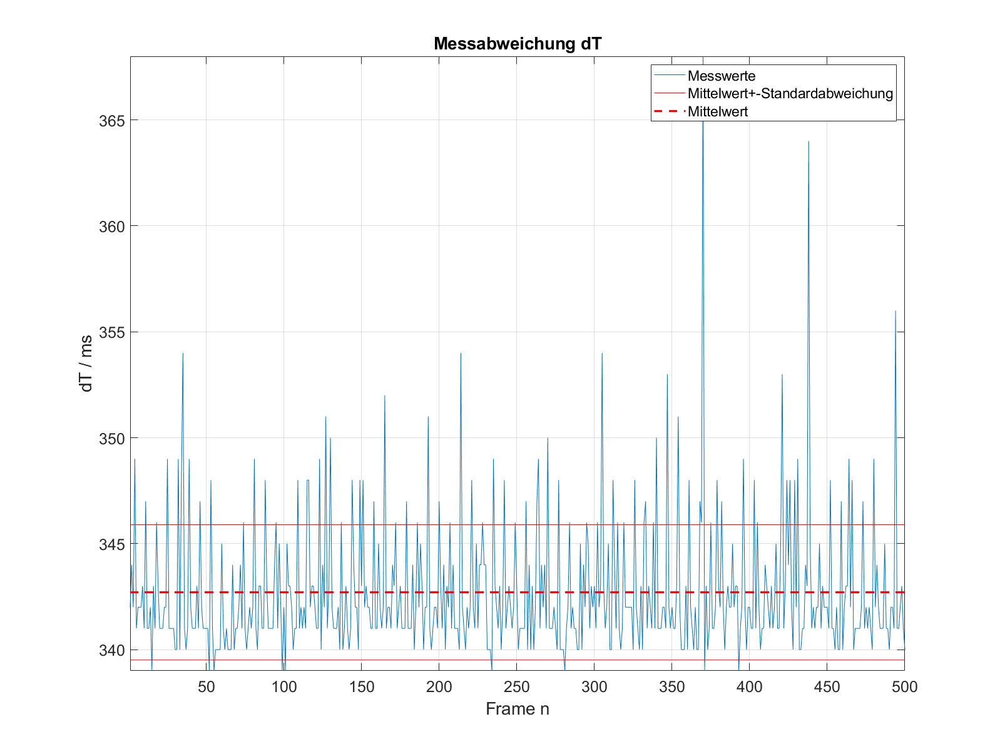
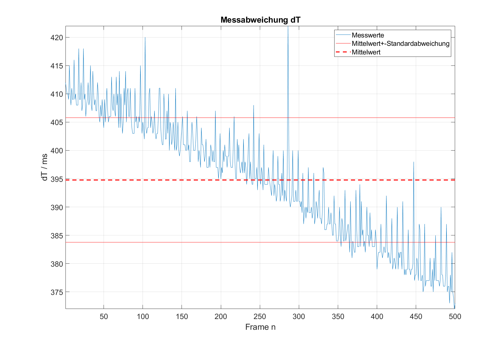

# Maxim Fründt

# Untersuchung der Vorteile des Entity Component System und des Data-Oriented Designs gegenüber dem klasschen objektorientierten Ansatz

Im Folgenden wird ein kurzer Überblick über die Praktikumsausarbeitung aus dem Modul Spezielle Gebiete zum Software Engineering gegeben.

## Hintergrund

Die Videospielindustrie wächst stetig. Immer schneller und besser sollen Videospiele entwickeln werden. Der Erfolg eines Videospiels beginnt dabei schon bei der Planung. Neben der Entwicklung eines Spielekonzepts müssen auch Entscheidungen über den Aufbau der Architektur getroffen werden.

Immer häufiger wird dafür das Entity-Component-System (ECS) verwendet, oft in Verbindung mit einem Data Oriented Design (DOD). Im Rahmen des Praktikums sollen die Vorteile dieser Herangehensweisen beleuchtet werden mit Fokus auf Performance und Vor- und Nachteile in der Entwicklung.

Das ECS-Pattern und das DOD wird neben Videospielen auch in anderen datenintensiven Anwendungen, wie beispielsweise Simulationsprogrammen, verwendet.

Auf die Grundlegenden Eigenschaften und den Aufbau des ECS-Patterns und des DOD wird im Rahmen der Ausarbeitung nur beiläufig eingegangen. Für einen genaueren Überblick empfehlen sich externe Ressourcen wie beispielseweise das ECS-FAQ von Sander Mertens[1].

## Forschungsfragen
- Wie ist das ECS aufgebaut?
- Welche Vor- und Nachteile bringt das ECS-Pattern?
- Wie groß ist der Einfluss auf die Performance, wenn man das ECS-Pattern verwendet?
- Wie wendet man DOD an?
- Welche Vor- und Nachteile bringt DOD?
- Wie groß ist der Einfluss auf die Performance, wenn man DOD verwendet?

## Evaluierung
- Das ECS-Pattern wird in dem bestehenden Spielprojekt PM-Dungeon eingesetzt, von welchem Sourcecode in Java existiert, der nach OOP-Ansatz geschrieben wurde.
- Zusätzlich soll in C++ ein Projekt erstellt werden. Zunächst nach OOP-Ansatz, anschließend mit ECS-Pattern.
- Anschließend Performancevergleich zwischen den ECS- und OOP-Ansätzen.
- Das C++ Projekt mit ECS-Ansatz wird schließlich gemäß DOD abgeändert.
- Performancevergleich zwischen ECS- und DOD-Ansatz

## Zeitplan
| Termin     |     Meilenstein                      |
|:----------:|:------------------------------------:|
| 28.04.2022 | Finalisierung der Fragestellungen    |
| 05.05.2022 | Analyse des ECS und DOD              |
| 12.05.2022 | Umsetzung eines Projekts mit ECS     |
| 19.05.2022 | Umsetzung eines Projekts mit ECS     |
| 26.05.2022 | Anwenden des DOD                     |
| 02.06.2022 | Anwenden des DOD                     |
| 09.06.2022 | Performancevegleich der Projekte     |
| 16.06.2022 | Aufbereiten der Ergebnisse           |
| 23.06.2022 |                                      |
| 30.06.2022 | Abgabe                               |

## Aufbau des Entity Component System-Patterns

Zunächst darauf eingegangen werden wie das ECS aufgebaut ist. Dafür werden Projekte vom Objektorientierten Programmierstil in das ECS-Pattern überführt. Durch diese grundlegende Änderung in der Architektur muss die gesamte Struktur des Projekts verändert werden. Vorgenommen soll dieser Umbau an zwei Projekten:
- Zunächst soll anhand des Projekts PM-Dungeon dieser Umbau erfolgen. Das Projekt wurde im Team zu dritt im Rahmen des Moduls Programmiermethoden erstellt. Bei dem Projekt handelt es sich um ein Rogue-Like-Spiel, in welchem der Spieler einen Helden durch ein Dungeon voller Monster navigiert und die Monster bezwingt. Das Projekt verwendet eine bereitgestellte Bibliothek, welche libGDX[2] verwendet um Aufgaben wie die Verwaltung und Generierung der Spielwelt zu übernehmen.
- Anschließend wird in C++ ein Miniprojekt erstellt, welches nicht-Spielercharaktere simuliert. Diese sollen sich zufällig durch die Welt bewegen und beim Zusammenstoßen mit anderen Charakteren Schaden erleiden. Wenn sie zu viel Schaden erleiden werden sie aus der Spielwelt entfernt. Um die Charaktere und die Welt darzustellen wird die Bibliothek SFML[3] verwendet und das Basisprojekt von rewrking[4] wird für die einfache Verwendung von VS Code eingesetzt.

### Erstellen der Komponenten und Systeme aus dem bestehenden OOP-Projekt PM-Dungeon

Detailierter soll der Umbau am Projekt PM-Dungeon erfolgen. Das erstellte C++ Projekt wird im Anschluss grob vorgestellt.

Der Source des Projektes PM-Dungeon kann im entsprechenden GitHub-Repository eingesehen werden https://github.com/mfruendt/SGSE2022_Java_Dungeon_OOP
In Abbildung 1 ist das Klassendiagramm des PM-Dungeon vereinfacht dargestellt. Exemplarisch sind die nötigen Klassen für Charaktere abgebildet.
OOP-typisch gibt es jeweils eine abstrakte Basisklasse für Charaktere, welche geerbt und erweitert wird. Besonders an der `Hero`-Klasse wird deutlich, dass diese durch überschriebene Funktionen der Basisklasse, durch die Getter und Setter und durch die komplexe Steuerungslogik des Heros aufgebläht wird.

||
|:--:| 
| *Abbildung 1: Klassendiagramm des PM-Dungeon für Charaktere* |

Um die Klassen in das ECS-Pattern zu überführen müssen markante Variablen der Klassen, wie beispielsweise die Gesundheit, in Komponenten überführt werden. Die Komponenten sollten neben den Daten jedoch keine Logik enthalten. Sämtliche Logik muss in Systeme überführt werden. Für das Beispiel der Gesundheit wird ein System angelegt, welches für jedes Entity mit einer Gesundheitskomponente prüft, ob dessen
Gesundheitswert größer 0 ist. Ist das nicht der Fall, wird das Entity gelöscht.

||
|:--:| 
| *Abbildung 2: Komponenten und Systeme, welche die Logik der Klassen im OOP-Ansatz ersetzen* |

Die Systeme und Komponenten, welche die in Abbildung 1 dargestellten Klassen ersetzen sollen, sind in Abbildung 2 dargestellt. Durch die Verwendung von Komponenten wird das erstellen eines Entities wie ein Baukastensystem, dadurch entsteht eine hohe Wiederverwendbarkeit. Da auf die Daten in den Komponenten direkt zugegriffen wird, fallen Getter und Setter weg. Die Komplexe Logik der Klassen wird in mehrere Systeme aufgebrochen, in welchen die Entities gleichbehandelt werden können, indem die benötigten Komponenten spezifiziert werden, die die Entities für die Bearbeitung aufweisen müssen. Die nötige Komponenten-Zusammensetzung der vorherigen Klassen sieht wie folgt aus:

||
|:--:| 
| *Abbildung 3: Entity-Component-Zusammensetzung für Charaktere* |

Die Zusammensetzung ist dynamisch gestaltet und kann sich während der Laufzeit ändern, um bestimmte Verhalten zu erzeugen. Wenn beispielsweise der Held angegriffen wird, soll er einen Rückstoß erhalten. Dafür wird ihm die `PlayerControl`-Komponenten weggenommen, wodurch er sich nicht mehr bewegen kann. Zudem wird ihm die `Knockback`-Komponente hinzugefügt, wodurch das `KnockbackSystem` diesen bearbeiten kann. Wenn der erhaltene Rückstoß ausgeführt wurde, kann die `PlayerControl`-Komponenten wieder zugewiesen werden, wodurch der Held wieder spielbar wird.

Untenstehend sind alle erstellten Komponenten. Um mithilfe der Komponenten das ursprüngliche Verhalten von Charakteren und Items
zu erhalten, müssen Entities erstellt werden und die passenden Komponenten zugewiesen werden. Dafür bietet sich das Factory-Method-Pattern an,
welches ein Entity als beispielsweise Monster erstellt, indem es ein neues Entitiy erstellt und die benötigten Komponenten parametrisiert zuweist.

| Komponente | Daten|
|:--:|:--:|
| Animation             | Enthält die Sprites die die Animation des Entities ausmachen |
| Experience            | Erfahrungspunkte des Entities |
| Health                | Gesundheit des Entities |
| Inventory             | Inventar des Entities |
| MeleeCombatStats      | Angriffsattribute für den Nahkampf |
| PlayerControl         | Steuerung für Spielercharaktere |
| Position              | Position des Entities |
| RangedCombatStats     | Angriffsattribute für den Fernkampf |
| Sprite                | Enthält das Sprite des Entities |
| Velocity              | Geschwindigkeit des Entities |
| HealingPotionStats    | Attribute für Heilungsitems |
| MeleeWeaponStats      | Attribute für Nahkampfwaffen |
| RangedWeaponStats     | Attribute für Fernkampfwaffen |
| Shieldstats           | Attribute für Verteidiungsitems |
| DropRequest           | Event für das Fallenlassen von Items |
| ItemDestroyRequest    | Event für das zerstören von Items |
| Knockback             | Event für das Erleiden von Rückschlag |
| MeleeAttack           | Event für eine Nahkampfattacke |
| PickupRequest         | Event für den Versuch ein Item aufzuheben |
| RangedAttack          | Event für eine Fernkampfattacke |
| UseRequest            | Event für das Benutzen eines Items |

Die erstellten Komponenten erhalten entweder Daten oder werden als Flag verwendet, um auf Events zu reagieren. Verwendet werden die Komponenten von den untenstehenden Systemen. Die Systeme erhalten jeweils eine Liste von Entities, welche die erforderlichen Komponenten besitzen und iterieren über diese. Jedes iterierte Entity kann manipuliert werden, indem die Daten der Komponente bearbeitet werden, neue Komponenten hinzugefügt oder bestehende gelöscht werden.

| System                | Funktion|
|:--:|:--:|
| CameraSystem          | Bewegt die Kamera zur Spielerposition |
| DamageSystem          | Prüft ob ein erstelltes Attack-Entity ein tötbares Entity trifft und fügt Schaden zu, falls dem so ist |
| GuiSystem             | Aktualisiert die GUI des Spielers |
| HealthSystem          | Löscht Entities, die keine Leben mehr haben |
| ItemSystem            | Nimmt Item-Event-Entities an und führt entsprechende Aktion aus |
| KiSystem              | Steuert die nicht-Spieler-Charaktere entsprechend ihrer unterschiedlichen Logik |
| KnockbackSystem       | Berechnet die Flugbahn des Knockback von Entities |
| MovementSystem        | Ändert die Position der Entities, entsprechend ihrer Geschwindigkeit |
| PlayerControlSystem   | Nimmt Eingaben für den Spielercharakter an |
| SpriteSystem          | Stellt die Sprites aller Objekte im Dungeon dar |

### Implementierung des ECS-Ansatzes im PM-Dungeon

Als ECS-Framework wird für das PM-Dungeon Ashley[5] eingesetzt, da es eine gute Dokumentation und Performance aufweist[6]. Die erstellten Komponenten und Systeme werden den Vorgaben des Frameworks entsprechend umgesetzt. Für den Spieler, die Monster und die Items werden Entities mit entsprechenden Komponentenzusammensetzungen erstellt. Der Source des erstelltesn Projektes kann im entsprechenden GitHub-Repository eingesehen werden https://github.com/mfruendt/SGSE2022_Java_Dungeon_ECS

### Erstellen der Komponenten und Systeme für das C++ Projekt

Der Source des Miniprojektes in C++ mit OOP-Ansatz kann im entsprechenden GitHub-Repository eingesehen werden https://github.com/mfruendt/SGSE2022_Cpp_OOP

Aus dem Miniprojekt werden die folgenden Komponenten generiert. Diese enthalten alle nötigen Daten um die Charakterklasse im Projekt zu ersetzen.

| Komponente | Daten|
|:--:|:--:|
|Position|Position des Entities|
|Velocity|Geschwindigkeit des Entities|
|Health|Gesundheit des Entities|
|Collision|Schaden, den das Entity durch eine Kollision erleidet|
|Sprite|Sprite des Entities|

Für diese Komponenten werden die unten stehenden Systeme zur Bearbeitung derer Daten erstellt, um die Logik der Charakterklasse zu imitieren.

| System                | Funktion|
|:--:|:--:|
|MovementSystem|Bewegt die Entities entsprechend ihrer Geschwindigkeit|
|KiSystem|Verändert zufällig die Geschwindigkeit des Entities|
|HealthSystem|Entfernt Entities, welche sämtliche Gesundheit verloren haben|
|DamageSystem|Zieht Entities Gesundheit ab, welche kollidiert sind|
|CollisionSystem|Prüft ob zwei Entities kollidieren|

### Implementierung des ECS-Ansatzes im C++ Projekt

Da fertige Frameworks auf DOD ausgelegt sind, wird für diese Implementierung ein simples ECS-Framework selbst erstellt, welches auf dem Blogeintrag von David Colson[7] basiert. Es wurde jedoch so umgebaut, dass die Komponenten nicht nebeneinander im Speicher angelegt werden, um die ECS-Umsetzung von der DOD-Umsetzung abzugrenzen. Die Charakter sind in dieser Version Entities mit zugewiesenen Komponenten, statt Instanzen von Objekten, welche von den erstellten Systemen bearbeitet werden. Der Source des erstellten C++ Projektes mit ECS-Ansatz kann im GitHub-Repository eingesehen werden https://github.com/mfruendt/SGSE2022_Cpp_ECS

## Vor- und Nachteile des Entity Component System-Patterns

Durch den Einsatz des ECS-Patterns wird die Denkweise, wie man Probleme in der Spielentwicklung lösen möchte, verändert. Im Folgenden wird ein Beispiel für die
Erweiterung eines bestehenden Projekts vorgestellt und anhand dessen auf Vor- und Nachteile eingegangen.

**Beispiel A**:
Das Spiel besitzt bereits Gegenspieler, es soll jedoch ein neuer Typ hingzugefügt werden. Dieser weist kein neues Verhalten auf, sondern hat lediglich andere Werte.

**Beispiel B**:
Der neuhinzugefügte Gegenspieler soll ein komplett neues Verhalten aufweisen. Bisher war das Spiel nahkampffokusiert, der neue Gegenspieler soll jedoch Bälle auf
den Spieler werfen, wenn dieser nicht in Nahkampfreichweite ist.

Im OOP-Ansatz würde ein Lösungsansatz so aussehen:
- **Beispiel A**: Es existiert eine Basisklasse mit Attributen wie `Position` und `Health` und Methoden wie `move()` und `takeDamage()`. Für den neuen Gegenspieler
wird eine neue Klasse angelegt, welche die Basisklasse erbt und den Attributen Werte zuweist.
- **Beispiel B**: Es muss eine neue Klasse für das Geschossen angelegt und mit Logik gefüllt werden. Der Gegenspieler muss neue Methoden erhalten, die entscheiden
wann und wie das Geschoss abgefeuert wird. Geschosse müssen in die bestehende Infrastruktur eingebaut werden (Sprite muss gezeichnet werden, Geschoss muss bewegt werden,
Geschoss muss bei Kontakt mit dem Spieler Schaden anrichten).

Im Folgenden wird der Lösungansatz im ECS-Ansatz vorgestellt:
- **Beispiel A**: Es existieren Komponenten wie `Position` und `Health` und entsprechende Systeme `MovementSystem` und `HealthSystem`. Für den neuen Gegenspieler
muss eine neue Kombination aus Komponenten erstellt werden (möglich über das Factory-Pattern).
- **Beispiel B**: Für das Geschoss muss eine neue Kombination aus Komponenten erstellt werden (bestehende Komponenten wie Position, Sprite etc. können dafür verwendet werden).
Das Kampfsystem muss erweitert werden, sodass das Geschoss-Entitiy erstellt wird, sobald die Bedingungen zum Werfen erfüllt sind. 

### Erweiterbarkeit

Im Beispiel A ist der Unterschied zwischen den Ansätzen noch gering. Im OOP-Ansatz muss durch die Vererbung wenig zu der neuen Klasse hinzugefügt werden. Lediglich
ein Konstruktor muss angelegt und mit den Parametern des neuen Gegenspielers gefüllt werden. Im ECS-Ansatz hingegen wird ein neues Entity erstellt und mit
bestehenden Komponenten gefüllt, welche ebenfalls die Parameter des neuen Gegenspielers erhalten. In diesem einfachen Beispiel konnte durch das ECS-Patterns
jedoch schon die Notwendigkeit einer weiteren Klasse eingesparrt werden, wodurch die Komplexität des Projekts verringert wird.

Im Beispiel B hingegen wird der Unterschied der Ansätze deutlicher. Jetzt benötigt der OOP-Ansatz neue und überladene Methoden in der neuen Klasse. Zudem muss
neue Infrastruktur für das Geschosse geschaffen und alte Infrastruktur angepasst werden. Im ECS-Ansatz muss auch bestehende Infrastuktur angepasst werden, an dem
Punkt wo das Geschoss erzeugt werden soll. Durch die Modularität, welche die Komponenten dem Entwickler geben können jedoch die bestehenden Systeme zum Bewegen,
Animieren und der Erkennung einer Kolission ohne weitere Änderungen verwendet werden.

Durch die Weiterverwendung von bestehenden Systemen ist es unter Umständen nicht einmal nötig, Kenntnisse über diese zu haben, um neue Funktionalitäten in das Projekt einzubauen.
Es ist also für Außenstehende einfacher ohne große Einarbeitung am Projekt mitzuwirken.

Ein weiterer Vorteil des ECS-Patterns ist, dass besondere Verhaltensweisen von Objekten durch die Komponenten einfacher erzielt werden können. Angenommen man
möchte für Testzwecke den Spieler Unsterblichkeit geben. Im OOP-Ansatz könnte eine Lösung dazu sein, eine Flag einzubauen. Wenn diese Flag gesetzt wird, wird
die Funktion, welche die Gesundheit des Spielers herabsetzen soll, nicht weiter ausgeführt. Im ECS-Ansatz würde man für dieses Verhalten lediglich die
`Health`-Komponente des Spielers entfernen. Durch den ECS-Ansatz wird zudem die Gefahr verringert, unabsichtlich Fehler in bestehende Code-Teile einzuschleusen.

Als Nachteil kann sich jedoch der Aufwand des Designens von neuen Funktionen ergeben. Nicht immer ist komplett klar, welche Daten eine eigene Komponente darstellen
und welche Daten besser Teil einer anderen wären. Dasselbe ergibt sich für die Systeme.

### Wartbarkeit

Wie in den Beispielen erkennbar, kann der OOP-Ansatz schnell zu einer komplexen Vererbungshierachie auswachsen, wenn das Projekt größer wird. Dadurch
wird die Wartbarkeit erschwert. Wenn im ECS-Ansatz ein Fehler auftritt, muss in der Regel nur ein System betrachtet werden, welches eine Logik ausführt.
Dadurch, dass ein System für eine Logik entwickelt wird, können zudem Seiteneffekte auf Logiken, welche nicht hier stattfinden sollen, vermeiden.

### Tests

Durch die Kapselung der Logik in Komponenten und Systemen wird das Testen stark vereinfacht. Es werden weniger Tests benötigt, da die Systeme mit ihren
zugehörigen Komponenten separat getestet werden können. Zudem sinkt die Komplexität der Tests im Setup. Im Beispiel B wird dies deutlich. Im OOP-Ansatz
muss die Klasse für das Geschoss als ganzes evaluiert werden, wodurch einige neue Tests entstehen. Im ECS-Ansatz müssen lediglich Tests für die neu erstellten
Komponenten und Systeme erstellt werden. Techniken wie das korrekte Bewegen sind bereits in bestehenden Tests abgedeckt.

Zudem kann im ECS-Ansatz oft auf Mockups verzichtet werden, die Objekte oft benötigen. Der Kerngedanke von Systemen ist es Daten zu erhalten, zu transformieren und auszugeben.
Wenn so ein System getestet werden soll, müssen also lediglich Testdaten eingegeben und anschließend evaluiert werden.

Die Modularität kommt jedoch mit dem Nachteil, dass die statische Prüfung des Codes nicht mehr darstellt, ob ein Entity mit seiner Kombination aus
Komponenten von einem ausgewählten System bearbeitet werden kann. Wenn beispielsweise ein System erstellt wird, welches nur Entities mit Komponente A
und Komponente B bearbeiten soll, muss der Entwickler selbst darauf achten, dass die Entities diese Komponenten aufweisen, wenn das System diese bearbeiten soll. 

### Performance

Systeme werden ausgelegt, ohne dass die Bearbeitungsreihenfolge der Systeme eine Rolle spielt, da diese nicht klar definiert sein muss. Dadurch, dass die Bearbeitungsreihenfolge keine Rolle spielt, können die verschiedenen Systeme ohne größeren Aufwand Multithreaded ausgeführt werden. Da zudem nur eine kleine Einheit an Daten in einem System, über viele Entities bearbeitet werden kann, bietet es sich an diese im Speicher nebeneinander zu lagern. Dadurch kann der CPU-Cache besser ausgenutzt werden. Mehr dazu im Kapitel über DOD. Zuletzt sollte erwähnt werden, dass der Hauptzweck des ECS-Patterns die einfache Erweiterbarkeit und Formbarkeit der Entities ist. Performance-Verbesserungen sollten später in der Entwicklung erfolgen und vermutlich DOD-Ansätze einschließen.

### Zusammenfassung

Schließlich sollen die Vor- und Nachteile des ECS-Patterns kurz aufgelistet werden. Zusätzlich zu der Erklärung an den Beispielen empfehlen sich Quellen wie beispielsweise [8] und [9].

Vorteile:
- Neue Spielobjekte und Spielmechaniken sind einfach und schnell erstellbar
- Sonderfunktionen sind einfacher umzusetzen
- Einfach erweiterbar für Außenstehende, da nicht jedes System gleichzeitig betrachtet werden muss
- Tests sind einfacher aufzusetzen und es werden weniger Tests benötigt
- Multithreading und DOD einfach implementierbar

Nachteile:
- Das ECS-Pattern erfordert ein Umdenken gegenüber klassischer objektorientierter Programmierung
- Das Einteilen, welche Daten eine eigene Komponente und welche Logiken ein eigenes System benötigen kann schwer sein
- Statische Codeprüfung kann nicht sicherstellen, dass Entities die richtigen Komponenten haben um von einem System ausgeführt zu werden

## Performancevergleich zwischen OOP- und ECS-Ansatz

Nach Vollendigung der ECS-Implementierungen, sollen diese mit dem ursprünglichen, mittels OOP-Ansatzes entwickelten, Projekten verglichen werden.

## Java-Projekt

Für das PM-Dungeon werden jeweils drei Versuche mit 100, 500 und 1000 Monstern im Dungeon durchgeführt. Folgende Messreihen wurden dabei aufgenommen.

||
|:--:|
| *Abbildung 4: Messreihe für den Versuch mit 100 Monstern im Java-Projekt mit OOP-Ansatz* |  

||
|:--:|
| *Abbildung 5: Messreihe für den Versuch mit 500 Monstern im Java-Projekt mit OOP-Ansatz* |  

||
|:--:|
| *Abbildung 6: Messreihe für den Versuch mit 1000 Monstern im Java-Projekt mit OOP-Ansatz* |  

||
|:--:|
| *Abbildung 7: Messreihe für den Versuch mit 100 Monstern im Java-Projekt mit ECS-Ansatz* |  

||
|:--:|
| *Abbildung 8: Messreihe für den Versuch mit 500 Monstern im Java-Projekt mit ECS-Ansatz* |  

||
|:--:|
| *Abbildung 9: Messreihe für den Versuch mit 1000 Monstern im Java-Projekt mit ECS-Ansatz* |  

Aus den Messreihen wird der Mittelwert, Median und die Standardabweichung bestimmt.

| Versuch | Median / µs | Mittelwert / µs | Standardabweichung / µs |
|:--:|:--:|:--:|:--:|
| OOP 100 Monster | 970 | 1305 | 809 |
| OOP 500 Monster | 1606 | 2012 | 1127 |
| OOP 1000 Monster | 1773 | 2276 | 1692 |
| ECS 100 Monster | 807 | 1194 | 1119 |
| ECS 500 Monster | 1574 | 2089 | 1457 |
| ECS 1000 Monster | 1769 | 2346 | 1616 |

Aus dem Versuch wird ermittelt, dass der reine ECS-Ansatz wenig bis gar keinen Leistungsvorsprung gegenüber dem OOP-Ansatz bietet. Der Grund hierfür wird die mangelnde Implementierung des DOD-Prinzips sein. Dadurch erfolgen Datenzugriffe weiterhin durch das Laden von Objekten, welche nicht hintereinander im Speicher angeordnet sind, also müssen eventuell viele Speicherzugriffe für die Bearbeitung aller Entities erfolgen. Durch die Implementierung des ECS-Ansatzes, könnte im nächsten Schritt jedoch einfacher vom Multithreaded-Design gebrauch gemacht werden, wodurch die Performance gesteigert werden kann.

## C++-Projekt

Für das C++-Projekt werden drei Versuche mit jeweils 500, 1000 und 2000 Simulierten Charakteren erstellt. Dabei wurden folgende Messereihen aufgenommen.

||
|:--:|
| *Abbildung 10: Messreihe für den Versuch mit 500 Charakteren im C++-Projekt mit OOP-Ansatz* |  

||
|:--:|
| *Abbildung 11: Messreihe für den Versuch mit 1000 Charakteren im C++-Projekt mit OOP-Ansatz* |  

||
|:--:|
| *Abbildung 12: Messreihe für den Versuch mit 2000 Charakteren im C++-Projekt mit OOP-Ansatz* |  

||
|:--:|
| *Abbildung 13: Messreihe für den Versuch mit 500 Charakteren im C++-Projekt mit ECS-Ansatz* |  

||
|:--:|
| *Abbildung 14: Messreihe für den Versuch mit 1000 Charakteren im C++-Projekt mit ECS-Ansatz* |  

||
|:--:|
| *Abbildung 15: Messreihe für den Versuch mit 2000 Charakteren im C++-Projekt mit ECS-Ansatz* |  

Aus den Messreihen wird der Mittelwert, Median und die Standardabweichung bestimmt.

| Versuch | Median / µs | Mittelwert / µs | Standardabweichung / µs |
|:--:|:--:|:--:|:--:|
| OOP 500 Charaktere | 25 | 25.5 | 1.7 |
| OOP 1000 Charaktere | 89 | 89.9 | 1.9 |
| OOP 2000 Charaktere | 342 | 342.7 | 3.2 |
| ECS 500 Charaktere | 30 | 30.2 | 2.4 |
| ECS 1000 Charaktere | 100 | 102.1 | 4.8 |
| ECS 2000 Charaktere | 396 | 394.8 | 11 |

Die Versuche zeigen auf, dass der ECS-Ansatz der Performance nicht hilft. Da es sich bei dem Testprojekt um ein Miniprojekt handelt, schadet der dadurch erzeugte Overhead der Performance sogar. Auffälig ist, dass der ECS-Ansatz zudem über die Zeit an Leistung dazu gewinnt, je mehr Charaktere im Spiel sind. Der Grund dafür wird sein, dass ab einem bestimmten Punkt die Rechenlast der Charaktere größeren Einfluss hat, als der Overhead. Der gemeinte Overhead ist die Kapselung von Daten innerhalb der Entities, welcher im OOP-Ansatz nicht gegeben ist, stattdessen liegen die Daten ungekapselt in den Objekten. Wenn Charaktere dann aus dem Spiel entfernt werden, steigt die Performance langsam an. Auf den OOP-Ansatz trifft das jedoch nicht zu, da dieser nicht mit Iteratoren arbeitet, um die Charaktere zu berechnen.

## Anwenden des Data-Oriented-Designs

Beim Data-Oriented-Design geht es darum, dass die Daten des Programms im Vordergrund stehen. Das Programm wird also so geschrieben, dass Funktionen auf die gekapselten Daten zugreifen und diese Transformieren, ohne Dabei viel Abstraktion aufzuweisen. Bei der Entwicklung der Transformationsroutinen sollte der Entwickler sich zudem Gedanken machen, wie die Transformation tatsächlich auf dem CPU ausgeführt wird, um diese performant gestalten zu können.
Das DOD verfolgt dadurch in der Umsetzung oft das Ziel, Daten zu kapseln und so anzuordnen, dass der CPU-Cache am effektivsten verwendet wird. Als Beispiel wird ein Gesundheitssystem angenommen, welches die Gesundheit jedes Entities prüft, um dieses als tot zu markieren. Für die Abfrage der Gesundheit wird die Gesundheitskomponente des Entities in den Cache geladen, bearbeitet und wieder entladen. Wenn die Gesundheitskomponenten nun im Speicher nebeneinander liegen, können mit dem Füllen einer Cache-Zeile mehrere Gesundheitskomponenten geprüft werden, wodurch Ladezeit eingesparrt werden kann. Als Vergleich wird im klassischen OOP-Ansatz das gesamte Entity geladen, um dessen Gesundheit zu prüfen. Durch den größeren Overhead den das Objekt mit sich bringt, werden mehr ungenutzte Daten in den Cache geladen.

In Java kann das DOD auf diese Weise nicht eingesetzt werden, da man keine Kontrolle darüber hat, ob die zusammenhängenden Daten tatsächlich nebeneinander im Speicher liegen. Jedoch ist der Grundgedanke der Kapselung und separaten Transformation der Daten dadurch erfüllt, dass das ECS eingesetzt worden ist. Aus diesem Grund wird das DOD konkret in dem C++ Beispiel angewendet und getestet.

Um den DOD-Ansatz im erstellten C++-Projekt anzuwenden, wird das Projekt, welches den ECS-Ansatz umsetzt so umgebaut, dass die Komponenten nicht mehr in jedem Entity separat gespeichert werden. Stattdessen wird es ein Array geben, welches alle Komponenten desselben Typs speichert. Weiter wird die Stelle ermittelt, welche den größten Einfluss auf die Laufzeit hat. Im Falle dieses Projektes handelt es sich dabei um das `CollisionSystem`, welches über alle Charaktere iteriert, um Zusammenstöße zu ermitteln. Im ECS-Ansatz ist dafür ein Iterator verwendet worden, dieser wird ersetzt durch einen klassischen Array-Zugriff, wodurch Zugriffszeit eingesparrt wird. Die Version des C++ Miniprojektes, welches DOD implementiert kann im GitHub-Repository eingesehen werden https://github.com/mfruendt/SGSE2022_Cpp_DOD

## Vor- und Nachteile des Data-Oriented-Designs

Obwohl das ECS-Pattern nicht zwingend dem DOD folgt, weisen beide Ansätze Schnittmengen auf und können dementsprechend einfach zusammenverwendet werden. Aus diesem Grunde wird auf die Vor- und Nachteile in diesem Kapitel weniger stark eingegangen und auf das vorangegangene Kapitel verwiesen.

Vorteile:
- Dadurch, dass zusammengehörige Daten im Speicher nebeneinander liegen, können die CPU-Misses minimiert werden (Vereinfachtgesagt die Anzahl an Daten die unnötig in den CPU-Cache geladen werden)
- Durch die Kappselung der Daten bietet sich zudem eine parallele Ausführung über die Daten an, indem auf zusammenhängende Daten nur an einer Stelle zugegriffen wird, wie das beispielsweise beim ECS-Pattern der Fall ist
- Unit-Tests können einfacher erstellt werden, da lediglich Eingabedaten benötigt werden, welche transformiert und anschließend evaluiert werden müssen
- Durch die Datenkapselung, ist es einfacher diese zu erweitern und zu verstehen

Nachteile:
- Erfordert umdenken gegenüber klassischem OOP-Ansatz
- Es kann schwer sein DOD mit bestehenden Systemen zu koppeln, welche nicht DOD befolgen
- Optimierungen an der Datentranformation zu finden, benötigt zusätzliche Entwicklungszeit

## Performancevergleich zwischen ECS- und DOD-Ansatz

Die drei Versuche mit 500, 1000 und 2000 Charakteren, welche im C++-Projekt für den OOP- und ECS-Ansatz umgesetzt wurden, werden für den DOD-Ansatz aufgenommen. Folgende Messdaten ergeben sich.

||
|:--:|
| *Abbildung 16: Messreihe für den Versuch mit 500 Charakteren im C++-Projekt mit DOD-Ansatz* |  

||
|:--:|
| *Abbildung 17: Messreihe für den Versuch mit 1000 Charakteren im C++-Projekt mit DOD-Ansatz* |  

||
|:--:|
| *Abbildung 18: Messreihe für den Versuch mit 2000 Charakteren im C++-Projekt mit DOD-Ansatz* |  

Wieder werden Median, Mittelwert und Standardabweichung aus den Messdaten ermittelt.

| Versuch | Median / µs | Mittelwert / µs | Standardabweichung / µs |
|:--:|:--:|:--:|:--:|
| DOD 500 Charaktere | 16 | 16.2 | 0.7 |
| DOD 1000 Charaktere | 16 | 16.3 | 1.2 |
| DOD 2000 Charaktere | 45 | 44.7 | 1.4 |

Durch die Implementierung des DOD-Ansatzes im ECS-Projekt, wird dem Overhead entgegen gewirkt. Das Projekt ist jetzt weit schneller als das OOP-Projekt und wird bei wenigen Charakteren nur noch von der Grafikbibliothek ausgebremst.

## Zusammenfassung

Durch das Anwenden des ECS-Patterns gegenüber der klassischen objektorientieren Programmierung wird zunächst mehr Zeit benötigt, um sich die Verwendung zu gewöhnen. Zudem kann es je nach Entwickler-Team sein, dass kaum
bis gar keine Erfahrung in dem Bereich vorliegt. Wenn man jedoch diesen Weg geht (vorausgesetzt die Anwendung eignet sich überhaupt für das ECS-Pattern, sprich sie ist sehr datenintensiv), kann sich dadurch langfristig die
Wartbarkeit, Erweiterbarkeit und auch das Erstellen von Tests leichter gestalten. Bei der Verwendung des ECS-Patterns sollte man sich jedoch bewusst sein, dass dieses nicht sofort bessere Performance bietet, es bietet sich jedoch
an ein ECS-Projekt auf Multithreading auszulegen und DOD-Prinzipien zu implementieren, da das ECS-Pattern diese Implementierungen erleichtert. 

## Quellen

[1]: Sander Mertens. https://github.com/SanderMertens/ecs-faq  
[2]: libGDX. https://libgdx.com/  
[3]: Laurent Gomila. https://www.sfml-dev.org/  
[4]: rewrking. https://github.com/rewrking/sfml-vscode-boilerplate  
[5]: libGDX. https://github.com/libgdx/ashley  
[6]: Adrian Papari. https://github.com/junkdog/entity-system-benchmarks  
[7]: David Colson. https://www.david-colson.com/2020/02/09/making-a-simple-ecs.html  
[8]: Richard Lord. https://www.richardlord.net/blog/ecs/why-use-an-entity-framework.html  
[9]: FTWinston. https://stackoverflow.com/questions/15449811/is-there-any-advantage-in-building-a-business-application-with-an-entity-compone  