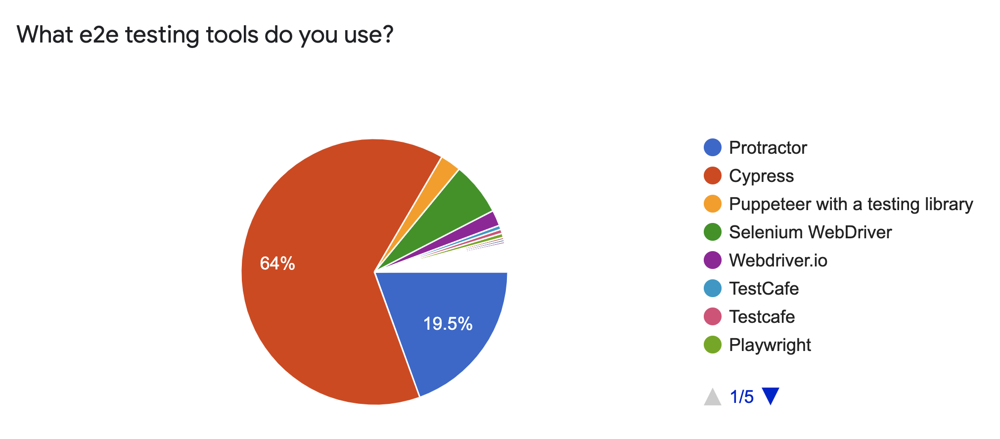
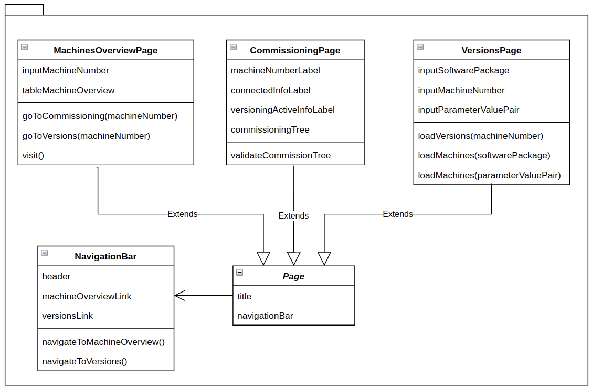

# Benjamin Krüger

# Entwicklung von automatischen Softwaretests für Angular-Webapplikationen mit Fokussierung der Wiederverwendung/Wartbarkeit von Code und Vergleich von Testframeworks

## Hintergrund:
Im Unternehmen stellen Webapplikationen einen zunehmenden Anteil der Applikationen dar. Derzeit sind automatische Softwaretests hierbei nur nebenläufig und lediglich serverseitig umgesetzt und das Frontend ausschließlich manuell getestet worden, wodurch keine bis wenig Kenntnisse hinsichtlich Frontend-Tests vorhanden sind.

Im Rahmen des Praktikums sollen daher Kenntnisse für das *automatisierte Testen von Frontends* gesammelt werden. Es gilt, anhand eines aktuell entwickelten Projekts (erste lauffähige Version) weit verbreitete Testframeworks zu vergleichen und erste [**Unit- und End-to-end-Tests**](https://www.geeksforgeeks.org/difference-between-end-to-end-testing-and-unit-testing/) zu entwickeln. 

Da die allgemeingültigen Qualitätsmerkmale von Software auch bei Softwaretests einen besonders hohen Stellenwert einnehmen, sollen hierbei **Methodiken zum Entwurf von wiederverwendbaren und erweiterbaren Code** ermittelt und bei der Entwicklung erster Tests verwendet werden.

## Inhalte/Fragestellung:
- Wie und in welchem Umfang kann unabhängiger, wiederverwendbarer Code beim Design von Softwaretests umgesetzt werden?
- Welche Workflows bieten sich an, um strukturierte und wiederverwendbare Tests / Testbestandteile zu entwickeln?
    - Wie können diese verwendet werden?
    - Sind diese in Frameworks integriert?
- Welche End-to-end- und Unit-Testframeworks sind weit verbreitet / beliebt und sollten somit verglichen werden?
- Wie unterscheiden sich die Frameworks?
    - Möglichkeiten? z.B. Mocking, Stubs, Spies
    - Reporting/Output (Form->HTML o.ä., Code-Coverage),
    - Unterschiedliche Konzepte (Property-Based-, Mutation-Testing)
    - Anwendung,
- Umsetzung erster Softwaretests durch Verwendung der Testframeworks
    - Performancevergleich

## Zeitplan

| Termin     |     Meilenstein                      |
|:----------|:------------------------------------|
| 05.05.2022 | Finalisierung der Aufgabenstellung   |
| 12.05.2022 | (Ausarbeitung Buch / Präsentation)  |
| 19.05.2022 | Vergleich von Methodiken zur Entwicklung von wiederverwendbaren Code + allgemeiner Vergleich der Frameworks      |
| 26.05.2022 | Konzeptionierung Testsystem           |
| 02.06.2022 | Umsetzung erster Tests mit Frameworks         |
| 09.06.2022 | Umsetzung erster Tests mit Frameworks                      |
| 16.06.2022 | Validierung                          |
| 23.06.2022 |                                      |
| 30.06.2022 | Abgabe                               |  

*Tabelle 1: Zeitplan*

# Relevante Rahmenbedingung(en)

## Innerbetriebliche Bedingungen
Die im Unternehmen bestehenden Webapplikationen sind überwiegend unter Verwendung des Applikationsframeworks [Angular](https://angular.io/) umgesetzt. Darüber hinaus besteht die Anordnung, neu entwickelte Webapplikationen unter Verwendung eines konzenintern entwickelten, Angular-spezifischen [Software Development Kit (SDK)](https://www.dev-insider.de/was-ist-ein-sdk-a-730921/) umzusetzen. Es gilt somit davon auszugehen, dass zukünftige Webapplikationen ebenfalls mithilfe von Angular entwickelt werden.  

## Kurzübersicht der zugrundeliegenden Webapplikation
Die Umsetzung der aus der Recherche resultierenden Konzepte erfolgt für und mit einer im Unternehmen bereits bestehenden Webapplikation, welche bisher keine automatischen Softwaretests für das Frontend aufweist. Die Webapplikation bietet den Benutzern im Wesentlichen zwei Funktionalitäten:

- **"Automatisierte" Inbetriebnahme der Werkzeugmaschinen**: Entsprechend des Maschinentyps und gewünschten Zusatzoptionen, werden notwendige Parameterwerte automatisiert auf der Maschine gesetzt. 
- **Versionierung von Änderungen von Parameterwerten und Softwareständen**: Während der Produktion vorgenommene Parameter- und Softwarepaketänderungen werden erfasst und können über das Frontend eingesehen und rückgängig gemacht werden.

Die Applikation besteht aus einem, mittels dem Framework .NET realisiertem, Backend und einem, mittels dem Framework Angular realisiertem, Frontend. Hierbei übernimmt das Backend im Wesentlichen die Verwaltung und Bereitstellung notwendiger Daten durch Interaktion mit einer Microsoft SQL-Datenbank, die Versionierung, Background-Services und der Authentifizierung/Authentifikation von Usern. Das Projekt eignet sich aufgrund des Umfangs somit für den Vergleich von Testframeworks.

# Ansätze für wiederverwendbaren/wartbaren Code bei der Entwicklung von automatischen Softwaretests

Zunächst werden Ansätze ermittelt, mithilfe welcher wiederverwendbarer Code bei der Entwicklung von Softwaretests erzielt werden kann. Da es sich hierbei zunächst um allgemeingültige Methodiken, ohne direkten Bezug auf die anschließende Konzeptionierung und Implementierung handelt, werden lediglich die wesentlichen Charakteristika festgehalten - weitere Ausführungen sind den beigefügten Referenzen zu entnehmen.

## Arrange, Act, Assert (AAA)

Ein Ansatz der häufig bei der Entwicklung von Unit-Tests zum Einsatz kommt, ist das Arrange-Act-Assert-Pattern. [1]

- **Arrange**: "Vorbereitungen" für den Test (z.B. Objektinstanziierungen).
- **Act**: Ausführung testrelevanter Aktionen.
- **Assert**: Validierung / Vergleich von Ist und Soll.  

**Idee**: Gewisse Vorbereitungsschritte sind für mehrere Tests identisch. Ebenso sind vor der Validierung gleiche/gleichartige Aktionen für mehrere Tests identisch. Statt diese mehrmals neu zu definieren, können somit allgemein-gültige *Arrange- und Act-Segmente* ausgelagert werden, sodass diese anschließend für mehrere Tests verwendet werden können. Die Kapselung von Assert-Methoden, erweist sich hingegen als schwierig, da Testframeworks jeweils spezifische Assert-Methoden zur Verfügung stellen. Zur Wiederverwendung von einheitlichen Asserts müsste somit auf weitere Methodiken wie bspw. einem Adaptierungsdesign (Adapter für jeweiliges Framework) für die einzelnen Frameworks zurückgegriffen werden. 

## Given-When-Then (GWT)

Vergleichbar mit AAA - dient jedoch der Strukturierung von Tests für bestimmte Systemabläufe (z.B. Bestellvorgang) und findet daher Anwendung im Rahmen von Behaviour-Driven-Development (BDD) / Behaviour-Driven-Testing (BDT). Unterteilung der Tests in die Bereiche Given, When und Then. [2]

- **Given**: Vorbereitungen des Testszenarios (z.B. Benutzer hat Menge X von Produkt Y im Warenkorb).
- **When**: Ausführung testrelevanter Aktionen.
- **Then**: Validierung / Vergleich von Ist- und Sollzustand.

**Idee**: Wie auch bei der AAA-Perspektive, ist es denkbar, dass identische Given- und When-Segmente durch Auslagerung für mehrere Testszenarien wiederverwendet werden können. Jedoch bedarf es wie bei den Asserts von AAA auch für die Then-Segmente eines gesonderten Ansatzes wie z.B. einem Adaptierungsdesign.

## Architektur-Patterns

Die Wartbarkeit und Wiederverwendung von Code kann durch Verwendung geeigneter Architektur Patterns begünstigt werden. Im Folgenden werden diese beleuchtet.

### Multi-Layer-Architektur

Aufteilung des Codes in mehrere Schichten unterschiedlicher Logiken.

- **Testskripte**: Schicht, welche die tatsächlichen Testskripte enthält.
- **Bibliotheken**: Schicht, welche wiederverwenbare Funktionalitäten bereitstellt.
- **Automationstool**: Schicht, welche das zugrundeliegende Automationstool darstellt und die Verbindung zur AUT (Application under Test) bzw. SUT (System under Test) darstellt.

[3]

**Idee**: Durch Aufteilung des Codes in unterschiedliche Logiken/Schichten, wird eine erhöhte Wartbarkeit sowie Wiederverwendbarkeit von layerübergreifenden Funktionalitäten sowie Trennung von allgemeingültigen und testspezifischen Codebestandteilen erzielt.

### Meta Framework

Erstellung einer Einheit (=> Meta Framework), welche frameworkübergreifende bzw. frameworkunabhängige Klassen/Funktionalitäten bietet. Somit können beispielsweise Ergebnisse ausgeführter Tests auf eine, durch das Meta Framework spezifizierte, standardisierte Weise wiedergegeben werden. Meta Frameworks erzielen somit einen hohen Grad an wiederverwendbarem Code, wenn der Bedarf besteht, beispielsweise die Testergebnisse mehrerer Projekte im Unternehmen in einer einheitlichen Weise wiederzugeben. Da es sich hierbei um framework- und projektübergreifende Utilities handelt, erweist sich der Prozess eines Meta Frameworks als äußerst aufwändig und benötigt erfahrene (Testsystem-)Entwickler. [3] 

## Page Object Model

Bei End-to-end-Tests erfolgen testseitige Interaktionen mit den Seiten der Benutzeroberfläche, insofern, dass bspw. der Status gewisser Anzeigeelemente geprüft wird. Damit gleiche Interaktionen nicht über mehrere Testfälle hinweg neu definiert werden, werden diese gemäß des Page Object Models in Seiten-Klassen (= Page Object) ausgelagert. Dadurch erfolgt eine Trennung zwischen test- und seitenspezifischem Code, wodurch Änderungen nur an einer Stelle vorgenommen werden müssen und Duplizierung von Code reduziert wird. [4]  

Eine Erweiterung des Page Object Models ist das **Fluent Page Object Model**. Bei Modifikationen / Aktionen wird das Objektselbst bzw. der neue Zustand des Objekts zurückgegeben, wodurch eine Verkettung der Methoden erfolgen kann und der Code insgesamt vereinfacht und leserlicher wird. [5]  

## Design Patterns der Gang of Four

Softwareentwickler stehen beim Softwaredesign häufig vor wiederkehrenden Problemen. Zur Lösung dieser wurden Entwurfsmuster von der [Gang of Four](https://de.wikipedia.org/wiki/Gang_of_Four) entwickelt. Durch Anpassung und Implementierung dieser allgemeinen Konzeptlösungen für das entsprechende Projekt, werden Qualitätsmerkmale wie die Erweiterbarkeit und Wiederverwendung von Code verbessert. [6]  

Bei der Entwicklung von automatischen Softwaretests für Webapplikationen zeichnen sich in besonderem Maße unter anderem das Facade Pattern als Erweiterung zum Page Object Model, das Singleton Pattern für z.B. das Laden von Testdaten und das Strategy Pattern für z.B. dem Testen unterschiedlicher Bezahlmöglichkeiten beim Onlineshop aus. [7]  

## Verwendung diverser Automatisierungs-Frameworks

Zur Umsetzung eines qualitativen Testsystems werden Automations-Frameworks verwendet, da diese beispielsweise einen Rahmen für die bereits beleuchteten Ansätze vorgeben. Man unterscheidet zwischen **modulbasierten, Bibliotheks-Architektur, Daten-gesteuerten, Schlüsselwort-gesteuerten, Hybrid und Verhaltens-gesteuerten Frameworks**. [8]

- **Modulbasiert**: Aufteilung der Applikation in logische und isolierte Module und separates Testen der Module. Da dieser Ansatz auf der objekt-orientierten Programmierung basiert, gehen hierbei die bekannten Eigenschaften hervor, welche wiederverwendbaren und wartbaren Code begünstigen. Hierbei sind in der Regel, für die Tests notwendige, Daten jedoch Bestandteil der einzelnen Testskripte, wodurch Anpassungen für jede Manipulation der Testdaten notwendig wird.
- **Bibliotheks-Architektur**: Aufbauend auf dem modulbasierten Ansatz, zusätzlich mit der Idee der Kapselung und Bereitstellung allgemeingültiger Funktionen (Funktionen, welche für mehrerere Testfälle durchlaufen/ausgeführt werden müssen) wie Login, Logout, Benutzerregistrierung, etc., sodass diese in mehreren Testfällen verwendet werden können.
- **Daten-gesteuert**: Definition von ausgelagerten (außerhalb der Testkripte) Testdaten. Anschließend kann ein Test unter Verwendung mehrerer dieser Datensätze durchgeführt werden sowie identische Datensätze für mehrere unterschiedliche Tests verwendet werden.
- **Schlüsselwort-gesteuert**: Erweiterung des Daten-gesteuerten Typs, in dem Sinne, dass auch allgemeingültige Funktionen wie "Login" ausgelagert werden und durch Schlüsselwörter verwendet werden können.
- **Hybrid**: Vereint die Aspekte aller zuvor genannten Frameworks.
- **Verhaltens-gesteuert (BDD/BDT)**: BDD ist eine Erweiterung von [Test-Driven-Development (TDD)](https://de.wikipedia.org/wiki/Testgetriebene_Entwicklung). Hierbei erfolgen Tests von notwendigen Systemabläufen bzw. User Stories wie z.B. Warenumtausch im Onlineshop. Testfälle werden textuell durch Verwendung von Schlüsselwörtern/Beschreibungssprachen (z.B. Gherkin) verfasst und können somit leicht von allen beteiligten Teams/Teammitgliedern wie den Entwicklern, Testern, Business-Analysten, etc. verstanden werden, wodurch die typische Verständnisdiskrepanz zwischen den Teams geschlossen wird und ein teamübergreifendes Verständnis der Anforderungen entsteht. Wie bereits zuvor festgehalten, werden Testfälle in der Given-When-Then-Struktur beschrieben, was den Entwicklern dazu dienen kann, gut strukturierte, erweiterbare und wiederverwendbare Testfälle zu entwickeln.

# Auswahl der Testframeworks

Im Folgenden werden zunächst Testframeworks anhand ihrer Verbreitung und Popularität ausgewählt und anschließend die wichtigsten Charakteristika dieser gegenübergestellt.

## End-to-End-Testframeworks

Abbildung 1 zeigt die am weit verbreitetsten End-to-end-Testframeworks hinsichtlich ihrer Verteilung (Stand 2021, Umfrage durchgeführt vom Angular-Team). Wie hierbei zu sehen, sind Cypress, Protractor, Selenium WebDriver, Puppeteer und Webdriver.io die fünf am weit verbreitsten Frameworks, wobei der Unterschied von Rang zu Rang stark abnimmt. [9]  

||
|:--:| 
| *Abbildung 1: Anteile am weitesten verbreiteter End-to-End-Testframeworks* [9] |

Bei den Anteilen ist zu beachten, dass **Protractor**, welches wiederrum selbst Selenium WebDriver implementiert und nutzt und bis heute jahrelanger Standard für Angular-Applikationen war, keine weiteren Updates und Support zur Verfügung stellen wird. Dem liegt zu Grunde, dass Protractor [Control Flow](https://www.protractortest.org/#/control-flow) nutzt, um Promises zu handhaben, dies jedoch aufgrund neuer JavaScript-Standards bzw. JavaScript-Technologien (async/await) von Selenium WebDriver V4.0 nicht mehr unterstützt wird und somit weitgreifende Anpassungen seitens Protractor erfolgen müssten. Das Entwicklerteam hat letzendlich dazu entschieden, den notwendigen Anpassungen nicht mehr nachzukommen. [10]  

Grundsätzlich ist somit davon auszugehen, dass sich der Anteil an Tests, den Protractor ausmacht, deutlich reduzieren wird und Migrationen zu anderen Frameworks erfolgen werden. Auch das Angular-Team hat sich aufgrund dessen dazu entschieden, Protractor als Standard-Framework nur noch bis Angular Version 15 zu unterstützen - ein Nachfolge-Standard ist bisher nicht bekannt gegeben.  

Um abzuschätzen, welche End-to-end-Frameworks zukünftig potentiell an Anteil gewinnen und in Zukunft eine große Rolle spielen werden, wird die aktuellste Auswertung von [The State of Javascript 2021](https://2021.stateofjs.com/en-US/libraries/testing) herangezogen, welche unter anderem die Zufriedenheit/Beliebtheit von End-to-End- und Unit-Testframeworks sowie Testbibliotheken widerspiegelt. Entgegen der Erwartungen, ist das weit verbreitete Framework Selenium WebDriver nicht unter den Top 10 der beliebtesten Frameworks. Stattdessen belegen Cypress und Playwright hierbei die obersten Plätze. Zwar belegt Playwright hinsichtlich der Verbreitung noch nicht einen der Top-Plätze, jedoch ist hier Potential erkennbar, dass dieser in den nächsten Jahren zunimmt, da Playwright von demselben Entwicklerteam wie Puppeteer entwickelt wurde und zuästzliche Möglichkeiten wie Cross-Browsing ermöglicht. **Aufgrundlage dieser Repräsentation und Aufgrund der Umstände um Protractor werden im Weiteren [Cypress](https://www.cypress.io/) und [Playwright](https://playwright.dev/) zunächst allgemein und später in ihrer Anwendung verglichen.**  

**Cypress vs. Playwright**

| Eigenschaft | Cypress | Playwrigth |
|:-----------|:-------|:----------|
| Programmiersprachen | Javascript/Typescript | Javascript/Typescript, Java, Python, .NET C# |
| Automatisches Warten | Ja | Ja |
| Unterstützte Browser  | Chrome, Chromium, Edge, Electron, Firefox (Dev)  | Chromium, Firefox, WebKit |
| Unterstütze Frameworks | Mocha, Chai | Mocha, Jest, Jasmine |
| Unterstütze Systeme | Windows, Linux, Mac OS | Windows, Linux, Mac OS |
| Multi-Tab/Multi-Window-Testing | Nein | Ja |
| Build-in reporting | Ja, untershciedliche Formate wie HTML und JSON | Ja, unterschiedliche Formate wie HTML und JSON |
| Browser | Echt | [Headless](https://www.linkedin.com/pulse/real-vs-headless-browsers-comparison-automation-testing-noor) |
| Vorassetzungen/Abhängigkeiten | NodeJS | NodeJS |
| Stubs | Ja | Ja |
| Spies | Ja | ? |
| Mocks | Ja | Ja |
| Test-Retries | Ja | Ja |

*Tabelle 2: Charakteristika Cypress, Playwright* [11]

## Unit-Test-Frameworks

Gemäß [The State of Javascript 2021](https://2021.stateofjs.com/en-US/libraries/testing) sind die beliebstesten Frameworks für Unit-Tests [Jest](https://jestjs.io/), [Mocha](https://mochajs.org/) und [Jasmine](https://jasmine.github.io/). Da diese auch in Cypress und Playwright unterstützt werden und sich diese bereits seit 2016 etabliert haben, werden diese im Weiteren zunächst allgemein und später in ihrer Anwendung verglichen.

**Jest vs. Mocha vs. Jasmine**

| Eigenschaft | Jest | Jasmine | Mocha |
|:-----------|:----|:-----|:-------|
| Test von asynchronen Code | Ja | Ja | Ja |
| Built-in Mocks | Ja | Ja | Nein. Implementierbar durch entsprechende Bibliotheken |
| Built-in Stubs | Ja | Ja | Nein. Implementierbar durch entsprechende Bibliotheken |
| Built-in Spies | Ja | Ja | Nein. Implementierbar durch entsprechende Bibliotheken |
| Build-in Code Coverage | Ja | Ja | Nein. Implementierbar durch entsprechende Bibliotheken |
| Build-in Assertion Checks | Ja | Ja | Nein. Implementierbar durch entsprechende Bibliotheken |
| Built-in Code Coverage | Ja | Nein | Nein. Implementierbar durch entsprechende Bibliotheken |
| Verwendbar ohne weitere Abhängigkeiten/Bibliotheken | Ja | Ja | Nein |

*Tabelle 3: Charakteristika Jest, Jasmine, Mocha* [12]

# Testentwicklung

Nach vorangeganger Beleuchtung relevanter Ansätze zur Umsetzung eines qualitativen (hinsichtlich Wartbarkeit und Wiederverwendbarkeit) Testsystems und der Auswahl von Testframeworks, erfolgt nun die Entwicklung von Testfällen. Im Zuge dessen werden bei der Verwendung der Frameworks ausgewählte Implementierungseigenschaften bewertet.

- Setup
    - Zeitaufwand
    - Schwierigkeiten/Abhängigkeiten
- Vordefinierte Build-In Ansätze zur Erstellung wiederverwendbaren Codes
- Möglichkeiten für Stubs, Mocking, Spies
- Reporting
- Performance
- Konnten alle Testfälle durchgeführt werden?
- Kam es zu Einschränkungen?
- Allgemeine Benutzererfahrung bezogen auf das 'Handling'

## Testcases

**End-to-end-Tests**

Im Rahmen der End-to-end-Tests soll die korrekte Ausführung der wichtigsten Systemabläufe bzw. Use-Cases sichergestellt werden.

- User-Login / User-Zugriff auf die Webapplikation
- Funktionierender Bereich *Maschinenübersicht* (Liste aller zuletzt verbundenen Maschinen) 
    - Navigation über vorgesehenen Navigationsreiter und durch automatischer Umleitung bei Root-Aufruf der Webseite
    - Sicherstellung der Auflistung von geführten Maschinen (durch das Backend bereitgestellt) und weiterer (Bedien-)Elemente
- Funktionierender Bereich *Versionen*
    - Navigation über Linkelemente aus der Maschinenübersicht und über vorgesehenen Navigationsreiter
    - Validierung der Elemente
    - Erhalt und Ansicht vorhandener Versionierungsdaten von ausgewählten Maschinen (durch das Backend bereitgestellt)
    - Erhalt und Ansicht aller Maschinen, welche selektierte Softwarepakete aufweisen (durch das Backend bereitgestellt)
    - Erhalt und Ansicht aller Maschinen, welche selektierte Parameterwerte aufweisen (durch das Backend bereitgestellt)
- Funktionierender Bereich *Inbetriebnahme*
    - Navigation über Linkelement und Eingabefeld aus dem Bereich *Maschinenübersicht*
    - Ansicht etwaiger (Bedien-)Elemente sowie dem, durch das Backend bereitgestellten, "Inbetriebnahmebaum" (= Alle für die Maschine notwendigen Inbetriebnahmeschritte wie bspw. dem Aktionsschritt 'Parametersetzen für Option A')

**Unit-Tests**

Im Rahmen der Unit-Tests wird zur Eingrenzung des Implementierungsaufwands eine ausgewählte Einheit geprüft. Hierbei wird darauf geachtet, dass diese möglichst externe Einheiten wie Services nutzen, um diverse Frameworkmöglichkeiten wie Mocking zu erproben und somit möglichst aussagekräftige Vergleiche über die Performance treffen zu können.  

Die zu testende Einheit ist die *MachineVersionsPageComponent*, welche im Wesentlichen die Suche und Ansicht von Änderungen von Maschinen ermöglicht. Die Komponente verwendet hierzu etwaige Services wie zum Beispiel einen Service zur Beschaffung vom Backend verwalteter Daten und liefert somit einen guten Umfang.

## Umsetzung

Zwar hat das Entwickeln eines Meta Framework den Vorteil, frameworkunabhäng verwendet zu werden und bietet somit großes Potential zur Erhöhung der Wiederverwendung von Code, jedoch wird im Rahmen des Praktikums die Entwicklung eines Meta Frameworks nicht in Betracht gezogen, da das Entwickeln eines qualitativen Meta Frameworks viel Erfahrung benötigt. Es wird als sinnvoller angesehen, im Rahmen dieses Praktikums zunächst erste Erfahrungen in der Entwicklung von automatischen Softwaretests unter Verwendung anderer Aspekte wie dem Page Object Model zu sammeln.  

Gemäß der [beleuchteten Design-Ansätze](#ansätze-für-wiederverwendbarenwartbaren-code-bei-der-entwicklung-von-automatischen-softwaretests) wird zunächst eine Separierung der seiten- und testspezifischen Codebestandteile vorgesehen.

||
|:--:| 
| *Abbildung 2: Vorgesehene Page Objects* |

Die für die Tests notwendige Daten werden ausgelagert, sodass diese bei Bedarf nur an einer Stelle verändert und innerhalb mehrerer Testfälle verwendet werden können.

- user.json  
=> Der Zugriff auf die Webseite erfolgt mittels NTLM-Authentifizierung. FÜr das Testen des Vorgangs wird ein existierender User und nicht existierender bzw. user mit nicht ausreichenden Rechten vorgesehen
    - validUser: { username, password }
    - invalidUser: [ { username, password }, {username, password }, ... ] 
- machines.json  
  => Enthält existierende Machinen unterschiedlichen Typs sowie invalide Machinennummern (nicht existierend und invalides Format für Anzeigechecks)
    - existingMachines [ machineNumber1, machineNumber 2 ]  
    - invalidMachineNumbers [ machineNumber1, machineNumber2 ]

(Vorgesehene Kapselung der Testdaten schildern)

**Cypress**

Das Setup von Cypress für das Angular-Projekt erfolgte anhand dieser [Anleitung](https://testing-angular.com/end-to-end-testing/#installing-cypress) und dauerte zur Ausführung des integrierten Beispieltests nur wenige Minuten (< 10 Minuten). 

(Performancediagramme, Implementierungserfahrungen, etc. schildern)

**Playwright**

(Setup, Performancediagramme, Implementierungserfahrungen, etc. schildern)

# Fazit und Ausblick

Mit dem Ziel, Erfahrungen hinsichtlich der Entwicklung automatisierter Frontendtests für Angular-Webapplikationen zu sammeln, wurden zunächst Ansätze zur Entwicklung qualitativer Tests beleuchtet. Weiter sind die am weitesten verbreiteten Frameworks unter Beachtung der Nutzerzufriedenheit ermittelt und eine Auswahl dieser getroffen worden. Es folgte die Konzeptionierung der Testcases unter Berücksichtigung der zu Beginn beleuchteten Ansätze sowie die Umsetzung erster Tests mit dem Framework Cypress.  
Die geplante, vollständige Umsetzung der Tests mit allen ausgewählten Frameworks gelang aufgrund gesundheitlicher Umstände nicht, wodurch zum jetzigen Zeitpunkt keine abschließende Aussage über die Eignung dieser für das Unternehmen getroffen werden kann. Folglich ist es Ziel, im Anschluss dieser Arbeit die Umsetzung der Tests unter den zuvor definierten Kriterien zu vervollständigen, um somit eine Beurteilung treffen zu können. Nach Umsetzung der Tests sollten besonders die tatsächlich erreichten Resultate bezüglich der Qualitätsmerkmale Wiederverwendung, Erweiterbarkeit und auch Leserlichkeit bewertet werden, da im Rahmen dieses Projekts erstmalig Erfahrungen gesammelt werden und erwartungsgemäß Verbesserungspotential besteht. Wie in der Arbeit beschrieben, unterstützen die betrachteten Frameworks BDD. Langfristig sollte dieser Ansatz ebenfalls in der Anwendung getestet werden, um die Anforderungen der Kunden noch besser zu erfüllen.

# Referenzen

[1]: Paulo Gomes   
https://medium.com/@pjbgf/title-testing-code-ocd-and-the-aaa-pattern-df453975ab80  
zuletzt geprüft am: 27.06.2022  

[2]: João Brandão  
https://medium.com/geekculture/given-when-then-326d86a3c165  
zuletzt geprüft am: 27.06.2022  

[3]: Kripaa Krishnamurthi  
https://blog.aspiresys.com/testing/design-patterns-in-test-automation-world/  
zuletzt geprüft am: 27.06.2022  

[4]: Mukul Saini    
https://www.geeksforgeeks.org/page-object-model-pom/  
zuletzt geprüft am: 27.06.2022  

[5]: Pratik Patel  
https://kobiton.com/book/chapter-12-test-automation-design-patterns-you-should-know  
zuletzt geprüft am: 27.06.2022  

[6]: Ionos SE   
https://www.ionos.de/digitalguide/websites/web-entwicklung/was-sind-design-patterns/  
zuletzt geprüft am: 27.06.2022

[7]: Romas Sirutavičius  
https://www.devbridge.com/articles/top-design-pattern-test-automation-frameworks/  
zuletzt geprüft am: 27.06.2022

[8]: Swati Seela    
https://www.softwaretestinghelp.com/test-automation-frameworks-selenium-tutorial-20/  
zuletzt geprüft am: 27.06.2022

[9]: Daniel Kreider  
https://danielk.tech/home/angular-12-and-protractor  
zuletzt geprüft am: 27.06.2022  

[10]: Keen Yee Liau  
https://github.com/angular/protractor/issues/5502  
zuletzt geprüft am: 27.06.2022  

[11]: Cathal Max Donnacha  
https://cathalmacdonnacha.com/cypress-vs-playwright-which-is-best-for-e2e-testing  
zuletzt geprüft am: 27.06.2022  

[12]: Shashikala Parakramasinghe  
https://blog.bitsrc.io/angular-9-testing-a-comparison-between-jasmine-jest-and-mocha-acc57bcab836  
zuletzt geprüft an: 27.06.2022