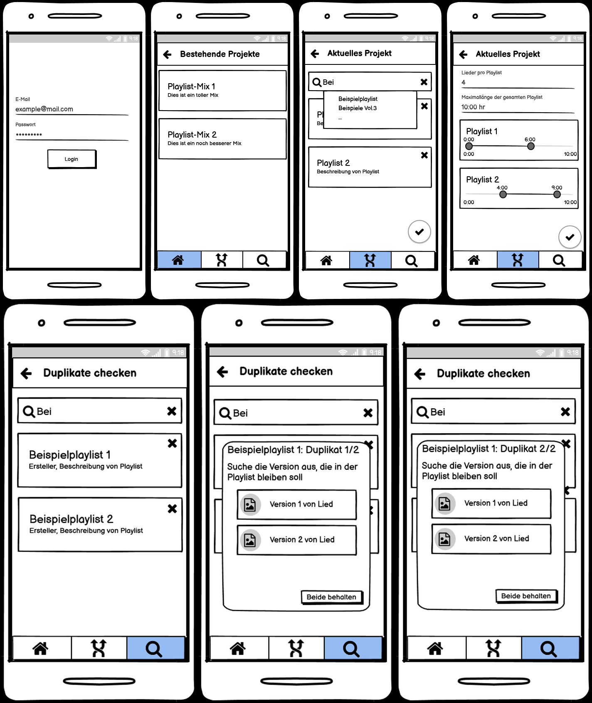

# Design Thinking und User Centered Design - Der Nutzer im Fokus der Entwicklung

Diese Arbeit beschäftigt sich damit, wie sich der Nutzer am besten in den Fokus der Entwicklung einbinden lässt. Zu
diesem Zweck werden zwei Ansätze betrachtet. Einerseits das Design Thinking und zum Anderen das User Centered Design.
Diese Ansätze werden auf zwei Projekte angewendet, um einen möglichst vielseitigen Blick auf die Vor- und Nachteile zu
erlangen. Da beide Ansätze an verschiedenen Punkten der Entwicklung angesetzt werden können, werden sie für das
jeweilige Projekt nacheinander ausgeführt.

## Aufgabenstellung

Für dieses Projekt soll zuerst Design Thinking und User Centered Design ergründet werden. Mit diesem Wissen kann dann
ein Projektplan erstellt werden, nach dem die beiden Anwendungen entwickelt werden. Bei den beiden Anwendungen handelt
es sich um Apps. Abschließend soll eine qualitative Einschätzung der Vor- und Nachteile der beiden Ansätze passieren.

## Grundlagen

Dieses Kapitel soll die Grundlagen für die Arbeit legen. Dafür werden primär die beiden Entwicklungsansätze betrachtet.

### Design Thinking

Design Thinking beschreibt einen Ansatz der Innovationen fördern soll, um Probleme zu lösen. Dabei liegt der Fokus immer
auf dem Nutzer und dessen Probleme, die verstanden werden müssen. Hierbei ist Design Thinking zu aller erst eine
Philosophie aus der verschiedene Methoden abgeleitet werden können.

Der Ansatz baut auf 4 Grundpfeilern auf: Prinzipien, Rahmenbedingungen, Prozess und Team. Bestimmte Prinzipien müssen
immer befolgt werden, dazu zählt zum Beispiel, dass Fehler auf jeden Fall erlaubt sind oder Teammitglieder auf Augenhöhe
kommunizieren. Bevor der eigentliche Prozess gestartet werden kann, müssen Rahmenbedingungen festgelegt werden, die
unter anderem festlegen können, wie die Zielvision aussieht oder in welchem Zeitrahmen gearbeitet wird. Bei der Bildung
eines Teams ist es wichtig darauf zu achten, dass das Team interdisziplinär ist, um möglichst viele Ansichten beachten
zu können und den Nutzer optimal verstehen zu können. Der Prozess des Design Thinkings besteht dann aus mehreren Phasen,
die je nach Lehre variieren können.

Als Beispiel wird der Prozess des Hasso Plattner Instituts vorgestellt, der aus sechs Phasen besteht.

1. Verstehen: Problem verstehen und daraus Aufgabenstellung definieren
2. Beobachten: Nutzerverhalten analysieren, daraus Hindernisse erkennen
3. Standpunkt definieren: Das Problem aus sicht der Nutzer beschreiben
4. Ideen generieren: Möglichst viele (auch unrealistische) Ideen entwickeln
5. Prototyp erstellen: Ideen konkretisieren und daraus Prototyp erstellen
6. Testen: Rückmeldungen zum Prototypen einholen und einarbeiten (Iteration)

### User Centered Design

### Flutter

Flutter ist ein Multiplattform-Framework, dass es ermöglicht mit einer Codebasis viele Plattformen zu bespielen. Als
Programmiersprache wird Dart benutzt, eine als Alternative zu Javascript erdachte Sprache. Das von Google geführte
Projekt konnte zum Start in 2017 nur Android und iOS als Plattformen bedienen. Inzwischen sind mit Web, Windows und
Linux eine große Auswahl an Plattformen hinzugekommen. [[Flutter]]

Neben der großen Auswahl an Plattformen bietet Flutter die Möglichkeit schnell und einfach ansprechende Anwendungen zu
entwerfen. Hierbei helfen eine Vielzahl von Haus aus verfügbaren Widgets, die im Material Design konzipiert sind.
Außerdem gibt es die Möglichkeit des *Hot Reloads*, der Änderungen am Design direkt in der Anwendung anzeigt, ohne die
App komplett neu bauen zu müssen.

Im Vorfeld zu diesem Projekt wurden bereits gute Erfahrungen mit Flutter gemacht, weshalb beide Anwendungen mit dem
Framework entwickelt werden.

## Projektdesign

Der grundlegende Aufbau des Projekts besteht aus zwei Phasen. Zuerst wird Design Thinking eingesetzt, um die
grundlegenden Anforderungen zu finden und einen Prototyp zu entwerfen. Dieser Prototyp soll dann mithilfe des User
Centered Design weiterentwickelt und umgesetzt werden.

### Phase 1: Design Thinking

In der ersten Phase wird Design Thinking angewendet. Dafür werden die entsprechenden sechs Schritte durchlaufen. Im
Kick-off wir die vorläufige Aufgabenstellung aufgestellt, die dann diskutiert und verfeinert werden soll.

Für das Verstehen sollen Brainstorming und die User Journey Map zum Einsatz kommen. Bei der User Journey Map handelt es
sich um eine Methode bei der ein bekannter Ablauf, der mit dem Projekt optimiert werden soll, analysiert wird und
jeder Schritt vom Nutzer eingeschätzt wird. Dadurch kann herausgefunden werden, an welchen Stellen Probleme aufkommen
können und entsprechende Verbesserungen ansetzen können.

Für den Schritt des Beobachtens wird das stille Beobachten genutzt. Dabei wird ein nutzer beobachtet, wie er den
bisherigen Ablauf durchführt. Hierbei soll vor allem auf Details geachtet werden, häufig können Verhaltensweisen erkannt
werden, die ein nutzer selber gar nicht registered. Im Anschluss wird noch ein Interview geführt, das weiteren
Aufschluss über das Verhalten und die dazugehörigen Beweggründe geben soll. Um die Antworten auszuwerten, soll die Dark
Horse zum Einsatz kommen. Dabei werden die Ergebnisse in Paaren nach Bedürfnisse und Hürden eingeteilt, die wiederum in
der nächsten Phase verwendet werden können.

Um einen Standpunkt zu definieren sind Personas ein wichtiges Mittel. Dabei spielen vor allem extreme Nutzer eine große
Rolle. Da die Abbildung dieser helfen kann die Extremen eines Problems zu betrachten. Mithilfe der Personas kann dann
eine neue Challenge aufgestellt werden, auf welcher die Ideenfindung beruht.

Im Nächten Schritt werden Ideen generiert. Um möglichst viele Ideen zu finden, wird die Crazy 8 methode angewendet.
Dabei hat jedes Teammitglied eine Minute Zeit um sich eine Idee auszudenken. Danach muss er zur nächsten idee weiter
gehen. Das wird dann achtmal wiederholt. Mithilfe von Dot Voting werden die besten Ideen ausgesucht. Beim Dot Voting
erhält jedes Teammitglied eine bestimmte Anzahl von Punkten, die dann beliebig verteilt werden können. Die Ideen mit den
meisten Punkten werden dann ausgewählt.

Mithilfe der besten Ideen kann dann ein Prototyp erstellt werden. Zu diesem zweck werden die ideen zuerst konkretisiert
und zu Anforderungen formuliert. Mithilfe der Anforderungen werden dann Mockups erstellt, die die komplette Anwendung
darstellen.

### Phase 2: User Centered Design

In der zweiten Phase wird der Prototyp aus Phase 1 genutzt, um ihn mithilfe von User Centered Design weiterzuentwickeln
und umzusetzen.

Da bereits ein Prototyp besteht, wird mit der Phase der Evaluation begonnen. Zu diesem zweck wird direktes Feedback von
potenziellen Nutzern über ein Fragebogen eingeholt. Das hat den Vorteil, dass möglichst viele Menschen innerhalb von
einem kleinen Zeitraum antworten können. So können trotz der Kürze des Projektzeitraums mehrere Iterationen durchgeführt
werden.

Aus den Antworten des Fragebogens werden die neuen Spezifikationen erstellt. Also welche Punkte konkret anders zum
ersten Prototypen gestaltet werden sollen. mit diesen Anforderungen kann dann eine erste Version der jeweiligen
Anwendung implementiert werden. Mit dieser Version kann dann eine zweite iteration des User Centered Design durchgeführt
werden. Also wieder das Feedback über einen Fragebogen einholen, um daraus neue Anforderungen zu bilden. Je nach
zeitlicher Verfügbarkeit können diese Anforderungen noch einmal umgesetzt werden.

Diese Iteration können beliebig weiter geführt werden, um eine Anwendung weiter zu optimieren.

## Durchführung

In diesem kapitel soll die Durchführung der beiden Projekte beleuchtet werden. Dafür wird die gleiche Einteilung in zwei
Phasen wie bei der Projektplanung genutzt.

### Rettungsapp

Bei dem ersten Projekt handelt es sich um eine Anwendung, die den Zugriff auf Algorithmen für Notfallsanitäter
vereinfachen soll, im Folgenden Rettungsapp genannt. Bei den Algorithmen handelt es sich um Abläufe von Maßnahmen, die
angewendet werden können, wenn
bestimmte Diagnose am Einsatzort gestellt werden. Die Algorithmen werden durch den deutschen Berufsverband
Rettungsdienst e.V. [[DBRD]] und dem Landesausschuss Rettungsdienst Niedersachsen [[NUN]] bereitgestellt. Sie sind in
PDFs aufgeführt. Für beide Dateien wurde im Vorfeld der Entwicklung eine schriftliche Erlaubnis zur Verwendung
eingeholt.

#### Design Thinking

Für das Design Thinking zur Rettungsapp bestand das Team nur aus zwei Personen. Dies liegt daran, dass die Zielgruppe,
also Notfallsanitäter sehr speziell ist und somit Personen mit entsprechendem Domänenwissen rar gesät sind.

***Kick-off***

Für den Kick-Off wird zuerst eine Design Thinking Challenge aufgestellt, die bearbeitet werden sollte. Diese wird
möglichst einfach und offen gestaltet, um viel Gestaltungsraum zu lassen: **System zur Unterstützung des
Rettungsdiensts entwickeln**. Die einzelnen Bestandteile werden dann genauer besprochen, um daraus eine neue Challenge
aufzustellen. Durch dieses Vorgehen kann ein erster Kontakt zu dem Projekt aufgebaut und ein allgemeines Verständnis
etabliert werden. Die daraus resultierende Aufgabenstellung lautet: **Entwicklung einer mobilen App zum Nachschlagen von
Algorithmen(Behandlungen) für Notfallsanitäter**. Diese Challenge grenzt die Aufgabe deutlich weiter ein und ist die
Basis für die nächsten Schritte.

***Verstehen***

Zum Schritt des Verstehens wird Brainstorming genutzt. Dabei wird sich an den einzelnen Begriffen der Aufgabenstellung
orientiert, um möglichst viele Stichpunkte zu dem Projekt zu finden. Sämtliche Einfälle werden auf Post-Its notiert, um
sie nach bekannten und unbekannten Wissen einzuteilen. Dadurch kann ein Überblick darüber erhalten werden, an welchen
Stellen weitere nachforschungen sinnvoll sind. In [Abbildung 1] ist die entsprechende Aufstellung zu sehen.

[Abbildung 1]
*Brainstorming Rettungsapp*

Neben dem Brainstorming wird die Methode der User Journey Map angewendet. Hier wird der aktuelle Ablauf im Falle eines
Rettungseinsatzes betrachtet. Jeder einzelne Schritt wird nach dem dabei empfunden Gefühl bewertet. Geht es dem
Sanitäter dabei gut und er kann die Aufgabe optimal bearbeiten oder geht es ihm schlecht und es kommt zu Problemen bei
der Bearbeitung?

[Abbildung 2]
*User Journey Map Rettungsapp*

Die entsprechenden Resultate sind in [Abbildung 2] zu sehen. Hierbei fällt bereits auf, dass vor allem der Einsatz der
Algorithmen für Unzufriedenheit sorgt. Neben den Algorithmen kann an dieser Stelle erkannt werden, dass Ivena von den
Sanitätern genutzt wird. Dies ist eine Anwendung mit der freie Krankenhäuser gefunden werden können, die für den
aktuellen Patienten ausgestattet sind. Diese Anwendung bereitet ebenfalls Probleme bei der Nutzung.

***Beobachten***

Für den Schritt Beobachten wird ein Nutzer zuerst still beobachtet. Dabei konten vor allem die zuvor erwartbaren
Tätigkeiten erkannt werden, wie Smartphone herausholen, PDF öffnen oder die entsprechende Krankheit heraussuchen.
Daneben sind allerdings auch kleinere Dinge aufgefallen. Zum Beispiel gibt es in dem PDF keine Verlinkung vom
Inhaltsverzeichnis zu der richtigen Seite, es muss dahin gescrollt werden. Außerdem muss gezoomt werden, um details
lesen zu können, was wiederum dazu führt, dass auf einer Seite gescrollt werden muss, um alles zu erkennen. Dies sind
Punkte, die im späteren Verlauf relevant werden können.

Nachdem stillen Beobachten wird ein Interview mit dem Nutzer geführt. Dabei können viele Punkte nochmal tiefer
ergründet werden. Außerdem gibt es einen deutlich größeren Einblick in diverse Aspekte des Rettungsdients, vor allem
inwiefern Neuerungen umgesetzt werden können. Die wichtigsten Aussagen sind folgende:

* Die Anwendung sollte offline erreichbar sein, um an jedem Einsatzort verfügbar zu sein.
* Die Suche sollte optimiert werden, um schneller zum Ergebnis, also dem gesuchten Algorithmus zu kommen.
* Die Algorithmen sollten automatisch aktualisiert werden, einmal im jahr gibt es eine neue Version
* Die Darstellung in den PDFs ist nicht optimal, häufig kleine texte, die nicht für kleine Bildschirme optimiert sind.
* Im Allgemeinen gibt es im krankensystem viele Stellen die digitalisiert werden könnten, beispielsweise gäbe es die
  Möglichkeit Daten für die Diagnose bereits während der Fahrt ans Krankenhaus zu schicken.

Ein besonders überraschendes Ergebnis bei dem interview ist, an wie vielen Stellen im gesundheitswesen noch
Optimierungen durch Digitalisierung möglich sind und wie schwierig es gleichzeitig ist, Änderungen umzusetzen. Vor allem
die Hürde Änderungen möglichst flächendeckend einzusetzen und ein mangelndes Budget stellen häufig Probleme dar.

***Standpunkt definieren***

Um den Standpunkt zu definieren werden einige Nutzertypen oder auch Personas aufgestellt. Diese sind relativ knapp
gehalten, da durch den eingeschränkten Nutzerkreis viele Punkte bei den Personas überschneiden.

**Vorsichtig:** Dieser Nutzertyp greift grundsätzlich eher später zu den Algorithmen. Er wartet eher ab, ob eine
Besserung
durch Standardprozeduren erreicht werden können, bevor er beispielsweise zu Medikamenten greift.

**Proaktiv:** Ein proaktiver Nutzer stellt das Gegenteil des vorsichtigen dar. Er greift schnell zu den Algorithmen, um
im besten Fall einen zeitlichen Vorsprung bei der Behandlung zu bekommen. Dementsprechend nutzt er auch schneller
Medikamente.

**Verweigerer:** Hierbei handelt es sich häufig um Sanitäter, die bereits lange im Dienst sind. Sie haben den Umgang mit
Patienten noch größtenteils ohne Medikamente gelernt und sind dementsprechend nicht sicher im umgang mit ihnen. Die
Algorithmen sind ebenfalls noch sehr neu, weshalb ihnen nicht vertraut wird.

Mit diesem Wissen kann eine neue Design Thinking Challenge aufgestellt werden, die als Basis für die Ideenfindung
genutzt wird. Nachdem alle wichtigen Aspekte der vergangenen Schritte betrachtet wurden, kann folgende Challenge
aufgestellt werden: **Entwicklung einer Anwendung für Notfallsanitäter, um schnell und unabhängig über aktuelle
Behandlungen zu informieren**

***Ideen generieren***

Für die Ideengenerierung wird die Crazy 8 Methode angewendet, beide Teammitglieder erdenken also acht Ideen in 8
Minuten. Bei der Bewertung der Ideen durch das Dot Voting wurden vor allem die Ideen hoch bewertet, die während des
ganzen Prozesses naheliegend waren. Dazu zählen die Umsetzung als mobile App oder ein Suchfeld für die Algorithmen.
Allerdings kamm auch eine komplett neue Idee auf: Eine karte auf der die nächsten verfügbaren Krankenhäuser angezeigt
werden, um die Distanz abschätzen zu können. Aktuell lassen sich die Krankenhäuser in Ivena nur nach Landkreisen
filtern, was nicht unbedingt die kürzeste Distanz bedeutet.

Mithilfe dieser Ideen werden die konkreten Anforderungen aufgestellt. Diese bestehen aus drei Überpunkten, die umgesetzt
werden sollen:

1. Mobile App: Die Anwendung soll offline erreichbar sein. Deshalb soll sie als native Android und iOS App umgesetzt
   werden. Es ist außerdem möglich eine WebApp anzubieten, um eine niedrigere Einstiegshürde zu schaffen.
2. Suche: Mithilfe eines Suchfeldes lassen sich die vorhandenen Algorithmen durchsuchen und auswählen. Beim Antippen
   eines
   Algorithmus wird das entsprechende PDF auf der richtigen Seite geöffnet.
3. Auswahl von NUN/DBRD: Bei Algorithmen die durch beide Anbieter abgedeckt werden kann ausgewählt werden, welcher
   angezeigt werden soll. In dieser Anzeige besteht die Möglichkeit zwischen den beiden Versionen zu wechseln, um
   schnell alle möglichen informationen zu erreichen.

*Prototyp erstellen*

Aufgrund dieser Anforderungen wurden folgende Mockups mithilfe von balsamiq [[balsamiq]] erstellt.

[Abbildung 3]
*Mockup der Rettungsapp*

Diese Mockups sind das Endergebnis des Design Thinking Prozesses. Sie geben einen guten Eindruck davon wie die Anwendung
aussehen sollen und erfüllen die zuvor aufgestellten Anforderungen. Sie dienen als Grundlagen für die nächste Phase: der
Entwicklung der App nach User Centered Design.

#### User Centered Design

### Erweiterung zu Spotify

*Kick-off*

*Verstehen*

*Beobachten*

*Standpunkt definieren*

*Ideen generieren*

*Prototyp erstellen*

#### User Centered Design

## Fazit

## Anhang

### Abbildungsverzeichnis

[Abbildung 1] - Brainstorming Rettungsapp

[Abbildung 1]: https://mwithoeft.github.io/SGSE22/praktikum/kuhn/assets/BrainstormingProject1.jpg

[Abbildung 2] - User Journey Map Rettungsapp

[Abbildung 2]: https://mwithoeft.github.io/SGSE22/praktikum/kuhn/assets/UserJourneyMap.png

[Abbildung 3] - Mockup der Rettungsapp

[Abbildung 3]: https://mwithoeft.github.io/SGSE22/praktikum/kuhn/assets/allRetung.png

### Literaturverzeichnis

[balsamiq]

[balsamiq]: https://balsamiq.com/

[DBRD] - Deutscher Berufsverband Rettungsdienst e.V.

[DBRD]: https://www.dbrd.de/index.php/aktuell/aktuelles/557-muster-algorithmen-2021-online

[Flutter]

[Flutter]: https://flutter.dev/

[NUN] - Landesausschuss Rettungsdienst Niedersachsen

[NUN]: https://lard-nds.de/download/nun-algorithmen-2022/

