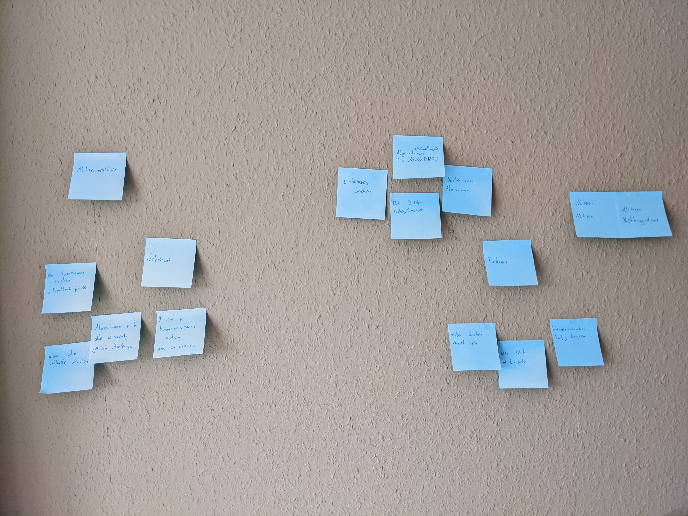
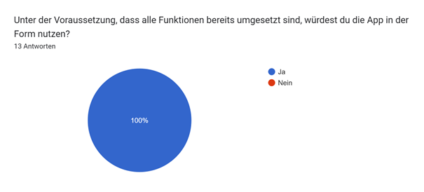

# Design Thinking und User Centered Design - Der Nutzer im Fokus der Entwicklung

Diese Arbeit beschäftigt sich damit, wie sich der Nutzer am besten in den Fokus der Entwicklung einbinden lässt. Zu
diesem Zweck werden zwei Ansätze betrachtet. Einerseits das Design Thinking und zum anderen das User Centered Design.
Diese Ansätze werden auf zwei Projekte angewendet, um einen möglichst vielseitigen Blick auf die Vor- und Nachteile zu
erlangen. Da beide Ansätze an verschiedenen Punkten der Entwicklung angesetzt werden können, werden sie für das
jeweilige Projekt nacheinander ausgeführt.

## Aufgabenstellung

Für dieses Projekt soll zuerst Design Thinking und User Centered Design ergründet werden. Mit diesem Wissen kann dann
ein Projektplan erstellt werden, nach dem die beiden Anwendungen entwickelt werden. Bei den beiden Anwendungen handelt
es sich um Apps. Abschließend soll eine qualitative Einschätzung der Vor- und Nachteile der beiden Ansätze passieren.

## Grundlagen

Dieses Kapitel soll die Grundlagen für die Arbeit legen. Dafür werden primär die beiden Entwicklungsansätze betrachtet.

### Design Thinking

Design Thinking beschreibt einen Ansatz der Innovationen fördern soll, um Probleme zu lösen. Dabei liegt der Fokus immer
auf dem Nutzer und dessen Probleme, die verstanden werden müssen. Hierbei ist Design Thinking zuallererst eine
Philosophie aus der verschiedene Methoden abgeleitet werden können.

Der Ansatz baut auf 4 Grundpfeilern auf: Prinzipien, Rahmenbedingungen, Prozess und Team. Bestimmte Prinzipien müssen
immer befolgt werden, dazu zählt zum Beispiel, dass Fehler auf jeden Fall erlaubt sind oder Teammitglieder auf Augenhöhe
kommunizieren. Bevor der eigentliche Prozess gestartet werden kann, müssen Rahmenbedingungen festgelegt werden, die
unter anderem festlegen können, wie die Zielvision aussieht oder in welchem Zeitrahmen gearbeitet wird. Bei der Bildung
eines Teams ist es wichtig darauf zu achten, dass das Team interdisziplinär ist, um möglichst viele Ansichten beachten
zu können und den Nutzer optimal verstehen zu können. Der Prozess des Design Thinkings besteht dann aus mehreren Phasen,
die je nach Lehre variieren können.

Als Beispiel wird der Prozess des Hasso Plattner Instituts vorgestellt, der aus sechs Phasen besteht.

1. Verstehen: Problem verstehen und daraus Aufgabenstellung definieren
2. Beobachten: Nutzerverhalten analysieren, daraus Hindernisse erkennen
3. Standpunkt definieren: Das Problem aus Sicht der Nutzer beschreiben
4. Ideen generieren: Möglichst viele (auch unrealistische) Ideen entwickeln
5. Prototyp erstellen: Ideen konkretisieren und daraus Prototyp erstellen
6. Testen: Rückmeldungen zum Prototypen einholen und einarbeiten (Iteration)

### User Centered Design

Das User Centered Design bindet den Nutzer in den Entwicklungsprozess ein. Es ist darauf ausgelegt möglichst früh auf
Wünsche und Anregungen der Nutzer einzugehen. Um den Wünschen der Nutzer entsprechen zu können, müssen diese Wünsche
erstmal erfasst werden. Dafür wird beim User Centered Design zuerst eine Phase eingeräumt,
in der der Nutzer befragt werden muss. Hier geht es vor allem darum, Input von
außerhalb des Entwicklerkreises zu bekommen. Je ausführlicher und genauer diese
Umfragen ausfallen, desto besser kann sich danach nach den Wünschen gerichtet
werden.

Der Kontakt zu den Endnutzern sollte auch während des Entwicklungsprozesses
aufrechterhalten werden. Während der Entwicklung müssen die Neuentwicklungen
immer wieder vom Nutzer getestet werden, um Feedback einzuholen. Dabei ist
auch zu bedenken, dass es deutlich günstiger ist, einen Fehler in der Planungs-,
oder Entwicklungsphase zu entdecken, als nach der Veröffentlichung.

Ein solcher Prozess wird auch in [Mos12] S.14f von Christian Moser beschrieben.
Er benutzt den Begriff User-Experience-Design-Prozess. Im Enddefekt wird damit
allerdings ein sehr ähnliches Vorgehen beschrieben.

[Abbildung 1]
*User-Experience-Design-Prozess nach [Mos12] S.14*

In [Abbildung 1] wird der Prozess visualisiert. Er ähnelt dabei einem Ablauf wie
man ihn aus agilen Entwicklungsmethoden kennt. Die Anwendung wird zyklisch
entwickelt und dementsprechend zyklischen Abständen veröffentlicht. Auffällig ist,
dass der Fokus nicht, wie sonst üblich, auf der Implementierung liegt, sondern
bei dem Nutzer und der Planung der Implementierung.
Neben den eigentlichen Software-Tests ist das Usability-Testing ein wichtiger Teil des Prozesses. Bei diesem
ist es wichtig, dass auch der Endnutzer mit eingebunden wird.
Des Weiteren ist auffällig, dass die Entwicklung von Prototypen innerhalb der
Entwicklung eine Rolle spielt. Dadurch soll gewährleistet werden, dass möglichst
wenige Fehler während der Implementierung passieren.

[Abbildung 2]
*User-Centered-Design nach [IPI]*

In [Abbildung 2] wird eine weitere Möglichkeit aufgeführt, den Prozess des User Centered Design auszuführen [[IPI]].
Hier werden fünf Phasen aufgestellt, die iterativ durchlaufen werden.

1. Strategie: Zuerst muss der komplette Prozess geplant werden, bevor er gestartet wird.
2. Analyse: Der Nutzerkontext wird untersucht, indem die Eigenschaften, Verhaltensweisen und Erwartungshaltungen der
   Nutzer analysiert werden. An dieser Stelle wird Feedback von den Nutzern eingeholt.
3. Spezifikation: Hier werden die Erkenntnisse aus dem letzten Schritt in konkrete Anforderungen gegossen.
4. Design/Implementierung: Je nach Projekt wird hier weiter an einem Prototyp designt oder die Anforderungen werden in
   das Produkt implementiert.
5. Evaluation: Es wird überprüft, ob die Anforderungen erfüllt wurden und alle Elemente bedienbar sind.

Durch diese Phasen kann so häufig iteriert werden, bis das Produkt einen zufriedenstellenden Zustand erreicht.
Dieser Ablauf dient als Vorbild für dieses Praktikum.

Das User Centered Design ist also ein Prinzip, dass versucht den Nutzer in die Mitte der Entwicklung
zu rücken. Es gibt keine konkreten Regeln vor, sondern versucht durch
allgemeine Vorgaben den Entwicklungsprozess zu optimieren. Vor allem eine detaillierte
Planung und regelmäßiges Feedback des Endnutzers sollen dabei helfen,
das Erlebnis des Nutzers zu verbessern.

### Flutter

Flutter ist ein Multiplattform-Framework, dass es ermöglicht mit einer Codebasis viele Plattformen zu bespielen. Als
Programmiersprache wird Dart benutzt, eine als Alternative zu JavaScript erdachte Sprache. Das von Google geführte
Projekt konnte zum Start im Jahr 2017 nur Android und iOS als Plattformen bedienen. Inzwischen sind mit Web, Windows und
Linux eine große Auswahl an Plattformen hinzugekommen. [[Flutter]]

Neben der großen Auswahl an Plattformen bietet Flutter die Möglichkeit schnell und einfach ansprechende Anwendungen zu
entwerfen. Hierbei helfen eine Vielzahl von Haus aus verfügbaren Widgets, die im Material Design konzipiert sind.
Außerdem gibt es die Möglichkeit des *Hot Reloads*, der Änderungen am Design direkt in der Anwendung anzeigt, ohne die
App komplett neu bauen zu müssen.

Im Vorfeld zu diesem Projekt wurden bereits gute Erfahrungen mit Flutter gemacht, weshalb beide Anwendungen mit dem
Framework entwickelt werden.

## Projektdesign

Der grundlegende Aufbau des Projekts besteht aus zwei Phasen. Zuerst wird Design Thinking eingesetzt, um die
grundlegenden Anforderungen zu finden und einen Prototyp zu entwerfen. Dieser Prototyp soll dann mithilfe des User
Centered Design weiterentwickelt und umgesetzt werden.

### Phase 1: Design Thinking

In der ersten Phase wird Design Thinking angewendet. Dafür werden die entsprechenden sechs Schritte durchlaufen. Im
Kick-off wir die vorläufige Aufgabenstellung aufgestellt, die dann diskutiert und verfeinert werden soll.

Für das Verstehen sollen Brainstorming und die User Journey Map zum Einsatz kommen. Bei der User Journey Map handelt es
sich um eine Methode bei der ein bekannter Ablauf, der mit dem Projekt optimiert werden soll, analysiert wird und
jeder Schritt vom Nutzer eingeschätzt wird. Dadurch kann herausgefunden werden, an welchen Stellen Probleme aufkommen
können und entsprechende Verbesserungen ansetzen können.

Für den Schritt des Beobachtens wird das stille Beobachten genutzt. Dabei wird ein Nutzer beobachtet, wie er den
bisherigen Ablauf durchführt. Hierbei soll vor allem auf Details geachtet werden, häufig können Verhaltensweisen erkannt
werden, die ein Nutzer selber gar nicht registered. Im Anschluss wird noch ein Interview geführt, das weiteren
Aufschluss über das Verhalten und die dazugehörigen Beweggründe geben soll. Um die Antworten auszuwerten, soll die Dark
Horse zum Einsatz kommen. Dabei werden die Ergebnisse in Paaren nach Bedürfnissen und Hürden eingeteilt, die wiederum in
der nächsten Phase verwendet werden können.

Um einen Standpunkt zu definieren sind Personas ein wichtiges Mittel. Dabei spielen vor allem extreme Nutzer eine große
Rolle. Da die Abbildung dieser helfen kann die Extremen eines Problems zu betrachten. Mithilfe der Personas kann dann
eine neue Challenge aufgestellt werden, auf welcher die Ideenfindung beruht.

Im Nächten Schritt werden Ideen generiert. Um möglichst viele Ideen zu finden, wird die Crazy 8 Methode angewendet.
Dabei hat jedes Teammitglied eine Minute Zeit, um sich eine Idee auszudenken. Danach muss er zur nächsten Idee weiter
gehen. Das wird dann achtmal wiederholt. Mithilfe von Dot Voting werden die besten Ideen ausgesucht. Beim Dot Voting
erhält jedes Teammitglied eine bestimmte Anzahl von Punkten, die dann beliebig verteilt werden können. Die Ideen mit den
meisten Punkten werden dann ausgewählt.

Mithilfe der besten Ideen kann dann ein Prototyp erstellt werden. Zu diesem Zweck werden die Ideen zuerst konkretisiert
und zu Anforderungen formuliert. Mithilfe der Anforderungen werden dann Mockups erstellt, die die komplette Anwendung
darstellen.

### Phase 2: User Centered Design

In der zweiten Phase wird der Prototyp aus Phase 1 genutzt, um ihn mithilfe von User Centered Design weiterzuentwickeln
und umzusetzen.

Da bereits ein Prototyp besteht, wird mit der Phase der Evaluation begonnen. Zu diesem Zweck wird direktes Feedback von
potenziellen Nutzern über einen Fragebogen eingeholt. Das hat den Vorteil, dass möglichst viele Menschen innerhalb von
einem kleinen Zeitraum antworten können. So können trotz der Kürze des Projektzeitraums mehrere Iterationen durchgeführt
werden.

Aus den Antworten des Fragebogens werden die neuen Spezifikationen erstellt. Also welche Punkte konkret anders zu dem
ersten Prototyp gestaltet werden sollen. Mit diesen Anforderungen kann dann eine erste Version der jeweiligen
Anwendung implementiert werden. Mit dieser Version kann dann eine zweite Iteration des User Centered Design durchgeführt
werden. Also wieder das Feedback über einen Fragebogen einholen, um daraus neue Anforderungen zu bilden. Je nach
zeitlicher Verfügbarkeit können diese Anforderungen noch einmal umgesetzt werden.

Diese Iteration können beliebig weitergeführt werden, um eine Anwendung weiter zu optimieren.

[Abbildung 3]
*Geplanter Projektablauf*

## Durchführung

In diesem Kapitel soll die Durchführung der beiden Projekte beleuchtet werden. Dafür wird die gleiche Einteilung in zwei
Phasen wie bei der Projektplanung genutzt.

### Rettungsapp

Bei dem ersten Projekt handelt es sich um eine Anwendung, die den Zugriff auf Algorithmen für Notfallsanitäter
vereinfachen soll, im Folgenden Rettungsapp genannt. Bei den Algorithmen handelt es sich um Abläufe von Maßnahmen, die
angewendet werden können, wenn
bestimmte Diagnose am Einsatzort gestellt werden. Die Algorithmen werden durch den deutschen Berufsverband
Rettungsdienst e.V. [[DBRD]] und dem Landesausschuss Rettungsdienst Niedersachsen [[NUN]] bereitgestellt. Sie sind in
PDFs aufgeführt. Für beide Dateien wurde im Vorfeld der Entwicklung eine schriftliche Erlaubnis zur Verwendung
eingeholt.

#### Design Thinking

Für das Design Thinking zur Rettungsapp bestand das Team nur aus zwei Personen. Dies liegt daran, dass die Zielgruppe,
also Notfallsanitäter sehr speziell ist und somit Personen mit entsprechendem Domänenwissen rar gesät sind.

***Kick-Off***

Für den Kick-Off wird zuerst eine Design Thinking Challenge aufgestellt, die bearbeitet werden sollte. Diese wird
möglichst einfach und offen gestaltet, um viel Gestaltungsraum zu lassen: **System zur Unterstützung des
Rettungsdiensts entwickeln**. Die einzelnen Bestandteile werden dann genauer besprochen, um daraus eine neue Challenge
aufzustellen. Durch dieses Vorgehen kann ein erster Kontakt zu dem Projekt aufgebaut und ein allgemeines Verständnis
etabliert werden. Die daraus resultierende Aufgabenstellung lautet: **Entwicklung einer mobilen App zum Nachschlagen von
Algorithmen (Behandlungen) für Notfallsanitäter**. Diese Challenge grenzt die Aufgabe deutlich weiter ein und ist die
Basis für die nächsten Schritte.

***Verstehen***

Zum Schritt des Verstehens wird Brainstorming genutzt. Dabei wird sich an den einzelnen Begriffen der Aufgabenstellung
orientiert, um möglichst viele Stichpunkte zu dem Projekt zu finden. Sämtliche Einfälle werden auf Post-Its notiert, um
sie nach bekanntem und unbekanntem Wissen einzuteilen. Dadurch kann ein Überblick darüber erhalten werden, an welchen
Stellen weitere Nachforschungen sinnvoll sind. In [Abbildung 4] ist die entsprechende Aufstellung zu sehen.

[Abbildung 4]
*Brainstorming Rettungsapp*

Neben dem Brainstorming wird die Methode der User Journey Map angewendet. Hier wird der aktuelle Ablauf im Falle eines
Rettungseinsatzes betrachtet. Jeder einzelne Schritt wird nach dem dabei empfundenen Gefühl bewertet. Geht es dem
Sanitäter dabei gut und er kann die Aufgabe optimal bearbeiten oder geht es ihm schlecht und es kommt zu Problemen bei
der Bearbeitung?

[Abbildung 5]
*User Journey Map Rettungsapp*

Die entsprechenden Resultate sind in [Abbildung 5] zu sehen. Hierbei fällt bereits auf, dass vor allem der Einsatz der
Algorithmen für Unzufriedenheit sorgt. Neben den Algorithmen kann an dieser Stelle erkannt werden, dass Ivena von den
Sanitätern genutzt wird. Dies ist eine Anwendung, mit der freie Krankenhäuser gefunden werden können, die für den
aktuellen Patienten ausgestattet sind. Diese Anwendung bereitet ebenfalls Probleme bei der Nutzung.

***Beobachten***

Für den Schritt Beobachten wird ein Nutzer zuerst still beobachtet. Dabei konnten vor allem die zuvor erwartbaren
Tätigkeiten erkannt werden, wie Smartphone herausholen, PDF öffnen oder die entsprechende Krankheit heraussuchen.
Daneben sind allerdings auch kleinere Dinge aufgefallen. Zum Beispiel gibt es in dem PDF keine Verlinkung vom
Inhaltsverzeichnis zu der richtigen Seite, es muss dahin gescrollt werden. Außerdem muss gezoomt werden, um Details
lesen zu können, was wiederum dazu führt, dass auf einer Seite gescrollt werden muss, um alles zu erkennen. Dies sind
Punkte, die im späteren Verlauf relevant werden können.

Nachdem stillen Beobachten wird ein Interview mit dem Nutzer geführt. Dabei können viele Punkte nochmal tiefer
ergründet werden. Außerdem gibt es einen deutlich größeren Einblick in diverse Aspekte des Rettungsdiensts, vor allem
inwiefern Neuerungen umgesetzt werden können. Die wichtigsten Aussagen sind folgende:

* Die Anwendung sollte offline erreichbar sein, um an jedem Einsatzort verfügbar zu sein.
* Die Suche sollte optimiert werden, um schneller zum Ergebnis, also dem gesuchten Algorithmus zu kommen.
* Die Algorithmen sollten automatisch aktualisiert werden, einmal im Jahr gibt es eine neue Version
* Die Darstellung in den PDFs ist nicht optimal, häufig kleine Texte, die nicht für kleine Bildschirme optimiert sind.
* Im Allgemeinen gibt es im Krankensystem viele Stellen, die digitalisiert werden könnten, beispielsweise gäbe es die
  Möglichkeit Daten für die Diagnose bereits während der Fahrt ans Krankenhaus zu schicken.

Ein besonders überraschendes Ergebnis bei dem Interview ist, an wie vielen Stellen im Gesundheitswesen noch
Optimierungen durch Digitalisierung möglich sind und wie schwierig es gleichzeitig ist, Änderungen umzusetzen. Vor allem
die Hürde Änderungen möglichst flächendeckend einzusetzen und ein mangelndes Budget stellen häufig Probleme dar.

***Standpunkt definieren***

Um den Standpunkt zu definieren werden einige Nutzertypen oder auch Personas aufgestellt. Diese sind relativ
knappgehalten, da durch den eingeschränkten Nutzerkreis viele Punkte bei den Personas überschneiden.

**Vorsichtig:** Dieser Nutzertyp greift grundsätzlich eher später zu den Algorithmen. Er wartet eher ab, ob eine
Besserung durch Standardprozeduren erreicht werden können, bevor er beispielsweise zu Medikamenten greift.

**Proaktiv:** Ein proaktiver Nutzer stellt das Gegenteil des vorsichtigen dar. Er greift schnell zu den Algorithmen, um
im besten Fall einen zeitlichen Vorsprung bei der Behandlung zu bekommen. Dementsprechend nutzt er auch schneller
Medikamente.

**Verweigerer:** Hierbei handelt es sich häufig um Sanitäter, die bereits lange im Dienst sind. Sie haben den Umgang mit
Patienten noch größtenteils ohne Medikamente gelernt und sind dementsprechend nicht sicher im Umgang mit ihnen. Die
Algorithmen sind ebenfalls noch sehr neu, weshalb ihnen nicht vertraut wird.

Mit diesem Wissen kann eine neue Design Thinking Challenge aufgestellt werden, die als Basis für die Ideenfindung
genutzt wird. Nachdem alle wichtigen Aspekte der vergangenen Schritte betrachtet wurden, kann folgende Challenge
aufgestellt werden: **Entwicklung einer Anwendung für Notfallsanitäter, um schnell und unabhängig über aktuelle
Behandlungen zu informieren**

***Ideen generieren***

Für die Ideengenerierung wird die Crazy 8 Methode angewendet, beide Teammitglieder erdenken also acht Ideen in 8
Minuten. Bei der Bewertung der Ideen durch das Dot Voting wurden vor allem die Ideen hoch bewertet, die während des
ganzen Prozesses naheliegend waren. Dazu zählen die Umsetzung als mobile App oder ein Suchfeld für die Algorithmen.
Allerdings kam auch eine komplett neue Idee auf: Eine Karte auf der die nächsten verfügbaren Krankenhäuser angezeigt
werden, um die Distanz abschätzen zu können. Aktuell lassen sich die Krankenhäuser in Ivena nur nach Landkreisen
filtern, was nicht unbedingt die kürzeste Distanz bedeutet.

Mithilfe dieser Ideen werden die konkreten Anforderungen aufgestellt. Diese bestehen aus drei Überpunkten, die umgesetzt
werden sollen:

1. Mobile App: Die Anwendung soll offline erreichbar sein. Deshalb soll sie als native Android und iOS App umgesetzt
   werden. Es ist außerdem möglich eine Webapp anzubieten, um eine niedrigere Einstiegshürde zu schaffen.
2. Suche: Mithilfe eines Suchfeldes lassen sich die vorhandenen Algorithmen durchsuchen und auswählen. Beim Antippen
   eines
   Algorithmus wird das entsprechende PDF auf der richtigen Seite geöffnet.
3. Auswahl von NUN/DBRD: Bei Algorithmen, die durch beide Anbieter abgedeckt werden, kann ausgewählt werden, welcher
   angezeigt werden soll. In dieser Anzeige besteht die Möglichkeit zwischen den beiden Versionen zu wechseln, um
   schnell alle möglichen Informationen zu erreichen.

*Prototyp erstellen*

Aufgrund dieser Anforderungen wurden folgende Mockups mithilfe von balsamiq [[balsamiq]] erstellt.

[Abbildung 6]
*Mockup der Rettungsapp*

Diese Mockups sind das Endergebnis des Design Thinking Prozesses. Sie geben einen guten Eindruck davon wie die Anwendung
aussehen sollen und erfüllen die zuvor aufgestellten Anforderungen. Sie dienen als Grundlagen für die nächste Phase: der
Entwicklung der App nach User Centered Design.

#### User Centered Design

In diesem Projekt beginnt das User Centered Design mit der Evaluation begonnen. Zu diesem Zweck wird eine Google Umfrage
erstellt. Es wurde sich für Google entschieden, da hier ein etablierter und funktionsreicher Editor für Umfragen zur
Verfügung gestellt wird, der es ermöglicht schnell zu arbeiten. [[Google Forms]]

Die erste Umfrage hat vor allem das Ziel, den Prototypen aus dem Design Thinking von einer größeren Menge von Nutzern
bestätigen zu lassen. Als Beispiel dafür, dass die meisten Nutzer mit dem grundsätzlichen Konzept zufrieden waren, lässt
sich [Abbildung 7] heranziehen. Hier sind der Großteil der Antworten positiv, was auf eine gute Orientierung in der App
schließen lässt.

[Abbildung 7]
*Rettungsapp: Wie gut hast du dich in dem Prototyp zurechtgefunden?*

Die meisten anderen Fragen bestätigen ebenfalls die Entwicklungsrichtung. Einzig bei der offenen Frage nach fehlenden
Funktionen kann eine neue Anforderung abgeleitet werden. hier wird gefordert, dass es die Möglichkeit geben soll das
komplette PDF anzuzeigen, ohne vorher einen bestimmten Algorithmus gesucht zu haben. Außerdem wurde durch den Ersteller
der NUN-Algorithmen gefordert, die Quelle in der App anzugeben.

Daraus lassen sich drei Anforderungen spezifizieren:

1. Umsetzen der bestehenden Mockups
2. Zusätzliche Möglichkeit direkt komplette PDF zu betrachten
3. Angabe der Quellen innerhalb der App

Diese Anforderungen können im nächsten Schritt implementiert werden. Auf die konkrete Implementierung mithilfe von
Flutter wird an dieser Stelle nur auf die Rahmenbedingungen eingegangen, da der Prozess für dieses Praktikum im
Vordergrund steht. Da Flutter ein Multiplattformframework ist und es entsprechend einfach ist im Verlauf der Entwicklung
die Zielplattform zu ändern, wurde sich entschieden vorerst eine Webapp zu entwickeln. Das hat den großen Vorteil, dass
diese über einen Link zu Verfügung gestellt werden kann. Dadurch lässt sich einfacher Feedback von Nutzern einholen, da
sie nichts auf ihrem Endgerät installieren müssen. Um die Webapp zu hosten, wird Firebase Hosting verwendet
[[Firebase]]. Hier lassen sich kostenlos kleine Projekte hosten und sind direkt über eine Domain von Firebase verfügbar.
Dadurch fallen für das Testen keine Kosten an.

[Abbildung 8]
*Screenshots der Rettungsapp*

In [Abbildung 8] sind Screenshots der implementierten App abgebildet. Die Mockups aus [Abbildung 3] lassen sich hier
deutlich wieder erkennen. Die Suche der Algorithmen, die Auswahl zwischen NUN und DBRD Algorithmen und die Anzeige des
PDFs konnten alle umgesetzt werden. Außerdem lässt sich auf der ersten Seite ein Menü erkennen, das es ermöglicht die
vollständigen PDFs direkt zu sehen und Information über die App und ihre Quellen zu erlangen. Somit konnten alle
Funktionen, die zuvor als Anforderungen aufgestellt wurden umgesetzt werden.

Im Anschluss an die Implementierung folgt wieder die Evaluation der Ergebnisse. Mit der bereits implementierten App
lassen sich deutlich detailliertere Fragen zu einzelnen Designentscheidungen stellen. Im Folgenden soll auf einige
interessante und aufschlussreiche Fragen eingegangen werden.

[Abbildung 9]
*Rettungsapp: Farbauswahl*

[Abbildung 10]
*Welche Farbe gefällt dir am besten?*

Zuerst ist die Frage nach der Farbgestaltung zu nennen. Das ursprüngliche Orange wurde aufgrund der Signalwirkung
gewählt, die zum Rettungsdienst passt. Die beiden alternativen Farbgebungen Grün und Blau aus [Abbildung 9] konnten
allerdings genauso viele Stimmen erlangen ([Abbildung 10]). Da alle Farbgestaltungen gleich beliebt sind, wird die
Anwendung in dem Orange belassen.

[Abbildung 11]
*Beispiel für Markierung*

[Abbildung 12]
*Markierung der Algorithmen*

Eine Funktion, die erst während der Erstellung der Umfrage aufgekommen ist, ist in [Abbildung 11] zu sehen. Es geht
darum bereits in der Suche erkennen zu können, aus welchem Algorithmus-Satz das Suchergebnis stammt. Die Idee stößt auf
breite Zustimmung mit einer kompletten Zustimmung aller Befragten ([Abbildung 12]). Diese Funktion wird also in die
nächsten Anforderungen mit aufgenommen.

[Abbildung 13]
*Potenzielle Nutzung der Rettungsapp*

Ein besonders erfreuliches Ergebnis konnte in der letzten Frage erreicht werden. Wie in [Abbildung 13] zu erkennen ist,
sind sich alle Befragten einig, dass sie die App in dieser Form bereits verwenden würden.

#### Erkenntnisse

An dieser Stelle sollen erste Erkenntnisse über den Ablauf des Design Thinking und des User Centered Designs für die
Rettungsapp festgehalten werden.

Als die Idee für die Rettungsapp entstanden ist, war bereits relativ klar welche Aufgabe die Anwendung erfüllen soll.
Deshalb war es im Design Thinking schwierig, offen für alle Problematiken und Lösungsansätze zu bleiben. Trotzdem konnte
eine deutliche Vertiefung das Verständnis für das Problem erreicht werden. Während des Design Thinkings kam es in den
verschiedenen Schritten häufig zu Wiederholungen der gleichen Probleme. Dies ist sicherlich auch der geringen Teamgröße
anzulasten, bei einem größeren Team kommen mehr Eindrücke auf, die immer neue Facetten aufzeigen können.

Im Endeffekt hat das Design Thinking seinen Zweck erfüllt, das Problem besser zu durchdringen und einen guten Prototyp
zu entwickeln.

Für das User Centered Design müssen die zwei Iterationen einzeln betrachtet werden. Bei der ersten Umfrage, die zu dem
zuvor erstellten Prototyp gemacht wurde, konnten vor allem die Ergebnisse aus dem Design Thinking bestätigt werden.
Konkrete Design-Fragen konnten hier nur schwierig beantwortet werden, da die Mockups einfach gehalten wurden. Hier wäre
es möglich die Mockups bereits genauer zu gestalten oder Fragen zum Design zu fragen, ohne konkrete Vorlagen zu haben.
Bei der zweiten Möglichkeit ist allerdings die Aussagekraft fraglich, da der Befragte die Fragen schnell falsch
verstehen kann oder sich ein falsches Bild des vorgeschlagenen Designs macht. Hilfreich war außerdem die Frag nach
fehlenden Features, da so noch eine Anforderung gefunden werden konnte.

Mit der zweiten Umfrage und der dafür entwickelten Webapp konnte viel genauer nach Designentscheidungen oder
Funktionen gefragt werden. Dadurch lassen sich hier im nächsten Schritt konkretere und kleinere Anforderungen
aufzustellen. Da sich das Produkt in diesem Stadium bereits nah an der Fertigstellung befindet, lässt sich außerdem ein
guter Eindruck davon gewinnen, ob potenzielle Nutzer die Anwendung in der Form gebrauchen können.

### Erweiterung zu Spotify

Für das zweite Projekt soll eine Anwendung zur Erweiterung von Spotify erstellt werden. Spotify ist ein
Musikstreaminganbieter, der eine große Reichweite genießt. Spotify bietet dabei eine API für Entwickler an durch die auf
Daten über viele Elemente wie Playlists, einzelne Songs oder Podcasts zugegriffen werden kann. Es lassen sich genauso
Inhalte über die API erstellen. Diese Möglichkeiten lassen sich nutzen, um eigene Anwendungen zu entwickeln, die die
Plattform von Spotify nutzen und um Funktionalitäten zu erweitern.

#### Design Thinking

Für den Design Thinking Prozess wird ein Team von vier Leuten aufgestellt. Die einzelnen Personen haben dabei
verschiedene Hintergründe, wie es beim Design Thinking gewünscht ist. Der Prozess und die angewandten Methoden werden
gegenüber dem Design Thinking abgeändert, um die Erfahrung aus dem ersten Mal zu nutzen und auf das Projekt anzupassen.
Außerdem können so mehr Methoden für die einzelnen Schritte ausprobiert werden.

Zu diesem Zweck wird in der Kick-Off Phase nur noch die Design Thinking Challenge aufgestellt. Angepasst wird sie erst
am Ende des Schritts "Standpunkt definieren". Außerdem wird nach dem Brainstorming die Sweet-und-Sour-Methode
angewendet, um die einzelnen Punkte einzuordnen. Die Methoden der User Journey Map und des stillen Beobachtens werden
weggelassen, da es in diesem Projekt keinen konkreten Ablauf gibt, der optimiert werden soll. Für die Ideengenerierung
wird zusätzlich die 6-3-5 Methode genutzt, um Ideen genauer ergründen zu können. Insgesamt sollen durch die neuen
Methoden weniger Wiederholungen der gleichen Inhalte erreicht werden.

***Kick-Off***

Für den Kick-Off wird wieder eine Aufgabenstellung erstellt, die möglichst viele Möglichkeiten für das Projekt offen
hält. Sie lautet: **System zur Erweiterung von Spotify, um Probleme zu beheben**

***Verstehen***

Zum Verstehen und sich der Problemstellung zu nähern wird wieder Brainstorming verwendet. Dafür wird sich an den
wichtigen Begriffen der Challenge orientiert: System, Erweiterung, Spotify und Probleme.

[Abbildung 14]
*Brainstorming Spotifyerweiterung*

Das Ergebnis des Brainstormings lässt sich in [Abbildung 14] erkennen. Vor allem im Bereich der Probleme wurde bereits
viele Dinge aufgezählt, die im Verlauf des Projekts zu Ideen weiterentwickelt werden können. Insgesamt konnte mit dieser
Methode wieder ein gutes Grundverständnis der Aufgabenstellung geschaffen werden und bildet eine gute Basis für die
weiteren Schritte.

Um das Produkt Spotify genauer zu ergründen und gleichzeitig mit Konkurrenzprodukten zu vergleichen, wird die
Sweet-und-Sour-Spot-Methode angewendet. Dabei werden drei Kreise aufgezeichnet: Einer steht für das eigene Angebot,
einer für das Angebot der Konkurrenz und einer für die Wünsche der Kunden. Danach werden Features und Merkmale in diese
Kategorien eingeordnet und entsprechend auf den Kreisen eingeordnet. Für dieses Projekt wurde Spotify als das eigene
Angebot angesehen, da diese App erweitert werden soll.

[Abbildung 15]
*Sweet-und-Sour-Spot-Methode*

In [Abbildung 15] ist die entsprechende Grafik mit den wichtigsten punkten zu sehen. Viele der Funktion sind in der
Mitte der Kreise. Das heißt, dass diese sowohl im eigenen Angebot, als auch bei der Konkurrenz vorhanden sind und
gleichzeitig Wünsche der Kunden erfüllen. Interessant für dieses Projekt ist vor allem der Sour Spot. Hier finden sich
Funktionen wieder, die durch die Konkurrenz umgesetzt werden, im eigenen Angebot allerdings fehlen. Sie lassen sich also
potenziell in das eigene Angebot integrieren. Hier lassen sich Funktionen wiederfinden, wie das Anzeigen von Musikvideos
oder die automatische Erkennung von Liedern über das Mikrofon.

***Beobachten***

Für das Beobachten sollten ursprünglich Interviews durchgeführt werden. Da für das Design Thinking allerdings nur ein
Nachmittag zur Verfügung stand, konnten keinen externen Nutzer angesprochen werden. Die Erkenntnisse innerhalb des
Teams, die durch gegenseitiges Interviewen erlangt werden könnten, flossen bereits in alle anderen Methoden ein und
stellen somit keine Ergänzung dar. Deshalb wird das Beobachten übersprungen und mit dem nächsten Schritt fortgefahren.

***Standpunkt definieren***

Um den Standpunkt zu definieren wurden diverse Nutzergruppen mit ihren Wünschen und Nutzerverhalten aufgestellt. An
dieser Stelle werden einige davon aufgeführt, sie werden außerdem in die Häufigkeit der Nutzung eingeteilt:

* Feierwillige - Normalnutzer
    * Partymusik
    * keine Unterbrechungen
    * laut, Bass
    * einfache Musikwünsche
    * Musik für alle
    * zum Mitsingen
    * simple Bedienung
* Autofahrer - Vielnutzer
    * möglichst automatisiert
    * Integration in Infotainment
    * wenn Bedienung, möglichst einfach
    * offline
    * Verkehrsinfos
* Kinder - Gelegenheitsnutzer
    * keine versteckten Abos
    * ausgewählte Inhalte
    * maximale Nutzungsdauer
    * sehr simple Bedienung
    * beschränkter Zugriff auf Einstellungen
* Hörer von Hintergrundmusik - Vielnutzer
    * große Auswahl
    * automatische Vorschläge
    * variable Playlisten
    * Updates über neue Musik
    * leise, ruhige Musik
    * lange Playlisten

Bei den Personas wird an einigen Stellen die Automatisierung der Musikauswahl angesprochen. Auch eine einfache Bedienung
scheint gefragt zu sein. Insgesamt ist der Inhalt und die Nutzung von Playlisten ein wichtiges Thema.

Aus diesen Informationen kann anschließend eine neue Design Thinking Challenge aufgestellt werden: **Entwicklung einer
leicht verfügbaren externen Anwendung zur Umsetzung von Nutzerwünschen in Spotify**. Auf Basis dieser Aufgabenstellung,
welche die zuvor aufgekommenen Aspekte vereint, können nun Ideen generiert werden.

***Ideen generieren***

Um zu Beginn der Ideengenerierung möglichst viele Ideen zu finden, wird wieder Crazy 8 als Methode angewendet. Die vier
besten Ideen, die weiter verfolgtwerden, sind:

* Playlist zusammen mischen, um neue Playlist zu erhalten
* mehrere Plattformen bedienen
* Songerkennung mit Verlinkung zu Spotify
* Gleiche Lieder innerhalb einer Playlist aussortieren

Mit diesen vier Ideen wird die 6-3-5 Methode angewendet. Dafür wird jeder dieser Ideen auf einem leeren Zettel notiert.
Jedes Teammitglied bekommt einen der Zettel und hat drei Minuten Zeit diese zu vertiefen. Nach den drei Minuten wird der
Zettel weitergegeben und das nächste Teammitglied baut die Idee auf dem Zettel vor ihm weiter aus. Dabei können
vorherige Gedanken aufgegriffen oder neue Aspekte hinzugefügt werden. Um einen Eindruck für diesen Ablauf zu gewinnen,
wird folgend der entsprechende Prozess für die Idee Playlisten zu mischen aufgezeigt.

1. Person:
    * Wöchentlicher Wiederholungstakt, dadurch bleibt die Liste aktuell und variiert
2. Person:
    * Vorherige Nachfrage welche Art von Liedern man hören möchte, Vorschläge welche Playlist zu einem passt
3. Person:
    * Auswahl mehrerer Playlisten zum Zusammenmischen oder Genre
    * Vorschläge zu Aktualisierungen
4. Person:
    * bestimmen wie viele Lieder einer Playlist hintereinander gemischt werden sollen
    * Wann soll welche Playlist genutzt werden? (Party erst später)
    * Maximallänge

Durch diese Methode konnten die Ideen gut ergründet werden und stellen das Grundgerüst, um konkrete Anforderungen zu
formulieren. Aus den vier Ideen werden fünf Anforderungen aufgestellt:

1. Mehrere Plattformen bespielen: Die Anwendung soll für Android, iOS und Web laufen. Deshalb wird mit einem
   Multi-Plattform-Framework gearbeitet.
2. Anmeldung: Es muss die Möglichkeit geben, sich in seinem Spotify-Account anzumelden, um auf die eigenen Playlisten
   zuzugreifen und fertige Playlisten abzuspeichern.
3. Playlisten zusammen mischen: Zuerst müssen Playlisten ausgesucht werden können, die vermischt werden sollen. Zum
   Mischen können zusätzliche Angaben gemacht werden, wie die Maximallänge der resultierenden Playlist, wie viele Lieder
   einer Playlist hintereinander gemischt werden sollen und in welchem Zeitraum welche Playlist reingemischt werden soll
4. Gleiche Lieder aussortieren: zuerst müssen ähnliche Lieder erkannt werden. Dazu lässt sich die Ähnlichkeit der Titel,
   gleiche Interpreten und Schlüsselwörter wie "Remix" betrachten. Über ein Pop-Up soll der Nutzer die Möglichkeit haben
   zu entscheiden, ob ein Lied in der Playlist bleibt oder nicht.
5. Songerkennung über Audio mit Verlinkung zu Spotify: Über eine externe Songerkennungssoftware soll der Song erkannt
   werden. Danach muss der Song in Spotify gesucht werden, um dann dahin zu verlinken.

***Prototyp erstellen***

Für den Prototypen werden nur die ersten drei Anforderungen eingebaut, da der Aufwand für die Songerkennung als zu groß
eingeschätzt wird.

[Abbildung 16]
*Mockup der Spotifyerweiterung*

Die Mockups aus [Abbildung 16] sind das Endergebnis des Design Thinking Prozess, sie wurden wieder mit [balsamiq]
erstellt. Sie dienen als Prototyp für die weitere Entwicklung. Die ersten vier Anforderungen sind eingearbeitet. Anhand
dieser Mockups kann die Phase des User Centered Designs beginnen.

#### User Centered Design

Für die Spotify-Erweiterung gilt der gleiche Ablauf wie für die Rettungsapp: Evaluation, Spezifikation,
Design/Implementierung, Evaluation und eventuell erneut Spezifikation und Design/Implementierung.

Um Feedback von Nutzern einzuholen, wurde wieder ein Google Form erstellt. Neben Fragen zu den konkreten Mockups, wurde
das aktuelle Nutzerverhalten mit Spotify erkundet. An dieser Stelle wird wieder nur auf die interessantesten und
aufschlussreichsten Fragen eingegangen.

[Abbildung 17]
*Wie werden Playlisten genutzt?*

Eine Nachfrage zum allgemeinen Nutzerverhalten betrifft die aktuelle Nutzung von Playlisten ([Abbildung 17]). Dabei kam
heraus, dass vor allem selbsterstellte und von Spotify erstellte Playlisten genutzt werden. Das ergibt die Erkenntnis,
dass das Erstellen von Playlisten, welches mit diesem Projekt erweitert werden soll, auf jeden Fall genutzt wird.

[Abbildung 18]
*Optionen zum Mischen*

In [Abbildung 18] ist die Frage nach Mischoptionen zu erkennen. Hier lässt sich erkennen, dass alle drei Optionen
potenziell genutzt werden. Vor allem die Möglichkeit einzustellen, wie viele hintereinander aus einer Playlist gemischt
werden, ist für viele Befragte sinnvoll.

[Abbildung 19]
*Anzeige der fertigen Playlist*

Eine Idee, die beim Erstellen der Mockups aufgekommen ist, ist es die fertige Playlist innerhalb der App noch einmal
anzuzeigen. Ein Großteil der Befragten findet die Idee sinnvoll und sie wird somit als Anforderung für die
Implementierung aufgenommen.

Aus diesen Ergebnissen lassen sich folgende Anforderungen aufstellen:

1. Umsetzen der bestehenden Mockups
2. Anzeige der fertigen Playlist, nachdem sie erstellt wurde

Diese Anforderung sollen im nächsten Schritt implementiert werden. Da die Anbindung an die echte Spotify-API einen
großen Mehraufwand bedeuten würde, wird in der App mit Fakedaten gearbeitet. Dadurch können die visuellen Elemente
umgesetzt werden, ohne viel Aufwand in die Hintergrundprozesse zu stecken. Während der Entwicklung wurde außerdem
entschlossen die Funktion doppelte Lieder aus Playlisten auszuschließen vorerst nicht umzusetzen.

Für die Entwicklung wurde ebenfalls Flutter eingesetzt. Um die Anwendung möglichst einfach bereitzustellen, wurde wieder
Firebase Hosting genutzt, um sie als Webapp für die Umfrage zur Verfügung zu stellen.

[Abbildung 20]
*Screenshots der kompletten Spotifyerweiterung*

[Abbildung 20] zeigt die Anwendung am Ende des ersten Zyklus. Die Mockups wurden alle umgesetzt und der Screen unten
rechts zeigt die Darstellung der finalen Playlist. Es wurde beim Login noch ein Hinweis hinzugefügt, dass hier keine
echten Daten eingegeben werden müssen, da keine Anbindung an die Spotify-API besteht. Die Anforderungen konnten also,
zumindest visuell, umgesetzt werden.

Mit Implementierung wird die nächste Iteration gestartet. Diese startet wieder mit einer Umfrage. Genauso wie bei der
Rettungsapp, konnten an dieser Stelle deutlich detailliertere Fragen zum Design gestellt werden.

[Abbildung 21]
*Sinnvolle Orientierung an Spotifydesign*

Zuerst wurde die Entscheidung bewertet, sich mit dem Darkmode und der Primärfarbe Grün an dem Spotifydesign
anzulehnen ([Abbildung 21]). Diese Designentscheidung kam sehr positiv an, kann also beibehalten werden.

[Abbildung 22]
*Anzeige von Playlisten*

Einige der Fragen beschäftigen sich mit der konkreten Darstellung der Playlisten, Lieder und Mixe. Interessant ist hier
vor allem, welche Infos von Nutzern auf der Übersicht benötigt werden. Beispielhaft wird in [Abbildung 22] die
entsprechende Frage nach der Darstellung einer Playlist abgebildet. Hier lässt sich erkennen, dass vor allem der Titel
und die Beschreibung für die Befragten relevant ist.

[Abbildung 23]
*Potenzielle Nutzung der Spotifyerweiterung*

Besonders interessant ist auch für die Spotifyerweiterung, ob die Befragten die entsprechende Anwendung nutzen
würden. [Abbildung 23] zeigt da ein klares und positives Bild auf, alle befragten würden die App nutzen.

#### Erkenntnisse

Zum Abschluss der Spotifyerweiterung sollen ebenfalls die Erkenntnisse über den Ablauf festgehalten werden.

Das Design Thinking hat für dieses Projekt sehr gut funktioniert. Einerseits konnte durch den veränderten Ablauf viele
Wiederholungen vermieden werden, so dass das Ziel direkter erreicht werden konnte. Zum anderen bot die Aufgabenstellung
deutlich mehr Freiheiten, so dass während der Erkundung des Problems noch gar keine Lösung im Raum stand. Dadurch
konnten deutlich mehr Einwände gebracht werden, um an der Aufgabenstellung zu arbeiten. Hilfreich war außerdem, dass
dieser Design Thinking Prozess mit vier Leuten bestritten wurde, die alle unterschiedlichen Erfahrungen und Probleme mit
Spotify gemacht haben. Dadurch konnten mehr Blickwinkel eingenommen werden. Dies half auch bei der finalen Ideenfindung,
bei der eine Vielzahl an Ideen aufkamen. Vor allem die 6-3-5 Methode hat zum Abschluss sehr geholfen konkrete
Anforderungen zu bilden.

Für die Spotifyerweiterung war das Design Thinking ein kompletter Erfolg, um einen sinnvollen Prototyp zu entwickeln.

Der Prozess des User Centered Design hat in der ersten Iteration vor allem bestätigt, was im Design Thinking erarbeitet
wurde. Außerdem konnte sich ein allgemeiner Eindruck von der Spotifynutzung gemacht werden, was hilfreich war, um
abzuschätzen, welche Funktionen hilfreich sein könnten.

In der zweiten Iterationen konnten anhand konkreter Fragen, konkrete Anforderungen ausgemacht werden. So wurde das
Grunddesign bestätigt und wurde festgelegt wie Playlisten und Lieder dargestellt werden sollen. In dieser Phase ist das
Feedback der Nutzer sehr sinnvoll, da hier Designentscheidungen noch einfach geändert werden können. Interessant war
außerdem die Erkenntnis, dass wenige Funktionen nicht selbsterklärend sind. Hier muss in späteren Versionen angepackt
werden, in dem die Benutzerführung optimiert und Erklärungen eingeführt werden, wo es nötig ist.

## Auswertung

Um eine möglichst objektive und nachvollziehbare Auswertung zu ermöglichen, werden die beiden Entwicklungsansätze in
verschiedenen Kriterien betrachtet und bewertet.

| Kriterium | Design Thinking                                                                                                                | User Centered Design                                                                                                        |
|-----------|--------------------------------------------------------------------------------------------------------------------------------|-----------------------------------------------------------------------------------------------------------------------------|
| Ansatz    | Fördern von Innovation, um komplett neue Ideen zu finden. Dabei strikte Trennung zwischen Problemerkundung und Lösungsfindung. | Agiler Ansatz, um Endnutzer möglichst früh in Entwicklung einzubeziehen. Jede Prozessiteration enthält Feedback vom Nutzer. |
| Team      | Möglichst breit aufgestelltes Team, aus verschiedenen Domänen. 3-6 Personen sind optimal.                                      | Größe des Entwicklungsteams egal. Zielgruppe muss möglichst direkt erreichbar sein                                          |
| Effizienz | Kann zu Wiederholungen im Prozess kommen, dafür können unerwartete Ideen aufkommen                                             | Je nach Zyklusdauer und Feedbackmethode, kann Effizienz variieren. Bei direkter Auswertung von Umfragebögen, hohe Effizienz |
| Stärken   | Kennenlernen eines neuen und potenziell komplexen Problems. Finden von komplett neuen Ideen                                    | Aufbauen einer nutzerfreundlichen UI. Direktes Feedback zu Designentscheidungen                                             |
| Schwächen | Je nach Problemstellung, schwierig zwischen Problem und Lösung zu trennen. Kann während des Prozess repititv werden            | Auf Endnutzer angewiesen                                                                                                    |

## Anhang

### Abbildungsverzeichnis

[Abbildung 1] - User-Experience-Design-Prozess nach [Mos12] S.14

[Abbildung 1]: https://mwithoeft.github.io/SGSE22/praktikum/kuhn/assets/User-Experience-Design.png

[Abbildung 2] - User-Centered-Design nach [IPI]

[Abbildung 2]: https://mwithoeft.github.io/SGSE22/praktikum/kuhn/assets/UserCenteredDesignProzess.png

[Abbildung 3] - Geplanter Projektablauf

[Abbildung 3]: https://mwithoeft.github.io/SGSE22/praktikum/kuhn/assets/kompletterAblauf.png

[Abbildung 4] - Brainstorming Rettungsapp

[Abbildung 4]: https://mwithoeft.github.io/SGSE22/praktikum/kuhn/assets/BrainstormingProject1.jpg

[Abbildung 5] - User Journey Map Rettungsapp

[Abbildung 5]: https://mwithoeft.github.io/SGSE22/praktikum/kuhn/assets/UserJourneyMap.png

[Abbildung 6] - Mockup der Rettungsapp

[Abbildung 6]: https://mwithoeft.github.io/SGSE22/praktikum/kuhn/assets/allRetung.png

[Abbildung 7] - Rettungsapp: Wie gut hast du dich in dem Prototyp zurechtgefunden?

[Abbildung 7]: https://mwithoeft.github.io/SGSE22/praktikum/kuhn/assets/FrageZurechtgefunden.png

[Abbildung 8] - Screenshots der Rettungsapp

[Abbildung 8]: https://mwithoeft.github.io/SGSE22/praktikum/kuhn/assets/ScreenshotRettungsApp.png

[Abbildung 9] - Rettungsapp: Farbauswahl

[Abbildung 9]: https://mwithoeft.github.io/SGSE22/praktikum/kuhn/assets/FarbScreenshot.png

[Abbildung 10] - Welche Farbe gefällt dir am besten?

[Abbildung 10]: https://mwithoeft.github.io/SGSE22/praktikum/kuhn/assets/WelcheFarbeRettung.png

[Abbildung 11] - Beispiel für Markierung

[Abbildung 11]: https://mwithoeft.github.io/SGSE22/praktikum/kuhn/assets/ScreenTag.png

[Abbildung 12] - Markierung der Algorithmen

[Abbildung 12]: https://mwithoeft.github.io/SGSE22/praktikum/kuhn/assets/AlgorithmusTag.png

[Abbildung 13] - Potenzielle Nutzung der Rettungsapp

[Abbildung 13]: https://mwithoeft.github.io/SGSE22/praktikum/kuhn/assets/NutzungRettung.png

[Abbildung 14] - Brainstorming Spotifyerweiterung

[Abbildung 14]: https://mwithoeft.github.io/SGSE22/praktikum/kuhn/assets/BrainstormingProject2.jpg

[Abbildung 15] - Sweet-und-Sour-Spot-Methode

[Abbildung 15]: https://mwithoeft.github.io/SGSE22/praktikum/kuhn/assets/SweetSourMethode.png

[Abbildung 16] - Mockup der Spotifyerweiterung

[Abbildung 16]: https://mwithoeft.github.io/SGSE22/praktikum/kuhn/assets/SpotifyAddon.png

[Abbildung 17] - Wie werden Playlisten genutzt?

[Abbildung 17]: https://mwithoeft.github.io/SGSE22/praktikum/kuhn/assets/WieNutztDuPlaylisten.png

[Abbildung 18] - Optionen zum Mischen

[Abbildung 18]: https://mwithoeft.github.io/SGSE22/praktikum/kuhn/assets/Mischoptionen.png

[Abbildung 19] - Potenzielle Nutzung der Spotifyerweiterung

[Abbildung 19]: https://mwithoeft.github.io/SGSE22/praktikum/kuhn/assets/fertigePlaylistAnzeigen.png

[Abbildung 20] - Sinnvolle Orientierung an Spotifydesign

[Abbildung 20]: https://mwithoeft.github.io/SGSE22/praktikum/kuhn/assets/completeSpotify.png

[Abbildung 21] - Screenshots der kompletten Spotifyerweiterung

[Abbildung 21]: https://mwithoeft.github.io/SGSE22/praktikum/kuhn/assets/SpotifyDarkmode.png

[Abbildung 22] - Anzeige von Playlisten

[Abbildung 22]: https://mwithoeft.github.io/SGSE22/praktikum/kuhn/assets/AnzeigePlaylist.png

[Abbildung 23] - Potenzielle Nutzung der Spotifyerweiterung

[Abbildung 23]: https://mwithoeft.github.io/SGSE22/praktikum/kuhn/assets/NutzungSpotify.png

### Literaturverzeichnis

[balsamiq]

[balsamiq]: https://balsamiq.com/

[DBRD] - Deutscher Berufsverband Rettungsdienst e.V.

[DBRD]: https://www.dbrd.de/index.php/aktuell/aktuelles/557-muster-algorithmen-2021-online

[Firebase]

[Firebase]: https://firebase.google.com/docs/hosting

[Flutter]

[Flutter]: https://flutter.dev/

[Google Forms]

[Google Forms]: https://www.google.de/intl/de/forms/about/

[IPI]

[IPI]: https://www.ipi-gmbh.com/eine-nutzerorientierte-prozessdatenbank-dank-des-user-centered-design-process/

[Mos12] - Cristian Moser, user Experienced Design, Mit erlebniszentrierter Softwareentwicklung zu Produkten, Heidelberg
2012

[NUN] - Landesausschuss Rettungsdienst Niedersachsen

[NUN]: https://lard-nds.de/download/nun-algorithmen-2022/

[Spotify]

[Spotify]: https://www.spotify.com/de/about-us/contact/

