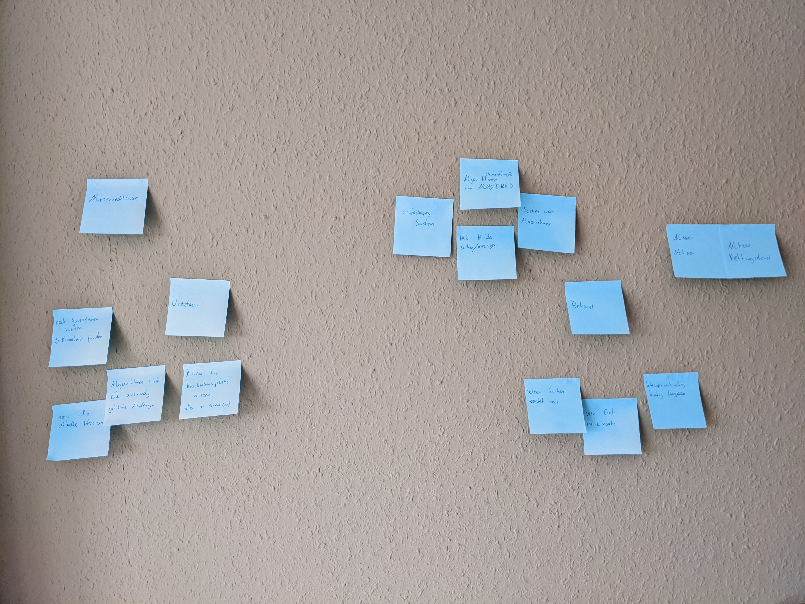
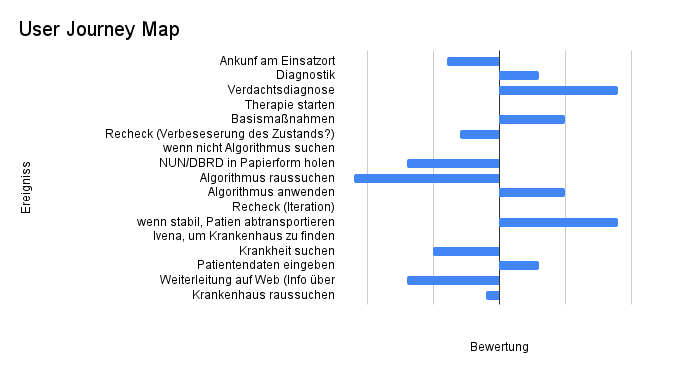
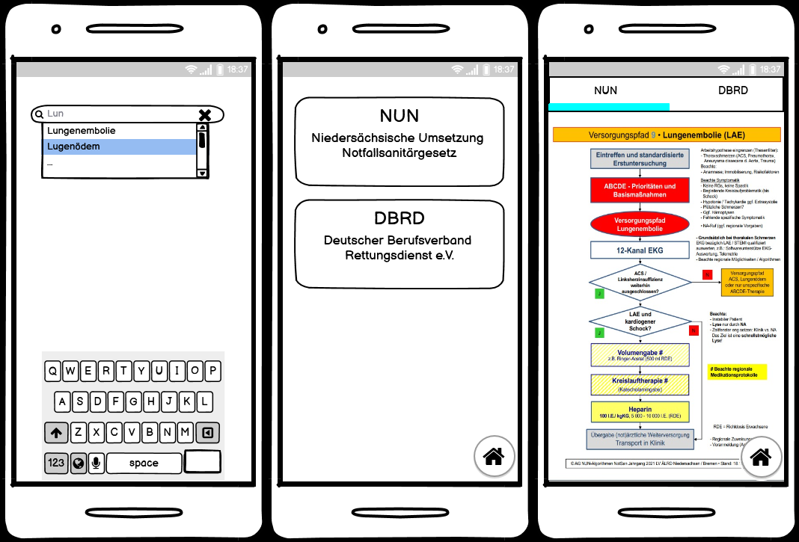
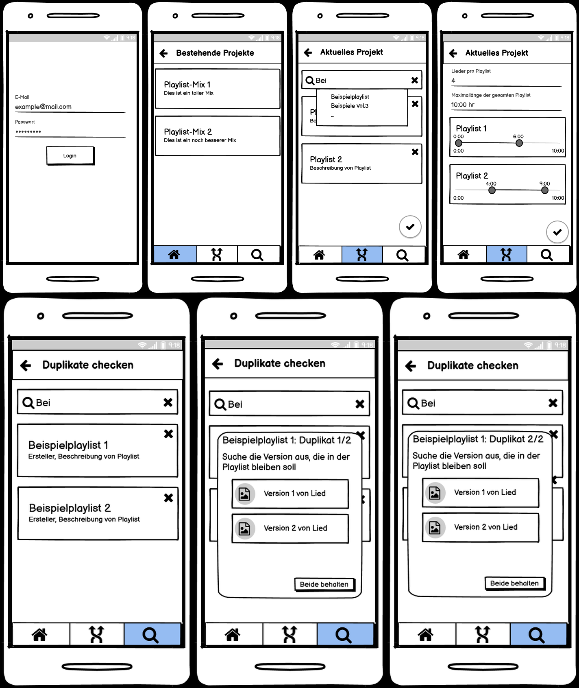

# Finn Kuhn

# Design Thinking und User Centered Design - Der Nutzer im Fokus der Entwicklung

[Doku](praktikum/kuhn/doku.md)

* Vorstellung der beiden Ansätze
* Entwicklung von zwei Projekten je nach einem Ansatz

## UCD

* wird vor allem für Entwicklung der Benutzeroberfläche genutzt
* immer wieder Feedback von Nutzern einholen und verarbeiten
* Idee für Projekt: **Erweiterungsapp für Spotify**
    * mehrere Playlisten zusammen mischen
    * ein Playlist randomisieren (um Shuffle zu umgehen)
    * potenziell weitere Funktionen (durch Nutzer einbringen)
* iterative Nutzerbefragung
    * kleine Nutzergruppe für Übersichtlichkeit und Einfachheit (10-20 Personen)
    * sowohl gezielte Fragen, als auch offene Anmerkungen
    * sinnvoller Aufbau von Feedback Teil der Recherche

## Design Thinking

* Finden von Ideen für Projekte
* Nutzen von verschiedenen Parteien im Designprozess (Domainwissen)
* Idee für Projekt: **App zur Unterstützung des Rettungsdiensts**
    * Rettungsdienst nutzt diverse PDFs, um Algorithmen zur Behandlung zu suchen und anzuwenden
    * diese in einer App zusammenfassen und mit komfortabler Suche vereinen (z.B. nach Symptomen oder Krankheiten)
    * Bekannter kann Domänenwissen liefern

## Forschungsfragen

* Welcher Ansatz hat welche Vorteile/Nachteile?
* Welcher Ansatz ist aufwendiger? (Time to production)
* In welchen Fällen ist welcher Ansatz sinnvoll?
* Lassen sich die Vorteile aus beiden Ansätzen eventuell vereinen?

## Zeitplan

| Woche |                        Ziel                         | Fortschritt |
|:-----:|:---------------------------------------------------:|:-----------:|
| KW 16 |         Einarbeiten Design Thinking und UCD         |    Done     |
| KW 17 |         Aufstellen Design Thinking Prozess          |    Done     |
| KW 18 |      Design Thinking Rettungssanitäter-Problem      |    Done     | 
| KW 19 |        Design Thinking Spotify-Erweiterungen        |    Done     |
| KW 20 | Erstellung Mockups als Ergebnis von Design Thinking |    Done     |
| KW 21 |   Erste Feedbackrunde zu Mockups als Teil des UCD   |    Done     |
| KW 22 |    Umsetzen der Mockups mit Anmerkungen in Code     |    Done     |
| KW 23 |               Feedback zu Apps (UCD)                | In Progress |
| KW 24 |           evtl. Einbauen der Anmerkungen            |             | 
| KW 25 |                       Puffer                        |             |
| KW 26 |                       Abgabe                        |             |

## Design Thinking

Design Thinking beschreibt einen Ansatz der Innovationen fördern soll, um Probleme zu lösen. Dabei liegt der Fokus immer
auf dem Nutzer und dessen Probleme, die verstanden werden müssen. Hierbei ist Design Thinking zu aller erst eine
Philosophie aus der verschiedene Methoden abgeleitet werden können.

Der Ansatz baut auf 4 Grundpfeilern auf: Prinzipien, Rahmenbedingungen, Prozess und Team. Bestimmte Prinzipien müssen
immer befolgt werden, dazu zählt zum Beispiel, dass Fehler auf jeden Fall erlaubt sind oder Teammitglieder auf Augenhöhe
kommunizieren. Bevor der eigentliche Prozess gestartet werden kann, müssen Rahmenbedingungen festgelegt werden, die
unter anderem festlegen können, wie die Zielvision aussieht oder in welchem Zeitrahmen gearbeitet wird. Bei der Bildung
eines Teams ist es wichtig darauf zu achten, dass das Team interdisziplinär ist, um möglichst viele Ansichten beachten
zu können und den Nutzer optimal verstehen zu können. Der Prozess des Design Thinkings besteht dann aus mehreren Phasen,
die je nach Lehre variieren können.

Als Beispiel wird der Prozess des Hasso Plattner Instituts vorgestellt, der aus sechs Phasen besteht.

1. Verstehen: Problem verstehen und daraus Aufgabenstellung definieren
2. Beobachten: Nutzerverhalten analysieren, daraus Hindernisse erkennen
3. Standpunkt definieren: Das Problem aus sicht der Nutzer beschreiben
4. Ideen generieren: Möglichst viele (auch unrealistische) Ideen entwickeln
5. Prototyp erstellen: Ideen konkretisieren und daraus Prototyp erstellen
6. Testen: Rückmeldungen zum Prototypen einholen und einarbeiten (Iteration)

## Projektablaufplanung

### Design Thinking Projekt 1

#### Planung

1. Kick-off:
    1. vorläufige Aufgabenstellung aufstellen: "System zur Unterstützung des Rettungsdiensts"
    2. Aufgabenstellung diskutieren und verfeinern
2. Verstehen: Problem verstehen und daraus Aufgabenstellung definieren
    1. Brainstorming
    2. User Journey Map
3. Beobachten: Nutzerverhalten analysieren, daraus Hindernisse erkennen
    1. Stilles Beobachten mit anschließendem Interview
        1. Was stört aktuell?
        2. Was funktioniert gut?
        3. Was fehlt?
    2. Direkte Auswertung
    3. Bedürfnis vs. Hürde
4. Standpunkt definieren: Das Problem aus sicht der Nutzer beschreiben
    1. Personas + extreme Nutzer
    2. neue Challenges aufstellen
    3. Challenge aussuchen
5. Ideen generieren: Möglichst viele (auch unrealistische) Ideen entwickeln
    1. Crazy 8
    2. SCAMPER
6. Prototyp erstellen: Ideen konkretisieren und daraus Prototyp erstellen Anforderungen festlegen
   1. Mockup

#### Ergebnisse

Folgend kommen die Ergebnisse aufgeteilt nach den verschiedenen Methoden die genutzt wurden.

*Aufgabenstellung verfeinern und Brainstorming*

*User Journey Map*

*Beobachten von Nutzerverhalten*

NUN-Algorithmus:

* Handy rausholen
* PDF öffnen
* Inhaltsverzeichnis nach Krankheit durchsuchen
* zur entsprechenden Seite scrollen
* Zoomen, um lesen zu können
* Hin und her scrollen, durch zoomen
* Bei Anwendung Handy immer wieder weglegen und wieder aufnehmen

Ivena:

* Ivena-App aufrufen
* Bundesland aussuchen
* PZC-Suche
* Nach Krankheit suchen und auswählen
* Welche Kategorie? Schwere der Krankheit
* Alter
* Daten müssen aktuell sein, sons kein Feedback der App
* Wenn Leitstelle nicht ausgewählt → kein Feedback der App 
* Auf PZC Nummer klicken
* Anzeige freier Kliniken
* Zoomen, um was zu erkennen
* Informationen über mögliche Behandlungen

#### Design Thinking Projekt 2

1. Kick-off:
    1. vorläufige Aufgabenstellung aufstellen: "System zur Erweiterung von Spotify"
2. Verstehen: Problem verstehen und daraus Aufgabenstellung definieren
    1. Brainstorming
    2. Sweet und Sour-Spot-Methode
3. Beobachten: Nutzerverhalten analysieren, daraus Hindernisse erkennen
    1. Interviews
        1. Was stört aktuell?
        2. Was funktioniert gut?
        3. Was fehlt?
    2. Direkte Auswertung
4. Standpunkt definieren: Das Problem aus sicht der Nutzer beschreiben
    1. Personas + extreme Nutzer
    2. neue Challenges aufstellen
    3. Challenge aussuchen
5. Ideen generieren: Möglichst viele (auch unrealistische) Ideen entwickeln
    1. Crazy 8
    2. Dot Voting
    3. 6-3-5
6. Prototyp erstellen: Ideen konkretisieren und daraus Prototyp erstellen Anforderungen festlegen
    1. Mockup

#### Mockups

#### Umfragen

Rettungsapp

https://docs.google.com/forms/d/e/1FAIpQLSfGnZMCwoO-fw1e2gWbWeUiEw60BHiz3_q21tSUpt8xUkGnPA/viewform?usp=sf_link

Spotify Erweiterung

https://docs.google.com/forms/d/e/1FAIpQLSfNBwBpVjSQmY2GZ42abWYQJEzDbBtDJ5iOm_Pl33VJzWpvpA/viewform?usp=sf_link

#### Demos

Rettungsapp

https://rettungsapp.web.app/