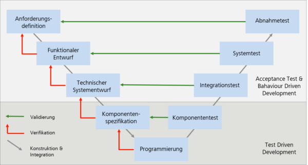

# Computergraphik (Raytracer)

## Evaluierung von Test-Driven Development

* Computergraphik (Evaluierung von Test-Driven Development in der Computergraphik anhand eines Raytracers)
	* Implementierung eines Raytracers im Test-Driven Kontext
		* Wie koennen bestimmte Bausteine getestet werden? (Schatten, Lichtbrechung, Reflektionen)
		* Wie tief sind diese Tests? (Testen von Mathematischen Funktionen? Testen von Renderergebnissen?)
		* Wie gross sind die Tests? (kleine aneinandergereite Tests? Cluster an Tests?)
		* Wie kann man bestimmte Sachen testen? (Laden von 3d Objekten, Veraendern der Scene,...)

* TDD vs. BDD vs. ATDD
	* Im Bezug auf Entwicklungen in der Computergrafik

	* TDD
		* red > green > refactor
		* write test, implement code, test code, repeat
		* developer only 
		* all tests ok > hand off tests to testers or business experts
		* same programmin language as code
		* alongside the code 
		* technical tests
		* difficult to understand for non programmers
		* helps simplify the complexity
			* large problems into smaller chunks

	* BDD (Behavior-Driven Development)
		* business experts write tests before development
		* e.g. in Gherkin
			* given, when, then 
			* can be converted into programming code by developer
		* business experts have to exactly know what they want the project to be 
		* easy to understand format 
	
	* ATDD (Acceptance-Test-Driven Development)
		* tests in collaboration with business expert, developer and tester
		* shortcut between company instances
		* being flexible to best suit the goal of the project 
		* higher level then TDD
		* but not full UI tests
		* spreading knowledge throughout team

	* Best practise might be to use positiv aspects of each of them
		* combine them
		* use given, when, then
		* software development is not about following structures
		* more about constant improvement and changing to find what works well

		
## Raytracer im Web

* OpenGL 
* WebGL
* WebGPU
	* sehr neue Technologie
	* Vorteil 
		* Verwendung der GPU
	* Nachteil
		* kann sich stetig aendern
		* Kompatibilitaet mit Browsern
* Vulcan

* JavaScript
* ams.js
* WebAssembly
* Shader 

* Vergleich Javascript und WebAssembly 
	* Implemetierung eines Raytracers 
	* Testen auf Schnelligkeit 
	* Falls Animationen moeglich > framerate vergleich
	* Offene Fragen
		* Wie genau werden die Bilder gerendert
		* Wird WebGL oder aehnliches verwendet (Javascript und WebAssembly)
		* Wird ein echter Raytracer gebaut oder ist es eine Art Hacken mit Hilfe von Shadern o.ae.
		* Wie erstellt man vergleichbare Software in verschiedenen Sprachen

