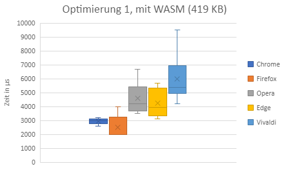
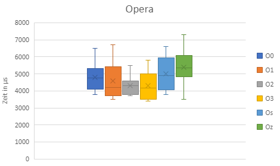

# Vergleich von Programmen kompiliert mit Emscripten und konvertiert mit Wat2Wasm anhand von einem Raytracer

## Einleitung

Grundsaetzlich werden Raytracer in der 3D-Computergrafik verwendet, um 3D-Szenen darzustellen. Der
Algorithmus von Raytracern gelten dabei als sehr zeitintensiv und werden deshalb meist auf High-End- Computern 
ausgefuert. Diese Raytracer verlassen sich fuer optimale Leistung auf dedizierte und native Bibliotheken
<a href="#/praktikum/luecking/index?id=ref_1">[1]</a>. Progamme, welche Raytracing-Algorithmen implementieren,
sind dabei meist platformabhaengig. Wenn Unternehmen von ihrer Webseite aufrufbare Services anbieten wollen,
so ist es notwendig, Renderalgorithmen o. ae. vom Browser aus auszufuehren. Ein Vorteil dieses Ansatzes
ist, dass nicht extra ein Programm gedownloaded und installiert werden muss. Es wird lediglich ein Browser 
benoetigt, welcher sich mit dem Webserver des Unternehmens verbinden kann. Durch die Verwendung von Browsern
wird die Ausfuehrung des Renderalgorithmus platform- und eventuell geraeteunabhaengig. Unternehmen koennen
so 3D-Oberflaechen und Konfigurationstools direkt aus dem Browser heraus aufrufbar anbieten. Dies kann
mehrstufige Serviceprozesse vereinfachen. Unternehmen wie beispielsweise IKEA bieten einen 3D-Moebel-Planer
direkt vom Browser aufrufbar an <a href="#/praktikum/luecking/index?id=ref_2">[2]</a>. Kunden muessen 
keine dedizierte Software herunterladen oder installieren.

Um rechenintensive Algorithmen wie beispielsweise Raytracer im Browser anbieten zu koennen, kann dieser 
beispielsweise mit Hilfe von WebAssembly angeboten werden. WebAssembly wird in Folgendem Kapitel kurz
erlaeutert. Es gibt mehrere Moeglichkeiten nach WebAssembly zu kompilieren oder zu konvertieren. Mit 
Hilfe von Emscripten kann beispielsweise C++ Quellcode implementiert und nach WebAssembly kompiliert werden.
Eine weiter Moeglichkeit ist es, das WebAssembly Text Format zu verwenden um hardwarenah zu sein. Das
WebAssembly Text Format kann mit Hilfe von Wat2Wasm konvertiert werden. In Folgenden Kapiteln werden
die Grundlagen erklaert.

### WebAssembly

WebAssembly (kurz Wasm) stellt eine Ergaenzung zu Javascript im Browser dar. WebAssembly ist ein
binaerers Instruktionsformat fuer eine stack-basierte viertuelle Maschine. Es ist als portables 
Kompilierungs-Target fuer verschiedene Programmiersprachen designed und ermoeglicht die Bereitstellung 
im Web fuer Client- und Serveranwendungen. WebAssembly versucht, mit nativer Geschwindigkeit ausgefuert
werden zu koennen, indem allgemeine Hardwarefunktionen verwendet werden, die auf einer Vielzahl von 
Plattformen verfuegbar ist. So wird eine bessere Performance erreicht, als bei auschliesslich mit 
Javascript implementierten Webseiten. WebAssembly Module koennen dabei sowohl JavaScript Module aufrufen,
als auch von diesen aufgerufen werden. Ebenfalls koennen die selben Browserfunktionalitaeten durch die
gleichen Web API's wie mit JavaScript verwendet werden.

#### WebAssembly Text Format

WebAssembly ist wie bereits beschrieben ein binaeres Instruktionsformat. Um dieses Format menschenlesbar
zu machen kann WebAssembly ebenfalls in einem Text Format ausgegeben werde. Dies dient dem Debuggen, Testen,
Optimieren und Lernen des Programms in einer lesbaren Form. Es koennen ebenfalls Programme direkt in
dem Textformat geschrieben und anschliessend mit Tools wie beispielsweise "Wat2Wasm" nach Wasm konvertiert
werden.

### Emscipten

## Forschungsfragen und Beschreibung Projekt

Im Rahmen der Forschungsarbeit sollen folgende Forschungsfragen beantwortet werden.

* Gibt es zeitliche Unterschiede in der Ausfuehrungszeit beider Raytracer?
* Gibt es zeitliche Unterschiede in der Ausfuehrungszeit bei der Verwendung verschiedener Browser?
* Wie veraendert sich die Ausfuerungszeit bei der Verwendung von Optimierungen bei Emscripten?

Zum Beantworten der Forschungsfragen sollen zwei Raytracer implementiert werden. Der erste Raytracer 
soll in C++ umgesetzt werden und mit Hilfe von Emscripten nach WASM kompiliert werden. Der zweite 
Raytracer soll direkt in WebAssembly Text Format implementiert und anschliessend mit 
Wat2Wasm nach WebAssembly konvertiert werden. Beide Raytracer sollen dabei dem gleichen Algorithmus
unterliegen, um ein Vergleichen ermoeglichen zu koennen.

## Umsetzung Raytracer in C++

Der erste Raytracer wird in C++ umgesetzt. Es wird sich an dem Buch "The Ray Tracer Challenge" orientiert
und ein Raytracer von Grund auf neu geschrieben. Das Buch beschreibt die Funktionsweise eines Raytracers
und ermoeglicht dem Leser auf eigener Art und Weise einen Raytracer selber zu entwerfen. Das Buch beschreibt
Testfaelle und ermoeglicht das Test-Driven Development des Renderalgorithmus.

Der aktuelle Stand des Raytracers ist auf Github hochgeladen und durch den folgenden Link erreichbar:

[Timl Webrays](https://github.com/Timl163/Webrays)

Der Raytracer ist zum Zeitpunkt der Abgabe nicht fertig, das Projekt wird jedoch weitergefuehrt und 
ein Raytracer komplett selbst implementiert. Ein Commit bekommt ein Label, welches den Zeitpunkt der 
Abgabe beschreibt.

Leider war das Ziel einen kompletten Raytracer von Grund auf zu implementieren zu ambitioniert und
hat in Kombination mit Emscripten weit aus laenger gedauert als vorerst geplant. Ein geeignetes
Testsystem, benoetigt fuer das Test-Driven Development, musste in das Projekt eingebaut werden. 
Das richtige Konfigurieren und der Aufbau einer passenden Buildpipeline benoetigten unter anderem viel Zeit,
bevor der eigentliche Algorithmus implementiert werden konnte. Verwendet wird das Testsystem "GoogleTest"
und wird in die Buildpipeline von Visual Studio Code eingebaut. Die Installation und der Einbau in
das vorhandene Projekt hat die meiste Zeit in Anspruch genommen. Zusaetzlich musste gelernt werden, wie
Emscripten funktioniert und verwendet werden kann. Das Konfigurieren des Canvas, welcher von Emscripten
bereitgestellt wird, und die Kommunikation zwischen C++ und JavaScript Komponenten stellte eine
weit aus groessere Huerde dar, als vorher geplant. Dies liegt an der fehlenden Expertise und der teils
unvollstaendigen Dokumentation von Emscripten.

Aus den oben genannten Problemen und der Tatsache, dass die Idee des Projekts zu ambitioniert war, wurde
sich dazu entschlossen, keinen zweiten Raytracer in WebAssembly Text Format vorzunehmen. Selbst der 
Raytracer in C++ konnte leider nicht vollstaendig implementiert werden. Dies benoetigt eine Anpassung 
des Projektthemas und der damit verbundenen Forschungsfragen, um dennoch Ergebnisse vorlegen zu koennen.
Die jetzt vorhandene Codebasis (Teil des Raytracers) soll verwendet werden, um Performancetests
durchzufuehren. Leider eleminiert die Veraenderung des Themas die Notwendigkeit, einen Raytracer zu
implementieren. Da ein Teil jedoch bereits vorhanden ist und das Projekt mit Emscipten gebaut werden kann,
wird dieser Programmcode als Grundlage der Tests verwendet. Im Folgenden werden die neuen
Forschungsfragen aufgestellt.

## Neue Forschungsfragen

Die neuen Forschungsfragen werden im Folgenden dargestellt.

* Gibt es zeitliche Unterschiede in der Ausfuehrungszeit bei der Verwendung verschiedener Browser?
* Wie veraendert sich die Ausfuehrungszeit bei der Verwendung von Optimierungen bei Emscripten?
* Wie veraendert sich die Ausfuehrungszeit wenn das Projekt ausschliesslich nach JavaScript kompiliert wird?

## Herangehensweise

Zur Messung der Zeit wird in C++ ein Objekt einer selbstgeschriebenen Klasse namens "Canvas" erstellt. Der 
Canvas speichert intern eine Menge an "Colors"; fuer jeden Pixel wird ein Objekt gespeichert. Die 
Farbobjekte beinhalten drei floating Werte fuer die Farben Rot, Gruen und Blau. Diese Werte koennen einen 
Wert zwischen 0.0 und 1.0 annehmen. Dies vereinfacht das Rechnen mit Farben. Der Canvas von Emscipten 
bzw. von Javascript verwendet jedoch Werte zwischen 0 und 255 pro Farbe. Eine Konvertierungsfunktion,
welche die Farbwerte konvertiert wird benoetigt. Diese Funktion iteriert ueber alle Farben im Canvas
und speichert den berechneten Wert wiederrum in einem neuen Array.

Fuer die Zeitmessung wird ein Canvas mit einer Groesse von 100*100 Pixeln erstellt. Anschliessend wird
die Konvertierungsfunktion aufgerufen. Die benoetigte Zeit wird mit Hilfe der C++ Bibliothek "Chrono"
gemessen und in µs auf der Konsole ausgegeben.

Um die Webseite zu hosten, wird lokal ein Pythen-Webserver gestartet. Anschliessend kann die generierte
HTML-Datei auf verschiedenen Browsern geoeffnet und die benoetigte Zeit gemessen und gespeichert werden.
Zusaetzlich wird das Programm mit verschiednen Optimierungen kompiliert und ebenfalls die benoetigt Zeit 
gemessen. Zum Schluss wird das Projekt ohne Ausgabe von WASM kompiliert und die Zeit gemessen.

Zur Evaluierung werden 5 verschieden Browser verwendet. Im Folgenden sind die Browser aufgelistet:

* Chrome
* Firefox
* Opera
* Edge
* Vivaldi

Es wird sich mit dem Websever verbunden und die kompilierte HTML-Datei geoeffnet. Die benoetigte Zeit wird
aufgeschrieben und die Seite mehrfach neu geladen. Nachdem alle Browser auf der gleichen Version getestet
wurden, wird eine neue Version (mit Optimierung) gebaut und alle Browser erneut getestet.

## Ergebnisse

Im Folgenden werden die gemessenen Ergebnisse dargestellt und erlaeutert.

# Literaturverzeichnis

1. WebRays: Ray Tracing on the Web. (2022, 20. Juni). https://link.springer.com/10.1007/978-1-4842-7185-8_18
2. IKEA - Kuechenplaner. (2022, 22. Juni). https://www.ikea.com/de/de/planners/kitchen-planner/