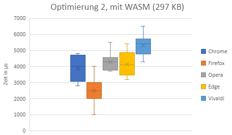
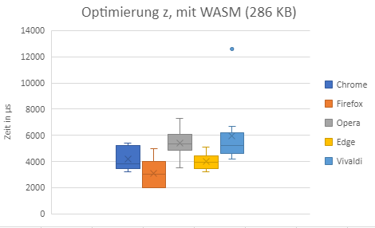
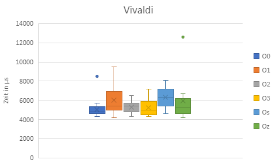

# Vergleich von Programmen kompiliert mit Emscripten und konvertiert mit Wat2Wasm anhand von einem Raytracer

## Einleitung

Grundsätzlich werden Raytracer in der 3D-Computergrafik verwendet, um 3D-Szenen darzustellen. Der
Algorithmus von Raytracern gelten dabei als sehr zeitintensiv und werden deshalb meist auf High-End- Computern 
ausgefürt. Diese Raytracer verlassen sich für optimale Leistung auf dedizierte und native Bibliotheken
<a href="#/praktikum/luecking/index?id=ref_1">[1]</a>. Progamme, welche Raytracing-Algorithmen implementieren,
sind dabei meist platformabhängig. Wenn Unternehmen von ihrer Webseite aufrufbare Services anbieten wollen,
so ist es notwendig, Renderalgorithmen o. ä. vom Browser aus auszuführen. Ein Vorteil dieses Ansatzes
ist, dass nicht extra ein Programm gedownloaded und installiert werden muss. Es wird lediglich ein Browser 
benötigt, welcher sich mit dem Webserver des Unternehmens verbinden kann. Durch die Verwendung von Browsern
wird die Ausführung des Renderalgorithmus platform- und eventuell geräteunabhängig. Unternehmen können
so 3D-Oberflächen und Konfigurationstools direkt aus dem Browser heraus aufrufbar anbieten. Dies kann
mehrstufige Serviceprozesse vereinfachen. Unternehmen wie beispielsweise IKEA bieten einen 3D-Möbel-Planer
direkt vom Browser aufrufbar an <a href="#/praktikum/luecking/index?id=ref_2">[2]</a>. Kunden müssen 
keine dedizierte Software herunterladen oder installieren.

Um rechenintensive Algorithmen wie beispielsweise Raytracer im Browser anbieten zu können, kann dieser 
beispielsweise mit Hilfe von WebAssembly angeboten werden. WebAssembly wird in Folgendem Kapitel kurz
erläutert. Es gibt mehrere Möglichkeiten nach WebAssembly zu kompilieren oder zu konvertieren. Mit 
Hilfe von Emscripten kann beispielsweise C++ Quellcode implementiert und nach WebAssembly kompiliert werden.
Eine weiter Möglichkeit ist es, das WebAssembly Text Format zu verwenden um hardwarenah zu programmieren. Das
WebAssembly Text Format kann mit Hilfe von Wat2Wasm konvertiert werden. In Folgenden Kapiteln werden
die Grundlagen erklärt.

### WebAssembly

WebAssembly (kurz Wasm) stellt eine Ergänzung zu Javascript im Browser dar <a href="#/praktikum/luecking/index?id=ref_3">[3]</a>. WebAssembly ist ein
binärers Instruktionsformat für eine stack-basierte viertuelle Maschine. Es ist als portables 
Kompilierungs-Target für verschiedene Programmiersprachen designed und ermöglicht die Bereitstellung 
im Web für Client- und Serveranwendungen. WebAssembly versucht, mit nativer Geschwindigkeit ausgefürt
werden zu können, indem allgemeine Hardwarefunktionen verwendet werden, die auf einer Vielzahl von 
Plattformen verfügbar ist. So wird eine bessere Performance erreicht, als bei auschliesslich mit 
Javascript implementierten Webseiten. WebAssembly Module können dabei sowohl JavaScript Module aufrufen,
als auch von diesen aufgerufen werden. Ebenfalls können die selben Browserfunktionalitäten durch die
gleichen Web API's wie mit JavaScript verwendet werden. <a href="#/praktikum/luecking/index?id=ref_4">[4]</a>

#### WebAssembly Text Format

WebAssembly ist wie bereits beschrieben ein binäres Instruktionsformat. Um dieses Format menschenlesbar
zu machen kann WebAssembly ebenfalls in einem Text Format ausgegeben werde. Dies dient dem Debuggen, Testen,
Optimieren und Lernen des Programms in einer lesbaren Form. Es können ebenfalls Programme direkt in
dem Textformat geschrieben und anschliessend mit Tools wie beispielsweise "Wat2Wasm" nach Wasm konvertiert
werden. <a href="#/praktikum/luecking/index?id=ref_4">[4]</a>

### Emscipten

Emscripten ist eine komplette Compilertoolchain hin zu WebAssebly. Emscripten verwendet dabei LLVM und 
setzt den Fokus auf Geschwindigkeit, Grösse und der Webplatform. In C++ programmierter Code kann
beispielsweise mit Hilfe von Emscripten übersetzt werden und passende HTML-, JavaScript- und WASM-Dateien
generiert werden. Emscripten liefert dabei beispielsweise die Möglichkeit innerhalb vom C++-Code
JavaScript-Funktionen und -Code zu definieren und aufzurufen. <a href="#/praktikum/luecking/index?id=ref_5">[5]</a>

Emscripten bietet zur Kompilierung verschiedne Optimierungsstufen an. Im Folgenden werden die 
Optimierungen kurz verdeutlicht.

* O0 - Keine Optimierung (default)
* O1 - Simple Optimierung. Während des Kompilierens wird die 'O1' von LLVM verwendet. Während des Linkens werden verschiedene JS-Assertions nicht eingeschlossen, welche bei O0 existieren würden.
* O2 - ähnlich wie 'O1', ermöglicht aber weitere Optimierungen. Während des Linkens werden ebenfalls verschiedene JavaScript Optimierungen ermöglicht.
* O3 - ähnlich wie 'O3', aber mit zusätzlichen Optimierungen, welche eventuell länger zum Ausführen benötigen.
* Os - ähnlich wie '03', aber konzentriert sich mehr auf die Codegrösse. Dies kann die Laufzeit beeinträchtigen, sowohl von WASM als auch von JavaScript.
* Oz - ähnlich wie 'Os', aber reduziert die Codegrösse noch weiter. Kann jedoch längere Ausführzeiten haben, sowohl von WASM als auch von JavaScript. <a href="#/praktikum/luecking/index?id=ref_6">[6]</a>

## Forschungsfragen und Beschreibung Projekt

Im Rahmen der Forschungsarbeit sollen folgende Forschungsfragen beantwortet werden.

* Gibt es zeitliche Unterschiede in der Ausführungszeit beider Raytracer?
* Gibt es zeitliche Unterschiede in der Ausführungszeit bei der Verwendung verschiedener Browser?
* Wie verändert sich die Ausfürungszeit bei der Verwendung von Optimierungen bei Emscripten?

Zum Beantworten der Forschungsfragen sollen zwei Raytracer implementiert werden. Der erste Raytracer 
soll in C++ umgesetzt werden und mit Hilfe von Emscripten nach WASM kompiliert werden. Der zweite 
Raytracer soll direkt in WebAssembly Text Format implementiert und anschliessend mit 
Wat2Wasm nach WebAssembly konvertiert werden. Beide Raytracer sollen dabei dem gleichen Algorithmus
unterliegen, um ein Vergleichen ermöglichen zu können.

## Umsetzung Raytracer in C++

Der erste Raytracer wird in C++ umgesetzt. Es wird sich an dem Buch "The Ray Tracer Challenge" orientiert
und ein Raytracer von Grund auf neu geschrieben <a href="#/praktikum/luecking/index?id=ref_7">[7]</a>. Das Buch beschreibt die Funktionsweise eines Raytracers
und ermöglicht dem Leser auf eigener Art und Weise einen Raytracer selber zu entwerfen. Das Buch beschreibt
Testfälle und ermöglicht das Test-Driven Development des Renderalgorithmus.

Der aktuelle Stand des Raytracers ist auf Github hochgeladen und durch den folgenden Link erreichbar:

[Timl Webrays](https://github.com/Timl163/Webrays)

Der Raytracer ist zum Zeitpunkt der Abgabe nicht fertig, das Projekt wird jedoch weitergeführt und 
ein Raytracer komplett selbst implementiert. Ein Commit bekommt ein Label, welches den Zeitpunkt der 
Abgabe beschreibt.

Leider war das Ziel einen kompletten Raytracer von Grund auf zu implementieren zu ambitioniert und
hat in Kombination mit Emscripten weit aus länger gedauert als vorerst geplant. Ein geeignetes
Testsystem, benötigt für das Test-Driven Development, musste in das Projekt eingebaut werden. 
Das richtige Konfigurieren und der Aufbau einer passenden Buildpipeline benötigten unter anderem viel Zeit,
bevor der eigentliche Algorithmus implementiert werden konnte. Verwendet wird das Testsystem "GoogleTest"
und wird in die Buildpipeline von Visual Studio Code eingebaut. Die Installation und der Einbau in
das vorhandene Projekt hat die meiste Zeit in Anspruch genommen. Zusätzlich musste gelernt werden, wie
Emscripten funktioniert und verwendet werden kann. Das Konfigurieren des Canvas, welcher von Emscripten
bereitgestellt wird, und die Kommunikation zwischen C++ und JavaScript Komponenten stellte eine
weit aus grössere Hürde dar, als vorher geplant. Dies liegt an der fehlenden Expertise und der teils
unvollständigen Dokumentation von Emscripten.

Aus den oben genannten Problemen und der Tatsache, dass die Idee des Projekts zu ambitioniert war, wurde
sich dazu entschlossen, keinen zweiten Raytracer in WebAssembly Text Format vorzunehmen. Selbst der 
Raytracer in C++ konnte leider nicht vollständig implementiert werden. Dies benötigt eine Anpassung 
des Projektthemas und der damit verbundenen Forschungsfragen, um dennoch Ergebnisse vorlegen zu können.
Die jetzt vorhandene Codebasis (Teil des Raytracers) soll verwendet werden, um Performancetests
durchzuführen. Leider eleminiert die Veränderung des Themas die Notwendigkeit, einen Raytracer zu
implementieren. Da ein Teil jedoch bereits vorhanden ist und das Projekt mit Emscipten gebaut werden kann,
wird dieser Programmcode als Grundlage der Tests verwendet. Im Folgenden werden die neuen
Forschungsfragen aufgestellt.

## Neue Forschungsfragen

Die neuen Forschungsfragen werden im Folgenden dargestellt.

* Gibt es zeitliche Unterschiede in der Ausführungszeit bei der Verwendung verschiedener Browser?
* Wie verändert sich die Ausführungszeit bei der Verwendung von Optimierungen bei Emscripten?
* Wie verändert sich die Ausführungszeit wenn das Projekt ausschliesslich nach JavaScript kompiliert wird?

## Herangehensweise

Zur Messung der Zeit wird in C++ ein Objekt einer selbstgeschriebenen Klasse namens "Canvas" erstellt. Der 
Canvas speichert intern eine Menge an "Colors"; für jeden Pixel wird ein Objekt gespeichert. Die 
Farbobjekte beinhalten drei floating Werte für die Farben Rot, Grün und Blau. Diese Werte können einen 
Wert zwischen 0.0 und 1.0 annehmen. Dies vereinfacht das Rechnen mit Farben. Der Canvas von Emscipten 
bzw. von Javascript verwendet jedoch Werte zwischen 0 und 255 pro Farbe. Eine Konvertierungsfunktion,
welche die Farbwerte konvertiert wird benötigt. Diese Funktion iteriert über alle Farben im Canvas
und speichert den berechneten Wert wiederrum in einem neuen Array.

Für die Zeitmessung wird ein Canvas mit einer Grösse von 100*100 Pixeln erstellt. Anschliessend wird
die Konvertierungsfunktion aufgerufen. Die benötigte Zeit wird mit Hilfe der C++ Bibliothek "Chrono"
gemessen und in µs auf der Konsole ausgegeben.

Um die Webseite zu hosten, wird lokal ein Pythen-Webserver gestartet. Anschliessend kann die generierte
HTML-Datei auf verschiedenen Browsern geöffnet und die benötigte Zeit gemessen und gespeichert werden.
Zusätzlich wird das Programm mit verschiednen Optimierungen kompiliert und ebenfalls die benötigt Zeit 
gemessen. Zum Schluss wird das Projekt ohne Ausgabe von WASM kompiliert und die Zeit gemessen.

Zur Evaluierung werden 5 verschieden Browser verwendet. Im Folgenden sind die Browser aufgelistet:

* Chrome
* Firefox
* Opera
* Edge
* Vivaldi

Es wird sich mit dem Websever verbunden und die kompilierte HTML-Datei geöffnet. Die benötigte Zeit wird
aufgeschrieben und die Seite mehrfach neu geladen. Nachdem alle Browser auf der gleichen Version getestet
wurden, wird eine neue Version (mit Optimierung) gebaut und alle Browser erneut getestet.

Bei der Zeitmessung sind im Hintergrund die gleichen Programme geöffnet (Visual Studio Code, Notepad++,
etc.), um mögliche Zeitabweichungen konstant zu halten. Zusätzlich ist immer nur der zu messende Browser
mit einem Tab geöffnet, um Vergleichbarkeit in den Messergebnissen zu gewährleisten.

## Ergebnisse

Im Folgenden werden die gemessenen Ergebnisse dargestellt und erläutert.

Bei der übersetzung ohne Optimierung lässt sich eindeutig erkennen, dass die gemessene Zeit von
Firefox am geringsten ist. Dabei muss erwähnt werden, dass Firefox als einziger Browser nur Zeiten
mit Millisekunden-Genauigkeit ausgegeben hat. Alle anderen Browser waren bei gleicher Codebasis in 
der Lage, mindestens in zehntel Millisekunden- bzw. in 100 µs Schritten anzugeben, wie lange die Ausfürung
gedauert hat. Chrome ist mit einer relativ konstanten Ausführungsdauer der zweitschnellste Browswer bei
der Ausführung. Die restlichen drei Browser verhielten sich vergleichsweise schnell, Vivaldi hingegen
benötigte bei einer Ausführung ca. 8,5 ms, was als Ausrutscher gewertet wird.

Bei der Version, die mit O1 optimiert wurde, lassen sich Unterschiede in den Ausführungszeiten 
feststellen. Die Ausführungszeit mit Chrome verbessert sich, wobei die Ausführungszeit mit Firefox
sich marginal verbessert. Die Ausführzeit mit Opera variiert stärker, bleibt im Durchschnitt gleich.
Bei Edge verbessert sich der Durchschnitt, die Ausführungszeit weist jedoch eine grössere Varianz auf.
Die Ausführzeit mit Vivaldi verschlechtert sich bei der ersten Optimierung. Es werden Zeiten von bis zu
9500 µs erreicht.

Bei Optimierung O2 vergrössert sich die Varianz bei der Ausführung mit Chrome. Bei den weiteren
Browsern ist keine starke Verbesserung oder Verschlechterung festzustellen. Firefox führt das gegebene
Programm weiterhin als schnellster Browser aus.

Zwischen Optimierung O3 und O2 ist kein deutlicher Unterschied in der Ausführdauer festzustellen.
Grundsätzlich lässt sich sagen, dass alle Browser im Durchschnitt minimal langsamer geworden sind.
Firefox ist weiterhin der schnellste Browser, gefolgt von Chrome. Vivaldi stellt aus der Auswahl an
Browsern den Langsamsten in diesem Szenario dar.

Bei der Optimierung Os lässt sich feststellen, dass alle Browser langsamere Ausführzeiten besitzen.
Die Rangfolge bleibt jedoch gleich.

Die letzte Optimierungsstufe Oz erhöht bei allen Browsern die Ausführzeit des Progamms. Vivaldi fällt
am meisten auf mit einem Ausrutscher bei über 12 ms.

Im Folgenden werden die Ausführzeiten von jedem Browser abhängig der Optimierungsstufe dargestellt.

Bei Chrome ist zu erkennen, dass O1 eine Verbesserung der Laufzeit ermöglicht. Danach steigt die 
Ausführungszeit stark an. Die Varianz steigt ebenfalls mit steigender Stufe; die Ausführzeiten schwanken
stark.

Firefox bietet bei verschiedenen Optimierungsstufen ähnliche geringe Ausführzeiten. Die fehlende
Schwankung kann durch die Beschränkung der Messung erklärt werden. Wie bereits oben erwähnt, 
lässt Firefox nur eine Zeitmessung in Millisekunden-Intervallen zu.

Bei den Ausführungszeiten von Opera lässt sich feststellen, dass die ersten beiden Optimierungsstufen
die Ausführzeit verringert. O3 fürht im Durschschnitt zu einer ähnlichen Ausführzeit. Die beiden
Optimierungen Os und Oz vergrössern die Zeit erneut.

Die Ausführungszeit bei Edge bleibt nach Optimierungen relativ konstant. Man erkennt eine leichte 
Verbesserung der Zeit bei O1 und O2. Ab O3 verlängert sich die Ausführungszeit marginal.

Die Optimierungen von Emscripten verschlechtern ausschliesslich die Ausführungszeiten bei dem Browser
Vivaldi. Die Varianz steigt und mehrere Ausreisser sind bei der Ausführungszeit vorhanden. Grundsätzlich
ist Vivaldi in diesem Test der langsamste Browser aus der Auswahl.

Zum Schluss werden die Ausführungszeiten gemessen, wenn von Emscripten kein WASM generiert werden soll.
Emscripten erstellt dann ausschliesslich JavaScript und HTML.

Es ist deutlich zu sehen, dass das gleiche Programm, welches nur in Javascript ausgefürt wird, deutlich
langsamer auf allen Browsern läuft. Der Browser Chrome ist bei der Ausführunszeit von durchschnittlich
über 32 ms ahnlich langsam wie der Browser Vivaldi. Firefox ist dabei mit Abstand der schnellste der 
ausgewahlten Browser und benötigt für das Programm ca. 13 ms im Durchschnitt. Firefox' Ausführungszeiten
sind dabei sehr konstant im Gegensatz zu den anderen Browsern.

Die Optimierungsstufen verringert ebenfalls die Dateigrösse. Das gebaute Projekt ohne Optimierung ist 
489 KB gross. Die Grösse nimmt mit jeder Optimierungsstufe ab. Bei Oz sind die Dateien insgesamt 289 KB
gross. Wenn das Projekt komplett ohne WASM kompiliert wird, ist die Dateigrösse um ein Vielfaches auf
insgesamt 1,84 MB gestiegen.

Grundsätzlich lässt sich sagen, dass Firefox in jedem Test der schnellste Browser ist. Jedoch lässt 
Firefox trotz gleichen Programmcode keine genauere Zeitmessung zu als in Millisekunden-Intervallen. Dies
kann zum Beispiel daran liegen, dass intern bei der Auswertung des WASM eine andere Funktion zum Auslesen
der aktuellen Zeit verwendet wird. Bei den meisten Browsern führen die Optimierungen zu einer Verkürzung
der Ausfürzeit. Wie in der Dokumentation von Emscripten beschrieben, werden ab O3 die Dateigrössen
optimiert. Dies kann dabei zu einer erhöhten Ausführdauer führen. Der Browser Vivaldi hingegen
wies bei dem optimierten Code keinerlei Zeitersparnisse auf; Im Gegenteil, die Ausführdauer verlängerte
sich teils. Der kompilierte Code mit WASM ist schneller als der Code, welcher nach der Kompilierung nur 
aus JavaScript und HTML besteht.

## Zusammenfassung

Verschiedene Browser werden auf die Geschwindigkeit bezüglich der Ausführung von WebAssembly getestet.
Dazu wird ein Teil eines Raytracers in C++ implementiert und ein Algorithmus ausgefürht, welcher
eine bestimmte Datenmenge konvertiert. Das Projekt wird mit Emscripten kompiliert und mit Hilfe eines
lokalen Webservers von verschiedenen Browsern aufgerufen. Nach dem Aufruf, wird die benötigte Zeit 
auf der Konsole ausgegeben. Nach dem Testen aller Browser mit einer Codebasis, wird eine andere 
Optimierungsstufe bei der Kompilierung ausgewählt, das Projekt erneut gebaut und erneut mit allen 
ausgewählten Browsern geöffnet.

Es stellt sich heraus, dass Firefox mit Abstand die kürzeste Ausführungszeit des Tests hat. Verschiedene
Optimierungsstufen verbessern die Ausführungszeit nicht stark, lediglich die Stufen Os und Oz verlängern
die Ausführungszeit marginal. Der zweitschnellste Browser ist Chrome. Optimierungen verringern 
die Ausführdauer. Die Stufe O1 verkleinert die Ausführdauer, die weiteren Stufen (O2, O3, Os, Oz) steigern
hingegen die benötigt Zeit. Der Browser Vivaldi stellt den langsamsten Browser im Test dar. Alle
Optimierungsstufen verlängern die Ausführungszeit. Auffällig sind bei Vivaldi ebenfalls die starken
Ausreisser. Vergleicht man die benötigte Zeit des Projekts mit der Verwendung von WASM mit einer 
gebauten Version des Projekts ohne WASM bzw. ausschliesslich JavaScript lässt sich eine Vergrösserung
der Dateigrösse feststellen. Des Weiteren benötigt die JavaScript-Version ein vielfaches der Zeit, die
die WASM-Version für den gleichen Code benötigt.

# Literaturverzeichnis

1. WebRays: Ray Tracing on the Web. (2022, 20. Juni). https://link.springer.com/10.1007/978-1-4842-7185-8_18
2. IKEA - Küchenplaner. (2022, 22. Juni). https://www.ikea.com/de/de/planners/kitchen-planner/
3. Was ist WebAssembly. (2022, 29. Juni). https://www.dev-insider.de/was-ist-webassembly-a-912337/
4. WebAssembly. (2022, 29. Juni). https://webassembly.org/
5. Main — Emscripten 3.1.9-git (dev) documentation. (2022, 29. Juni). https://emscripten.org/index.html
6. Emscripten Compiler Frontend (emcc) — Emscripten 3.1.9-git (dev) documentation. (2022, 29. Juni). https://emscripten.org/docs/tools_reference/emcc.html#emcc-os
7. The Ray Tracer Challenge. The Programatic Programmer. (2019). ISBN 978-1-68050-271-8