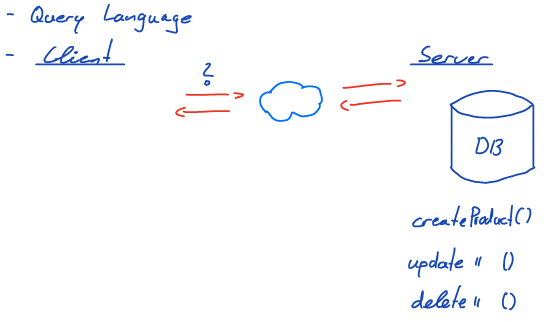
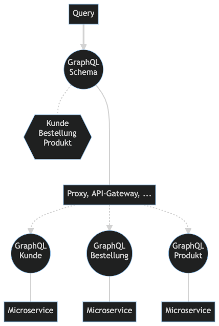

# GraphQL

## Inhalt

- [Paradigma](#paradigma)
- [Datenformat](#datenformat)
- [Schnittstellenbeschreibung](#schnittstellenbeschreibung)
- [Vorläufiges Fazit](#vorläufiges-fazit)

## Paradigma



## Datenformat

- Verwendet als Datenformat JSON oder graphql für Anfragen
  - Wird im Content-Type festgelegt.

POST /shop-test HTTP/1.1  
Content-Type: application/graphlql

```graphql
{
  products(name: "Test") {
    name
    price
  }
}
```

- Antwort immer in JSON

HTTP/1.1 200 Ok  
Content-Type: application/json

```json
{
  {
    "data": {
      "products": [
        {
          "name": "Test",
          "price": 99.99
        }
      ]
    }
  }
}
```

- Keine Unterstützung für binäre Daten
  - Lassen sich Base64 codiert versenden
  - Nachteil: Base64 ist immer größer als die jeweilige Datei (ca. 30%)
  - Bilder können als Verweis(Link) versendet werden

## Schnittstellenbeschreibung

Die Schnittstelle wird in GraphQL mit einem Schema beschrieben.

_graphql schema_

```graphql
type Product {
  id: ID!
  name: String!
}

input ProductIn {
  name: String!
}

type Query {
  product(id: ID!): Product
  products: [Product!]!
}

Type Mutation {
  createProduct(product: ProductIn!): Product!
}
```

- Mit Hilfe des Schemas können alle möglichen Informationen über die Schnittstelle gewonnen werden.
- Schemas können leicht als Graph visualisiert werden. Beispiele: [GraphQL Voyager](https://apis.guru/graphql-voyager/)
- Aus den Schemas lässt sich Code für den Client (React, Vue, Angular, ...) und den Server(Node.js, .NET, Java, ...) generieren. [GraphQL Code Generator](https://www.graphql-code-generator.com/)

### Typ-System Schema

- Einfache Typen

  - Int
  - String
  - Float
  - Boolean
  - ID

- Zusammengesetzte
  - Objekte
  - Enumeration
  - Interfaces
  - Unions

### Schemas und Microservices

Die Schnittstellenbeschreibung mit Schemas, eignet sich sehr gut für Microservices



## Vorläufiges Fazit

Vorteile:

- Format ist vorgegeben
- Type - System
- ausführliche Schnittstellenbeschreibung
- Eignet sich gut für Microservices

Nachteile:

- Nur JSON wird zurückgegeben
- Fehlende Unterstützung für binäre Daten
