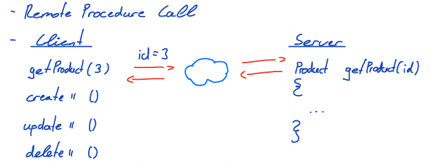
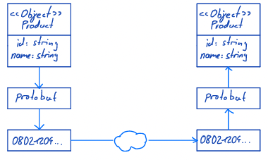

# gRPC

## Inhalt

- [Paradigma](#paradigma)
- [Datenformat](#datenformat)
- [Schnittstellenbeschreibung](#schnittstellenbeschreibung)
- [Vorläufiges Fazit](#vorläufiges-fazit)

## Paradigma



## Datenformat

- Die Daten werden mit Hilfe des protobuf Frameworks übermittelt.

- Das Framework serialisiert die Daten.

- Die serialisierten Daten können einfach über das Netz übertragen werden.



### Types


### decoding


- Vorteile gegenüber JSON

  - Nachrichten sind kompakter
  - Nachrichten sind nicht lesbar (Beschreibung der Nachricht wird zum lesen benötigt)

### Versionierbarkeit

```protobuf
Version 1

message Product {
  int32 id = 1;
  string name = 2;
  string color = 3;
}
```

```protobuf
Version 2

message Product {
  int32 id = 1;
  string name = 2;
  float price = 4;
}
```

Feldnummern ändern sich nicht. (siehe string color = 3; / float price = 4;)  
Nachrichten lassen sich so sehr einfach von Version 1 auf Version 2 mappen. Dies wird vom Framework automatisch gemacht.

### Übertragung von binären Daten zum Beispiel Bilder

```protobuf
message Image {
  bytes image = 1;
}
```

Nachteile:

- Komplettes Bild wird übertragen
- Ressourcenverbrauch
- Performanz

Stückweise Übertragung ist mit etwas Mehraufwand möglich.

- Stream Blöcke

## Schnittstellenbeschreibung

Die Schnittstelle wird in gRPC über proto Dateien beschrieben.

_proto Datei_

```protobuf
service ProductService {
  rpc Create(Product) returns (Id) {}
  rpc Get(Id) returns (Product) {}
}

message Id {
  int32 id = 1;
}

message Product {
  int32 id = 1;
  string name = 2;
  float weight = 3;
}
```

Der proto Compiler kann aus den Dateien verschiedene Vorlagen für Clients und Server erstellen.

_Beispiel GO Client und JAVA Server_


Dadurch dass die Feldnummern in den proto Dateien nicht verändert werden dürfen entsteht eine gute Kompatibilität zwischen den verschiedenen Schnittstellenversionen.

- Typen dürfen vertauscht werden solange kein **Overflow** entsteht
- Namen dürfen geändert werden, da intern nur die Feldnummern benutzt werden
- **Wichtig** Feldnummern dürfen gelöscht, aber später nicht wieder verwendet werden

## Vorläufiges Fazit

Vorteile:

- Effizient
- Serialisierung übernimmt protobuf
- Type - System
- Language Mapping (Java, c++, Go, ...)
- Versionierbarkeit

Nachteile:

- Komplex
- Lesen geht nur mit Formatbeschreibung
