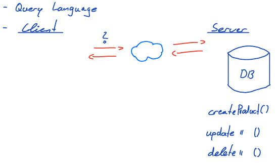
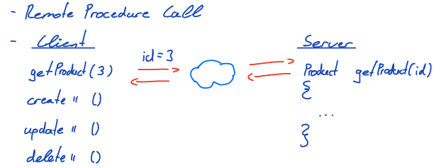

# Kevin Ratschinski

## Thema: Vergleich von verschiedenen Architekturstilen für eine Programmierschnittstelle

- Technologien: **GraphQL**, **REST** und **gRPC**

  Mittels GraphQL, REST und gRPC können Client und Server miteinander kommunizieren. Für den Transport verwenden alle drei Technologien das HTTP Protokoll. Abgesehen von dieser Gemeinsamkeit, sind die drei Technologien grundverschieden. Während des Praktikums soll ermittelt werden, für welche Einsatzgebiete die verschiedenen Technologien am besten geeignet sind.

- Paradigmen

  - GraphQL

    

  - REST

  

  - gRPC

  

- Einsatzgebiete für die verschiedenen Technologien ermitteln.  
  Was eignet sich am besten für API`s, Microservices, Webanwendungen und Mobile Apps?

- Metriken:

  - Performanz
  - Skalierung
  - Effizienz
  - Implementationsaufwand
  - Security
  - Versionierbarkeit

- Nächste Schritte:

  - Einarbeitung in die verschiedenen Technologien

  - Testfälle für die Metriken erstellen

  - Verschiedene Architekturen mit den unterschiedlichen Technologien aufbauen

  - Auf Grundlage der Architekturen werden verschiedene Tests durchgeführt, um die Unterschiede festzustellen

  - Konkretes Ergebnis anhand der ermittelten Werte
