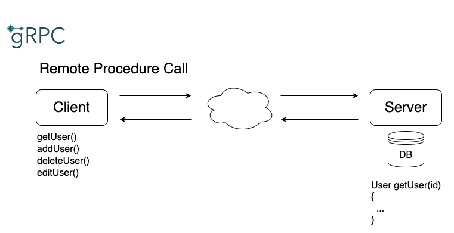
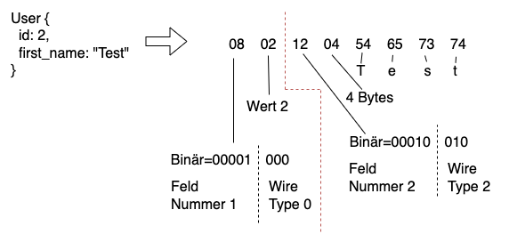

# Vergleich von verschiedenen Architekturstilen für eine Programmierschnittstelle

# Einführung in die verschiedenen Technologien

- Technologien: **gRPC**, **GraphQL** und **REST**

  Mittels gRPC, GraphQL und REST werden Programmierschnittstellen entwickelt, damit Client und Server miteinander kommunizieren können. Für den Transport verwenden alle drei Technologien das HTTP Protokoll. Abgesehen vom Transportprotokoll, sind die drei Technologien grundverschieden und bieten alle unterschiedliche Konzepte, um eine Kommunikation zwischen Client und Server zu ermöglichen.  
  Während des Praktikums soll ermittelt werden, für welche Einsatzgebiete die verschiedenen Technologien am besten geeignet sind.

## gRPC


Abbildung 1 - gRPC Paradigma
(Quelle: gRPC Logo https://grpc.io/)

gRPC ist ein von Google entwickeltes Open-Source-Framework für Remote Procedure Calls (RPC). Remote Procedure Calls sind entfernte Funktionsaufrufe, die über verschiedene Systeme hinweg ausgeführt werden können. Laut des Unternehmens ist es ein hochperformantes und leichtgewichtiges Kommunikationsprotokoll, das über allen bekannten Betriebssystemen hinweg funktioniert .gRPC basiert auf dem HTTP/2 Standard und benutzt zum Versenden der Daten das "Protocol Buffers" Datenformat, welches ebenfalls von Google entwickelt wird. Viele bekannte Unternehmen wie Netflix, Square oder Cisco stützen ihre interne Kommunikation auf das API-Framework. <a href="#/praktikum/ratschinski/index?id=ref_1">(gRPC, 2022)</a>

## GraphQL


Abbildung 2 - GraphQL Paradigma
(Quelle: GraphQL Logo https://graphql.org/brand/)

GraphQL wurde 2015 von Meta, ehemals Facebook, für die eigene Facebook-API veröffentlicht und ist die Spezifikation einer plattformunabhängigen Abfragesprache für APIs. Mit GraphQL können vom Client genau definierte Abfragen an den Server gestellt werden. Die Abfrage wird anschließend vom Server verarbeitet und die Antwort zum Client zurückgesendet. Besonders an GraphQL ist, dass die API nicht für jedes Objekt einen eigenen Endpunkt, den der Client für die entsprechende Ressource ansprechen kann, zur Verfügung stellt. Vielmehr stellt die API nur einen einzigen Endpunkt zur Verfügung, über den der Client mit Queries lesende oder mittels Mutationen schreibende Operationen durchführen kann. <a href="#/praktikum/ratschinski/index?id=ref_2">(GraphQL, 2022)</a>

## REST


Abbildung 3 - REST Paradigma

REST steht für _Representational State Transfer_. Es handelt sich dabei nicht um eine konkrete Technologie, sondern um einen Architekturstil oder ein Programmierparadigma, das 2000 von Roy T. Fielding in seiner Dissertation konzipiert wurde <a href="#/praktikum/ratschinski/index?id=ref_3">(T. Fielding, 2000)</a>.  
REST basiert auf der Architektur des World Wide Web. Daten werden als Ressourcen gesehen und können über eine eindeutige Adresse (URI) identifiziert werden. Der Client stellt über die verschiedenen HTTP-Methoden entsprechende Anfragen an die gewünschte Ressource und der Server liefert eine entsprechende Antwort zurück.

# Datenübertragung

## gRPC

Für die Datenübertragung in gRPC, wird das protobuf Framework verwendet. Mithilfe des Frameworks können die Daten serialisiert und anschließend über das Netzwerk, zwischen Client und Server, ausgetauscht werden. _protobuf_ ist dabei unabhängig von der Wahl der Programmiersprache, welcher ein Client und ein Server verwendet. Eine Nachricht lässt sich beispielsweise mit C++ erzeugen und kann mit Go eingelesen werden.
Nach der Serialisierung werden die Bytes über das Netzwerk verschickt und auf der Seite des Empfängers deserialisiert.


Abbildung 4 - protobuf Daten versenden

Für die Deserialisierung beim Empfänger wird die Schnittstellenbeschreibung benötigt, in der Schnittstellenbeschreibung sind alle wesentlichen Merkmale enthalten, damit Client und Server die Daten austauschen können.  
Die Abbildung zeigt, wie ein User decodiert wird. Das erste Byte wird in eine Feldnummer und den Wire Type aufgeteilt (siehe Abbildung 6). Im Beispiel handelt es sich bei der _id_, um die Feldnummer 1 und den Wire Type 0. Das zweite Byte gibt den Wert 2 der _id_ an.  
Würde der Wert der _id_ größer als 128 sein, müssten weitere Bytes mit hinzugenommen werden. Somit lassen sich in protobuf auch größere Zahlen abbilden.  
Die restlichen Bytes beschreiben den Vornamen des Users. Das erste Byte wird wieder in Feldnummer(2) und in Wire Type(2) aufgeteilt. Das zweite Byte gibt die Länge der Bytes an und die restlichen Bytes bilden die direkten Werte ab.

  
Abbildung 5 - gRPC Decoding


Abbildung 6 - gRPC Wire Types
(Quelle: https://developers.google.com/protocol-buffers/docs/encoding)

Ein Vorteil einer solchen Übertragung in Bytes liegt in der Nachrichtengröße. Daten lassen sich deutlich kompakter versenden als, wenn man zum Beispiel ein reines JSON-Format versenden würde. Zudem bietet sich noch ein Sicherheitsaspekt dadurch, dass sich die Daten ohne die passende Schnittstellenbeschreibung nicht interpretieren lassen.

## GraphQL

Für die Datenübertragung wird bei GraphQL das JSON-Format oder das _graphql_-Format verwendet. Welches Format verwendet wird, wird im Content-Type des HTTP-Request festgelegt. Für die Übermittlung der Daten werden in GraphQL nur die HTTP-Methoden GET und POST eingesetzt. In der Regel wird überwiegend die POST Methode für die Kommunikation verwendet. Alle relevanten Informationen zu einem Request, ob nun Query oder Mutation, können innerhalb des Payloads eines Post Requests gehalten werden. Mit der GET Requests lassen sich bei GraphQL nur Queries abbilden. Ein weiterer Nachteil ist noch, dass die Query dabei als URI-Parameter des Requests angeben werden muss. Das reduziert deutlich die Lesbarkeit der Queries.

POST /test HTTP/1.1  
Content-Type: application/json

```json
{
   "query": "{
     user(id:1) {
       id first_name last_name email messages{
         id text userId
        }
      }
    }"
}
```

POST /test HTTP/1.1  
Content-Type: application/graphlql

```graphql
{
  user(id: 1) {
    id
    first_name
    last_name
    email
    messages {
      id
      text
      userId
    }
  }
}
```

---

Die Antworten der Queries und Mutationen, erfolgen immer im JSON-Format. Die Daten werden im Payload des Response zurückgesendet und können sowohl die Antworten oder auch Fehlermeldungen enthalten.

HTTP/1.1 200 Ok  
Content-Type: application/json

```json
{
  "data": {
    "user": {
      "id": "1",
      "first_name": "Markos",
      "last_name": "O'Sirin",
      "email": "mosirin0@vk.com",
      "messages": []
    }
  }
}
```

## REST

  
Abbildung 7 - REST Datenübertragung

Die Datenübertragung in REST erfolgt in der Regel über das HTTP-Protokoll. Mit den verschiedenen HTTP-Methoden (GET, POST, PUT, DELETE, ...) können die Ressourcen, über zuvor festgelegte URIs angesprochen werden. Ressourcen bilden die zentrale Abstraktion im REST-Architekturstil. Sie sind eindeutig identifizierbar und die Interaktion mit ihnen erfolgt immer über den Austausch von Repräsentationen <a href="#/praktikum/ratschinski/index?id=ref_4">(Tilkov et al., 2015, S. 52)</a>. Das Datenformat, wie die Daten ausgetauscht werden sollen, ist in REST nicht vorgeschrieben und kann beliebig im Content-Type des HTTP-Request festgelegt werden (JSON, XML, IMAGE, PDF, CSV, ...).

## Zusammenfassung Datenübertragung

|                   |   gRPC   |    GraphQL     |         REST         |
| ----------------- | :------: | :------------: | :------------------: |
| **Datenformat**   | protobuf | JSON / graphql |       Beliebig       |
| **Dokument Stil** |    ❌    |       ✅       | Ja bei JSON oder XML |
| **Effizienz**     |    ✅    |       -        |          -           |
| **Komplexität**   |   hoch   |     gering     |        mittel        |
| **Abstraktion**   |   hoch   |     mittel     |        gering        |

# Schnittstellenbeschreibung

Ein wichtiger Aspekt bei der Auswahl der Technologie ist die Schnittstellenbeschreibung. Mithilfe der Beschreibung weiß ein Client, welche Funktionen die Schnittstelle anbietet, welche Nachrichtenformate erwartet und welche Fehler bei der Übertragung auftreten können. Außerdem bietet eine Beschreibung noch eine Reihe weiterer Vorteile:

1. Aufrufe erleichtern
   - Durch die Beschreibung weiß der Client welche, Aufrufe er durchführen kann.
2. Entwicklung Client und Server
   - Eine Beschreibung kann, mit der Hilfe eines Codegenerators, direkt in Client oder Servercode übersetzt werden, was die Entwicklung der Schnittstelle vereinfacht.
3. Einhaltung eines Vertrages
   - Die Schnittstellenbeschreibung schreibt vor, wie sich Client und Server während der Kommunikation zu verhalten haben und welche Bedingungen erfüllt werden müssen, damit ein Aufruf erfolgreich ist.
4. Erzeugung von Dokumentationen
   - Aus einer Schnittstellenbeschreibung lässt sich oft direkt eine Dokumentation in z. B. einem HTML-Format erstellen
5. Validierung von Nachrichten
   - In einer Schnittstellenbeschreibung wird festgelegt, welche Datentypen und Nachrichtenformate von der Schnittstelle akzeptiert werden.
6. Vergleich von API Versionen (Kompatibilität)
   - Mithilfe einer Beschreibung lässt sich die aktuelle Version eine API festhalten. So lassen sich auch verschiedene Versionen einer API einfach auf Kompatibilität testen.
7. Qualitätssicherung
   - Schnittstellenbeschreibungen lassen sich automatisiert überprüfen, somit lässt sich direkt feststellen, ob zuvor festgelegte Qualitätsregeln eingehalten wurden.

## gRPC

Die Schnittstelle wird in gRPC über _proto_ Dateien beschrieben. Zuerst wird der Service definiert und beschrieben, welche Funktionen er anbietet. Danach werden alle Messagetypen definiert, welche in dem Service verwendet werden.  
Jeder Typ eines Messagetypes bekommt eine eigene Feldnummer und eine Beschriftung. Die Feldnummern werden intern von protobuf, für die Kommunikation, verwendet und ermöglichen zusätzlich noch eine Versionierung der Schnittstelle. Bei den Typen unterscheidet man zwischen zusammengesetzten und einfachen Typen. Um ein Array in protobuf abzubilden, muss das Schlüsselwort _repeated_ vor den jeweiligen Typ gesetzt werden. Mit dem Typsystem, welches von protobuf mitgeliefert wird, lassen sich komplexe und große Schnittstellen einfach beschreiben.

|                Einfache Typen                | Zusammengesetzte Typen |
| :------------------------------------------: | :--------------------: |
|                double, float                 |        Message         |
| int32, int64, uint32, uint64, sint32, sint64 |          Enum          |
|     fixed32, fixed64, sfixed32, sfixed64     |                        |
|                     bool                     |                        |
|                    string                    |                        |
|                    bytes                     |                        |

<a href="#/praktikum/ratschinski/index?id=ref_6">(proto Typen, 2022)</a>

Beispiel: gRPC Schnittstelle

```protobuf
syntax = "proto3";

service UserService {
  rpc GetUser(Id) returns (User) {}
  rpc GetAllUsers (Empty) returns (UserList) {}
  rpc AddUser(User) returns (Id) {}
  rpc DeleteUser (Id) returns (Empty) {}
  rpc EditUser (User) returns (User) {}
  rpc GetMessage(Id) returns (Message) {}
  rpc GetAllMessages (Empty) returns (MessageList) {}
  rpc GetUserMessages (Id) returns (MessageList) {}
  rpc AddMessage(Message) returns (Id) {}
  rpc DeleteMessage (Id) returns (Empty) {}
  rpc EditMessage (Message) returns (Message) {}
}

message User {
  int64 id = 1;
  string first_name = 2;
  string last_name = 3;
  string email = 4;
}

message Message {
  int64 id = 1;
  string text = 2;
  int64 userId = 3;
}

message Id {
  string id = 1;
}

message Empty {}

message UserList {
  repeated User users = 1;
}

message MessageList {
  repeated Message messages = 1;
}
```

Der _protobuf_ Compiler kann anschließend aus der Schnittstellenbeschreibung verschiedene Vorlagen für Client und Server generieren. Dabei werden von _protobuf_ eine Vielzahl von Programmiersprachen unterstützt.

- C#
- C++
- Dart
- Go
- Java
- Kotlin
- Node
- Objective-C
- PHP
- Python
- Ruby

<a href="#/praktikum/ratschinski/index?id=ref_7">(gRPC languages, 2022)</a>

Beispiel: GO Client und JAVA Server
  
Abbildung 8 - protobuf Codegenerierung

## GraphQL

Die Schnittstelle wird in GraphQL über das GraphQL-Schema beschrieben. Das GraphQL-Schema ist eine Definition der aufrufbaren Daten, ihres Typs, ihrer Relationen sowie deren möglichen Zugriffe zur Manipulation. Das Schema legt die genaue Datenstruktur fest, gegen die eingehende Anfragen validiert werden. Entspricht eine Anfrage dem Schema, wird sie weiter verarbeitet. Das erfolgt, indem GraphQL die Anfrage zerteilt und einzelnen _Resolvern_ übergibt, welche die Anfrage auflösen und ein Ergebnis kumuliert zurücksenden.

Das GraphQL-Schema liefert alle möglichen Informationen über eine Schnittstelle. Aus dem Schema lässt sich erkennen, welche Werte abgefragt werden können und welche Werte sich manipulieren lassen. Durch den Graphenansatz kann ein Schema auch einfach als Graph visualisiert werden <a href="#/praktikum/ratschinski/index?id=ref_8">(GraphQL Voyager, 2022)</a>.

Wie bereits in gRPC, lässt sich auch in GraphQL über die Schnittstellenbeschreibung direkt Code für den Client oder Server generieren <a href="#/praktikum/ratschinski/index?id=ref_9">(GraphQL Code Generator, 2022)</a>.

Beispiel: GraphQL-Schema

```graphql
type Query {
  users: [User!]
  user(id: ID!): User
}

type Mutation {
  createUser(first_name: String!, last_name: String!, email: String!): User!
  updateUser(
    id: ID!
    first_name: String
    last_name: String
    email: String
  ): User!
  deleteUser(id: ID!): Boolean!
}

type User {
  id: ID!
  first_name: String!
  last_name: String!
  email: String!
  messages: [Message!]
}
```

### Typ-System GraphQL-Schema

GraphQL hat ein sehr umfangreiches Typsystem, welches sich aus den folgenden Punkten zusammensetzt:  
<a href="#/praktikum/ratschinski/index?id=ref_10">(GraphQL-Schema, 2022)</a>

1. **Objekt-Typen**

   Die grundlegendsten Komponenten eines Schemas sind die Objekt-Typen, die ein einfaches Objekt repräsentieren.

   ```graphql
   type Product {
     name: String
     category: Category
   }

   type Category {
     name: String
   }
   ```

   Der kurze Code repräsentiert einen Einstiegspunkt der API auf das Objekt _Product_ und _Category_, über den die Daten der Objekte abrufbar sind.

2. **Parameter**

   Jedes Feld eines Objektes können zusätzlich noch Parameter übergeben werden, welche die Rückgabewerte einer Query verändern können. Parameter können dabei optional oder erforderlich sein.

   ```graphql
   type Product {
     name: String
     price: (unit: Currency = EUR): Float
   }
   ```

   In dem Beispiel kann bei einer Query der Parameter unit mitgeben werden, das den Wert des Feldes in einer gewünschten Währung zurückgibt (default = EUR).

3. **Skalar-Typen**

   Jedes Objekt hat Namen und Felder, am Ende einer Abfrage muss aber jedes Feld in einen konkreten Datentyp aufgelöst werden. Diese Datentypen sind in GraphQL die Skalar-Typen. Die möglichen Skalar-Typen von GraphQL sind:

   - Int: Eine positive oder negative 32-Bit-Ganzzahl
   - Float: Eine positive oder negative Gleitkommazahl
   - String: Eine UTF-8-Zeichenkette
   - Boolean: ein binärer Datentyp mit den möglichen Werten _true_ oder _false_
   - ID: Eine eindeutige Identifikation eines Objektes

   In den meisten Implementierungen von GraphQL-Diensten gibt es zudem die Möglichkeit, benutzerdefinierte Skalar-Typen zu definieren. Zum Beispiel ein extra Datumstyp:

   ```graphql
   scalar Date
   ```

   Anschließend muss serverseitig festgelegt werden, wie der Typ serialisiert, deserialisiert und validiert werden soll.

4. **Enumerations-Typen**

   Felder vom Typ Enumeration erhalten ein definiertes Set an erlaubten Werten, die dieses Feld annehmen kann.

   ```graphql
   type Product {
     name: String
     category: Category
   }

   enum Category {
     FOOD
     ELECTRONICS
     CLOTHES
   }
   ```

   In dem Beispiel kann _Category_ nicht jeden beliebigen Namen annehmen, sondern nur die Namen FOOD, ELECTRONICS oder CLOTHES.

5. **Typ-Modifikatoren: Listen und Non-Null**

   Mit den Listen-Modifikator lassen sich Listen von Objekten, Feldern oder Enumerationen erstellen und mit den Non-Null-Modifikator kann definiert werden, dass ein Feld, Objekt oder Enum immer einen Wert enthält und somit nie den Wert _null_ zurückgibt.

   Ein Element wird durch eckige Klammern um dessen Typ zu einer Liste. Damit wird nicht mehr ein einzelnes Element, sondern eine Liste des jeweiligen Objektes, Feldes oder Enums zurückgeliefert. Der Non-Null-Modifikator wird durch ein Ausrufezeichen bei der Typdefinition direkt am entsprechenden Feld, Objekt oder Enum gekennzeichnet.

   ```graphql
   type Category {
     name: String!
     products: [Product!]
   }
   ```

   In dem Beispiel muss im Objekt _Category_ immer ein Wert für das Feld _name_ vorhanden sein. Zudem können in einer Kategorie mehrere Produkte als Liste zurückgeliefert werden, definiert mit den eckigen Klammern um den Typ _Product_.

   Entscheidend bei der Liste ist ebenfalls die Positionierung des Non-Null-Modifikator für das Resultat und der Validierung.  
   Folgende Varianten wären möglich, welche sich alle im Resultat unterscheiden:

   - products: [Product]: Die Liste kann _null_ sein sowie Elemente enthalten, die _null_ sind.

   - products: [Product!]: Die Liste kann _null_ sein, aber darf keine Elemente enthalten, die _null_ sind.

   - products: [Product]!: Die Liste darf nicht _null_ sein, kann aber Elemente enthalten, die _null_ sind.

   - products: [Product!]!: Die Liste darf nicht _null_ sein sowie keine Elemente enthalten, die _null_ sind.

6. **Interfaces**

   Eine weitere Funktionalität von GraphQL sind Interfaces. Interfaces sind abstrakte Typen, die eine spezifische Liste an Feldern definieren. Ein Objekt, welches ein solches Interface implementiert, muss alle im Interface definierten Felder implementieren. Das führt dazu, dass verschiedene Objekte, die ein gleiches Interface implementieren, garantiert die im abstrakten Objekt definierte Liste an Feldern halten.

   ```graphql
   interface Character {
     id: ID!
     name: String!
     friends: [Character]
     appearsIn: [Episode]!
   }

   type Human implements Character {
     id: ID!
     name: String!
     friends: [Character]
     appearsIn: [Episode]!
     starships: [Starship]
     totalCredits: Int
   }

   type Droid implements Character {
     id: ID!
     name: String!
     friends: [Character]
     appearsIn: [Episode]!
     primaryFunction: String
   }
   ```

7. **Union-Typen**

Mit Union-Typen können mehrere Objekte zu einer Gruppe hinzugefügt werden.

```graphql
union SearchResult = Human | Droid | Starship
```

In dem Beispiel werden die Objekte Human, Droid und Starship zur Gruppe SearchResult hinzugefügt und sind dann anschließend übersichtlich über einer Query abrufbar.

8. **Input-Typen**

Input-Typen funktionieren genauso wie normale Objekte, werden jedoch explizit als Input für Parameter verwendet.

```graphql
input ReviewInput {
  stars: Int!
  commentary: String
}
```

Im Beispiel wird ein Objekt _ReviewInput_ mit den Feldern stars und commentary definiert. Dieser Typ kann beispielsweise in einer Mutation einem Parameter als Argument übergeben werden.

## REST

Die Schnittstellenbeschreibung in REST ist komplett optional und nicht wie bei gRPC oder GraphQL vorgeschrieben. Um trotzdem eine Beschreibung für eine REST Schnittstelle erstellen zu können, gibt es eine Vielzahl von Anbietern (OpenAPI, RAML, WADL, API Blueprint, ...), die dafür Spezifikationen und Tools zur Verfügung stellen. Die OpenAPI-Spezifikation hat sich dabei als "Quasi-Standard" etabliert, Unternehmen wie Google, Microsoft oder IBM sind gemeinsam an der Weiterentwicklung der Spezifikation beteiligt <a href="#/praktikum/ratschinski/index?id=ref_11">(OpenAPI Members, 2022)</a>.

Mit Tools wie Swagger kann die OpenAPI-Spezifikation umgesetzt werden. Bei Swagger handelt es sich um ein Open-Source-Framework, mit dem sich Beschreibungen im JSON oder YAML-Format erstellen lassen und anschließend eine Dokumentation in z. B. HTML generieren lässt <a href="#/praktikum/ratschinski/index?id=ref_12">(Swagger UI, 2022)</a>. Dabei werden zu jedem URI-Muster die unterstützten HTTP-Methoden, eine Beschreibung und die Parameter festgelegt. In der HTML-Dokumentation kann dann die API direkt getestet und Anfragen darauf ausgeführt werden.

Beispiel: YAML Beschreibung GET users/

```yml
@openapi
path:
/users/:
  get:
    summary: Lists all the users
    tags: [Users]
    responses:
      "200":
        description: The list of users.
        content:
          application/json:
            schema:
              $ref: '#/components/schemas/User'
```


Abbildung 9 - Swagger UI

Die OpenAPI-Spezifikation bietet zudem optional die Verwendung von JSON-Schema an <a href="#/praktikum/ratschinski/index?id=ref_13">(JSON Schema, 2022)</a>. Mit JSON Schema kann das Datenformat, welches bei Anfragen angeben werden muss, genaustens beschrieben werden. Dadurch kann in der Schnittstellenbeschreibung schon eine Validierung umgesetzt werden, sodass nur gültige Anfragen, welche dem Schema entsprechen, beantwortet werden.

Mit dem OpenAPI-Generator <a href="#/praktikum/ratschinski/index?id=ref_14">(OpenAPI Generator, 2022)</a>, lässt sich direkt Code für Clients und Server automatisch generieren. Der Generator bietet auch die Möglichkeit aus der Beschreibung heraus ein GraphQL Schema oder eine Protocol Buffers Datei für gRPC zu erstellen.

## Zusammenfassung Schnittstellenbeschreibung

|                                                 |  Protocol Buffers (gRPC)   |       GraphQL Schema       |         REST (OpenAPI)         |
| ----------------------------------------------- | :------------------------: | :------------------------: | :----------------------------: |
| **Ohne Schnittstellenbeschreibung einsetzbar?** |             ❌             |             ❌             |               ✅               |
| **Format**                                      | Domänenspezifische Sprache | Domänenspezifische Sprache |           JSON/YAML            |
| **Alternative Beschreibungssprachen**           |             -              |             -              | RAML, WADL, API Blueprint, ... |
| **Typ-System**                                  |             ✅             |             ✅             |     ✅ <br> (JSON Schema)      |
| **Min., Max., Regex.**                          |             ❌             | ❌ <br> Über Custom Types  |               ✅               |
| **Codegenerierung**                             |             ✅             |             ✅             |               ✅               |

# Performanz

Ein weiteres wichtiges Kriterium, bei der Wahl der richtigen Technologie kann die Performanz bei der Datenübertragung sein.

## Applikation

&#8594; [GitHub Repository Performanz Test](https://github.com/Kevin-Ratschinski/rest-graphql-grpc)

Für die Ermittlung der Performanz, wurde eine Beispielapplikation entwickelt, welche im oben verlinkten GitHub Repository eingesehen werden kann.

Die Applikation stellt jeweils einen gRPC, GraphQL und REST-Server zur Verfügung.  
Die verschiedenen Server greifen gemeinsam auf einen JSON-Datensatz zu, der nach dem ER-Modell in Abbildung 10 aufgebaut ist. Der Datensatz beinhaltet jeweils 1000 User(119 KB) und 1000 Messages(283 KB), die den Usern zufällig zugeordnet sind.

  
Abbildung 10 - Datensatz ER-Modell

Für jede Technologie wurde zudem ein Client erstellt, der die folgenden CRUD Operation auf den Datensatz ausführen kann:

- Create
  - User erstellen
  - Message erstellen
- Read
  - Informationen von allen Usern anfordern
  - Informationen von einem User anfordern
  - Informationen von allen Messages anfordern
  - Informationen von einer Message anfordern
  - Messages von einem User anfordern
- Update
  - User aktualisieren
  - Message aktualisieren
- Delete
  - User löschen
  - Message löschen

Mit der Applikation können die verschiedenen Operationen ausgeführt und die Performanz ermittelt werden. Für die Messung der Performanz wird das in Node.js mitgelieferte Modul "perf_hooks" verwendet <a href="#/praktikum/ratschinski/index?id=ref_15">(perf_hooks, 2022)</a>. Beim perf_hooks Modul handelt es sich um eine, von Node.js bereitgestellte, Performance Measurement API, die dafür genutzt werden kann, die Laufzeit von Funktionen zu ermitteln.

## Szenario

Im ersten Szenario werden verschiedene Operation auf denselben Rechner (Localhost) jeweils 100 Mal hintereinander ausgeführt und die Laufzeit bis zum Ende der letzten Funktion ermittelt.

  
Abbildung 11 - Szenario Localhost

---

Im zweiten Szenario werden dieselben Funktionen getestet, aber diesmal wird der Server auf einem anderen Rechner im Netzwerk angesprochen, um ein etwas realistischeres Szenario zu simulieren.

  
Abbildung 12 - Szenario WLAN

## Ergebnisse

**Localhost**

| Anfrage                                    | Anzahl Anfragen |   gRPC   | GraphQL  |   REST   |
| ------------------------------------------ | :-------------: | :------: | :------: | :------: |
| Informationen von einem User anfordern     |       100       | 0,0515 s | 0,4275 s | 0,1129 s |
| Informationen von allen Usern anfordern    |       100       | 0,4085 s | 1,0749 s | 0,4511 s |
| Informationen von einer Message anfordern  |       100       | 0,0445 s | 0,2431 s | 0,1299 s |
| Informationen von allen Messages anfordern |       100       | 0,4430 s | 0,9672 s | 0,3751 s |
| User erstellen                             |       100       | 0,0491 s | 0,2849 s | 0,1556 s |

---

**WLAN**

| Anfrage                                    | Anzahl Anfragen |   gRPC   | GraphQL  |   REST   |
| ------------------------------------------ | :-------------: | :------: | :------: | :------: |
| Informationen von einem User anfordern     |       100       | 0,0524 s | 1,4421 s | 1,0573 s |
| Informationen von allen Usern anfordern    |       100       | 1,1232 s | 3,7832 s | 2,7122 s |
| Informationen von einer Message anfordern  |       100       | 0,0621 s | 1,4360 s | 1,1356 s |
| Informationen von allen Messages anfordern |       100       | 3,9012 s | 5,3508 s | 4,2654 s |
| User erstellen                             |       100       | 0,0463 s | 1,7861 s | 1,3686 s |

### n+1 Problem

TODO Anfrage und n+1 Problem beschreiben

  
Abbildung 13 - REST Under-fetching

  
Abbildung 14 - REST Over-fetching

**Ergebnisse n+1**

| Technologie | Anzahl Anfragen | Ergebnis Localhost | Ergebnis WLAN |
| ----------- | --------------- | ------------------ | ------------- |
| gRPC        | 1001            | 0,4218 s           | 0,5749 s      |
| GraphQL     | 1               | 0,0272 s           | 0,0888 s      |
| REST        | 1001            | 1,1205 s           | 10,8512 s     |

## Zusammenfassung Performanz

TODO

# Skalierung

TODO

# Versionierbarkeit

TODO

## gRPC

```protobuf
Version 1

message User {
int64 id = 1;
string first_name = 2;
string last_name = 3;
string email = 4;
}
```

```protobuf
Version 2

message User {
  int64 id = 1;
  string first_name = 2;
  string last_name = 3;
  string password = 5;
}
```

Feldnummern ändern sich nicht. (siehe string email = 4; / string password = 5;)  
Nachrichten lassen sich so sehr einfach von Version 1 auf Version 2 mappen. Dies wird vom Framework automatisch gemacht.

Dadurch dass die Feldnummern in den proto Dateien nicht verändert werden dürfen entsteht eine gute Kompatibilität zwischen den verschiedenen Schnittstellenversionen.

- Typen dürfen vertauscht werden solange kein **Overflow** entsteht
- Namen dürfen geändert werden, da intern nur die Feldnummern benutzt werden
- **Wichtig** Feldnummern dürfen gelöscht, aber später nicht wieder verwendet werden

# Security

# "Vorläufiges" Fazit

TODO Fazit ausarbeiten

- Einsatzgebiete für die verschiedenen Technologien ermitteln.  
   Was eignet sich am besten für API`s, Microservices, Webanwendungen und Mobile Apps?

## gRPC

Vorteile:

- Effizient
- Serialisierung übernimmt protobuf
- Type - System
- Language Mapping (Java, c++, Go, ...)
- Versionierbarkeit

Nachteile:

- Komplex
- Lesen geht nur mit Formatbeschreibung

## GraphQL

Vorteile:

- Format ist vorgegeben
- Type - System
- ausführliche Schnittstellenbeschreibung
- Eignet sich gut für Microservices

Nachteile:

- Nur JSON wird zurückgegeben
- Fehlende Unterstützung für binäre Daten

## REST

Vorteile:

- Beliebige Formate
- Gut geeignet für binäre Inhalte

Nachteile:

- Kein vorgegebenes Format
- Kein "Standard-" Mapping auf Objekte

# Literaturverzeichnis

1. <span id="ref_1">gRPC: A high performance, open source universal RPC framework. (2022, 02. Juni). https://grpc.io/</span>
2. <span id="ref_2">GraphQL: A query language for your API. (2022, 02. Juni). https://graphql.org/</span>
3. <span id="ref_3">Thomas Fielding, R. (2000). Architectural Styles and the Design of Network-based Software Architectures, Dissertation</span>
<!-- (T. Fielding, 2000) -->
4. <span id="ref_4">Tilkov, S., Eigenbrodt, M., Schreier, S. & Wolf, O. (2015). REST und HTTP (3. Aufl.). dpunkt.verlag.</span>
<!-- (Tilkov et al., 2015, S. xx) -->
5. <span id="ref_5">Kress, D. (2021). GraphQL (1. Aufl.). dpunkt.verlag.</span>
<!-- (Kress, 2015, S. xx) -->
6. <span id="ref_6">proto Typen: Language Guide (proto3). (2022, 04. Juni). https://developers.google.com/protocol-buffers/docs/proto3</span>
7. <span id="ref_7">gRPC languages: Supported languages. (2022, 04. Juni). https://grpc.io/docs/languages/</span>
8. <span id="ref_8">GraphQL Voyager: GRAPHQL VOYAGER. (2022, 04. Juni). https://ivangoncharov.github.io/graphql-voyager/</span>
9. <span id="ref_9">GraphQL Code Generator: Generate anything from GraphQL schema / operations! (2022, 04. Juni). https://www.graphql-code-generator.com/</span>
10. <span id="ref_10">GraphQL-Schema: Schemas and Types (2022, 04. Juni). https://graphql.org/learn/schema/</span>
11. <span id="ref_11">OpenAPI Members: Current Members (2022, 08. Juni). https://www.openapis.org/membership/members</span>
12. <span id="ref_12">Swagger UI: Swagger UI allows anyone (2022, 08. Juni). https://swagger.io/tools/swagger-ui/</span>
13. <span id="ref_13">JSON Schema: JSON Schema is a vocabulary that allows you to annotate and validate JSON documents (2022, 08. Juni). https://json-schema.org/</span>
14. <span id="ref_14">OpenAPI Generator: OpenAPI Generator Github Repository (2022, 08. Juni). https://github.com/OpenAPITools/openapi-generator</span>
15. <span id="ref_14">perf_hooks: Node.js perf_hooks Modul (2022, 08. Juni). https://nodejs.org/api/perf_hooks.html</span>
