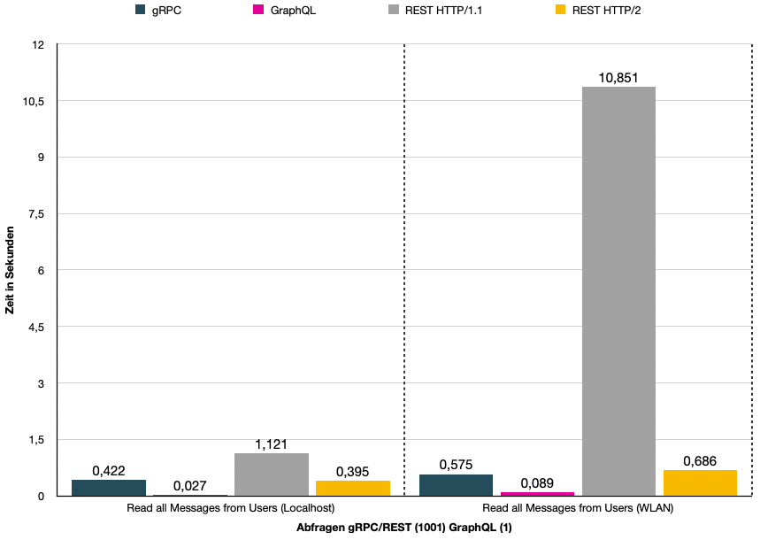

# Vergleich von verschiedenen Architekturstilen für eine Programmierschnittstelle

# Inhalt

1. [Einführung](#einführung)
2. [Technologien](#technologien)
3. [Datenübertragung](#datenübertragung)
4. [Schnittstellenbeschreibung](#schnittstellenbeschreibung)
5. [Versionierbarkeit](#versionierbarkeit)
6. [Performanz](#performanz)
7. [Security](#security)
8. [Fazit](#fazit)
9. [Literaturverzeichnis](#literaturverzeichnis)

# Einführung

Mittels gRPC, GraphQL und REST werden Programmierschnittstellen entwickelt, damit Client und Server miteinander kommunizieren können. Für den Transport der Daten verwenden alle drei Technologien das HTTP Protokoll. Abgesehen vom Transportprotokoll, sind die drei Technologien jedoch komplett verschieden und bieten alle unterschiedliche Konzepte, um eine Kommunikation zwischen Client und Server zu ermöglichen.  
Während des Praktikums soll ermittelt werden, für welche Einsatzgebiete die verschiedenen Technologien am besten geeignet sind.

Zuerst werden die verschiedenen Technologien vorgestellt und die verschiedenen Paradigmen aufgezeigt. Um konkrete Messwerte für einen Vergleich zu ermitteln, wurde eine Software entwickelt, welche die Performanz der Technologien in verschiedenen Szenarien misst ([GitHub Repository REST / GraphQL / gRPC Performance testing](https://github.com/Kevin-Ratschinski/rest-graphql-grpc)).  
Die Ergebnisse hierzu werden in dem Kapitel [Performanz](#Performanz) dargestellt.

# Technologien

## gRPC


Abbildung 1 - gRPC Paradigma
(Quelle: gRPC Logo https://grpc.io/)

gRPC ist ein von Google entwickeltes Open-Source-Framework für Remote Procedure Calls (RPC). Remote Procedure Calls sind entfernte Funktionsaufrufe, die über verschiedene Systeme hinweg ausgeführt werden können. Laut des Unternehmens ist es ein hoch performantes und leichtgewichtiges Kommunikationsprotokoll, das über allen bekannten Betriebssystemen hinweg funktioniert. gRPC basiert auf dem HTTP/2 Standard und benutzt zum Versenden der Daten das "Protocol Buffers" Datenformat, welches ebenfalls von Google entwickelt wird. Viele bekannte Unternehmen wie Netflix, Square oder Cisco stützen ihre interne Kommunikation auf das API-Framework. <a href="#/praktikum/ratschinski/index?id=ref_1">(gRPC, 2022)</a>

## GraphQL


Abbildung 2 - GraphQL Paradigma
(Quelle: GraphQL Logo https://graphql.org/brand/)

GraphQL wurde 2015 von Meta, ehemals Facebook, für die eigene Facebook-API veröffentlicht und ist die Spezifikation einer plattformunabhängigen Abfragesprache für APIs. Mit GraphQL können vom Client genau definierte Abfragen an den Server gestellt werden. Die Abfrage wird anschließend vom Server verarbeitet und die Antwort zum Client zurückgesendet. Besonders an GraphQL ist, dass die API nicht für jedes Objekt einen eigenen Endpunkt, den der Client für die entsprechende Ressource ansprechen kann, zur Verfügung stellt. Sondern die API nur einen einzigen Endpunkt zur Verfügung, über den der Client mit Queries lesende oder mittels Mutationen schreibende Operationen durchführen kann. <a href="#/praktikum/ratschinski/index?id=ref_2">(GraphQL, 2022)</a>

## REST


Abbildung 3 - REST Paradigma

REST steht für _Representational State Transfer_. Es handelt sich dabei nicht um eine konkrete Technologie, sondern um einen Architekturstil oder ein Programmierparadigma, das 2000 von Roy T. Fielding in seiner Dissertation konzipiert wurde <a href="#/praktikum/ratschinski/index?id=ref_3">(T. Fielding, 2000)</a>.  
REST basiert auf der Architektur des World Wide Web. Daten werden als Ressourcen gesehen und können über eine eindeutige Adresse (URI) identifiziert werden. Der Client stellt über die verschiedenen HTTP-Methoden entsprechende Anfragen an die gewünschte Ressource und der Server liefert eine entsprechende Antwort zurück.

# Datenübertragung

## gRPC

Für die Datenübertragung in gRPC, wird das protobuf Framework verwendet. Mithilfe des Frameworks können die Daten serialisiert und anschließend über das Netzwerk, zwischen Client und Server, ausgetauscht werden. _protobuf_ ist dabei unabhängig von der Wahl der Programmiersprache, welcher ein Client und ein Server verwendet. Eine Nachricht lässt sich beispielsweise mit C++ erzeugen und kann mit Go eingelesen werden.
Nach der Serialisierung werden die Bytes über das Netzwerk verschickt und auf der Seite des Empfängers deserialisiert.


Abbildung 4 - protobuf Daten versenden

Für die Deserialisierung beim Empfänger wird die Schnittstellenbeschreibung benötigt, in der Schnittstellenbeschreibung sind alle wesentlichen Merkmale enthalten, damit Client und Server die Daten austauschen können.  
Die Abbildung zeigt, wie ein User decodiert wird. Das erste Byte wird in eine Feldnummer und den Wire Type aufgeteilt (siehe Abbildung 6). Im Beispiel handelt es sich bei der _id_, um die Feldnummer 1 und den Wire Type 0. Das zweite Byte gibt den Wert 2 der _id_ an.  
Würde der Wert der _id_ größer als 128 sein, müssten weitere Bytes mit hinzugenommen werden. Somit lassen sich in protobuf auch größere Zahlen abbilden.  
Die restlichen Bytes beschreiben den Vornamen des Users. Das erste Byte wird wieder in Feldnummer(2) und in Wire Type(2) aufgeteilt. Das zweite Byte gibt die Länge der Bytes an und die restlichen Bytes bilden die direkten Werte ab.

  
Abbildung 5 - gRPC Decoding


Abbildung 6 - gRPC Wire Types
(Quelle: https://developers.google.com/protocol-buffers/docs/encoding)

Ein Vorteil einer solchen Übertragung in Bytes liegt in der Nachrichtengröße. Daten lassen sich deutlich kompakter versenden als, wenn man zum Beispiel ein reines JSON-Format versenden würde. Zudem bietet sich noch ein Sicherheitsaspekt dadurch, dass sich die Daten ohne die passende Schnittstellenbeschreibung nicht interpretieren lassen.

## GraphQL

Für die Datenübertragung wird in GraphQL das JSON-Format oder das _graphql_-Format verwendet. Welches Format verwendet wird, wird im Content-Type des HTTP-Request festgelegt. Für die Übermittlung der Daten werden in GraphQL nur die HTTP-Methoden GET und POST eingesetzt. In der Regel wird überwiegend die POST Methode für die Kommunikation verwendet. Alle relevanten Informationen zu einem Request, ob nun Query oder Mutation, können innerhalb des Payloads eines Post Requests geschrieben werden. Mit einem GET Request lassen sich in GraphQL nur Queries abbilden. Ein Nachteil hierbei ist, dass die Query dabei als URI-Parameter des Requests angeben werden muss. Das reduziert deutlich die Lesbarkeit der Queries.

- POST Request im JSON-Format:

  POST /test HTTP/1.1  
  Content-Type: application/json

  ```json
  {
    "query": "{
      user(id:1) {
        id first_name last_name email messages{
          id text userId
          }
        }
      }"
  }
  ```

- POST Request im _graphql_-Format:

  POST /test HTTP/1.1  
  Content-Type: application/graphlql

  ```graphql
  {
    user(id: 1) {
      id
      first_name
      last_name
      email
      messages {
        id
        text
        userId
      }
    }
  }
  ```

---

Die Antworten der Queries und Mutationen, erfolgen immer im JSON-Format. Die Daten werden im Payload der Antwort zurückgesendet und können sowohl die Antworten als auch Fehlermeldungen enthalten.

- Antwort einer Query:

  HTTP/1.1 200 Ok  
  Content-Type: application/json

  ```json
  {
    "data": {
      "user": {
        "id": "1",
        "first_name": "Markos",
        "last_name": "O'Sirin",
        "email": "mosirin0@vk.com",
        "messages": []
      }
    }
  }
  ```

## REST

  
Abbildung 7 - REST Datenübertragung

Die Datenübertragung in REST erfolgt in der Regel über das HTTP-Protokoll. Mit den verschiedenen HTTP-Methoden (GET, POST, PUT, DELETE, ...) können die Ressourcen, über zuvor festgelegte URIs angesprochen werden.  
Ressourcen bilden die zentrale Abstraktion im REST-Architekturstil. Sie sind eindeutig identifizierbar und die Interaktion mit ihnen erfolgt immer über den Austausch von Repräsentationen <a href="#/praktikum/ratschinski/index?id=ref_4">(Tilkov et al., 2015, S. 52)</a>. Das Datenformat, wie die Daten ausgetauscht werden sollen, ist in REST nicht vorgeschrieben und kann beliebig im Content-Type des HTTP-Request festgelegt werden (JSON, XML, IMAGE, PDF, CSV, ...). Im Gegensatz zu den anderen Technologien ist REST sehr flexibel und macht nur wenig Vorgaben, wenn es darum geht, wie die Daten übertragen werden sollen.

## Zusammenfassung Datenübertragung

|                   |   gRPC   |    GraphQL     |                  REST                  |
| ----------------- | :------: | :------------: | :------------------------------------: |
| **Datenformat**   | protobuf | JSON / graphql |                Beliebig                |
| **Dokument Stil** |    ❌    |       ✅       | Ja (wenn JSON oder XML verwendet wird) |
| **Effizienz**     |    ✅    |       -        |                   -                    |
| **Komplexität**   |   hoch   |     gering     |                 mittel                 |
| **Abstraktion**   |   hoch   |     mittel     |                 gering                 |

# Schnittstellenbeschreibung

Ein wichtiger Aspekt bei der Auswahl der Technologie ist die Schnittstellenbeschreibung. Mithilfe der Beschreibung weiß ein Client, welche Funktionen die Schnittstelle anbietet, welche Nachrichtenformate erwartet und welche Fehler bei der Übertragung auftreten können. Außerdem bietet eine Beschreibung noch eine Reihe weiterer Vorteile:

1. Aufrufe erleichtern
   - Durch die Beschreibung weiß der Client, welche Aufrufe er durchführen kann.
2. Entwicklung Client und Server
   - Eine Beschreibung kann, mit der Hilfe eines Codegenerators, direkt in Client oder Servercode übersetzt werden, was die Entwicklung der Schnittstelle vereinfacht.
3. Einhaltung eines Vertrages
   - Die Schnittstellenbeschreibung schreibt vor, wie sich Client und Server während der Kommunikation zu verhalten haben und welche Bedingungen erfüllt werden müssen, damit ein Aufruf erfolgreich ist.
4. Erzeugung von Dokumentationen
   - Aus einer Schnittstellenbeschreibung lässt sich oft direkt eine Dokumentation in z. B. einem HTML-Format erstellen
5. Validierung von Nachrichten
   - In einer Schnittstellenbeschreibung wird festgelegt, welche Datentypen und Nachrichtenformate von der Schnittstelle akzeptiert werden.
6. Vergleich von API-Versionen (Kompatibilität)
   - Mithilfe einer Beschreibung lässt sich die aktuelle Version eine API festhalten. So lassen sich auch verschiedene Versionen einer API einfach auf Kompatibilität testen.
7. Qualitätssicherung
   - Schnittstellenbeschreibungen lassen sich automatisiert überprüfen, somit lässt sich direkt feststellen, ob zuvor festgelegte Qualitätsregeln eingehalten wurden.

## gRPC

Die Schnittstelle wird in gRPC über _proto_ Dateien beschrieben. Zuerst wird der Service definiert und beschrieben, welche Funktionen er anbietet. Danach werden alle Messagetypen definiert, welche in dem Service verwendet werden.  
Jeder Typ eines Messagetypes bekommt eine eigene Feldnummer und eine Beschriftung. Die Feldnummern werden intern von protobuf, für die Kommunikation, verwendet und ermöglichen zusätzlich noch eine Versionierung der Schnittstelle. Bei den Typen unterscheidet man zwischen zusammengesetzten und einfachen Typen. Um ein Array in protobuf abzubilden, muss das Schlüsselwort _repeated_ vor den jeweiligen Typ gesetzt werden. Mit dem Typsystem, welches von protobuf mitgeliefert wird, lassen sich komplexe und große Schnittstellen einfach beschreiben.

|                Einfache Typen                | Zusammengesetzte Typen |
| :------------------------------------------: | :--------------------: |
|                double, float                 |        Message         |
| int32, int64, uint32, uint64, sint32, sint64 |          Enum          |
|     fixed32, fixed64, sfixed32, sfixed64     |                        |
|                     bool                     |                        |
|                    string                    |                        |
|                    bytes                     |                        |

<a href="#/praktikum/ratschinski/index?id=ref_6">(proto Typen, 2022)</a>

Beispiel: gRPC Schnittstelle

```protobuf
syntax = "proto3";

service UserService {
  rpc GetUser(Id) returns (User) {}
  rpc GetAllUsers (Empty) returns (UserList) {}
  rpc AddUser(User) returns (Id) {}
  rpc DeleteUser (Id) returns (Empty) {}
  rpc EditUser (User) returns (User) {}
  rpc GetMessage(Id) returns (Message) {}
  rpc GetAllMessages (Empty) returns (MessageList) {}
  rpc GetUserMessages (Id) returns (MessageList) {}
  rpc AddMessage(Message) returns (Id) {}
  rpc DeleteMessage (Id) returns (Empty) {}
  rpc EditMessage (Message) returns (Message) {}
}

message User {
  int64 id = 1;
  string first_name = 2;
  string last_name = 3;
  string email = 4;
}

message Message {
  int64 id = 1;
  string text = 2;
  int64 userId = 3;
}

message Id {
  string id = 1;
}

message Empty {}

message UserList {
  repeated User users = 1;
}

message MessageList {
  repeated Message messages = 1;
}
```

Der _protobuf_ Compiler kann anschließend aus der Schnittstellenbeschreibung verschiedene Vorlagen für Client und Server generieren. Dabei werden von _protobuf_ eine Vielzahl von Programmiersprachen unterstützt.

- C#
- C++
- Dart
- Go
- Java
- Kotlin
- Node
- Objective-C
- PHP
- Python
- Ruby

<a href="#/praktikum/ratschinski/index?id=ref_7">(gRPC languages, 2022)</a>

Beispiel: GO Client und JAVA Server
  
Abbildung 8 - protobuf Codegenerierung

## GraphQL

Die Schnittstelle wird in GraphQL über das GraphQL-Schema beschrieben. Das GraphQL-Schema ist eine Definition der aufrufbaren Daten, ihres Typs, ihrer Relationen sowie deren möglichen Zugriffe zur Manipulation. Das Schema legt die genaue Datenstruktur fest, gegen die eingehende Anfragen validiert werden. Entspricht eine Anfrage dem Schema, wird sie weiter verarbeitet. Das erfolgt, indem GraphQL die Anfrage zerteilt und einzelnen _Resolvern_ übergibt, welche die Anfrage auflösen und ein Ergebnis kumuliert zurücksenden.

Das GraphQL-Schema liefert alle möglichen Informationen über eine Schnittstelle. Aus dem Schema lässt sich erkennen, welche Werte abgefragt werden können und welche Werte sich manipulieren lassen. Durch den Graphen basierten Ansatz kann ein Schema auch einfach als Graph visualisiert werden <a href="#/praktikum/ratschinski/index?id=ref_8">(GraphQL Voyager, 2022)</a>.

Wie bereits in gRPC, lässt sich auch in GraphQL über die Schnittstellenbeschreibung direkt Code für den Client oder Server generieren <a href="#/praktikum/ratschinski/index?id=ref_9">(GraphQL Code Generator, 2022)</a>.

Beispiel: GraphQL-Schema

```graphql
type Query {
  users: [User!]
  user(id: ID!): User
}

type Mutation {
  createUser(first_name: String!, last_name: String!, email: String!): User!
  updateUser(
    id: ID!
    first_name: String
    last_name: String
    email: String
  ): User!
  deleteUser(id: ID!): Boolean!
}

type User {
  id: ID!
  first_name: String!
  last_name: String!
  email: String!
  messages: [Message!]
}
```

### Typ-System GraphQL-Schema

GraphQL hat ein sehr umfangreiches Typsystem, welches sich aus den folgenden Punkten zusammensetzt:  
<a href="#/praktikum/ratschinski/index?id=ref_10">(GraphQL-Schema, 2022)</a>

1. **Objekt-Typen**

   Die grundlegendsten Komponenten eines Schemas sind die Objekt-Typen, die ein einfaches Objekt repräsentieren.

   ```graphql
   type Product {
     name: String
     category: Category
   }

   type Category {
     name: String
   }
   ```

   Der kurze Code repräsentiert einen Einstiegspunkt der API auf das Objekt _Product_ und _Category_, über den die Daten der Objekte abrufbar sind.

2. **Parameter**

   Jedes Feld eines Objektes können zusätzlich noch Parameter übergeben werden, welche die Rückgabewerte einer Query verändern können. Parameter können dabei optional oder erforderlich sein.

   ```graphql
   type Product {
     name: String
     price: (unit: Currency = EUR): Float
   }
   ```

   In dem Beispiel kann bei einer Query der Parameter unit mitgeben werden, dass den Wert des Feldes in einer gewünschten Währung zurückgibt (default = EUR).

3. **Skalar-Typen**

   Jedes Objekt hat Namen und Felder, am Ende einer Abfrage muss aber jedes Feld in einen konkreten Datentyp aufgelöst werden. Diese Datentypen sind in GraphQL die Skalar-Typen.  
   Die möglichen Skalar-Typen von GraphQL sind:

   - Int: Eine positive oder negative 32-Bit-Ganzzahl
   - Float: Eine positive oder negative Gleitkommazahl
   - String: Eine UTF-8-Zeichenkette
   - Boolean: ein binärer Datentyp mit den möglichen Werten _true_ oder _false_
   - ID: Eine eindeutige Identifikation eines Objektes

   In den meisten Implementierungen von GraphQL-Diensten gibt es zudem die Möglichkeit, benutzerdefinierte Skalar-Typen zu definieren. Zum Beispiel ein extra Datumstyp:

   ```graphql
   scalar Date
   ```

   Anschließend muss serverseitig festgelegt werden, wie der Typ serialisiert, deserialisiert und validiert werden soll.

4. **Enumerations-Typen**

   Felder vom Typ Enumeration erhalten ein definiertes Set an erlaubten Werten, die dieses Feld annehmen kann.

   ```graphql
   type Product {
     name: String
     category: Category
   }

   enum Category {
     FOOD
     ELECTRONICS
     CLOTHES
   }
   ```

   In dem Beispiel kann _Category_ nicht jeden beliebigen Namen annehmen, sondern nur die Namen FOOD, ELECTRONICS oder CLOTHES.

5. **Typ-Modifikatoren: Listen und Non-Null**

   Mit den Listen-Modifikator lassen sich Listen von Objekten, Feldern oder Enumerationen erstellen und mit den Non-Null-Modifikator kann definiert werden, dass ein Feld, Objekt oder Enum immer einen Wert enthält und somit nie den Wert _null_ zurückgibt.

   Ein Element wird durch eckige Klammern([]) um dessen Typ zu einer Liste. Damit wird nicht mehr ein einzelnes Element, sondern eine Liste des jeweiligen Objektes, Feldes oder Enums zurückgeliefert. Der Non-Null-Modifikator wird durch ein Ausrufezeichen(!) bei der Typdefinition direkt am entsprechenden Feld, Objekt oder Enum gekennzeichnet.

   ```graphql
   type Category {
     name: String!
     products: [Product!]
   }
   ```

   In dem Beispiel muss im Objekt _Category_ immer ein Wert für das Feld _name_ vorhanden sein. Zudem können in einer Kategorie mehrere Produkte als Liste zurückgeliefert werden, definiert mit den eckigen Klammern um den Typ _Product_.

   Entscheidend bei der Liste ist ebenfalls die Positionierung des Non-Null-Modifikator für das Resultat und der Validierung.  
   Folgende Varianten wären möglich, welche sich alle im Resultat unterscheiden:

   - products: [Product]: Die Liste kann _null_ sein sowie Elemente enthalten, die _null_ sind.

   - products: [Product!]: Die Liste kann _null_ sein, aber darf keine Elemente enthalten, die _null_ sind.

   - products: [Product]!: Die Liste darf nicht _null_ sein, kann aber Elemente enthalten, die _null_ sind.

   - products: [Product!]!: Die Liste darf nicht _null_ sein sowie keine Elemente enthalten, die _null_ sind.

6. **Interfaces**

   Eine weitere Funktionalität von GraphQL sind Interfaces. Interfaces sind abstrakte Typen, die eine spezifische Liste an Feldern definieren. Ein Objekt, welches ein solches Interface implementiert, muss alle im Interface definierten Felder implementieren. Das führt dazu, dass verschiedene Objekte, die ein gleiches Interface implementieren, garantiert die im abstrakten Objekt definierte Liste an Feldern halten.

   ```graphql
   interface Character {
     id: ID!
     name: String!
     friends: [Character]
     appearsIn: [Episode]!
   }

   type Human implements Character {
     id: ID!
     name: String!
     friends: [Character]
     appearsIn: [Episode]!
     starships: [Starship]
     totalCredits: Int
   }

   type Droid implements Character {
     id: ID!
     name: String!
     friends: [Character]
     appearsIn: [Episode]!
     primaryFunction: String
   }
   ```

7. **Union-Typen**

Mit Union-Typen können mehrere Objekte zu einer Gruppe hinzugefügt werden.

```graphql
union SearchResult = Human | Droid | Starship
```

In dem Beispiel werden die Objekte Human, Droid und Starship zur Gruppe SearchResult hinzugefügt und sind dann anschließend übersichtlich über einer Query abrufbar.

8. **Input-Typen**

Input-Typen funktionieren genauso wie normale Objekte, werden jedoch explizit als Input für Parameter verwendet.

```graphql
input ReviewInput {
  stars: Int!
  commentary: String
}
```

Im Beispiel wird ein Objekt _ReviewInput_ mit den Feldern stars und commentary definiert. Dieser Typ kann beispielsweise in einer Mutation einem Parameter als Argument übergeben werden.

## REST

Die Schnittstellenbeschreibung in REST ist komplett optional und nicht wie bei gRPC oder GraphQL vorgeschrieben. Um trotzdem eine Beschreibung für eine REST Schnittstelle erstellen zu können, gibt es eine Vielzahl von Anbietern (OpenAPI, RAML, WADL, API Blueprint, ...), die dafür Spezifikationen und Tools zur Verfügung stellen. Die OpenAPI-Spezifikation hat sich dabei als "Quasi-Standard" etabliert, Unternehmen wie Google, Microsoft oder IBM sind gemeinsam an der Weiterentwicklung der Spezifikation beteiligt <a href="#/praktikum/ratschinski/index?id=ref_11">(OpenAPI Members, 2022)</a>.

Mit Tools wie Swagger kann die OpenAPI-Spezifikation umgesetzt werden. Bei Swagger handelt es sich um ein Open-Source-Framework, mit dem sich Beschreibungen im JSON oder YAML-Format erstellen lassen und anschließend eine Dokumentation in z. B. HTML generieren lässt <a href="#/praktikum/ratschinski/index?id=ref_12">(Swagger UI, 2022)</a>. Dabei werden zu jedem URI-Muster die unterstützten HTTP-Methoden, eine Beschreibung und die Parameter festgelegt. In der HTML-Dokumentation kann dann die API direkt getestet und Anfragen darüber ausgeführt werden.

Beispiel: YAML Beschreibung GET users/

```yml
@openapi
path:
/users/:
  get:
    summary: Lists all the users
    tags: [Users]
    responses:
      "200":
        description: The list of users.
        content:
          application/json:
            schema:
              $ref: '#/components/schemas/User'
```


Abbildung 9 - Swagger UI

Die OpenAPI-Spezifikation bietet zudem optional die Verwendung von JSON-Schema an <a href="#/praktikum/ratschinski/index?id=ref_13">(JSON Schema, 2022)</a>. Mit JSON Schema kann das Datenformat, welches bei Anfragen angeben werden muss, genaustens beschrieben werden. Dadurch kann in der Schnittstellenbeschreibung schon eine Validierung umgesetzt werden, sodass nur gültige Anfragen, welche dem Schema entsprechen, beantwortet werden.

Mit dem OpenAPI-Generator <a href="#/praktikum/ratschinski/index?id=ref_14">(OpenAPI Generator, 2022)</a>, lässt sich direkt Code für Clients und Server automatisch generieren. Der Generator bietet auch die Möglichkeit aus der Beschreibung heraus ein GraphQL Schema oder eine Protocol Buffers Datei für gRPC zu erstellen.

## Zusammenfassung Schnittstellenbeschreibung

|                                                 |  Protocol Buffers (gRPC)   |       GraphQL Schema       |         REST (OpenAPI)         |
| ----------------------------------------------- | :------------------------: | :------------------------: | :----------------------------: |
| **Ohne Schnittstellenbeschreibung einsetzbar?** |             ❌             |             ❌             |               ✅               |
| **Format**                                      | Domänenspezifische Sprache | Domänenspezifische Sprache |           JSON/YAML            |
| **Alternative Beschreibungssprachen**           |             -              |             -              | RAML, WADL, API Blueprint, ... |
| **Typ-System**                                  |             ✅             |             ✅             |     ✅ <br> (JSON Schema)      |
| **Codegenerierung**                             |             ✅             |             ✅             |               ✅               |

# Versionierbarkeit

Durch die unterschiedlichen Konzepte der Schnittstellenbeschreibungen bieten auch alle Technologien verschiedene Konzepte, um die Schnittstelle zu versionieren.

## gRPC

Die Versionierung in gRPC erfolgt über Änderungen in der Schnittstellenbeschreibung.

```protobuf
Version 1

message User {
int64 id = 1;
string first_name = 2;
string last_name = 3;
string email = 4;
}
```

```protobuf
Version 2

message User {
  int64 id = 1;
  string first_name = 2;
  string last_name = 3;
  string password = 5;
}
```

Es lassen sich einfach neue Felder hinzufügen. In dem oben gezeigten Beispiel wird das Feld "email" entfernt und das Feld "password" hinzugefügt. Solange folgende Regeln eingehalten werden, bleiben die Versionen untereinander kompatibel:

- Die Feldnummern dürfen niemals geändert werden.
  - Im Beispiel muss das Feld "id" immer die Feldnummer 1 behalten.
- Feldnummern dürfen gelöscht, aber später nicht wieder verwendet werden.
  - Im Beispiel wird das Feld "email" gelöscht, d. h. die Feldnummer 4 darf später nicht wieder verwendet werden.
- Namen dürfen geändert werden, da intern nur die Feldnummern verwendet werden.
- Die Typen dürfen vertauscht werden, solange kein **Overflow** entsteht.

Werden diese Regeln befolgt, entsteht eine gute Kompatibilität zwischen den verschiedenen Schnittstellenversionen. Nachrichten lassen sich so sehr einfach von Version 1 auf Version 2 mappen. Dies wird vom protobuf Framework automatisch gemacht.

## GraphQL

Eine Versionierung in GraphQL ist nicht vorgesehen. Man könnte zwar den kompletten Endpunkt mit einer Versionsnummer versehen und so unterschiedliche Versionen der API unterstützen. Doch GraphQL empfiehlt durch die Möglichkeit zur effektiven API-Weiterentwicklung einen versionslosen Ansatz <a href="#/praktikum/ratschinski/index?id=ref_16">(GraphQL Versioning, 2022)</a>.  
In GraphQL lassen sich einfach neue Felder hinzufügen, ohne dass das zu einem Bruch der API führt. Ein Client wird so niemals ein neues Feld sehen, wenn er nicht explizit seine Query angepasst hat. Das Hinzufügen neuer Felder wird also bei GraphQL in keinem Fall die Funktionalität eines Clients beeinflussen.

Felder sollten, bevor sie gelöscht werden, zuerst als _deprecated_ gekennzeichnet werden. Anschließend kann die Benutzung dieser Felder überwacht werden und erst wenn kein Client diese Felder mehr benutzt, können diese sicher entfernt werden. _Deprecated_-Felder werden in der Dokumentation von GraphQL nicht mehr angezeigt und stehen damit neuen Clients nicht mehr zur Verfügung.

Die erste Version der GraphQL-API sollte dementsprechend nur die Felder zur Verfügung stellen, die von den Clients auch wirklich benötigt werden und sich anschließend Schritt für Schritt mit den neuen Anforderungen weiterentwickeln.

## REST

Bei REST kann die Versionierung mit unterschiedlichen Methoden gelöst werden. Die verschiedenen Methoden können einzeln angewandt werden oder sich dabei ergänzen <a href="#/praktikum/ratschinski/index?id=ref_4">(Tilkov et al., 2015, S. 187 - 189)</a>.

**Zusätzliche Ressourcen**

Bei neuen Anforderungen können zusätzliche Ressourcen angelegt werden, welche danach vom Client angesprochen werden können. Dies entspricht dem GraphQL-Ansatz, dass die API nicht versioniert wird und bei neuen Anforderungen immer neue Ressourcen zur Verfügung gestellt werden. Der Ansatz klingt trivial, bietet aber in sehr vielen Fällen eine einfache und sehr gut funktionierende Lösung.

**Erweiterbare Datenformate**

Viele Datenformate, wie XML oder JSON, lassen sich einfach erweitern. Durch die Erweiterung können leicht neue Informationen zum Client geliefert werden. Der Nachteil an der Methode ist, dass das Datenformat im Vorfeld festgelegt werden muss und bei manchen Clients ein Over-fetching entsteht, dadurch dass nicht alle angeforderten Daten benötigt werden.

**Versionsabhängige Repräsentation**

Die nächste Methode basiert auf einem HTTP-spezifischen Ansatz. Durch die Möglichkeit, sowohl im Request- als auch bei Response-Nachrichten im Content-Type-Header einen Medientyp zu deklarieren, kann ein und dieselbe Ressource mehr als eine Version eines Formats unterstützen.

```
Version 1:
Accept: application/vnd.example.v1+json

Version 2:
Accept: application/vnd.example.v2+json
```

**URI Versionierung**

Die URI Versionierung ist der einfachste Ansatz, hier wird bei jeder neuen Version eine neue URI generiert, über welche die API angesprochen werden kann. Diese Information muss nach Änderung der API an den Client weitergereicht werden, der anschließend auf die neue URI darauf zugreifen kann.

```
Version 1:
http://api.example.com/v1/user

Version 2:
http://api.example.com/v2/user
```

## Zusammenfassung Versionierbarkeit

|                                    |                      gRPC                      |            GraphQL            |            REST            |
| ---------------------------------- | :--------------------------------------------: | :---------------------------: | :------------------------: |
| **Versionierung**                  | Über Änderungen der Schnittstellenbeschreibung | Möglich aber nicht vorgesehen | Vielzahl von Möglichkeiten |
| **Mapping zwischen den Versionen** |                Mittels protobuf                |               -               |             -              |

# Performanz

Ein weiteres wichtiges Kriterium, bei der Wahl der richtigen Technologie kann die Performanz bei der Datenübertragung sein.

## Applikation

&#8594; [GitHub Repository REST / GraphQL / gRPC Performance testing](https://github.com/Kevin-Ratschinski/rest-graphql-grpc)

Für die Ermittlung der Performanz, wurde eine Node.js Applikation entwickelt, welche im oben verlinkten GitHub Repository eingesehen werden kann.

Die Applikation stellt jeweils einen gRPC, GraphQL und zwei REST-Server zur Verfügung.  
Die verschiedenen Server greifen gemeinsam auf einen JSON-Datensatz zu, der nach dem ER-Modell in Abbildung 10 aufgebaut ist. Der Datensatz beinhaltet jeweils 1000 User(119 KB) und 1000 Messages(283 KB), die den Usern zufällig zugeordnet sind.

  
Abbildung 10 - Datensatz ER-Modell

Für jede Technologie wurde zudem ein Client erstellt, der die folgenden CRUD Operation auf den Datensatz ausführen kann:

- Create
  - User erstellen
  - Message erstellen
- Read
  - Informationen von allen Usern anfordern
  - Informationen von einem User anfordern
  - Informationen von allen Messages anfordern
  - Informationen von einer Message anfordern
  - Messages von einem User anfordern
- Update
  - User aktualisieren
  - Message aktualisieren
- Delete
  - User löschen
  - Message löschen

Mit der Applikation können die verschiedenen Operationen ausgeführt und die Performanz ermittelt werden. Für die Messung der Performanz wird das in Node.js mitgelieferte Modul "perf_hooks" verwendet <a href="#/praktikum/ratschinski/index?id=ref_15">(perf_hooks, 2022)</a>. Beim perf_hooks Modul handelt es sich um eine, von Node.js bereitgestellte, Performance Measurement API, die dafür genutzt werden kann, die Laufzeit von Funktionen zu ermitteln.

Für die Kommunikation zwischen Client und Server verwenden alle drei Technologien das HTTP-Protokoll. Hier muss aber zwischen den Versionen **HTTP/1.1** und **HTTP/2** unterschieden werden. gRPC benutzt das HTTP-Protokoll in Version 2, der Apollo-GraphQL-Server unterstützt zum jetzigen Zeitpunkt nur die Version 1.1 und für REST wurden zwei verschiedene Webserver erstellt, wobei einer HTTP/1.1 Anfragen und der andere HTTP/2 Anfragen entgegennimmt.

Der Unterschied zwischen HTTP/1.1 und HTTP/2 liegt in der Verarbeitung der Daten. HTTP/1.1 sendet und lädt die Daten nacheinander. Im Gegensatz dazu kann HTTP/2, mehrere Datenströme gleichzeitig senden, was zu einer Verbesserung der Performanz führen kann.

## Szenarien

Im ersten Szenario werden verschiedene Operation auf denselben Rechner (Localhost) jeweils 100-mal hintereinander ausgeführt und die Laufzeit bis zum Ende der letzten Funktion ermittelt.

  
Abbildung 11 - Szenario Localhost

---

Im zweiten Szenario werden dieselben Anfragen getestet, aber diesmal wird der Server auf einem anderen Rechner im Netzwerk angesprochen, um ein etwas realistischeres Szenario zu simulieren.

  
Abbildung 12 - Szenario WLAN

## Ergebnisse

Die folgenden Abbildungen zeigen die Ergebnisse der oben gezeigten Szenarien.
Es wurden die Laufzeiten von folgenden Abfragen ermittelt:

- Read User: Informationen von einem User anfordern
- Read all Users: Informationen von 1000 Usern anfordern
- Read Message: Informationen von einer Message anfordern
- Read all Messages: Informationen von 1000 Messages anfordern
- Create User: Einen User erstellen

Die Abfragen wurden jeweils 100-mal hintereinander ausgeführt und die Laufzeit bis zum Ende der letzten Abfrage ermittelt. Getestet wurde das ganze für gRPC, GraphQL, REST(HTTP/1.1) und Rest(HTTP/2). Die Laufzeit kann anhand der Balkendiagramme abgelesen werden und ist immer in Sekunden angegeben.

**Szenario Localhost:**

  
Abbildung 13 - Ergebnisse Localhost

---

**Szenario WLAN:**

  
Abbildung 14 - Ergebnisse WLAN

### n+1 Problem

Beim n+1 Problem, benötigen bestimmte Abfragen eine hohe Anzahl von Requests. Möchte man zum Beispiel alle Messages, die den verschiedenen User zugeordnet sind ermitteln, müsste man als zuerst alle User beziehen und anschließend die einzelnen Messages der User abfragen. Das wären bei 1000 Usern genau 1001 Abfragen. Hierbei kommt es zum sogenannten Under-Fetching (Abbildung 15), beim Under-fetching liefert die Schnittstelle zu wenige Informationen, sodass erneute Aufrufe nötig sind. Das führt durch die hohe Anzahl an Aufrufen zu einem Verlust der Performanz.

  
Abbildung 15 - REST Under-fetching

Eine Möglichkeit wäre bei einem Aufruf immer alle Informationen mitzuliefern, dies würde aber zum sogenannten Over-fetching (Abbildung 16) führen, beim Over-fetching entsteht eine höhere Netzwerkauslastung dadurch, dass viele Informationen mitgeliefert werden, welche der Client mitunter nicht benötigt.

  
Abbildung 16 - REST Over-fetching

**Ergebnisse n+1**

Die Ergebnisse in Abbildung 17 zeigen einen Vorteil, welcher bei der Benutzung von GraphQL entsteht. Um die Messages der User zu beziehen, ist in GraphQL nur eine Abfrage nötig, welche alle geforderten Daten zurückliefert. Bei gRPC und REST hingegen, sind jeweils 1001 Abfragen nötig.

  
Abbildung 17 - Ergebnisse n+1

## Zusammenfassung Performanz

Die Ergebnisse zeigen, dass es zwischen gRPC und REST keine großen Unterschiede in der Performanz gibt, vorausgesetzt REST wird zusammen mit dem HTTP/2 Protokoll verwendet. gRPC zeigt nur einen minimalen Vorteil in der Performanz. Somit eignen sich beide Technologien sehr gut, um Daten performant auszutauschen.  
Wird REST zusammen mit HTTP/1.1 verwendet, zeigen sich in den Ergebnissen deutlich längere Laufzeiten für die verschiedenen Abfragen.  
GraphQL hat bei den Ergebnissen die längsten Laufzeiten. Die Stärke von GraphQL zeigt sich erst dann, wenn es um gezielte Abfragen geht. Dadurch dass die benötigten Daten in den Queries festgelegt werden, kommt es bei GraphQL zu keinem Over- oder Under-fetching. Besonders in Fällen wo ein n+1 Problem auftreten würde, zeigen sich die Vorteile von GraphQL, durch die gezielte Abfrage wird die Performanz verbessert und die Netzwerkauslastung reduziert.

# Security

Durch die Verwendung des HTTP-Protokolls, bieten alle 3 Technologien sehr gute Möglichkeiten, um eine sichere Kommunikation zwischen Client und Server zu ermöglichen. HTTP allein bietet noch keine verschlüsselte Kommunikation. Wird HTTP zusammen mit TLS verwendet, kann eine verschlüsselte Kommunikation über HTTPS erfolgen. Eine verschlüsselte Kommunikation, kann anschließend dafür verwendet werden, um die Authentifizierung und Autorisierung der Clients sicherzustellen.

- Authentifizierung: Überprüft, welcher Client auf das System zugreift.
- Autorisierung: Legt fest, welche Rechte ein Client hat.

Für die Authentifizierung lassen sich zum Beispiel Cookies oder die standardisierte HTTP Authentifizierung <a href="#/praktikum/ratschinski/index?id=ref_17">(HTTP Authentication RFC 7235)</a> verwenden. Hier kann über eine Header-Feld "Authorization", sich ein Client beim Server authentifizieren.

```
Authorization: <type> <credentials>
```

Der _type_ gibt an, welche Authentifizierung benutzt wird. HTTP unterstützt dabei eine Vielzahl von Möglichkeiten. Viele sind davon bei der IANA registriert und damit offiziell anerkannt <a href="#/praktikum/ratschinski/index?id=ref_18">(IANA Authentication)</a>.

**Basic**

Bei der Basic-Authentifizierung werden alle, zur Benutzererkennung benötigten, Daten base64 kodiert und anschließend zum Server gesendet.

```
Authorization: Basic base64encode(<identifier>:<secret>)
```

Da base64 keine sichere Verschlüsselung ist, darf dieses Verfahren nur unter der Verwendung von TLS erfolgen.

**Bearer**

Beim Bearer-Verfahren wird ein Token für die Authentifizierung verwendet. Hier wird dem Client nach erfolgreicher Authentifizierung ein Token übermittelt, welches später wieder für die Authentifizierung und Autorisierung an den Server geliefert werden kann. In der Praxis erfolgt dies oft über sogenannte JSON-Web-Token <a href="#/praktikum/ratschinski/index?id=ref_19">(JWT RFC 7519)</a>. Auch bei diesem Verfahren muss die Übertragung über TLS erfolgen.

**API Keys**

API Keys sind ein sehr einfacher Mechanismus, um API-Anfragen nur für bestimmte Clients zu ermöglichen. Nachdem ein Client einen API Key vom Anbieter bekommen hat, muss dieser für jede Anfrage mitgesendet werden, um sicherzustellen, dass eine gültige Anfrage an die API gestellt wird. Das Mitsenden des Keys kann zum Beispiel im Header oder in einem Cookie erfolgen.

**gRPC**

Durch die Verwendung von HTTP/2, erfolgt die Datenübertragung immer über TLS bei gRPC. Zudem werden noch zusätzliche Methoden zur Authentifizierung unterstützt <a href="#/praktikum/ratschinski/index?id=ref_20">(gRPC Authentication)</a>:

- SSL/TLS: SSL/TLS-Integration für eine verschlüsselte Verbindung zwischen Client und Server.

- ALTS (Application Layer Transport Security): Bei ALTS handelt es sich um ein Authentifizierungs- und Transportverschlüsselungssystem, um die RPC-Kommunikation zu schützen. ALTS wird anstelle von TLS verwendet, wenn die Applikation auf der Google Cloud Platform (GCP) ausgeführt wird.

- Token-based authentication with Google: Hierbei handelt es sich um eine tokenbasierte Anmeldung, die von Google bereitgestellt wird.
  ```js
  // Authenticating with Google
  var GoogleAuth = require('google-auth-library'); // from https://www.npmjs.com/package/google-auth-library
  ...
  var ssl_creds = grpc.credentials.createSsl(root_certs);
  (new GoogleAuth()).getApplicationDefault(function(err, auth) {
  var call_creds = grpc.credentials.createFromGoogleCredential(auth);
  var combined_creds = grpc.credentials.combineChannelCredentials(ssl_creds, call_creds);
  var stub = new helloworld.Greeter('greeter.googleapis.com', combined_credentials);
  });
  ```

# Fazit

gRPC, GraphQL und REST basieren alle auf unterschiedlichen Paradigmen.

gRPC basiert auf Remote Procedure Calls, die es ermöglichen über Funktionsaufrufen mit entfernten Systemen zu kommunizieren, dabei kann es sich um ein System oder um verteilte Systeme handeln. Während den Funktionsaufrufen bleibt die HTTP/2-Implementierung komplett verborgen. Zudem wird mit dem protobuf-Framework ein effizientes Datenformat für die Serialisierung und Deserialisierung mitgeliefert. Das hilft dabei, sich während der Entwicklung auf die Geschäftslogik zu konzentrieren und man sich keine Gedanken um Datenformate oder Details des HTTP-Protokolls machen muss. gRPC sollte in Betracht gezogen werden, wenn es um die Entwicklung von verteilten Systemen mit geringer Latenz geht. Durch die Serialisierung mit protobuf, bietet gRPC die effizienteste Art an, um Daten zu übertragen. Zusätzlich wird von Clients weniger Rechenleistung für die Deserialisierung benötigt, das kann sich vor allem auf Mobilgeräten positiv auswirken.

GraphQL versucht das Problem zu lösen, dass Clients oft verschiedene Anfragen stellen müssen, um alle Daten zu erhalten, die zum Beispiel für die Darstellung einer Ansicht erforderlich sind. Deshalb werden in GraphQL die Daten in Form eines Graphen betrachtet und die API liefert nur einen Endpunkt, über welchen sich der Client dann je nach Bedarf eine Teilmenge der Daten abfragen kann. Das Hauptmerkmal liegt also darin, dass Clients genau die Daten zurückbekommen, welche sie anfragen und benötigen. GraphQL sollte dann in Betracht gezogen werden, wenn man eine Anwendung zur Verfügung stellen möchte, die viele verschiedene Datenquellen ausliefern soll oder man verschiedene Clients hat, die gemeinsam auf eine Datenquelle zugreifen. Sobald die Clients, zum Beispiel ein Web-Client und ein Mobil-Client für den Aufbau einer gleichen Seite, verschiedene Datensätze benötigen. Könnte sich der Einsatz von GraphQL dadurch lohnen, dass alle Daten über einen einzigen Endpunkt bezogen werden können und nicht für jeden Client, verschiedene Endpunkte zur Verfügung gestellt werden müssen.

REST ist ein Architekturstil, wie sich eine Schnittstelle aufbauen lässt und hält sich dabei sehr stark an den Aufbau des World Wide Web. REST bietet zudem eine große Flexibilität, wie genau die Schnittstelle umgesetzt werden kann. Alle drei Technologien sind unabhängig von einer konkreten Programmiersprache. Eine vollständige Unabhängigkeit von der Sprache und Plattform gibt es allerdings nur für REST. Möchte man eine API zur Verfügung stellen, auf die Clients einfachen Zugriff haben sollen, bietet sich eine REST API an. Durch die gängigen HTTP-Methoden wie GET, POST, PUT oder DELETE können Clients einfach über das HTTP-Protokoll mit der Schnittstelle kommunizieren. Wird die Schnittstelle auf Basis von HTTP und konform zu den REST-Prinzipien entworfen, lassen sich zudem noch Funktionalitäten wie Caching einfach umsetzen. Eine Vielzahl von Antworten können dann aus einem Cache beantwortet werden, andere wiederum werden minimiert oder ganz vermieden. Wird REST zusammen mit HTTP/2 verwendet, bietet der Architekturstil zudem auch eine gute Performanz für Clients.

Alle drei Technologien haben ihre jeweiligen Stärken und Schwächen. Bei dem Vergleich gibt es keinen eindeutigen Sieger, welche Technologie verwendet werden soll. Ob gRPC, GraphQL oder REST verwendet werden soll, hängt hauptsächlich von den Anforderungen ab, welche die Applikation erfüllen muss. Außerdem können sich die Anforderungen im Laufe der Zeit ändern, was dazu führen kann, dass ein Wechsel der Technologie oder eine Kombination aus mehreren Varianten die beste Option ist.

# Literaturverzeichnis

1. <span id="ref_1">gRPC: A high performance, open source universal RPC framework. (2022, 02. Juni). https://grpc.io/</span>
2. <span id="ref_2">GraphQL: A query language for your API. (2022, 02. Juni). https://graphql.org/</span>
3. <span id="ref_3">Thomas Fielding, R. (2000). Architectural Styles and the Design of Network-based Software Architectures, Dissertation</span>
4. <span id="ref_4">Tilkov, S., Eigenbrodt, M., Schreier, S. & Wolf, O. (2015). REST und HTTP (3. Aufl.). dpunkt.verlag.</span>
5. <span id="ref_5">Kress, D. (2021). GraphQL (1. Aufl.). dpunkt.verlag.</span>
6. <span id="ref_6">proto Typen: Language Guide (proto3). (2022, 04. Juni). https://developers.google.com/protocol-buffers/docs/proto3</span>
7. <span id="ref_7">gRPC languages: Supported languages. (2022, 04. Juni). https://grpc.io/docs/languages/</span>
8. <span id="ref_8">GraphQL Voyager: GRAPHQL VOYAGER. (2022, 04. Juni). https://ivangoncharov.github.io/graphql-voyager/</span>
9. <span id="ref_9">GraphQL Code Generator: Generate anything from GraphQL schema / operations! (2022, 04. Juni). https://www.graphql-code-generator.com/</span>
10. <span id="ref_10">GraphQL-Schema: Schemas and Types (2022, 04. Juni). https://graphql.org/learn/schema/</span>
11. <span id="ref_11">OpenAPI Members: Current Members (2022, 08. Juni). https://www.openapis.org/membership/members</span>
12. <span id="ref_12">Swagger UI: Swagger UI allows anyone (2022, 08. Juni). https://swagger.io/tools/swagger-ui/</span>
13. <span id="ref_13">JSON Schema: JSON Schema is a vocabulary that allows you to annotate and validate JSON documents (2022, 08. Juni). https://json-schema.org/</span>
14. <span id="ref_14">OpenAPI Generator: OpenAPI Generator Github Repository (2022, 08. Juni). https://github.com/OpenAPITools/openapi-generator</span>
15. <span id="ref_15">perf_hooks: Node.js perf_hooks Modul (2022, 08. Juni). https://nodejs.org/api/perf_hooks.html</span>
16. <span id="ref_16">GraphQL Versioning: GraphQL Best Practices (2022, 11. Juni). https://graphql.org/learn/best-practices/</span>
17. <span id="ref_17">HTTP Authentication RFC 7235: Hypertext Transfer Protocol (HTTP/1.1): Authentication (2022, 12. Juni). https://datatracker.ietf.org/doc/html/rfc7235</span>
18. <span id="ref_18">IANA Authentication: Hypertext Transfer Protocol (HTTP) Authentication Scheme Registry (2022, 12. Juni). https://www.iana.org/assignments/http-authschemes/http-authschemes.xhtml</span>
19. <span id="ref_19">JWT RFC 7519: JSON Web Token (JWT) (2022, 12. Juni). https://datatracker.ietf.org/doc/html/rfc7519</span>
20. <span id="ref_20">gRPC Authentication: An overview of gRPC authentication, including built-in auth mechanisms, and how to plug in your own authentication systems. (2022, 14. Juni). https://grpc.io/docs/guides/auth/</span>
