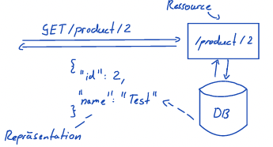

# REST

## Inhalt

- [Paradigma](#paradigma)
- [Datenformat](#datenformat)
- [Vorläufiges Fazit](#vorläufiges-fazit)

## Paradigma

## Datenformat

### REpresentational State Transfer

- Datenformat wird im Content-Type festgelegt.
  - JSON, XML, IMAGE, PDF, CSV, ...
  - Keine Begrenzung auf ein Datenformat

### Besonderheiten

- REST unterstützt Hypermedia

  - Verweis auf Ressourcen

- REST zieht noch weite Vorteile aus der Verwendung des HTTP-Protokolls
  - Z.B. Caching oder Inhaltsverhandlung

## Vorläufiges Fazit

Vorteile:

- Beliebige Formate
- Gut geeignet für binäre Inhalte

Nachteile:

- Kein vorgegebenes Format
- Kein "Standard-" Mapping auf Objekte
