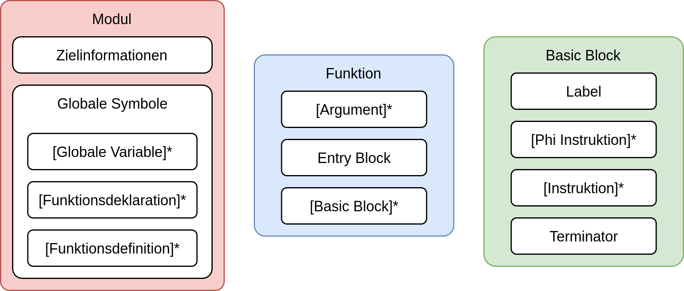
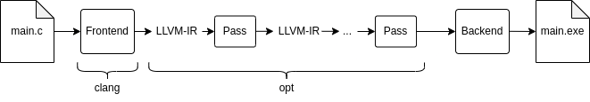

# Evaluierung der Anwendungsmöglichkeiten von Machine Learning gestützten Compiler-Optimierungsverfahren

## Motivation ##

Moderne Compiler sind in der Lage umfassende Optimierungen am Programmcode vorzunehmen (bspw.
das Löschen von nicht verwendeten Variablen, um die Größe des produzierten Binärcodes
zu reduzieren). Die hierbei eingesetzten Optimierungsverfahren basieren häufig auf
komplexen Heuristiken, die über viele Jahre entwickelt und parametriert werden.
Die Entwicklung und Wartung dieser Heuristiken setzt viel Expertise voraus und
ist daher sehr zeit- und kostenintensiv. Durch die Fortschritte in der Methode
des maschinellen Lernens im 21. Jahrhundert steigt daher das Interesse, diese Methode
auch auf Optimierungsprobleme im Compilerbau anzuwenden. Ein Beispiel hierfür
stellt das MLGO-Framework dar, welches das Training und den Einsatz von KI-Modellen
als Ersatz handgeschriebener Heuristiken in LLVM Optimierungspässen ermöglicht. [1]

## Wissenschaftliche Fragestellung

Folgende Aspekte sollen untersucht/erläutert werden:

- Wie funktioniert MLGO?
- Wie wird MLGO trainiert?
- Was kann mit MLGO optimiert werden?
- Wie wird MLGO in LLVM intergriert?
- Welchen Einfluss hat MLGO theoretisch auf Codegröße und Performanz?
- Welchen Änderungen der Codegröße lassen sich in der Praxis beobachten?


## Projektplanung ##

[Meilensteinplan](https://crocus-island-7de.notion.site/e698d92cbf0a476d8f044fe727f03ea3?v=29abe0d1019e4d908513bf765bc34eff)

## Hintergrund: Compiler und LLVM ##

Compiler sind komplexe Programme, deren Aufgabe die Übersetzung von (High Level)
Programmiersprachen in Maschinencode für eine spezifische Prozessorarchitektur ist.
Während dieses Übersetzungsprozesses werden häufig Optimierungsschritte vorgenommen,
die den Programmcode verändern, sodass der generierte Maschinencode kleiner, schneller
und energieeffizienter wird (zwischen diesen drei Zielen muss allerdings eine Balance
gefunden werden). [6]

Compiler werden allgemein in zwei Schichten unterteilt. Das sprachspezifische
Frontend, welches lexikalische, syntaktische und semantische Analysen vornimmmt und
das Backend, welches Optimierungsschritte vornimmt und Maschinencode generiert.
Die beiden Schichten sind mit den einzelnen beteiligten Phasen in der nachfolgenden
Abbildung anschaulich als zwei Seiten eines Bergs dargestellt. [6]

||
|:--:|
| *Abbildung 1: Überblick über unterschiedliche Kompilierungsphasen aus [2]* |

LLVM (**L**ow **L**evel **V**irtual **M**achine) ist ein Framework welches die
Implementierung eines Compilers erleichtert. Kern dieses Frameworks ist die
LLVM Intermediate Representation (LLVM-IR), die eine generische High Level
Maschinensprache repräsentiert, die an keine Zielarchitektur gebunden ist. [4]

Neben der Definition der LLLVM-IR beeinhaltet das LLVM Projekt viele Komponenten,
die das Compiler-Backend implementieren, unter anderem einen Optimierer, einen Linker
und die Generierung von architekturspezifischem Maschinencode. Diese Komponenten
operieren auf der LLVM-IR, sodass das generische Backend von dem sprachspezifischen
Frontend losgelöst ist. [4]

||
|:--:|
| *Abbildung 2: LLVM-IR Hierarchie (nach [3])* |

Die LLVM-IR ist hierarchisch aufgebaut (wie in der obenstehenden Abbildung dargestellt)
und wird in Module (entsprechen einer
Übersetzungseinheit des Programms), Funktionen und Basic Blocks aufgeteilt.
Basic Blocks enthalten die einzelnen Instruktionen des Programms, und eine Terminator-Operation,
welche einen bedingten oder unbedingten Sprung des Kontrollflusses in einen anderen
Basic Block erlaubt (innerhalb des Basic Blocks sind solche Sprünge nicht erlaubt). [7]

Der Optimierer (`opt`) ist modular aufgebaut. Die einzelnen Optimierungsverfahren
(bspw. Constant-Propagation oder Dead-Code Elimination) sind in isolierten Optimierungspässen
realisiert, welche von einem PassManager aufgerufen werden. Die Optimierungspässe können
für verschiedene Optimierungslevel auf unterschiedliche Arten
kombiniert werden (hierbei ist allerdings darauf zu achten, dass die Reihenfolge
der Optimierungspässe starke Auswirkungen auf die Optimierungsergebnisse haben kann). [8]

Optimierungen können grob in lokale und globale Optimierungen unterteilt werden.
Lokale Optimierungen arbeiten in den Grenzen einzelner Basic Blocks, während globale
Optimierungen über diese Grenzen hinaus (und teilweise auch über die Grenzen von Funktionen
hinaus arbeiten).
Während der gesamten Optimierungsphase verwaltet LLVM den Programmfluss in einem
Graphen, welcher durch die Sprung-Operationen der Basic-Blocks bestimmt wird (auch Calling
Graph genannt). [6]

Der C und C++ Compiler `clang` ist ebenfalls Teil des LLVM Projekts und nutzt den
zuvor beschriebenen modularen Ansatz, um wie im untenstehenden Bild schematisch dargestellt,
eine C-Quelldatei in ein ausführbares Programm zu übersetzen.

||
|:--:|
| *Abbildung 3: LLVM Toolchain am Beispiel von clang (nach [3])* |


## Inlining Pass ##

Es ist gängige Praxis im Software Engineering, oft verwendete Programmlogik in
Funktionen auszulagern. Hierdurch wird Progrmamcode übersichtlicher, leichter zu
warten und zu erweitern. Allerdings erfordern Funktionaufrufe zur Laufzeit einen
gewissen Overhead (Anlegen eines neuen Stack-Frames, Kopieren der Parameter, Registerrestaurierung
nach Funktionsende, etc.). Zusätzlich wird der Calling Graph durch Funktionsaufrufe
deutlich komplexer, was globale Optimierungen erschwert. Das globale Optimierungsverfahren
des Funktionsinlining behandelt diese Probleme, indem der Funktionscode direkt
an die Stelle des Funktionsaufrufs kopiert wird. Die Stelle im Progammcode, an der
eine Funktion aufgerufen wird, wird auch Callsite der Funktion genannt. [5]

Durch das Inlining einer Funktion können neue Probleme entstehen, bspw. müssen
Namenskonflikte zwischen den in der Funktion deklarierten Variablen und den Variablen
der Umgebung der Callsite aufgelöst werden. Darüber hinaus ist das Inlining einer Funktion
Teil des Speicherplatz/Programmlaufzeit-Tradeoffs, da durch Inlining einer Funktion mit
vielen Operationen potenziell die Größe der erzeugten Binärdatei stark ansteigen
kann (unter Umständen exponentiell [6]).
Die Entscheidung, wann Funktionsinlining ausgeführt werden soll, ist daher nicht
trivial und erfordert Wissen um die Umgebung der Callsite und die Funktion selbst. [5]

Das LLVM Inlining Pass nutzt viele Heuristiken, um zu beurteilen,
ob das Inlining für einen bestimmten Funktionsaufruf positive Auswirkungen hat.
Hierfür wird beispielsweise ein "Kostenwert" berechnet, der durch den Aufruf von
Cleanup-Pässen oder die Vereinfachung des Callgraph entsteht, falls ein Funktionsaufruf
geinlined wird, indem das Inlining simuliert wird.
Der Kostenwert wird mit einem Grenzwert verglichen, welcher wiederum von Faktoren
wie "Callsite hotness" (wie oft die Callsite durchlaufen wird) und Anzahl der
Basic Blocks im Funktionsrumpf bestimmt wird. Selbst wenn die so berechneten Kosten und
der Grenzwert für das Inlining sprechen, können evtl. bessere Ergebnisse erzielt
werden, falls kein Inlining des betrachteten Funktionsaufrufs vorgenommen wird, sondern
eine Callsite geinlined wird, die an höherer Stelle im Callgraph liegt. [1]


## Machine Learning Guided Compiler Optimizations Framework (MLGO)

Mit dem MLGO-Repository können KI-Modelle trainiert werden, welche dann in LLVM
integriert werden.

MLGO besteht aus zwei Teilen:

- Innerhalb von LLVM werden die KI-Modelle für Optimierungen genutzt.
Dazu gibt es allgemeinen Code in LLVM, z.B. in [MLInlineAdvisor.cpp](https://github.com/llvm/llvm-project/blob/main/llvm/lib/Analysis/MLInlineAdvisor.cpp).
Dieser Code ist in so fern allgemein, als dass kein trainiertes KI-Modell im
Source Code von LLVM enthalten ist. Erst beim Kompilieren von LLVM wird ein
konkretes Modell in LLVM eingebaut.
- Training von KI-Modellen, dieser Code liegt im [MLGO-Repository](https://github.com/google/ml-compiler-opt)

Der Rest dieses Abschnitts fasst Reinforcement Learning in MLGO zusammen. Dabei wurde das
Paper [MLGO: a Machine Learning Guided Compiler Optimizations Framework](https://arxiv.org/abs/2101.04808) als Quelle genutzt.

### Reinforcement Learning in MLGO ###

Bei Reinforcement Learning werden Agenten betrachtet, welche Entscheidungen treffen. Die Entscheidungen können als positiv oder negativ bewertet werden, was zum Anpassen des Agenten genutzt wird.
Im Falle von MLGO ist der Compiler der Agent. Der Compiler führt entweder Inlining
für einen Funktionsaufruf durch oder nicht. Je nachdem, ob sich Inlining als
gute Entscheidung oder als Fehler erwiesen hat, wird der Agent angepasst.
Eine Code-Basis wird vom Agenten immer wieder kompiliert, bis möglichst gute Taktiken gefunden wurden.

Das Problem wurde als Markov-Decision-Process (MDP) modelliert. Beim MDP gibt es
Zustände, deren Übergänge mit Wahrscheinlichkeiten versehen sind. Zudem gibt es
eine Reward-Funktion. Der Agent führt Aktionen aus.
Die Umgebung befindet sich an einem Zeitpunkt *t* in einem bestimmten Zustand *s(t)*
und der Agent führt eine Aktion *a(t)* aus. Der Agent erhält eine Belohnung durch die
Reward-Funktion *R(s(t), a(t))*. Der nächste Zustand *s(t+1)* wird mit Hilfe einer
Wahrscheinlichkeisdistribution ausgewählt, welche vom Zustand und der Aktion des
Agenten abhängt, d.h. *P(s(t+1) | s(t), a(t))*. Es werden solange Aktionen ausgeführt,
bis ein Endzustand erreicht ist.
Der Agent ist so modelliert, dass dieser eine (weitere) Wahrscheinlichkeitsdistribution
nutzt, um die nächste Aktion im aktuellen Zustand auszuwählen, *pi = Pr(a(t) | s(t))*.
Die Funktion *pi* ist durch ein neuronales Netz gegeben. Ziel des Agenten ist es,
die Belohnung insgesamt *R = \Sigma_{t=0}^T R(s(t), a(t))* zu maximieren. Dazu wird
der Gradient von *R* mittels Monte-Carlo-Methoden approximiert und das Gradient Ascent Verfahren durchgeführt.
Die Reward-Funktion ist theoretisch so modelliert, dass bei keinem Inlining die
Belohnung 0 ist und bei Inlining die erreichte Größenreduktion der beteiligten
Funktionen ist. Die tatsächlich erreichte Größenreduktion wird erst in einer späteren
Phase des Compilers ersichtlich, so dass hier zum Training 11 Features verwendet
werden, um das theoretisch gewünschte *R(s, a)* zu approximieren:
- caller_basic_block_count
- caller_conditionally_executed_blocks
- caller_users
- callee_basic_block_count
- callee_conditionally_executed_blocks
- callee_users
- callsite_height
- cost_estimate
- number_constant_params
- edge_count
- node_count
Diese Features entsprechen in etwa den Informationen, die die bisherigen Heuristiken verwenden.
Anstatt *R(s, a)* zu approximieren, kann die insgesamte Belohnung *R* verwendet
werden, weil diese sich nach der Kompilierung einfach aus der Größe der kompilierten
Binärdatei ergibt. Es wurde sich im Paper dagegen entschieden dieses zu verwenden,
weil mehr Daten für die gleiche Performanz notwendig gewesen wären und trotzdem keine bessere Qualität des Modells garantiert ist.

Um das Training zu verschnellern, wird *pi* nicht zufällig initialisiert, sondern
mittels eines Cloning-Algorithmus so initialisiert, dass die bisherigen LLVM-Inlining-Heuristiken nachgebildet werden.

### Evolution in MLGO ###

Bei diesem Ansatz wird anstatt der insgesamten Belohnung *R* eine geglättete Version
von *R* maximiert. Die Belohnung *R* hängt von den Parametern *theta* des Modells *pi* ab.
Anstatt *R(theta)* zu maximieren, wird auch die Umgebung von *theta* betrachtet,
d.h. naheliegende Werte für *theta*. Dabei wird die Größe *epsilon* der Umgebung
durch eine Multivariable-Normal-Distribution bestimmt sowie mit einem weiteren
Faktor *sigma*. Die so zu maximierende Funktion wird *J(theta)* genannt.
Wie bei Reinforcement Learning, werden Monte-Carlo-Methoden genutzt, um *J(theta)* zu approximieren.


## LLVM Build System

LLVM umfasst mehrere Komponenten. Für die weiteren Untersuchungen wird Clang verwendet. Clang ist der LLVM-Compiler für C/C++.

Wie LLVM gebaut wird, wird in [*Getting Started with the LLVM System*](https://llvm.org/docs/GettingStarted.html) beschrieben.
LLVM benutzt [CMake](https://cmake.org/) zum Konfigurieren. Mit CMake können
Ninja-Build-Dateien, Makefiles sowie Visual Studio und XCode-Projekte erstellt werden.
Beim Aufruf von CMake können Konfigurations-Parameter mitgegeben werden.

### Bauen mit Docker

Hier wird LLVM innerhalb eines [Docker](https://www.docker.com/)-Containers gebaut.
Dadurch kann die kompilierte LLVM-Toolchain überall benutzt werden. (Docker ist für Linux, Windows und MacOS verfügbar.)

Ein Docker-Container wird mittels eines Dockerfiles erstellt. Das von uns erstellte
Dockerfile ist [hier](https://github.com/mwithoeft/SGSE22/blob/main/praktikum/reinsch_raitzig/Dockerfile) hinterlegt.

Der Container kann mit folgendem Befehl erstellt werden (wenn man sich im gleichen Ordner wie das Dockerfile befindet):
```bash
docker build . -t llvm-mlgo
```

Der Container kann dann z.B. mit folgendem Befehl gestartet werden:
```bash
docker run --rm -it llvm-mlgo
```

### Beschreibung des LLVM-Builds
Das Bauen besteht aus folgenden Schritten:

- Es wird die zum Bauen benötigte Software installiert. Die umfasst Clang (Version 12) als Compiler und [Tensorflow](https://www.tensorflow.org/) als Machine Learning Framework für MLGO.
- Clang wird als System-Compiler (an Stelle von GCC) konfiguriert.
- Die LLVM-Sources werden heruntergeladen und die neueste stabile Version (Version 14) ausgecheckt.
- Tensorflow wird so konfiguriert, wie es für MLGO zum Bauen von LLVM nötig ist.
- Mit CMake wird LLVM konfiguriert. LLVM wird mit allen Komponenten gebaut, die zur Kompilation wie Firefox notwendig sind, wie z.B. WebAssembly-Support. Hier werden Makefiles generiert.
- LLVM wird gebaut und installiert.
[LLVM kompilieren](praktikum/reinsch_raitzig/llvm-compile.md)

## Einfluss von MLGO auf die Größe von Binaries

Es wurde untersucht, welcher Einfluss die Benutzung von MLGO auf die Größe der kompilierten Programme (Binaries) hat.

### MLGO beim Einsatz von LLVM/Clang

Beim Clang kompilieren mit Clang können unterschiedliche Optimierungsstufen eingestellt werden. Dabei ist `-Oz` die Option, die hinsichtlich Code-Größe optimiert.

MLGO wird standardmäßig nicht benutzt und kann mit `-mllvm -enable-ml-inliner=release` aktiviert werden.

### Bash-Script

Das Kompilieren der Programme wurde mit dem [hier](https://github.com/mwithoeft/SGSE22/blob/main/praktikum/reinsch_raitzig/mlgoscript.sh) verfügbaren Bash-Script durchgeführt. Es kann in dem [hier](praktikum/reinsch_raitzig/llvm-compile.md#Bauen-mit-Docker) beschriebenen Docker-Container ausgeführt werden.

Neben diesem Script ist auch noch eine Konfigurationsdatei für das Bauen des Linux-Kernels notwendig. Diese kann [hier](https://github.com/mwithoeft/SGSE22/blob/main/praktikum/reinsch_raitzig/linuxconfig) gefunden werden und muss unter `/linuxconfig` im Container hinterlegt werden.

Das Bash-Script kann z.B. unter dem Namen `mlgoscript.sh` gespeichert werden und wrid wie folgt ausgeführt:
```bash
chmod +x mlgoscript.sh
. mlgoscript.sh
```

Nach dem Ausführen werden die Größen der Binaries ausgegeben. Sie werden zudem in die Text-Datei `~/sizes.txt` geschrieben.

Das Script ist so aufgebaut, dass die einzelnen Programme einzeln kompiliert werden können. Z.B. kann nur Thunderbird kompiliert werden, indem der entsprechende Abschnitt des Scriptes ausgeführt wird.


### Ergebnisse

Um den Einfluss von MLGO zu untersuchen, wurden mehrere Programme einmal nur mit `-Oz` und einmal mit `-Oz` sowie `-mllvm -enable-ml-inliner=release` kompiliert.

Die Ergebnisse sind in folgender Tabelle zusammengefasst. Die Größen sind jeweils in Bytes:

| Programm                                                             | nur `-Oz` | `-Oz` und MLGO | Verkleinerung durch MLGO in % |
| -------------------------------------------------------------------- | --------- | -------------- | ----------------------------- |
| [VLC media player](https://www.videolan.org/vlc/)                    | 21168     | 21168          | 0                             |
| [Firefox](https://www.mozilla.org/en-US/firefox/) (nur Haupt-Binary) | 5995576   | 5752536        | 4,05                          |
| Firefox (inklusive Bibliotheken)                                     | 69531415  | 68351749       | 1,70                          |
| [Thunderbird](https://www.thunderbird.net/) (nur Haupt-Binary)       | 5969976   | 5727176        | 4,07                          |
| Thunderbird (inklusive Bibliotheken)                                 | 105529227 | 103787207      | 1,65                          |
| [Linux Kernel](https://www.kernel.org/)                              | 568156016 | 568156016      | 0                             |
| [jp2a](https://github.com/Talinx/jp2a)                               | 57976     | 57976          | 0                             |

Teilweise sind durch MLGO (zu `-Oz` zusätzliche) Größenreduktionen im einstelligen Prozentbereich sichtbar.
Ob die Größe der Binaries durch MLGO reduziert werden kann, hängt allerdings stark vom jeweiligen Projekt ab.

## Projekt-Retrospektive ##

Ursprünglich war der Scope des Projekts so ausgelegt, dass ein bisher nicht von
MLGO behandelter Optimierungspass durch ein vollständig neu trainiertes KI-Modell
erweitert werden sollte (der [GreedyRegAlloc Pass](https://llvm.org/devmtg/2018-04/slides/Yatsina-LLVM%20Greedy%20Register%20Allocator.pdf)). Für diesen
Pass sollte anschließend der Effekt auf die Binärdateigröße mit WebAssembly als
Zielarchitektur evaluiert werden.
Das Aufsetzen
der Entwicklungsumgebung für LLVM mit MLGO hat allerdings bereits viel Zeit in Anspruch
genommen. Der nächste Schritt des Feature-Engineerings setzt natürlicherweise
ein tiefes Verständnis der Funktionsweise eines Optimierungspasses voraus. Der hiermit
verbundene Aufwand wurde allerdings zum Projektbegin massiv unterschätzt. Erschwerend
kommt hinzu, dass viele große WebAssembly Projekte, die zur Evaluierung genutzt
werden könnten, sehr komplexes Buildtooling verwenden (bspw. das emsdk). Die Integration
einer eigens gebauten LLVM-Version hat sich als sehr komplex herausgestellt.

Um allerdings trotzdem Ergebnisse vorweisen zu können, wurde das Projekt derart
rescoped, dass ein fertig trainiertes MLGO KI-Modell verwendet wird, um die Effektivität
bezüglich verschiedener Softwareprojekte zu beurteilen. Da es sich teilweise um
Projekte mit komplexen Toolchains handelt, in deren Build-Prozesse eine mit MLGO
kompilierte LLVM-Version eingebettet werden muss, blieb nur Zeit für die Evaluierung
weniger Projekte.

## Quellen

[1]: MLGO https://arxiv.org/abs/2101.04808
[2]: Nystrom https://craftinginterpreters.com/a-map-of-the-territory.html
[3]: Bridgers https://llvm.org/devmtg/2019-04/slides/Tutorial-Bridgers-LLVM_IR_tutorial.pdf
[4]: LLVM https://llvm.org/
[5]: Mekkat https://www.cs.cornell.edu/courses/cs6120/2019fa/blog/llvm-function-inlining/
[6]: Aho Compilers - Principles, Techniques and Tools
[7]: LLVM-IR https://llvm.org/docs/LangRef.html
[8]: LLVM-opt https://llvm.org/docs/CommandGuide/opt.html
