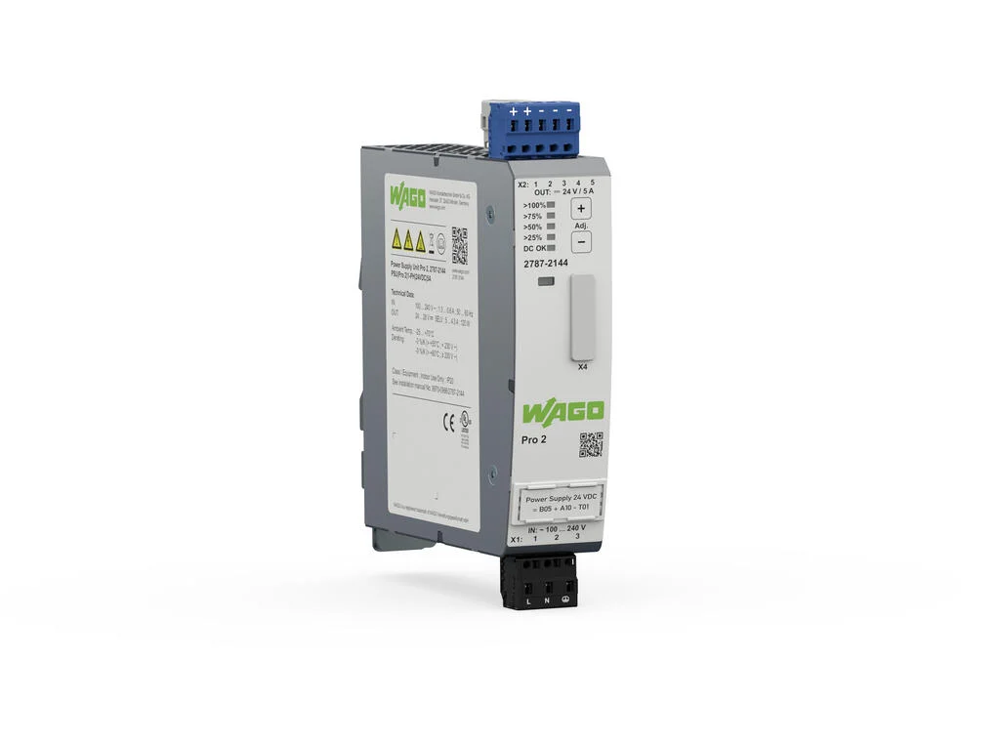

# Prototypische Implementierung und Evaluierung
Im Folgenden wird nun die prototypische Implementierung des entwickelten Konzeptes beschrieben. Anschließend wird der entwickelte Prototyp evaluiert.
## Prototypische Implementierung

### Verwendete Hardware
Für die Implementierung ist folgende Hardware verwendet worden:
Zur Kommunikation über BLE Mesh und zum aufnehmen der Daten sind die ESP32-WROOM-UE-Mikrocontroller von Espressif verwendet worden:
_0.png)

Abbildung 1: Bild eines DevKits für den ESP32-WROOM-UE [9]

Dieser hat folgende Eigenschaften:
 - Dual Core Xtensa LX6 Prozessor mit 240 MHz
 - 520 kB SRAM
 - 4 MB SPI Flash

[10]

Als Sensor / Aktor sind Spannungsversorgungen der WAGO Pro2-Serie verwendet worden, genauer die WAGO 2787-2144 mit 24 V Ausgangsspannung und einer Maximalen Leistung von 5 A.

Abbildung 2: WAGO 2787-2144 Pro2 Spannungsversorgung [11]

Diese Spannungsversorgungen bieten eine Kommunikationsschnittstelle, über die eine via Modbus RTU mit dem Gerät kommuniziert werden kann. Darüber können  verschiedene Messwerte wie z.B. Spannung oder Strom abgerufen werden, aber z.B. auch die Ausgangsspannung justieren oder ganz abschalten.

[11]

### Vorgehen
Für die Umsetzung 3 ESP32-Mikrocontroller verwendet worden. Einer davon soll als Provisioner verwendet werden und die anderen Beiden sollen als Sensor / Aktor verwendet werden und dafür mit jeweils einer WAGO 2787-2144 verbunden werden. Die Programmierung erfolgte über das ESP-IDF, ein von Espressif bereitgestelltes SDK zum Programmieren der Mikrocontroller.

Zuerst ist der Provisioner implementiert worden. Dieser hat relativ wenige Aufgabe: Er fängt nach dem Booten automatisch mit dem formen des Netzwerks an. Außerdem sollen alle Übertragenen Daten gesammelt und an einen Computer weitergeleitet werden. Dafür wird dieser via USB mit einem Computer verbunden. Für das Formen des Netzwerks mussten ein Netzwerk- und ein Application-Key generiert werden und auf dem Provisioner hinterlegt werden. Der Provisioner verteilt diese dann an die einzelnen Geräte, sodass diese miteinander Kommunizieren können.

Anschließend sind die tatsächlichen Geräte implementiert worden. Dabei ist eins der Geräte als Sensor und das andere als Aktor implementiert worden. Für den Prototypen sind den beiden Geräten die zu Messenden / Schaltendenden Werte fest zugewiesen worden: Das Sensor-Gerät überwacht die Ausgangsspannung des einen Netzteils. Diese kann über Tasten am Gerät selber manuell eingestellt werden und bietet sich daher zum überwachen an, da sie für Testzwecke relativ einfach verändert werden kann. Das Aktor-Gerät schaltet bei der anderen Spannungsversorgung die Ausgangsspannung an oder aus. Dies kann einfach gemessen werden und ist daher ebenfalls ideal für den Prototypen. 

Da für die Implementierung nicht mehr viel Zeit zur Verfügung stand, sind nicht alle Funktionen aus dem Konzept implementiert worden. Die regelmäßigen Messwerte sind vollständig implementiert, allerdings werden von den ESPs fest UInt32-Werte Übertragen. Da die Identifikation / Information der Geräte für den Prototypen unwichtig ist wurde diese Funktionalität noch gar nicht implementiert. Die Konfiguration der Automatisierung ist ebenfalls nur im Ansatz implementiert, für den Sensor ist nur der Schwellwert-Schalter implementiert. Der Aktor kann ebenfalls nur An / Aus schalten und kann nur auf einen Sensorwert zugreifen. Die Konfigurationen dafür können bereits über das Netz übertragen werden, sind aber statisch im Provisioner hinterlegt und werden den Geräten geschickt, sobald diese verbunden sind. Dies ist zum Testen des Prototypen ebenfalls ausreichend.

### Probleme bei der Umsetzung
Von dem entwickelten Konzept konnten nicht alle Funktionen implementiert werden, hauptsächlich aus Zeitgründen. Der Stand zur Abgabe dieser Arbeit ist in folgender Tabelle zusammengefasst:
 Funktion | Implementiert | Details
 --- | --- | ---
 Messwerte | + | Vollständig
 Aktor-Daten | + | Vollständig
 Geräte-Identifikation | - | Noch nicht angefangen
 Geräte-Information | - | "
 Value-Identifikation (Beide) | - | "
 Konfiguration Geräte-Daten | - | "
 Konfiguration Value-Daten | -  | "
 Konfiguration Automatisierung Sensor | ~ | Nur für Schwellwerte implementiert (automationType = 0x01). Abfrage nicht implementiert.
 Konfiguration Automatisierung Aktor | ~ | Erlaubt nur das Verwenden von einem Sensor-Wert. Außerdem nur An / Aus möglich, analoge Werte und bleMeshConfigActorOutput sind genauso wie das abrufen der Konfiguration nicht implementiert. Die Operatoren sind implementiert, aber wenig sinnvoll, da der Akkumulator mit 0 Initialisiert wird. Die Skalierung der Werte wird ebenfalls noch nicht unterstützt.

Tabelle 1: Stand des Prototypen zum Abgabezeitpunkt. '-' -> nicht Implementiert, '~' -> Unvollständig Implementiert, '+' -> voll Implementiert

Die Konfiguration der einzelnen Geräte wird aktuell statisch im Provisioner hinterlegt, es ist nicht möglich diese im laufendnen Betrieb zu ändern. Es gibt außerdem keine Konfigurationsoberfläche mit der diese unkompliziert angepasst werden könnte.

Mit der prototypischen Implementierung ist also ein Grundgerüst geschaffen worden mit dem eine Einfache Automatisierung möglich ist und die getestet werden kann. Es sind allerdings keine Komplexen Automatisierungslösungen umsetzbar, zum Einen da die Automatisierung im Aktor nur das Verwenden von einem Wert erlaubt und zum Anderen da insgesamt nur 3 Geräte vorhanden sind.
## Tests
Um den Prototypen evaluieren zu können muss dieser zunächst getestet werden. Dafür wurden 5 verschiedene Tests entwickelt, die verschiedene Aspekte der Implementierung testen sollen:

 - Datenrate: Zum Testen der Datenrate wird eine Modifizierte Firmware sowohl auf dem Provisioner als auch auf einem der beiden Pro2-ESPs verwendet. Dabei wird, nachdem das Netz aufgebaut ist, von dem Pro2-ESP ein spezielles, großes Paket mit der Maximalgröße von 378 Byte versendet. Der Pro2-ESP wir dabei ebenfalls über das USB-Kabel mit dem Computer verbunden und sendet eine Nachricht sobald das Paket abgeschickt worden ist. In dem großen Datenpaket ist eine Checksumme enthalten, um dieses nach dem Empfang prüfen zu können. Der Provisioner schickt ebenfalls eine Nachricht an den Computer sobald er ein gültiges Paket erhalten hat. Durch das messen der Zeitdifferenz dieser Pakete kann die Datenrate ermittelt werden. Für den Versuch werden die die Beiden Teilnehmer in einem Abstand von einem Meter zueinander platziert.
 - Latenz: Für den Latenz-Test wird der gleiche Aufbau wie beim Datenraten-Test verwendet, die Firmware wird dabei allerdings etwas angepasst: Es werden nur leere Datenpakete geschickt. Dadurch kann die Latenz beim Empfangen und Senden der Daten ermittelt werden. Vermutlich sind die mit dem Computer gemessenen Werte allerdings wenig aussagekräftig, da durch das Betriebssystem und durch andere Prozesse bereits ein gewisser Overhead da ist, der die Messwerte verfälschen kann.
 - Integrität: Für den Integritätstest wird die Firmware des Datenraten-Tests wieder etwas modifiziert: Hier werden vom Provisioner jetzt die Anzahl der ungültigen Pakete gezählt. Ansonsten bleibt der Aufbau gleich. Am Computer kann diese Anzahl jetzt über einen gewissen Zeitraum überwacht werden, um eine Mittlere Ausfallrate zu berechnen
 - Mesh-Eigenschaft: In diesem Test soll die Mesh-Eigenschaft des Netzes getestet werden. Dafür wird mit den 3 ESPs ein Linien-Netz gebildet, wobei der Provisioner an einem Ende der Linie ist und das Gerät am anderen Ende außerhalb der Funkreichweite des Provisioners ist. Dann wird überprüft ob trotzdem eine Verbindung mit dem Weiter vom Provisioner entfernte Gerät besteht.
 - Resilienz: Mit dem Resilienztest soll die Fähigkeit des Netzes getestet werden, sich selbst zu reparieren wenn ein Gerät ausfällt. Dafür werden alle 3 Geräte mit der normalen Firmware verwendet. Diese werden in einer Linie Aufgebaut, sodass die Daten von einem Pro2-ESP von dem anderen weitergeleitet werden müssen. Allerdings muss der abstand klein genug sein, dass beide Pro2-ESPs noch mit dem Provisioner kommunizieren können. Anschließend wird in 2 Tests einmal der mittlere Pro2-ESP abgeschaltet und das andere mal der Provisioner. Dabei wird geschaut ob und wie die Kommunikation der verbleibenden Geräte dadurch gestört wird.

Mit diesen Tests wurden folgende Ergebnisse erzielt:
 - Datenrate: 
 - Latenz: Die Messung der Latenz liefert, wie bereits vermutet, aufgrund des Overhead durch Betriebssystem u.ä. stark gestreute Werte. Im Durchschnitt ergibt sich dabei ein Wert von etwa 5 ms.
 - Integrität: Die Durchführungsdauer des Integritätstest lag bei einer Stunde. In dieser Zeit wurden XX Pakete übertragen, von denen keins Fehlerhaft gewesen ist. Der Wert deckt sich mit der ermittelten Datenrate, weswegen ich vermute dass tatsächlich alle Pakete in Ordnung gewesen sind. Allerdings kann es auch sein, das kaputte Pakete bereits direkt vom Bluetooth-Stack des ESP verworfen werden, wodurch diese mit dieser Methode nicht erkannt werden würden.
 - Mesh-Eigenschaft: Das Gerät außer Reichweite kann mit dem Provisioner kommunizieren, das Gerät in der Mitte leitet die Pakete also erfolgreich weiter. Nachdem das Gerät in der Mitte abgeschaltet worden ist konnte nicht länger mit dem anderen Gerät kommuniziert werden, es befand sich also außer Reichweite.
 - Resilienz: Wenn das Mittlere Gerät abgeschaltet wird, werden die Nachrichten des entfernteren Geräts weiterhin ohne Verzögerung vom Provisioner empfangen. Das Ausschalten des Provisioners unterbricht die Kommunikation der anderen beiden Geräte nicht, da der Provisioner nur zum Aufbau des Netzes benötigt wird, nicht zum aufrecht erhalten der Kommunikation.

## Fazit und Ausblick
Alles in Allem kann gesagt werden, dass die prototypische Implementierung das entwickelte Konzept nicht komplett erfüllt, da die Sensorwert-Verarbeitung in Sensor und Aktor aktuell noch recht simpel aufgebaut ist. Auch sind die spezifizierten Informations- und Identifikations-Daten nicht implementiert, da diese für den direkten Datenaustausch nicht notwendig gewesen sind. Hier ist also weitere Arbeit nötig.

Allerdings sind die Testergebnisse zufriedenstellend, es wird eine relativ hohe Datenrate mit einer vermutlich geringen Latenz erreicht. Auch die Mesh-Eigenschaft ist erfüllt und das gebildetet Netz ist Resilient gegenüber ausfällen von Teilnehmern. Außerdem werden die Daten fehlerfrei zwischen den Geräten übertragen. Anhand der Testergebnisse kann man sehen, dass es sich lohnt dieses Thema weiter zu bearbeiten.

Im weiteren Verlauf müssten zunächst weitere Geräte aufgebaut werden, um das Verhalten in einem größeren Mesh-Netz zu testen. Außerdem müssten die fehlenden Funktionen aus dem Konzept implementiert werden und die unvollständigen Funktionen vervollständigt werden. Im Anschluss bietet es sich außerdem an eine Konfigurationsoberfläche zu Implementieren, mit der die einzelnen Geräte einfach konfiguriert werden können, sodass dies nicht mehr beim Kompilieren geschehen muss.