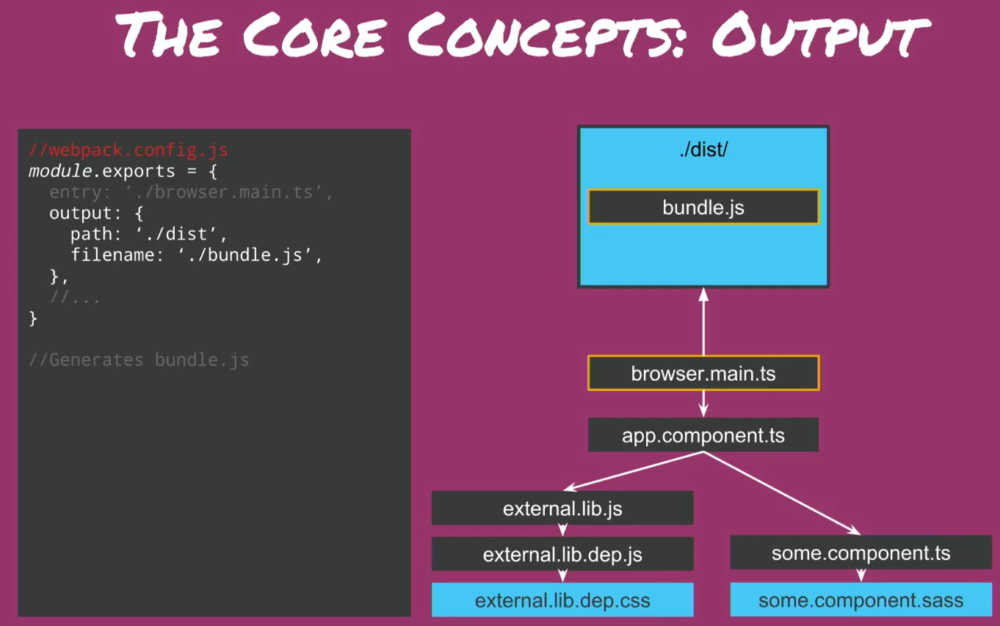
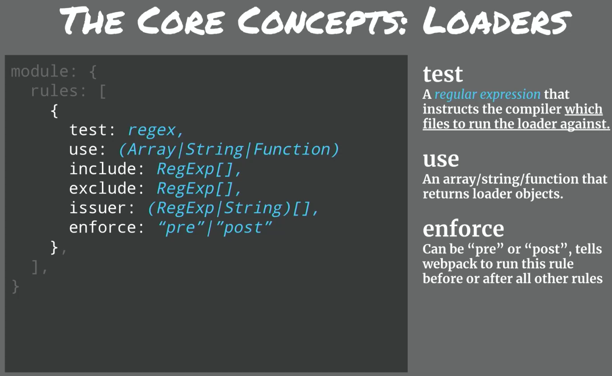

# Allgemein

- Dritt meist genutzte JavaScript Bibliothek bei Microsoft
- [Repository](https://github.com/thelarkinn/webpack-workshop-2018)
- [Webpack 4 Fundamentals Slides](https://docs.google.com/presentation/d/1hFtMCMo62DgOIc-9OwgaVwPZHwv1cgMELArHcMbXlSI/edit#slide=id.g15e96ef847_0_0)
- [Web Performance with Webpack Slides](https://docs.google.com/presentation/d/1FW3GT9Ww1S6SEGu8HAO5eRZUFggfVuFE2ievNCDWVDo/edit#slide=id.g376e8d6b61_0_4)
- [Webpack Loaders and Plugins](https://github.com/webpack-contrib)

## Entry

- Der Anfang der Kette von Dateien
- Die Wurzel von einen Tree
- Kernaussage
  - Webpack muss wissen **welche** Dateien vom Browser geladen werden müssen
  - Ergänzt die **Ausgabe**eigenschaft

## Output

- Der erhaltene Graph muss von webpack verarbeitet und in ein Bundle erstellt werden
- In der Config wird angegeben
  - Pfad für die Ausgabe
  - Dateiname der Ausgabe
- Kernaussage
  - Webpack muss wissen **wo** und **wie** die Bündle verteilt werden
  - Arbeitet mit dem Entry

## Loaders + Rules

- Webpack kann angegeben werden, wie bestimmte Dateien modifiziert werden **bevor** diese zu dem Abhängigkeitsgraphen hinzugefügt werden
- Kernaussage
  - Webpack muss wissen **wie** Dateien interpretiert und übersetzt werden
  - Auf Dateibasis transformiert, bevor dem Abhängigkeitsdiagramm hinzugefügt wird

## Plugins

- Plugins können verwendet werden, um bestimmte Aktionen auszulösen bei bestimmten Events von webpack
- Plugins sind dann hilfreich, wenn im lifecycle von webpack etwas bestimmtes geschehen soll
- Kernaussage
  - Fügt Zusammenstellungen zusätzlicher Funktionen hinzu (optimierte gebündelte Module).
  - Leistungsfähiger mit mehr Zugriff auf CompilerAPI.
  - Hat alles andere, was jemals in webewollt ist

## Ziele

## Code Splitting

- Ist ein Prozess wo einzelne Teile des Codes in async chunks aufgeteilt werden und das während build Time
- 2 Typen
  - Static
  - "Dynamic"

### Static

- Wann?
  - Bei "Heavy" JavaScript
  - Irgendwas Temporal
    - Das was nicht sofort zu sehen ist
      - Modal
      - Tooltip
      - Dialog
  - Routes
    - Nur die Sachen laden für die jeweilige Seite

### "Dynamic"

- Wann?
  - AB Testing
  - Theming (Beispiel)
  - Convenience (Bequemlichkeit)
- Wie?
  - Ähnlich wie Static nur das die Datei, die importiert werden soll, dynamisch geladen wird
    - `` const getFooter = (footerName) => import ("./${footerName}");``
  - Aufruf Beispiel, die if-Abfrage kann auch eine Event (onClick, etc.) sein
    - ``if (window.feeling.footer1) { getFooter("footer1").then...} else if (window.feeling.footer2) { getFooter("footer2").then...}``

- Webpack nimmt alle Dateien aus dem statischen Pfad und bildet daraus einzelne chunk Dateien

#### Magic Comment

- Beim dynamischen Import werden alle Dateien zu eigenen bundle-Dateien
- Dadurch entstehen extrem viele nicht aussagene Dateinamen
- Schlecht für debuggen
- Dafür sind Magic Comments
- Mit Kommentaren können die Namen der Bundles angegeben werden
  - ``/* webpackChunkName: "footer" */``
- Dafür müssen bestimmte Konfigurationen angegeben werden
  - In der ``webpack.config.js`` beim **output**
    - ``chunkFilename: "[name].lazy-chunk.js``
      - Ein Beispiel
- Es gibt verschiedene Modis die angegeben werden können
  - ``webpackMode: "lazy-once"``
  - Dadurch werden alle Bundles aus diesem Verzeichnis von der Datei in einem Bundle gepackt und nicht jede Datei einzeln
  - Nützlich für den development, da dadurch die build time reduziert werden kann

##### Prefetch & Preload

- Können mit in dem Kommentar angegeben werden
- Dadurch können Dateien, während der Browser im idle Modus ist, heruntergeladen werden

## weitere
- benötigt nodejs
- 2012
- MIT
- 14 Mio dowlaods pro woche
- frontend gedacht
- nodejs möglich

## bulding nodejs

https://medium.com/the-andela-way/how-to-set-up-an-express-api-using-webpack-and-typescript-69d18c8c4f52

npm install --save-dev webpack

### webback.config.js

const path = require('path');
const {
  NODE_ENV = 'production',
} = process.env;
module.exports = {
  entry: './src/index.ts',
  mode: NODE_ENV,
  target: 'node',
  output: {
    path: path.resolve(__dirname, 'build'),
    filename: 'index.js'
  },
  resolve: {
    extensions: ['.ts', '.js'],
  }
}

### package.js

"scripts": {
  "build": "webpack"
}
