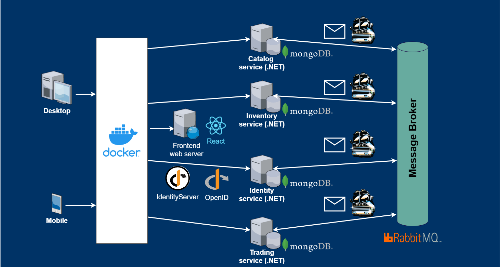

## Artem Shipilov

# Azure Services für Microservice. Vergleich mit Google Cloud Services and Amazon Services.
* Azure Key Vault
* Azure Kubernetes Service
* Azure Service Bus
* Azure Container Registry

# API-Gateway für Microservices. Vergleich von Azure, Amazon, Kong Gateway.
* Vorteile eines API-Gateways
* Security
* Authentifizierung, Autorisierung und Fehlertoleranz
* Protocol Adaptor

# Aufbau eines Testprojekts mit Integration von Cloud-Service und API-Gateway

# 1. Einführung

## Zweck dieser Studie:
1. Herausfinden, wie Cloud-Ressourcen zum Aufbau einer Microservice-Architektur verwendet werden können.
2. Die Hauptvorteile der drei wichtigsten Anbieter von Cloud-Ressourcen (Azure Services, Google Cloud Services und Amazon Services) kennen.
3. Herausfinden, welche Module zum Aufbau von Microservices benötigt werden und erfahren, wie diese Module in der Praxis am Beispiel mindestens eines Cloud-Ressourcenanbieters funktionieren
4. (Optional) Untersuchen die Betriebskosten einer Microservice-Architektur für ein Unternehmen.

# 2.	Theoretische Grundlagen

In Zeiten der Digitalisierung sind die Organisationen von deren digitalen Evolution abhängig. Je weiter diese digitale Evolution ist, desto besser kann die Firma auf dem Markt behaupten. Das Überdenken bestehender Geschäftszweige ist ein wichtiger Schritt dieser Prozess. Wenn die Softwarearchitektur leicht zu verstehen, zu entwickeln, zu pflegen und zu warten ist, kann sie als "gut" bezeichnet werden. [1] Auf diese Weise kann das Entwicklungsteam effizient arbeiten. Gerade bei komplexen monolithischen Systemen sind diese Vorteile jedoch oft nur eingeschränkt realisierbar. Einer der Hauptgründe ist der Aufbau dieser Monolithen aufgrund der hohen Komplexität des Hauptproblemfeldes. Langfristig kann die Situation durch eine klare Abgrenzung und Sichtbarkeit der Hauptteile des Programms verbessert werden. Dazu kann eine monolithische Anwendung in kleinere, überschaubarere Teilaufgaben zerlegt werden. Microservices sind derzeit ein vielversprechender Ansatz, um dieses Ziel zu erreichen.

## 2.1	Microservices

**Microservices** sind ein Konzept zur Modularisierung von Software. Ein Microservice ist ein kleiner, autonomer Service, der über ein Netzwerk mit anderen Micro-services kommuniziert. [2] Eine umfassende, trennscharfe Definition von Microservices gibt es nicht, da das Thema vielschichtige Aspekte vereint. Dies umfasst organisatorische, fachliche und technische Aspekte sowohl auf der Ebene eines einzelnen Microservice als auch für ganze Softwaresysteme, die aus mehreren Microservices bestehen.

## 2.2	 Merkmale von Microservice

In diesem Kapitel werden Microservices für ein einheitliches Verständnis im Rahmen dieser Arbeit anhand ihrer Merkmale näher definiert:
Microservices sind ein Ansatz zur Modularisierung großer Software-Systeme in kleinere Einheiten (Microservices), die… [3]
*	unabhängig voneinander deployt werden können.
*	unabhängig von Änderungen an anderen Microservices in Produktion gebracht werden können.
*	mit unterschiedlichen Technologien umgesetzt sein können.
*	eine eigene, unabhängige Datenhaltung haben z.B. in Form einer eigenen Datenbank oder eines eigenen Schemas.
*	über Netzwerk miteinander kommunizieren und untereinander eine lose Kopplung aufweisen.
*	ein eigenes User Interface (UI) enthalten sollten.
*	sich auf einen fachlichen Kontext innerhalb einer Domäne fokussieren und damit innerhalb eines Microservice eine hohe Kohäsion aufweisen.
*	von genau einem Team, typischerweise drei bis neun Personen, entwickelt werden, wobei ein Team mehrere Microservices Betreuen kann.

## 2.3 Architektur von Microservice-Systemen

Bei einem Microservice-System sind insbesondere die Aufteilung in Microservices sowie die Beziehungen der Microservices untereinander zu betrachten. In der folgenden Abbildung ist ein grundlegendes Microservice-System mit zwei Microservices dargestellt. In der Praxis wird ein solches System meist aus mehreren Microservices bestehen.

**Abbildung 2.1: Entkoppelte Arbeit durch Microservices (entnommen aus „Wolff E., Microservices – Grundlagen flexibler Softwarearchitekturen“. Chapter 3.)**

Es gibt drei grundsätzliche Architekturprinzipien, denen eine Microservice-Architektur folgt. Zum einen gibt es eine starke Modularisierung des Gesamtsystems durch die Aufteilung in unabhängige Microservices. Dadurch **soll die Komplexität beherrschbar werden**. Die Größe eines einzelnen Service wird dabei von verschiedenen Faktoren bestimmt. Nach oben sollte diese dadurch begrenzt werden, dass ein Team von drei bis neun Personen den Microservice betreuen kann. [4]

Als zweites Prinzip zeichnet sich der Ansatz durch eine **lose Kupplung der Microservices untereinander** aus, wobei die Kommunikation zwischen Microservices über das Netzwerk erfolgt. Dies ermöglicht eine unterschiedliche Skalierung von Microservices sowie eine hohe Unabhängigkeit, bringt jedoch einige Herausforderungen mit sich: [5]
*	Die Kommunikation über Netzwerke ist unzuverlässig, daher ist darauf zu achten, dass ein Microservice mit Ausfällen umgehen kann und ein Ausfall keine Auswirkungen auf die Verfügbarkeit des Gesamtsystems hat.
*	Die Kommunikation über Netzwerke ist vergleichsweise langsam, daher sollte aus Perfomance-Gründen die Kommunikation zwischen Microservices möglichst selten stattfinden. Wenn diese häufig miteinander kommunizieren müssen, lässt dies auf ein Problem in der Architektur schließen.
*	Das Verschieben von Funktionalitäten zwischen Microservices ist recht aufwändig, da diese unabhängig voneinander sind, eigene Deployment-Einheiten bilden und in unterschiedlichen Technologien umgesetzt sein können.

Das dritte Prinzip ist **eine hohe Kohäsion innerhalb eines Microservice**, wobei ein Microservice eine eigene Datenhaltung, ein eigenes Backend und ein User Inter-face beinhaltet. Dies führt zu einer hohen Unabhängigkeit. Neue Funktionen können innerhalb eines Microservice und damit von einem Team umgesetzt werden, weitestgehend unabhängig von anderen Microservices und Teams. Gibt es innerhalb eines Microservice keine hohe Kohäsion kann dies ein Anzeichen dafür sein, dass die fachliche Aufteilung nicht optimal ist und eine Funktion besser in einem anderen Microservice implementiert werden müsste. [6]

# 3.	Konzeption und Realisierung

Zur Unterstützung der Client-Apps wurde ein auf Microservices basierendes System entwickelt. Der Name des Systems lautet "Shop Economy". Hier werden vier Microservices identifiziert: Katalog, Inventar, Identität und Handel. Jeder dieser Microservices verfügt über eine eigene Datenbank, die in keiner Beziehung zu anderen Datenbanken steht und ausschließlich für den besitzenden Microservice verwendet wird. Für die Kommunikation zwischen Diensten wird ein „Message Broker“ eingeführt, der es den Microservices ermöglicht, Nachrichten asynchron zu veröffentlichen und zu konsumieren. Die gesamte Authentifizierung und Autorisierung über das gesamte System wird vom Identitäts-Microservice über das „OpenID Connect“-Protokoll abgewickelt. Es gibt auch ein Frontend-Portal, das alle Microservices nutzt, um mehrere End-to-End-Szenarien über die Benutzeroberfläche zu ermöglichen.
Da das System in der lokalen Entwicklungsmaschine aufgebaut ist, interagieren die Clients (Desktop und Mobile) direkt mit den Microservices und dem Portal.
Schließlich gibt es noch einige Infrastrukturkomponenten: Protokollierung, verteilte Ablaufverfolgung und Überwachung, mit denen alle Microservices interagieren und die bei der Fehlerbehebung helfen und sicherstellen, dass das gesamte System intakt bleibt.
In Bezug auf die für jede Komponente verwendete Technologie werden alle Microservices mit .NET- und ASP.NET Core-Technologien erstellt. Die Datenban-ken werden von einem MongoDB-Server gehostet. Der Message Broker wird über RabbitMQ aktiviert. Für verteiltes Messaging wird das MassTransit-Framework verwendet. Die „OpenID Connect“-Authentifizierung und -Autorisierung wird über das „Identity Server“-Framework ermöglicht. Das Fronted ist eine Single-Page-React-Anwendung.
Alle Infrastrukturdienste laufen über Docker-Container, die das Ausführen von Diensten in der lokalen Entwicklungsmaschine vereinfachen, ohne zusätzliche Tools zu installieren. 

**Abbildung 3.1: Systemarchitektur Shop Economy. (erstellt mit https://www.diagrams.net/) **

# Literaturverzeichnis
* [1] - vgl. Martin 2017, Kap. 15 Abschn. 1
* [2] - vgl. Wolff E., Microservices – Grundlagen flexibler Softwarearchitekturen. 183ff. und Newman S, Building microservices – Designing fine-grained systems, Chapter 1
* [3] - vgl. Wolff E., Microservices – Grundlagen flexibler Softwarearchitekturen. 188ff. und Newman S, Building microservices – Designing fine-grained systems, Chapter 1
* [4] - vgl. Wolff E., Microservices – Grundlagen flexibler Softwarearchitekturen, Kindle-Position 698 ff.
* [5] - vgl. Wolff E., Microservices – Grundlagen flexibler Softwarearchitekturen, Kindle-Position 1524 ff.
* [6] - vgl. Wolff E., Microservices – Grundlagen flexibler Softwarearchitekturen, Kindle-Position 2084 ff. und Newman S, Building microservices – Designing finegrained systems, Chapter 3

# Verwendete Icons von Dritten
* https://www.diagrams.net/
* https://www.rabbitmq.com/trademark-guidelines.html
* https://masstransit-project.com/
* https://www.pngkey.com/maxpic/u2q8q8i1i1o0t4a9/
* https://commons.wikimedia.org/wiki/File:React-icon.svg
* https://identityserver4.readthedocs.io/en/latest/
* https://www.docker.com/wp-content/uploads/2022/03/vertical-logo-monochromatic.png
* https://upload.wikimedia.org/wikipedia/en/thumb/a/a1/Grafana_logo.svg/1200px-Grafana_logo.svg.png
* https://de.wikipedia.org/wiki/Datei:Prometheus_software_logo.svg
* https://github.com/emissary-ingress
