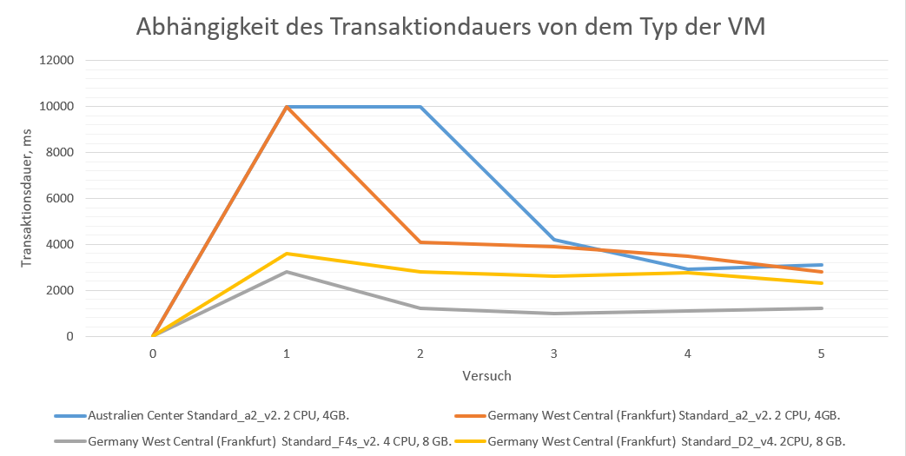

## Artem Shipilov

# 1. Einführung

## Zweck dieser Studie:
1. Herausfinden, wie Cloud-Ressourcen zum Aufbau einer Microservice-Architektur verwendet werden können.
2. Die Hauptvorteile der drei wichtigsten Anbieter von Cloud-Ressourcen (Azure Services, Google Cloud Services und Amazon Services) kennen.
3. Herausfinden, welche Module zum Aufbau von Microservices benötigt werden und erfahren, wie diese Module in der Praxis am Beispiel mindestens eines Cloud-Ressourcenanbieters funktionieren
4. Untersuchen die Betriebskosten einer Microservice-Architektur für ein Unternehmen.
5. Die Leistung virtueller Maschinen vergleichen und die am besten geeignete Option für die Microservice-Architektur ermitteln.

# 2.	Theoretische Grundlagen

In Zeiten der Digitalisierung sind die Organisationen von deren digitalen Evolution abhängig. Je weiter diese digitale Evolution ist, desto besser kann die Firma auf dem Markt behaupten. Das Überdenken bestehender Geschäftszweige ist ein wichtiger Schritt dieser Prozess. Wenn die Softwarearchitektur leicht zu verstehen, zu entwickeln, zu pflegen und zu warten ist, kann sie als "gut" bezeichnet werden. [1] Auf diese Weise kann das Entwicklungsteam effizient arbeiten. Gerade bei komplexen monolithischen Systemen sind diese Vorteile jedoch oft nur eingeschränkt realisierbar. Einer der Hauptgründe ist der Aufbau dieser Monolithen aufgrund der hohen Komplexität des Hauptproblemfeldes. Langfristig kann die Situation durch eine klare Abgrenzung und Sichtbarkeit der Hauptteile des Programms verbessert werden. Dazu kann eine monolithische Anwendung in kleinere, überschaubarere Teilaufgaben zerlegt werden. Microservices sind derzeit ein vielversprechender Ansatz, um dieses Ziel zu erreichen.

## 2.1	Microservices

**Microservices** sind ein Konzept zur Modularisierung von Software. Ein Microservice ist ein kleiner, autonomer Service, der über ein Netzwerk mit anderen Micro-services kommuniziert. [2] Eine umfassende, trennscharfe Definition von Microservices gibt es nicht, da das Thema vielschichtige Aspekte vereint. Dies umfasst organisatorische, fachliche und technische Aspekte sowohl auf der Ebene eines einzelnen Microservice als auch für ganze Softwaresysteme, die aus mehreren Microservices bestehen.

## 2.2	 Merkmale von Microservice

In diesem Kapitel werden Microservices für ein einheitliches Verständnis im Rahmen dieser Arbeit anhand ihrer Merkmale näher definiert:
Microservices sind ein Ansatz zur Modularisierung großer Software-Systeme in kleinere Einheiten (Microservices), die… [3]
*	unabhängig voneinander deployt werden können.
*	unabhängig von Änderungen an anderen Microservices in Produktion gebracht werden können.
*	mit unterschiedlichen Technologien umgesetzt sein können.
*	eine eigene, unabhängige Datenhaltung haben z.B. in Form einer eigenen Datenbank oder eines eigenen Schemas.
*	über Netzwerk miteinander kommunizieren und untereinander eine lose Kopplung aufweisen.
*	ein eigenes User Interface (UI) enthalten sollten.
*	sich auf einen fachlichen Kontext innerhalb einer Domäne fokussieren und damit innerhalb eines Microservice eine hohe Kohäsion aufweisen.
*	von genau einem Team, typischerweise drei bis neun Personen, entwickelt werden, wobei ein Team mehrere Microservices Betreuen kann.

## 2.3 Architektur von Microservice-Systemen

Bei einem Microservice-System sind insbesondere die Aufteilung in Microservices sowie die Beziehungen der Microservices untereinander zu betrachten. In der folgenden Abbildung ist ein grundlegendes Microservice-System mit zwei Microservices dargestellt. In der Praxis wird ein solches System meist aus mehreren Microservices bestehen.


**Abbildung 2.1: Entkoppelte Arbeit durch Microservices (entnommen aus „Wolff E., Microservices – Grundlagen flexibler Softwarearchitekturen“. Chapter 3.)**

Es gibt drei grundsätzliche Architekturprinzipien, denen eine Microservice-Architektur folgt. Zum einen gibt es eine starke Modularisierung des Gesamtsystems durch die Aufteilung in unabhängige Microservices. Dadurch **soll die Komplexität beherrschbar werden**. Die Größe eines einzelnen Service wird dabei von verschiedenen Faktoren bestimmt. Nach oben sollte diese dadurch begrenzt werden, dass ein Team von drei bis neun Personen den Microservice betreuen kann. [4]

Als zweites Prinzip zeichnet sich der Ansatz durch eine **lose Kupplung der Microservices untereinander** aus, wobei die Kommunikation zwischen Microservices über das Netzwerk erfolgt. Dies ermöglicht eine unterschiedliche Skalierung von Microservices sowie eine hohe Unabhängigkeit, bringt jedoch einige Herausforderungen mit sich: [5]
*	Die Kommunikation über Netzwerke ist unzuverlässig, daher ist darauf zu achten, dass ein Microservice mit Ausfällen umgehen kann und ein Ausfall keine Auswirkungen auf die Verfügbarkeit des Gesamtsystems hat.
*	Die Kommunikation über Netzwerke ist vergleichsweise langsam, daher sollte aus Perfomance-Gründen die Kommunikation zwischen Microservices möglichst selten stattfinden. Wenn diese häufig miteinander kommunizieren müssen, lässt dies auf ein Problem in der Architektur schließen.
*	Das Verschieben von Funktionalitäten zwischen Microservices ist recht aufwändig, da diese unabhängig voneinander sind, eigene Deployment-Einheiten bilden und in unterschiedlichen Technologien umgesetzt sein können.

Das dritte Prinzip ist **eine hohe Kohäsion innerhalb eines Microservice**, wobei ein Microservice eine eigene Datenhaltung, ein eigenes Backend und ein User Inter-face beinhaltet. Dies führt zu einer hohen Unabhängigkeit. Neue Funktionen können innerhalb eines Microservice und damit von einem Team umgesetzt werden, weitestgehend unabhängig von anderen Microservices und Teams. Gibt es innerhalb eines Microservice keine hohe Kohäsion kann dies ein Anzeichen dafür sein, dass die fachliche Aufteilung nicht optimal ist und eine Funktion besser in einem anderen Microservice implementiert werden müsste. [6]

# 3.	Konzeption und Realisierung von der Microservice-Architektur

Zur Unterstützung der Client-Apps wurde ein auf Microservices basierendes System entwickelt. Der Name des Systems lautet "Shop Economy". Hier werden vier Microservices identifiziert: Katalog, Inventar, Identität und Handel. Jeder dieser Microservices verfügt über eine eigene Datenbank, die in keiner Beziehung zu anderen Datenbanken steht und ausschließlich für den besitzenden Microservice verwendet wird. Für die Kommunikation zwischen Diensten wird ein „Message Broker“ eingeführt, der es den Microservices ermöglicht, Nachrichten asynchron zu veröffentlichen und zu konsumieren. Die gesamte Authentifizierung und Autorisierung über das gesamte System wird vom Identitäts-Microservice über das „OpenID Connect“-Protokoll abgewickelt. Es gibt auch ein Frontend-Portal, das alle Microservices nutzt, um mehrere End-to-End-Szenarien über die Benutzeroberfläche zu ermöglichen.
Da das System in der lokalen Entwicklungsmaschine aufgebaut ist, interagieren die Clients (Desktop und Mobile) direkt mit den Microservices und dem Portal.
Schließlich gibt es noch einige Infrastrukturkomponenten: Protokollierung, verteilte Ablaufverfolgung und Überwachung, mit denen alle Microservices interagieren und die bei der Fehlerbehebung helfen und sicherstellen, dass das gesamte System intakt bleibt.
In Bezug auf die für jede Komponente verwendete Technologie werden alle Microservices mit .NET- und ASP.NET Core-Technologien erstellt. Die Datenban-ken werden von einem MongoDB-Server gehostet. Der Message Broker wird über RabbitMQ aktiviert. Für verteiltes Messaging wird das MassTransit-Framework verwendet. Die „OpenID Connect“-Authentifizierung und -Autorisierung wird über das „Identity Server“-Framework ermöglicht. Das Fronted ist eine Single-Page-React-Anwendung.
Alle Infrastrukturdienste laufen über Docker-Container, die das Ausführen von Diensten in der lokalen Entwicklungsmaschine vereinfachen, ohne zusätzliche Tools zu installieren. 


**Abbildung 3.1: Systemarchitektur Shop Economy. (erstellt mit https://www.diagrams.net/)**

# 4. Kurze Vergleich der Cloud-Dienste von AWS, Azure und Google

Im Jahr 2021 hat Cynthia Harvey im "AWS vs. Azure vs. Google Cloud: 2022 Cloud Platform Comparison" bestätigt, dass derzeit drei Unternehmen die Hauptkonkurrenz auf dem Cloud-Computing-Markt anführen: Amazon Web Services (AWS), Microsoft Azure und Google Cloud Platform (GCP). Alle bieten alle Arten von Funktionen für Infrastructure as a Service (IaaS), Software as a Service (SaaS) und Platform as a Service (PaaS). AWS dominiert den Markt. Es erschien früher als die Konkurrenten (im Jahr 2006). [7]

Laut einem Bericht der Synergy Research Group aus dem Jahr 2020 „spiegelte das Wachstum von Amazon weiterhin genau das Gesamtmarktwachstum wider, sodass das Unternehmen seinen Anteil von 33 % am globalen [Cloud]-Markt halten konnte. Der Zweitplatzierte Microsoft ist erneut schneller gewachsen als der Markt und hat seinen Marktanteil in den letzten vier Quartalen um fast drei Prozentpunkte auf 18 % gesteigert." [8]

Microsoft ist besonders stark in SaaS und Google Cloud ist ein sehr guter KI-Dienst und bietet niedrige Preise und Rabatte.

Nachfolgend finden Sie einen Vergleich der Cloud-Dienste von AWS, Azure und Google.


**Abbildung 4.1: Inkrementelles Wachstum der Cloud-Ausgaben (entnommen aus https://www.srgresearch.com/articles/incremental-growth-cloud-spending-hits-new-high-while-amazon-and-microsoft-maintain-clear-lead-reno-nv-february-4-2020)**

Dieser Magic Quadrant von Gartner zeigt die Dominanz der drei wichtigsten Cloud-Services:


**Abbildung 4.2: Magic Quadrant für Cloud-Infrastruktur und Plattformservices (entnommen aus https://www.datamation.com/cloud/aws-vs-azure-vs-google-cloud/)**

## Amazon Web Services (2006)

Mit einem umfangreichen Satz von Tools, der weiterhin exponentiell wächst, sind die Fähigkeiten von Amazon unübertroffen. Die Kostenstruktur kann jedoch verwirrend sein, und der Fokus auf die Public Cloud anstelle einer Hybrid- oder Private Cloud bedeutet, dass die Interaktion mit Ihrem Rechenzentrum nicht die oberste Priorität von AWS ist. [7]

Amazon zeigt ein sehr umfangreiches Tool-Set, das von Jahr zu Jahr exponentiell wächst. AWS hat jedoch ein sehr komplexes Kostensystem und konzentriert sich auch auf die Public Cloud (anstelle von Hybrid oder Private). Das bedeutet, dass AWS nicht gut für die Interaktion mit dem Rechenzentrum geeignet ist.
Es ist erwähnenswert, dass die Arbeit mit einer Hybrid Cloud und mit einem Rechenzentrum ein wichtiger Bestandteil der Microservice-Architektur ist.

## Microsoft Azure (2010)

Microsoft Azure ist der größte Konkurrent für AWS. Dieses Unternehmen verfügt über umfangreiche Erfahrung in der Betreuung von Firmenkunden und unterstützt auch Hybrid- und Private Clouds, arbeitet also auch mit dem Rechenzentrum zusammen. [7]

Wenn ein Unternehmen bereits einen Vertrag mit Microsoft hat und bereits Firmenkunde ist, kann Microsoft auch eine ausführlichere Beratung und Rabatte für die Migration zu Microsoft Azure anbieten.

## Google Cloud Platform (2011)

Google ist auf dem dritten Platz, aber es ist auch gut gesponsert. Es richtet sich nicht so sehr an Firmenkunden und hat auch weniger öffentliche Dienste als Amazon. Aber Google bewegt sich in Richtung Deep Learning und in den Bereich der künstlichen Intelligenz, des maschinellen Lernens und der Datenanalyse. Daraus folgt, dass sich für Programme und Microservices, die hauptsächlich auf die Arbeit mit KI abzielen, der Einsatz von Google lohnen kann. [7]

## 4.1 Vergleich virtueller Maschinen von AWS, Azure und Google

Im Jahr 2021 hat Michael Bose verichtet, dass Virtuelle Maschinen und Speicher werden von Clients am häufigsten in Cloud-Plattformen verwendet. Daraus ist ersichtlich, dass alle Cloud-Plattformen virtuelle Maschinen (VMs) ausführen können. Es ist erwähnenswert, dass nur virtuelle Microsoft Azure-Maschinen echte Prozessorkerne verwenden. Das bedeutet, wenn Sie beispielsweise eine VM mit vier Kernen erstellen möchten, erstellt nur Azure eine VM mit vier echten Kernen ohne Hyperthreading. Die VM von Amazon und Google erstellt per Hyperthreading eine VM mit zwei Kernen und vier Threads. Dies führt zu einer höheren Leistung für Azure-VM-Prozessoren als die Konkurrenz. [9] Weitere Details zu den Leistungsmerkmalen der VMs der drei Konkurrenten werden im folgenden Kapitel behandelt.

Die maximalen VM-Rechenkonfigurationseinstellungen für AWS, Azure und GCP werden in der folgenden Tabelle verglichen:


**Tabelle 4.1: Die maximalen VM-Rechenkonfigurationseinstellungen für AWS, Azure und GCP (entnommen aus https://www.nakivo.com/blog/aws-vs-azure-vs-google-which-cloud-is-best-for-your-organization/)**

## 4.2 Regionen und Verfügbarkeitszonen

Jeder Cloud-Service-Provider ist in den wichtigsten modernen Industrieländern tätig, nämlich Europa, Nordamerika, Ost- und Südostasien und China. Eine **Region** ist ein geografisches Gebiet, in dem Rechenzentren physisch vorhanden sind. Verarbeitungszentren sind durch Netzwerke miteinander verbunden, sodass sie eine geringe Latenz haben. Eine **Availability Zone** ist ein eindeutiger Serverstandort innerhalb einer Region (z. B. Zentralaustralien, Nordaustralien, Südaustralien usw.). [9]

Nachfolgend findet eine Tabelle statt, wo die Verteilung der einzelnen Cloud-Service-Anbieter gezeigt wird.


**Tabelle 4.2: Die Verteilung der einzelnen Cloud-Service-Anbieter (entnommen aus https://www.nakivo.com/blog/aws-vs-azure-vs-google-which-cloud-is-best-for-your-organization/)**


## 4.3 Preise.

Der Preis ist oft das entscheidende Kriterium. Ein Vergleich der Preise der drei Hauptkonkurrenten ist schwierig, da sie sich im Laufe der Zeit ändern, ständig neue Rabatte eingeführt werden und die Preise in jeder Region für jeden Cloud-Service-Anbieter stark variieren können. Der Preis hängt auch von der Konfiguration des VM-Prozessors, des Arbeitsspeichers, des Speicherplatzes und des Festplattentyps (SSD oder HDD) ab. [9]

Preislich unterscheiden sich alle drei Plattformen kaum. In der IT-Community besteht jedoch Einigkeit darüber, dass Microsoft Azure die niedrigsten Preise bietet (wobei daran zu denken ist, dass nur virtuelle Microsoft Azure-Maschinen echte Prozessorkerne verwenden [Abschnitt 4.1]). Noch vorteilhafter ist es, wenn ein Kunde, der bereits Microsoft-Produkte (Windows, Active Directory, MS SQL etc.) nutzt, auf Azure umsteigt. [10]

Damit der Vergleich korrekt ist, müssen Sie eine Region für alle Cloud-Anbieter auswählen. Es ist auch erforderlich, dieselbe VM-Konfiguration auszuwählen. Es ist zu beachten, dass keine 100 % identische VM-Konfiguration erhalten werden kann, sodass einige Werte abweichen werden. Wir betrachten 2 Beispiele. [9]

**Beispiel 1.**


**Tabelle 4.3: Arten von virtuelle Maschinen (entnommen aus https://www.nakivo.com/blog/aws-vs-azure-vs-google-which-cloud-is-best-for-your-organization/)**


**Tabelle 4.4: On-Demand-Preise (entnommen aus https://www.nakivo.com/blog/aws-vs-azure-vs-google-which-cloud-is-best-for-your-organization/)**

In diesem Beispiel ist der Preis des Servers mit der kleinsten VM-Instanz fast gleich, der Preis in der Google Cloud Platform ist geringer. Für die größte Instanz bietet AWS den niedrigsten Preis und Azure den höchsten, aber vergessen Sie nicht, dass Azure echte CPU-Kerne bietet. [9]

## 4.4 Fazit

Alle drei Plattformen eignen sich für die Arbeit mit einer Microservice-Architektur, aufgrund der oben beschriebenen Vorteile wurde für mein Praxisprojekt jedoch die Microsoft Azure Plattform mit einer standard_a2_v2 VM mit 4 GB Ultra-Disc-Speicher und 2 vCPUs gewählt.

# 5. Microsoft Azure-Tools.

## 5.1 Azure Cosmos DB

Azure Cosmos DB ist eine NoSQL-Datenbank mit Rechenzentren in vielen Ländern. Ein schneller Wechsel des Bearbeitungszentrums während der Stoßzeiten ist möglich. Es gibt eine automatische Skalierbarkeit. Eine globale Verteilung der Daten über mehrere Regionen ist möglich. Es gibt Open-Source-Code für gängige Programmiersprachen. Ein Azure Cosmos DB-Konto im Free-Tarif erhält 1.000 RU/s und 25 GB Speicherplatz kostenlos. [11]

* Die Vorteile von **SQL** sind Datenintegrität, Strukturiertheit.
* Die Vorteile von **NoSQL** sind Datenverarbeitungsgeschwindigkeit, Skalierbarkeit, verteilte Systeme.

**Starke Seiten von NoSQL:**
Fähigkeit, große Mengen unstrukturierter Informationen zu speichern. NoSQL hat keine Beschränkungen hinsichtlich der Typen gespeicherter Daten, und Sie können bei Bedarf neue Datentypen hinzufügen.
NoSQL-Datenbanken sind skalierbarer. Obwohl die Skalierung auch in SQL-Datenbanken unterstützt wird, erfordert sie viel mehr Personal- und Hardwareressourcen.

Die Rechenleistung ist begrenzt und der Preis für mehrere einfache Server ist geringer als für einen Hochleistungsserver. Durch die horizontale Skalierung (mehrere unabhängige Maschinen werden miteinander verbunden und jede von ihnen verarbeitet ihren eigenen Teil der Anfragen) können Sie die Kapazität des Clusters erhöhen, indem Sie einen neuen Server hinzufügen.

**Vorleile von Azure Cosmos DB:**
 1. Azure Cosmos DB bietet 99,999 % SLA sowohl für die Lese- als auch die Schreibverfügbarkeit.
 2. Große Geschwindigkeit in jeder Größenordnung
 3. Vereinfachte Anwendungsentwicklung. Beschleunigte Entwicklung durch Open-Source-APIs, mehreren SDKs, schemalose Daten und Analysen ohne ETL für operative Daten.
 4. End-to-End-Datenbankverwaltung.
 5. Günstige Preise.
 6. Azure Synapse Link für Azure Cosmos DB ist ein cloudbasiertes HTAP-Feature (Hybrid Transactional and Analytical Processing). Dies bietet Betriebsdatenanalysen in Azure Cosmos DB nahezu in Echtzeit und eine einfache Integration zwischen Azure Cosmos DB und Azure Synapse Analytics. [11]

## 5.2 Azure Kubernetes Kluster (AKS)

Der Knoten ist eine Produktionsbox, die die Docker-Engine ausführt, die es ihr ermöglicht, Docker-Container wie unseren Katalog-Container und unseren Inventar-Container auszuführen. [16]

Z.b. es gibt ein paar Knoten, und es wird benötigt, um die Docker-Container dort auszuführen. Die Hauptaufgabe von Kubernetes besteht darin, die Container in Pods zu platzieren, die in den Knoten ausgeführt werden können. Ein Pod ist die kleinste bereitstellbare Recheneinheit in Kubernetes und besteht aus einer Gruppe von einem oder mehreren Containern, die Speicher- und Netzwerkressourcen gemeinsam nutzen. Um den Container in einen Pod in einem Knoten zu bringen, kann der Benutzer eine Bereitstellung erstellen, in der er den Namen des bereitzustellenden Images, die Anzahl der Repliken des Pods, die er erstellen möchte, und viele andere Details angibt. Er stellt diese Bereitstellung für die Kubernetes-Steuerungsebene bereit, die die Dienste enthält, die zum Ausführen von Pods erforderlich sind. Die Steuerungsebene fährt fort und zieht das angegebene Docker-Image aus der entsprechenden Containerregistrierung in den Knoten herunter und verwendet es dann, um den angeforderten Pod zu erstellen. Kubernetes kann auch die Auswahl der Knoten für die Pods übernehmen. Wenn ein zweites Replikat des Katalog-Pods hinzugefügt werden muss, muss der Benutzer die Anzahl der Replikate in der Bereitstellung ändern, und Kubernetes startet einen zweiten Pod in dem Knoten, der über freie Ressourcen verfügt. Dies soll eine Vorstellung davon vermitteln, wie einfach die Auswahl der Microservices in Kubernetes ist. Für einen automatisierten Ansatz ist es möglich, die automatische Skalierung mit einem horizontalen Pod-Autoscaler oder HPA zu aktivieren. Es besteht die Möglichkeit, Ressourcenschwellenwerte zu definieren, die die Erstellung neuer Pods automatisch auslösen können. Beispielsweise könnte definiert werden, dass keiner der Pods mehr als 50 % der CPU verwenden sollte, und wenn ein Pod diese Auslastung erreicht, sollte automatisch ein neuer Pod erstellt werden, um den Überschuss zu bewältigen, wobei mindestens ein Pod beibehalten und erweitert wird bis zu insgesamt 10 Pods in diesem Beispiel. Ein weiteres wichtiges Merkmal von Kubernetes ist seine Fähigkeit zur Selbstheilung. Wenn einer der Pods abstürzt, stellt Kubernetes sofort fest, dass die angeforderte Anzahl an Replikaten nicht mit der Anzahl der vorhandenen Pods übereinstimmt, und stellt daher sofort einen neuen Pod bereit, ohne dass in irgendeiner Weise eingegriffen werden muss. Kubernetes kann auch sowohl Konfigurationsdaten als auch geheime Werte speichern und sie den Pods als Umgebungsvariablen zur Verfügung stellen. [17] [18]

**Diensterkennung.**
Angenommen, der Inventar-Pod möchte den Katalog-Pod aufrufen. Um dies zu ermöglichen, könnte ein Kubernetes-Dienst erstellt werden. Diesem Dienst wird ein Name und eine IP-Adresse zugewiesen, die von jedem Pod erkannt werden können, der in den von Kubernetes verwalteten Knoten ausgeführt wird. Hier kann Inventory den für Katalog konfigurierten Dienst aufrufen, und der Dienst leitet ihn an einen der Katalog-Pods weiter. Dies unterstreicht auch die Lastausgleichsfähigkeit von Kubernetes, denn wenn mehrere Pods den Microservice ausführen, entscheidet der Dienst, wie der Lastausgleich zwischen ihnen erfolgt. Wenn ein externer Client benötigt wird, um über das Internet auf die Katalog-Pods zuzugreifen, muss der Kubernetes-Dienst auf den Load-Balancer-Typ geändert werden, und er erhält eine externe IP, die Clients erreichen können, vorausgesetzt, Kubernetes ist dies läuft bei einem Public-Cloud-Anbieter. Ein weiteres Merkmal von Kubernetes ist die schrittweise Einführung neuer Containerversionen ohne Ausfallzeiten. Wenn der Benutzer also die Inventory-Bereitstellung geändert hat, um das Inventory V2-Image zu verwenden, wird Kubernetes zunächst einen neuen Inventory-Pod mit der neuen Containerversion starten, anstatt den vorhandenen Inventory-Pod zu zerstören und einen neuen zu erstellen. Es kann bestätigen, dass dieser neue Pod fehlerfrei und bereit ist, Anfragen zu empfangen, und erst dann wird es fortfahren und den alten Pod löschen. Die Inventarclients werden diese Versionsaktualisierung nie bemerken.

Alles, was hier beschrieben wird, ist also ein sogenannter Kubernetes-Cluster. In Microsoft Azure dieser Cluster hat den Namen "Azure Kubernete Kluster (AKS)".

## 5.3 API-Gateway.

Ein API-Gateway ist ein Dienst, der den Einstiegspunkt in die Anwendungs-REST-API von außen darstellt. Das Hauptanliegen in einer Microservices-Umgebung ist die Zuordnung von Anforderungen externer Parteien zu internen Microservices, aber es kann auch viele andere Querschnittsprobleme lösen. Um den Zweck des API-Gateways besser zu verstehen, untersuchen wir einige der Probleme, die bei der Verwendung einer direkten Client-zu-Microservice-Kommunikation auftreten können. Wenn ein Load-Balancer-Service im Kubernetes-Cluster konfiguriert ist, gibt er dem Identity-Microservice eine öffentliche IP, wodurch Clients von überall darauf zugreifen können. Dies funktioniert gut für einen Microservice, aber es wird Probleme für zukünftige Microservices geben. Wenn der Programmierer weitere Load-Balancer-Dienste für andere Microservices hinzufügt, erhält jeder eine neue öffentliche IP, und da die Clients wahrscheinlich über DNS-Adressen anstelle von IPs auf Microservices zugreifen, werden alle diese DNS-Adressen IPs zugeordnet. Dies ist eindeutig nicht skalierbar, und je nach Cloud-Anbieter verursacht jede neue öffentliche IP zusätzliche Kosten, die mit neuen Microservices nur weiter steigen werden. [19]

Da die Microservices direkt aus dem öffentlichen Internet erreichbar sind, sind sie verschiedenen Arten von Angreifern ausgesetzt. Einige von ihnen senden möglicherweise mehrere Anfragen ohne jegliche Form der Authentifizierung oder Autorisierung. Dies wird niemals dazu führen, dass die Angreifer unbefugten Zugriff auf Microservices erhalten, da alle REST-APIs ordnungsgemäß konfiguriert sind, um eine Autorisierung anzufordern. Es verbraucht jedoch Ressourcen, die die Microservices für etwas Nützliches verwenden könnten. [19]

Die Angreifer könnten auch DDoS-Angriffe versuchen, die einen oder mehrere der Microservices überwältigen und normale Clients daran hindern könnten, sie sinnvoll zu nutzen.

Es ist wichtig, die gesamte Kommunikation mit https zu verschlüsseln, aber da alle Microservices direkt dem Internet ausgesetzt sind, muss für jeden von ihnen ein TLS-Zertifikat eingerichtet werden, außerdem müssen alle Microservices den https-Datenverkehr entschlüsseln, was sich auf die Leistung von auswirkt alle von ihnen.

Schließlich führt die direkte Client-zu-Microservice-Kommunikation zu einer unerwünschten Kopplung. Beispielsweise können Kunden heute einen Kauf über den Kaufvorgang des Trading-Microservices starten und sich auch einen Überblick über die Artikel verschaffen, die über den Store-Vorgang auf demselben Microservice gekauft werden können. Wenn die Organisation schließlich entscheidet, dass der Trading-Microservice zu viel leistet und in mehrere Microservices aufgeteilt werden muss, wird der Kaufvorgang nun Teil eines neuen Purchase-Microservices und der Store-Vorgang wird jetzt in den Store-Microservice verschoben. Da der Trading-Microservice nicht mehr existiert, können alle bestehenden Clients die Kauf- und Speichervorgänge nicht aufrufen und müssen aktualisiert werden, um die neuen Microservices aufrufen zu können, was eine Herausforderung darstellt und in einigen Fällen sogar unmöglich sein kann.

**Vorteile eines API-Gateways.**

Sobald der Programmierer ein API-Gateway hinzufügt, wird es zum Einstiegspunkt in die Microservices-REST-API von außen. Das bedeutet, dass außer dem Gateway niemand Zugriff auf die Microservices hat. Dies führt zu mehreren Vorteilen, beginnend mit der Schlüsselfähigkeit bis zur Durchführung des Anforderungsroutings. [19]

Angenommen, einer der Clients möchte die Liste der Katalogelemente abrufen. Der Client ruft den Pfad „Katalog/Elemente“ auf dem Gateway auf, und dieses leitet diese Anforderung wiederum an die Artikeloperation im Microservice „Katalog“ weiter. Das Gleiche gilt für den Handels-/Geschäftspfad, der an den Geschäftsbetrieb im Trading-Microservice weitergeleitet wird. Dank dieser Fähigkeit wird eine öffentliche IP nur für das API-Gateway selbst benötigt, nicht für einen der Microservices, die nur interne IPs und DNS-Adressen innerhalb des Kubernetes-Clusters haben. Dadurch werden die Kosten für die Verwaltung öffentlicher IPs erheblich gesenkt und die Dinge für Kunden vereinfacht.

Das API-Gateway kann so konfiguriert werden, dass der autorisierte Zugriff auf Microservices sichergestellt ist. Wenn also ein Client den Handels-/Kaufpfad anruft und das erforderliche Zugriffstoken nicht präsentiert, kann das Gateway den Ablauf initiieren, der ein Zugriffstoken über den Identitätsanbieter anfordert, und zwar erst, wenn das Zugriffstoken erworben wurde , kann er sie verwenden, um die ursprüngliche Anfrage an den Trading-Microservice weiterzuleiten. Auf diese Weise muss sich keiner der Microservices mit nicht autorisierten Anfragen befassen, wodurch wertvolle Ressourcen für weitere Aufgaben gespart werden. Das API-Gateway kann auch Ratenbegrenzungen erzwingen. [19]

Wenn also beispielsweise ein Angreifer damit beginnt, eine große Menge an Anfragen an den Identitäts-/Benutzerpfad zu senden, was zu einem DDoS-Angriff wird, kann die Ratenbegrenzungskomponente des Gateways sicherstellen, dass nur die Anfragen, die bestimmten Kriterien entsprechen, Microservices erreichen können , wodurch sichergestellt wird, dass sie nicht überfordert werden und für zukünftige Anfragen verfügbar bleiben. Ein weiterer wichtiger Vorteil ist die Möglichkeit, TLS-Terminierung durchzuführen. Der Programmierer kann jetzt verlangen, dass der gesamte Datenverkehr HTTPS verwendet, indem er ein TLS-Zertifikat nur auf dem API-Gateway installiert. Nachdem das Gateway die Anfrage erhalten hat, beschreibt es sie und sendet eine neue Anfrage an den entsprechenden Microservice, diesmal mit einfachem HTTP-Datenverkehr, und keine externe Entität hat Zugriff auf Dienste innerhalb des Kubernetes-Clusters.

Da die TLS-Verschlüsselung am API-Gateway beendet wird, müssen die Microservices keine Ressourcen mehr für die Entschlüsselung des Datenverkehrs aufwenden, was wiederum ihre Ressourcen für weitere Aufgaben spart. Auch das Problem der Kopplung von Client und Microservices ist mit einem API-Gateway weg. [19]

Kommen wir noch einmal auf den Fall des Handels-/Kaufpfads zurück, der dem Kaufvorgang auf dem Trading-Microservice zugeordnet ist, und dem Handels-/Geschäftspfad, der dem Geschäftsvorgang auf demselben Microservice zugeordnet ist. Entscheidet sich der Programmierer schließlich dafür, Trading in drei neue Microservices aufzuteilen, muss er lediglich das im API-Gateway konfigurierte Routing so ändern, dass die Kauf- und Speicherpfade nun auf die neuen Microservices zeigen. Die Clients müssen nicht einmal wissen, dass eine solche interne Konfiguration geändert wurde, und sie können die Operationen so lange wie nötig auf den gleichen Pfaden wie zuvor aufrufen.

Schließlich können die Überwachung und Protokollierung im API-Gateway aktiviert werden, um einen besseren Überblick über die Anforderungen zu erhalten, die das System durchlaufen. [19]

-----------

# 6. Realisierung von der Microservice-Architektur.

Zur Implementierung der Microservice-Architektur wurde ein neues Microsoft Azure-Konto erstellt. Azure bietet die Möglichkeit, ein Konto für Studenten zu erstellen. Dieses Konto ist kostenlos. Doch ein solches Angebot ist mit Vorsicht zu genießen, denn der Microservice benötigt sehr viele Ressourcen (nämlich mindestens 2 vCPUs und 4 GiB Ultra-Disc-Speicher). Andernfalls tritt ein Fehler auf: “The System node pool must use VM sku with more than 2 cores and 4GB memory.” Glücklicherweise erlaubt Ihnen Azure, viele Ressourcen kostenlos zu nutzen, aber oft sind die Azure-Server ziemlich ausgelastet und es gibt keine freien virtuellen Maschinen mehr, die Sie kostenlos nutzen können. Daher waren zum Zeitpunkt der Untersuchung nicht alle virtuellen Maschinen mit dieser Ressource in Deutschland verfügbar. Wie in Amerika, Kanada. Daher wurde nach langer Suche eine virtuelle Maschine in Australien im zentralen Teil gefunden. Daher wurde für diese Arbeit der Standard_a2_v2-Cluster innerhalb des Azure Kubernetes Service ausgewählt.

Adresse des erstellten Microservices: https://shopeconomy.australiacentral.cloudapp.azure.com/

Ein Studentenabonnement wurde erstellt. Dem Studentenabonnement wurde eine Ressourcengruppe angehängt. Eine Ressourcengruppe besteht aus geladenen Microservices und Ressourcen, die von Azure bereitgestellt werden, um mit den Microservices zu kommunizieren (wie z.B. Azure Kubernetes Service, Azure Key Vault, VM-Skalierungsgruppe, Containerregistrierung, öffentliche IP-Adresse u.s.w.). 


Die Azure Cloud-Ressourcen wurde hauptsächlich über die Befehlszeile verwaltet, sodass würde jeden Azure-Befehlsgebrauch zum Erstellen oder Verwalten von Cloud-Ressourcen in unseren Lesedateien leicht nachverfolgt. Dafür wird die Azure Command-Line Interface oder Azure CLI benötigt. 

Um beispielsweise den Trading-Microservice zu laden, ist es erforderlich sich zu registrieren und einen Befehl an Docker zu senden:
```powershell
az acr login --name $appname
```

Als Nächstes ist es nötig zum Erstellen einer Datenbank ein Cosmos DB-Konto zu erstellen. In Cosmos DB ist es möglich, die Datenbank zu übertragen und Mongo DB von einem lokalen Computer mit der Möglichkeit zur Verwendung der Mongo DB-API zu verwenden:
```powershell
az cosmosdb create --name $appname --resource-group $appname --kind MongoDB 
```

Im nächsten Schritt wird ein Service-Bus-Namespace angelegt. Es ist erforderlich um asynchrone Kommunikation zwischen Microservices zu ermöglichen: 
```powershell
az servicebus namespace create --name $appname --resource-group $appname --sku Standard
```

Jedes Microservice soll eine Verbindung mit Cosmos DB und Service Bus haben. Dafür wird eine Verbindungsstring gebraucht, die später in Azure Key Vault gespechert wird. Azure Key Vault ist eine bequeme Möglichkeit von Microsoft Azure alle Passwörter, Verbindungsstrings und Tokens zu speichern.

Zum Speichern der Docker-Images in Microsoft Azure existiert die Microsoft Azure Container Registry. Wie üblich wird dafür die Azure CLI verwendet. Der Befehl einer solchen Containerregistrierung sieht folgendermaßen aus:
```powershell
az acr create --name $appname --resource-group $appname --sku Basic
```

Um das Docker-Image per Push in die Azure-Containerregistrierung zu übertragen, wird der folgende Code verwendet:
```powershell
$appname="[Name]"

az acr login --name $appname
docker push "$appname.azurecr.io/trading:$version"
```
Nach jedem Code-Update wurde die Version ($version) aktualisiert und der Code auf Microsoft Azure hochgeladen.

Das Erstellen eines Azure Kubernetes Service (AKS)-Clusters und das Auswählen einer virtuellen Maschine für diesen Cluster erfolgte mit dem folgenden Code:
```powershell
az feature register --name EnablePodIdentityPreview --namespace Microsoft.ContainerService
az extension add --name aks-preview

az aks create -n $appname -g $appname --node-vm-size standard_a2_v2 --node-count 2 --attach-acr $appname --enable-pod-identity --network-plugin azure --generate-ssh-keys --location australiacentral

az aks get-credentials --name $appname --resource-group $appname
```
Wo "standart_a2_v2" - VM-Typ ist; "australiacentral" - name des Regions, wo VM stattfindet.

Für jeden Microservice wurde eine Bereitstellungsdatei erstellt. Diese Konfigurationsdatei ist in YAML-Format. Diese Datei sieht folgendermaßen aus:
```powershell
apiVersion: apps/v1 # declares the API-Version
kind: Deployment # type of creating file
metadata:
  name: identity-deployment # the name of deployment
spec: # details of this deployment
  selector:
    matchLabels:
      app: identity # this deployment manages any of ports that have the label that has the name "identity"
  template: 
    metadata:
      labels:
        app: identity # template for this file "identity"
        aadpodidbinding: identity # name in Azure ressource group
    spec: # details of this temlate
      containers:
        - name: identity # the name assigned to the AKS Container
          image: shopeconomy.azurecr.io/play.identity:1.0.12 # the name and the version of the image that wewant to use
          env: # overwrites the environtment values
            - name: ServiceSettings__MessageBroker # Common.Settings
              value: SERVICEBUS
            - name: ServiceSettings__KeyVaultName # using secrets from the azure key vault
              value: shopeconomy
            - name: IdentitySettings__PathBase # Play.Identity.Service.Settings
              value: /identity-svc
            - name: IdentitySettings__CertificateCerFilePath
              value: "/certificates/certificate.crt" # same as "volumeMounts/mountPath" / "volumes/items" in this file
            - name: IdentitySettings__CertificateKeyFilePath
              value: "/certificates/certificate.key" # same as "volumeMounts/mountPath" / "volumes/items" in this file
            - name: IdentityServerSettings__Clients__0__RedirectUris__0 # from appsettings.json, 0 - is the first element in the array
              value: https://shopeconomy.australiacentral.cloudapp.azure.com/authentication/login-callback
            - name: IdentityServerSettings__Clients__0__PostLogoutRedirectUris__0
              value: https://shopeconomy.australiacentral.cloudapp.azure.com/authentication/logout-callback
          resources: # how many ressources can the Kubernetes ports use in cluster
            limits:
              memory: "128Mi" # 128 Megabytes
              cpu: "150m" # 0.150 % od CPU
          ports:
            - containerPort: 5002 # same as in Dockerfile. Which is the port that our container is listening on
          volumeMounts:
            - name: certificate-volume # from signin-cer.yaml
              mountPath: /certificates
      volumes:
        - name: certificate-volume
          secret:
            secretName: signing-cert # from signin-cer.yaml
            items:
              - key: tls.key
                path: certificate.key
              - key: tls.crt
                path: certificate.crt

--- # separates ressources for the single YAML file
apiVersion: v1
kind: Service
metadata:
  name: identity-service # name of the service
spec:
  type: ClusterIP # cluster IP don't provide external IP and DNS-Adress (case of API-Gateway), if type == LoadBalancer - it will provide
  selector:
    app: identity  # this deployment manages any of ports that have the label that has the name "identity"
  ports:
    - port: 80 # this port will be availeble in case of reaching grom the outside. 80 is the standartport
      targetPort: 5002 # same as in Dockerfile. Which is the port that our service is listening on
```

Und die Erstellung des Kubernetes-Pods kann mit dem folgenden Code erfolgen:
```powershell
kubectl apply -f .\kubernetes\identity.yaml -n $namespace
```
Schließlich erfolgt die Erstellung und Konfiguration des API-Gateways mit der folgenden Reihenfolge:

**Emissary-ingress installieren**
```powershell
helm repo add datawire https://app.getambassador.io
helm repo update
helm repo list

kubectl apply -f https://app.getambassador.io/yaml/emissary/2.3.1/emissary-crds.yaml
kubectl wait --timeout=90s --for=condition=available deployment emissary-apiext -n emissary-system

$namespace="emissary"
helm install emissary-ingress datawire/emissary-ingress --set service.annotations."service\.beta\.kubernetes\.io/azure-dns-label-name"=$appname -n $namespace --create-namespace
```

**Emissary-Ingress-Routing konfigurieren**
```powershell
kubectl apply -f .\emissary-ingress\listener.yaml -n $namespace
kubectl apply -f .\emissary-ingress\mappings.yaml -n $namespace
```
**Cert-Manager installieren**
```powershell
helm repo add jetstack https://charts.jetstack.io
helm repo update

helm install cert-manager jetstack/cert-manager --version v1.8.0 --set installCRDs=true --namespace $namespace
```
**Erstellen des tls-Zertifikats**
```powershell
kubectl apply -f .\emissary-ingress\tls-certificate.yaml -n $namespace
```

**Aktivieren von TLS und HTTPS**
```powershell
kubectl apply -f .\emissary-ingress\host.yaml -n $namespace
```

# 7. Auswahl einer virtuellen Maschine für einer Microservice-Architektur.

Der kurze Prozess zum Erstellen einer Microservice-Architektur basierend auf der virtuellen Maschine Australien Centre Standard_a2_v2, die für ein Studentenkonto verfügbar ist, wurde oben beschrieben. 2 vCPUs, 4 GiB. Dieses Kapitel beschreibt die Implementierung von drei weiteren virtuellen Maschinen und beschreibt, wie die Zugriffsgeschwindigkeiten von Microservices verglichen werden, die auf allen VMs erstellt wurden. Um die Ladegeschwindigkeit der Website zu bewerten, wurden Online-Ressourcen verwendet, um die Geschwindigkeit von Webverbindungen von Google [12], Solarwinds Pingdom [13] und GTmetrix [14] zu messen. Alle Seiten lieferten jedoch ungefähr die gleichen Ergebnisse. Daher wurden die Ergebnisse des bekanntesten Dienstes von Google als Grundlage für die Messung genommen.

Da das Studentenkonto Einschränkungen hinsichtlich der Größe der VM hat, wurde ein Abonnement für Standardbenutzer abgeschlossen. Als nächstes wurde die VM ersetzt. Dies kann über die Azure-Befehlszeilenschnittstelle mit dem Befehl erfolgen:
```powershell
az feature register --name EnablePodIdentityPreview --namespace Microsoft.ContainerService
az extension add --name aks-preview

az aks create -n $appname -g $appname --node-vm-size standard_a2_v2 --node-count 2 --attach-acr $appname --enable-pod-identity --network-plugin azure --generate-ssh-keys --location germanywestcentral
```
Wo "aks" bedeutet Azure Kubernetes Service.

Zur Messung der Seitenladegeschwindigkeit wurde eine Homepage mit einem Slider bestehend aus vier Fotos ausgewählt. Beim Laden dieser Seite wird eine Anfrage an den Identity-Microservice gesendet und je nachdem, ob der Benutzer ein registrierter Benutzer, Administrator oder Gast ist, unterschiedliche Inhalte erstellt. Vier virtuelle Maschinen wurden zum Vergleich ausgewählt: 
* Australien Center **Standard_a2_v2.** 2 vCPU, 4GiB - 0.1060 €/St.
* Germany West Central (Frankfurt) **Standard_a2_v2.** 2 vCPU, 4GiB - 0.0870 €/St.
* Germany West Central (Frankfurt)  **Standard_F4s_v2.** 4 vCPU, 8 GiB - 0.1940 €/St.
* Germany West Central (Frankfurt)  **Standard_D2_v4.** 2 vCPU, 8 GiB - 0.1150 €/St.

## 7.1 Abhängigkeit der Erstreaktionszeit von dem Typ der VM

Dabei wurde die Abhängigkeit von Anzahl der Prozessorkerne und Arbeitsspeicher sowie Seitenladegeschwindigkeit betrachtet. Das Ergebnis der Studie war die folgende Grafik:


Die Grafik zeigt, dass das Laden der ersten Seite immer viel länger dauert als nachfolgende Ladevorgänge. Dies geschieht meiner Meinung nach, weil einige der Prozesse im lokalen Cache des Browsers und im Cache des Servers gespeichert werden.

Die Grafik zeigt, dass eine VM, die sich in großer Entfernung vom Client befindet, 0.3-0.45 Sekunden langsamer läuft. Bei mehreren REST-API-Anfragen kann sich diese Zeit erheblich verlängern und dies kann den Betrieb des Microservices kritisch beeinträchtigen. Daher ist es notwendig, möglichst viele virtuelle Maschinen in verschiedenen Ländern mit der dichtesten Abdeckung zu erstellen und API-Gateway zu verwenden.

Die Grafik zeigt auch, wie viele Ressourcen die Microservice-Architektur benötigt. Offensichtlich lohnt es sich für die Konzepte von Microservice-Architekturen und Microservices für kleine oder geschlossene Nutzung, eine VM mit mindestens 4 vCPUs und 8 GiB zu wählen. Die Kosten für eine solche VM sind doppelt so hoch wie die günstigere der angebotenen Optionen, aber die Geschwindigkeit ist viel höher. Dies geschieht, weil 2 vCPUs und 4 GiB Speicher für eine Microservice-Architektur zu knapp ausreichen. Außerdem kann bei einer günstigeren Option des Microservices beim Warten auf das Laden einer Seite länger als zwei oder drei Sekunden ein Fehler beim Laden der Website auftreten, der vom Microservice ausgegeben wird. Dies ist konfigurierbar, aber es ist am besten, Kunden nicht so lange warten zu lassen.

In meinem Fall die virtuelle Machine mit 2 vCPUs und 8 GiB Speicher zeigt sich relativ langsam im Vergleich mit Standard_D2_v4 (4 vCPU, 8 GiB), aber kostet auch fast zweimal günstiger. Meine Meinung nach ist, dass der Kund nicht 600-800 ms warten muss. Das ist eine umbequeme Funktionalität.

## 7.2 Abhängigkeit des Transaktiondauers von dem Typ der VM



Die Transaktionsoperation ist die komplexeste Operation im Microservice, zusätzlich zur Autorisierungsauthentifizierung ist es notwendig, eine Reihe von Operationen auszuführen, die in der folgenden Abbildung gezeigt werden:


Daher erfolgte die Transaktionsoperation nicht immer ohne Neuladen des Fensters bei der Auswahl der schwächsten VM. Daraus folgt, dass sich die VM **Standard_a2_v2.** 2 vCPU, 4GiB am Ende als zu schwach für das komfortable Verhalten des Transaktions- und Kaufvorgangs herausstellte. In der Grafik bedeutet die Zahl 10000 ms, dass innerhalb von 10 Sekunden keine Seitenaktualisierung erfolgte und ein Ladefehler aufgetreten ist.

Daher folgt, dass die am besten geeignete virtuelle Maschine in der Anfangsphase die "Standard_F4s_v2" VM ist, die sich in der Nähe des Standorts der Clients befindet. Da die Microservice-Anfragen zunehmen, wird empfohlen, leistungsfähigere VMs in Betracht zu ziehen. Eine Liste aller verfügbaren VMs in Mitteldeutschland ist unter folgender URL verfügbar: https://azureprice.net/?region=germanywestcentral&sortField=memoryInMB&sortOrder=true

**Bemerkung:**

Es ist schwierig, die Leistungsobergrenze für VMs zu messen, da sie als DDos-Angriff erkannt wird. Es ist nötig in diesem Fall VMs mit der realen CPU lokal zu testen. Allerdings gibt es eine Tabelle von Microsoft, die die Abhängigkeit von "Performance Cap" vom Arbeitsspeicher zeigt. Anhand dieser Tabelle können Sie grob die Last berechnen, die die VM bewältigen kann. [15]


# Literaturverzeichnis
* [1] - vgl. Martin 2017, Kap. 15 Abschn. 1
* [2] - vgl. Wolff E., Microservices – Grundlagen flexibler Softwarearchitekturen. 183ff. und Newman S, Building microservices – Designing fine-grained systems, Chapter 1
* [3] - vgl. Wolff E., Microservices – Grundlagen flexibler Softwarearchitekturen. 188ff. und Newman S, Building microservices – Designing fine-grained systems, Chapter 1
* [4] - vgl. Wolff E., Microservices – Grundlagen flexibler Softwarearchitekturen, Kindle-Position 698 ff.
* [5] - vgl. Wolff E., Microservices – Grundlagen flexibler Softwarearchitekturen, Kindle-Position 1524 ff.
* [6] - vgl. Wolff E., Microservices – Grundlagen flexibler Softwarearchitekturen, Kindle-Position 2084 ff. und Newman S, Building microservices – Designing finegrained systems, Chapter 3
* [7] - vgl. Cynthia Harvey 2021, AWS vs. Azure vs. Google Cloud: 2022 Cloud Platform Comparison. URL: https://www.datamation.com/cloud/aws-vs-azure-vs-google-cloud/
* [8] - vgl. Synergy Research Group 2020, Incremental Growth in Cloud Spending Hits a New High while Amazon and Microsoft Maintain a Clear Lead. URL: https://www.srgresearch.com/articles/incremental-growth-cloud-spending-hits-new-high-while-amazon-and-microsoft-maintain-clear-lead-reno-nv-february-4-2020
* [9] - vgl. Michael Bose, AWS vs Azure vs Google: Which Cloud Is Best for Your Organization. URL: https://www.nakivo.com/blog/aws-vs-azure-vs-google-which-cloud-is-best-for-your-organization/
* [10] - vgl. Shanika Wickramasinghe, AWS vs Azure vs GCP: Comparing The Big 3 Cloud Platforms URL: https://www.bmc.com/blogs/aws-vs-azure-vs-google-cloud-platforms/
* [11] - vgl. Microsoft Docs, Willkommen bei Azure Cosmos DB. URL: https://docs.microsoft.com/de-de/azure/cosmos-db/introduction
* [12] - URL: https://pagespeed.web.dev/?hl=de
* [13] - URL: https://tools.pingdom.com/
* [14] - URL: https://gtmetrix.com/
* [15] - Microsoft Docs, Azure managed disk types. URL: https://docs.microsoft.com/nb-no/azure/virtual-machines/disks-types#premium-ssd
* [16] - vgl. Docker Docs. URL: https://docs.docker.com/engine/swarm/how-swarm-mode-works/nodes/
* [17] - vgl. Grundlegende Kubernetes-Konzepte für Azure Kubernetes Service (AKS). Microsoft Docs. URL: https://docs.microsoft.com/de-de/azure/aks/concepts-clusters-workloads
* [18] - vgl. Containerorchestrierung für Microservices. Micrososft Docs. URL: https://docs.microsoft.com/de-de/azure/architecture/microservices/design/orchestration
* [19] - vgl. Verwenden von API-Gateways in Microservices. Microsoft Docs. URL: https://docs.microsoft.com/de-de/azure/architecture/microservices/design/gateway

# Verwendete Icons von Dritten
* https://www.diagrams.net/
* https://www.rabbitmq.com/trademark-guidelines.html
* https://masstransit-project.com/
* https://www.pngkey.com/maxpic/u2q8q8i1i1o0t4a9/
* https://commons.wikimedia.org/wiki/File:React-icon.svg
* https://identityserver4.readthedocs.io/en/latest/
* https://www.docker.com/wp-content/uploads/2022/03/vertical-logo-monochromatic.png
* https://github.com/emissary-ingress

# Zeitplan
| Termin     |     Meilenstein                      |
|:----------:|:------------------------------------:|
| 05.05.2022 | Finalisierung der Aufgabenstellung   |
| 12.05.2022 | (Ausarbeitung Buch / Präsentation)  |
| 19.05.2022 | Grundlegende Theorie, Kurze Vergleich der Cloud-Dienste von AWS, Azure und Google   |
| 26.05.2022 | Erstellung von Azure-Konto, Installation von Azure CLI, Erstellung von Ressource-Gruppen   |
| 02.06.2022 | Umsetzung von Azure CosmosDB und Azure Service Bus  |
| 09.06.2022 | Umsetzung von Azure Container Registry, Veröffentlichung des Microservices im Azure Kubernetes Service  |
| 16.06.2022 | Erstellung von Kubernetes Secrets, Umsetzung von Healt-Check  |
| 23.06.2022 | Umsetzung von Azure Key Vault und API-Gateway, Aktivieren von https- und tls-Terminierung, Übertragung des Front-Ends im Azure |
| 30.06.2022 | Bescreibung des Prozesses in GitHub, Abgabe |
