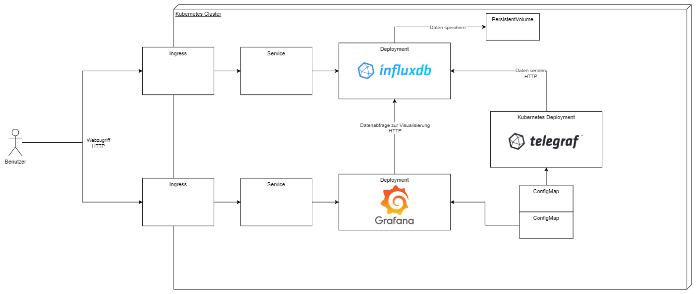
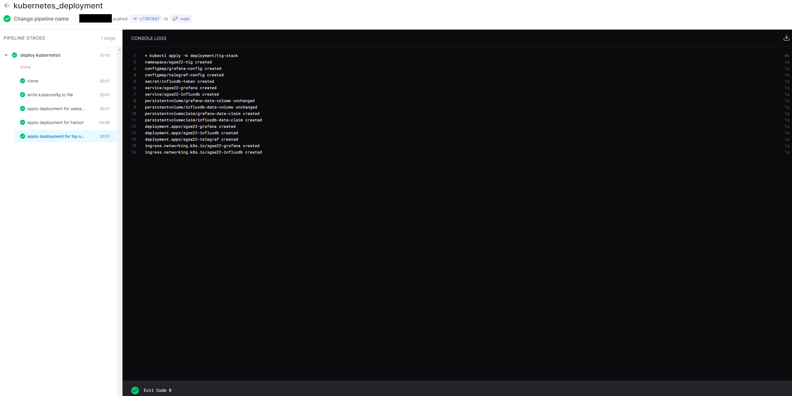

# Timo Wortmann

## Thema

**Evaluierung von Continuous Deployment Ansätzen auf Kubernetes**

## Beschreibung der Aufgabenstellung

Das Ziel dieser Praktikumsaufgabe ist es, verschiedene Ansätze des Continuous Deployments auf Kubernetes zu vergleichen und zu evaluieren. Der Hintergrund für diese Untersuchung ist der Aufbau einer Kubernetes Infrastruktur in dem Unternehmen WAGO GmbH & Co. KG. Für den AUfbau einer solchen Infrastruktur in dem Unternehmen soll Continuous Deployment angewandt werden, allerdings gibt es noch keine Ferstlegung auf eine Software, die diesen Teil übernimmt. Diese praktische Untersuchung soll daher den Unterschied zwischen verschiedenen Ansätzen aufzeigen und die Lösungen im Kontext des Unternehmens bewerten.

**Hinweis: Alle unternehmensinternen Daten (IP-Adressen, Web-Links, Namen von Benutzerkonten, etc.) wurden in der folgenden Ausarbeitung zur Sicherheit unkenntlich gemacht oder verändert.**

## Zeitplan

| Woche | Inhalt                                               |
| ----- | ---------------------------------------------------- |
| 17    | Einarbeitung Kubernetes                              |
| 18    | Einarbeitung  Deployment Ansätze + Tools             |
| 19    | Aufbau Entwicklungsumgebung                          |
| 20    | Testaufbau manuelles Deployment + Einarbeitung Tools |
| 21    | Einlesung + Aufbau Toolchain                         |
| 22    | Implementierung + Durchführung                       |
| 23    | Durchführung + Dokumentation Ergebnisse              |
| 24    | Dokumentation Ergebnisse + Ausarbeitung              |
| 25    | Finalisierung Ausarbeitung + Ergebnisse              |
| 26    | Abgabe                                               |

*Tabelle 1: Zeitplan der Ausarbeitung*

## Theoretische Grundlagen

### Kubernetes

Kubernetes ist eine Orchestrierungsplattform für Container. Durch die Verbindung von mehreren Nodes zu Clustern kann Kubernetes Load Balancing, Verteilung von persistentem Speicher und Deployments, Überprüfung von Service Health und Secret- sowie Konfigurationsmanagement übernehmen. Ein Continuous Deployment Workflow ist in  Kubernetes nicht integriert und muss durch eine externe Software bereitgestellt werden [[1]](#ref-1).

### GitOps & Ansätze des Deployments

Die in dieser Ausarbeitung behandelten Arten des Deployments basieren alle auf dem Ansatz *GitOps*. Der Begriff wurde 2017 von Weaveworks definiert. Es handelt sich dabei um ein Modell zum Betrieb von Kubernetes-Clustern und cloud-nativen Anwendungen. Dabei gilt, dass alle Dateien eines Deployments in einem Versionskontrollsystem (z.B. Git) vorliegen und dass die Dateien im Versionskontrollsystem immer dem gewünschtem Stand des Deployments in der Realität entsprechen. Das Ziel ist es, dass es nur einen Stand der Wahrheit gibt. Die Unterschiede zwischen den Dateien in dem Versionskontrollsystem und der Realität werden durch die Continuous Deployment Software oder andere Automatisierungsprozesse übernommen [[2]](#ref-2).

Deployments auf Kubernetes-Clustern werden durch YAML-Dateien beschrieben. Für das Deployment solcher Dateien gitb es zwei verschiedene Ansätze: *Push* und *Pull*.
Bei dem Push Ansatz wird eine CI/CD Pipeline verwendet, um bei Änderungen an den Dateien im Versionskontrollsystem diese neu zu deployen. Der Ansatz eignet sich, wenn neben dem Deployment noch weitere Schritte ausgeführt werden sollen, z.B. die dynamische Generierung von Zertifikaten oder Konfigurationsdateien, oder wenn bereits eine CI/CD Pipeline vorhanden ist, da diese dann nur erweitert werden muss.
Bei dem Pull Ansatz wird in dem gewünschten Kubernetes-Cluster ein Agent installiert, der in regelmäßigen Abständen den Stand der Dateien abfragt und bei Abweichungen die nötigen Änderungen vornimmt. Diese Methode hat die Vorteile, dass der Cluster nicht von außen, bzw. durch ein externes System, erreichbar sein muss, um das Deployment durchzuführen, und dass der Agent auch wieder durch ein Versionskontrollsystem verwaltet werden kann und somit dem GitOps Ansatz folgt [[3]](#ref-3).

## Verwendete Ressourcen

### Programme für das Deployment

Um die Ansätze *Push* und *Pull* zu vergleichen, werden beide Ansätze mit unterschiedlichen Programmen durchgeführt.
Für den *Push* Ansatz eignen sich Programme wie Jenkins, GitHub Actions oder Drone CI. Für diese Ausarbeitung wird Drone CI verwendet, da es bereits in dem Unternehmen angewandt wird und daher keine weitere Infrastruktur benötigt wird.
Für den *Pull* Ansatz gibt es viele weitere Programme wie beispielsweise Argo CD, Flux CD, Helm, Spinnaker und Harness. Im Rahmen dieser Ausarbeitung werden Argo CD und Flux CD verwendet, da diese in dem Bereich marktführend sind und eine große Community besitzen (Anzahl der GitHub Sterne 9.600 bei Argo CD[[4]](#ref-4) und 3.500 bei Flux CD[[5]](#ref-5)).

### Kubernetes Cluster

Der Kubernetes-Cluster, auf dem die Versuche durchgeführt werden, befindet sich im Rechenzentrum des Unternehmens und ist nicht über das Internet erreichbar. Es handelt sich dabei um einen Kubernetes Cluster mit einer Node. Die Node besitzt acht Kerne CPU und 12 Gigabyte Arbeitsspeicher. Der Kubernetes Cluster wird durch die Kubernetes [Rancher Kubernetes Engine (RKE)](https://rancher.com/products/rke) betrieben. RKE verbindet sich per SSH auf den angegebenen Nodes und legt dort die für Kubernetes benötigten Komponenten (kubelet, etcd, ...) als Docker Container an. Auch hier handelt es sich um eine Software, die bereits im Unternehmen verwendet wird. Alternativen dafür sind [minikube](https://minikube.sigs.k8s.io/docs/start/) oder [kubeadm](https://kubernetes.io/docs/setup/production-environment/tools/kubeadm/create-cluster-kubeadm/).
Ein Vergleich zu Deployments auf anderer Infratstruktur, z.B. Microsoft Azure oder Amazon EKS, ist nicht vorgesehen.

### Anwendungen zum Deployen

Um einen aussagekräftigen Vergleich der verschiedenen Ansätze und Tools durchführen zu können, werden im Rahmen dieser Ausarbeitung auch mehrere Deployments mit unterschiedlicher Architektur durchgeführt.

#### Selbstentwickelte Webandwendung

Bei dem ersten Deployment handelt es sich um eine containerisierte Webanwendung des Unternehmens. Diese wurde **nicht** im Rahmen dieser Ausarbeitung entwickelt, sondern davor. Die Anwendung besteht aus einem einzigen Container, welcher allerdings Zugansdaten über Secrets benötigt. Vor dieser Ausarbeitung wurde die Anwendung noch nicht in einem Kubernetes-Cluster betrieben und muss daher noch in eine Form umgewandelt werden, wodurch sie auf Kubernetes lauffähig ist.

#### Harbor

[Harbor](https://github.com/goharbor/harbor) ist eine Open Source Container Registry, welche standardmäßig auf Kubernetes gehostet wird. Es ist eine Anwendung, die auf Kubernetes installiert wird und dabei aus mehreren Komponenten inklusive Datenbank, Registry und Logging-Service besteht. Die Anwendung bietet die Funtkion, Images von Containern hoch- und herunterzuladen, und benötigt daher einen persistenten Speicher. Das Ziel ist es, eine Harbor-Instanz mit Hilfe der zu evaluierenden Programme auf dem Cluster zu installieren.

#### TIG-Stack

Bei dem TIG-Stack handelt es sich um einen Monitoring-Stack bestehend aus den Programmen Telegraf, InfluxDB und Grafana. Telegraf ist ein Agent, welcher Messwerte über ein bestimmtes System sammelt, z.B. Verbrauch von CPU und Arbeitsspeicher. Durch den Telegraf Agent werden die Daten in die InfluxDB geschrieben. Es handelt sich dabei um eine Datenbank für Zeitreihendaten. Das Grafan verbindet sich mit der InfluxDB und kann mit Hilfe von Dashboards und Graphen die gesammelten Daten visualisieren. Das Ziel ist es, einen lauffähigen Stack zu deployen, in dem die drei Komponenten automatisch miteinander verbunden sind und Daten untereinander austauschen können.



*Abbildung 1: Architektur des TIG-Stacks auf Kubernetes*

### Sonstige Software

Als zusätzliche Software wird auf dem Cluster das Management-Portal [Rancher](https://rancher.com/) installiert. Rancher ist eine Open Source Software und bietet ein Webinterface zum Verwalten eines oder mehrerer Kubernetes Cluster. Es dient für diese Aufgabe lediglich zur Unterstützuung bei Fehlern und zur besseren Darstellung und Überwachung der aktuellen Deployments. Rancher wird nicht über die Continuous Deployment Software installiert, sondern manuell.

## Bewertungskriterien

Der Vergleich der CD-Programme wird anhand verschiedener Bewertungskriterien durchgeführt. Diese sind Lead Time for Changes (wie lange es vom Commit im Git zur laufenden Anwendung dauert) [[6]](#ref-6), Time to Restore Service (wie lange es dauert, bis ein ausgefallener Dienst wieder hergestellt werden kann) [[6]](#ref-6), der benötigte Aufwand bei Skalierung (hinzufügen neuer Repositories, Kubernetes Ressourcen und Cluster), Nutzbarkeit des Programms und Sicherheit (Zugriffsrechte, Absicherung, etc.). 

Für die Time for Lead Changes wird die Zeit gemessen, wie schnell Änderungen an den Ressourcen im Kubernetes Cluster nach einem Commit im Git-Repository durchgeführt werden.

Für die Time to Restore Service werden einzelne Komponenten eines Deployments gelöscht und gewartet, ob die gelöschten Komponenten automatisch wieder neu erzeugt werden.

Die Skalierbarkeit wird in drei Punkten gemessen: Wie gut können neue Git-Repositories eingebunden werden? Wie gut können einzelne Ordner innerhalb eines Repositories eingebunden werden, z.B. wenn es mehrere Deployments pro Repository gibt? Kann das Programm auf mehr als einem Cluster deployen?

Die Nutzbarkeit des Programms wird anhand der während des Praktikums gesammelten Erfahrungen gemessen und bewertet.

Die Sicherheit berücksichtigt Punkte wie Authorisierung, Authentifizierung, verschlüsselte Datenkommunikation, mögliche Angriffspunkte aus dem Internet und Zugriff auf Secrets (z.B. Passwörter).

## Durchführung

### Aufsetzen des Clusters

Der erste Schritt der Durchführung ist die Installation des Kubernetes Clusters. Dazu wird die Rancher Kubernetes Engine (RKE) verwendet. Dazu kann mit dem Befehl `rke config` durch die interaktive Kommandozeile eine Konfigurationsdatei erstellt werden, die den Cluster beschreibt.


*Abbildung 2: Ausschnitt des Befehls `rke config`*

Daraufhin kann durch die entstandene [Konfigurationsdatei](./files/rke_config.yml) mit dem Befehl `rke up` der Cluster erstellt werden. Dabei wird die Datei `kubeconfig.yml` erstellt, welche die Zugriffdaten auf den Cluster und seine IP-Adresse beinhalten. Alle Aufrufe der Kommandozeile von Befehlen wie `kubectl` oder `helm` verwenden diese Datei. Durch den Befehl `export KUBECONFIG=kubeconfig.yml` wird die Datei als aktuelle Konfiguration gesetzt.

Zum weiteren Aufsetzen des Clusters gehört die Installation der Rancher Benutzeroberfläche. Diese ist als Helm Chart verfügbar. Helm ist ein Paketmanager für Kubernetes, worüber vordefinierte Pakete auf Clustern installiert werden können. Dazu müssen folgende Befehle ausgeführt werden:

```bash
helm repo add rancher-latest https://releases.rancher.com/server-charts/latest

kubectl create namespace cattle-system

kubectl -n cattle-system create secret generic tls-ca-additional --from-file=ca-additional.pem=tls/ca.crt

kubectl -n cattle-system create secret generic tls-ca --from-file=cacerts.pem=tls/ca.crt

kubectl -n cattle-system create secret tls tls-rancher-ingress --cert=tls/tls.crt --key=tls/key.pem

helm install rancher rancher-latest/rancher --namespace cattle-system -f values.yml
```

Zuerst wird das Repository der Helm Chart hinzugefügt und ein Namespace in dem Cluster erzeugt. Daraufhin müssen die Zertifikate für die Weboberfläche und die Kommunikation von Rancher zu anderen Systemen hinterlegt werden.
Bei dem Befehl `helm install` wird Rancher installiert und mit eigenen Parametern aus der Datei [`values.yml`](./files/rancher/values.yml) konfiguriert. In der Datei werden unter anderem der Hostname der Rancher Instanz und das Initialpasswort festgelegt. Im Anschluss ist die Weboberfläche über den angegebenen Hostnamen im Browser erreichbar.

### Manuelles Deployment

Bevor mit dem automatisierten Deployment begonnen wird, wurden die zu deployenden Anwendungen manuell auf dem Cluster installiert. Der Grund dafür ist, dass es sich bei den drei gewählten Programmen nicht um Standardinstallationen handelt, sondern jede davon noch zusätzliche Konfiguration benötigt. Das Ziel ist es, alle drei Anwendungsfälle zuerst manuell auf Kubernetes lauffähig zu installieren und sie danach in den CD-Programmen zu verwenden. Dazu kommt, dass die selbstentwickelte Anwendung und der TIG-Stack bisher nur als Docker-Container (bzw. Docker-Compose) vorliegen. Daher müssen noch die entsprechenden Kubernetes Ressourcen erstellt und konfiguriert werden.

Alle für das Deployment benötigten Dateien sind im Ordner [files/deployment](./files/deployment) zu finden.

##### Webanwendung

Die Webanwendung besteht nur aus einem einzigen Container und ist stateless, es werden deshalb keine Volumes benötigt. Trotzdem benötigt die Anwendung Umgebungsvariablen zur Authentifizierung, die in Form von Kubernetes Secrets übergeben werden sollen. Die gesamte Anwendung besteht daher aus einem Deployment des Containers, den Secrets für die Authentifizierung, einem Service zum Erreichen des Containers und einem Ingress, damit die Weboberfläche auch ausserhalb des Clusters über einen gewünschten Hostnamen erreichbar ist. Zusätzlich muss das Zertifikat der lokalen Certificate Authority (CA) im Container liegen, da die Anfragen zur Authentifizierung aufgrund eines selbstsignierten Zertifikats fehlschlagen.

#### TIG-Stack

Die Kubernetes Ressourcen des TIG-Stacks sind ähnlich zu der Webanwendung. Es gibt drei Deployments für die einzelnen Komponenten (Grafana, Telegraf, InfluxDB) und zwei Services und Inrgesse für den Webzugriff auf Grafana und InfluxDB. Dazu kommen die Konfiguration von Grafana und Telegraf durch ConfigMaps. ConfigMaps in Kubernetes enthalten Konfigurationsdaten, die als Datei in dem Container gemountet werden können. Darüber werden unter anderem das Initialpasswort von Grafana und die Metriken, die der Telegraf Agent sammeln soll, konfiguriert. 

Da die Daten in der InfluxDB persistent vorliegen sollen, muss dafür noch ein persistentes Volume mit dazugehörigem Claim angelegt werden. Die Daten werden durch den Typ `hostPath` auf dem Server gespeichert, auf dem der Cluster läuft. In einer produktiven Nutzung ist es auch sinnvoll, den Speicherort zentralisiert zu legen, z.B. auf einem NFS-Server oder Netzwerkspeicher. Der Grund dafür ist, dass ein Cluster mehrere Nodes haben kann und dadurch nicht mehr sichergestellt ist, ob die Dateien auch auf der richtigen Node liegen.

#### Harbor

Harbor an sich benötigt keine weiteren Kubernetes Ressourcen, da alle benötigten Komponenten durch das Installieren der Helm Chart auch mit installiert werden. Die Installation wird wie bei Rancher auch nur über eine `values.yml` Datei konfiguriert. Darin werden wieder Hostname, Initialpasswort und Art der Dateispeicherung definiert.

Da in dem Testcluster kein Storage Provisioner installiert ist, der automatisch Volumes erzeugt und benötigten Speicherplatz zuweist, sind die Volumes der Harbor-Komponenten zusätzlich definiert. Dadurch müsssen neben der Helm Chart weitere Kubernetes Ressourcen deployed werden. In der Konfigurationsdatei der Helm Chart wird dann auf die existierenden Volume Claims referenziert.

### Installation der Continuous Deployment Programme

Im nächsten Schritt werden die Continuous Deployment Programme FluxCD, ArgoCD und Drone installiert.

#### Drone

Für Drone ist keine weitere Installation notwendig, da es bereits eine unternehmensinterne Instanz gibt, die für das Praktikum verwendet werden kann. Weitere Schritte sind nur im Deployment notwendig.

#### Argo CD und Flux CD

Die Installation von Argo CD und FLux CD wurden nach den Anleitungen aus der jeweiligen Dokumentation [[7](#ref-7), [8](#ref-8)] übernommen:

Durch den Befehl `kubectl apply -n argocd -f https://raw.githubusercontent.com/argoproj/argo-cd/stable/manifests/install.yaml` werden die vordefinierten Ressourcen für Argo CD installiert. Danach kann auf das Programm entweder über die Kommandozeile oder die Weboberfläche von Argo CD zugegriffen werden.

Für Flux CD muss zuerst die CLI heruntergeladen werden. Diese kann mit dem Befehl `curl -s https://fluxcd.io/install.sh | sudo bash` installiert werden. Die CLI von Flux verwendet den gleichen Kubernetes Cluster wie der Befehl `kubectl`, daher muss keine extra Konfiguration vorgenommen werden. Durch den Aufruf von `flux install -n flux` werden alle benötigten Komponenten im Cluster in dem Namespace `flux` installiert. Nach der Installation kann diese mit dem Aufruf des Befehls `flux check -n flux` überprüft werden.


*Abbildung 3: Ausgabe des Befehls `flux check -n flux`*


### Deployment der Anwendungen

#### Drone

Der erste Schritt bei dem Deployment mit Drone ist die Aktivierung eines Repositories über die Weboberfläche. Durch die Aktivierung wird bei dem GitHub Server, auf dem das Repository liegt, ein Webhook angelegt. Dieser Webhook löst bei einem Commit im Repo eine oder mehrere Pipelines auf dem Drone Server aus. Im Anschluss daran wird die Kubeconfig mit Zugangsdaten zum Kubernetes Cluster bei Drone als Secret mit dem Namen `KUBECONFIG` hochgeladen. Der Inhalt wurde vor dem Hochladen mit Base64 encodiert, da Drone ansonsten Probleme mit ganzen Dateien als Secrets haben kann. 

Die Definition der Pipeline erfolgt im gleichen Repository, wo auch die Deployments liegen. Die Pipelines werden in der Datei `.drone.yml` beschrieben. Die Datei kann auch mehrere Pipelines enthalten. In diesem Fall wird nur eine Pipeline verwendet, um die dre Deployments durchzuführen. Beii jedem Schritt einer Drone Pipeline wird ein angegebener Container gestartet, die Befehle darin ausgeführt und der Container danach wieder gelöscht. 

```yaml
# Erster Schritt der Drone Pipeline
steps:
  - name: write kubeconfig to file
    # Image von Docker Hub
    image: alpine:3.16.0
    # Ausgeführte Befehle
    commands:
      - echo $KUBECONFIG_FILE | base64 -d > kubeconfig.yml
    # Referenz auf das Secret KUBECONFIG
    environment:
      KUBECONFIG_FILE:
        from_secret: KUBECONFIG
```

In dieser Pipeline wird zuerst ein `alpine` Container gestartet, in dem das vorher angelegte Secret als Umgebungsvariable eingespielt wird. Die Umgebungsvariable wird ausgelesen, wieder aus Base64 dekodiert und in eine Datei geschrieben. Alle Container einer Pipeline teilen sich das gleiche Arbeitsverzeichnis, in welches vor Beginn der Pipeline das Git-Repository gecloned wird. Angelegte Dateien, wie in diesem Fall die `kubeconfig.yml` bleiben dadurch auch anderen Schritten der Pipeline erhalten. Alle angelegten Dateien werden nach dem Ausführen der gesamten Pipeline wieder gelöscht.

In den darauf folgenden Schritten werden die Deployments für Harbor, den TIG-Stack und die Webanwendung durchgeführt. Dafür wird das Image `bitnami/kubectl` verwendet, da dieses die CLI `kubectl` beinhaltet. Für das Deployment von Harbor wird zusätzlich die CLI `helm` benötigt, welche im Docker-Image `alpine/k8s` vorhanden ist. Diese Schritte referenzieren die zuvor erstelle Kubeconfig übder die Umgebungsvariable `KUBECONFIG`, welche auf den Pfad der Datei zeigt (im aktuellen Arbeitsverzeichnis der Container).

```yaml
# Schritte der Drone Pipeline zum Deployment von Harbor und TIG-Stack
  - name: apply deployment for harbor
    image: alpine/k8s:1.21.12
    commands:
      - helm repo add harbor https://helm.goharbor.io
      - kubectl apply -f deployment/harbor/volumes.yml
      # Der Befehl upgrade --install installiert die Chart, wenn sie noch nicht vorhanden ist oder verändert sie andernfalls
      - helm upgrade --install harbor harbor/harbor -f deployment/harbor/values.yml
    # Referenz auf die vorher erstellte kubeconfig.yml
    environment:
      KUBECONFIG: kubeconfig.yml

  - name: apply deployment for tig-stack
    image: bitnami/kubectl:1.23.5
    commands:
      - kubectl apply -k deployment/tig-stack
    environment:
      KUBECONFIG: kubeconfig.yml
```

Damit die Pipeline bei jedem Commit auf den Branch `main` ausgeführt wird, wird zu Beginn der Pipeline ein Trigger erstellt, der bei Commits (`push`) oder durch manuelles Starten der Pipeline über die Weboberfläche (`custom`) ausgelöst werden kann:

```yaml
# Trigger in Drone Pipeline
trigger:
  branch:
    - main
  event:
    - push
    - custom
```

Nach einem Commit auf den Branch wird der Drone Server durch den Webhook von GitHub benachrichtigt und startet die Pipeline. Das Deployment wird dabei erfolgreich durchgeführt. Das Ausführen der Schritte zusammen dauert nach Angabe der Weboberfläche zehn Sekunden. Dazu kommt noch die Zeit, die die Kubernetes Ressourcen benötigen, um vollständig bereit zu sein.



*Abbildung 4: Ansicht der Pipeline nach Ausführung in der Weboberfläche von Drone*

#### Argo CD

Das Deployment der Ressourcen über Argo CD kann über die Weboberfläche oder Kommandozeile erfolgen. Für dieses Praktikum wird die Weboberfläche verwendet.

im ersten Schritt erfolgt die Anmeldung auf der Weboberfläche. Da kein externer Identity Provider eingestellt ist, wird nur das Initialpassword benötigt, welches mit dem Befehl `kubectl -n argocd get secret argocd-initial-admin-secret -o jsonpath="{.data.password}" | base64 -d; echo` ausgelesen werden kann [[7]](#ref-7). 

Daraufhin wird das Repository hinzugefügt, aus dem die Definitionen der Kubernetes Ressourcen stammen. Das Hinzufügen erfolgt in der Weboberfläche über `Manage your repositories, projects, settings -> Repositories -> Connect Repository using HTTPS`. In einer produktiven Nutzung ist es empfehlenswert, für die hinterlegten Zugriffsdaten auf das Repository entweder eine GitHub App zu registrieren oder einen Account zu verwenden, der keiner realen Person zugeordnet ist. Dadurch gibt es eine strikte Trennung der Zugriffsrechte (z.B. nur lesenden Zugriff) und es gibt keine Probleme, wenn ein Entwickler aus dem Repository entfernt wird.


*Abbildung 5: Hinzufügen eines Repositories bei Argo CD*

Auf der Übersichtsseite der Repositories kann nun direkt eine Applikation aus dem Repository erstellt werden:


*Abbildung 6: Hinzurügen einer Applikation bei Argo CD*

In der darauf geöffneten Übersicht können Optionen bezüglich des Git-Branches und Ordners und der Sync-Policy eingestellt werden:


*Abbildung 7: Konfiguration einer Applikation bei Argo CD*

Für das Praktikum ist die Sync Policy `Automatic` mit den Optionen `Prune Resources` und `Self Heal` ausgewählte. Durch die automatische Synchronisation werdne Änderungen im Git-Repository erkannt. Durch `Prune Resources` werden nicht mehr vorhandene Ressourcen gelöscht und durch `Self Heal` werden alle Änderungen, die nicht dem Stand im Repository entsprechen, sofort überschrieben. Diese Optionen wurden so gewählt, damit es möglichst keine Unterschiede zwischen dem Stand im Repository und der Wirklichkeit entsteht (Prinzip nach GitOps).

Das Anlegen einer Applikation bei Argo CD erfolgt dreimal, für die Webanwendung, Harbor und den TIG-Stack. Der Unterschied ist nur der Name der Applikation, der Kubernetes Namespace und der Ordnerpfad im Git-Repository.

Das Deployment von Harbor erfolgt als Helm-Chart. Anstelle eines Git-Repositories kann bei Argo CD auch ein Helm-Chart Repository als Quelle ausgewählt werden. Dabei muss sich die Konfigurationsdatei `values.yml`, wodurch die Anwendung konfiguriert wird, sich im gleichen Repository befinden, wie die Helm Chart. Da sich die Harbor Helm-Chart in einem öffentlichen Repository befindet, wird als Quelle das interne Git-Repository verwendet, in dem durch die Datei `kustomization.yml` auf das öffentliche Repository referenziert wird. Damit dies funktioniert, muss in dem Kubernetes Secret `argocd-cm` der Key `kustomize.buildOptions` auf den Wert `--enable-helm` gesetzt werden, da das Deployment ohne die Option fehlschlägt [[9]](#ref-9).

Nach der Einrichtung der Applikationen werden die definierten Ressourcen erfolgreich auf dem Cluster deployed. In der Weboberfläche von Argo CD befindet sich auch eine Übersicht der Applikationen mit Status, welche Komponenten noch nicht erfolgreich sind.


*Abbildung 8: Übersicht der Argo CD Applikationen mit Health Status* 

#### Flux CD

Das Einrichten der Deployments bei Flux CD erfolgt über die Kommandozeile. Zuerst müssen die Zugriffsdaten auf das Git-Repository mit den Deployment Dateien angelegt werden. Dazu bietet die CLI von FLux den Befehl `flux create secret git`:

```bash
flux create secret git sgse22 -n flux \
    --url="https://$GIT_URL/kubernetes_deployment.git" \
    --username="$USERNAME" \
    --password="$PASSWORD" \
    --ca-file /etc/ssl/certs/ca-certificates.crt
```

Der Zugriff auf das Repository erfolgt über HTTPS, weshalb Benutzername und Passwort angegeben werden müssen. Da Das Repository auf einem Server mit selbstsignierten Zertifikaten liegt, wird zusätzlich das Zertifikat der Certificate Authority mitgegeben. Ohne diesen Schritt zeigt Flux eine Fehlermeldung, dass das Zertifikat nicht validiert werden kann.

Mit den funktionierenden Zugangsdaten kann Flux nun auf das Repository zugreifen. Dazu kann entweder wieder die Kommandozeile verwendet werden oder das Repo durch eine YAML-Datei beschrieben werden und anschließend durch den Befehl `kubectl apply -f repo.yml` aktiviert werden:

```yaml
apiVersion: source.toolkit.fluxcd.io/v1beta2
kind: GitRepository
metadata:
  name: sgse22
  namespace: flux
spec:
  interval: 30s
  ref:
    branch: main
  # Referenz der vorher angelegten Zugangsdaten
  secretRef:
    name: sgse22
  # Link zum Repo
  url: https://<git-url>/kubernetes_deployment.git
```

Die Aktivierung des Repositories bedeutet noch nicht, dass automatisch die Anwendungen deployed werden. Dazu müssen Ressourcen vom Typ `Kustomization` definiert werden, welche das vorher angelegte Repository referenzieren. Darin werden dann die Ordnerpfade zu den Deployments angegeben. Für diese Ausarbeitung muss daher das Repository nur einmal angelegt werden und im Anschluss drei verschiedene `Kustomization` Ressourcen für Harbor, den TIG-Stack und die Web-App.

```yaml
apiVersion: kustomize.toolkit.fluxcd.io/v1beta2
kind: Kustomization
metadata:
  name: sgse22
  namespace: flux
spec:
  # Abfrageintervall nach Änderungen
  interval: 30s
  # Ordnerpfad zum Deployment
  path: ./deployment/webapp
  prune: true
  # Referenz auf das vorher angelegte Repository
  sourceRef:
    kind: GitRepository
    name: sgse22
```

Nach dem Deployment kann der Befehl `flux get all -n flux` verwendet werden, um den Status der Deployments zu überwachen:


*Abbildung 9: Ausgabe des Befehls `flux get all -n flux`* 

Bei dem Deployment von Argo CD wurde die Helm Chart von Harbor mit Hilfe von Kustomize deployed, da Argo CD keine Konfiguration aus einem anderen Repository erlaubt. Flux CD bietet diese Möglichkeit. Dazu muss statt einer `GitRepository` Ressource ein `HelmRepository` erstellt werden, welches durch ein `HelmRelease` referenziert werden kann. Die Konfiguration der Helm-Chart kann dann über eine `ConfigMap` eingespielt werden.

```yaml
apiVersion: source.toolkit.fluxcd.io/v1beta2
kind: HelmRepository
metadata:
  name: harbor
  namespace: harbor
spec:
  # Referenz auf öffentliches Helm Repo, wo Harbor liegt
  url: https://helm.goharbor.io
  interval: 5m
---
apiVersion: helm.toolkit.fluxcd.io/v2beta1
kind: HelmRelease
metadata:
  name: harbor
  namespace: harbor
spec:
  interval: 30s
  chart:
    spec:
      chart: harbor
      version: "1.9.1"
      sourceRef:
        # Referenz auf das vorher definierte Repo
        kind: HelmRepository
        name: harbor
        namespace: harbor
  valuesFrom:
    # Konfiguration durch die ConfigMap
    - kind: ConfigMap
      name: harbor-values
      valuesKey: values.yml
```

Durch das Deployment einer Helm Chart ohne Kustomize wird die Option `--enable-helm` für Flux CD nicht benötigt. Außerdem kann so das öffentliche Helm Repository auf Änderungen überwacht werden.

## Bewertung

### Lead Time for Changes 

#### Drone

Drone wird jedes mal ausgelöst, wenn ein Commit in dem Git-Repository veröffentlicht wird. Dabei wird der Drone Server durch einen Webhook von GitHub benachrichtigt. Die Lead Time for Changes setzt sich dadurch aus der Zeit der Übertragung des Webhooks und der Laufzeit der Pipeline zusammen. 

Die Dauer des Webhooks kann in den Einstellungen des Repositories abgelesen werden und beträgt zwischen 0,25 und 0,4 Sekunden. Die Laufzeit der Pipeline kann über die Weboberfläche von Drone eingesehen werden und beträgt kombiniert für die drei Deployments etwa zehn Sekunden pro Durchführung, sowohl für ein initiales Deployment als auch nachfolgende Änderungen. Die Gesamtzeit beträgt damit 10,25 bis 10,4 Sekunden.

#### Argo CD
Da die Projekte bei Argo CD mit der Sync Policy `Automatic` konfiguriert sind, wird der Stand des Git-Repositories in regelmäßigen Abständen überprüft. Dieser Abstand beträgt in der Standardkonfiguration drei Minuten. Bei Änderungen werden die Änderungen sofort übernommen. Der Sync Status bei Argo CD wird dabei deutlich in der Weboberfläche dargestellt (Grün bei aktuellem Stand, Gelb bei ausstehenden Änderungen und Rot bei Fehlern). 


*Abbildung 10: Sync status der Argo CD Applikation*

#### Flux CD

Die Time for Lead Changes bei Flux Cd ist konfigurierbar. Die Ressource `GitRepository` besitzt das Feld `interval`, welches frei wählbar ist. Nach Ablauf des Intervalls wird das Git-Repository in einem der Container gecloned und auf Änderungen überprüft. Außerdem wird ein Intervall in der Ressource `Kustomization` angegeben. Nach diesem Intervall wird das Deployment auf Änderungen mit dem heruntergeladenen Repo überprüft [[10](#ref-10)].

Durch das konfigurierbare Intervall ist die Time for Lead Changes frei wählbar. Die in der Ausarbeitung gewählten 30 Sekunden wurden in den Deployment Vorgängen nicht überschritten.

### Time to Restore Service

#### Drone

Bei Drone gibt es keine automatische Überprüfung, ob die deployten Ressourcen noch dem gewünschtem Stand entsprechen oder ob Fehler vorliegen. Ein neues Deployment muss entweder durch einen neuen Commit oder durch das manuelle Starten der Pipeline ausgelöst werden. Um einen Ausfall eines Deployments zu bemerken müssten daher externe Programme zur Überwachung des Health Status der Anwendungen verwendet werden. Die Time to Restore Services setzt sich aus der Zeit zwischen dem Ausfall und der Bemerkung durch ein externes System oder eine Person und die Ausführzeit der Pipeline zusammen. Es kann dadurch keine genaue Aussage über einen genauen Zeitwert zum Deployment getätigt werden.

#### Argo CD

Argo CD überwacht standardmäßig den Health Status aller definierten Ressourcen. Dazu gehören beispielsweise Healthchecks von Containern über HTTP und die Überprüfung der YAML-Definition im Cluster. Die hier deployten Applikationen haben die Option `self-heal` aktiviert. Dadurch werden erkannte Änderungen wie bei der Lead time for Changes in wenigen Minuten behoben. Zur Überprüfung dieser Zeit können einzelne Ressourcen aus einem der Deployments gelöscht werden, ohne die YAML-Definitionen zu ändern. Im Falle des Löschen des Harbor-Core Deployments, wurde dieses zwei Sekunden nach der Löschung wieder neu erstellt. Dazu kommen nur noch die 20 Sekunden, die der Container zum Starten benötigt. Die Time to Restore Services ist mit der Option `self-heal` damit sehr gering.

#### Flux CD

Im Gegensatz zu Argo CD werden neue Deployments nur ausgeführt, wenn sich die Ressourcen im Git-Repository ändern, nicht wenn die Ressourcen im Kubernetes verändert oder gelöscht werden. Ähnlich wie bei Drone wird eine Reparatur eines Deployments daher manuell oder durch einen neuen Commit ausgelöst und nicht nach einem bestimmten Intervall.

### Skalierbarkeit

#### Drone

Wenn die Anzahl der Repositories skaliert werden soll, müssen diese nur in der Weboberfläche von Drone aktiviert werden. Das Hinzufügen neuer Ordner innerhalb eines Repositories bedingt Anpassungen an der Pipeline. Da Drone Pipelines nicht bei Änderungen bei bestimmten Dateien ausgeführt werden können (z.B. Pipeline für Web-App nur bei Änderungen im Ordner webapp), werden Pipelines bei jedem Commit ausgeführt. Wenn ein Repository mehrere Deployments enthält, könnte es dadurch zu Komplikationen führen. Die Skalierbarkeit in Drone ist daher darauf ausgelegt, einzelne Repositories für Deployments anzulegen und nicht ein Repository, in dem alle Deployments liegen. Der Verwaltungs- und Entwicklungsaufwand steigt dadurch mit jedem Deployment.

Ein Nachteil bei der Aufteilung auf mehrere Repositories ist, dass jedes Repository eine eigene Definition der Pipeline enthalten muss. Dadurch gitb es keien einheitliche Definition aller Kubernetes Deployment-Vorgänge. Um dem entgegenzuwirken, können Pipeline Templates verwendet werden. Pipeline Templates enthalten eine zentrale Grundkonfiguration einer Pipeline, die in den Repositories referenziert und mit Parametern gefüllt werden kann. Dadurh ist trotzdem nicht gewährleistet, dass alle Repositories die Template verwenden. Dazu kommt, dass die Templates nicht versioniert werden können. Nach Änderungen an der zentralen Vorlage könnten manche Deployments nicht mehr funktionieren.

Das Einbinden neuer Cluster bei Drone ist auch möglich, wenn die verwendete `kubeconfig.yml` angepasst wird.

#### Argo CD

Anwendungen in Argo CD lassen sich leicht skalieren. Eine Anwendung bei Argo CD bezieht sich immer auf einen bestimmten Ordner im Git-Repository, wodurch ein Repositry auch mehrere Deployments enthalten kann. 

Argo CD Applikationen sind, wie die Deployments auch, Kubernetes Objekte und können durch YAML-Dateien beschrieben werden. Das Hinzufügen neuer Deployments kann daher durch das Kopieren einer Datei und Anpassung der Parameter darin erfolgen. Die Dateien können in einem Repository liegen, welches durch Argo überwacht wird. So folgen sogar die Applikationen nach GitOps und die Verwendung der Weboberfläche oder Kommandozeile ist nur zue initialen Einrichtung notwendig. Argo CD bietet somit eine hohe Skalierbarkeit.

Argo CD bietet außerdem die Möglichkeit, Anwendungen auf anderen Clustern zu starten. Die Funktion wurde in dieser Ausarbeitung nich betrachtet, da nur ein Cluster zu Verfügung stand. Obwohl diese Funktion in der Ausarbeitung nicht verwendet wurde, steigt dadurch die Skalierbarkeit von Argo CD.


#### Flux CD

Für das Hinzufügen neuer Repositories in Flux CD muss nur eine Kubernetes Ressource vom Typ `GitRepository` mit minimaler Konfiguration erstellt werden und, falls nicht vorhanden, Zugangsdaten registriert werden. Das Hinzufügren neuer Deployments ist ähnlich, da dafür eine Kubernetes Ressource vom Typ `Kustomization` angelegt werden muss. Da beide Ressourcen schnell konfigurierbar sind und auch durch GitOps verwaltet werden können, besitzt Flux CD eine gute Skalierbarkeit.

Flux CD kann allerdings Anwendungen nur auf einem Cluster deployen, nicht auf mehreren.

### Nutzbarkeit/Bedienbarkeit

#### Drone

Der Zugriff auf Drone erfolgt primär über die Weboberfläche. Nach der einmaligen Registrierung darauf kann auch die Kommandozeile verwendet werden, um z.B. neue Repositories zu aktivieren oder den Status der Pipeline abzufragen. Da in dieser Ausarbeitung nur die Weboberfläche verwendet wurde, beziehen sich die folgenen Aussagen auch nur auf die Weboberfläche.

Da Drone von sich aus eine kleine Anwendung ist, ist auch die Weboberfläche übersichtlich. Es gibt eine filterbare Ansicht aller Repositories mit dem letzten Status der Pipeline. Die Repositories sind allerdings nur nach dem Namen filterbar. So könnten Pipelines, die ein Kubernetes Deploymnent durchführen, nicht schnell gefunden werden, wenn der Name des Repositories nicht aussagekräftig ist.

Auf der Übersichtsseite eines Repositories sind die Zeiten der Pipelines und deren Historie zu erkennen. Durch einen Klick auf eine Pipeline werden die Logs der darin ausgeführten Docker Container angezeigt. Die Asicht der Pipelines ist sehr übersichtlich und der Status farblich markiert (Rot bei Fehlern, Grün bei erfolgreichem Ausführen).

Das Hinzufügen neu erstellter Repositories ist nicht immer intuitiv, da diese in Drone nur bei erneuter Anmeldung oder Synchronisation der Repositories durch den Benutzer angezeigt werden. Davor weiß der Drone Server nicht, dass die Repositories existieren. 

Ein großer Vorteil von Drone ist die Ausführung von weiteren Schritten neben dem Deployment von Kubernetes Ressourcen. Da die Pipelines frei definierbar sind, können auch weitere Skripte, z.B. zum Generieren von Konfigurationsdateien oder dynamischem Abfragen von Daten aus einer API, ausgeführt werden.

#### Argo CD

Argo CD kann über die Kommandozeile oder Weboberfläche verwendet werden. Da in diesem Praktikum nur die Weboberfläche verwendet wurde, kann auch nur eine Aussage über die Nutzbarkeit dieser getätigt werden. 

Die Weboberfläche an sich ist sehr übersichtlich, da es nur vier Hauptkategorien gibt: Die Verwaltung von Applikationen, das Hinzufügren von Repositories, Secrets und Konfigurationen, der Info über den angemeldeten Benutzer und einer Referenz auf die Dokumentation von Argo CD. Das Hinzufügen neuer Anwendungen ist intuitiv, da neben jedem Feld ein Hilfstext ist, der das Feld erklärt. Zusätzlich haben die meisten Felder eine automatische Füllung aus den bereits konfigurierten Einstellungen.

Die Übersicht der aktuellen Kubernetes Ressourcen ist übersichtlich gehalten und einzelne Stati des Deployments sind eindeutig durch die Farben Rot, Gelb und Grün gekennzeichnet. Es gibt eine große Auswahl an Filter- und Suchfunktionen, um die Ansicht weiter einzugrenzen. Zusätzlich gibt es eine Übersicht aller Ressourcen einer Applikation als Diagramm. Durch dieses Diagramm können einzelne Ressourcen genauer untersucht werden. 


*Abbildung 11: Diagramm einer Applikation bei Argo CD*

Zusammengefasst ist die Bedienbarkeit der  Weboberfläche von Argo CD sehr hoch. Es ist keine große Einarbeitung notwendig, um die Oberfläche zu verstehen. Für automatisierte Systeme oder Entwickler ohne Webzugriff kann auch die Kommandozeile verwendet werden. Zusätzlich lassen sich alle über die Weboberfläche angelegten Ressourcen durch YAML-Dateien beschreiben und können über unterschiedliche Wege auf dem Cluster gestartet werden.

#### Flux CD

Im Gegensatz zu Drone und Argo CD besitzt Flux keine Weboberfläche, sondern nur eine CLI. Alternative können Ressourcen auch als YAML-Dateien definiert und über `kubectl` oder Rancher hochgeladen werden. Für Entwickler, die sowieso schon mit Kubernetes arbeiten ist die Nutzbarkeit von Flux CD daher schon bekannt. Zu Erlernen sind nur die neu hinzugefügten Ressourcen (`GitRepository`, `Kustomization`, etc.).

Die Installation von Flux CD ist einfach gehalten und gut dokumentiert. Das Anlegen neuer Deployments benötigt nur wenig Konfiguration. Des Weiteren helfen Befehle wie `flux check` und `flux get all` den Status von Flux CD und den aktiven Deployments zu überwachen. Die Bedienbarkeit ist daher nicht so hoch wie bei Argo CD, aber trotzdem gut.

### Sicherheit

#### Drone

Sensible Daten, z.B. Passwörter und Zertifikate, werden bei Drone als Secreta hinterlegt. Diese können nur einmalig angelegt werden und nur durch die Ausführung einer Pipeline gelesen werden. Sie liegen zusätzlich verschlüsselt in der Datenbank von Drone. Die Kommunikation mit dem Drone Server erfolgt über HTTPS und ist damit auch verschlüsselt [[10](#ref-10)].

Drone an sich besitzt keine genaue Steuerung von Zugriffsrechten. Stattdessen werden die Rechte einzelner Benutzer bei Drone durch die Rechte in der verbundenen GitHub-Instanz vergeben. Das bedeutet, ein Benutzer hat bei Drone nur Zugriff auf Repositories, auf die auf bei GitHub Zugriff besteht. Sobald ein Benutzer Dateien in dem Git-Repo hochladen kann, darf er auch Pipelines ausführen [[11](#ref-11)]. Der Nachteil dabei ist, dass es zu ungewollten Änderungen kommen kann, wenn z.B. ein Entwickler eine Pipeline ausführt, auf die er keinen Zugriff haben soll.

Ein weiterer Nachteil ist, dass der Cluster von dem Drone Server und der Drone Server von der GitHub Instanz erreichbar sein muss. Der Drone Server muss den Kubernetes Cluster erreichen, um der Push ein Deployment zu starten. Der Drone Server muss durch die GitHub-Instanz erreichbar sein, um durch einen Webhook Pipelines auszulösen. Dadurch gibt es zwei potenzielle Angriffsziele. Es ist daher empfehlenswert, externe Sicherheitsmechanismen, wie z.B. eine Web-Application Firewall oder virtuelle Netze und Netzwerkbeschränkungen zu verwenden.

#### Argo CD

Argo CD bietet Sicherheit in verschiedenen Kategorien. Die Authentifizierung an Argo CD erfolgt über JSON Webtoken. Benutzer können entweder manuell angelegt werden (wie der Standardadmin in dieser Ausarbeitung), oder über Single Sign-on durch einen externen Identity Provider durch beispielsweise OIDC oder Microsoft Active Directory angebunden werden. Die Kommunikation mit dem Server erfolgt verschlüsselt über TLS [[12](#ref-12)].

Die Zugangsdaten, die Argo CD verwendet, um auf Git-Repositories zuzugreifen, werden als Secrets im Kubernetes Cluster gespeichert. Aufgrund der Funktionsweise von Kubernetes kann der Zugriff darauf durch Kubernetes Role Based Access Control (RBAC) gesteuert werden [[12](#ref-12)]. Da im Unternehmen standardmäßig Rancher für den Zugriff auf Cluster verwendet wird, kann der Zugriff durch die Rechtevergabe von Rancher weiter eingeschränkt werden. Dies passiert unabhängig von Argo CD.

Neben der Steurung der Authorisierung und Authentifizierung bietet Argo CD die Möglichkeit, Audit Logs zu sammeln [[12](#ref-9)].

Zusammengefasst bietet Argo CD viele Möglichkeiten der Absicherung durch Authorisierung, Authentifizierung, Verschlüsselung und Audit Logging. Dazu kommt, dass ein Cluster, der durch Argo CD betrieben wird, nicht aus dem Internet erreichbar sein muss, da Argo CD ein Pull-Deployment ausführt. 

#### Flux CD

Flux CD bietet keine eigene Benutzerverwaltung, sondern integriert sich mit dem RBAC des Kubernetes Clusters. In der Grundausstattung reicht das System aus, um die Rechteverteilung an einzelne Benutzer zu vergeben. Bei der Verwendung mit vielen Benutzer mit unterschiedlichen Rollen, sollte ein externer Identity Provider (z.B. OAuth oder Microsoft Active Directory) durch Programme wie Rancher hinzugefügt werden. Flux CD bietet diese Möglichkeit nicht [[10](#ref-11)].

Ein Vorteil von Flux CD ist, dass der Cluster keinen öffentlichen Zugriff durch das Versionskontrollsystem oder eine CI Pipeline benötigt, da Flux CD nach dem Pull-Prinzip arbeitet.

Die Zugangsdaten, die Flux CD zum Zugriff auf das Versionskontrollsystem verwendet, werden als Kubernetes Secrets im Cluster gespeichert. Auch hier wird der Zugriff über RBAC gesteuert [[10](#ref-10)].

Da die meisten sicherheitsrelevanten Punkte von Flux CD (Authentifizierung, Authorisierung, Zugriff auf Secrets) nicht von Flux CD erfüllt werden, sondern dafür ein externes System bzw. eine externe Konfiguration notwendig ist, wird die Sicherheit von Flux CD nur als mittelmäßig bewertet.

## Fazit

| -           | Lead time for Changes               | Time to restore Services             | Skalierbarkeit                           | Nutzbarkeit | Sicherheit  |
| ----------- | ----------------------------------- | ------------------------------------ | ---------------------------------------- | ----------- | ----------- |
| **Drone**   | 10,25-10,4 Sekunden                 | Nicht bestimmbar                     | Mittelmäßig (nur Cluster)                | Gut         | Mittelmäßig |
| **Argo CD** | bis zu 3 Minuten                    | <10 Sekunden + Dauer des Deployments | Sehr Hoch    (Repos, Ordner und Cluster) | Sehr Gut    | Hoch        |
| **Flux CD** | bis zu 30 Sekunden (konfigurierbar) | Nicht bestimmbar                     | Hoch (Repos und Ordner)                  | Gut         | Mittelmäßig |

*Tabelle 2: Bewertungsmatrix der Ergebnisse*

Abschließend kann die Aussage getätigt werden, dass alle drei untersuchten Programme (Drone, Flux CD und Argo CD) sich für die Anwendungsfälle zum Deployment einer Webanwendung, eines Monitoring-Stacks und einer Helm-Chart eignen. Anhand der im vorherigen Abschnitt beschriebenen und in Tabelle 2 zusammengefassten Bewertungskriterien können die Programme und deren unterliegende Ansätze (Pull vs. Push) abschließend miteinander verglichen werden.

Der Push-Ansatz mit Drone bietet eine schnelle Time for Lead Changes, kann aber keine automatische Wiederherstellung von Deployments übernehmen. Im Vergleich zum Pull-Ansatz ist die Sicherheit ein höherer Nachteil, da der Kubernetes Cluster von außerhalb erreichbar sein muss. Bei dem Pull-Ansatz gibt es auch Unterschiede, je nachdem welches Programm für das Deployment verwendet wird. Argo CD bietet gegenüber Flux CD eine größere Reihe von Funktionen, bessere Skalierbarkeit, Sicherheit und eingebaute Recovery. 

**Da Argo CD die anderen Programme in allen untersuchten Bewertungskriterien, außer der Lead time for Changes, übertrifft, ist das Ergebnis dieser Ausarbeiutung, dass sich Argo CD am Besten für Continuous Deployment auf Kubernetes Clustern im untersuchten Unternehmenskontext eignet.**

## Fortführende Arbeit

Diese Ausarbeitung stellt eine Grundlage zur Auswahl verschiedener Continuous Deployment Programme auf Kubernetes dar. Darauf aufbauend gibt es mehrere Möglichkeiten, die Arbeit fortzusetzen:

Bei Bedarf können weitere bekannte Continuous Deployment Programme wie GitHub Actions, Jenkins, Spinnaker oder Fleet untersucht und mit den hier behandelten Programmen verglichen werden. Die hier ausgewählten Programme stellen nur einen kleinen Teil des Markts dar.

Falls das Ergebnis der Arbeit ausreichend ist, kann Argo CD in einer produktiven Umgebung mit größeren Clustern (mehrere Nodes) und anderen Anwendungen getestet werden. Dabei wäre es hilfreich, wenn weitere Funktionen von Argo CD, wie beispielsweise die Anbindung externer Identity Provider oder das Deployment auf mehreren Cluster, genauer untersucht und beschrieben werden. 

## Referenzen

<span id="ref-1">[1]: *What is Kubernetes?*, 2022. Verfügbar unter https://kubernetes.io/docs/concepts/overview/what-is-kubernetes/, zuletzt zugegriffen am 20.6.2022.</span>

<span id="ref-2">[2]: M. D'Amore, *GitOps and ArgoCD: Continuous deployment and maintenance of a full stack application in a hybrid cloud Kubernetes environment*, 2021. Verfügbar unter https://webthesis.biblio.polito.it/18142/1/tesi.pdf, zuletzt zugegriffen am 20.06.22</span>

<span id="ref-3">[3]: W. Chia, *Push vs. Pull in GitOps: Is There Really a Difference?*, 2021. Verfügbar unter https://thenewstack.io/push-vs-pull-in-gitops-is-there-really-a-difference/, zuletzt zugegriffen am 20.06.22</span>

<span id="ref-4">[4]: *Argo CD GitHub*. Verfügbar unter https://github.com/argoproj/argo-cd/, zuletzt zugegriffen am 20.06.22</span>

<span id="ref-5">[5]: *Flux CD GitHub*. Verfügbar unter https://github.com/fluxcd/flux2, zuletzt zugegriffen am 20.06.22</span>

<span id="ref-6">[6]: D. G. Portman, *Are you an Elite DevOps performer? Find out with the Four Keys Project*, 2020. Verfügbar unter https://cloud.google.com/blog/products/devops-sre/using-the-four-keys-to-measure-your-devops-performance, zuletzt zugegriffen am 23.06.22</span>

<span id="ref-7">[7]: *Argo CD Getting started*. Verfügbar unter https://argo-cd.readthedocs.io/en/stable/getting_started/, zuletzt zugegriffen am 22.06.22</span>

<span id="ref-8">[8]: *Flux CD Installation*. Verfügbar unter https://fluxcd.io/docs/installation/, zuletzt zugegriffen am 22.06.22</span>

<span id="ref-9">[9]: *Argo CD Issue: Support --enable-helm flag for kustomize*. Verfügbar unter https://github.com/argoproj/argo-cd/issues/7835, zuletzt zugegriffen am 23.06.22</span>

<span id="ref-10">[10]: *Flux CD: Docs*. Verfügbar unter https://fluxcd.io/docs/, zuletzt zugegriffen am 23.06.22</span>

<span id="ref-11">[11]: *Drone CI / CD: Docs*. Verfügbar unter https://docs.drone.io/, zuletzt zugegriffen am 23.06.22</span>

<span id="ref-12">[12]: *Argo CD: Security*. Verfügbar unter https://argo-cd.readthedocs.io/en/stable/operator-manual/security/, zuletzt zugegriffen am 23.06.22</span>

## Anhang

### Dateien

Im Unterordner [files](./files/) befinden sich alle Dateien, die in der der Ausarbeitung für die unterschiedlichen Deployments verwendet wurden. Fehlenden Dateien sind nur unternehmensinterne Zugangsdaten und Passwörter. Darin befinden sich die Ornder [deployments](./files/deployments/), in dem sich die Kubernetes Deployments für die Webanwendung, Harbor und den TIG-Stack befinden. Im Ordner [cd](./files/cd/) befinden sich die Konfigurationsdateien von Argo CD, Drone und Flux CD. Im Ordner [rancher](./files/rancher/) liegen die Datei, aus der der Kubernetes Cluster erstellt wurde, und die Konfiguration der Rancher Helm Chart.