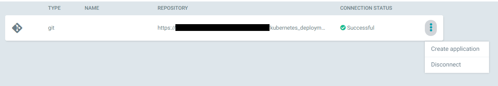

# Timo Wortmann

### Thema

**Evaluierung von Continuous Deployment Ansätzen auf Kubernetes**

### Fragestellungen

- Welche Ansätze gibt es?
  - z.B. Push- und Pull-based
  - Stichwort GitOps
- Welche Tools gibt es für die jeweiligen Ansätze?
  - Pull: ArgoCD, Fleet, Keel, ...
  - Push: Jenkins, GitHub Actions, Drone, ...
  - Sonstige: Terraform, Ansible, ...
- Welches Tool eignet sich am besten im Hinblick auf Sicherheit, Nutzbarkeit & Schnelligkeit?
  - Kriterien aus der ISO 25010
  - Sicherheit: 
    - Access Control (RBAC)
    - Wer darf es auslösen?
  - Nutzbarkeit: 
    - Wie einfach ist die Bedienung/Konfiguration/Installation?
    - Gibt es wiederverwendbare Teile?
  - Schnelligkeit: 
    - Wie lange dauert es vom Commit im Git zu laufender Anwendung?

### Inhalt

- Untersuchung und Erklärung der Ansätze
  - Push
  - Pull
- Vorstellung mehrerer Tools
  - Drone CI (Push)
  - Argo CD (Pull)
  - Flux CD (Pull)
  - je nach Zeit noch mehr Tools
- Verwendung der Tools mit Anwendungsfall
  - Eigene Entwicklung aus Unternehmen (Web-Applikation)
  - Helm Chart TIG Stack
  - Harbor
- Vergleich der Tools/Ansätze nach Kriterien:
  - https://cloud.google.com/blog/products/devops-sre/using-the-four-keys-to-measure-your-devops-performance
  - Lead Time for Changes - Zeit vom Commit zu laufender Anwendung
  - Time to Restore Service - Wie lange es dauert, bis der Service aus einem Fehlerfall wieder hergestellt wurde
  - Aufwand bei Skalierung - wie schnell kann das Setup kopiert / neu aufgesetzt werden (im 2ten Git Repo)
  - Usability/nutzbarkeit - Wie einfach kann das Tool installiert und verwendet werden
- Fazit

### Zeitplan

| Woche | Inhalt                                               |
| ----- | ---------------------------------------------------- |
| 17    | Einarbeitung Kubernetes                              |
| 18    | Einarbeitung  Deployment Ansätze + Tools             |
| 19    | Aufbau Entwicklungsumgebung                          |
| 20    | Testaufbau manuelles Deployment + Einarbeitung Tools |
| 21    | Einlesung + Aufbau Toolchain                         |
| 22    | Implementierung + Durchführung                       |
| 23    | Durchführung + Dokumentation Ergebnisse              |
| 24    | Dokumentation Ergebnisse + Ausarbeitung              |
| 25    | Finalisierung Ausarbeitung + Ergebnisse              |
| 26    | Vorstellung + Abgabe                                 |

### TODO

- [X] Festlegung Kriterien und Tools
- [x] Aufbau Entwicklungsumgebung
- [X] Testaufbau manuelles Deployment
- [X] Installation verwendeter Tools
- [X] Durchführung
- [X] Dokumentation Theoretische Grundlagen
- [X] Erstellung Architekturdiagramme
- [X] Dokumentation Durchführung
- [X] Dokumentation Ergebnisse
- [ ] Überführung Ergebnisse auf firmeninternem Dokument + Schwärzung firmeninterner Daten

## Beschreibung der Aufgabenstellung

Das Ziel dieser Praktikumsaufgabe ist es, verschiedene Ansätze des Continuous Deployments auf Kubernetes zu vergleichen und zu evaluieren. Der Hintergrund für diese Untersuchung ist der Aufbau einer Kubernetes Infrastruktur in dem Unternehmen WAGO GmbH & Co. KG. Für den AUfbau einer solchen Infrastruktur in dem Unternehmen soll Continuous Deployment angewandt werden, allerdings gibt es noch keine Ferstlegung auf eine Software, die diesen Teil übernimmt. Diese praktische Untersuchung soll daher den Unterschied zwischen verschiedenen Ansätzen aufzeigen und die Lösungen im Kontext des Unternehmens bewerten.

**Hinweis: Alle unternehmensinternen Daten (IP-Adressen, Web-Links, Namen von Benutzerkonten, etc.) wurden in der folgenden Ausarbeitung zur Sicherheit unkenntlich gemacht oder verändert.**

## Theoretische Grundlagen

### Kubernetes

Kubernetes ist eine Orchestrierungsplattform für Container. Durch die Verbindung von mehreren Nodes zu Clustern kann Kubernetes Load Balancing, Verteilung von persistentem Speicher und Deployments, Überprüfung von Service Health und Secret- sowie Konfigurationsmanagement übernehmen. Ein Continuous Deployment Workflow ist in  Kubernetes nicht integriert und muss durch eine externe Software bereitgestellt werden [[1]](#ref-1).

### GitOps & Ansätze des Deployments

Die in dieser Ausarbeitung behandelten Arten des Deployments basieren alle auf dem Ansatz *GitOps*. Der Begriff wurde 2017 von Weaveworks definiert. Es handelt sich dabei um ein Modell zum Betrieb von Kubernetes-Clustern und cloud-nativen Anwendungen. Dabei gilt, dass alle Dateien eines Deployments in einem Versionskontrollsystem (z.B. Git) vorliegen und dass die Dateien im Versionskontrollsystem immer dem gewünschtem Stand des Deployments in der Realität entsprechen. Das Ziel ist es, dass es nur einen Stand der Wahrheit gibt. Die Unterschiede zwischen den Dateien in dem Versionskontrollsystem und der Realität werden durch die Continuous Deployment Software oder andere Automatisierungsprozesse übernommen [[2]](#ref-2).

Deployments auf Kubernetes-Clustern werden durch YAML-Dateien beschrieben. Für das Deployment solcher Dateien gitb es zwei verschiedene Ansätze: *Push* und *Pull*.
Bei dem Push Ansatz wird eine CI/CD Pipeline verwendet, um bei Änderungen an den Dateien im Versionskontrollsystem diese neu zu deployen. Der Ansatz eignet sich, wenn neben dem Deployment noch weitere Schritte ausgeführt werden sollen, z.B. die dynamische Generierung von Zertifikaten oder Konfigurationsdateien, oder wenn bereits eine CI/CD Pipeline vorhanden ist, da diese dann nur erweitert werden muss.
Bei dem Pull Ansatz wird in dem gewünschten Kubernetes-Cluster ein Agent installiert, der in regelmäßigen Abständen den Stand der Dateien abfragt und bei Abweichungen die nötigen Änderungen vornimmt. Diese Methode hat die Vorteile, dass der Cluster nicht von außen, bzw. durch ein externes System, erreichbar sein muss, um das Deployment durchzuführen, und dass der Agent auch wieder durch ein Versionskontrollsystem verwaltet werden kann und somit dem GitOps Ansatz folgt [[3]](#ref-3).

## Verwendete Ressourcen

### Programme für das Deployment

Um die Ansätze *Push* und *Pull* zu vergleichen, werden beide Ansätze mit unterschiedlichen Programmen durchgeführt.
Für den *Push* Ansatz eignen sich Programme wie Jenkins, GitHub Actions oder Drone CI. Für diese Ausarbeitung wird Drone CI verwendet, da es bereits in dem Unternehmen angewandt wird und daher keine weitere Infrastruktur benötigt wird.
Für den *Pull* Ansatz gibt es viele weitere Programme wie beispielsweise Argo CD, Flux CD, Helm, Spinnaker und Harness. Im Rahmen dieser Ausarbeitung werden Argo CD und Flux CD verwendet, da diese in dem Bereich marktführend sind und eine große Community besitzen (Anzahl der GitHub Sterne 9.600 bei Argo CD[[4]](#ref-4) und 3.500 bei Flux CD[[5]](#ref-5)).

### Kubernetes Cluster

Der Kubernetes-Cluster, auf dem die Versuche durchgeführt werden, befindet sich im Rechenzentrum des Unternehmens und ist nicht über das Internet erreichbar. Es handelt sich dabei um einen Kubernetes Cluster mit einer Node, welcher durch die Kubernetes Engine [RKE](https://rancher.com/products/rke) aufgesetzt wird. RKE verbindet sich per SSH auf den angegebenen Nodes und legt dort die für Kubernetes benötigten Komponenten (kubelet, etcd, ...) als Docker Container an. Auch hier handelt es sich um eine Software, die bereits im Unternehmen verwendet wird. Alternativen dafür sind [minikube](https://minikube.sigs.k8s.io/docs/start/) oder [kubeadm](https://kubernetes.io/docs/setup/production-environment/tools/kubeadm/create-cluster-kubeadm/).
Ein Vergleich zu Deployments auf anderer Infratstruktur, z.B. Microsoft Azure oder Amazon EKS, ist nicht vorgesehen.

### Anwendungen zum Deployen

Um einen aussagekräftigen Vergleich der verschiedenen Ansätze und Tools durchführen zu können, werden im Rahmen dieser Ausarbeitung auch mehrere Deployments mit unterschiedlicher Architektur durchgeführt.

#### Selbstentwickelte Webandwendung

Bei dem ersten Deployment handelt es sich um eine containerisierte Webanwendung des Unternehmens. Diese wurde **nicht** im Rahmen dieser Ausarbeitung entwickelt, sondern davor. Die Anwendung besteht aus einem einzigen Container, welcher allerdings Zugansdaten über Secrets benötigt. Vor dieser Ausarbeitung wurde die Anwendung noch nicht in einem Kubernetes-Cluster betrieben und muss daher noch in eine Form umgewandelt werden, wodurch sie auf Kubernetes lauffähig ist.

#### Harbor

[Harbor](https://github.com/goharbor/harbor) ist eine Open Source Container Registry, welche standardmäßig auf Kubernetes gehostet wird. Es ist eine Anwendung, die auf Kubernetes installiert wird und dabei aus mehreren Komponenten inklusive Datenbank, Registry und Logging-Service besteht. Die Anwendung bietet die Funtkion, Images von Containern hoch- und herunterzuladen, und benötigt daher einen persistenten Speicher. Das Ziel ist es, eine Harbor-Instanz mit Hilfe der zu evaluierenden Programme auf dem Cluster zu installieren.

#### TIG-Stack

Bei dem TIG-Stack handelt es sich um einen Monitoring-Stack bestehend aus den Programmen Telegraf, InfluxDB und Grafana. Telegraf ist ein Agent, welcher Messwerte über ein bestimmtes System sammelt, z.B. Verbrauch von CPU und Arbeitsspeicher. Durch den Telegraf Agent werden die Daten in die InfluxDB geschrieben. Es handelt sich dabei um eine Datenbank für Zeitreihendaten. Das Grafan verbindet sich mit der InfluxDB und kann mit Hilfe von Dashboards und Graphen die gesammelten Daten visualisieren. Das Ziel ist es, einen lauffähigen Stack zu deployen, in dem die drei Komponenten automatisch miteinander verbunden sind und Daten untereinander austauschen können.

### Sonstige Software

Als zusätzliche Software wird auf dem Cluster das Management-Portal [Rancher](https://rancher.com/) installiert. Rancher ist eine Open Source Software und bietet ein Webinterface zum Verwalten eines oder mehrerer Kubernetes Cluster. Es dient für diese Aufgabe lediglich zur Unterstützuung bei Fehlern und zur besseren Darstellung und Überwachung der aktuellen Deployments. Rancher wird nicht über die Continuous Deployment Software installiert, sondern manuell.

## Bewertungskriterien

Der Vergleich der CD-Programme wird anhand verschiedener Bewertungskriterien durchgeführt. Diese sind Lead Time for Changes (wie lange es vom Commit im Git zur laufenden Anwendung dauert), Time to Restore Service (wie lange es dauert, bis ein ausgefallener Dienst wieder hergestellt werden kann), der benötigte Aufwand bei Skalierung (hinzufügen neuer Repositories und Kubernetes Ressource), Nutzbarkeit des Programms und Sicherheit (Zugriffsrechte, Absicherung, etc.). Kennzahlen wie die Time to Restore Service und Lead Time for Changes können in Sekunden gemessen und als Zahlenwerte vergleicht werden. Die anderen Kriterien werden textuell beschrieben.

## Durchführung

### Aufsetzen des Clusters

Der erste Schritt der Durchführung ist die Installation des Kubernetes Clusters. Dazu wird die Rancher Kubernetes Engine (RKE) verwendet. Dazu kann mit dem Befehl `rke config` durch die interaktive Kommandozeile eine Konfigurationsdatei erstellt werden, die den Cluster beschreibt.


*Abbildung 1: Ausschnitt des Befehls `rke config`*

Daraufhin kann durch die entstandene [Konfigurationsdatei](./files/rke_config.yml) mit dem Befehl `rke up` der Cluster erstellt werden.

Zum weiteren Aufsetzen des Clusters gehört die Installation der Rancher Benutzeroberfläche. Diese ist als Helm Chart verfügbar. Helm ist ein Paketmanager für Kubernetes, worüber vordefinierte Pakete auf Clustern installiert werden können. Dazu müssen folgende Befehle ausgeführt werden:

```bash
helm repo add rancher-latest https://releases.rancher.com/server-charts/latest

kubectl create namespace cattle-system

kubectl -n cattle-system create secret generic tls-ca-additional --from-file=ca-additional.pem=tls/ca.crt

kubectl -n cattle-system create secret generic tls-ca --from-file=cacerts.pem=tls/ca.crt

kubectl -n cattle-system create secret tls tls-rancher-ingress --cert=tls/tls.crt --key=tls/key.pem

helm install rancher rancher-latest/rancher --namespace cattle-system -f values.yml
```

Zuerst wird das Repository der Helm Chart hinzugefügt und ein Namespace in dem Cluster erzeugt. Daraufhin müssen die Zertifikate für die Weboberfläche und die Kommunikation von Rancher zu anderen Systemen hinterlegt werden.
Bei dem Befehl `helm install` wird Rancher installiert und mit eigenen Parametern aus der Datei [`values.yml`](./files/rancher/values.yml) konfiguriert. In der Datei werden unter anderem der Hostname der Rancher Instanz und das Initialpasswort festgelegt. Im Anschluss ist die Weboberfläche über den angegebenen Hostnamen im Browser erreichbar.

### Manuelles Deployment

Bevor mit dem automatisierten Deployment begonnen wird, wurden die zu deployenden Anwendungen manuell auf dem Cluster installiert. Der Grund dafür ist, dass es sich bei den drei gewählten Programmen nicht um Standardinstallationen handelt, sondern jede davon noch zusätzliche Konfiguration benötigt. Das Ziel ist es, alle drei Anwendungsfälle zuerst manuell auf Kubernetes lauffähig zu installieren und sie danach in den CD-Programmen zu verwenden. Dazu kommt, dass die selbstentwickelte Anwendung und der TIG-Stack bisher nur als Docker-Container (bzw. Docker-Compose) vorliegen. Daher müssen noch die entsprechenden Kubernetes Ressourcen erstellt und konfiguriert werden.

Alle für das Deployment benötigten Dateien sind im Ordner [files/deployment](./files/deployment) zu finden.

##### Webanwendung

Die Webanwendung besteht nur aus einem einzigen Container und ist stateless, es werden deshalb keine Volumes benötigt. Trotzdem benötigt die Anwendung Umgebungsvariablen zur Authentifizierung, die in Form von Kubernetes Secrets übergeben werden sollen. Die gesamte Anwendung besteht daher aus einem Deployment des Containers, den Secrets für die Authentifizierung, einem Service zum Erreichen des Containers und einem Ingress, damit die Weboberfläche auch ausserhalb des Clusters über einen gewünschten Hostnamen erreichbar ist. Zusätzlich muss das Zertifikat der lokalen Certificate Authority (CA) im Container liegen, da die Anfragen zur Authentifizierung aufgrund eines selbstsignierten Zertifikats fehlschlagen.

#### TIG-Stack

Die Kubernetes Ressourcen des TIG-Stacks sind ähnlich zu der Webanwendung. Es gibt drei Deployments für die einzelnen Komponenten (Grafana, Telegraf, InfluxDB) und zwei Services und Inrgesse für den Webzugriff auf Grafana und InfluxDB. Dazu kommen die Konfiguration von Grafana und Telegraf durch ConfigMaps. ConfigMaps in Kubernetes enthalten Konfigurationsdaten, die als Datei in dem Container gemountet werden können. Darüber werden unter anderem das Initialpasswort von Grafana und die Metriken, die der Telegraf Agent sammeln soll, konfiguriert. 

Da die Daten in der InfluxDB persistent vorliegen sollen, muss dafür noch ein persistentes Volume mit dazugehörigem Claim angelegt werden. Die Daten werden durch den Typ `hostPath` auf dem Server gespeichert, auf dem der Cluster läuft. In einer produktiven Nutzung ist es auch sinnvoll, den Speicherort zentralisiert zu legen, z.B. auf einem NFS-Server oder Netzwerkspeicher. Der Grund dafür ist, dass ein Cluster mehrere Nodes haben kann und dadurch nicht mehr sichergestellt ist, ob die Dateien auch auf der richtigen Node liegen.

#### Harbor

Harbor an sich benötigt keine weiteren Kubernetes Ressourcen, da alle benötigten Komponenten durch das Installieren der Helm Chart auch mit installiert werden. Die Installation wird wie bei Rancher auch nur über eine `values.yml` Datei konfiguriert. Darin werden wieder Hostname, Initialpasswort und Art der Dateispeicherung definiert.

Da in dem Testcluster kein Storage Provisioner installiert ist, der automatisch Volumes erzeugt und benötigten Speicherplatz zuweist, sind die Volumes der Harbor-Komponenten zusätzlich definiert. Dadurch müsssen neben der Helm Chart weitere Kubernetes Ressourcen deployed werden. In der Konfigurationsdatei der Helm Chart wird dann auf die existierenden Volume Claims referenziert.

### Installation der Continuous Deployment Programme

Im nächsten Schritt werden die Continuous Deployment Programme FluxCD, ArgoCD und Drone installiert.

#### Drone

Für Drone ist keine weitere Installation notwendig, da es bereits eine Unternehmensinterne Instanz gibt, die für das Praktikum verwendet werden kann. Weitere Schritte sind nur in der Durchführung notwendig.

#### Argo CD und Flux CD

Die Installation von Argo CD und FLux CD wurden nach den Anleitungen aus der jeweiligen Dokumentation [[6](#ref-6), [7](#ref-7)] übernommen:

Durch den Befehl `kubectl apply -n argocd -f https://raw.githubusercontent.com/argoproj/argo-cd/stable/manifests/install.yaml` werden die vordefinierten Ressourcen für Argo CD installiert. Danach kann auf das Programm entweder über die Kommandozeile oder die Weboberfläche von Argo CD zugegriffen werden.

Flux CD noch offen


### Deployment der Anwendungen

#### Drone

#### Argo CD

Das Deployment der Ressourcen über Argo CD kann über die Weboberfläche oder Kommandozeile erfolgen. Für dieses Praktikum wird die Weboberfläche verwendet.

im ersten Schritt erfolgt die Anmeldung auf der Weboberfläche. Da kein externer Identity Provider eingestellt ist, wird nur das Initialpassword benötigt, welches mit dem Befehl `kubectl -n argocd get secret argocd-initial-admin-secret -o jsonpath="{.data.password}" | base64 -d; echo` ausgelesen werden kann [[6]](#ref-6). 

Daraufhin wird das Repository hinzugefügt, aus dem die Definitionen der Kubernetes Ressourcen stammen. Das Hinzufügen erfolgt in der Weboberfläche über `Manage your repositories, projects, settings -> Repositories -> Connect Repository using HTTPS`. In einer produktiven Nutzung ist es empfehlenswert, für die hinterlegten Zugriffsdaten auf das Repository entweder eine GitHub App zu registrieren oder einen Account zu verwenden, der keiner realen Person zugeordnet ist. Dadurch gibt es eine strikte Trennung der Zugriffsrechte (z.B. nur lesenden Zugriff) und es gibt keine Probleme, wenn ein Entwickler aus dem Repository entfernt wird.


*Abbildung 2: Hinzurügen eines Repositories bei Argo CD*

Auf der Übersichtsseite der Repositories kann nun direkt eine Applikation aus dem Repository erstellt werden:



*Abbildung 3: Hinzurügen einer Applikation bei Argo CD*

In der darauf geöffneten Übersicht können Optionen bezüglich des Git-Branches und Ordners und der Sync-Policy eingestellt werden:


*Abbildung 4: Konfiguration einer Applikation bei Argo CD*

Für das Praktikum ist die Sync Policy `Automatic` mit den Optionen `Prune Resources` und `Self Heal` ausgewählte. Durch die automatische Synchronisation werdne Änderungen im Git-Repository erkannt. Durch `Prune Resources` werden nicht mehr vorhandene Ressourcen gelöscht und durch `Self Heal` werden alle Änderungen, die nicht dem Stand im Repository entsprechen, sofort überschrieben. Diese Optionen wurden so gewählt, damit es möglichst keine Unterschiede zwischen dem Stand im Repository und der Wirklichkeit entsteht (Prinzip nach GitOps).

Das Anlegen einer Applikation bei Argo CD erfolgt dreimal, für die Webanwendung, Harbor und den TIG-Stack. Der Unterschied ist nur der Name der Applikation, der Kubernetes Namespace und der Ordnerpfad im Git-Repository.

Das Deployment von Harbor erfolgt als Helm-Chart. Anstelle eines Git-Repositories kann bei Argo CD auch ein Helm-Chart Repository als Quelle ausgewählt werden. Dabei muss sich die Konfigurationsdatei `values.yml`, wodurch die Anwendung konfiguriert wird, sich im gleichen Repository befinden, wie die Helm Chart. Da sich die Harbor Helm-Chart in einem öffentlichen Repository befindet, wird als Quelle das interne Git-Repository verwendet, in dem durch die Datei `kustomization.yml` auf das öffentliche Repository referenziert wird. Damit dies funktioniert, muss in dem Kubernetes Secret `argocd-cm` der Key `kustomize.buildOptions` auf den Wert `--enable-helm` gesetzt werden, da das Deployment ohne die Option fehlschlägt [[8]](#ref-8).

Nach der Einrichtung der Applikationen sind die definierten Ressourcen erfolgreich auf dem Cluster deployed. In der Weboberfläche von Argo CD befindet sich auch eine Übersicht der Applikationen mit Status, welche Komponenten noch nicht erfolgreich waren.


*Abbildung 5: Übersicht der Argo CD Applikationen mit Health Status* 

## Bewertung

## Referenzen

<span id="ref-1">[1]: *What is Kubernetes?*, 2022. Verfügbar unter https://kubernetes.io/docs/concepts/overview/what-is-kubernetes/, zuletzt zugegriffen am 20.6.2022.</span>

<span id="ref-2">[2]: M. D'Amore, *GitOps and ArgoCD: Continuous deployment and maintenance of a full stack application in a hybrid cloud Kubernetes environment*, 2021. Verfügbar unter https://webthesis.biblio.polito.it/18142/1/tesi.pdf, zuletzt zugegriffen am 20.06.22</span>

<span id="ref-3">[3]: W. Chia, *Push vs. Pull in GitOps: Is There Really a Difference?*, 2021. Verfügbar unter https://thenewstack.io/push-vs-pull-in-gitops-is-there-really-a-difference/, zuletzt zugegriffen am 20.06.22</span>

<span id="ref-4">[4]: *Argo CD GitHub*. Verfügbar unter https://github.com/argoproj/argo-cd/, zuletzt zugegriffen am 20.06.22</span>

<span id="ref-5">[5]: *Flux CD GitHub*. Verfügbar unter https://github.com/fluxcd/flux2, zuletzt zugegriffen am 20.06.22</span>

<span id="ref-6">[6]: *Argo CD Getting started*. Verfügbar unter https://argo-cd.readthedocs.io/en/stable/getting_started/, zuletzt zugegriffen am 22.06.22</span>

<span id="ref-7">[7]: *Flux CD Installation*. Verfügbar unter https://fluxcd.io/docs/installation/, zuletzt zugegriffen am 22.06.22</span>

<span id="ref-8">[8]: *Argo CD Issue: Support --enable-helm flag for kustomize*. Verfügbar unter https://github.com/argoproj/argo-cd/issues/7835, zuletzt zugegriffen am 23.06.22</span>
