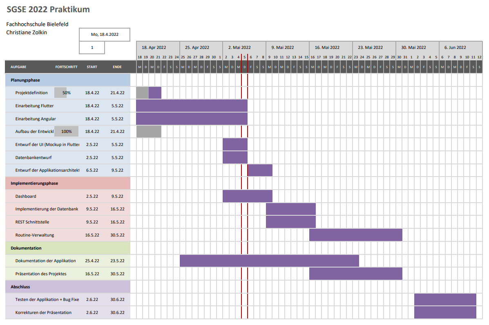

# Christiane Zolkin

Link zur Ausarbeitung:

https://www.overleaf.com/read/fpdvbshfytmq

Link zum Github-Repository:

https://github.com/ChrisZol/RoutinedApp.git

## Fragestellung

- Web Entwicklung mit Flutter: Ein direkter Vergleich zu dem Framework Angular am Beispiel einer Web-Anwendung
- Cross-platform Entwicklung mit Flutter: Ein direkter Vergleich zu dem Ionic Angular Framework

## Projektmotivation

Webentwicklung ist ein Bereich, der in den letzten Jahrzehnten an hoher Relevanz gewonnen hat. In so gut wie jedem Unternehmen ist es eine Notwendigkeit, sich mit einer Website zu repräsentieren, ein großer Anteil der Zeit wird im Durchschnitt in soziale Netzen verbracht, und es existieren viele Anwendungen, die Nutzern im alltäglichen Leben aushelfen sollen. Aus diesem Grund besteht ein immer größer werdender Bedarf, Web-Anwendungen möglichst produktiv und effizient zu entwickeln, während die Nutzerschnittstelle besonders responsive, adaptiv, modern und einfach zu gestalten gilt. Aus diesem Grund sind bereits viele Web-Frameworks vorhanden, die den Entwicklungsprozess von Webapplikationen vereinfachen sollen.

Im Rahmen dieses Projektes wird daher das aufsteigende Framework Flutter in den direkten Vergleich mit dem bekannten Framework Angular gesetzt, um diese beiden in Hinblick gewisser Punkte zu analysieren.

## Projektidee

Die formulierte Fragestellung soll anhand eines Projektes beantwortet werden, bei welchem eine Web-Applikation mit zwei unterschiedlichen Google Frameworks entwickelt wird: Flutter und [Ionic] Angular. Um einen direkten Vergleich der Frameworks zu erreichen, ist das Frontend-Design, die Funktionalitäten und die zugrundeliegende Datenbank der beiden Applikationen identisch. Die Implementierung der Client-Seite soll hierbei weitestgehend parallel erfolgen, sodass die korrespondierenden Komponenten und deren Implementierung direkt gegenübergestellt werden können.

Während des Entwicklungsprozesse werden einige Aspekte untersucht, die Ausschluss über die allgemeine "Developer Experience" geben soll. Dazu zählen die Framework-Dokumentation und die Erlernbarkeit der Syntax, das Aufsetzen der Entwicklungsumgebung und Applikationsarchitektur, sowie bereitgestellte Packages und Ressourcen. Der Build-, Debbuging- und der Deployment-Prozess sollen ebenfalls bewertet werden.

Neben der Entwickler-Erfahrung wird außerdem die Performanz der Applikation, und die Integrierbarkeit in andere Plattformen betrachtet.

## Projektplan

## Software Design

### "Routined" Web Application

### Frontend

#### Home Page

#### Routines Overview

#### Routine View

#### Task View

### Backend

### Server

- Node.js
- Dependencies:
  - Nodemon
  - Express.js
  - Web Socket

#### Datenbank

Als lokale Datenbank für die Applikation wird Sqlite bzw. Sqlflite genutzt. Das Schema wird dabei recht einfach gehalten, da der Fokus in diesem Projekt nicht auf der Datenverwaltung liegt.

## Implementation

### Setup

| Flutter                                                      | Angular |
| ------------------------------------------------------------ | ------- |
| Downloading Flutter SDK (over 2GB disk space necessary)      |         |
| For web development, Google Chrome is the prefered browser to be used |         |
| IDE: Flutter Plugin available for Android Studio and IntelliJ, VS Code and EmacsFor this project, VS Code will be used |         |
| Getting started: Step by step guide, detailed documenation and tutorials |         |
| Setting up the application: Flutter CLI provides commands which set up flutter sample projects of choice (with all necessary dependancies) |         |

### Development

| Flutter                                                      | Angular |
| ------------------------------------------------------------ | ------- |
| Easy switch between end devices (browser, Android/IOS Emulators,...) in the VS Code IDE possible |         |
| CLI:                                                         |         |
| During runtime, hot reloads of code changes are supported -> Great developer experience, Time saving, Supports experimental coding (high learning curve) |         |
| Works with an easy to understand Widget structure            |         |
| CORS Error when using Node.js Backend -> Workarounds necessary to make Server HTTP Requests |         |

### Debugging/Performance

| Flutter                                                      | Angular |
| ------------------------------------------------------------ | ------- |
| Flutter DevTools: Application Inspection, Performance View, CPU Profiler View, Memory View, Debbuger View, Network View, Logging View, App Size Tool |         |
| Provides a performance overlay in the application            |         |
| [Flutter vs Native vs React-Native: Examining Performance (inveritasoft.com)](https://inveritasoft.com/blog/flutter-vs-native-vs-react-native-examining-performance) |         |